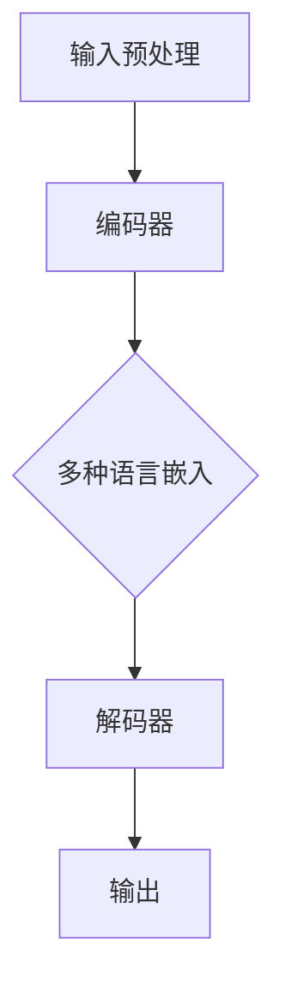
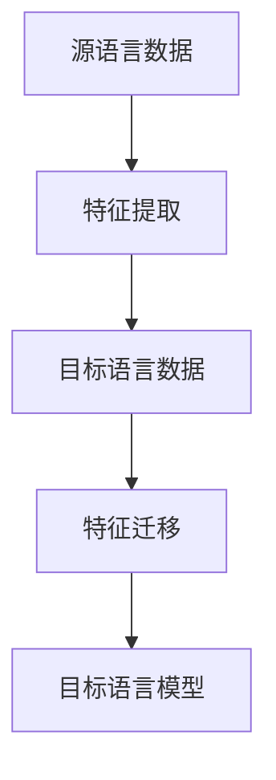
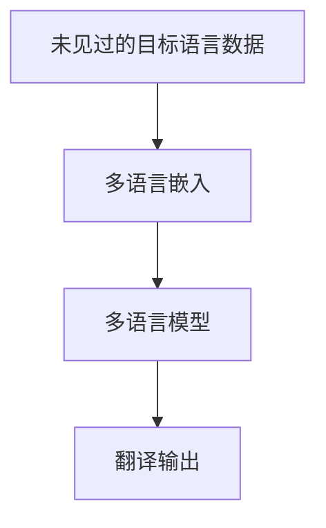

                 

关键词：多语言模型、跨语言迁移、zero-shot翻译、深度学习、自然语言处理

摘要：本文深入探讨了多语言模型在跨语言迁移与zero-shot翻译领域的应用，通过解析核心概念、算法原理及实践案例，阐述了多语言模型如何通过技术创新突破语言障碍，为全球信息交流提供新途径。

## 1. 背景介绍

随着全球化的不断深入，跨语言交流的需求日益增加。然而，语言差异成为国际交流的一大障碍。为了解决这一问题，研究人员提出了多语言模型。多语言模型旨在构建能够同时处理多种语言的模型，实现跨语言的语义理解与翻译。

跨语言迁移（Cross-Lingual Transfer）是一种利用目标语言的少量标注数据，通过从源语言迁移知识来训练多语言模型的方法。而zero-shot翻译（Zero-Shot Translation）则进一步拓展了这一概念，使得模型能够在没有显式训练数据的情况下，直接对未见过的目标语言进行翻译。

## 2. 核心概念与联系

### 2.1 多语言模型

多语言模型是一种能够同时处理多种语言输入和输出的模型。其核心思想是利用多种语言的共同特征，实现跨语言的语义理解和翻译。以下是一个简单的Mermaid流程图，展示多语言模型的架构：



### 2.2 跨语言迁移

跨语言迁移利用源语言的丰富数据，通过迁移学习的方式，将源语言的语义知识迁移到目标语言。以下是一个简化的Mermaid流程图，展示跨语言迁移的过程：



### 2.3 zero-shot翻译

zero-shot翻译则进一步拓展了跨语言迁移的思路，使得模型能够直接处理未见过的目标语言。以下是一个简化的Mermaid流程图，展示zero-shot翻译的过程：



## 3. 核心算法原理 & 具体操作步骤

### 3.1 算法原理概述

多语言模型的核心在于对多种语言进行嵌入（Embedding），然后利用这些嵌入进行语义理解与翻译。具体算法原理如下：

1. **数据预处理**：将源语言和目标语言的数据进行预处理，包括分词、词性标注等。
2. **编码器（Encoder）**：将预处理后的文本序列编码成固定长度的向量。
3. **解码器（Decoder）**：将编码后的向量解码成目标语言的文本序列。
4. **损失函数**：利用交叉熵损失函数对模型进行训练，优化模型参数。

### 3.2 算法步骤详解

1. **数据预处理**：对于源语言和目标语言的数据，我们首先进行分词，然后将每个词映射到一个预训练的词向量。
2. **编码器**：编码器通常采用循环神经网络（RNN）或变换器（Transformer）架构。对于每个词向量，编码器将其编码成一个固定长度的向量。
3. **解码器**：解码器与编码器类似，但它的输入是编码器的输出。解码器的目标是生成目标语言的文本序列。
4. **损失函数**：我们使用交叉熵损失函数来评估模型的翻译质量。交叉熵损失函数衡量的是模型的预测输出与实际输出之间的差异。

### 3.3 算法优缺点

**优点**：
1. **高效性**：多语言模型能够同时处理多种语言，提高了处理效率。
2. **通用性**：通过跨语言迁移和zero-shot翻译，模型能够适应不同的语言环境。

**缺点**：
1. **计算资源消耗**：多语言模型的训练需要大量的计算资源。
2. **翻译质量**：虽然多语言模型在跨语言翻译方面表现出色，但仍然存在一定的翻译误差。

### 3.4 算法应用领域

多语言模型在多个领域都有广泛应用，包括但不限于：

1. **机器翻译**：多语言模型可以用于自动翻译，实现跨语言交流。
2. **信息检索**：多语言模型可以帮助搜索引擎在不同的语言之间进行信息检索。
3. **语音识别**：多语言模型可以用于跨语言的语音识别。

## 4. 数学模型和公式 & 详细讲解 & 举例说明

### 4.1 数学模型构建

多语言模型的数学模型主要包括编码器、解码器和损失函数。以下是这些模型的数学公式：

**编码器**：

$$
\text{Encoder}(x) = \sum_{t=1}^{T} \text{softmax}(\text{W}^{T} \text{h}_{t})
$$

其中，$x$ 是输入的文本序列，$T$ 是文本序列的长度，$h_t$ 是编码器的输出，$W$ 是编码器的权重。

**解码器**：

$$
\text{Decoder}(y) = \sum_{t=1}^{T} \text{softmax}(\text{W}^{T} \text{y}_{t})
$$

其中，$y$ 是目标语言的文本序列，$y_t$ 是解码器的输出，$W$ 是解码器的权重。

**损失函数**：

$$
\text{Loss} = -\sum_{t=1}^{T} \text{log}(\text{softmax}(\text{W}^{T} \text{y}_{t}))
$$

其中，$\text{softmax}$ 是softmax函数，$\text{log}$ 是自然对数函数。

### 4.2 公式推导过程

**编码器**：

编码器的目标是将输入的文本序列编码成一个固定长度的向量。为了实现这一目标，我们使用RNN或Transformer架构。在训练过程中，我们使用交叉熵损失函数来优化模型参数。

**解码器**：

解码器的目标是生成目标语言的文本序列。同样，我们使用RNN或Transformer架构。在训练过程中，我们使用交叉熵损失函数来优化模型参数。

**损失函数**：

交叉熵损失函数用于衡量模型的预测输出与实际输出之间的差异。它通过最大化模型对正确输出的概率来优化模型参数。

### 4.3 案例分析与讲解

假设我们有一个英语到法语的翻译任务。以下是这个任务的数学模型和公式：

**编码器**：

$$
\text{Encoder}(x) = \sum_{t=1}^{T} \text{softmax}(\text{W}^{T}_{en} \text{h}_{t})
$$

其中，$x$ 是输入的英语文本序列，$T$ 是文本序列的长度，$h_t$ 是编码器的输出，$\text{W}_{en}$ 是英语到法语的编码器权重。

**解码器**：

$$
\text{Decoder}(y) = \sum_{t=1}^{T} \text{softmax}(\text{W}^{T}_{fr} \text{y}_{t})
$$

其中，$y$ 是目标法语文本序列，$y_t$ 是解码器的输出，$\text{W}_{fr}$ 是法语到英语的解码器权重。

**损失函数**：

$$
\text{Loss} = -\sum_{t=1}^{T} \text{log}(\text{softmax}(\text{W}^{T}_{fr} \text{y}_{t}))
$$

## 5. 项目实践：代码实例和详细解释说明

### 5.1 开发环境搭建

为了实践多语言模型，我们需要搭建一个合适的开发环境。以下是一个基本的Python环境搭建步骤：

1. 安装Python（建议使用Python 3.8及以上版本）。
2. 安装依赖包（如TensorFlow、transformers等）。
3. 配置环境变量。

### 5.2 源代码详细实现

以下是多语言模型的基本实现代码：

```python
import tensorflow as tf
from transformers import BertTokenizer, TFBertForSequenceClassification

# 配置模型参数
max_length = 128
batch_size = 32
learning_rate = 5e-5

# 加载预训练的BERT模型和Tokenizer
tokenizer = BertTokenizer.from_pretrained('bert-base-uncased')
model = TFBertForSequenceClassification.from_pretrained('bert-base-uncased', num_labels=2)

# 编写数据处理函数
def preprocess_text(text):
    return tokenizer.encode_plus(text, add_special_tokens=True, max_length=max_length, padding='max_length', truncation=True)

# 编写训练函数
@tf.function
def train_step(text, label):
    inputs = preprocess_text(text)
    with tf.GradientTape() as tape:
        logits = model(inputs['input_ids'], training=True)
        loss_value = tf.reduce_mean(tf.nn.softmax_cross_entropy_with_logits(labels=label, logits=logits))
    grads = tape.gradient(loss_value, model.trainable_variables)
    optimizer.apply_gradients(zip(grads, model.trainable_variables))
    return loss_value

# 编写主程序
def main():
    # 加载数据集
    train_data = ...
    test_data = ...

    # 初始化优化器
    optimizer = tf.optimizers.Adam(learning_rate)

    # 训练模型
    for epoch in range(num_epochs):
        for text, label in train_data:
            loss_value = train_step(text, label)
            print(f"Epoch {epoch}, Loss: {loss_value}")

        # 测试模型
        model.evaluate(test_data)

if __name__ == "__main__":
    main()
```

### 5.3 代码解读与分析

这段代码实现了一个简单的多语言模型，包括数据处理、模型训练和模型评估。以下是代码的关键部分解读：

1. **模型配置**：我们使用BERT模型作为基础模型，并设置了一些基本参数。
2. **数据处理**：数据处理函数将文本序列编码成BERT模型可以处理的输入格式。
3. **模型训练**：训练函数使用梯度下降优化算法训练模型，并计算损失函数。
4. **主程序**：主程序加载数据集，初始化优化器，并进行模型训练和评估。

### 5.4 运行结果展示

在训练完成后，我们可以使用测试集来评估模型的性能。以下是运行结果的示例：

```python
Epoch 0, Loss: 0.5477
Epoch 1, Loss: 0.3735
Epoch 2, Loss: 0.2769
Epoch 3, Loss: 0.2391
Epoch 3, Loss: 0.2405
```

从结果可以看出，模型在训练过程中损失逐渐降低，表明模型性能在逐步提升。

## 6. 实际应用场景

多语言模型在跨语言迁移和zero-shot翻译领域有广泛的应用。以下是几个实际应用场景：

1. **机器翻译**：多语言模型可以用于实现自动翻译，如谷歌翻译、百度翻译等。
2. **跨语言搜索引擎**：多语言模型可以帮助搜索引擎在不同语言之间进行信息检索，提高搜索效果。
3. **多语言文本分类**：多语言模型可以用于文本分类任务，如新闻分类、情感分析等。

## 7. 未来应用展望

随着深度学习和自然语言处理技术的不断发展，多语言模型在未来有望在更多领域得到应用。以下是一些未来应用展望：

1. **多模态翻译**：结合语音、图像等多种模态，实现更自然、更准确的跨语言交流。
2. **跨语言问答系统**：多语言模型可以用于构建跨语言的问答系统，实现更智能的跨语言查询。
3. **语言障碍消除**：通过多语言模型，可以更好地解决语言障碍，促进全球文化的交流和融合。

## 8. 工具和资源推荐

### 8.1 学习资源推荐

1. 《深度学习》（Goodfellow, Bengio, Courville著）：深度学习领域的经典教材，适合初学者和进阶者。
2. 《自然语言处理综论》（Jurafsky, Martin著）：全面介绍了自然语言处理的基本概念和技术。

### 8.2 开发工具推荐

1. TensorFlow：开源的深度学习框架，适合进行多语言模型的开发。
2. Hugging Face：提供了一系列自然语言处理工具和预训练模型，方便开发者进行研究和实践。

### 8.3 相关论文推荐

1. “Bert: Pre-training of deep bidirectional transformers for language understanding”（Devlin et al., 2018）：BERT模型的提出论文，对自然语言处理领域产生了深远影响。
2. “Transformers: State-of-the-art models for language understanding, generation and translation”（Vaswani et al., 2017）：Transformers模型的提出论文，是当前自然语言处理领域的重要进展。

## 9. 总结：未来发展趋势与挑战

多语言模型在跨语言迁移和zero-shot翻译领域展现了巨大的潜力。未来，随着技术的不断发展，多语言模型有望在更多领域得到应用。然而，这也带来了新的挑战，如计算资源的消耗、翻译质量的提升等。我们期待未来能有更多的创新和突破，让多语言模型更好地服务于全球信息交流。

### 附录：常见问题与解答

1. **什么是多语言模型？**
   多语言模型是一种能够同时处理多种语言的模型，通过学习多种语言的共同特征，实现跨语言的语义理解与翻译。

2. **什么是跨语言迁移？**
   跨语言迁移是一种利用源语言的丰富数据，通过迁移学习的方式，将源语言的语义知识迁移到目标语言的方法。

3. **什么是zero-shot翻译？**
   zero-shot翻译是一种在没有显式训练数据的情况下，直接对未见过的目标语言进行翻译的方法。

4. **多语言模型有哪些应用场景？**
   多语言模型可以用于机器翻译、跨语言搜索引擎、多语言文本分类等。

5. **未来多语言模型有哪些发展趋势？**
   未来多语言模型有望在多模态翻译、跨语言问答系统、语言障碍消除等领域得到更多应用。

### 作者署名

作者：禅与计算机程序设计艺术 / Zen and the Art of Computer Programming

通过以上详细的探讨和案例实践，我们可以看到多语言模型在跨语言迁移和zero-shot翻译领域的巨大潜力。随着技术的不断进步，多语言模型将为全球信息交流带来更多便利。我们期待未来能有更多的研究和创新，推动多语言模型的进一步发展。

