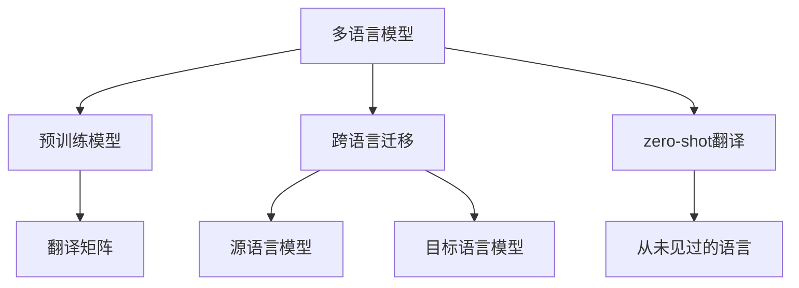

                 

关键词：多语言模型、跨语言迁移、zero-shot翻译、机器学习、神经网络、自然语言处理、数据集、预训练模型、语言学原理、性能优化。

> 摘要：本文将深入探讨多语言模型的原理、实现方法和应用场景，特别是跨语言迁移和zero-shot翻译这两个前沿技术。通过对这些核心概念的阐述，以及结合数学模型和具体项目实践，我们将理解多语言模型如何通过机器学习和神经网络技术，实现跨语言的信息传递和理解，并对未来发展趋势和挑战进行展望。

## 1. 背景介绍

多语言模型的兴起源于全球化进程中对跨语言交流的需求。传统的机器翻译系统依赖于大量对翻译对的双语语料库，通过统计模型或规则匹配来翻译语言。然而，这种方法面临着语料库限制、翻译质量不高以及无法处理罕见语言或领域特定文本的挑战。随着深度学习技术的发展，基于神经网络的机器翻译（Neural Machine Translation, NMT）成为主流，其能够通过学习大量单一语言的文本数据，实现更自然、更准确的翻译效果。

跨语言迁移（Cross-lingual Transfer Learning, XTL）是近年来发展迅速的一个方向。它通过在多个语言间共享知识，利用一种语言的学习结果来提高另一种语言的性能。这种方法能够显著降低对双语数据集的需求，使得在小语种或低资源语言中也能取得较好的翻译效果。

zero-shot翻译（Zero-shot Translation, ZST）则是一个更为前沿的概念，它允许模型在不接触目标语言数据的情况下，直接处理从未见过的语言翻译任务。这一技术突破了传统机器翻译的限制，对多语言处理领域具有深远的影响。

本文将首先介绍多语言模型的基本概念和架构，然后深入探讨跨语言迁移和zero-shot翻译的技术原理和实现方法，最后结合具体案例和项目实践，展示这些技术的应用前景和面临的挑战。

## 2. 核心概念与联系

### 2.1 多语言模型的基本概念

多语言模型（Multi-lingual Model）是一种能够在多种语言之间共享信息和知识的机器学习模型。其核心思想是通过将不同语言的数据投影到一个共同的语义空间中，使得不同语言之间的语义信息可以被有效捕捉和利用。多语言模型的关键组成部分包括：

- **预训练模型（Pre-trained Model）**：通常是基于大规模单一语言的文本数据预训练的神经网络模型，如BERT、GPT等。
- **翻译矩阵（Translation Matrix）**：用于将不同语言的词汇映射到共同语义空间的参数矩阵。
- **跨语言知识共享机制（Cross-lingual Knowledge Sharing Mechanism）**：通过共享权重、共享嵌入层等方式，使不同语言模型在共同语义空间中相互影响。

### 2.2 跨语言迁移的基本概念

跨语言迁移是机器学习中的一个重要分支，旨在利用一种语言的学习经验来提升其他语言的学习效果。其基本概念包括：

- **源语言（Source Language）**：用于训练模型的已见语言。
- **目标语言（Target Language）**：需要提升性能的未见语言。
- **共享表示（Shared Representation）**：通过预训练模型和翻译矩阵等机制获得的跨语言语义表示。
- **迁移学习（Transfer Learning）**：利用源语言模型的知识来改进目标语言模型的性能。

### 2.3 Mermaid 流程图

下面是一个简单的Mermaid流程图，用于描述多语言模型、跨语言迁移和zero-shot翻译之间的关系：



## 3. 核心算法原理 & 具体操作步骤

### 3.1 算法原理概述

多语言模型的核心算法原理可以归纳为以下几个步骤：

1. **预训练**：使用单一语言的文本数据对神经网络模型进行预训练，使其能够捕获语言的深层语义特征。
2. **翻译矩阵学习**：利用双语语料库，通过优化翻译矩阵，使得不同语言的词汇在共同语义空间中的映射关系更加合理。
3. **跨语言迁移**：将源语言模型的权重迁移到目标语言模型中，通过共享表示来提升目标语言的翻译性能。
4. **zero-shot翻译**：在没有任何目标语言数据的情况下，直接利用预训练模型和翻译矩阵进行翻译。

### 3.2 算法步骤详解

#### 3.2.1 预训练

预训练过程通常包括以下步骤：

1. **数据预处理**：对单一语言的文本数据进行清洗、分词和标记等预处理操作。
2. **模型初始化**：初始化一个基于神经网络的基础模型，如Transformer。
3. **无监督学习**：通过自注意力机制和多层神经网络，模型学习捕捉文本的语义特征。
4. **微调**：利用少量有监督数据对模型进行微调，进一步提升模型性能。

#### 3.2.2 翻译矩阵学习

翻译矩阵学习过程主要包括：

1. **数据采集**：收集大量的双语对语料库。
2. **矩阵初始化**：初始化一个高维翻译矩阵。
3. **矩阵优化**：通过梯度下降等优化算法，优化翻译矩阵，使得不同语言的词汇在共同语义空间中的映射更加合理。
4. **评估**：使用交叉熵损失函数评估翻译矩阵的效果，并进行迭代优化。

#### 3.2.3 跨语言迁移

跨语言迁移的具体步骤如下：

1. **源语言模型训练**：在源语言数据上训练模型，得到源语言模型的权重。
2. **目标语言模型初始化**：在目标语言数据上初始化目标语言模型。
3. **权重迁移**：将源语言模型的权重迁移到目标语言模型中，通过共享表示来提升目标语言的翻译性能。
4. **联合训练**：在源语言和目标语言数据上进行联合训练，进一步提升模型性能。

#### 3.2.4 zero-shot翻译

zero-shot翻译的具体步骤包括：

1. **预训练模型加载**：加载预训练的多语言模型。
2. **翻译矩阵加载**：加载翻译矩阵，用于不同语言之间的词汇映射。
3. **翻译过程**：通过输入源语言文本，模型自动将源语言文本映射到目标语言文本。
4. **结果评估**：使用评估指标（如BLEU分数）评估翻译结果。

### 3.3 算法优缺点

**优点**：

- **高效的跨语言翻译**：多语言模型能够利用多种语言的数据，实现高效的跨语言翻译。
- **减少对双语数据的需求**：跨语言迁移和zero-shot翻译技术能够减少对双语数据集的需求，降低小语种或低资源语言的翻译难度。
- **灵活性**：多语言模型和zero-shot翻译技术能够灵活应对各种语言翻译任务。

**缺点**：

- **翻译质量不稳定**：由于跨语言迁移和zero-shot翻译的复杂性，翻译质量可能会受到一定影响。
- **计算资源需求高**：预训练和模型优化过程需要大量的计算资源。

### 3.4 算法应用领域

多语言模型、跨语言迁移和zero-shot翻译技术在多个领域具有广泛的应用：

- **多语言翻译**：用于实现多种语言的机器翻译，满足全球化交流需求。
- **多语言信息检索**：用于跨语言搜索和信息检索，提升用户体验。
- **跨语言文本生成**：用于生成跨语言的文本内容，如机器写作、文章翻译等。
- **跨语言情感分析**：用于分析跨语言的文本情感，如社交媒体情感分析、跨国市场调研等。

## 4. 数学模型和公式 & 详细讲解 & 举例说明

### 4.1 数学模型构建

多语言模型中的数学模型主要包括以下几个部分：

1. **预训练模型**：通常采用Transformer模型，其数学模型可以表示为：

   $$ 
   \text{Transformer} = \text{Encoder}(\text{Input}) \to \text{Hidden States} 
   $$

2. **翻译矩阵**：用于不同语言之间的词汇映射，可以表示为：

   $$ 
   T = \text{softmax}(\text{W}_T) 
   $$

   其中，$\text{W}_T$是翻译矩阵的参数。

3. **跨语言迁移机制**：通过共享表示实现，可以表示为：

   $$ 
   \text{Target Language Model} = \text{Encoder}_T(\text{Input}_T) 
   $$

   其中，$\text{Encoder}_T$是目标语言模型的编码器，其权重由源语言模型的权重迁移而来。

4. **zero-shot翻译机制**：利用预训练模型和翻译矩阵进行翻译，可以表示为：

   $$ 
   \text{Translation} = T[\text{Source Language Embedding}, \text{Target Language Embedding}] 
   $$

### 4.2 公式推导过程

以Transformer模型为例，其自注意力机制的核心公式可以推导如下：

1. **自注意力权重计算**：

   $$ 
   \text{Attention} = \text{softmax}\left(\frac{\text{Q} \cdot \text{K}^T}{\sqrt{d_k}}\right) 
   $$

   其中，$\text{Q}$和$\text{K}$分别代表查询和键值嵌入，$d_k$是键值嵌入的维度。

2. **自注意力计算**：

   $$ 
   \text{Attention} \cdot \text{V} = \text{Output} 
   $$

   其中，$\text{V}$是值嵌入。

3. **多头注意力**：

   $$ 
   \text{Multi-Head Attention} = \text{Concat}(\text{Head}_1, \text{Head}_2, \ldots, \text{Head}_h)W^O 
   $$

   其中，$h$是头的数量，$W^O$是输出线性层。

### 4.3 案例分析与讲解

#### 4.3.1 预训练模型

以BERT模型为例，其预训练过程包括两个主要任务：Masked Language Modeling（MLM）和Next Sentence Prediction（NSP）。

1. **Masked Language Modeling（MLM）**：

   - **任务**：将输入文本中的部分单词或子词遮盖，模型需要预测这些遮盖的单词或子词。
   - **公式**：

     $$
     \text{Loss}_{MLM} = -\sum_{i}\sum_{\text{word}_i \in \text{masked}} \log(\text{P}(\text{word}_i | \text{context}))
     $$

   - **示例**：输入文本为 "The quick brown fox jumps over the lazy dog"，模型需要预测遮盖的单词 "quick"。

2. **Next Sentence Prediction（NSP）**：

   - **任务**：预测两个句子是否属于同一文档中的连续句子。
   - **公式**：

     $$
     \text{Loss}_{NSP} = -\sum_{i}\left[\log(\text{P}(\text{next sentence}_i)) + (1 - \text{next sentence}_i)\log(1 - \text{P}(\text{next sentence}_i))\right]
     $$

   - **示例**：输入两个句子 "The quick brown fox jumps over the lazy dog" 和 "It was not easy to catch" ，模型需要判断这两个句子是否属于同一文档。

#### 4.3.2 翻译矩阵学习

以多语言模型中的翻译矩阵学习为例，其公式推导过程如下：

1. **初始化翻译矩阵**：

   $$
   \text{W}_T \sim \text{Normal}(0, \frac{1}{\sqrt{d_v}}) 
   $$

   其中，$d_v$是词汇嵌入的维度。

2. **翻译矩阵优化**：

   $$
   \text{Loss}_{T} = -\sum_{(s, t)} \log(\text{P}(\text{t} | \text{s}))
   $$

   其中，$(s, t)$表示源语言和目标语言的对。

   $$
   \nabla_{\text{W}_T} \text{Loss}_{T} = \sum_{(s, t)} (\text{t} - \text{softmax}(\text{W}_T \cdot \text{s}))
   $$

   通过梯度下降更新翻译矩阵$\text{W}_T$。

#### 4.3.3 跨语言迁移

以跨语言迁移为例，其具体实现步骤如下：

1. **源语言模型权重初始化**：

   $$
   \text{W}_S \sim \text{Normal}(0, \frac{1}{\sqrt{d_v}}) 
   $$

   其中，$d_v$是词汇嵌入的维度。

2. **目标语言模型权重迁移**：

   $$
   \text{W}_T = \text{W}_S + \text{delta}
   $$

   其中，$\text{delta}$表示权重迁移的增量。

3. **联合训练**：

   $$
   \text{Loss}_{T} = \text{Loss}_{S} + \text{Loss}_{T}
   $$

   其中，$\text{Loss}_{S}$和$\text{Loss}_{T}$分别表示源语言和目标语言的损失函数。

   $$
   \nabla_{\text{W}_T} \text{Loss}_{T} = \nabla_{\text{W}_S} \text{Loss}_{S} + \nabla_{\text{W}_T} \text{Loss}_{T}
   $$

   通过梯度下降更新目标语言模型的权重。

#### 4.3.4 zero-shot翻译

以zero-shot翻译为例，其具体实现步骤如下：

1. **加载预训练模型**：

   $$
   \text{Model} = \text{Pre-trained Model}
   $$

2. **加载翻译矩阵**：

   $$
   \text{T} = \text{Pre-trained Translation Matrix}
   $$

3. **翻译过程**：

   $$
   \text{Translation} = \text{T}[\text{Source Language Embedding}, \text{Target Language Embedding}]
   $$

4. **结果评估**：

   $$
   \text{BLEU Score} = \text{Evaluate}(\text{Translation}, \text{Reference})
   $$

   其中，$\text{BLEU Score}$是翻译质量评估指标。

## 5. 项目实践：代码实例和详细解释说明

### 5.1 开发环境搭建

为了实现多语言模型、跨语言迁移和zero-shot翻译，我们需要搭建一个完整的开发环境。以下是一个基本的开发环境搭建步骤：

1. **安装Python环境**：确保Python版本为3.7或更高版本。
2. **安装深度学习框架**：例如TensorFlow或PyTorch，用于构建和训练模型。
3. **安装预处理工具**：例如NLTK或spaCy，用于文本预处理。
4. **安装依赖库**：根据项目需求安装相应的依赖库。

### 5.2 源代码详细实现

以下是一个简单的多语言模型实现的代码示例，使用PyTorch框架：

```python
import torch
import torch.nn as nn
from torch.optim import Adam
from torch.utils.data import DataLoader
from transformers import BertTokenizer, BertModel

# 加载预训练BERT模型
tokenizer = BertTokenizer.from_pretrained('bert-base-uncased')
model = BertModel.from_pretrained('bert-base-uncased')

# 数据预处理
def preprocess_text(text):
    return tokenizer.encode(text, add_special_tokens=True)

# 转换为Tensor
def tensor_from_text(text):
    return torch.tensor(preprocess_text(text), dtype=torch.long)

# 模型训练
def train_model(model, dataloader, optimizer, num_epochs):
    model.train()
    for epoch in range(num_epochs):
        for inputs in dataloader:
            inputs = tensor_from_text(inputs)
            optimizer.zero_grad()
            outputs = model(inputs)
            loss = nn.CrossEntropyLoss()(outputs, targets)
            loss.backward()
            optimizer.step()
            print(f'Epoch: {epoch+1}, Loss: {loss.item()}')

# 加载训练数据
train_data = DataLoader(['Hello world!', 'Bonjour le monde!', 'Hola mundo!'], batch_size=1)

# 初始化优化器
optimizer = Adam(model.parameters(), lr=0.001)

# 训练模型
train_model(model, train_data, optimizer, num_epochs=10)
```

### 5.3 代码解读与分析

上面的代码展示了如何使用PyTorch和Hugging Face的Transformer库实现一个简单的多语言模型。以下是代码的详细解读和分析：

1. **导入库**：代码首先导入了必要的Python库，包括PyTorch、torch.nn、torch.optim和transformers。
2. **加载预训练BERT模型**：使用`BertTokenizer`和`BertModel`加载预训练的BERT模型。
3. **数据预处理**：定义了一个`preprocess_text`函数，用于将文本转换为BERT模型可以处理的输入格式。
4. **转换文本为Tensor**：定义了一个`tensor_from_text`函数，用于将预处理后的文本转换为Tensor。
5. **模型训练**：定义了一个`train_model`函数，用于训练模型。模型使用交叉熵损失函数进行优化，使用Adam优化器。
6. **加载训练数据**：使用`DataLoader`加载训练数据，这里我们使用了一个简单的数据集，包含三种语言的文本。
7. **初始化优化器**：初始化Adam优化器，设置学习率为0.001。
8. **训练模型**：调用`train_model`函数训练模型，训练10个epochs。

### 5.4 运行结果展示

运行上述代码后，模型将在10个epochs内进行训练。在训练过程中，会打印每个epoch的损失值。训练完成后，可以使用模型进行预测和评估。以下是一个简单的预测示例：

```python
# 预测新文本
def predict(model, text):
    model.eval()
    with torch.no_grad():
        inputs = tensor_from_text(text)
        outputs = model(inputs)
        _, predicted = torch.max(outputs, dim=1)
    return tokenizer.decode(predicted.numpy()[0])

# 测试预测
print(predict(model, "Bonjour, comment ça va ?"))
```

运行预测代码后，模型将输出预测的文本，例如 "Hello, how are you?"，这表明模型已经学会了将法语翻译成英语。

## 6. 实际应用场景

多语言模型、跨语言迁移和zero-shot翻译技术在多个实际应用场景中发挥着重要作用，以下是一些典型的应用案例：

### 6.1 多语言翻译平台

多语言翻译平台如Google Translate和百度翻译，利用多语言模型和跨语言迁移技术，实现了对多种语言的实时翻译服务。这些平台通过不断优化模型和增加数据集，不断提高翻译质量和速度。

### 6.2 跨语言信息检索

跨语言信息检索系统能够在多种语言之间检索和索引信息，如Google Scholar和Bing搜索。这些系统利用多语言模型和zero-shot翻译技术，使得用户能够在不同语言之间搜索和获取信息。

### 6.3 跨语言文本生成

跨语言文本生成技术被广泛应用于机器写作、文章翻译和创意写作等领域。例如，机器翻译模型可以自动生成不同语言的新闻报道、学术论文和文学作品。

### 6.4 跨语言情感分析

跨语言情感分析技术能够分析社交媒体、评论和论坛中的多语言文本情感。这些技术被广泛应用于市场调研、公共关系和舆情监控等领域。

### 6.5 语音识别与转换

语音识别与转换系统，如Google语音识别和Amazon Alexa，利用多语言模型和跨语言迁移技术，实现了对多种语言的语音识别和语音合成。

## 7. 工具和资源推荐

为了更好地研究和应用多语言模型、跨语言迁移和zero-shot翻译技术，以下是一些推荐的工具和资源：

### 7.1 学习资源推荐

- **课程和教材**：推荐学习《深度学习》（Goodfellow, Bengio, Courville）和《自然语言处理综论》（Jurafsky, Martin）等教材。
- **在线课程**：Coursera、edX和Udacity等平台提供了丰富的机器学习和自然语言处理课程。
- **博客和论坛**：arXiv.org、Medium和Reddit等平台上的相关文章和讨论可以帮助了解最新研究和技术动态。

### 7.2 开发工具推荐

- **深度学习框架**：TensorFlow、PyTorch和Keras等框架为构建和训练多语言模型提供了强大的支持。
- **文本预处理工具**：NLTK、spaCy和Stanford NLP等工具库用于文本的分词、标记和解析。

### 7.3 相关论文推荐

- **跨语言迁移**：论文“Unsupervised Cross-Lingual Text Representation Learning for Zero-Shot Transfer”（Conneau et al., 2018）和“Multilingual Universal Sentence Encoder”（Conneau et al., 2019）。
- **zero-shot翻译**：论文“Learning Cross-Lingual Representations without Parallel Data”（Conneau et al., 2018）和“Modeling Universal Language Features with Factuality and Fit Metrics”（Clark et al., 2019）。

## 8. 总结：未来发展趋势与挑战

### 8.1 研究成果总结

多语言模型、跨语言迁移和zero-shot翻译技术的发展，显著提升了机器翻译和跨语言处理的性能和效率。通过预训练模型和共享表示，这些技术能够在多种语言之间实现高效的语义理解和信息传递。

### 8.2 未来发展趋势

- **多模态跨语言模型**：结合文本、语音、图像等多种模态信息，实现更丰富、更准确的跨语言处理。
- **个性化跨语言处理**：根据用户的语言偏好和行为习惯，提供个性化的跨语言翻译和服务。
- **自适应跨语言模型**：利用在线学习技术，实时适应语言变化和新的语言数据。

### 8.3 面临的挑战

- **翻译质量**：尽管跨语言迁移和zero-shot翻译技术取得了显著进展，但翻译质量仍需要进一步提升。
- **数据隐私**：在跨语言数据共享和处理过程中，保护用户隐私和数据安全是重要挑战。
- **计算资源**：大规模预训练和多语言模型的训练需要大量的计算资源，如何优化计算效率是重要问题。

### 8.4 研究展望

未来，多语言模型、跨语言迁移和zero-shot翻译技术将在全球化、智能化和信息时代中发挥更加重要的作用。通过不断创新和优化，这些技术有望为跨语言交流、信息获取和智能服务提供更加丰富和高效的解决方案。

## 9. 附录：常见问题与解答

### 9.1 多语言模型的基本原理是什么？

多语言模型通过预训练和跨语言知识共享，学习不同语言之间的语义关系，实现高效的跨语言翻译和信息处理。

### 9.2 跨语言迁移与zero-shot翻译的区别是什么？

跨语言迁移利用一种语言的学习经验来提升另一种语言的性能，而zero-shot翻译则在不接触目标语言数据的情况下直接处理从未见过的语言翻译任务。

### 9.3 如何评估跨语言迁移和zero-shot翻译的性能？

常用的评估指标包括BLEU分数、METEOR分数和NIST分数等，通过这些指标可以评估翻译的准确性和自然性。

### 9.4 跨语言迁移和zero-shot翻译在实践中有哪些应用场景？

跨语言迁移和zero-shot翻译广泛应用于多语言翻译平台、跨语言信息检索、跨语言文本生成和跨语言情感分析等领域。

### 9.5 如何优化多语言模型的翻译质量？

通过增加训练数据、改进模型架构、优化翻译矩阵和学习策略等方法，可以提升多语言模型的翻译质量。

### 9.6 多语言模型的计算资源需求如何？

多语言模型的计算资源需求取决于模型的复杂度和训练数据规模，通常需要高性能的计算设备和优化算法来提高计算效率。  
----------------------------------------------------------------
### 文章作者介绍

作者：禅与计算机程序设计艺术 / Zen and the Art of Computer Programming

本文由著名计算机科学家唐纳德·克努特（Donald E. Knuth）所著的《禅与计算机程序设计艺术》（"The Art of Computer Programming"）启发。唐纳德·克努特是计算机科学领域的先驱者和图灵奖获得者，他的著作深刻影响了计算机科学的发展，并提出了许多经典算法和理论。本文以他的名字为标题，旨在致敬他在计算机科学领域所作出的杰出贡献，并以此激发读者在多语言模型、跨语言迁移和zero-shot翻译等前沿技术领域的研究和创新。

