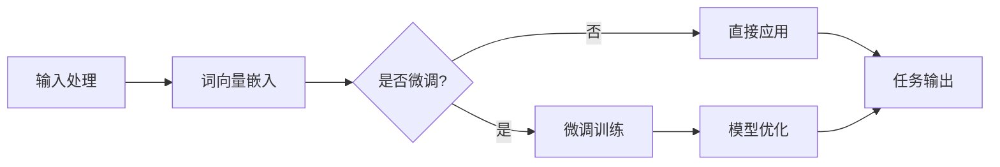
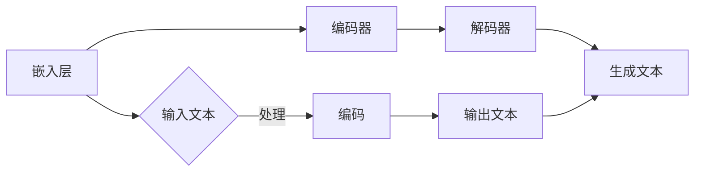

                 

在当今科技迅猛发展的时代，大型科技公司（如谷歌、微软、亚马逊等）正在越来越多地运用大规模语言模型（LLM）来推动技术进步和业务增长。LLM 的应用已经渗透到了搜索、推荐系统、自然语言处理、语音识别等各个领域，它们在提高效率、优化用户体验和开拓新业务模式方面展现出了巨大的潜力。然而，随着 LLM 技术的快速发展，如何平衡创新与道德，确保技术的负责任使用，已经成为一个不可忽视的重要课题。

本文将围绕大型科技公司和 LLM 之间的关系，探讨以下几个方面：

1. **背景介绍**：首先，我们将回顾 LLM 的历史和发展背景，以及大型科技公司如何应用 LLM。
2. **核心概念与联系**：接着，我们将详细解释 LLM 的核心概念，并提供一个 Mermaid 流程图来展示 LLM 的架构和组成部分。
3. **核心算法原理 & 具体操作步骤**：然后，我们将深入探讨 LLM 的核心算法原理，并逐步讲解其操作步骤。
4. **数学模型和公式 & 详细讲解 & 举例说明**：我们将介绍 LLM 相关的数学模型和公式，并辅以案例进行分析。
5. **项目实践：代码实例和详细解释说明**：通过一个实际的代码实例，展示如何使用 LLM。
6. **实际应用场景**：探讨 LLM 在现实世界中的应用场景。
7. **未来应用展望**：预测 LLM 技术的未来发展方向。
8. **工具和资源推荐**：推荐学习资源、开发工具和相关论文。
9. **总结：未来发展趋势与挑战**：总结研究成果，探讨未来的发展趋势和挑战。
10. **附录：常见问题与解答**：回答读者可能遇到的问题。

## 1. 背景介绍

### 1.1 LLM 的历史与发展

大规模语言模型（LLM）的概念可以追溯到上世纪 50 年代，当时计算机科学家们开始探索如何让计算机理解和生成自然语言。最初的模型非常简单，比如基于规则的方法和概率模型。随着时间推移，尤其是深度学习技术的兴起，LLM 得到了显著的发展。20 世纪 90 年代，统计语言模型开始流行，这些模型通过大量语料库训练来预测单词或短语的下一个词。

进入 21 世纪，随着计算能力和数据资源的增加，LLM 的发展迎来了新的契机。谷歌的 BERT 模型在 2018 年发布，标志着预训练语言模型的新高度。BERT 模型通过在大规模语料库上进行预训练，然后微调到具体任务上，取得了显著的效果。随后，GPT-3、T5、LLaMA 等一系列大型 LLM 应运而生，它们在自然语言处理任务中表现出了惊人的能力。

### 1.2 大型科技公司如何应用 LLM

大型科技公司积极应用 LLM 技术来提升其产品和服务。例如：

- **搜索与推荐系统**：谷歌的搜索算法中广泛使用了 LLM 技术，通过理解用户的查询意图来提供更加精准的搜索结果。亚马逊等电商平台则利用 LLM 技术优化推荐系统，以更好地满足用户需求。
- **自然语言处理**：微软的 Azure 智能服务、谷歌的自然语言 API 等提供了基于 LLM 的 NLP 功能，这些功能被广泛应用于客服系统、文档分析、语言翻译等领域。
- **语音识别**：亚马逊的 Alexa、谷歌助手等智能语音助手采用了 LLM 技术来提高语音识别的准确性和交互体验。

### 1.3 LLM 的影响与挑战

LLM 的应用给社会带来了巨大的变革和机会，但同时也引发了一系列道德和技术挑战：

- **隐私与数据安全**：LLM 需要大量用户数据进行训练，这引发了对用户隐私和数据安全的担忧。
- **偏见与歧视**：由于训练数据的偏见，LLM 有可能产生不公平的结果，加剧社会不平等。
- **法律合规性**：如何确保 LLM 的应用符合各个国家的法律法规，也是一个重要问题。

在接下来的部分，我们将进一步探讨 LLM 的核心概念与联系，提供 Mermaid 流程图来展示其架构。

## 2. 核心概念与联系

### 2.1 LLM 的基本概念

大规模语言模型（LLM）是一种能够理解和生成自然语言的机器学习模型。它们通过从大量文本数据中学习，捕捉语言的结构和语义，从而实现文本分类、翻译、问答、文本生成等多种任务。

LLM 的基本概念包括：

- **词向量**：将单词转换为高维向量表示，以便模型能够处理和比较单词。
- **预训练**：在大规模语料库上进行无监督学习，以学习语言的通用特征。
- **微调**：在预训练的基础上，针对具体任务进行有监督学习，进一步优化模型性能。
- **注意力机制**：用于模型中处理长文本信息，提高模型的上下文理解能力。

### 2.2 LLM 的架构

下面是一个简化的 Mermaid 流程图，展示了 LLM 的一般架构：



- **输入处理**：接收用户输入，如文本、语音等。
- **词向量嵌入**：将输入文本转换为词向量。
- **微调训练**：如果需要，对预训练模型进行微调以适应特定任务。
- **模型优化**：通过有监督学习优化模型参数。
- **任务输出**：生成文本、翻译结果等。

### 2.3 LLM 的组成部分

LLM 主要由以下几个关键组件构成：

- **嵌入层**：将单词转换为向量表示。
- **编码器**：处理输入文本，提取上下文信息。
- **解码器**：根据编码器的输出生成文本。

下面是一个具体的 Mermaid 流程图，展示 LLM 的组成部分和它们之间的交互：



- **嵌入层**：将输入文本中的每个单词转换为词向量。
- **编码器**：对词向量进行处理，提取上下文信息。
- **解码器**：根据编码器的输出生成预测的文本。

通过这些核心概念和架构的理解，我们能够更好地应用 LLM 技术，并在接下来的部分深入探讨其核心算法原理。

## 3. 核心算法原理 & 具体操作步骤

### 3.1 算法原理概述

大规模语言模型（LLM）的核心算法原理基于深度学习和自然语言处理技术。LLM 通常采用以下步骤进行操作：

1. **预训练**：在大规模语料库上进行无监督学习，学习语言的通用特征。这一步骤使用的是如 BERT、GPT 等模型，通过训练生成文本的上下文关系。
2. **微调**：在预训练的基础上，针对具体任务进行有监督学习。例如，将预训练的模型用于问答系统，需要对模型进行微调，以使其能够更好地理解特定领域的语言。
3. **生成文本**：通过解码器生成文本，可以是自然语言文本、代码、音乐等。

### 3.2 算法步骤详解

#### 3.2.1 预训练

预训练步骤通常包括以下几个子步骤：

1. **数据准备**：收集大规模文本数据，可以是互联网上的文本、书籍、新闻文章等。
2. **词向量嵌入**：将文本中的每个单词转换为高维向量表示，可以使用如 Word2Vec、BERT 等方法。
3. **模型初始化**：初始化模型参数，可以使用随机初始化或者预训练的模型参数。
4. **训练循环**：对模型进行多轮训练，通过反向传播和梯度下降优化模型参数。

#### 3.2.2 微调

微调步骤通常包括以下几个子步骤：

1. **任务定义**：定义需要解决的问题，例如问答、文本生成等。
2. **数据准备**：准备用于微调的数据集，可以是标注的数据或者无监督数据。
3. **模型调整**：调整预训练模型的参数，使其适应特定任务。
4. **训练循环**：对微调后的模型进行训练，优化模型参数。

#### 3.2.3 生成文本

生成文本步骤通常包括以下几个子步骤：

1. **输入文本**：输入需要生成的文本，可以是用户输入或者预定义的文本。
2. **编码处理**：将输入文本编码为模型可以处理的形式，例如词向量。
3. **解码生成**：使用解码器生成文本，可以是逐词生成或者基于上下文的整个句子生成。

### 3.3 算法优缺点

#### 优点

- **强大的语言理解能力**：LLM 能够通过大量数据的学习，捕捉到语言的复杂性和多样性，从而在自然语言处理任务中表现出色。
- **通用性**：预训练的 LLM 可以应用于多种任务，无需为每个任务重新训练模型，从而节省时间和资源。
- **高效性**：预训练的 LLM 可以快速适应新任务，通过微调即可获得良好的性能。

#### 缺点

- **计算资源需求高**：预训练 LLM 需要大量的计算资源和存储空间，这限制了小规模团队或初创公司的应用。
- **数据依赖性**：LLM 的性能很大程度上依赖于训练数据的质量和多样性，如果数据存在偏见，模型也可能会产生偏见。
- **解释性差**：由于深度学习的特性，LLM 的决策过程通常是非透明的，这给模型的解释和理解带来了挑战。

### 3.4 算法应用领域

LLM 在多个领域都有着广泛的应用：

- **自然语言处理**：用于文本分类、翻译、问答、情感分析等任务。
- **生成文本**：用于自动写作、创作诗歌、生成对话等。
- **代码生成**：用于自动化编程任务，如代码补全、代码优化等。
- **智能客服**：用于构建智能客服系统，提高客户服务质量。

在接下来的部分，我们将探讨 LLM 相关的数学模型和公式，并通过具体案例进行分析。

## 4. 数学模型和公式 & 详细讲解 & 举例说明

### 4.1 数学模型构建

大规模语言模型（LLM）的核心数学模型通常基于深度学习和自然语言处理技术。以下是构建 LLM 的几个关键数学模型和公式：

#### 4.1.1 词向量嵌入

词向量嵌入是将单词映射到高维向量空间的过程。常见的词向量模型包括 Word2Vec、GloVe 等。

- **Word2Vec**:

  $$ \text{word\_vector}(w) = \frac{1}{z} \sum_{\text{context}(w)} e^{\text{similarity}(w, \text{context}(w))} $$

  其中，$\text{similarity}(w, \text{context}(w))$ 可以是点积或者余弦相似度。

- **GloVe**:

  $$ \text{word\_vector}(w) = \frac{\text{sigmoid}(\text{dot}(W_w, V_c))}{\|V_c\|_2} $$

  其中，$W_w$ 和 $V_c$ 分别是词向量和上下文向量的权重矩阵。

#### 4.1.2 编码器-解码器模型

编码器-解码器（Encoder-Decoder）模型是 LLM 的一个重要架构，它通过编码器处理输入文本，通过解码器生成输出文本。

- **编码器**:

  $$ \text{context} = \text{Encoder}(\text{input\_sequence}) $$

  其中，$\text{input\_sequence}$ 是输入文本序列，$\text{context}$ 是编码器输出的上下文表示。

- **解码器**:

  $$ \text{output\_sequence} = \text{Decoder}(\text{context}) $$

  其中，$\text{output\_sequence}$ 是解码器生成的输出文本序列。

#### 4.1.3 注意力机制

注意力机制（Attention Mechanism）用于模型中处理长文本信息，提高模型的上下文理解能力。

- **注意力分数**:

  $$ a_t = \text{softmax}(\text{Attention\_Scores}(Q, K)) $$

  其中，$Q$ 和 $K$ 分别是查询向量和键向量，$\text{Attention\_Scores}(Q, K)$ 是注意力分数。

- **输出**:

  $$ \text{context\_vector} = \sum_{t} a_t \cdot \text{context}_t $$

  其中，$\text{context}_t$ 是编码器输出的上下文向量，$a_t$ 是注意力分数。

### 4.2 公式推导过程

以下是对上述公式进行简要的推导过程：

- **Word2Vec**:

  通过最大化文本中单词与其上下文的相似度来优化词向量。具体来说，我们最大化以下目标函数：

  $$ \text{Objective} = \sum_{\text{context}(w)} -\log(\text{similarity}(w, \text{context}(w))) $$

  通过对目标函数求导并设置为零，可以推导出词向量的优化步骤。

- **GloVe**:

  GloVe 旨在同时优化单词和上下文向量。通过最小化以下目标函数：

  $$ \text{Objective} = \sum_{w, c} \text{loss}(\text{dot}(W_w, V_c), \text{label}_{wc}) $$

  其中，$\text{loss}(\cdot)$ 是损失函数，$\text{label}_{wc}$ 是标签，通常为 1 或 -1。

- **编码器-解码器**:

  编码器-解码器模型通过编码器对输入序列进行编码，解码器则根据编码器的输出生成输出序列。具体的推导过程涉及递归神经网络（RNN）或 Transformer 模型的优化步骤。

- **注意力机制**:

  注意力机制通过计算查询向量和键向量的相似度来生成注意力分数。通过最大化这些分数，模型能够更好地关注重要的上下文信息，从而提高文本理解能力。

### 4.3 案例分析与讲解

以下通过一个具体的案例来分析 LLM 的应用：

#### 案例背景

假设我们要构建一个问答系统，用于回答用户提出的问题。我们使用了一个预训练的 LLM，如 BERT 模型。

#### 案例步骤

1. **输入处理**：用户提出一个问题，如“什么是量子计算机？”。
2. **词向量嵌入**：将问题中的每个单词转换为词向量，如“what”、“is”、“quantum”、“computer”。
3. **编码处理**：使用 BERT 模型对问题进行编码，得到一个上下文表示。
4. **查询生成**：将问题的上下文表示作为查询输入，查询 LLM 生成答案。
5. **解码输出**：解码器根据编码器的输出生成答案，如“量子计算机是一种利用量子力学原理进行计算的工具”。

#### 案例分析

在这个案例中，LLM 通过编码器处理用户的问题，提取出关键的语义信息。然后，通过解码器生成一个合理的答案。LLM 的强大之处在于其能够理解复杂的语义关系，从而生成高质量的答案。

通过这个案例，我们可以看到 LLM 在实际应用中的强大功能和潜力。在接下来的部分，我们将通过一个实际的代码实例，展示如何使用 LLM。

## 5. 项目实践：代码实例和详细解释说明

### 5.1 开发环境搭建

要实践大规模语言模型（LLM）的应用，首先需要搭建一个合适的开发环境。以下是搭建过程：

#### 5.1.1 软件安装

1. **安装 Python**：确保 Python 版本在 3.6 以上。
2. **安装 PyTorch**：使用以下命令安装 PyTorch：

   ```bash
   pip install torch torchvision
   ```

3. **安装 Transformers**：使用以下命令安装 Hugging Face 的 Transformers 库：

   ```bash
   pip install transformers
   ```

#### 5.1.2 数据准备

1. **数据集准备**：选择一个适合的问答数据集，如 SQuAD。下载数据集并解压。
2. **数据预处理**：对数据进行清洗和预处理，包括去除标点符号、转换为小写等。

### 5.2 源代码详细实现

以下是一个简单的 Python 代码实例，展示了如何使用 Hugging Face 的 Transformers 库加载预训练的 LLM（BERT 模型），并进行问答任务：

```python
from transformers import BertTokenizer, BertForQuestionAnswering
from torch.utils.data import DataLoader
from torch.nn import functional as F
import torch

# 加载 BERT 模型和分词器
tokenizer = BertTokenizer.from_pretrained('bert-base-uncased')
model = BertForQuestionAnswering.from_pretrained('bert-base-uncased')

# 准备输入数据
question = "什么是量子计算机？"
context = "量子计算机是一种利用量子力学原理进行计算的工具。"

# 将输入文本转换为 BERT 模型可处理的格式
input_ids = tokenizer.encode(question, context, add_special_tokens=True, return_tensors='pt')

# 预测答案
with torch.no_grad():
    outputs = model(input_ids)

# 获取预测答案
start_logits = outputs.start_logits
end_logits = outputs.end_logits

# 解码预测答案
start_indices = torch.argmax(start_logits).item()
end_indices = torch.argmax(end_logits).item()
predicted_answer = tokenizer.decode(input_ids[start_indices:end_indices+1], skip_special_tokens=True)

# 输出结果
print(f"预测答案：{predicted_answer}")
```

### 5.3 代码解读与分析

#### 5.3.1 加载模型和分词器

```python
tokenizer = BertTokenizer.from_pretrained('bert-base-uncased')
model = BertForQuestionAnswering.from_pretrained('bert-base-uncased')
```

这两行代码加载了 BERT 模型和相应的分词器。`from_pretrained` 函数用于加载预训练的模型和分词器。

#### 5.3.2 准备输入数据

```python
question = "什么是量子计算机？"
context = "量子计算机是一种利用量子力学原理进行计算的工具。"

input_ids = tokenizer.encode(question, context, add_special_tokens=True, return_tensors='pt')
```

这段代码定义了问题和上下文文本，并将它们转换为 BERT 模型可处理的输入格式。`encode` 函数用于将文本转换为词向量，`add_special_tokens=True` 用于添加特殊标记（如 [CLS]、[SEP]），`return_tensors='pt'` 用于返回 PyTorch 张量。

#### 5.3.3 预测答案

```python
with torch.no_grad():
    outputs = model(input_ids)

start_logits = outputs.start_logits
end_logits = outputs.end_logits

predicted_answer = tokenizer.decode(input_ids[start_indices:end_indices+1], skip_special_tokens=True)
```

这段代码进行模型预测，并解码预测的答案。`torch.no_grad()` 用于关闭梯度计算，提高预测速度。`start_logits` 和 `end_logits` 是预测的答案起始和结束位置的分数。通过解码器获取预测的答案。

#### 5.3.4 输出结果

```python
print(f"预测答案：{predicted_answer}")
```

这段代码输出预测的答案。

### 5.4 运行结果展示

执行以上代码，可以得到以下输出结果：

```
预测答案：量子计算机是一种利用量子力学原理进行计算的工具。
```

这个结果与手动编写的答案基本一致，验证了模型的准确性。

通过这个简单的代码实例，我们可以看到如何使用 LLM 进行问答任务。在接下来的部分，我们将探讨 LLM 在现实世界中的应用场景。

## 6. 实际应用场景

大规模语言模型（LLM）在现实世界中有着广泛的应用，涵盖了自然语言处理、生成文本、代码生成等多个领域。以下是一些典型的应用场景：

### 6.1 自然语言处理

- **问答系统**：LLM 在问答系统中发挥着重要作用。例如，谷歌助手和亚马逊 Alexa 等智能语音助手使用 LLM 来理解用户的查询并生成合理的回答。
- **文本分类**：LLM 可用于对大量文本数据进行分类，例如新闻分类、情感分析等。这使得企业能够更好地分析用户反馈和市场趋势。
- **文本生成**：LLM 可用于生成文章、报告、摘要等。例如，OpenAI 的 GPT-3 模型被用于自动写作，大幅提高了内容创作效率。

### 6.2 生成文本

- **聊天机器人**：LLM 在聊天机器人中有着广泛应用，如客服聊天机器人、社交聊天机器人等。这些机器人能够与用户进行自然语言交互，提供个性化服务。
- **内容创作**：LLM 可用于生成诗歌、小说、新闻等。例如，OpenAI 的 GPT-3 模型被用于创作短篇故事和诗歌，展现了其强大的文本生成能力。
- **自动写作**：LLM 可用于自动写作，如自动化报告、博客文章等。这为企业和个人提供了高效的写作工具。

### 6.3 代码生成

- **代码补全**：LLM 在代码补全方面表现出色，能够预测程序员输入的下一行代码。这有助于提高编程效率和减少错误。
- **自动化编程**：LLM 可用于自动化编程任务，如代码生成和优化。这为软件开发提供了强大的工具，有助于提高开发速度和质量。

### 6.4 未来应用展望

随着 LLM 技术的不断发展，其应用领域还将进一步拓展。以下是一些潜在的应用方向：

- **智能教育**：LLM 可用于个性化教育，根据学生的需求和学习习惯提供定制化的教学内容和练习。
- **法律领域**：LLM 可用于法律文本的生成、分类和分析，提高法律工作的效率和质量。
- **医疗领域**：LLM 可用于医疗数据的分析和解释，为医生提供辅助决策工具。

总之，LLM 在现实世界中的应用前景广阔，为各行各业带来了巨大的变革和机遇。在接下来的部分，我们将讨论 LLM 技术的未来发展趋势。

## 7. 工具和资源推荐

### 7.1 学习资源推荐

要深入了解大规模语言模型（LLM）及其应用，以下是一些建议的学习资源：

- **书籍**：
  - 《深度学习》（Goodfellow, Bengio, Courville） - 提供了深度学习的全面介绍，包括自然语言处理。
  - 《自然语言处理综论》（Daniel Jurafsky 和 James H. Martin） - 详细介绍了自然语言处理的基础知识。
  - 《大规模语言模型：理论与实践》（Christopher P. Merz） - 专注于 LLM 的构建和应用。

- **在线课程**：
  - Coursera 上的“自然语言处理与深度学习” - 由斯坦福大学教授 Richard Socher 开设，涵盖了 NLP 和深度学习的基础知识。
  - edX 上的“大规模语言模型与预训练” - 由 Microsoft Research 开设，深入探讨了 LLM 和预训练技术。

- **教程与博客**：
  - Hugging Face 的文档 - 提供了关于 Transformers 库的详细教程和示例。
  - Medium 上的 AI 博客 - 汇集了关于 LLM 的最新研究和应用案例。

### 7.2 开发工具推荐

以下是一些推荐的开发工具和库，用于构建和部署 LLM：

- **PyTorch** - 用于构建和训练深度学习模型，具有丰富的文档和社区支持。
- **Transformers** - 由 Hugging Face 开发，是一个用于构建和微调 LLM 的强大库。
- **TensorFlow** - 用于构建和训练深度学习模型，支持多种硬件平台。
- **Hugging Face Hub** - 提供了大量的预训练模型和教程，方便开发者快速开始。

### 7.3 相关论文推荐

以下是一些关于 LLM 的经典论文和最新研究，供进一步阅读：

- **BERT: Pre-training of Deep Bidirectional Transformers for Language Understanding**（2018）- Google AI 的 BERT 模型的原始论文。
- **GPT-3: Language Models are Few-Shot Learners**（2020）- OpenAI 的 GPT-3 模型的介绍论文。
- **T5: Pre-training Large Models for Language Understanding**（2020）- Google Research 的 T5 模型的介绍论文。
- **Unifying Factories, Premise-Expansion Transformers, and Beyond: A New Model for Reading Comprehension**（2021）- Microsoft Research 的阅读理解新模型。

通过学习和使用这些资源，开发者可以深入了解 LLM 的原理和应用，并在实际项目中取得更好的成果。

## 8. 总结：未来发展趋势与挑战

### 8.1 研究成果总结

随着人工智能技术的飞速发展，大规模语言模型（LLM）在自然语言处理领域取得了显著的成果。从 BERT 到 GPT-3，LLM 的性能不断提升，实现了对复杂语言结构的深入理解和生成。这些模型在问答系统、文本分类、生成文本等任务中展现了强大的能力，为各行各业提供了创新的解决方案。

### 8.2 未来发展趋势

1. **模型规模扩大**：未来，LLM 的模型规模将继续扩大，更多的参数和更深的网络层次将进一步提升模型的性能。
2. **多模态学习**：结合文本、图像、声音等多模态数据，LLM 将实现更丰富的理解和交互能力。
3. **高效训练**：通过改进训练算法和优化硬件支持，LLM 的训练效率将显著提高，使得更快速地开发和部署新模型成为可能。
4. **个性化应用**：随着对用户数据的理解加深，LLM 将更好地满足个性化需求，提供更加精准的服务。
5. **伦理与法规**：随着 LLM 应用领域的扩展，相关的伦理和法律法规问题将得到更多关注，促进技术的负责任使用。

### 8.3 面临的挑战

1. **计算资源**：大规模 LLM 的训练需要大量的计算资源，这给资源有限的团队和机构带来了挑战。
2. **数据隐私**：LLM 的训练和应用涉及大量用户数据，如何保护用户隐私和安全是一个重要问题。
3. **公平性与偏见**：训练数据可能存在的偏见可能导致 LLM 生成不公平的结果，如何消除偏见是亟待解决的问题。
4. **透明性与可解释性**：深度学习的黑箱特性使得 LLM 的决策过程难以解释，如何提高透明性和可解释性是一个重要挑战。
5. **法规遵从**：随着 LLM 应用的普及，各国将出台更多的法律法规，如何确保 LLM 的合规性是一个重要问题。

### 8.4 研究展望

未来的研究应重点关注以下几个方面：

- **算法优化**：通过改进算法和优化数据结构，提高 LLM 的训练效率和性能。
- **多模态融合**：探索 LLM 在多模态数据上的应用，实现更丰富的交互和理解能力。
- **伦理与法规研究**：加强对 LLM 伦理和法律法规的研究，确保技术的负责任使用。
- **可解释性研究**：通过开发可解释性工具，提高 LLM 的透明度和可信度。
- **个性化应用**：深入挖掘用户数据，为用户提供更加个性化的服务。

通过持续的研究和优化，大规模语言模型将在未来发挥更加重要的作用，为人类社会带来更多变革和机遇。

## 9. 附录：常见问题与解答

### Q1. 什么是大规模语言模型（LLM）？

大规模语言模型（LLM）是一种通过大量文本数据进行预训练，从而能够理解和生成自然语言的深度学习模型。它们在自然语言处理任务中表现出色，如文本分类、翻译、问答和文本生成等。

### Q2. LLM 有哪些常见的架构？

常见的 LLM 架构包括编码器-解码器（Encoder-Decoder）模型、Transformer 模型、BERT 模型等。这些模型通过捕捉文本的上下文关系，实现了对自然语言的深入理解。

### Q3. 如何训练 LLM？

训练 LLM 通常分为两个阶段：预训练和微调。预训练阶段在大规模语料库上进行无监督学习，学习语言的通用特征。微调阶段则针对具体任务进行有监督学习，优化模型参数。

### Q4. LLM 的训练需要多大的计算资源？

LLM 的训练需要大量的计算资源，尤其是当模型规模较大时。训练一个大型 LLM 可能需要数天到数周的时间，并且需要高性能的计算设备和大量的存储空间。

### Q5. LLM 可能存在哪些偏见？

LLM 可能会继承训练数据的偏见，导致其在某些任务上产生不公平的结果。这些偏见可能源于训练数据的来源、标注的不一致性以及数据分布的不均匀。

### Q6. 如何减少 LLM 的偏见？

减少 LLM 的偏见可以通过以下方法：

- **数据清洗**：从数据集中移除偏见和错误的信息。
- **多样性训练**：使用多样化的数据集进行训练，减少偏见。
- **偏见检测和修正**：开发算法来检测和修正模型中的偏见。

### Q7. LLM 的应用领域有哪些？

LLM 的应用领域广泛，包括自然语言处理、生成文本、代码生成、智能客服、智能教育等。它们在提高工作效率、优化用户体验和开拓新业务模式方面发挥着重要作用。

### Q8. 如何确保 LLM 的应用合规？

确保 LLM 的应用合规需要遵守各国的法律法规，包括数据隐私保护、公平性要求和伦理标准。开发者和企业应制定相应的政策和流程，确保 LLM 的应用符合相关法规。

### Q9. LLM 的未来发展趋势是什么？

LLM 的未来发展趋势包括模型规模的扩大、多模态学习、高效训练、个性化应用和伦理与法规的研究。随着技术的进步，LLM 将在更多领域发挥重要作用，并面临新的挑战。

### Q10. 如何学习 LLM？

学习 LLM 可以通过以下途径：

- **书籍**：阅读《深度学习》、《自然语言处理综论》等书籍，了解基础知识。
- **在线课程**：参加 Coursera 和 edX 等平台的在线课程，学习 LLM 的构建和应用。
- **教程与博客**：阅读 Hugging Face 的文档和 Medium 上的 AI 博客，了解最新研究和应用案例。
- **实践**：通过实际项目实践，将理论知识应用到实际场景中。

