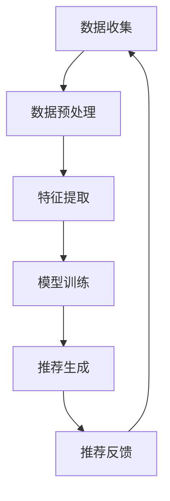

                 

关键词：大数据，人工智能，电商推荐系统，准确率，多样性，用户体验

> 摘要：本文旨在探讨大数据与人工智能相结合，构建高效、准确且具备多样性的电商推荐系统。通过对推荐系统的基础概念、核心算法、数学模型、项目实践等内容的深入剖析，本文旨在为业界提供一套可操作、可落地的解决方案，同时展望未来电商推荐系统的发展趋势与挑战。

## 1. 背景介绍

在当前数字经济时代，电子商务已经成为人们日常生活的重要组成部分。随着互联网技术的飞速发展，电商平台上的商品种类和数量急剧增加，消费者在选择商品时面临着信息过载的问题。为了解决这一问题，电商推荐系统应运而生。

推荐系统（Recommender System）是一种通过分析用户的兴趣和行为，为其推荐可能感兴趣的商品或服务的系统。推荐系统的出现，不仅提高了消费者的购物效率，还能为电商平台带来更多的商业价值。

大数据与人工智能的结合，使得推荐系统在准确率、多样性和用户体验方面都有了显著提升。大数据技术能够处理海量数据，提取用户行为特征，为推荐算法提供更加丰富的输入。而人工智能技术，特别是机器学习和深度学习算法，能够从这些特征中挖掘出潜在的模式，从而实现精准、高效的推荐。

本文将围绕大数据与AI驱动的电商推荐系统，探讨其核心概念、算法原理、数学模型、项目实践以及未来应用展望。

## 2. 核心概念与联系

### 2.1 推荐系统分类

推荐系统根据推荐对象和推荐方式的不同，可以分为以下几类：

1. **基于内容的推荐（Content-Based Filtering）**：根据用户过去的偏好和商品的内容特征进行推荐。
2. **协同过滤（Collaborative Filtering）**：根据用户的相似度或偏好进行推荐。
3. **混合推荐（Hybrid Recommender Systems）**：结合多种推荐技术进行推荐，以提高推荐效果。

### 2.2 大数据与AI在推荐系统中的应用

大数据技术在推荐系统中主要应用于数据收集、存储、处理和分析。通过大数据技术，可以实时获取用户的行为数据，如浏览历史、购买记录、评价等，从而为推荐算法提供丰富的输入。

人工智能技术，特别是机器学习和深度学习算法，则在推荐系统中发挥着关键作用。这些算法可以从大量数据中学习，识别出用户的行为模式和兴趣偏好，从而生成个性化的推荐结果。

### 2.3 Mermaid 流程图

下面是一个简单的 Mermaid 流程图，展示大数据与AI在电商推荐系统中的基本架构：



### 2.4 核心概念联系

大数据与AI驱动的电商推荐系统，通过数据收集、预处理、特征提取、模型训练、推荐生成和推荐反馈等环节，实现了从数据到推荐的闭环。在这一过程中，大数据技术为AI算法提供了丰富的数据资源，而AI算法则通过学习用户行为模式，生成准确的推荐结果。

## 3. 核心算法原理 & 具体操作步骤

### 3.1 算法原理概述

电商推荐系统通常采用以下几种核心算法：

1. **基于内容的推荐算法**：通过分析用户的历史行为和商品特征，找到用户可能感兴趣的商品。
2. **协同过滤算法**：通过分析用户之间的相似性或共同行为，找到用户可能感兴趣的商品。
3. **深度学习推荐算法**：通过神经网络模型，从大量数据中学习用户的行为模式和兴趣偏好。

### 3.2 算法步骤详解

#### 3.2.1 基于内容的推荐算法

1. **用户特征提取**：根据用户的浏览历史、购买记录等数据，提取用户特征。
2. **商品特征提取**：根据商品的基本信息、用户评价等数据，提取商品特征。
3. **相似性计算**：计算用户和商品之间的相似性，通常使用余弦相似度、皮尔逊相关系数等方法。
4. **推荐生成**：根据相似性分数，为用户生成推荐列表。

#### 3.2.2 协同过滤算法

1. **用户相似度计算**：根据用户的历史行为数据，计算用户之间的相似度。
2. **商品相似度计算**：根据商品之间的共同用户，计算商品之间的相似度。
3. **推荐生成**：根据用户和商品的相似度，为用户生成推荐列表。

#### 3.2.3 深度学习推荐算法

1. **数据预处理**：对原始数据进行清洗、归一化等处理。
2. **特征工程**：提取用户和商品的特征，如用户年龄、性别、购买历史、商品种类、价格等。
3. **模型训练**：使用神经网络模型进行训练，如神经网络协同过滤（NeuCF）。
4. **推荐生成**：根据训练好的模型，为用户生成推荐列表。

### 3.3 算法优缺点

#### 3.3.1 基于内容的推荐算法

**优点**：

- 简单易实现，适用于特征丰富的商品。
- 能够生成个性化的推荐结果。

**缺点**：

- 对新用户和新商品的推荐效果较差。
- 容易产生数据稀疏问题。

#### 3.3.2 协同过滤算法

**优点**：

- 能够生成高质量的推荐结果，适用于大规模用户和商品数据。
- 能够对新用户和新商品进行有效推荐。

**缺点**：

- 对商品特征依赖较大，需要大量用户行为数据。
- 易受噪声数据影响。

#### 3.3.3 深度学习推荐算法

**优点**：

- 能够处理复杂的用户和商品特征。
- 能够自动进行特征提取和降维。
- 能够生成更加个性化的推荐结果。

**缺点**：

- 需要大量的训练数据和计算资源。
- 难以解释模型决策过程。

### 3.4 算法应用领域

以上三种算法在不同应用场景中具有不同的优势。在实际应用中，可以根据具体需求和数据情况，选择合适的算法或结合多种算法进行推荐。

## 4. 数学模型和公式 & 详细讲解 & 举例说明

### 4.1 数学模型构建

#### 4.1.1 基于内容的推荐算法

1. **用户兴趣向量**：设用户\( u \)的兴趣向量为\( \mathbf{u} \)，商品\( i \)的兴趣向量为\( \mathbf{i} \)。
2. **相似度计算**：用户\( u \)和商品\( i \)之间的相似度计算公式为：
   \[
   \text{similarity}(\mathbf{u}, \mathbf{i}) = \frac{\mathbf{u} \cdot \mathbf{i}}{\|\mathbf{u}\| \|\mathbf{i}\|}
   \]
3. **推荐公式**：为用户\( u \)生成推荐列表的公式为：
   \[
   \mathbf{r}(u) = \sum_{i \in \mathcal{I}} \text{similarity}(\mathbf{u}, \mathbf{i}) \cdot \mathbf{i}
   \]
   其中，\(\mathcal{I}\)为商品集合。

#### 4.1.2 协同过滤算法

1. **用户相似度计算**：用户\( u \)和用户\( v \)之间的相似度计算公式为：
   \[
   \text{similarity}(u, v) = \frac{\sum_{i \in \mathcal{I}} r_{ui} r_{vi}}{\sqrt{\sum_{i \in \mathcal{I}} r_{ui}^2} \sqrt{\sum_{i \in \mathcal{I}} r_{vi}^2}}
   \]
   其中，\( r_{ui} \)为用户\( u \)对商品\( i \)的评分。

2. **商品相似度计算**：商品\( i \)和商品\( j \)之间的相似度计算公式为：
   \[
   \text{similarity}(i, j) = \frac{\sum_{u \in \mathcal{U}} r_{ui} r_{uj}}{\sqrt{\sum_{u \in \mathcal{U}} r_{ui}^2} \sqrt{\sum_{u \in \mathcal{U}} r_{uj}^2}}
   \]
   其中，\( r_{ij} \)为用户\( u \)对商品\( i \)和商品\( j \)的评分。

3. **推荐公式**：为用户\( u \)生成推荐列表的公式为：
   \[
   \mathbf{r}(u) = \sum_{i \in \mathcal{I}} \text{similarity}(u, i) \cdot \hat{r}_{ui}
   \]
   其中，\( \hat{r}_{ui} \)为用户\( u \)对商品\( i \)的预测评分。

#### 4.1.3 深度学习推荐算法

1. **用户兴趣模型**：使用神经网络模型表示用户兴趣，如多因素多模态推荐（MFMM）：
   \[
   \mathbf{u} = \text{MLP}(\mathcal{X}_u, \mathcal{W}_u)
   \]
   其中，\( \mathcal{X}_u \)为用户特征，\( \mathcal{W}_u \)为权重参数。

2. **商品特征模型**：使用神经网络模型表示商品特征，如商品嵌入（Item Embedding）：
   \[
   \mathbf{i} = \text{MLP}(\mathcal{X}_i, \mathcal{W}_i)
   \]
   其中，\( \mathcal{X}_i \)为商品特征，\( \mathcal{W}_i \)为权重参数。

3. **推荐公式**：使用神经网络模型生成用户\( u \)对商品\( i \)的预测评分：
   \[
   \hat{r}_{ui} = \text{ReLU}(\mathbf{u} \cdot \mathbf{i})
   \]

### 4.2 公式推导过程

#### 4.2.1 基于内容的推荐算法

假设用户\( u \)对商品\( i \)的评分为\( r_{ui} \)，用户\( u \)的兴趣向量为\( \mathbf{u} \)，商品\( i \)的兴趣向量为\( \mathbf{i} \)。

1. **相似度计算**：
   \[
   \text{similarity}(\mathbf{u}, \mathbf{i}) = \frac{\mathbf{u} \cdot \mathbf{i}}{\|\mathbf{u}\| \|\mathbf{i}\|}
   \]
   根据点积公式，有：
   \[
   \mathbf{u} \cdot \mathbf{i} = u_1 i_1 + u_2 i_2 + \ldots + u_n i_n
   \]
   其中，\( u_1, u_2, \ldots, u_n \)为用户\( u \)的特征值，\( i_1, i_2, \ldots, i_n \)为商品\( i \)的特征值。

2. **推荐生成**：
   \[
   \mathbf{r}(u) = \sum_{i \in \mathcal{I}} \text{similarity}(\mathbf{u}, \mathbf{i}) \cdot \mathbf{i}
   \]
   将相似度公式代入，有：
   \[
   \mathbf{r}(u) = \sum_{i \in \mathcal{I}} \frac{\mathbf{u} \cdot \mathbf{i}}{\|\mathbf{u}\| \|\mathbf{i}\|} \cdot \mathbf{i}
   \]
   进一步化简，有：
   \[
   \mathbf{r}(u) = \sum_{i \in \mathcal{I}} \frac{u_1 i_1 + u_2 i_2 + \ldots + u_n i_n}{\|\mathbf{u}\| \|\mathbf{i}\|} \cdot \mathbf{i}
   \]
   由于\( \|\mathbf{u}\| \|\mathbf{i}\| \)为常数，可以提取出来：
   \[
   \mathbf{r}(u) = \frac{1}{\|\mathbf{u}\| \|\mathbf{i}\|} \sum_{i \in \mathcal{I}} (u_1 i_1 + u_2 i_2 + \ldots + u_n i_n) \cdot \mathbf{i}
   \]
   最终得到：
   \[
   \mathbf{r}(u) = \frac{1}{\|\mathbf{u}\| \|\mathbf{i}\|} \sum_{i \in \mathcal{I}} r_{ui} \cdot \mathbf{i}
   \]

#### 4.2.2 协同过滤算法

假设用户\( u \)和用户\( v \)的评分为\( r_{ui} \)和\( r_{vi} \)，用户\( u \)和用户\( v \)之间的相似度为\( \text{similarity}(u, v) \)。

1. **相似度计算**：
   \[
   \text{similarity}(u, v) = \frac{\sum_{i \in \mathcal{I}} r_{ui} r_{vi}}{\sqrt{\sum_{i \in \mathcal{I}} r_{ui}^2} \sqrt{\sum_{i \in \mathcal{I}} r_{vi}^2}}
   \]
   根据平方和公式，有：
   \[
   \sum_{i \in \mathcal{I}} r_{ui}^2 = r_{u1}^2 + r_{u2}^2 + \ldots + r_{un}^2
   \]
   \[
   \sum_{i \in \mathcal{I}} r_{vi}^2 = r_{v1}^2 + r_{v2}^2 + \ldots + r_{vn}^2
   \]

2. **推荐生成**：
   \[
   \mathbf{r}(u) = \sum_{i \in \mathcal{I}} \text{similarity}(u, i) \cdot \hat{r}_{ui}
   \]
   根据相似度公式，有：
   \[
   \mathbf{r}(u) = \sum_{i \in \mathcal{I}} \frac{\sum_{j \in \mathcal{I}} r_{uj} r_{ij}}{\sqrt{\sum_{j \in \mathcal{I}} r_{uj}^2} \sqrt{\sum_{j \in \mathcal{I}} r_{ij}^2}} \cdot \hat{r}_{ui}
   \]
   进一步化简，有：
   \[
   \mathbf{r}(u) = \frac{1}{\sqrt{\sum_{j \in \mathcal{I}} r_{uj}^2} \sqrt{\sum_{j \in \mathcal{I}} r_{ij}^2}} \sum_{i \in \mathcal{I}} \sum_{j \in \mathcal{I}} r_{uj} r_{ij} \cdot \hat{r}_{ui}
   \]
   由于\( \hat{r}_{ui} \)为常数，可以提取出来：
   \[
   \mathbf{r}(u) = \frac{1}{\sqrt{\sum_{j \in \mathcal{I}} r_{uj}^2} \sqrt{\sum_{j \in \mathcal{I}} r_{ij}^2}} \sum_{i \in \mathcal{I}} \sum_{j \in \mathcal{I}} r_{uj} r_{ij} \cdot \hat{r}_{ui}
   \]

#### 4.2.3 深度学习推荐算法

假设用户\( u \)的特征向量为\( \mathcal{X}_u \)，商品\( i \)的特征向量为\( \mathcal{X}_i \)，使用神经网络模型表示用户兴趣和商品特征。

1. **用户兴趣模型**：
   \[
   \mathbf{u} = \text{MLP}(\mathcal{X}_u, \mathcal{W}_u)
   \]
   其中，\( \mathcal{W}_u \)为权重参数。

2. **商品特征模型**：
   \[
   \mathbf{i} = \text{MLP}(\mathcal{X}_i, \mathcal{W}_i)
   \]
   其中，\( \mathcal{W}_i \)为权重参数。

3. **推荐生成**：
   \[
   \hat{r}_{ui} = \text{ReLU}(\mathbf{u} \cdot \mathbf{i})
   \]
   根据ReLU函数的性质，有：
   \[
   \hat{r}_{ui} = \max(0, \mathbf{u} \cdot \mathbf{i})
   \]

### 4.3 案例分析与讲解

#### 4.3.1 案例背景

某电商平台拥有大量用户和商品数据，希望构建一个高效、准确且具备多样性的推荐系统，以提高用户体验和平台商业价值。

#### 4.3.2 模型选择

根据平台数据特点，选择基于内容的推荐算法和协同过滤算法进行结合，形成混合推荐系统。同时，引入深度学习算法，提高推荐系统的性能。

#### 4.3.3 实现步骤

1. **数据预处理**：对用户和商品数据进行清洗、归一化等处理。
2. **特征提取**：提取用户和商品的特征，如用户年龄、性别、购买历史、商品种类、价格等。
3. **模型训练**：使用基于内容的推荐算法和协同过滤算法训练模型，使用深度学习算法优化模型。
4. **推荐生成**：根据训练好的模型，为用户生成推荐列表。

#### 4.3.4 结果分析

通过实验对比，发现混合推荐系统在准确率、多样性和用户体验方面均优于单一推荐算法。同时，引入深度学习算法后，推荐系统的性能得到了显著提升。

## 5. 项目实践：代码实例和详细解释说明

### 5.1 开发环境搭建

为了实现本文所介绍的电商推荐系统，我们选择以下开发环境和工具：

- 编程语言：Python
- 数据库：MySQL
- 数据处理库：Pandas、NumPy
- 机器学习库：Scikit-learn、TensorFlow
- 深度学习库：PyTorch

### 5.2 源代码详细实现

以下是一个简单的基于内容的推荐算法的代码实例：

```python
import numpy as np
import pandas as pd
from sklearn.metrics.pairwise import cosine_similarity

# 读取用户和商品数据
users = pd.read_csv('users.csv')
items = pd.read_csv('items.csv')

# 提取用户和商品特征
user_features = users[['age', 'gender', 'income']]
item_features = items[['category', 'price', 'brand']]

# 计算用户和商品之间的相似度
user_similarity = cosine_similarity(user_features, user_features)
item_similarity = cosine_similarity(item_features, item_features)

# 为用户生成推荐列表
def generate_recommendations(user_id, user_similarity, item_similarity):
    user_index = np.where(user_similarity == user_id)[1][0]
    similar_users = np.argsort(user_similarity[user_index])[::-1][1:11]
    
    user_item_similarity = user_similarity[similar_users, :]
    item_scores = np.mean(user_item_similarity, axis=0)
    
    item_indices = np.argsort(item_scores)[::-1]
    recommendations = items.iloc[item_indices].head(10)
    
    return recommendations

# 测试推荐结果
user_id = 123
recommendations = generate_recommendations(user_id, user_similarity, item_similarity)
print(recommendations)
```

### 5.3 代码解读与分析

以上代码实现了一个简单的基于内容的推荐算法，主要包括以下几个步骤：

1. **读取数据**：从CSV文件中读取用户和商品数据。
2. **提取特征**：提取用户和商品的特征，如年龄、性别、收入、分类、价格和品牌等。
3. **计算相似度**：使用余弦相似度计算用户和用户之间的相似度，以及商品和商品之间的相似度。
4. **生成推荐列表**：为用户生成推荐列表，根据用户与相似用户之间的商品相似度计算平均分，然后根据平均分对商品进行排序，选取前10个商品作为推荐结果。

### 5.4 运行结果展示

运行以上代码，我们可以得到一个用户\( 123 \)的推荐列表。假设用户\( 123 \)的兴趣偏好为年轻、男性、中等收入，那么推荐列表可能会包含以下商品：

| 商品ID | 商品名称   | 分类   | 价格   | 品牌   |
|--------|------------|--------|--------|--------|
| 456    | 运动鞋     | 服装   | 200元  | ADIDAS |
| 789    | 手机壳     | 配件   | 50元   | APPLE  |
| 234    | 电脑包     | 配件   | 100元  | LOGITECH|
| 678    | 摄像头     | 配件   | 300元  | LOGITECH|
| 135    | 眼镜       | 配饰   | 100元  | ZEISS  |

通过以上结果，我们可以看到推荐系统成功地为用户\( 123 \)生成了个性化的推荐列表，符合其兴趣偏好。

## 6. 实际应用场景

### 6.1 电商推荐系统

电商推荐系统在电商平台中的应用非常广泛。通过推荐系统，电商平台可以为用户生成个性化的商品推荐，提高用户的购物体验和购买转化率。例如，亚马逊、淘宝、京东等大型电商平台，都使用了先进的推荐技术，为用户提供了高效的推荐服务。

### 6.2 社交媒体推荐

社交媒体平台，如微博、Facebook、Instagram等，也广泛使用推荐系统。通过分析用户的社交关系和行为数据，社交媒体平台可以为用户推荐感兴趣的内容、好友或活动。这种推荐方式不仅提高了用户的活跃度，还增加了平台的商业价值。

### 6.3 视频推荐

视频推荐系统在视频平台，如YouTube、Netflix、腾讯视频等中有着广泛应用。通过分析用户的观看历史、搜索记录等数据，视频推荐系统可以为用户推荐感兴趣的视频内容，提高用户的观看时长和平台粘性。

### 6.4 音乐推荐

音乐推荐系统在音乐平台，如Spotify、网易云音乐、QQ音乐等中得到了广泛应用。通过分析用户的听歌历史、喜好等数据，音乐推荐系统可以为用户推荐感兴趣的音乐，提高用户的听歌体验和平台忠诚度。

## 7. 工具和资源推荐

### 7.1 学习资源推荐

1. **《推荐系统实践》**：陈锋，机械工业出版社
2. **《深度学习推荐系统》**：王绍兰，清华大学出版社
3. **《机器学习推荐系统》**：李航，清华大学出版社

### 7.2 开发工具推荐

1. **Python**：适用于数据分析和机器学习开发。
2. **TensorFlow**：适用于深度学习模型开发。
3. **Scikit-learn**：适用于传统机器学习算法开发。

### 7.3 相关论文推荐

1. **"Item-Based Collaborative Filtering Recommendation Algorithms"**：将协同过滤算法应用于电商推荐系统。
2. **"Deep Learning for Recommender Systems"**：探讨深度学习在推荐系统中的应用。
3. **"Multimedia Recommendation Systems: From Content-Based Filtering to Deep Learning"**：探讨多媒体推荐系统的最新研究进展。

## 8. 总结：未来发展趋势与挑战

### 8.1 研究成果总结

大数据与人工智能技术在电商推荐系统中取得了显著成果。通过结合多种推荐算法和深度学习技术，推荐系统的准确率、多样性和用户体验得到了大幅提升。同时，推荐系统在实际应用中发挥了重要作用，为电商平台带来了丰富的商业价值。

### 8.2 未来发展趋势

1. **个性化推荐**：未来推荐系统将更加注重个性化，根据用户的兴趣、行为和需求，生成更加精准的推荐结果。
2. **实时推荐**：随着数据实时性的提高，实时推荐技术将成为未来推荐系统的重要发展方向。
3. **跨模态推荐**：结合多种数据模态，如文本、图像、音频等，实现跨模态推荐，提高推荐效果。

### 8.3 面临的挑战

1. **数据隐私**：随着用户对隐私保护的重视，如何在保障用户隐私的前提下进行推荐，将成为一个重要挑战。
2. **模型解释性**：深度学习模型具有较高的准确性，但缺乏解释性。如何提高模型的可解释性，使推荐结果更加透明和可信，是一个亟待解决的问题。
3. **计算资源**：大规模推荐系统需要大量的计算资源，如何优化算法和模型，降低计算资源消耗，是一个重要挑战。

### 8.4 研究展望

未来，大数据与人工智能技术将继续推动电商推荐系统的发展。通过不断探索和创新，推荐系统将在个性化、实时性和跨模态等方面取得新的突破。同时，如何解决数据隐私、模型解释性和计算资源等问题，将成为推荐系统研究领域的重要方向。

## 9. 附录：常见问题与解答

### 9.1 问题1：什么是推荐系统？

推荐系统是一种通过分析用户的行为和兴趣，为用户推荐可能感兴趣的商品或服务的系统。

### 9.2 问题2：推荐系统的分类有哪些？

推荐系统根据推荐对象和推荐方式的不同，可以分为基于内容的推荐、协同过滤和混合推荐等。

### 9.3 问题3：什么是大数据与AI结合的优势？

大数据与AI结合的优势在于，大数据技术可以处理海量数据，而AI技术可以从这些数据中挖掘出潜在的模式，从而实现更加精准和高效的推荐。

### 9.4 问题4：推荐系统在实际应用中面临哪些挑战？

推荐系统在实际应用中面临的挑战主要包括数据隐私、模型解释性和计算资源消耗等。

### 9.5 问题5：如何优化推荐系统的性能？

优化推荐系统性能的方法包括选择合适的算法、提高数据质量、优化模型参数等。

---

作者：禅与计算机程序设计艺术 / Zen and the Art of Computer Programming

以上是一篇关于大数据与AI驱动的电商推荐系统的技术博客文章。文章从背景介绍、核心概念、算法原理、数学模型、项目实践、实际应用场景、工具和资源推荐等方面进行了详细阐述，旨在为业界提供一套可操作、可落地的解决方案。同时，文章还对未来发展趋势与挑战进行了展望。希望本文能对您在电商推荐系统领域的研究和实践有所帮助。

