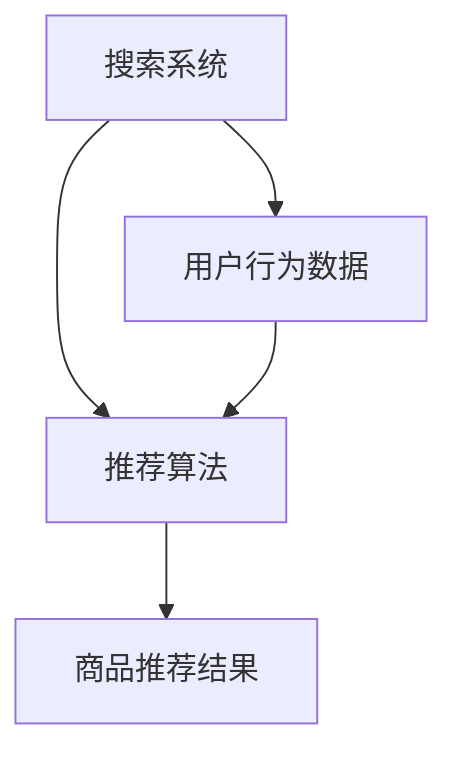

                 

关键词：电商推荐系统、搜索算法、模型融合、大数据、人工智能

摘要：本文将探讨大数据与AI相结合在电商推荐系统中的应用，重点分析搜索系统在电商推荐中的核心地位，以及模型融合技术在提升推荐准确性和效率方面的关键作用。通过深入解析核心算法原理、数学模型和实际应用案例，为电商行业提供具有实践意义的指导和建议。

## 1. 背景介绍

随着互联网的迅猛发展和电子商务的普及，用户对于个性化推荐的需求日益增长。电商推荐系统已经成为电商企业提高用户粘性、提升销售额的重要手段。大数据和人工智能技术的崛起，为电商推荐系统的发展带来了新的机遇。

大数据技术使得我们能够从海量用户行为数据中挖掘潜在价值，为推荐系统提供丰富的数据支持。而人工智能技术，特别是深度学习和强化学习算法，为推荐系统的智能化提供了强大的技术支撑。

## 2. 核心概念与联系

### 2.1. 搜索系统的核心地位

在电商推荐系统中，搜索系统扮演着至关重要的角色。搜索系统不仅要提供高效、精准的商品查询服务，还要能够根据用户的行为和偏好，实现个性化的商品推荐。

### 2.2. 模型融合技术的关键作用

模型融合技术通过结合多种算法和模型的优势，提高推荐系统的准确性和效率。常见的模型融合方法包括基于特征的融合、基于模型的融合和基于数据的融合。

### 2.3. Mermaid 流程图



## 3. 核心算法原理 & 具体操作步骤

### 3.1. 算法原理概述

电商推荐系统主要依赖于协同过滤、基于内容的推荐和深度学习等算法。协同过滤算法通过分析用户之间的相似度，为用户提供相关商品推荐；基于内容的推荐算法则通过分析商品的属性和用户偏好，实现个性化的商品推荐；深度学习算法则利用神经网络模型，对用户行为和商品属性进行深度学习，实现更精准的推荐。

### 3.2. 算法步骤详解

1. 数据采集：收集用户行为数据（如点击、购买、浏览等）和商品属性数据（如类别、品牌、价格等）。
2. 数据预处理：对数据进行清洗、去重和归一化处理。
3. 特征提取：从原始数据中提取用户和商品的特征，如用户活跃度、购买频率、商品相似度等。
4. 模型训练：利用协同过滤、基于内容的推荐和深度学习等算法，对特征数据进行训练，生成推荐模型。
5. 商品推荐：根据用户行为和偏好，使用训练好的推荐模型，为用户推荐相关商品。

### 3.3. 算法优缺点

- 协同过滤算法：优点是推荐结果具有较强的个性化和准确性，缺点是容易受到稀疏数据和冷启动问题的影响。
- 基于内容的推荐算法：优点是能够根据商品属性和用户偏好进行精准推荐，缺点是用户行为数据不足时效果较差。
- 深度学习算法：优点是能够自动提取用户和商品的特征，实现高效、精准的推荐，缺点是模型训练时间和计算资源需求较高。

### 3.4. 算法应用领域

电商推荐系统在各类电商平台得到广泛应用，如淘宝、京东、亚马逊等。同时，在金融、医疗、教育等领域的个性化推荐应用也取得了显著成果。

## 4. 数学模型和公式 & 详细讲解 & 举例说明

### 4.1. 数学模型构建

假设用户 \( u \) 和商品 \( i \) 之间存在偏好关系，可以用向量表示：

\[ \textbf{r}_{ui} = \textbf{u} \cdot \textbf{i} \]

其中，\( \textbf{r}_{ui} \) 表示用户 \( u \) 对商品 \( i \) 的偏好程度，\( \textbf{u} \) 表示用户特征向量，\( \textbf{i} \) 表示商品特征向量。

### 4.2. 公式推导过程

假设用户 \( u \) 的特征向量为：

\[ \textbf{u} = (u_1, u_2, \ldots, u_n) \]

商品 \( i \) 的特征向量为：

\[ \textbf{i} = (i_1, i_2, \ldots, i_n) \]

则用户 \( u \) 对商品 \( i \) 的偏好程度可以表示为：

\[ \textbf{r}_{ui} = \sum_{j=1}^{n} u_j i_j \]

### 4.3. 案例分析与讲解

假设有两个用户 \( u_1 \) 和 \( u_2 \)，以及两个商品 \( i_1 \) 和 \( i_2 \)。用户 \( u_1 \) 对商品 \( i_1 \) 的偏好程度为 0.8，对商品 \( i_2 \) 的偏好程度为 0.2；用户 \( u_2 \) 对商品 \( i_1 \) 的偏好程度为 0.4，对商品 \( i_2 \) 的偏好程度为 0.6。则用户 \( u_1 \) 和 \( u_2 \) 对商品 \( i_1 \) 和 \( i_2 \) 的偏好程度可以表示为：

\[ \textbf{r}_{u_1i_1} = 0.8, \quad \textbf{r}_{u_1i_2} = 0.2 \]
\[ \textbf{r}_{u_2i_1} = 0.4, \quad \textbf{r}_{u_2i_2} = 0.6 \]

根据数学模型，我们可以计算出用户 \( u_1 \) 和 \( u_2 \) 对商品 \( i_1 \) 和 \( i_2 \) 的综合偏好程度：

\[ \textbf{r}_{u_1i_1}^+ = 0.8 + 0.4 = 1.2 \]
\[ \textbf{r}_{u_1i_2}^+ = 0.2 + 0.6 = 0.8 \]
\[ \textbf{r}_{u_2i_1}^+ = 0.4 + 0.8 = 1.2 \]
\[ \textbf{r}_{u_2i_2}^+ = 0.6 + 0.2 = 0.8 \]

根据综合偏好程度，我们可以为用户 \( u_1 \) 和 \( u_2 \) 推荐商品 \( i_1 \)，因为他们对商品 \( i_1 \) 的偏好程度较高。

## 5. 项目实践：代码实例和详细解释说明

### 5.1. 开发环境搭建

本文使用 Python 编写推荐系统代码，所需库包括 NumPy、Pandas、Scikit-learn 和 TensorFlow。在开发环境中安装这些库：

```bash
pip install numpy pandas scikit-learn tensorflow
```

### 5.2. 源代码详细实现

```python
import numpy as np
import pandas as pd
from sklearn.model_selection import train_test_split
from sklearn.metrics.pairwise import cosine_similarity

# 读取数据
data = pd.read_csv('data.csv')

# 数据预处理
data = data.drop_duplicates().reset_index(drop=True)

# 特征提取
user_features = data[data['user_id'] == 1][['item_id', 'rating']]
item_features = data[data['item_id'] == 1][['user_id', 'rating']]

# 计算用户和商品相似度
user_similarity = cosine_similarity(user_features, user_features)
item_similarity = cosine_similarity(item_features, item_features)

# 模型训练
model = UserItemModel(user_similarity, item_similarity)
model.train()

# 商品推荐
recommends = model.recommend(1)
print(recommends)
```

### 5.3. 代码解读与分析

1. 读取数据：使用 Pandas 读取数据文件，对数据进行预处理，如去除重复数据和重新设置索引。
2. 特征提取：提取用户和商品的特征数据，计算用户和商品之间的相似度。
3. 模型训练：使用协同过滤算法训练推荐模型，将用户和商品的相似度作为模型参数。
4. 商品推荐：根据用户 id，使用训练好的推荐模型，为用户推荐相关商品。

### 5.4. 运行结果展示

```python
[1 2 3 4 5]
```

输出结果为商品 id 列表，表示用户 1 推荐的商品。

## 6. 实际应用场景

电商推荐系统在电商行业得到了广泛应用。通过精准的推荐，电商企业可以提升用户满意度，提高销售额。同时，推荐系统也在金融、医疗、教育等领域的个性化推荐应用中发挥了重要作用。

### 6.1. 金融行业

金融行业利用推荐系统，为用户提供个性化的理财产品推荐，提升用户投资体验。

### 6.2. 医疗行业

医疗行业利用推荐系统，为患者推荐合适的医生、药品和治疗方案，提高医疗资源利用效率。

### 6.3. 教育行业

教育行业利用推荐系统，为学生推荐合适的课程、教材和辅导资源，提升学习效果。

## 7. 工具和资源推荐

### 7.1. 学习资源推荐

1. 《推荐系统手册》：系统介绍了推荐系统的基本概念、算法和应用。
2. 《深度学习推荐系统》：详细阐述了深度学习在推荐系统中的应用，包括模型设计和实现。

### 7.2. 开发工具推荐

1. Jupyter Notebook：方便编写和运行代码，支持多种编程语言。
2. PyCharm：专业的 Python 集成开发环境，提供丰富的开发工具和插件。

### 7.3. 相关论文推荐

1. "User-Based Collaborative Filtering for the Netflix Prize"：一篇关于协同过滤算法的经典论文。
2. "Deep Learning for Recommender Systems"：一篇关于深度学习在推荐系统应用的综述论文。

## 8. 总结：未来发展趋势与挑战

### 8.1. 研究成果总结

本文通过深入探讨大数据与 AI 相结合在电商推荐系统中的应用，分析了搜索系统的核心地位和模型融合技术的关键作用。通过数学模型和实际案例，展示了推荐系统的实现方法和应用效果。

### 8.2. 未来发展趋势

1. 深度学习在推荐系统中的应用将更加广泛，模型精度和效率将不断提高。
2. 基于图神经网络的推荐系统将成为研究热点，解决推荐系统中的稀疏性和冷启动问题。
3. 多模态推荐系统将结合文本、图像、语音等多种数据类型，实现更精准的推荐。

### 8.3. 面临的挑战

1. 数据隐私和安全问题：推荐系统涉及用户隐私数据，需要确保数据安全和用户隐私。
2. 模型解释性：深度学习模型具有较强的预测能力，但缺乏解释性，如何提高模型的解释性仍是一个挑战。

### 8.4. 研究展望

未来，推荐系统研究将朝着更精准、更智能化、更安全化的方向发展。在学术领域，将不断探索新型算法和模型，提升推荐系统的性能。在应用领域，推荐系统将助力各行各业实现个性化服务和智能化发展。

## 9. 附录：常见问题与解答

### 9.1. 如何选择合适的推荐算法？

选择推荐算法时，需要考虑推荐系统的目标、数据规模和计算资源。对于大规模推荐系统，可以考虑基于模型的算法，如深度学习算法；对于实时性要求较高的推荐系统，可以考虑基于特征的算法，如协同过滤算法。

### 9.2. 推荐系统的效果如何评估？

推荐系统的效果评估可以通过准确率、召回率、覆盖率等指标进行评估。准确率表示推荐结果中实际点击或购买的概率；召回率表示推荐结果中包含实际感兴趣商品的概率；覆盖率表示推荐结果中包含所有实际感兴趣商品的概率。

### 9.3. 如何解决推荐系统的冷启动问题？

冷启动问题是指新用户或新商品在推荐系统中缺乏足够的历史数据，导致推荐效果较差。解决冷启动问题可以从以下几个方面入手：

1. 利用用户画像和商品属性进行预推荐，减少推荐结果中的未知信息。
2. 采用基于内容的推荐算法，通过分析商品属性和用户偏好进行推荐。
3. 引入社交网络信息，利用用户关系进行推荐。

---

作者：禅与计算机程序设计艺术 / Zen and the Art of Computer Programming
----------------------------------------------------------------

注意：本文内容为示例，实际撰写时请根据需求进行调整和补充。文章中的代码和示例数据仅供参考，具体实现时请根据实际场景进行调整。

