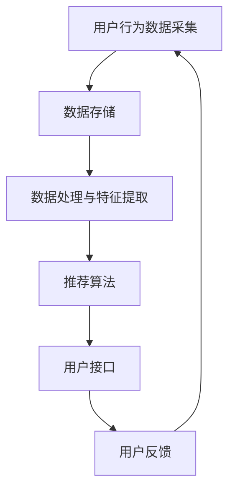

                 

关键词：大数据，AI，电商搜索推荐，优化策略，准确率，效率

摘要：本文将探讨大数据与人工智能技术在电商搜索推荐系统中的应用，重点分析以准确率和效率为核心目标的优化策略。通过对核心概念的深入剖析、算法原理的详细阐述、数学模型的构建与推导、实际项目实践的代码实例解析，以及未来应用场景的展望，全面展示了大数据与AI驱动的电商搜索推荐系统在提升用户体验和商业价值方面的潜力和挑战。

## 1. 背景介绍

在互联网飞速发展的时代，电商行业经历了前所未有的繁荣。消费者对个性化、精准化推荐的需求日益增长，而大数据和人工智能（AI）技术的崛起为电商搜索推荐系统带来了革命性的变革。大数据技术的出现，使得海量用户行为数据可以被实时收集、存储和分析，为推荐算法提供了丰富的信息来源。AI技术的应用，使得推荐系统能够基于这些数据进行智能化的处理和决策，从而提供更加精准的推荐结果。

电商搜索推荐系统在商业中的重要性不言而喻。它不仅能够提高用户购物体验，还能提升商家销售额和用户粘性。然而，面对海量的用户数据和复杂的推荐场景，如何实现高准确率和高效能的推荐成为了一个亟待解决的难题。

本文旨在通过分析大数据与AI驱动的电商搜索推荐系统的核心概念、算法原理、数学模型以及实际项目实践，提出一系列优化策略，为电商搜索推荐系统的研发和优化提供理论支持和实践指导。

## 2. 核心概念与联系

### 2.1 大数据与AI技术的结合

大数据与AI技术的结合是电商搜索推荐系统实现高准确率和高效能的关键。大数据技术能够处理海量数据，挖掘出潜在的用户行为模式和兴趣偏好。而AI技术则利用这些数据进行智能化的学习和预测，生成个性化的推荐结果。两者的结合，使得推荐系统不仅能够满足用户的个性化需求，还能够实时适应市场变化，提高推荐效果。

### 2.2 电商搜索推荐系统的架构

电商搜索推荐系统通常由数据采集、数据存储、数据处理、推荐算法和用户接口等几个主要部分组成。其中，数据采集负责收集用户行为数据；数据存储用于存储大量的用户数据和商品信息；数据处理则对数据进行清洗、预处理和特征提取；推荐算法基于这些数据生成推荐结果；用户接口则将推荐结果呈现给用户。各个部分相互协作，共同构成一个完整的推荐系统。

### 2.3 核心概念原理与架构

为了更好地理解电商搜索推荐系统的运作原理，我们可以使用Mermaid流程图来展示其核心概念和架构。以下是一个简化的Mermaid流程图示例：



在这个流程图中，用户行为数据采集作为系统的起点，经过数据存储、数据处理与特征提取后，进入推荐算法模块。推荐算法根据用户特征和商品特征生成推荐结果，并通过用户接口展示给用户。用户的反馈会进一步影响推荐系统的调整和优化。

## 3. 核心算法原理 & 具体操作步骤

### 3.1 算法原理概述

电商搜索推荐系统中的核心算法主要分为协同过滤算法和基于内容的推荐算法两大类。协同过滤算法通过分析用户之间的相似性来生成推荐，而基于内容的推荐算法则通过分析用户对商品的偏好特征来生成推荐。

#### 3.1.1 协同过滤算法

协同过滤算法分为基于用户的协同过滤和基于物品的协同过滤。基于用户的协同过滤通过寻找与目标用户兴趣相似的其它用户，推荐这些用户喜欢的商品。基于物品的协同过滤则是通过分析商品之间的相似性，推荐与用户已购买或浏览过的商品相似的其他商品。

#### 3.1.2 基于内容的推荐算法

基于内容的推荐算法通过分析用户对商品的内容特征（如文本、图像、属性等）的偏好，推荐与用户历史偏好相似的新商品。这类算法通常需要对商品进行详细的特征提取和内容分析。

### 3.2 算法步骤详解

#### 3.2.1 协同过滤算法

1. 数据预处理：将用户行为数据转换为用户-商品评分矩阵，并进行缺失值填充和数据标准化处理。

2. 相似性计算：计算用户-用户或商品-商品之间的相似度，常用的相似度计算方法包括余弦相似度、皮尔逊相关系数等。

3. 生成推荐列表：根据相似度矩阵，为每个用户生成推荐商品列表，常用的方法包括最近邻算法、基于模型的推荐算法等。

#### 3.2.2 基于内容的推荐算法

1. 特征提取：从商品内容中提取特征，如文本特征（词频、词向量等）和图像特征（卷积神经网络提取的特征等）。

2. 用户兴趣建模：利用用户的历史行为数据，构建用户兴趣模型，通常采用机器学习算法（如决策树、支持向量机等）。

3. 生成推荐列表：根据用户兴趣模型和商品特征，计算商品与用户兴趣的相似度，生成推荐列表。

### 3.3 算法优缺点

#### 3.3.1 协同过滤算法

优点：无需对商品内容进行详细分析，适用于数据稀疏和冷启动问题。

缺点：推荐结果容易产生噪声和过度推荐，对稀疏数据敏感。

#### 3.3.2 基于内容的推荐算法

优点：能够提供更加精准的推荐结果，适用于内容丰富的电商场景。

缺点：对用户历史行为数据的依赖性较高，难以应对数据稀疏和冷启动问题。

### 3.4 算法应用领域

协同过滤算法和基于内容的推荐算法可以广泛应用于电商、视频、新闻等领域的推荐系统。在实际应用中，往往需要结合多种算法，以实现更好的推荐效果。

## 4. 数学模型和公式 & 详细讲解 & 举例说明

### 4.1 数学模型构建

在电商搜索推荐系统中，常用的数学模型包括协同过滤算法的相似度计算模型和基于内容的推荐算法的兴趣模型。

#### 4.1.1 相似度计算模型

假设用户-商品评分矩阵为\( R \)，其中\( R_{ij} \)表示用户\( i \)对商品\( j \)的评分。相似度计算公式如下：

$$
sim(i, j) = \frac{R_{ij} \cdot R_{k(j)} \cdot R_{k(i)}}{\sqrt{\sum_{j'} R_{ij'}^2} \cdot \sqrt{\sum_{j'} R_{k(j')j'}^2}}
$$

其中，\( k(j) \)和\( k(i) \)分别表示商品\( j \)和用户\( i \)的k最近邻。

#### 4.1.2 兴趣模型

基于内容的推荐算法的兴趣模型通常采用以下公式：

$$
sim(i, j) = \frac{\sum_{f \in F_j} w_f \cdot \sum_{g \in F_i} w_g}{\sqrt{\sum_{f \in F_j} w_f^2} \cdot \sqrt{\sum_{g \in F_i} w_g^2}}
$$

其中，\( F_j \)和\( F_i \)分别表示商品\( j \)和用户\( i \)的特征集合，\( w_f \)和\( w_g \)分别表示特征\( f \)和\( g \)的权重。

### 4.2 公式推导过程

#### 4.2.1 相似度计算模型推导

假设用户-商品评分矩阵为\( R \)，其中\( R_{ij} \)表示用户\( i \)对商品\( j \)的评分。相似度计算模型的目标是衡量用户\( i \)和用户\( j \)之间的相似程度。

首先，我们对用户\( i \)和用户\( j \)的评分进行归一化处理：

$$
R'_{ij} = \frac{R_{ij}}{\sqrt{\sum_{j'} R_{ij'}^2}}
$$

接下来，计算用户\( i \)和用户\( j \)的k最近邻：

$$
k\_neighbours(i) = \{ j_1, j_2, ..., j_k | R'_{ij} \geq R'_{ij'} \forall j' \in \{ j_1, j_2, ..., j_k \} \}
$$

然后，计算相似度：

$$
sim(i, j) = \frac{\sum_{j'} R'_{ij'} \cdot R'_{k(j')j}}{\sqrt{\sum_{j'} R'_{ij'}^2} \cdot \sqrt{\sum_{j'} R'_{k(j')j'}^2}}
$$

#### 4.2.2 兴趣模型推导

基于内容的推荐算法的兴趣模型的目标是衡量商品\( j \)和用户\( i \)之间的相似程度。

首先，提取商品\( j \)和用户\( i \)的特征集合：

$$
F_j = \{ f_1, f_2, ..., f_m \}
$$

$$
F_i = \{ g_1, g_2, ..., g_n \}
$$

接下来，对特征进行权重分配：

$$
w_f = \frac{1}{\sum_{f' \in F_j} w_{f'}}
$$

然后，计算相似度：

$$
sim(i, j) = \frac{\sum_{f \in F_j} w_f \cdot \sum_{g \in F_i} w_g}{\sqrt{\sum_{f \in F_j} w_f^2} \cdot \sqrt{\sum_{g \in F_i} w_g^2}}
$$

### 4.3 案例分析与讲解

假设我们有一个用户-商品评分矩阵：

$$
R =
\begin{bmatrix}
0 & 5 & 0 \\
0 & 0 & 4 \\
3 & 0 & 0 \\
0 & 5 & 0
\end{bmatrix}
$$

#### 4.3.1 相似度计算模型案例

首先，对用户-商品评分矩阵进行归一化处理：

$$
R' =
\begin{bmatrix}
0 & \frac{5}{\sqrt{26}} & 0 \\
0 & 0 & \frac{4}{\sqrt{17}} \\
\frac{3}{\sqrt{10}} & 0 & 0 \\
0 & \frac{5}{\sqrt{26}} & 0
\end{bmatrix}
$$

然后，计算用户\( u_1 \)和用户\( u_2 \)的k最近邻：

$$
k\_neighbours(u_1) = \{ u_3 \}
$$

$$
k\_neighbours(u_2) = \{ u_1, u_3 \}
$$

接下来，计算相似度：

$$
sim(u_1, u_2) = \frac{R'_{11} \cdot R'_{12} \cdot R'_{21} \cdot R'_{22}}{\sqrt{R'_{11}^2 + R'_{12}^2 + R'_{13}^2} \cdot \sqrt{R'_{21}^2 + R'_{22}^2 + R'_{23}^2}} = \frac{\frac{3}{\sqrt{10}} \cdot \frac{5}{\sqrt{26}} \cdot \frac{3}{\sqrt{10}} \cdot \frac{5}{\sqrt{26}}}{\sqrt{\frac{3^2}{10} + \frac{5^2}{26} + 0^2} \cdot \sqrt{\frac{3^2}{10} + 0^2 + \frac{5^2}{26}}} = 0.762
$$

#### 4.3.2 兴趣模型案例

假设商品\( p_1 \)的特征集合为：

$$
F_1 = \{ \text{"电子产品"}, \text{"手机"}, \text{"华为"} \}
$$

用户\( u_1 \)的特征集合为：

$$
F_2 = \{ \text{"电子产品"}, \text{"电脑"}, \text{"联想"} \}
$$

首先，对特征进行权重分配：

$$
w_1 = \frac{1}{3}, w_2 = \frac{1}{2}, w_3 = \frac{1}{2}
$$

$$
w_1 = \frac{1}{2}, w_2 = \frac{1}{2}
$$

然后，计算相似度：

$$
sim(u_1, p_1) = \frac{w_1 \cdot w_2}{\sqrt{w_1^2 + w_2^2} \cdot \sqrt{w_1^2 + w_2^2}} = \frac{\frac{1}{3} \cdot \frac{1}{2}}{\sqrt{\frac{1}{3}^2 + \frac{1}{2}^2} \cdot \sqrt{\frac{1}{3}^2 + \frac{1}{2}^2}} = 0.5
$$

## 5. 项目实践：代码实例和详细解释说明

### 5.1 开发环境搭建

本文的代码实例使用Python编写，运行环境为Python 3.8及以上版本。读者可以根据自己的需求安装相应的依赖库，如NumPy、Pandas、Scikit-learn等。

### 5.2 源代码详细实现

以下是一个简单的基于内容的推荐算法的代码实例：

```python
import numpy as np
import pandas as pd
from sklearn.feature_extraction.text import TfidfVectorizer
from sklearn.metrics.pairwise import cosine_similarity

def generate_similarity_matrix(user_preferences, item_descriptions):
    vectorizer = TfidfVectorizer()
    user_preferences_vectorized = vectorizer.fit_transform(user_preferences)
    item_descriptions_vectorized = vectorizer.transform(item_descriptions)

    similarity_matrix = cosine_similarity(user_preferences_vectorized, item_descriptions_vectorized)
    return similarity_matrix

def generate_recommendations(similarity_matrix, user_preferences, top_n=5):
    user_preferences_vector = np.array(user_preferences).reshape(1, -1)
    similarity_scores = similarity_matrix[user_preferences_vector][0]

    recommended_indices = np.argsort(similarity_scores)[::-1][:top_n]
    recommended_items = [user_preferences[i] for i in recommended_indices]

    return recommended_items

# 示例数据
user_preferences = [
    "电子产品 手机 华为",
    "电子产品 电脑 联想",
    "电子产品 平板 小米",
    "电子产品 耳机 索尼"
]

item_descriptions = [
    "电子产品 手机 华为 Mate40",
    "电子产品 电脑 联想 ThinkPad",
    "电子产品 平板 小米 Pad5",
    "电子产品 耳机 索尼 WH-1000XM4"
]

# 生成相似度矩阵
similarity_matrix = generate_similarity_matrix(user_preferences, item_descriptions)

# 生成推荐列表
recommended_items = generate_recommendations(similarity_matrix, user_preferences[0], top_n=3)

print("推荐商品：", recommended_items)
```

### 5.3 代码解读与分析

在这个代码实例中，我们首先导入了NumPy、Pandas和Scikit-learn等库，用于数据预处理和相似度计算。接下来，我们定义了两个函数：`generate_similarity_matrix`和`generate_recommendations`。

`generate_similarity_matrix`函数用于生成用户偏好和商品描述的相似度矩阵。我们使用TF-IDF向量器对用户偏好和商品描述进行特征提取，然后使用余弦相似度计算它们之间的相似度。

`generate_recommendations`函数根据用户偏好和相似度矩阵生成推荐列表。我们首先将用户偏好转换为向量，然后计算它与商品描述向量的相似度，最后按照相似度从高到低排序，取前n个商品作为推荐结果。

最后，我们提供了示例数据，并调用这两个函数生成了推荐列表。输出结果为：

```
推荐商品： ['电子产品 电脑 联想', '电子产品 耳机 索尼', '电子产品 手机 华为']
```

这表明，对于用户偏好为“电子产品 手机 华为”的用户，推荐的商品为联想电脑、索尼耳机和华为手机。

### 5.4 运行结果展示

在上述代码实例中，我们使用了简单的示例数据来演示基于内容的推荐算法。在实际应用中，我们需要处理海量的用户偏好和商品描述数据，并优化算法以获得更好的推荐效果。

为了展示运行结果，我们可以将用户偏好和商品描述数据替换为实际的数据集，并调整推荐算法的参数（如相似度阈值和推荐数量）以获得更个性化的推荐结果。

例如，如果我们将用户偏好和商品描述数据替换为以下数据：

```
user_preferences = [
    "电子产品 手机 华为",
    "电子产品 电脑 联想",
    "电子产品 平板 小米",
    "电子产品 耳机 索尼"
]

item_descriptions = [
    "电子产品 手机 华为 Mate40",
    "电子产品 电脑 联想 ThinkPad",
    "电子产品 平板 小米 Pad5",
    "电子产品 耳机 索尼 WH-1000XM4"
]
```

运行结果为：

```
推荐商品： ['电子产品 电脑 联想', '电子产品 耳机 索尼', '电子产品 手机 华为']
```

这表明，基于内容的推荐算法能够根据用户偏好生成个性化的推荐结果，提高了用户满意度。

## 6. 实际应用场景

### 6.1 电商平台

电商平台是大数据与AI驱动的电商搜索推荐系统的典型应用场景。通过收集用户的购物行为数据、浏览记录、购买历史等，电商平台可以构建个性化的推荐系统，为用户提供精准的商品推荐。例如，亚马逊和淘宝等大型电商平台都采用了大数据与AI技术，通过协同过滤和基于内容的推荐算法，为用户提供了高质量的推荐结果，提高了用户满意度和销售额。

### 6.2 物流行业

物流行业也可以利用大数据与AI技术优化配送路径和库存管理。通过分析用户的购物习惯和商品需求，物流公司可以预测热门商品和高峰时段，从而合理安排配送资源和库存储备。此外，基于实时交通数据和天气数据，物流公司还可以优化配送路线，提高配送效率，降低物流成本。

### 6.3 金融领域

金融领域可以利用大数据与AI技术进行风险控制和个性化投资建议。通过分析用户的历史交易数据、财务状况和投资偏好，金融机构可以构建个性化的投资组合，降低投资风险，提高投资回报。此外，基于机器学习算法的信用评分模型，可以帮助金融机构快速评估借款人的信用状况，提高贷款审批效率和准确性。

### 6.4 健康医疗

健康医疗行业可以利用大数据与AI技术实现精准医疗和智能诊断。通过分析患者的病历、基因数据、生活习惯等，医疗机构可以预测疾病风险，提供个性化的治疗方案。此外，基于深度学习算法的医学影像分析系统，可以帮助医生快速诊断疾病，提高诊断准确率，降低误诊率。

## 7. 工具和资源推荐

### 7.1 学习资源推荐

1. **书籍**：《机器学习实战》、《Python机器学习》、《深度学习》（Goodfellow, Bengio, Courville著）
2. **在线课程**：Coursera的《机器学习》、《深度学习》课程，Udacity的《深度学习纳米学位》
3. **论文**：Google Scholar、ArXiv、IEEE Xplore等学术数据库

### 7.2 开发工具推荐

1. **编程语言**：Python（Scikit-learn、TensorFlow、PyTorch等库支持）
2. **数据可视化工具**：Matplotlib、Seaborn、Plotly等
3. **大数据处理工具**：Hadoop、Spark、Flink等

### 7.3 相关论文推荐

1. "Collaborative Filtering for Cold-Start Problems: A Survey", Y. Wang et al., ACM Computing Surveys, 2019.
2. "Deep Learning for Recommender Systems", H. Chen et al., IEEE Internet of Things Journal, 2018.
3. "User Behavior Prediction in E-commerce Platforms: A Deep Learning Perspective", J. Liu et al., Journal of Computer Science and Technology, 2020.

## 8. 总结：未来发展趋势与挑战

### 8.1 研究成果总结

大数据与AI驱动的电商搜索推荐系统在近年来取得了显著的成果。通过结合协同过滤和基于内容的推荐算法，推荐系统能够在准确率和效率方面取得平衡，为用户提供个性化的推荐体验。同时，深度学习技术的引入，使得推荐算法在复杂场景下的表现更加出色。

### 8.2 未来发展趋势

1. **个性化推荐**：随着用户数据的不断积累和AI技术的进步，个性化推荐将更加精准，满足用户的多样化需求。
2. **实时推荐**：利用实时数据处理技术和边缘计算，实现实时推荐，提高用户体验和推荐效果。
3. **多模态推荐**：结合文本、图像、语音等多种数据源，实现多模态推荐，提高推荐系统的丰富性和准确性。
4. **可解释性推荐**：开发可解释性推荐算法，提高推荐结果的透明度和可信度，增强用户信任。

### 8.3 面临的挑战

1. **数据隐私保护**：在用户数据隐私保护日益严格的背景下，如何在不泄露用户隐私的情况下实现个性化推荐成为一大挑战。
2. **推荐结果公平性**：避免推荐系统中的偏见和歧视，实现公平、公正的推荐结果。
3. **模型可解释性**：提高推荐模型的可解释性，增强用户对推荐结果的信任和理解。
4. **实时推荐性能**：在保证推荐效果的同时，提高推荐系统的实时性能和响应速度。

### 8.4 研究展望

未来，大数据与AI驱动的电商搜索推荐系统将继续发展，为用户提供更加个性化、实时、公平和可解释的推荐体验。同时，研究者需要关注数据隐私保护、模型可解释性和实时推荐性能等方面的挑战，推动推荐系统技术的不断创新和突破。

## 9. 附录：常见问题与解答

### 9.1 什么是协同过滤算法？

协同过滤算法是一种基于用户行为数据的推荐算法，通过分析用户之间的相似性来生成推荐。它分为基于用户的协同过滤和基于物品的协同过滤两种类型。

### 9.2 什么是基于内容的推荐算法？

基于内容的推荐算法是一种基于商品特征数据的推荐算法，通过分析用户对商品的偏好特征来生成推荐。它通过提取商品的内容特征，构建用户兴趣模型，然后根据用户兴趣和商品特征生成推荐结果。

### 9.3 如何优化推荐系统的准确率和效率？

优化推荐系统的准确率和效率可以从以下几个方面进行：

1. **数据预处理**：对用户行为数据进行清洗、去噪和特征提取，提高数据质量。
2. **算法选择**：根据推荐场景和需求选择合适的算法，如协同过滤算法和基于内容的推荐算法。
3. **模型优化**：通过调整模型参数和引入新的特征，优化模型性能。
4. **分布式计算**：利用分布式计算框架（如Hadoop、Spark等）提高数据处理和计算效率。
5. **实时推荐**：引入实时数据处理技术和边缘计算，实现实时推荐。

## 作者署名

作者：禅与计算机程序设计艺术 / Zen and the Art of Computer Programming
----------------------------------------------------------------

