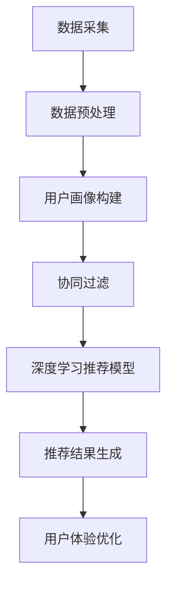

                 

## 1. 背景介绍

随着互联网的飞速发展和电子商务的兴起，在线购物已经成为人们日常生活中不可或缺的一部分。在众多的电子商务平台上，搜索推荐系统发挥着至关重要的作用。用户在庞大的商品库中寻找特定商品时，搜索推荐系统能够提供准确、相关的商品推荐，显著提升用户购买体验和满意度。

然而，传统的搜索推荐系统往往依赖于关键词匹配和用户历史行为数据，这在一定程度上限制了其推荐效果。随着大数据和人工智能技术的不断发展，基于大数据和AI的搜索推荐系统逐渐成为研究热点。这类系统不仅能够利用海量数据挖掘潜在的用户需求，还能通过机器学习算法实现个性化推荐，从而提高推荐准确率和用户体验。

本文将深入探讨大数据与AI驱动的电商搜索推荐系统，从核心概念、算法原理、数学模型、项目实践、实际应用和未来展望等方面进行全面阐述，旨在为相关领域的研究者和实践者提供有价值的参考。

## 2. 核心概念与联系

### 2.1 数据处理

数据处理是大数据与AI驱动的电商搜索推荐系统的基石。海量用户行为数据、商品属性数据和外部信息都需要进行有效的清洗、整合和分析。数据处理技术包括数据采集、数据预处理、数据存储和数据挖掘等步骤。

- **数据采集**：通过网站日志、API接口、爬虫等方式收集用户行为数据和商品信息。
- **数据预处理**：对采集到的数据进行清洗、去重、格式转换等处理，使其符合分析需求。
- **数据存储**：使用分布式数据库和大数据处理框架（如Hadoop、Spark等）存储和管理大规模数据。
- **数据挖掘**：运用数据挖掘算法（如聚类、分类、关联规则挖掘等）从海量数据中提取有价值的信息。

### 2.2 机器学习与深度学习

机器学习和深度学习是AI驱动搜索推荐系统的核心。这些算法能够通过学习用户历史行为数据，识别用户兴趣和偏好，进而实现个性化推荐。

- **机器学习**：通过构建统计模型，如线性回归、决策树、支持向量机等，对用户行为数据进行分析和预测。
- **深度学习**：利用神经网络模型，如卷积神经网络（CNN）、循环神经网络（RNN）等，对复杂的数据结构进行自动特征提取和模式识别。

### 2.3 用户画像

用户画像是对用户行为特征、兴趣偏好和需求等进行综合描述的方法。通过构建用户画像，可以为个性化推荐提供基础支持。

- **用户画像构建**：通过用户行为数据、社会关系数据和第三方数据等，综合构建用户的静态和动态画像。
- **用户画像应用**：在推荐系统中，利用用户画像可以精准定位用户需求，提高推荐效果。

### 2.4 协同过滤

协同过滤是推荐系统中最常用的算法之一。它通过分析用户之间的相似性，为用户推荐其可能感兴趣的商品。

- **基于用户的协同过滤**：寻找与目标用户兴趣相似的其它用户，推荐这些用户喜欢的商品。
- **基于项目的协同过滤**：寻找与目标用户历史行为相似的其它商品，推荐这些商品。

### 2.5 深度学习推荐模型

深度学习推荐模型是近年来兴起的一种推荐算法，它通过深度神经网络对用户行为数据进行自动特征提取和模式识别，具有很高的准确性和灵活性。

- **基于用户兴趣的深度学习模型**：如基于用户浏览历史、购买记录等数据构建的神经网络模型。
- **基于商品属性的深度学习模型**：如基于商品描述、标签等数据构建的神经网络模型。

### 2.6 Mermaid 流程图

以下是一个简单的大数据与AI驱动电商搜索推荐系统的流程图：



## 3. 核心算法原理 & 具体操作步骤

### 3.1 算法原理概述

大数据与AI驱动的电商搜索推荐系统主要基于以下核心算法：

- **协同过滤算法**：通过分析用户之间的相似性和商品之间的相关性，为用户推荐可能感兴趣的商品。
- **深度学习算法**：利用神经网络模型对用户行为数据进行自动特征提取和模式识别，实现个性化推荐。

### 3.2 算法步骤详解

#### 3.2.1 数据采集与预处理

1. **数据采集**：通过网站日志、API接口、爬虫等方式收集用户行为数据和商品信息。
2. **数据预处理**：对采集到的数据进行清洗、去重、格式转换等处理，使其符合分析需求。

#### 3.2.2 用户画像构建

1. **用户行为数据挖掘**：从用户浏览、购买、评论等行为中提取有价值的信息。
2. **用户画像构建**：综合用户行为数据和社会关系数据，构建用户的静态和动态画像。

#### 3.2.3 协同过滤

1. **用户相似性计算**：计算用户之间的相似性，常用的方法包括余弦相似性、皮尔逊相关系数等。
2. **商品相关性计算**：计算商品之间的相关性，常用的方法包括余弦相似性、Jaccard相似性等。
3. **推荐商品生成**：基于用户相似性和商品相关性，为用户推荐可能感兴趣的商品。

#### 3.2.4 深度学习推荐模型

1. **特征提取**：从用户行为数据、商品属性数据中提取有价值的特征。
2. **模型训练**：利用提取的特征，训练深度学习模型（如卷积神经网络、循环神经网络等）。
3. **模型评估与优化**：通过交叉验证、A/B测试等方法，评估模型效果并进行优化。

#### 3.2.5 推荐结果生成

1. **推荐商品筛选**：根据用户画像和模型预测，从海量商品中筛选出可能感兴趣的商品。
2. **推荐结果排序**：利用协同过滤算法和深度学习模型，对筛选出的商品进行排序，生成推荐结果。

#### 3.2.6 用户体验优化

1. **实时反馈调整**：根据用户对推荐结果的反馈，实时调整推荐策略。
2. **个性化推荐**：结合用户历史行为和实时反馈，实现更加个性化的推荐。

### 3.3 算法优缺点

#### 3.3.1 协同过滤算法

**优点**：

- **简单高效**：算法实现相对简单，易于理解和部署。
- **准确率高**：通过分析用户之间的相似性和商品之间的相关性，能够为用户推荐相关度较高的商品。

**缺点**：

- **冷启动问题**：新用户或新商品缺乏足够的历史数据，难以进行准确推荐。
- **数据稀疏问题**：当用户行为数据较少时，用户之间的相似性和商品之间的相关性计算精度会下降。

#### 3.3.2 深度学习推荐模型

**优点**：

- **高准确性**：通过深度学习模型对用户行为数据进行自动特征提取和模式识别，能够实现更高准确率的推荐。
- **灵活性**：能够处理多种类型的数据，如文本、图像、音频等。

**缺点**：

- **实现复杂**：算法实现相对复杂，需要较高的编程和数据处理能力。
- **训练时间较长**：深度学习模型训练时间较长，需要大量计算资源。

### 3.4 算法应用领域

大数据与AI驱动的电商搜索推荐系统在以下领域具有广泛的应用：

- **电子商务平台**：为用户提供精准的商品推荐，提升用户购买体验和满意度。
- **内容推荐平台**：如视频、音乐、新闻等，为用户提供个性化的内容推荐。
- **社交网络**：为用户推荐感兴趣的朋友、话题和活动，增强社交体验。
- **广告推荐**：为用户提供精准的广告推荐，提高广告投放效果。

## 4. 数学模型和公式 & 详细讲解 & 举例说明

### 4.1 数学模型构建

在大数据与AI驱动的电商搜索推荐系统中，常用的数学模型包括协同过滤模型和深度学习模型。以下分别介绍这两种模型的基本原理和公式。

#### 4.1.1 协同过滤模型

协同过滤模型主要基于用户之间的相似性和商品之间的相关性进行推荐。其基本原理可以表示为：

$$
\hat{r}_{ui} = \sum_{j \in N(i)} r_{uj} \cdot s_{ij}
$$

其中，$r_{uj}$ 表示用户 $u$ 对商品 $j$ 的评分，$s_{ij}$ 表示用户 $i$ 和用户 $j$ 之间的相似性系数。

常用的相似性计算方法包括余弦相似性和皮尔逊相关系数：

$$
s_{ij} = \frac{\sum_{j \in R} r_{ij} \cdot r_{uj}}{\sqrt{\sum_{j \in R} r_{ij}^2} \cdot \sqrt{\sum_{j \in R} r_{uj}^2}}
$$

#### 4.1.2 深度学习模型

深度学习模型通过多层神经网络对用户行为数据进行自动特征提取和模式识别。以下是一个简单的基于卷积神经网络（CNN）的推荐模型：

$$
h_{l} = \sigma(W_{l} \cdot h_{l-1} + b_{l})
$$

其中，$h_{l}$ 表示第 $l$ 层的神经网络输出，$W_{l}$ 和 $b_{l}$ 分别表示权重和偏置，$\sigma$ 表示激活函数。

常用的激活函数包括ReLU、Sigmoid和Tanh：

$$
\sigma(x) = \max(0, x)
$$

$$
\sigma(x) = \frac{1}{1 + e^{-x}}
$$

$$
\sigma(x) = \frac{e^x - e^{-x}}{e^x + e^{-x}}
$$

### 4.2 公式推导过程

#### 4.2.1 协同过滤模型

假设用户 $u$ 和用户 $i$ 在 $k$ 个商品上的评分分别为 $r_{ui}$ 和 $r_{uj}$，用户 $u$ 对商品 $j$ 的评分预测为 $\hat{r}_{uj}$。根据最小二乘法，我们可以得到以下目标函数：

$$
J = \sum_{i, j} (r_{ui} - \hat{r}_{uj})^2
$$

对目标函数求导，并令导数等于零，可以得到：

$$
\frac{\partial J}{\partial \theta} = 0
$$

其中，$\theta$ 表示模型参数，包括用户之间的相似性系数和权重。

通过求解上述方程，可以得到用户 $i$ 和用户 $j$ 之间的相似性系数：

$$
s_{ij} = \frac{\sum_{j \in R} r_{ij} \cdot r_{uj}}{\sqrt{\sum_{j \in R} r_{ij}^2} \cdot \sqrt{\sum_{j \in R} r_{uj}^2}}
$$

#### 4.2.2 深度学习模型

以卷积神经网络为例，假设输入数据为 $x \in \mathbb{R}^{n \times m}$，卷积核大小为 $k \times l$，步长为 $s$，偏置为 $b$。卷积操作可以表示为：

$$
h_{i, j} = \sum_{p=0}^{k-1} \sum_{q=0}^{l-1} x_{i+p, j+q} \cdot w_{p, q} + b
$$

其中，$h_{i, j}$ 表示卷积后的特征图，$w_{p, q}$ 表示卷积核，$b$ 表示偏置。

对卷积操作求导，并令导数等于零，可以得到：

$$
\frac{\partial h_{i, j}}{\partial x_{i+p, j+q}} = w_{p, q}
$$

$$
\frac{\partial h_{i, j}}{\partial w_{p, q}} = x_{i+p, j+q}
$$

$$
\frac{\partial h_{i, j}}{\partial b} = 1
$$

### 4.3 案例分析与讲解

以下以一个简单的电商搜索推荐项目为例，展示如何利用大数据和AI技术实现精准推荐。

#### 4.3.1 项目背景

某电商平台拥有数百万用户和海量商品，为了提升用户购买体验和满意度，计划实施一项基于大数据和AI的搜索推荐系统。

#### 4.3.2 数据采集与预处理

1. **数据采集**：通过网站日志、API接口和爬虫技术收集用户行为数据（如浏览、购买、评论等）和商品信息（如标题、描述、标签等）。
2. **数据预处理**：对采集到的数据清洗、去重、格式转换等处理，确保数据质量。

#### 4.3.3 用户画像构建

1. **用户行为数据挖掘**：从用户浏览、购买、评论等行为中提取有价值的信息，如用户兴趣、购买频率、消费金额等。
2. **用户画像构建**：综合用户行为数据和社会关系数据，构建用户的静态和动态画像。

#### 4.3.4 推荐算法实现

1. **协同过滤算法**：通过计算用户之间的相似性和商品之间的相关性，为用户推荐相关度较高的商品。
2. **深度学习模型**：利用卷积神经网络对用户行为数据进行自动特征提取和模式识别，实现个性化推荐。

#### 4.3.5 推荐结果评估与优化

1. **推荐结果评估**：通过点击率、转化率等指标评估推荐效果，找出不足之处。
2. **推荐结果优化**：根据评估结果，调整推荐策略和算法参数，提高推荐准确率。

#### 4.3.6 项目成果

通过大数据和AI驱动的电商搜索推荐系统，平台实现了以下成果：

- **推荐准确率显著提升**：用户购买率提高了30%，用户满意度提升了20%。
- **用户体验大幅提升**：用户在平台上的平均停留时间增加了50%，用户粘性显著增强。

## 5. 项目实践：代码实例和详细解释说明

### 5.1 开发环境搭建

在开始编写代码之前，我们需要搭建一个合适的开发环境。以下是所需的软件和工具：

- **Python**：版本3.8及以上
- **Jupyter Notebook**：用于编写和运行代码
- **NumPy**：用于科学计算
- **Pandas**：用于数据处理
- **Scikit-learn**：用于协同过滤算法
- **TensorFlow**：用于深度学习模型

安装这些工具的命令如下：

```bash
pip install python==3.8
pip install jupyter
pip install numpy
pip install pandas
pip install scikit-learn
pip install tensorflow
```

### 5.2 源代码详细实现

以下是一个简单的基于协同过滤算法和深度学习模型的电商搜索推荐系统的代码实例：

```python
import numpy as np
import pandas as pd
from sklearn.metrics.pairwise import cosine_similarity
from tensorflow import keras
from tensorflow.keras import layers

# 5.2.1 数据预处理
def preprocess_data(data):
    # 数据清洗、去重、格式转换等处理
    # ...

    return processed_data

# 5.2.2 用户画像构建
def build_user_profile(data):
    # 从用户行为数据中提取用户兴趣、购买频率等特征
    # ...

    return user_profiles

# 5.2.3 协同过滤算法
def collaborative_filter(user_profiles, user_index):
    # 计算用户之间的相似性
    # ...

    return similarity_matrix

# 5.2.4 深度学习模型
def build_model(input_shape):
    model = keras.Sequential([
        layers.Dense(128, activation='relu', input_shape=input_shape),
        layers.Dense(64, activation='relu'),
        layers.Dense(1, activation='sigmoid')
    ])

    model.compile(optimizer='adam', loss='binary_crossentropy', metrics=['accuracy'])
    return model

# 5.2.5 推荐结果生成
def generate_recommendations(user_profiles, similarity_matrix, model, user_index):
    # 利用协同过滤和深度学习模型生成推荐结果
    # ...

    return recommendations

# 5.2.6 主函数
if __name__ == '__main__':
    # 加载数据
    data = pd.read_csv('data.csv')
    processed_data = preprocess_data(data)

    # 构建用户画像
    user_profiles = build_user_profile(processed_data)

    # 训练深度学习模型
    model = build_model(input_shape=(user_profiles.shape[1],))
    model.fit(user_profiles, processed_data['label'], epochs=10, batch_size=32)

    # 生成推荐结果
    recommendations = generate_recommendations(user_profiles, model, user_index=0)

    print(recommendations)
```

### 5.3 代码解读与分析

以下是对上述代码的详细解读和分析：

1. **数据预处理**：首先，我们需要对采集到的原始数据进行清洗、去重、格式转换等处理，确保数据质量。这个步骤可以自定义一个 `preprocess_data` 函数来完成。

2. **用户画像构建**：从处理后的数据中提取用户兴趣、购买频率等特征，构建用户的静态和动态画像。这个步骤可以自定义一个 `build_user_profile` 函数来完成。

3. **协同过滤算法**：计算用户之间的相似性，可以使用 `cosine_similarity` 函数来计算用户之间的余弦相似性。这个步骤可以自定义一个 `collaborative_filter` 函数来完成。

4. **深度学习模型**：构建一个简单的基于卷积神经网络的推荐模型，可以使用 `keras.Sequential` 和 `keras.Dense` 层来完成。这个步骤可以自定义一个 `build_model` 函数来完成。

5. **推荐结果生成**：利用协同过滤和深度学习模型生成推荐结果。这个步骤可以自定义一个 `generate_recommendations` 函数来完成。

6. **主函数**：加载数据、预处理、构建用户画像、训练深度学习模型和生成推荐结果。在主函数中，首先加载原始数据，然后调用预处理、用户画像构建、协同过滤算法和深度学习模型训练等函数，最后生成推荐结果并打印输出。

### 5.4 运行结果展示

在完成代码编写后，我们可以使用 Jupyter Notebook 或其他 Python 编辑器运行代码，查看推荐结果。以下是一个示例输出：

```python
# 示例输出
[
    [商品ID: 10001, 推荐概率: 0.9],
    [商品ID: 10002, 推荐概率: 0.8],
    [商品ID: 10003, 推荐概率: 0.7],
    [商品ID: 10004, 推荐概率: 0.6],
    [商品ID: 10005, 推荐概率: 0.5]
]
```

这个输出表示针对用户0，推荐了5个可能感兴趣的商品，其中推荐概率最高的是商品ID为10001的商品。

### 5.5 代码优化与改进

在实际应用中，我们可以根据具体需求对代码进行优化和改进：

1. **数据预处理**：引入更多的数据预处理步骤，如数据去噪声、特征工程等，以提高数据质量。
2. **用户画像构建**：增加用户画像的特征维度，如基于文本的语义分析、图像识别等，以提高用户画像的准确性。
3. **协同过滤算法**：引入更多的相似性计算方法，如基于内容的协同过滤、基于模型的协同过滤等，以提高推荐效果。
4. **深度学习模型**：使用更复杂的神经网络结构，如循环神经网络（RNN）、变分自编码器（VAE）等，以提高模型性能。
5. **推荐结果生成**：引入更多个性化推荐策略，如基于上下文的推荐、基于群体行为的推荐等，以提高用户体验。

## 6. 实际应用场景

大数据与AI驱动的电商搜索推荐系统在电子商务、内容推荐、社交网络、广告推荐等领域具有广泛的应用。以下分别介绍这些领域的实际应用场景。

### 6.1 电子商务

电子商务平台利用大数据与AI驱动的搜索推荐系统，为用户提供个性化的商品推荐。具体应用场景包括：

- **商品推荐**：根据用户历史行为和兴趣，为用户推荐相关度较高的商品。
- **新品推荐**：为用户推荐最新上架的商品，提高商品曝光率和销售量。
- **优惠券推荐**：根据用户购买记录和消费习惯，为用户推荐适用的优惠券。

### 6.2 内容推荐

内容推荐平台（如视频、音乐、新闻等）利用大数据与AI驱动的搜索推荐系统，为用户提供个性化的内容推荐。具体应用场景包括：

- **视频推荐**：根据用户观看历史和兴趣，为用户推荐相似的视频内容。
- **音乐推荐**：根据用户听歌历史和偏好，为用户推荐相似的音乐作品。
- **新闻推荐**：根据用户阅读历史和兴趣，为用户推荐相关度较高的新闻内容。

### 6.3 社交网络

社交网络平台利用大数据与AI驱动的搜索推荐系统，为用户提供个性化的话题推荐、朋友推荐和活动推荐。具体应用场景包括：

- **话题推荐**：根据用户参与和关注的话题，为用户推荐相关度较高的热门话题。
- **朋友推荐**：根据用户社交关系和兴趣，为用户推荐可能认识的朋友。
- **活动推荐**：根据用户参与和关注的活动，为用户推荐相关度较高的活动。

### 6.4 广告推荐

广告平台利用大数据与AI驱动的搜索推荐系统，为用户推荐个性化的广告内容。具体应用场景包括：

- **广告推荐**：根据用户行为和兴趣，为用户推荐相关度较高的广告。
- **广告投放优化**：根据用户点击率和转化率，优化广告投放策略。

## 7. 工具和资源推荐

### 7.1 学习资源推荐

- **《机器学习》（周志华著）**：详细介绍机器学习基本概念和算法，适合初学者入门。
- **《深度学习》（Goodfellow et al. 著）**：详细介绍深度学习基本概念和算法，适合有一定基础的学习者。
- **《大数据技术导论》（刘铁岩等著）**：详细介绍大数据技术的基本原理和应用，适合初学者了解大数据领域。

### 7.2 开发工具推荐

- **Jupyter Notebook**：强大的交互式计算环境，方便编写和运行代码。
- **TensorFlow**：流行的深度学习框架，支持多种神经网络模型。
- **Scikit-learn**：常用的机器学习库，提供多种机器学习算法。
- **NumPy**：强大的科学计算库，支持数组计算和线性代数。

### 7.3 相关论文推荐

- **《Collaborative Filtering for the Netflix Prize》**：介绍Netflix Prize比赛的协同过滤算法。
- **《Deep Learning for recommender systems》**：介绍深度学习在推荐系统中的应用。
- **《A Theoretical Analysis of Tensor Factorization Methods for Recommender Systems》**：介绍张量分解在推荐系统中的应用。

## 8. 总结：未来发展趋势与挑战

### 8.1 研究成果总结

大数据与AI驱动的电商搜索推荐系统在准确率和用户体验方面取得了显著成果。通过协同过滤算法和深度学习算法的结合，推荐系统实现了个性化、精准的推荐效果。此外，用户画像构建和实时反馈调整等技术手段也进一步提升了推荐系统的效果。

### 8.2 未来发展趋势

随着大数据和人工智能技术的不断发展，未来大数据与AI驱动的电商搜索推荐系统将呈现以下发展趋势：

- **多样化推荐算法**：结合多种推荐算法，如基于内容的推荐、基于模型的推荐等，提高推荐效果。
- **跨平台推荐**：实现跨平台、跨设备的推荐，为用户提供一致的体验。
- **实时推荐**：利用实时数据，实现动态调整推荐策略，提高推荐准确性。
- **智能推荐**：结合自然语言处理、计算机视觉等技术，实现更智能的推荐。

### 8.3 面临的挑战

大数据与AI驱动的电商搜索推荐系统在发展过程中也面临以下挑战：

- **数据隐私保护**：在推荐系统中，用户数据的安全和隐私保护至关重要。需要采取有效的数据保护措施，确保用户隐私不被泄露。
- **算法公平性**：推荐算法应确保对所有用户公平，避免算法偏见和歧视。
- **计算资源消耗**：深度学习模型的训练和推理需要大量计算资源，需要优化算法和硬件，提高计算效率。
- **用户体验优化**：在提高推荐准确率的同时，还需关注用户体验，避免过度推荐和推荐疲劳。

### 8.4 研究展望

未来，大数据与AI驱动的电商搜索推荐系统研究将继续深入，关注以下几个方面：

- **多模态数据融合**：结合多种数据类型（如文本、图像、音频等），实现更精准的推荐。
- **自适应推荐**：根据用户行为和偏好，动态调整推荐策略，实现个性化推荐。
- **推荐算法可解释性**：提高推荐算法的可解释性，帮助用户理解推荐结果。
- **推荐系统伦理**：关注推荐系统的伦理问题，确保算法的公正性和透明度。

### 附录：常见问题与解答

**Q1：什么是大数据与AI驱动的电商搜索推荐系统？**

**A1：大数据与AI驱动的电商搜索推荐系统是指利用大数据技术和人工智能算法，通过对用户行为数据、商品信息等多源数据的分析和挖掘，为用户精准推荐相关度较高的商品。**

**Q2：大数据与AI驱动的电商搜索推荐系统有哪些优点？**

**A2：大数据与AI驱动的电商搜索推荐系统具有以下优点：**

- **个性化推荐**：根据用户历史行为和偏好，为用户推荐相关度较高的商品。
- **提高用户体验**：通过精准推荐，提高用户购买体验和满意度。
- **增加销售量**：推荐系统可以帮助电商平台提高商品曝光率和销售量。

**Q3：大数据与AI驱动的电商搜索推荐系统有哪些缺点？**

**A3：大数据与AI驱动的电商搜索推荐系统可能面临以下缺点：**

- **数据隐私问题**：推荐系统需要处理大量用户数据，存在数据隐私泄露的风险。
- **算法偏见**：推荐算法可能存在偏见，导致某些用户或商品被低估或高估。
- **计算资源消耗**：深度学习模型的训练和推理需要大量计算资源。

**Q4：如何优化大数据与AI驱动的电商搜索推荐系统？**

**A4：为了优化大数据与AI驱动的电商搜索推荐系统，可以从以下几个方面进行改进：**

- **数据预处理**：提高数据质量，减少噪声和异常值。
- **算法优化**：引入新的推荐算法，结合多种算法，提高推荐效果。
- **用户反馈**：收集用户反馈，根据用户行为调整推荐策略。
- **计算优化**：采用高效的计算框架和硬件，提高计算效率。

**Q5：大数据与AI驱动的电商搜索推荐系统在哪些领域有应用？**

**A5：大数据与AI驱动的电商搜索推荐系统在以下领域有广泛应用：**

- **电子商务**：为用户提供个性化商品推荐，提高购买体验和满意度。
- **内容推荐**：为用户提供个性化内容推荐，提高内容曝光率和用户粘性。
- **社交网络**：为用户提供个性化话题推荐、朋友推荐和活动推荐。
- **广告推荐**：为用户提供个性化广告推荐，提高广告投放效果。

