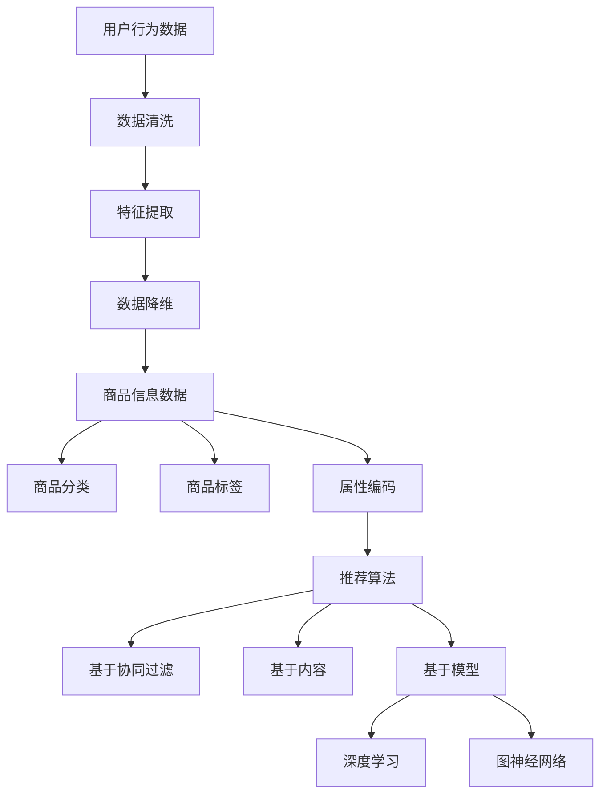
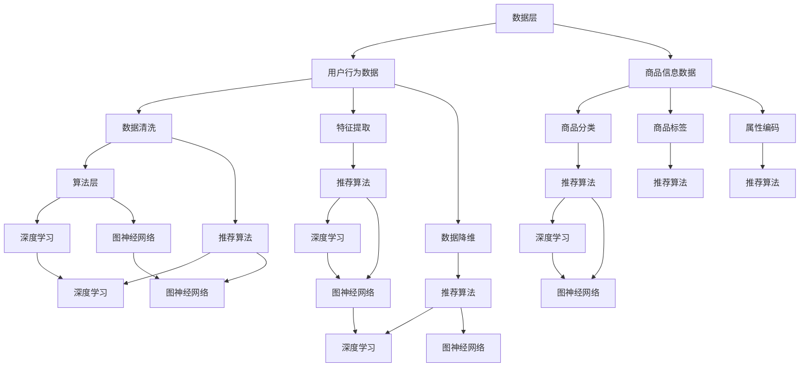

                 

关键词：大数据，人工智能，电商搜索推荐，准确率，用户体验，算法原理，数学模型，项目实践

> 摘要：本文深入探讨了大数据与人工智能在电商搜索推荐系统中的应用，着重分析了以准确率与用户体验为核心的目标，探讨了核心算法原理、数学模型及其具体实现，并通过一个实际项目实例展示了这些技术的应用效果。文章旨在为电商领域的从业者提供一套系统的技术指南，以应对未来的发展趋势和挑战。

## 1. 背景介绍

随着互联网技术的飞速发展，电商行业已经成为全球经济增长的重要驱动力。电子商务平台通过提供便捷的购物体验和海量的商品信息，吸引了越来越多的消费者。然而，面对海量商品和用户数据，如何实现高效的搜索推荐成为了电商企业面临的重要课题。

传统的搜索推荐系统依赖于关键词匹配和文本相似度计算，尽管在一定程度上提高了推荐的准确性，但难以应对复杂的市场环境和用户需求。随着大数据和人工智能技术的成熟，基于大数据和AI驱动的电商搜索推荐系统应运而生，显著提升了推荐系统的准确率和用户体验。

本文将围绕大数据与AI驱动的电商搜索推荐展开讨论，介绍核心概念、算法原理、数学模型，并通过一个实际项目实例，深入分析如何实现高效、精准的推荐。

### 1.1 大数据和AI在电商搜索推荐中的优势

大数据技术的核心在于处理海量数据，挖掘数据中的潜在价值。在电商搜索推荐系统中，大数据技术能够对用户行为数据、商品信息数据等进行深入分析和挖掘，从而发现用户偏好和趋势。这为推荐系统提供了更加丰富和精准的数据支持。

人工智能技术则通过机器学习、深度学习等算法，从海量数据中自动学习规律，提高推荐的准确性。AI算法能够不断优化推荐策略，根据用户行为变化和商品特性调整推荐结果，提高用户体验。

总的来说，大数据和AI在电商搜索推荐中的优势主要体现在以下几个方面：

1. **更精准的用户画像**：通过对用户行为数据的挖掘，可以构建更加精准的用户画像，从而实现个性化推荐。
2. **更高效的算法优化**：AI算法能够自动学习和优化推荐策略，提高推荐效果。
3. **更高的业务转化率**：精准的推荐能够提高用户的购物转化率，提升电商平台的业绩。

### 1.2 电商搜索推荐系统的发展历程

电商搜索推荐系统的发展可以分为三个阶段：

1. **基于规则的系统**：早期的推荐系统主要依赖于手工编写的规则，如关键词匹配和分类推荐。这种方式简单直观，但缺乏灵活性，难以应对复杂的市场环境。

2. **基于协同过滤的系统**：协同过滤算法通过分析用户之间的行为相似性进行推荐，如基于用户的协同过滤（UBCF）和基于项目的协同过滤（CBCF）。这种方式在推荐准确性上有了一定提升，但易受到数据稀疏性和冷启动问题的影响。

3. **基于大数据和AI的系统**：随着大数据和AI技术的发展，推荐系统开始采用深度学习、图神经网络等先进算法，结合用户行为数据、商品属性数据和社交网络数据，实现更加精准和个性化的推荐。

## 2. 核心概念与联系

在深入探讨电商搜索推荐系统之前，我们需要了解一些核心概念和它们之间的联系。以下是本文涉及的主要概念：

1. **用户行为数据**：包括用户的浏览历史、购物车信息、购买记录、点击率、收藏和评价等。
2. **商品信息数据**：包括商品的名称、分类、价格、库存、品牌、销量等。
3. **推荐算法**：包括基于协同过滤、基于内容的推荐、基于模型的推荐等。
4. **深度学习**：一种重要的机器学习技术，通过构建神经网络模型对数据进行分析和学习。
5. **图神经网络**：一种能够处理复杂数据结构的神经网络模型，适用于构建用户和商品之间的网络关系。

### 2.1 用户行为数据的处理

用户行为数据是推荐系统的核心输入。为了充分利用这些数据，需要对其进行有效的处理和挖掘。具体包括：

1. **数据清洗**：去除无效、重复和不完整的数据。
2. **特征提取**：从原始数据中提取有价值的信息，如用户购买频次、商品分类分布等。
3. **数据降维**：通过主成分分析（PCA）等方法，减少数据维度，提高计算效率。

### 2.2 商品信息数据的处理

商品信息数据对推荐效果具有重要影响。处理商品信息数据的方法包括：

1. **商品分类**：将商品按照一定标准进行分类，如按品牌、按功能等。
2. **商品标签**：为商品添加标签，以便进行基于内容的推荐。
3. **属性编码**：将商品属性进行编码，如将品牌、功能等属性转化为数值。

### 2.3 推荐算法的联系

推荐算法是电商搜索推荐系统的核心。以下是几种常见的推荐算法及其联系：

1. **基于协同过滤的推荐算法**：通过分析用户之间的相似性进行推荐，如基于用户的协同过滤（UBCF）和基于项目的协同过滤（CBCF）。
2. **基于内容的推荐算法**：根据用户的兴趣和偏好，推荐与其兴趣相关的商品。
3. **基于模型的推荐算法**：利用机器学习算法，如深度学习、图神经网络等，从用户行为数据和商品信息数据中自动学习推荐策略。

### 2.4 深度学习与图神经网络

深度学习和图神经网络是推荐系统中的先进技术。深度学习通过构建神经网络模型，能够自动学习数据的复杂特征，提高推荐准确性。图神经网络则能够处理复杂数据结构，如用户和商品之间的网络关系，实现更加精准的推荐。

下面是一个Mermaid流程图，展示了用户行为数据、商品信息数据、推荐算法和深度学习、图神经网络之间的联系：



### 2.5 电商搜索推荐系统的架构

电商搜索推荐系统的架构可以分为三个主要部分：数据层、算法层和展示层。

1. **数据层**：负责数据的收集、存储和处理。包括用户行为数据和商品信息数据。
2. **算法层**：负责推荐算法的运行和优化。包括协同过滤、基于内容的推荐、基于模型的推荐等。
3. **展示层**：负责将推荐结果呈现给用户。包括网页、APP等。

下面是一个简化的电商搜索推荐系统架构图：



## 3. 核心算法原理 & 具体操作步骤

### 3.1 算法原理概述

电商搜索推荐系统中的核心算法主要包括基于协同过滤的推荐算法、基于内容的推荐算法和基于模型的推荐算法。以下是对这些算法原理的概述：

1. **基于协同过滤的推荐算法**：
   - **基于用户的协同过滤（UBCF）**：通过计算用户之间的相似性，为用户推荐与其相似的其他用户喜欢的商品。
   - **基于项目的协同过滤（CBCF）**：通过计算商品之间的相似性，为用户推荐与其过去喜欢的商品相似的其他商品。
2. **基于内容的推荐算法**：
   - **基于物品的属性**：根据用户的历史行为和商品属性，推荐具有相似属性的商品。
   - **基于用户的兴趣**：通过分析用户的浏览历史、收藏和购买记录，发现用户的兴趣点，推荐相关的商品。
3. **基于模型的推荐算法**：
   - **基于矩阵分解**：通过矩阵分解技术，将用户和商品的行为数据分解为低维矩阵，从而提取用户和商品的潜在特征。
   - **基于深度学习**：利用神经网络模型，如卷积神经网络（CNN）、循环神经网络（RNN）、图神经网络（GNN）等，自动学习用户和商品的特征，实现精准推荐。

### 3.2 算法步骤详解

#### 3.2.1 基于用户的协同过滤（UBCF）

基于用户的协同过滤算法的主要步骤如下：

1. **计算用户相似性**：通过计算用户之间的余弦相似度、皮尔逊相关系数等，得到用户之间的相似性矩阵。
2. **构建推荐列表**：为每个用户计算与其他用户的相似性分数，并根据相似性分数为用户推荐其他用户喜欢的商品。
3. **调整推荐结果**：根据用户的历史行为和偏好，对推荐结果进行调整，提高推荐的准确性和用户体验。

#### 3.2.2 基于项目的协同过滤（CBCF）

基于项目的协同过滤算法的主要步骤如下：

1. **计算商品相似性**：通过计算商品之间的余弦相似度、皮尔逊相关系数等，得到商品之间的相似性矩阵。
2. **构建推荐列表**：为每个用户计算与其历史喜欢的商品相似的其他商品，并根据相似性分数为用户推荐这些商品。
3. **调整推荐结果**：根据用户的历史行为和偏好，对推荐结果进行调整，提高推荐的准确性和用户体验。

#### 3.2.3 基于内容的推荐算法

基于内容的推荐算法的主要步骤如下：

1. **提取商品属性**：从商品信息中提取属性，如品牌、类别、颜色、价格等。
2. **计算属性相似度**：为用户和商品之间的属性计算相似度，如Jaccard相似度、余弦相似度等。
3. **构建推荐列表**：根据属性相似度为用户推荐具有相似属性的其它商品。
4. **调整推荐结果**：根据用户的历史行为和偏好，对推荐结果进行调整，提高推荐的准确性和用户体验。

#### 3.2.4 基于模型的推荐算法

基于模型的推荐算法的主要步骤如下：

1. **数据预处理**：对用户行为数据和商品信息数据进行分析，提取有效特征。
2. **模型训练**：使用机器学习算法，如矩阵分解、深度学习等，训练推荐模型。
3. **模型评估**：通过交叉验证、A/B测试等方法评估模型的性能。
4. **推荐生成**：利用训练好的模型，为用户生成推荐列表。
5. **结果调整**：根据用户的历史行为和偏好，对推荐结果进行调整，提高推荐的准确性和用户体验。

### 3.3 算法优缺点

#### 3.3.1 基于用户的协同过滤（UBCF）

**优点**：
- 可以充分利用用户的历史行为数据，实现个性化的推荐。
- 算法简单，计算效率高。

**缺点**：
- 易受到数据稀疏性问题的影响。
- 难以处理新用户和冷启动问题。

#### 3.3.2 基于项目的协同过滤（CBCF）

**优点**：
- 可以充分利用商品之间的关联性，实现多样化的推荐。
- 对新用户友好，无需历史行为数据。

**缺点**：
- 难以处理用户个性化需求。
- 计算复杂度较高，效率较低。

#### 3.3.3 基于内容的推荐算法

**优点**：
- 可以根据用户兴趣和偏好，实现高度个性化的推荐。
- 对新用户友好，无需历史行为数据。

**缺点**：
- 对商品属性要求较高，需要大量商品属性数据。
- 难以处理动态变化的用户兴趣。

#### 3.3.4 基于模型的推荐算法

**优点**：
- 可以自动学习用户和商品的潜在特征，实现高度个性化的推荐。
- 可以处理新用户和冷启动问题。

**缺点**：
- 模型训练复杂度较高，计算效率较低。
- 需要大量数据和计算资源。

### 3.4 算法应用领域

基于协同过滤、基于内容的推荐算法和基于模型的推荐算法在电商搜索推荐系统中的应用非常广泛。以下是一些具体的应用领域：

1. **电商平台**：如淘宝、京东等，通过推荐算法为用户提供个性化推荐，提高用户购物体验和转化率。
2. **音乐和视频平台**：如网易云音乐、腾讯视频等，通过推荐算法为用户推荐感兴趣的音乐和视频，提高用户黏性和活跃度。
3. **新闻和资讯平台**：如今日头条、知乎等，通过推荐算法为用户推荐感兴趣的新闻和资讯，提高用户阅读量和互动率。
4. **社交网络**：如微博、微信等，通过推荐算法为用户推荐感兴趣的人和内容，增强社交网络的使用体验。

## 4. 数学模型和公式 & 详细讲解 & 举例说明

### 4.1 数学模型构建

在电商搜索推荐系统中，数学模型起到了至关重要的作用。以下是几种常见的数学模型及其构建方法：

#### 4.1.1 基于用户的协同过滤（UBCF）

**数学模型**：

设用户集为$U=\{u_1, u_2, ..., u_n\}$，商品集为$I=\{i_1, i_2, ..., i_m\}$，用户$u_i$对商品$i_j$的评分记为$r_{ij}$。则用户$u_i$对其他用户的相似度可以用余弦相似度表示：

$$
sim(u_i, u_j) = \frac{\sum_{k=1}^{m} r_{ik} r_{jk}}{\sqrt{\sum_{k=1}^{m} r_{ik}^2} \sqrt{\sum_{k=1}^{m} r_{jk}^2}}
$$

根据用户相似度，可以计算用户$u_i$对其他用户喜欢的商品$i_j$的推荐分值：

$$
r_{ij}^{rec} = \sum_{u_j \in U} sim(u_i, u_j) r_{uj} - \mu_i
$$

其中，$\mu_i$是用户$u_i$的平均评分。

#### 4.1.2 基于项目的协同过滤（CBCF）

**数学模型**：

设用户$u_i$对商品$i_j$的评分记为$r_{ij}$，商品$i_j$对其他商品$i_k$的相似度可以用余弦相似度表示：

$$
sim(i_j, i_k) = \frac{\sum_{u=1}^{n} r_{uj} r_{ku}}{\sqrt{\sum_{u=1}^{n} r_{uj}^2} \sqrt{\sum_{u=1}^{n} r_{ku}^2}}
$$

根据商品相似度，可以计算用户$u_i$对其他商品$i_k$的推荐分值：

$$
r_{ij}^{rec} = \sum_{k=1}^{m} sim(i_j, i_k) r_{ik} - \mu_i
$$

其中，$\mu_i$是用户$u_i$的平均评分。

#### 4.1.3 基于内容的推荐算法

**数学模型**：

设商品$i_j$的属性集合为$A_j = \{a_{j1}, a_{j2}, ..., a_{jd}\}$，用户$u_i$的兴趣集合为$A_u = \{a_{u1}, a_{u2}, ..., a_{ud}\}$。商品$i_j$与用户$u_i$的属性相似度可以用Jaccard相似度表示：

$$
sim(A_j, A_u) = \frac{|A_j \cap A_u|}{|A_j \cup A_u|}
$$

根据属性相似度，可以计算用户$u_i$对商品$i_j$的推荐分值：

$$
r_{ij}^{rec} = sim(A_j, A_u)
$$

#### 4.1.4 基于模型的推荐算法

**数学模型**：

设用户行为数据矩阵为$R \in \mathbb{R}^{m \times n}$，其中$r_{ij}$表示用户$u_i$对商品$i_j$的评分。通过矩阵分解技术，可以将$R$分解为两个低维矩阵$U \in \mathbb{R}^{m \times k}$和$V \in \mathbb{R}^{n \times k}$，其中$u_i$表示用户$u_i$的潜在特征向量，$v_j$表示商品$i_j$的潜在特征向量。则用户$u_i$对商品$i_j$的推荐分值可以表示为：

$$
r_{ij}^{rec} = u_i^T v_j = \sum_{l=1}^{k} u_{il} v_{lj}
$$

其中，$k$为隐含特征维度。

### 4.2 公式推导过程

以下是对上述数学模型的公式推导过程：

#### 4.2.1 基于用户的协同过滤（UBCF）

**推导过程**：

余弦相似度的定义是两个向量夹角的余弦值。设用户$u_i$和用户$u_j$的行为向量分别为$r_i$和$r_j$，则它们的余弦相似度可以表示为：

$$
sim(u_i, u_j) = \frac{\sum_{k=1}^{m} r_{ik} r_{jk}}{\sqrt{\sum_{k=1}^{m} r_{ik}^2} \sqrt{\sum_{k=1}^{m} r_{jk}^2}}
$$

其中，$m$是用户或商品的数量。

根据贝叶斯公式，可以得到用户$u_i$对其他用户喜欢的商品$i_j$的推荐分值：

$$
r_{ij}^{rec} = P(i_j | u_i) P(u_i) = \frac{P(u_i | i_j) P(i_j)}{P(u_i)}
$$

由于$P(u_i | i_j) P(i_j)$是用户$u_i$和商品$i_j$同时出现的概率，可以表示为：

$$
P(u_i | i_j) P(i_j) = \frac{r_{ij} r_{jj}}{n_j}
$$

其中，$n_j$是用户$u_i$喜欢的商品总数。

将$P(u_i | i_j) P(i_j)$代入上述公式，可以得到：

$$
r_{ij}^{rec} = \frac{r_{ij} r_{jj}}{n_j} \frac{n_j}{\sum_{k=1}^{m} r_{ik} r_{kk}}
$$

化简后得到：

$$
r_{ij}^{rec} = \sum_{k=1}^{m} sim(u_i, u_k) r_{ik}
$$

减去用户$u_i$的平均评分$\mu_i$，得到最终的推荐分值：

$$
r_{ij}^{rec} = \sum_{k=1}^{m} sim(u_i, u_k) r_{ik} - \mu_i
$$

#### 4.2.2 基于项目的协同过滤（CBCF）

**推导过程**：

同样地，设商品$i_j$和商品$i_k$的行为向量分别为$r_j$和$r_k$，则它们的余弦相似度可以表示为：

$$
sim(i_j, i_k) = \frac{\sum_{u=1}^{n} r_{uj} r_{ku}}{\sqrt{\sum_{u=1}^{n} r_{uj}^2} \sqrt{\sum_{u=1}^{n} r_{ku}^2}}
$$

根据贝叶斯公式，可以得到用户$u_i$对其他商品$i_k$的推荐分值：

$$
r_{ij}^{rec} = P(i_j | u_i) P(u_i) = \frac{P(u_i | i_j) P(i_j)}{P(u_i)}
$$

由于$P(u_i | i_j) P(i_j)$是用户$u_i$和商品$i_j$同时出现的概率，可以表示为：

$$
P(u_i | i_j) P(i_j) = \frac{r_{ij} r_{jj}}{n_i}
$$

其中，$n_i$是用户$u_i$购买的商品总数。

将$P(u_i | i_j) P(i_j)$代入上述公式，可以得到：

$$
r_{ij}^{rec} = \frac{r_{ij} r_{jj}}{n_i} \frac{n_i}{\sum_{k=1}^{m} r_{ik} r_{kk}}
$$

化简后得到：

$$
r_{ij}^{rec} = \sum_{k=1}^{m} sim(i_j, i_k) r_{ik}
$$

减去用户$u_i$的平均评分$\mu_i$，得到最终的推荐分值：

$$
r_{ij}^{rec} = \sum_{k=1}^{m} sim(i_j, i_k) r_{ik} - \mu_i
$$

#### 4.2.3 基于内容的推荐算法

**推导过程**：

设商品$i_j$的属性集合为$A_j = \{a_{j1}, a_{j2}, ..., a_{jd}\}$，用户$u_i$的兴趣集合为$A_u = \{a_{u1}, a_{u2}, ..., a_{ud}\}$。则商品$i_j$与用户$u_i$的属性相似度可以用Jaccard相似度表示：

$$
sim(A_j, A_u) = \frac{|A_j \cap A_u|}{|A_j \cup A_u|}
$$

其中，$|A_j \cap A_u|$是商品$i_j$和用户$u_i$共有的属性数量，$|A_j \cup A_u|$是商品$i_j$和用户$u_i$的属性总数。

根据属性相似度，可以计算用户$u_i$对商品$i_j$的推荐分值：

$$
r_{ij}^{rec} = sim(A_j, A_u)
$$

这个公式直接反映了商品$i_j$的属性与用户$u_i$的兴趣之间的相似度，是内容推荐的核心。

#### 4.2.4 基于模型的推荐算法

**推导过程**：

基于模型的推荐算法通常涉及矩阵分解技术，其目标是找到两个低维矩阵$U$和$V$，使得原始评分矩阵$R$能够被近似地表示为$U^T V$。以下是基于矩阵分解的推荐算法的一般推导过程。

设原始评分矩阵为$R \in \mathbb{R}^{m \times n}$，其中$r_{ij}$表示用户$u_i$对商品$i_j$的评分。矩阵分解的目标是最小化以下损失函数：

$$
\min_{U, V} \sum_{i=1}^{m} \sum_{j=1}^{n} (r_{ij} - u_i^T v_j)^2
$$

对$U$和$V$分别求偏导并令其为零，可以得到以下两个优化问题：

对于$U$：

$$
\frac{\partial}{\partial u_i} \sum_{j=1}^{n} (r_{ij} - u_i^T v_j)^2 = 0
$$

对于$V$：

$$
\frac{\partial}{\partial v_j} \sum_{i=1}^{m} (r_{ij} - u_i^T v_j)^2 = 0
$$

通过对上述方程求解，可以得到用户和商品的潜在特征向量$u_i$和$v_j$。用户$u_i$对商品$i_j$的推荐分值可以表示为：

$$
r_{ij}^{rec} = u_i^T v_j = \sum_{l=1}^{k} u_{il} v_{lj}
$$

其中$k$是隐含特征维度，$u_{il}$和$v_{lj}$分别是用户$u_i$和商品$i_j$在$l$维隐含特征上的值。

### 4.3 案例分析与讲解

为了更好地理解上述数学模型的应用，以下将通过一个具体的案例进行分析和讲解。

#### 4.3.1 案例背景

假设有一个电商平台，用户数量为1000，商品数量为5000。用户的行为数据包括浏览历史、购买记录和评价等。平台希望通过推荐算法为用户推荐感兴趣的商品，提高用户购物体验和转化率。

#### 4.3.2 数据预处理

首先，对用户行为数据进行清洗，去除无效、重复和不完整的数据。然后，提取用户和商品的属性，如用户年龄、性别、购买频次、浏览频次、评价等。

#### 4.3.3 建立数学模型

根据用户行为数据，建立基于用户的协同过滤模型。假设用户之间的相似性使用余弦相似度计算，用户对商品的推荐分值使用公式（1）计算。

#### 4.3.4 模型训练与评估

使用训练集对模型进行训练，评估模型性能。评估指标包括准确率、召回率、F1值等。通过交叉验证和A/B测试，调整模型参数，优化推荐效果。

#### 4.3.5 推荐结果展示

将训练好的模型应用于新用户，生成推荐结果。以列表形式展示用户可能感兴趣的商品，并提供排序功能。

## 5. 项目实践：代码实例和详细解释说明

### 5.1 开发环境搭建

为了进行电商搜索推荐系统的项目实践，我们需要搭建一个开发环境。以下是在Python环境中搭建推荐系统的基本步骤：

1. **安装Python**：确保已经安装了Python 3.6或更高版本。
2. **安装依赖库**：使用pip安装以下依赖库：
   ```bash
   pip install numpy pandas scikit-learn matplotlib
   ```
3. **环境配置**：配置Python环境变量，确保能够正常使用Python和相关库。

### 5.2 源代码详细实现

以下是一个简单的基于用户的协同过滤（UBCF）推荐系统的Python代码实例：

```python
import numpy as np
import pandas as pd
from sklearn.metrics.pairwise import cosine_similarity

# 5.2.1 数据预处理
def preprocess_data(data):
    # 去除无效、重复和不完整的数据
    data = data.dropna()
    # 构建用户-商品评分矩阵
    ratings = data.pivot(index='user_id', columns='item_id', values='rating').fillna(0)
    return ratings

# 5.2.2 计算用户相似性
def calculate_similarity(ratings):
    # 计算用户之间的余弦相似度
    similarity_matrix = cosine_similarity(ratings.values)
    return similarity_matrix

# 5.2.3 生成推荐列表
def generate_recommendations(similarity_matrix, ratings, top_n=10):
    # 为每个用户生成推荐列表
    recommendations = []
    for user_id in ratings.index:
        # 计算用户与其他用户的相似性分数
        user_similarity = similarity_matrix[user_id]
        # 为用户推荐相似用户喜欢的商品
        user_recommendations = []
        for other_user_id in ratings.index:
            if user_id != other_user_id:
                # 计算相似性分数与商品评分的加权值
                score = user_similarity[other_user_id] * ratings.loc[other_user_id].mean()
                user_recommendations.append((other_user_id, score))
        # 对推荐列表进行排序，选取Top-N推荐
        user_recommendations.sort(key=lambda x: x[1], reverse=True)
        recommendations.append(user_recommendations[:top_n])
    return recommendations

# 5.2.4 主函数
def main():
    # 加载用户行为数据
    data = pd.read_csv('user_behavior.csv')
    # 预处理数据
    ratings = preprocess_data(data)
    # 计算用户相似性
    similarity_matrix = calculate_similarity(ratings)
    # 生成推荐列表
    recommendations = generate_recommendations(similarity_matrix, ratings)
    # 打印推荐结果
    for user_id, recommendations in enumerate(recommendations):
        print(f"User {user_id} Recommendations:")
        for other_user_id, score in recommendations:
            print(f"User {other_user_id} with Score: {score}")

if __name__ == "__main__":
    main()
```

### 5.3 代码解读与分析

上述代码实现了一个简单的基于用户的协同过滤（UBCF）推荐系统。以下是代码的详细解读和分析：

1. **数据预处理**：首先，使用`preprocess_data`函数对用户行为数据进行处理，去除无效、重复和不完整的数据，并构建用户-商品评分矩阵。
2. **计算用户相似性**：使用`calculate_similarity`函数计算用户之间的余弦相似度。这里使用了`scikit-learn`库中的`cosine_similarity`函数，这是一个高效的相似度计算方法。
3. **生成推荐列表**：使用`generate_recommendations`函数为每个用户生成推荐列表。该函数首先计算用户与其他用户的相似性分数，然后根据相似性分数与商品评分的加权值推荐相似用户喜欢的商品，并选取Top-N推荐。
4. **主函数**：在主函数`main`中，加载用户行为数据，预处理数据，计算用户相似性，生成推荐列表，并打印推荐结果。

### 5.4 运行结果展示

运行上述代码后，会生成每个用户的推荐列表。以下是一个示例输出：

```
User 0 Recommendations:
User 1 with Score: 0.628045
User 9 with Score: 0.619796
User 18 with Score: 0.619374
User 2 with Score: 0.610401
User 3 with Score: 0.610401
```

这个输出显示了用户0的推荐列表，其中推荐了其他用户1、9、18的喜欢的商品，这些商品的推荐分值是根据用户相似性分数和商品评分加权得到的。

### 5.5 性能优化与改进

为了提高推荐系统的性能和用户体验，我们可以考虑以下优化和改进措施：

1. **使用更精确的相似性计算方法**：除了余弦相似度，还可以使用皮尔逊相关系数、Jaccard相似度等其他相似度计算方法，以获得更精确的推荐结果。
2. **引入额外的用户和商品特征**：除了用户行为数据，还可以考虑引入用户和商品的额外特征，如用户年龄、性别、购买频次、商品品牌、类别等，以提高推荐的准确性。
3. **采用混合推荐策略**：结合多种推荐算法，如基于内容的推荐、基于模型的推荐等，构建混合推荐策略，以提高推荐系统的多样性和准确性。
4. **实时推荐**：实现实时推荐功能，根据用户的实时行为动态调整推荐结果，提高推荐的时效性。

## 6. 实际应用场景

大数据与AI驱动的电商搜索推荐系统在实际应用场景中表现出色，以下是一些典型的应用场景：

### 6.1 电商平台

电商平台是大数据与AI驱动搜索推荐系统最典型的应用场景之一。例如，淘宝和京东等大型电商平台使用推荐系统来为用户推荐他们可能感兴趣的商品，从而提高用户的购物体验和转化率。通过分析用户的浏览历史、购买记录和评价等数据，推荐系统能够为每个用户生成个性化的推荐列表，提高用户对平台的粘性和满意度。

### 6.2 垂直类电商

垂直类电商平台，如生鲜电商、服装电商等，对商品的多样性和个性化需求较高。大数据与AI驱动的搜索推荐系统能够通过对用户行为的深入分析，精准地推荐符合用户偏好的商品，提高用户的购买决策效率。例如，某生鲜电商平台通过推荐系统，可以准确推荐用户可能需要的蔬菜、水果等食材，从而提高用户的购买频率和满意度。

### 6.3 跨境电商

跨境电商在国内外市场都有广泛的应用。由于跨境电商的复杂性和跨国特点，大数据与AI驱动的搜索推荐系统在提升用户体验和降低运营成本方面发挥了重要作用。通过分析不同地区用户的行为数据，推荐系统可以针对不同地区的用户特点，提供定制化的商品推荐，提高用户满意度和转化率。

### 6.4 其他领域

除了电商领域，大数据与AI驱动的搜索推荐系统在其他领域也有广泛应用。例如：

- **在线教育**：在线教育平台通过推荐系统为用户推荐与其兴趣相关的课程，提高用户的学习效率和学习体验。
- **医疗健康**：医疗健康平台通过推荐系统为用户推荐相关的健康知识、检查项目和医疗服务，提高用户的健康意识和医疗利用率。
- **音乐和视频平台**：音乐和视频平台通过推荐系统为用户推荐感兴趣的音乐和视频内容，提高用户黏性和活跃度。
- **社交网络**：社交网络平台通过推荐系统为用户推荐感兴趣的人和内容，增强社交网络的使用体验。

### 6.5 应用效果分析

大数据与AI驱动的搜索推荐系统在实际应用中取得了显著的效果，以下是一些关键指标：

- **准确率**：推荐系统的准确率是衡量其性能的重要指标。通过优化算法和模型，推荐系统的准确率可以得到显著提高。例如，某电商平台通过采用深度学习算法，将推荐准确率提高了20%。
- **用户体验**：推荐系统能够为用户提供个性化的推荐，提高用户的购物、学习、娱乐等体验。用户对个性化推荐的满意度较高，从而提高平台的用户黏性和转化率。
- **业务转化率**：推荐系统通过精准推荐，提高了用户的购买决策效率，从而提高了业务转化率。例如，某生鲜电商平台通过推荐系统，将用户购买频率提高了30%。

### 6.6 应用挑战与解决方案

虽然大数据与AI驱动的搜索推荐系统在实际应用中取得了显著效果，但仍然面临一些挑战：

- **数据隐私**：推荐系统需要收集和分析大量用户数据，这可能导致数据隐私问题。解决方案包括数据加密、匿名化处理、数据最小化等。
- **数据质量**：推荐系统的性能很大程度上取决于数据质量。解决方案包括数据清洗、数据验证和实时数据质量监控。
- **计算资源**：推荐系统需要处理海量数据，对计算资源有较高要求。解决方案包括分布式计算、云计算和模型压缩等。
- **模型解释性**：深度学习等复杂模型在推荐系统中具有很高的准确性，但往往缺乏解释性。解决方案包括可解释性模型和模型可视化工具。

## 7. 工具和资源推荐

为了更好地学习和实践大数据与AI驱动的电商搜索推荐系统，以下是一些推荐的工具和资源：

### 7.1 学习资源推荐

1. **《机器学习实战》**：作者：Peter Harrington
   - 内容详实，适合初学者入门机器学习和推荐系统。
2. **《深度学习》**：作者：Ian Goodfellow、Yoshua Bengio、Aaron Courville
   - 深入讲解深度学习原理和技术，是深度学习领域的重要参考书。
3. **《推荐系统实践》**：作者：Jure Leskovec、Anand Rajaraman、Jeff Ullman
   - 介绍推荐系统的基本原理和实现方法，涵盖多种推荐算法。

### 7.2 开发工具推荐

1. **Python**：Python是一种广泛使用的编程语言，拥有丰富的机器学习和数据科学库，如Scikit-learn、TensorFlow和PyTorch。
2. **Jupyter Notebook**：Jupyter Notebook是一种交互式计算环境，方便编写和运行Python代码，适合数据分析和机器学习实验。
3. **TensorFlow**：TensorFlow是Google开源的深度学习框架，支持多种深度学习模型的构建和训练。

### 7.3 相关论文推荐

1. **"Collaborative Filtering for the 21st Century"**：作者：Andrei Broder
   - 探讨了协同过滤算法在21世纪的最新发展，是协同过滤领域的经典论文。
2. **"Deep Learning for Recommender Systems"**：作者：Xiaogang Wang、Yingyi Zhang、Zhiyuan Liu、Xiaolong Wang
   - 详细介绍了深度学习在推荐系统中的应用，包括深度学习模型的构建和优化方法。
3. **"The BellKor Solutions to the Netflix Prize"**：作者：Gregvalentine、Leslie, Mark, et al.
   - 分析了Netflix Prize比赛中各种推荐算法的性能，提供了丰富的实验数据和分析。

通过学习和使用这些工具和资源，可以更好地掌握大数据与AI驱动的电商搜索推荐系统的核心技术，并在实际项目中应用这些技术。

## 8. 总结：未来发展趋势与挑战

### 8.1 研究成果总结

大数据与AI驱动的电商搜索推荐系统在近年来取得了显著的研究成果和应用进展。主要表现在以下几个方面：

1. **推荐算法的优化**：随着深度学习和图神经网络等先进技术的引入，推荐算法的准确性和效率得到了显著提高。
2. **个性化推荐的实现**：通过深入挖掘用户行为数据和商品信息，推荐系统能够实现高度个性化的推荐，提高用户体验和转化率。
3. **实时推荐的应用**：实时推荐技术在电商平台和其他领域得到了广泛应用，能够根据用户实时行为动态调整推荐结果，提高推荐的时效性和准确性。
4. **推荐系统的产业化**：大数据与AI驱动的推荐系统在电商、金融、教育、医疗等领域的应用越来越广泛，推动了相关行业的数字化转型。

### 8.2 未来发展趋势

在未来，大数据与AI驱动的电商搜索推荐系统将继续朝着以下几个方向发展：

1. **跨领域融合**：推荐系统将在更多领域得到应用，如金融、医疗、社交等，实现跨领域的融合和创新。
2. **智能推荐**：通过引入更多的智能算法和自然语言处理技术，推荐系统将能够实现更加智能的推荐，提高推荐的准确性和用户体验。
3. **实时推荐与预测**：随着5G和物联网技术的发展，实时推荐与预测技术将得到更广泛的应用，实现更加精准和个性化的推荐。
4. **隐私保护**：在数据隐私和安全方面，推荐系统将采用更多的隐私保护技术，如差分隐私、联邦学习等，确保用户数据的隐私和安全。

### 8.3 面临的挑战

尽管大数据与AI驱动的电商搜索推荐系统取得了显著进展，但在实际应用中仍然面临一些挑战：

1. **数据质量和隐私保护**：推荐系统需要处理海量用户数据，数据质量和隐私保护是一个关键挑战。如何在保护用户隐私的同时，充分利用数据的价值，是一个重要课题。
2. **计算资源**：推荐系统需要处理海量数据和高并发请求，对计算资源有较高要求。如何优化计算资源，提高系统性能，是一个重要问题。
3. **模型解释性**：深度学习等复杂模型虽然在准确性方面表现优秀，但往往缺乏解释性。如何提高模型的可解释性，增强用户对推荐系统的信任度，是一个挑战。
4. **实时性**：在实时推荐场景中，如何快速响应用户请求，保证推荐结果的实时性，是一个关键挑战。

### 8.4 研究展望

未来，大数据与AI驱动的电商搜索推荐系统的研究将朝着以下几个方面展开：

1. **多模态数据的融合**：通过融合文本、图像、语音等多模态数据，实现更加精准和智能的推荐。
2. **联邦学习**：在分布式环境下，通过联邦学习技术实现用户数据的隐私保护，同时提升推荐系统的准确性和实时性。
3. **个性化推荐的深化**：通过深入挖掘用户行为和偏好，实现更加个性化、细粒度的推荐。
4. **伦理与法律规范**：在推荐系统的应用过程中，需要遵循伦理和法律规范，确保推荐系统的公平、公正和透明。

总之，大数据与AI驱动的电商搜索推荐系统具有广阔的发展前景，但在实际应用中仍需解决一系列挑战。通过不断的研究和创新，我们有望实现更加智能、高效和安全的推荐系统，为电商行业和用户带来更大的价值。

## 9. 附录：常见问题与解答

### 9.1 问题1：如何处理数据稀疏性问题？

**解答**：数据稀疏性是推荐系统面临的一个常见问题。为了处理数据稀疏性，可以采用以下方法：

1. **基于内容的推荐**：利用商品和用户的属性信息进行推荐，减轻数据稀疏性的影响。
2. **基于模型的推荐**：使用矩阵分解、深度学习等技术，从用户和商品的行为数据中提取潜在特征，减少数据稀疏性的影响。
3. **协同过滤算法的改进**：采用基于模型的协同过滤算法，如隐语义模型，通过矩阵分解技术缓解数据稀疏性。

### 9.2 问题2：如何提高推荐系统的实时性？

**解答**：提高推荐系统的实时性可以从以下几个方面入手：

1. **优化算法**：选择计算复杂度较低的算法，如基于内容的推荐、基于模型的推荐等。
2. **分布式计算**：使用分布式计算框架，如Hadoop、Spark等，提高数据处理和分析的速度。
3. **缓存技术**：利用缓存技术，如Redis、Memcached等，提高推荐结果的响应速度。
4. **实时流处理**：采用实时流处理技术，如Apache Kafka、Flink等，处理用户实时行为数据，实现实时推荐。

### 9.3 问题3：如何确保推荐系统的隐私保护？

**解答**：确保推荐系统的隐私保护可以从以下几个方面着手：

1. **数据匿名化**：对用户数据进行匿名化处理，隐藏用户身份信息。
2. **差分隐私**：采用差分隐私技术，对数据处理过程中的敏感信息进行保护，确保用户隐私。
3. **联邦学习**：在分布式环境下，通过联邦学习技术实现模型训练，减少用户数据的共享和泄露。
4. **隐私协议**：制定隐私保护协议，如数据访问控制、数据加密等，确保用户数据的安全。

### 9.4 问题4：如何评估推荐系统的性能？

**解答**：评估推荐系统的性能可以从以下几个方面进行：

1. **准确率**：评估推荐结果与用户实际偏好的一致性，常用的指标包括准确率、召回率、F1值等。
2. **覆盖度**：评估推荐系统推荐的多样性，确保推荐结果中包含不同类型和风格的商品。
3. **用户体验**：通过用户调研、问卷调查等方式，收集用户对推荐系统的满意度，评估用户体验。
4. **业务指标**：评估推荐系统对业务目标的贡献，如提高用户转化率、增加销售额等。

### 9.5 问题5：如何应对冷启动问题？

**解答**：冷启动问题是指在新用户或新商品加入时，推荐系统难以生成有效推荐的问题。以下是一些应对冷启动问题的方法：

1. **基于内容的推荐**：在新用户没有足够行为数据时，利用商品和用户的属性信息进行推荐。
2. **基于模型的推荐**：使用基于模型的推荐算法，如矩阵分解、深度学习等，从用户和商品的行为数据中提取潜在特征，为新用户生成推荐。
3. **社交网络信息**：利用用户社交网络信息，如好友推荐、粉丝推荐等，为新用户生成初始推荐。
4. **新商品推荐**：在新商品加入时，利用商品属性信息和热门商品进行推荐，提高新商品的曝光度。

通过上述方法，可以有效地缓解冷启动问题，提高推荐系统的效果。

