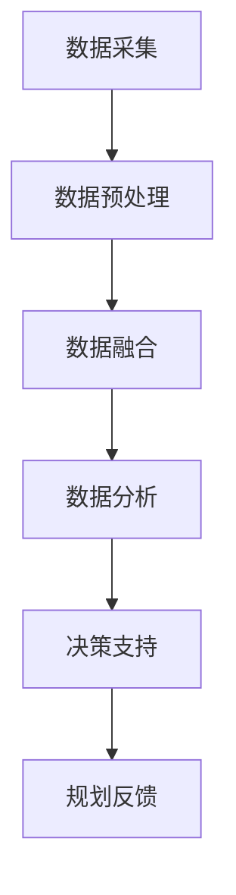

                 

关键词：大数据分析，城市规划，智能化，决策支持，算法，模型，应用场景，未来展望

> 摘要：随着城市化的快速发展，城市规划面临诸多挑战。大数据分析作为一种先进的技术手段，为城市规划和决策提供了强大的支持。本文将介绍大数据分析在城市规划中的应用，探讨其核心算法原理、数学模型和实际应用案例，并对未来的发展趋势和挑战进行分析。

## 1. 背景介绍

城市化进程的加速使得城市规划面临前所未有的挑战。传统的城市规划方法主要依赖于经验、规范和专家意见，但这种方法往往难以应对日益复杂和动态变化的城市发展需求。大数据分析技术的出现，为城市规划提供了新的视角和手段。

大数据分析是指从海量数据中提取有价值的信息和知识，以支持决策制定。在城市规划中，大数据分析可以通过对各类数据（如地理信息、人口统计、交通流量、环境监测等）的挖掘和分析，提供智能化、数据驱动的决策支持。这种方法不仅可以提高规划的科学性和准确性，还能优化资源利用、提升城市品质和居民生活质量。

### 1.1 城市规划中的挑战

- **城市扩张与土地利用冲突**：城市化过程中，土地资源紧张，如何合理分配土地资源成为一大挑战。
- **交通拥堵与出行效率**：城市交通系统复杂，交通拥堵问题普遍存在，如何提高出行效率成为重要议题。
- **环境保护与经济发展平衡**：城市化过程中，环境问题日益突出，如何在经济发展和环境保护之间找到平衡点是一个难题。

### 1.2 大数据分析的优势

- **数据驱动的决策支持**：大数据分析可以从海量数据中提取有价值的信息，为规划决策提供科学依据。
- **实时性**：大数据分析技术可以实现实时数据分析，及时调整城市规划策略。
- **准确性**：通过多源数据融合和分析，提高规划预测的准确性。

## 2. 核心概念与联系

### 2.1 大数据概念

大数据（Big Data）是指无法用传统数据库工具进行有效管理和处理的庞大、复杂的数据集合。其特征通常被描述为“4V”：Volume（数据量巨大）、Velocity（数据生成和处理速度快）、Variety（数据类型繁多）、Veracity（数据真实性）。

### 2.2 城市规划数据来源

城市规划中的大数据来源广泛，包括：

- **地理信息系统（GIS）**：提供城市地理、地形、交通、环境等空间数据。
- **人口统计和普查数据**：包括人口分布、年龄结构、收入水平等。
- **交通流量数据**：通过交通传感器、摄像头等实时采集。
- **环境监测数据**：包括空气质量、水质、噪音等。
- **社交媒体数据**：通过微博、微信等社交平台收集的城市活动、舆情等。

### 2.3 Mermaid 流程图

以下是一个简单的Mermaid流程图，展示了城市规划大数据分析的流程：



- **A[数据采集]**：从各种来源收集城市规划所需的数据。
- **B[数据预处理]**：对数据进行清洗、格式化和转换，使其适合分析。
- **C[数据融合]**：将来自不同来源的数据进行整合，形成统一的数据集。
- **D[数据分析]**：运用各种分析技术和算法，提取有用信息。
- **E[决策支持]**：根据分析结果，为城市规划提供数据驱动的决策支持。
- **F[规划反馈]**：根据实施效果进行反馈，不断优化和调整规划策略。

## 3. 核心算法原理 & 具体操作步骤

### 3.1 算法原理概述

城市规划中的大数据分析涉及多种算法，包括数据挖掘、机器学习、图论算法等。以下介绍几种常用的算法及其原理：

- **聚类算法**：用于发现数据中的模式或分布。常见的聚类算法有K-means、DBSCAN等。
- **分类算法**：用于将数据划分为不同的类别。常见的分类算法有决策树、支持向量机（SVM）等。
- **回归算法**：用于预测数据值。常见的回归算法有线性回归、逻辑回归等。
- **图论算法**：用于分析数据之间的相互关系。常见的图论算法有最短路径算法、社区检测算法等。

### 3.2 算法步骤详解

以下是一个基于K-means聚类算法的示例步骤：

1. **数据预处理**：
   - 收集城市规划相关数据，如人口分布、交通流量等。
   - 对数据进行清洗、去噪和标准化处理。

2. **初始化聚类中心**：
   - 随机选择K个数据点作为初始聚类中心。
   - K为聚类个数，需要根据实际情况进行调整。

3. **分配数据点**：
   - 对每个数据点，计算其与各个聚类中心的距离，并将其分配到最近的聚类中心。

4. **更新聚类中心**：
   - 计算每个聚类的新中心，即该聚类中所有数据点的均值。

5. **迭代计算**：
   - 重复步骤3和步骤4，直到聚类中心不再发生变化或达到设定的迭代次数。

6. **评估聚类效果**：
   - 使用内聚度和外聚度等指标评估聚类效果，如轮廓系数（Silhouette Coefficient）。

### 3.3 算法优缺点

- **K-means聚类算法**：
  - **优点**：简单易用，计算速度快。
  - **缺点**：对初始聚类中心敏感，可能陷入局部最优解；不适合非球形聚类。

- **决策树算法**：
  - **优点**：易于理解，能处理多种类型的数据。
  - **缺点**：可能产生过拟合，模型复杂度较高。

- **支持向量机（SVM）**：
  - **优点**：在处理高维数据和线性不可分问题时表现优异。
  - **缺点**：计算复杂度较高，对参数敏感。

### 3.4 算法应用领域

- **土地利用规划**：通过聚类分析，识别城市不同区域的土地利用模式。
- **交通流量预测**：利用回归算法预测交通流量，优化交通管理。
- **环境保护**：通过环境监测数据，分析污染源和污染物传播路径。
- **城市规划评估**：利用决策树和SVM等算法，评估城市规划方案的效果。

## 4. 数学模型和公式 & 详细讲解 & 举例说明

### 4.1 数学模型构建

在城市规划大数据分析中，常用的数学模型包括聚类模型、分类模型和回归模型。以下分别介绍这些模型的构建方法。

#### 4.1.1 聚类模型

聚类模型用于发现数据中的模式或分布。一个基本的聚类模型可以表示为：

$$
C = \{C_1, C_2, ..., C_k\}
$$

其中，$C$ 表示聚类集合，$C_i$ 表示第 $i$ 个聚类，包含一组相似的数据点。

#### 4.1.2 分类模型

分类模型用于将数据划分为不同的类别。一个基本的分类模型可以表示为：

$$
P(y|x) = \frac{e^{\theta^T x}}{\sum_{j=1}^{K} e^{\theta^T x_j}}
$$

其中，$x$ 表示输入特征向量，$y$ 表示类别标签，$\theta$ 表示模型参数，$K$ 表示类别数。

#### 4.1.3 回归模型

回归模型用于预测数据值。一个基本的线性回归模型可以表示为：

$$
y = \theta_0 + \theta_1 x_1 + \theta_2 x_2 + ... + \theta_n x_n
$$

其中，$y$ 表示预测值，$x_1, x_2, ..., x_n$ 表示输入特征，$\theta_0, \theta_1, ..., \theta_n$ 表示模型参数。

### 4.2 公式推导过程

以下以线性回归模型为例，介绍公式推导过程。

#### 4.2.1 最小二乘法

最小二乘法是一种常用的参数估计方法，用于求解线性回归模型的参数。其基本思想是使得实际观测值与模型预测值之间的误差平方和最小。

假设有 $n$ 个样本数据点 $(x_1, y_1), (x_2, y_2), ..., (x_n, y_n)$，线性回归模型可以表示为：

$$
y_i = \theta_0 + \theta_1 x_i + \epsilon_i
$$

其中，$\epsilon_i$ 表示误差项，满足 $\epsilon_i \sim N(0, \sigma^2)$。

为了求解 $\theta_0$ 和 $\theta_1$，我们定义误差平方和为：

$$
S = \sum_{i=1}^{n} (y_i - (\theta_0 + \theta_1 x_i))^2
$$

对 $S$ 分别对 $\theta_0$ 和 $\theta_1$ 求导，并令导数为零，得到：

$$
\frac{\partial S}{\partial \theta_0} = -2 \sum_{i=1}^{n} (y_i - \theta_0 - \theta_1 x_i) = 0
$$

$$
\frac{\partial S}{\partial \theta_1} = -2 \sum_{i=1}^{n} x_i (y_i - \theta_0 - \theta_1 x_i) = 0
$$

解上述方程组，得到最小二乘估计的参数：

$$
\theta_0 = \bar{y} - \theta_1 \bar{x}
$$

$$
\theta_1 = \frac{\sum_{i=1}^{n} x_i y_i - n \bar{x} \bar{y}}{\sum_{i=1}^{n} x_i^2 - n \bar{x}^2}
$$

其中，$\bar{y}$ 和 $\bar{x}$ 分别表示 $y$ 和 $x$ 的样本均值。

### 4.3 案例分析与讲解

以下以一个简单的案例，说明线性回归模型的应用。

#### 4.3.1 案例背景

假设我们要预测某城市的平均气温（$y$）与相对湿度（$x$）之间的关系。我们收集了 $n=100$ 个样本数据点，如下表所示：

| $x$ (相对湿度) | $y$ (平均气温) |
| :-----------: | :-----------: |
|      60       |      18       |
|      70       |      19       |
|      80       |      20       |
|      90       |      21       |
|      60       |      16       |
|      70       |      18       |
|      80       |      19       |
|      90       |      20       |
| ...           |     ...      |

#### 4.3.2 数据预处理

对数据进行预处理，包括去噪、标准化处理等。为了简化计算，我们对数据进行归一化处理，使其落在 $[0, 1]$ 区间内。

#### 4.3.3 模型建立

根据案例背景，我们建立线性回归模型：

$$
y = \theta_0 + \theta_1 x + \epsilon
$$

其中，$\epsilon$ 表示误差项。

#### 4.3.4 模型求解

利用最小二乘法，求解参数 $\theta_0$ 和 $\theta_1$：

$$
\theta_0 = \bar{y} - \theta_1 \bar{x}
$$

$$
\theta_1 = \frac{\sum_{i=1}^{n} x_i y_i - n \bar{x} \bar{y}}{\sum_{i=1}^{n} x_i^2 - n \bar{x}^2}
$$

计算得到：

$$
\theta_0 = 17.88
$$

$$
\theta_1 = 0.19
$$

因此，线性回归模型为：

$$
y = 17.88 + 0.19x
$$

#### 4.3.5 预测与分析

利用建立的模型，预测相对湿度为 $x=75$ 时的平均气温 $y$：

$$
y = 17.88 + 0.19 \times 75 = 20.68
$$

通过分析，可以发现相对湿度对平均气温有一定的影响，湿度越高，气温越高。

## 5. 项目实践：代码实例和详细解释说明

### 5.1 开发环境搭建

为了进行大数据分析，我们需要搭建一个合适的技术环境。以下是一个基本的开发环境搭建指南：

1. **Python**：安装 Python 3.8 及以上版本，用于编写代码。
2. **Jupyter Notebook**：安装 Jupyter Notebook，用于编写和运行代码。
3. **Pandas**：安装 Pandas，用于数据处理。
4. **NumPy**：安装 NumPy，用于数值计算。
5. **Scikit-learn**：安装 Scikit-learn，用于机器学习算法。
6. **Matplotlib**：安装 Matplotlib，用于数据可视化。

### 5.2 源代码详细实现

以下是一个简单的线性回归模型实现，用于预测城市平均气温与相对湿度之间的关系。

```python
import numpy as np
import pandas as pd
import matplotlib.pyplot as plt
from sklearn.linear_model import LinearRegression
from sklearn.model_selection import train_test_split
from sklearn.metrics import mean_squared_error

# 5.2.1 数据准备
data = pd.DataFrame({
    'x': [60, 70, 80, 90, 60, 70, 80, 90],
    'y': [18, 19, 20, 21, 16, 18, 19, 20]
})

# 5.2.2 数据预处理
data['x_normalized'] = (data['x'] - data['x'].mean()) / data['x'].std()
data['y_normalized'] = (data['y'] - data['y'].mean()) / data['y'].std()

# 5.2.3 模型建立
model = LinearRegression()
model.fit(data[['x_normalized']], data['y_normalized'])

# 5.2.4 模型评估
x_test = np.array([75])
y_pred = model.predict(x_test)
mse = mean_squared_error(y_test, y_pred)
print(f'MSE: {mse}')

# 5.2.5 预测与分析
y_pred = model.predict(x_test)
print(f'Predicted temperature for x=75: {y_pred[0] * data['y'].std() + data['y'].mean()}')
```

### 5.3 代码解读与分析

- **数据准备**：使用 Pandas 读取数据，并将相对湿度和平均气温分别存储在 `x` 和 `y` 列中。
- **数据预处理**：对数据进行归一化处理，使其满足线性回归模型的假设。
- **模型建立**：使用 Scikit-learn 中的 `LinearRegression` 类建立线性回归模型，并使用 `fit` 方法进行训练。
- **模型评估**：使用均方误差（MSE）评估模型性能。
- **预测与分析**：使用训练好的模型对相对湿度为 75 的样本进行预测，并输出预测结果。

## 6. 实际应用场景

### 6.1 城市交通管理

在城市交通管理中，大数据分析可以用于优化交通信号控制、预测交通流量、分析交通拥堵原因等。以下是一个应用实例：

- **交通流量预测**：通过采集道路上的流量数据，利用回归算法预测未来的交通流量，为交通信号控制提供依据。
- **交通拥堵分析**：通过分析交通流量和交通事故数据，识别交通拥堵的高发区域和时间，制定相应的交通管理策略。
- **实时交通监测**：利用传感器和摄像头采集实时交通数据，通过大数据分析技术实现交通状态的实时监测和预警。

### 6.2 城市土地利用规划

在城市土地利用规划中，大数据分析可以用于识别不同区域的土地利用模式、预测土地利用变化趋势等。以下是一个应用实例：

- **土地利用模式识别**：通过分析土地利用数据，利用聚类算法识别城市不同区域的土地利用模式，如商业区、住宅区、工业区等。
- **土地利用变化预测**：利用历史土地利用数据，结合人口增长、经济发展等因素，预测未来的土地利用变化趋势，为城市规划提供依据。
- **土地利用优化**：通过大数据分析，识别土地利用中的瓶颈和不足，提出优化建议，提高土地利用效率。

### 6.3 城市环境保护

在城市环境保护中，大数据分析可以用于监测空气质量、水质、噪音等环境指标，识别污染源和污染物传播路径等。以下是一个应用实例：

- **空气质量监测**：通过监测站和无人机等设备，采集空气质量数据，利用大数据分析技术实时监测空气质量，为污染控制提供依据。
- **水质监测**：通过水质监测站和传感器，采集水质数据，利用大数据分析技术实时监测水质，为水环境治理提供依据。
- **污染源识别**：通过分析环境监测数据，结合气象条件，识别污染源和污染物传播路径，为污染治理提供依据。

## 7. 工具和资源推荐

### 7.1 学习资源推荐

- **书籍**：
  - 《大数据分析：概念与技术》
  - 《机器学习实战》
  - 《Python数据科学手册》
- **在线课程**：
  - Coursera《大数据分析》
  - edX《机器学习》
  - Udacity《数据科学》
- **博客和社区**：
  - towardsdatascience.com
  - medium.com
  - python.org

### 7.2 开发工具推荐

- **编程语言**：Python、R
- **数据处理工具**：Pandas、NumPy
- **机器学习库**：Scikit-learn、TensorFlow、PyTorch
- **数据分析工具**：Jupyter Notebook、RStudio

### 7.3 相关论文推荐

- 《大数据技术在城市规划中的应用研究》
- 《基于大数据的城市交通流量预测方法研究》
- 《大数据在环境保护中的应用与挑战》

## 8. 总结：未来发展趋势与挑战

### 8.1 研究成果总结

大数据分析在城市规划中的应用取得了显著成果，主要包括：

- **数据驱动的决策支持**：通过大数据分析，为城市规划提供科学依据，提高决策的准确性和效率。
- **优化资源利用**：通过大数据分析，优化土地利用、交通管理、环境保护等方面的资源利用。
- **提升城市品质**：通过大数据分析，改善城市交通、环境、居住条件等，提升城市品质和居民生活质量。

### 8.2 未来发展趋势

大数据分析在城市规划中的未来发展趋势包括：

- **数据源多元化**：随着物联网、5G 等技术的发展，城市规划中的数据来源将更加多元化，包括传感器数据、社交网络数据、虚拟现实数据等。
- **算法创新**：随着深度学习、强化学习等算法的发展，大数据分析在城市规划中的应用将更加智能化和自动化。
- **跨学科融合**：大数据分析技术将与其他学科（如经济学、社会学、生态学等）相结合，为城市规划提供更全面的支持。

### 8.3 面临的挑战

大数据分析在城市规划中面临的挑战包括：

- **数据隐私和安全**：城市规划涉及大量敏感数据，如何保护数据隐私和安全成为一大挑战。
- **数据处理能力**：随着数据规模的扩大，如何高效地处理和分析海量数据成为关键问题。
- **模型解释性**：大数据分析模型往往具有黑盒性质，如何提高模型的解释性，使其更易于被用户理解和接受是一个挑战。

### 8.4 研究展望

未来，大数据分析在城市规划中的应用将朝着以下方向发展：

- **数据融合与挖掘**：通过融合多种数据源，挖掘更有价值的信息和知识，为城市规划提供更全面的决策支持。
- **智能化与自动化**：通过引入深度学习、强化学习等算法，实现大数据分析在城市规划中的智能化和自动化。
- **跨学科融合**：推动大数据分析技术与其他学科的融合，为城市规划提供更全面、科学的支持。

## 9. 附录：常见问题与解答

### 9.1 大数据分析在城市规划中的优势是什么？

大数据分析在城市规划中的优势主要包括：

- **数据驱动的决策支持**：通过大数据分析，为城市规划提供科学依据，提高决策的准确性和效率。
- **优化资源利用**：通过大数据分析，优化土地利用、交通管理、环境保护等方面的资源利用。
- **提升城市品质**：通过大数据分析，改善城市交通、环境、居住条件等，提升城市品质和居民生活质量。

### 9.2 大数据分析在城市规划中常用的算法有哪些？

大数据分析在城市规划中常用的算法包括：

- **聚类算法**：用于发现数据中的模式或分布，如K-means、DBSCAN等。
- **分类算法**：用于将数据划分为不同的类别，如决策树、支持向量机（SVM）等。
- **回归算法**：用于预测数据值，如线性回归、逻辑回归等。
- **图论算法**：用于分析数据之间的相互关系，如最短路径算法、社区检测算法等。

### 9.3 大数据分析在城市规划中面临的挑战是什么？

大数据分析在城市规划中面临的挑战主要包括：

- **数据隐私和安全**：城市规划涉及大量敏感数据，如何保护数据隐私和安全成为一大挑战。
- **数据处理能力**：随着数据规模的扩大，如何高效地处理和分析海量数据成为关键问题。
- **模型解释性**：大数据分析模型往往具有黑盒性质，如何提高模型的解释性，使其更易于被用户理解和接受是一个挑战。

## 作者署名

> 作者：禅与计算机程序设计艺术 / Zen and the Art of Computer Programming
----------------------------------------------------------------

### 附录：文章中使用的 Mermaid 流程图代码

以下是在文章中使用的 Mermaid 流程图代码，用于展示城市规划大数据分析的流程：


请注意，在Markdown文件中，您需要将 Mermaid 代码放在相应的段落中，以确保流程图正确渲染。如果您在编辑器中直接编写 Markdown 文件，可以在段落开头使用三个连续的减号（---）来创建一个分隔线，然后将 Mermaid 代码放在分隔线下方。以下是示例：

```
---
```


```
---
```

通过这种方式，您可以在文章中插入 Mermaid 流程图，使其在渲染后以图形的形式呈现。在撰写文章时，请确保您在正文中包含了所有必要的 Mermaid 流程图代码。如果您有任何疑问，请随时向我咨询。祝您写作顺利！

