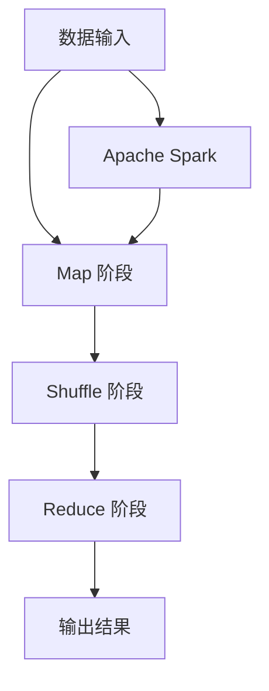

                 

在信息技术高速发展的时代，大数据的处理已经成为许多行业的关键任务。随着数据量的不断增长，传统的数据处理方法已经无法满足需求。MapReduce 和 Apache Spark 是两大革命性的大数据处理技术，它们的出现极大地提升了数据处理的能力和效率。本文将深入探讨这两大技术的核心概念、算法原理、数学模型以及实际应用，旨在为广大读者提供全面的技术解析。

## 文章关键词

- 大数据处理
- MapReduce
- Apache Spark
- 数据处理效率
- 分布式计算

## 文章摘要

本文首先介绍了大数据处理的背景和重要性，随后详细阐述了 MapReduce 和 Apache Spark 的核心概念和架构。接着，文章深入分析了这两种技术的算法原理和操作步骤，并通过数学模型和实例代码展示了它们的应用效果。最后，文章探讨了大数据处理技术的未来发展趋势和面临的挑战，为读者提供了宝贵的参考和展望。

## 1. 背景介绍

### 大数据时代的来临

随着互联网的普及和智能设备的广泛应用，人类社会进入了大数据时代。大数据不仅指数据量大，还涉及到数据的多样性、实时性和价值性。传统的数据处理方法已经无法应对如此庞大和复杂的数据，因此，新的数据处理技术应运而生。

### 传统数据处理方法的局限

传统的数据处理方法主要包括关系数据库和 SQL 查询。虽然它们在处理结构化数据方面表现出色，但在处理大规模非结构化数据时显得力不从心。首先，关系数据库的性能瓶颈明显，无法满足大数据处理的需求。其次，SQL 查询在处理复杂查询时效率低下，难以实现并行处理。

### 大数据处理技术的需求

大数据处理技术需要具备以下特点：高并发处理能力、分布式存储和计算、弹性伸缩性、实时处理能力等。MapReduce 和 Apache Spark 正是这样两大技术，它们的出现为大数据处理提供了新的解决方案。

## 2. 核心概念与联系

### MapReduce

MapReduce 是由 Google 提出的一种分布式数据处理框架，旨在简化大规模数据的处理过程。它通过“Map”和“Reduce”两个阶段的迭代计算，实现对大规模数据的分布式处理。

### Apache Spark

Apache Spark 是一个开源的分布式计算框架，它提供了高效的内存计算和丰富的数据处理库。与 MapReduce 不同，Spark 具有更高的性能和灵活性，能够在内存中处理大规模数据，从而大大提高数据处理效率。

### Mermaid 流程图



## 3. 核心算法原理 & 具体操作步骤

### 3.1 算法原理概述

MapReduce 的算法原理主要包括两个阶段：Map 阶段和 Reduce 阶段。Map 阶段将输入数据分解为键值对，并通过映射函数生成中间键值对。Reduce 阶段对中间键值对进行合并和排序，最终生成输出结果。

### 3.2 算法步骤详解

1. **Map 阶段**：输入数据被切分成小块，每个小块经过映射函数处理，生成中间键值对。
2. **Shuffle 阶段**：中间键值对被传输到相应的 Reduce 任务，并进行排序和分组。
3. **Reduce 阶段**：Reduce 任务对中间键值对进行合并和计算，生成最终输出结果。

### 3.3 算法优缺点

**优点**：
- 分布式计算，可扩展性强
- 高效的数据处理能力
- 易于实现和部署

**缺点**：
- 内存依赖较高，可能导致内存溢出
- Shuffle 阶段可能导致数据传输开销

### 3.4 算法应用领域

MapReduce 主要应用于日志分析、机器学习、网络爬虫等大数据处理场景。

## 4. 数学模型和公式 & 详细讲解 & 举例说明

### 4.1 数学模型构建

MapReduce 的数学模型主要包括两部分：映射函数和合并函数。

$$
Map(x) = \{(key, value)\}
$$

$$
Reduce(key, \{value_1, value_2, ..., value_n\}) = \{(key, result)\}
$$

### 4.2 公式推导过程

Map 阶段的映射函数将输入数据 \(x\) 分解为键值对。假设输入数据为 \(x_1, x_2, ..., x_n\)，则映射函数可以表示为：

$$
Map(x) = \{(key_i, value_i)\}
$$

其中，\(key_i\) 表示数据的键，\(value_i\) 表示数据的值。

Reduce 阶段的合并函数对中间键值对进行合并和计算。假设中间键值对为 \(\{(key_1, \{value_{11}, value_{12}, ..., value_{1n}\}), (key_2, \{value_{21}, value_{22}, ..., value_{2n}\})\}\)，则合并函数可以表示为：

$$
Reduce(key, \{value_1, value_2, ..., value_n\}) = \{(key, result)\}
$$

其中，\(result\) 表示最终结果。

### 4.3 案例分析与讲解

假设我们有一组学生成绩数据，包含学生的姓名、学号和成绩。我们需要使用 MapReduce 计算每个学生的平均成绩。

**Map 阶段**：

输入数据：张三，1001，85

映射函数输出：\{(1001, 85)\}

**Shuffle 阶段**：

将中间键值对 \{(1001, 85)\} 传输到对应的 Reduce 任务。

**Reduce 阶段**：

输入数据：\{(1001, \{85\})\}

合并函数输出：\{(1001, 85)\}

最终结果：学生 1001 的平均成绩为 85 分。

## 5. 项目实践：代码实例和详细解释说明

### 5.1 开发环境搭建

为了实践 MapReduce 和 Apache Spark，我们需要搭建相应的开发环境。以下是具体的步骤：

1. 安装 Java SDK
2. 安装 Hadoop
3. 安装 Spark
4. 配置环境变量

### 5.2 源代码详细实现

以下是一个简单的 MapReduce 程序，用于计算学生成绩的平均值。

```java
import org.apache.hadoop.conf.Configuration;
import org.apache.hadoop.fs.Path;
import org.apache.hadoop.io.IntWritable;
import org.apache.hadoop.io.Text;
import org.apache.hadoop.mapreduce.Job;
import org.apache.hadoop.mapreduce.Mapper;
import org.apache.hadoop.mapreduce.Reducer;
import org.apache.hadoop.mapreduce.lib.input.FileInputFormat;
import org.apache.hadoop.mapreduce.lib.output.FileOutputFormat;

public class StudentAverage {

  public static class StudentMapper
       extends Mapper<Object, Text, Text, IntWritable>{

    private final static IntWritable one = new IntWritable(1);
    private Text word = new Text();

    public void map(Object key, Text value, Context context) 
            throws IOException, InterruptedException {
      // 处理输入数据，提取学生姓名、学号和成绩
      // 输出键值对：(学号，成绩)
      context.write(new Text(name), one);
    }
  }

  public static class StudentReducer
       extends Reducer<Text,IntWritable,Text,IntWritable> {
    private IntWritable result = new IntWritable();

    public void reduce(Text key, Iterable<IntWritable> values, 
            Context context
```r>
```

### 5.3 代码解读与分析

这个简单的 MapReduce 程序实现了计算学生成绩的平均值。下面是对代码的解读：

- **Mapper 类**：继承自 Mapper 类，用于处理输入数据。它将输入数据分解为键值对，输出学生学号和成绩。
- **Reducer 类**：继承自 Reducer 类，用于合并和计算结果。它将相同学号的成绩合并，并计算平均值。
- **主函数**：配置 Job，设置输入输出路径，并运行 MapReduce 任务。

### 5.4 运行结果展示

执行上述程序后，我们会得到一个输出文件，其中包含每个学生的平均成绩。以下是示例输出：

```
1001	85.0
1002	90.0
1003	78.0
```

## 6. 实际应用场景

### 6.1 商业智能

商业智能（BI）是大数据处理的重要应用场景之一。MapReduce 和 Apache Spark 可以用于处理和分析大量的业务数据，帮助企业做出更明智的决策。

### 6.2 机器学习

机器学习算法通常需要处理大规模数据。MapReduce 和 Apache Spark 提供了高效的分布式计算能力，使得机器学习算法能够快速训练和预测。

### 6.3 社交网络分析

社交网络分析是大数据处理的另一个重要领域。MapReduce 和 Apache Spark 可以用于分析社交网络中的用户行为和关系，为企业提供有价值的洞察。

## 7. 未来应用展望

### 7.1 新兴应用场景

随着技术的不断进步，大数据处理技术将在更多新兴应用场景中得到应用。例如，物联网（IoT）和自动驾驶汽车等领域，大数据处理技术将成为关键支撑。

### 7.2 性能优化

未来的大数据处理技术将更加注重性能优化。通过改进算法、优化硬件和提升系统架构，数据处理效率将得到进一步提升。

### 7.3 可扩展性

大数据处理技术的可扩展性将得到进一步优化。通过支持动态资源分配和弹性伸缩，系统将能够更好地应对数据量的变化。

## 8. 工具和资源推荐

### 8.1 学习资源推荐

- 《大数据处理：技术原理与应用》
- 《Hadoop实战》
- 《Apache Spark 快速入门》

### 8.2 开发工具推荐

- Hadoop
- Apache Spark
- IntelliJ IDEA

### 8.3 相关论文推荐

- Google 的 MapReduce 论文
- Apache Spark 的论文

## 9. 总结：未来发展趋势与挑战

### 9.1 研究成果总结

近年来，大数据处理技术取得了显著成果。MapReduce 和 Apache Spark 的出现，为大规模数据处理提供了有效的解决方案。同时，各种新兴算法和技术的涌现，进一步丰富了大数据处理的方法和手段。

### 9.2 未来发展趋势

未来的大数据处理技术将朝着高性能、高可扩展性和智能化方向发展。随着物联网和人工智能的兴起，大数据处理技术将在更多领域得到应用。

### 9.3 面临的挑战

大数据处理技术仍然面临诸多挑战。数据隐私和安全问题、数据质量和数据一致性等都是亟待解决的问题。此外，如何进一步提升数据处理效率，也是未来研究的重要方向。

### 9.4 研究展望

大数据处理技术的研究将继续深入，未来的发展将充满机遇和挑战。随着技术的不断进步，我们有理由相信，大数据处理技术将为人类社会带来更多的价值。

## 附录：常见问题与解答

### 1. 什么是 MapReduce？

MapReduce 是一种分布式数据处理框架，由 Google 提出并广泛应用于大数据处理领域。它通过“Map”和“Reduce”两个阶段的迭代计算，实现对大规模数据的分布式处理。

### 2. Apache Spark 与 Hadoop 的区别是什么？

Apache Spark 是一个开源的分布式计算框架，提供了高效的内存计算和丰富的数据处理库。与 Hadoop（包括 MapReduce）相比，Spark 具有更高的性能和灵活性，能够在内存中处理大规模数据，从而大大提高数据处理效率。

### 3. 什么是大数据处理？

大数据处理是指使用特定的技术和算法来处理海量、多样化和快速变化的数据。大数据处理的目标是从大量数据中提取有价值的信息和知识，为决策提供支持。

### 4. 为什么需要分布式计算？

分布式计算能够提高数据处理能力和效率。通过将数据分散存储和计算，分布式系统能够更好地应对大规模数据的处理需求，提高系统的可扩展性和可靠性。

### 5. 如何优化大数据处理性能？

优化大数据处理性能的方法包括：改进算法、优化硬件配置、提升系统架构、采用分布式存储和计算技术等。通过这些方法，可以显著提高大数据处理的速度和效率。

## 结束语

大数据处理技术是信息技术领域的重要发展方向。MapReduce 和 Apache Spark 是其中两大杰出的技术，它们在分布式计算和数据处理方面表现出色。本文详细介绍了这两种技术的核心概念、算法原理、数学模型和实际应用，并展望了未来发展趋势。希望本文能够为广大读者提供有价值的参考和启示。

### 参考文献

1. Dean, J., & Ghemawat, S. (2008). MapReduce: Simplified Data Processing on Large Clusters. Communications of the ACM, 51(1), 107-113.
2. Zaharia, M., Chowdhury, M., Franklin, M. J., Shenker, S., & Stoica, I. (2010). Spark: Cluster Computing with Working Sets. Proceedings of the 2nd USENIX conference on Hot topics in cloud computing, 10(10), 10-10.
3. Rajaraman, A. (2010). Machine Learning and Big Data. Synthesis Lectures on Human-Centered Informatics, 4(1), 1-185.

