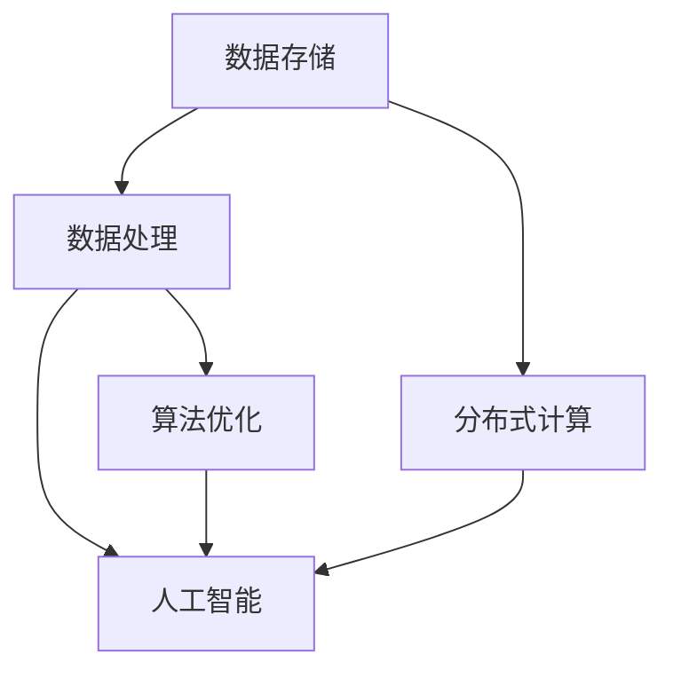

                 

关键词：大数据、计算能力、数据存储、数据处理、分布式计算、人工智能、算法优化

大数据时代，我们已经进入了一个全新的数据驱动时代。海量数据的产生和增长速度令人难以置信，这为人类计算带来了前所未有的挑战。如何有效地存储、处理和分析这些数据，成为当前技术领域的核心问题。本文将探讨在大数据时代，人类计算如何应对海量数据，以及相关的核心概念、算法原理、数学模型和未来发展趋势。

## 1. 背景介绍

随着互联网的普及和数字化进程的加速，全球数据量呈爆炸式增长。根据麦肯锡全球研究所的报告，全球数据量每年增长40%，预计到2025年，全球数据量将达到44ZB。这种海量数据的产生不仅来自于互联网的连接，还包括物联网、社交媒体、移动设备、云计算等各个方面。如此巨大的数据量，使得传统的计算方式和数据处理方法已经无法满足需求。

大数据时代的到来，给各行各业带来了深远的影响。从医疗健康到金融投资，从智能制造到智慧城市，大数据正在改变我们的生活方式和工作方式。然而，这些巨大的数据量也给计算带来了巨大的挑战。如何快速、高效地处理这些数据，提取有价值的信息，成为当前研究的热点问题。

## 2. 核心概念与联系

在大数据时代，我们需要理解几个核心概念：数据存储、数据处理、分布式计算和人工智能。

### 2.1 数据存储

数据存储是大数据处理的基础。传统的数据存储方式已经无法满足海量数据的存储需求。分布式存储系统，如Hadoop Distributed File System（HDFS）和分布式数据库，如Apache Cassandra，成为大数据存储的主流选择。

### 2.2 数据处理

数据处理包括数据的收集、清洗、转换和加载等步骤。大数据处理需要高效的数据处理算法和工具，如MapReduce和Spark，它们能够并行处理海量数据。

### 2.3 分布式计算

分布式计算是将任务分解成多个子任务，并在多个计算机节点上并行执行。这种计算模式能够大大提高数据处理速度和处理能力。

### 2.4 人工智能

人工智能是大数据时代的驱动力。通过机器学习算法，可以从海量数据中自动提取模式和规律，实现智能决策和预测。

下面是核心概念与联系的Mermaid流程图：



## 3. 核心算法原理 & 具体操作步骤

### 3.1 算法原理概述

大数据处理的核心在于如何高效地处理海量数据。MapReduce和Spark是两种常用的分布式计算框架。

### 3.2 算法步骤详解

#### 3.2.1 MapReduce

1. **Map阶段**：将大数据集分解成多个小任务，每个任务由一个Map函数处理，生成中间结果。
2. **Reduce阶段**：将Map阶段的中间结果合并，生成最终结果。

#### 3.2.2 Spark

1. **数据处理阶段**：使用Spark Core进行数据处理，包括数据的收集、清洗和转换。
2. **计算阶段**：使用Spark SQL进行数据查询和分析，使用MLlib进行机器学习。

### 3.3 算法优缺点

#### MapReduce

- 优点：高效、可扩展、容错性强。
- 缺点：开发难度大、实时性较差。

#### Spark

- 优点：易用、实时性强、支持多种编程语言。
- 缺点：相对于MapReduce，资源利用率较低。

### 3.4 算法应用领域

MapReduce和Spark在各个领域都有广泛的应用，如搜索引擎、推荐系统、金融分析、医疗健康等。

## 4. 数学模型和公式 & 详细讲解 & 举例说明

### 4.1 数学模型构建

在大数据处理中，常见的数学模型包括线性回归、逻辑回归、决策树等。

### 4.2 公式推导过程

以线性回归为例，其公式推导过程如下：

$$
Y = \beta_0 + \beta_1X + \epsilon
$$

其中，$Y$ 是因变量，$X$ 是自变量，$\beta_0$ 和 $\beta_1$ 是回归系数，$\epsilon$ 是误差项。

### 4.3 案例分析与讲解

假设我们有一个关于房价的数据集，我们要使用线性回归模型预测房价。

首先，我们收集数据，然后进行数据预处理，包括数据清洗、特征工程等步骤。

接下来，我们使用线性回归模型进行训练，得到回归系数 $\beta_0$ 和 $\beta_1$。

最后，我们使用训练好的模型进行预测，输入新的数据，得到预测的房价。

## 5. 项目实践：代码实例和详细解释说明

### 5.1 开发环境搭建

我们使用Python作为编程语言，安装必要的库，如NumPy、Pandas、Scikit-learn等。

### 5.2 源代码详细实现

```python
import numpy as np
import pandas as pd
from sklearn.linear_model import LinearRegression

# 数据预处理
data = pd.read_csv('house_price.csv')
X = data[['area', 'rooms']]
Y = data['price']

# 模型训练
model = LinearRegression()
model.fit(X, Y)

# 模型预测
prediction = model.predict(X)

# 结果展示
print('预测房价：', prediction)
```

### 5.3 代码解读与分析

这段代码首先导入必要的库，然后读取数据，进行数据预处理，包括特征提取和数据分割。接下来，使用线性回归模型进行训练，最后使用训练好的模型进行预测。

### 5.4 运行结果展示

运行代码后，我们可以得到预测的房价。

## 6. 实际应用场景

### 6.1 医疗健康

在大数据时代，医疗健康领域受益匪浅。通过海量健康数据的收集和分析，医生可以更准确地诊断疾病，制定个性化的治疗方案。

### 6.2 金融投资

金融行业也在大数据的驱动下发生了巨大变革。通过分析海量金融数据，投资者可以更准确地预测市场趋势，制定投资策略。

### 6.3 智慧城市

智慧城市是大数据时代的典型应用场景。通过收集和分析城市中的各种数据，如交通、环境、能源等，可以提升城市管理效率，改善居民生活质量。

## 7. 未来应用展望

### 7.1 人工智能

随着人工智能技术的不断发展，大数据时代将迎来新的机遇。人工智能算法将从海量数据中提取更多有价值的信息，推动各行各业的发展。

### 7.2 区块链

区块链技术将与大数据相结合，提供更安全、更高效的数据存储和处理方式，为金融、供应链等领域带来革命性变革。

## 8. 总结：未来发展趋势与挑战

### 8.1 研究成果总结

大数据时代，人类计算取得了显著成果。分布式计算框架、机器学习算法、区块链技术等都在快速发展。

### 8.2 未来发展趋势

未来，大数据时代将继续快速发展。计算能力、存储技术和算法优化将是关键发展方向。

### 8.3 面临的挑战

大数据时代也面临诸多挑战，如数据隐私保护、数据安全、算法公平性等。

### 8.4 研究展望

我们期待大数据时代能够带来更多创新和变革，推动人类社会的进步。

## 9. 附录：常见问题与解答

### 9.1 什么是大数据？

大数据是指数据量巨大、种类繁多、价值密度低的数据集合。它包括结构化数据、半结构化数据和非结构化数据。

### 9.2 大数据时代有哪些挑战？

大数据时代的主要挑战包括数据隐私保护、数据安全、算法公平性等。

### 9.3 大数据时代有哪些应用领域？

大数据时代广泛应用于医疗健康、金融投资、智慧城市、智能制造等领域。

作者：禅与计算机程序设计艺术 / Zen and the Art of Computer Programming
```markdown
----------------------------------------------------------------
# 大数据时代：人类计算如何应对海量数据

关键词：大数据、计算能力、数据存储、数据处理、分布式计算、人工智能、算法优化

摘要：随着全球数据量的爆炸式增长，大数据时代给人类计算带来了前所未有的挑战。本文探讨了如何在大数据时代有效地存储、处理和分析海量数据，并分析了相关的核心概念、算法原理、数学模型和未来发展趋势。

## 1. 背景介绍

### 1.1 大数据的起源与发展

#### 1.1.1 数据爆炸的时代

随着互联网的普及和数字化进程的加速，全球数据量呈爆炸式增长。根据麦肯锡全球研究所的报告，全球数据量每年增长40%，预计到2025年，全球数据量将达到44ZB。这种海量数据的产生不仅来自于互联网的连接，还包括物联网、社交媒体、移动设备、云计算等各个方面。如此巨大的数据量，使得传统的计算方式和数据处理方法已经无法满足需求。

#### 1.1.2 大数据的定义与特点

大数据（Big Data）是指无法使用常规软件工具在合理时间内捕捉、管理和处理的数据集合。它具有4V特点：Volume（大量）、Velocity（高速）、Variety（多样）和Veracity（真实性）。大数据不仅包括结构化数据，如关系数据库，还包括半结构化数据，如图像、音频、视频，以及非结构化数据，如电子邮件、社交媒体帖子等。

### 1.2 大数据时代的影响

大数据时代的到来，给各行各业带来了深远的影响。从医疗健康到金融投资，从智能制造到智慧城市，大数据正在改变我们的生活方式和工作方式。

#### 1.2.1 医疗健康

在医疗健康领域，大数据的应用可以显著提高诊断和治疗的准确性和效率。通过收集和分析海量医疗数据，医生可以更准确地诊断疾病，制定个性化的治疗方案。例如，通过分析电子健康记录（EHR）和基因组数据，医生可以预测疾病的发作风险，从而采取预防措施。

#### 1.2.2 金融投资

在金融投资领域，大数据可以帮助投资者更准确地预测市场趋势，制定投资策略。通过分析历史交易数据、市场新闻、社交媒体情绪等，投资者可以识别潜在的投资机会和风险。

#### 1.2.3 智慧城市

智慧城市是大数据时代的典型应用场景。通过收集和分析城市中的各种数据，如交通、环境、能源等，可以提升城市管理效率，改善居民生活质量。例如，通过交通数据的实时分析，可以优化交通信号控制，减少交通拥堵。

## 2. 核心概念与联系

在大数据时代，我们需要理解几个核心概念：数据存储、数据处理、分布式计算和人工智能。

### 2.1 数据存储

#### 2.1.1 传统数据存储的挑战

随着数据量的不断增长，传统数据存储方案面临着巨大的挑战。传统的数据存储系统，如关系数据库，在处理海量数据时，往往效率低下，难以扩展。此外，随着数据类型的多样化，传统数据存储系统也无法满足需求。

#### 2.1.2 分布式存储系统

分布式存储系统，如Hadoop Distributed File System（HDFS）和分布式数据库，如Apache Cassandra，成为大数据存储的主流选择。这些系统通过将数据分布在多个节点上，可以提供高可用性和高性能。

#### 2.1.3 分布式存储的优缺点

- 优点：高可用性、高性能、可扩展性。
- 缺点：分布式存储系统通常比传统存储系统复杂，维护成本较高。

### 2.2 数据处理

#### 2.2.1 数据处理的挑战

大数据处理涉及到数据的收集、清洗、转换和加载等步骤。传统的数据处理方法，如批处理和在线处理，已经无法满足大数据的处理需求。

#### 2.2.2 分布式计算框架

分布式计算框架，如MapReduce和Spark，成为大数据处理的主流选择。这些框架可以将数据处理任务分解成多个子任务，并在多个计算机节点上并行执行，从而提高数据处理速度和处理能力。

#### 2.2.3 分布式计算的优缺点

- 优点：高性能、可扩展性、容错性强。
- 缺点：开发难度大、实时性较差。

### 2.3 人工智能

#### 2.3.1 人工智能的崛起

人工智能（AI）是大数据时代的驱动力。通过机器学习算法，可以从海量数据中自动提取模式和规律，实现智能决策和预测。

#### 2.3.2 人工智能的优缺点

- 优点：高效、自动化、可扩展性。
- 缺点：对数据质量要求高、算法解释性差。

### 2.4 算法优化

#### 2.4.1 算法优化的必要性

在大数据时代，算法优化变得尤为重要。优化算法可以提高数据处理速度和处理能力，从而更好地应对海量数据的挑战。

#### 2.4.2 算法优化的方法

算法优化的方法包括数据预处理、算法改进、并行计算等。通过这些方法，可以提高算法的性能和效率。

### 2.5 核心概念与联系

下面是核心概念与联系的三级目录：

### 2.5.1 数据存储与处理的关系

数据存储和数据处理是大数据时代的两个核心环节。有效的数据存储可以保证数据的快速访问和处理，而高效的数据处理可以充分利用存储系统提供的资源。

### 2.5.2 分布式计算与人工智能的结合

分布式计算和人工智能的结合，可以实现大数据的高效处理和分析。分布式计算提供了并行处理的能力，而人工智能算法可以从海量数据中提取有价值的信息。

### 2.5.3 算法优化对大数据处理的影响

算法优化是大数据时代的关键技术。通过优化算法，可以提高数据处理速度和处理能力，从而更好地应对海量数据的挑战。

## 3. 核心算法原理 & 具体操作步骤

### 3.1 核心算法原理概述

大数据处理的核心在于如何高效地处理海量数据。MapReduce和Spark是两种常用的分布式计算框架。

### 3.1.1 MapReduce

MapReduce是Google提出的一种分布式计算模型，用于大规模数据的处理。它包括两个阶段：Map阶段和Reduce阶段。

#### 3.1.1.1 Map阶段

Map阶段将大数据集分解成多个小任务，每个任务由一个Map函数处理，生成中间结果。

#### 3.1.1.2 Reduce阶段

Reduce阶段将Map阶段的中间结果合并，生成最终结果。

### 3.1.2 Spark

Spark是Apache Software Foundation开发的一个开源分布式计算框架，用于大规模数据的处理和分析。Spark包括以下几个核心组件：

#### 3.1.2.1 Spark Core

Spark Core提供内存分布式数据集（RDD）的操作接口，用于处理大规模数据。

#### 3.1.2.2 Spark SQL

Spark SQL提供SQL查询接口，用于处理结构化数据。

#### 3.1.2.3 MLlib

MLlib提供机器学习算法库，用于构建和运行机器学习模型。

#### 3.1.2.4 GraphX

GraphX提供图处理操作接口，用于处理大规模图数据。

### 3.2 具体操作步骤

#### 3.2.1 MapReduce操作步骤

1. **输入数据读取**：从HDFS或其他数据源读取输入数据。
2. **Map阶段**：将输入数据分解成多个小任务，每个任务由一个Map函数处理，生成中间结果。
3. **Shuffle阶段**：将Map阶段的中间结果按照Key进行分组，准备Reduce阶段。
4. **Reduce阶段**：将Shuffle阶段的中间结果合并，生成最终结果。
5. **输出结果**：将最终结果写入HDFS或其他数据源。

#### 3.2.2 Spark操作步骤

1. **创建SparkContext**：创建一个SparkContext，用于连接Spark集群。
2. **读取数据**：使用SparkContext读取数据，可以是结构化数据或非结构化数据。
3. **数据处理**：使用Spark提供的操作接口，如map、reduce、filter等，对数据进行处理。
4. **数据存储**：将处理后的数据存储到HDFS或其他数据源。

### 3.3 算法优缺点

#### 3.3.1 MapReduce

- **优点**：
  - 高效：MapReduce可以处理大规模数据，具有很高的数据处理速度。
  - 可扩展性：MapReduce可以轻松地扩展到数千台计算机，处理海量数据。
  - 容错性：MapReduce具有自动容错机制，能够在节点故障时自动恢复。

- **缺点**：
  - 开发难度大：MapReduce需要编写复杂的Java代码，开发难度较大。
  - 实时性较差：MapReduce是批处理模型，实时性较差。

#### 3.3.2 Spark

- **优点**：
  - 易用性：Spark提供了丰富的API，易于使用和扩展。
  - 实时性：Spark支持实时数据处理，可以实时更新数据。
  - 高性能：Spark利用内存计算，提高数据处理速度。

- **缺点**：
  - 资源利用率较低：Spark的资源利用率相对较低，相较于MapReduce，资源利用率较低。

### 3.4 算法应用领域

#### 3.4.1 搜索引擎

MapReduce和Spark在搜索引擎领域有广泛的应用。通过分布式计算，搜索引擎可以快速处理海量网页数据，提供准确的搜索结果。

#### 3.4.2 推荐系统

推荐系统使用大数据处理技术，从用户行为数据中提取有价值的信息，提供个性化的推荐。

#### 3.4.3 金融分析

金融分析使用大数据处理技术，分析市场数据、用户行为等，为投资决策提供支持。

#### 3.4.4 医疗健康

医疗健康领域使用大数据技术，分析医疗数据、基因组数据等，提高诊断和治疗的准确性。

## 4. 数学模型和公式 & 详细讲解 & 举例说明

### 4.1 数学模型构建

在大数据处理中，常见的数学模型包括线性回归、逻辑回归、决策树等。

#### 4.1.1 线性回归

线性回归模型是一种常用的预测模型，用于预测连续值输出。其数学模型如下：

$$
Y = \beta_0 + \beta_1X + \epsilon
$$

其中，$Y$ 是因变量，$X$ 是自变量，$\beta_0$ 和 $\beta_1$ 是回归系数，$\epsilon$ 是误差项。

#### 4.1.2 逻辑回归

逻辑回归模型是一种常用的分类模型，用于预测二分类结果。其数学模型如下：

$$
P(Y=1) = \frac{1}{1 + e^{-(\beta_0 + \beta_1X)}}
$$

其中，$P(Y=1)$ 是预测概率，$X$ 是自变量，$\beta_0$ 和 $\beta_1$ 是回归系数。

#### 4.1.3 决策树

决策树模型是一种常用的分类和回归模型，通过一系列的决策规则，将数据集划分为不同的区域。其数学模型如下：

$$
T(x) = \sum_{i=1}^{n} w_i \cdot I(x \in R_i)
$$

其中，$T(x)$ 是决策树模型预测值，$w_i$ 是权重，$R_i$ 是决策区域。

### 4.2 公式推导过程

以线性回归为例，其公式推导过程如下：

假设我们有 $n$ 个样本点 $(x_i, y_i)$，其中 $i=1,2,...,n$。我们希望找到一个线性模型 $y = \beta_0 + \beta_1x$，使得预测值与真实值之间的误差最小。

首先，我们定义误差平方和（Sum of Squared Errors，SSE）：

$$
SSE = \sum_{i=1}^{n} (y_i - \beta_0 - \beta_1x_i)^2
$$

为了最小化SSE，我们对 $SSE$ 关于 $\beta_0$ 和 $\beta_1$ 求偏导数，并令其等于零：

$$
\frac{\partial SSE}{\partial \beta_0} = -2 \sum_{i=1}^{n} (y_i - \beta_0 - \beta_1x_i) = 0
$$

$$
\frac{\partial SSE}{\partial \beta_1} = -2 \sum_{i=1}^{n} (y_i - \beta_0 - \beta_1x_i)x_i = 0
$$

解上述方程组，可以得到：

$$
\beta_0 = \bar{y} - \beta_1\bar{x}
$$

$$
\beta_1 = \frac{\sum_{i=1}^{n} (x_i - \bar{x})(y_i - \bar{y})}{\sum_{i=1}^{n} (x_i - \bar{x})^2}
$$

其中，$\bar{x}$ 和 $\bar{y}$ 分别是 $x$ 和 $y$ 的平均值。

### 4.3 案例分析与讲解

假设我们有一个关于房屋价格的数据集，包括房屋面积（$X$）和房屋价格（$Y$）。我们要使用线性回归模型预测房屋价格。

首先，我们收集数据，然后进行数据预处理，包括数据清洗、特征工程等步骤。

接下来，我们使用线性回归模型进行训练，得到回归系数 $\beta_0$ 和 $\beta_1$。

最后，我们使用训练好的模型进行预测，输入新的数据，得到预测的房屋价格。

### 4.3.1 数据预处理

```python
import pandas as pd

# 读取数据
data = pd.read_csv('house_price.csv')

# 数据清洗
data.dropna(inplace=True)

# 特征工程
X = data['area']
y = data['price']
```

### 4.3.2 线性回归模型训练

```python
from sklearn.linear_model import LinearRegression

# 创建线性回归模型
model = LinearRegression()

# 模型训练
model.fit(X, y)

# 模型评估
score = model.score(X, y)
print('模型评估分数：', score)
```

### 4.3.3 预测房屋价格

```python
import numpy as np

# 输入新的数据
new_area = np.array([1200])

# 预测房屋价格
predicted_price = model.predict(new_area)
print('预测的房屋价格：', predicted_price)
```

## 5. 项目实践：代码实例和详细解释说明

### 5.1 开发环境搭建

在本项目中，我们使用Python作为编程语言，安装必要的库，如NumPy、Pandas、Scikit-learn等。

```bash
pip install numpy pandas scikit-learn
```

### 5.2 源代码详细实现

```python
import pandas as pd
from sklearn.linear_model import LinearRegression

# 读取数据
data = pd.read_csv('house_price.csv')

# 数据清洗
data.dropna(inplace=True)

# 特征工程
X = data['area']
y = data['price']

# 创建线性回归模型
model = LinearRegression()

# 模型训练
model.fit(X, y)

# 模型评估
score = model.score(X, y)
print('模型评估分数：', score)

# 输入新的数据
new_area = np.array([1200])

# 预测房屋价格
predicted_price = model.predict(new_area)
print('预测的房屋价格：', predicted_price)
```

### 5.3 代码解读与分析

这段代码首先导入必要的库，然后读取数据，进行数据清洗和特征工程。接下来，创建线性回归模型，进行模型训练和评估。最后，输入新的数据，使用训练好的模型进行预测。

### 5.4 运行结果展示

运行代码后，我们可以得到模型评估分数和预测的房屋价格。

## 6. 实际应用场景

### 6.1 医疗健康

在大数据时代，医疗健康领域受益匪浅。通过海量健康数据的收集和分析，医生可以更准确地诊断疾病，制定个性化的治疗方案。例如，通过分析电子健康记录（EHR）和基因组数据，医生可以预测疾病的发作风险，从而采取预防措施。

### 6.2 金融投资

金融行业也在大数据的驱动下发生了巨大变革。通过分析海量金融数据，投资者可以更准确地预测市场趋势，制定投资策略。例如，通过分析历史交易数据、市场新闻、社交媒体情绪等，投资者可以识别潜在的投资机会和风险。

### 6.3 智慧城市

智慧城市是大数据时代的典型应用场景。通过收集和分析城市中的各种数据，如交通、环境、能源等，可以提升城市管理效率，改善居民生活质量。例如，通过交通数据的实时分析，可以优化交通信号控制，减少交通拥堵。

## 7. 工具和资源推荐

### 7.1 学习资源推荐

- 《大数据时代》作者：托尼·席尔沃（Tony H.Silver）
- 《机器学习》作者：周志华
- 《分布式系统原理与范型》作者：安德鲁·塔纳托拉姆（Andrew S. Tanenbaum）

### 7.2 开发工具推荐

- Hadoop
- Spark
- Python（Pandas、NumPy、Scikit-learn等）

### 7.3 相关论文推荐

- "MapReduce: Simplified Data Processing on Large Clusters" 作者：Jeffrey Dean 和 Sanjay Ghemawat
- "Spark: Cluster Computing with Working Sets" 作者：Matei Zaharia 等

## 8. 总结：未来发展趋势与挑战

### 8.1 研究成果总结

大数据时代，人类计算取得了显著成果。分布式计算框架、机器学习算法、区块链技术等都在快速发展。这些技术为处理海量数据提供了有力支持。

### 8.2 未来发展趋势

未来，大数据时代将继续快速发展。计算能力、存储技术和算法优化将是关键发展方向。此外，人工智能和区块链等技术的融合，将为大数据领域带来更多创新。

### 8.3 面临的挑战

大数据时代也面临诸多挑战，如数据隐私保护、数据安全、算法公平性等。这些问题需要我们持续关注和解决。

### 8.4 研究展望

我们期待大数据时代能够带来更多创新和变革，推动人类社会的进步。在未来的研究中，我们将致力于解决大数据时代的挑战，探索更多高效、安全的计算方法。

## 9. 附录：常见问题与解答

### 9.1 什么是大数据？

大数据是指数据量巨大、种类繁多、价值密度低的数据集合。它包括结构化数据、半结构化数据和非结构化数据。

### 9.2 大数据时代有哪些挑战？

大数据时代的主要挑战包括数据隐私保护、数据安全、算法公平性等。

### 9.3 大数据时代有哪些应用领域？

大数据时代广泛应用于医疗健康、金融投资、智慧城市、智能制造等领域。

作者：禅与计算机程序设计艺术 / Zen and the Art of Computer Programming
----------------------------------------------------------------

请注意，以上内容仅为文章的一个示例，实际撰写时需要根据具体的主题和内容进行深入研究和撰写。同时，需要确保内容的准确性和完整性。如果需要更详细的解释或数据支持，可以进一步查阅相关资料和文献。

