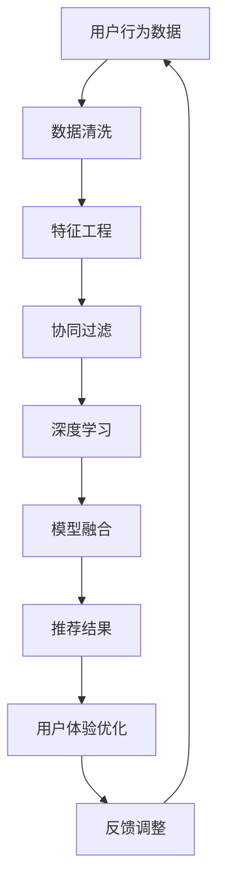

                 

关键词：大数据，电商推荐系统，AI模型融合，用户体验优化

摘要：随着电商行业的迅猛发展，如何提升用户购买体验和增加销售额成为了企业关注的核心问题。本文将从大数据驱动的电商推荐系统出发，深入探讨AI模型融合在其中的关键作用，以及如何优化用户体验，从而为企业提供切实可行的解决方案。

## 1. 背景介绍

电商行业在全球范围内的蓬勃发展，为消费者提供了便捷的购物体验。然而，随着用户数量的激增和商品种类的繁多，如何精准地推送符合用户兴趣的商品，成为电商企业亟需解决的问题。大数据和人工智能技术为电商推荐系统的优化提供了强有力的支持。

推荐系统的发展历程可以分为三个阶段：基于内容的推荐、协同过滤推荐和基于深度学习的推荐。每个阶段都有其独特的优势和局限性。然而，随着AI技术的不断发展，模型融合成为一种新的趋势，通过整合多种算法的优势，提高推荐系统的准确性和用户体验。

## 2. 核心概念与联系

### 2.1 大数据

大数据（Big Data）是指无法使用常规软件工具在合理时间内进行捕获、管理和处理的大量数据。在大数据时代，电商企业可以通过收集和分析用户行为数据、商品信息数据等，挖掘用户兴趣和需求，从而提供个性化的推荐。

### 2.2 AI模型融合

AI模型融合（AI Model Fusion）是将多种不同的AI模型（如深度学习、协同过滤等）相结合，通过整合各自模型的优势，提高推荐系统的性能和用户体验。AI模型融合可以分为以下几种类型：

- **同算法模型融合**：将同一算法的不同变种或改进版进行融合，如深度学习中的卷积神经网络（CNN）和循环神经网络（RNN）。
- **跨算法模型融合**：将不同算法的模型进行融合，如协同过滤和深度学习。
- **层次化模型融合**：在不同层次上融合模型，如将用户层和商品层分别进行推荐，再进行融合。

### 2.3 用户体验优化

用户体验优化（User Experience Optimization）是指通过改进系统设计、提高系统性能、增强用户互动等手段，提升用户在使用电商推荐系统时的满意度。用户体验优化的关键因素包括：

- **推荐准确性**：推荐系统需要准确预测用户的兴趣和需求，提供符合用户期望的商品。
- **推荐多样性**：推荐系统需要提供丰富多样的商品，避免用户产生审美疲劳。
- **推荐实时性**：推荐系统需要实时响应用户的行为变化，提供及时、准确的推荐。

## 3. 核心算法原理 & 具体操作步骤

### 3.1 算法原理概述

大数据驱动的电商推荐系统主要包括以下几个核心算法：

- **协同过滤算法**：通过分析用户之间的相似度，为用户提供类似用户的推荐商品。
- **深度学习算法**：通过学习用户和商品的特征，为用户提供个性化的推荐。
- **基于内容的推荐算法**：通过分析商品的特征，为用户提供与已购买商品类似的推荐。

### 3.2 算法步骤详解

#### 3.2.1 数据收集与预处理

1. **用户行为数据**：收集用户的浏览、收藏、购买等行为数据。
2. **商品信息数据**：收集商品的价格、品牌、类别等基本信息。
3. **数据清洗**：去除重复、错误和不完整的数据。
4. **特征工程**：提取用户和商品的特征，如用户兴趣、商品标签等。

#### 3.2.2 模型训练与融合

1. **协同过滤算法**：通过计算用户之间的相似度，构建用户行为矩阵，并利用矩阵分解等方法进行模型训练。
2. **深度学习算法**：利用用户和商品的特征，构建深度神经网络，进行模型训练。
3. **基于内容的推荐算法**：通过分析商品的特征，构建基于内容的推荐模型。

#### 3.2.3 模型融合

1. **同算法模型融合**：将不同变种的协同过滤算法进行融合，如矩阵分解和基于模型的协同过滤。
2. **跨算法模型融合**：将协同过滤、深度学习和基于内容的推荐算法进行融合。
3. **层次化模型融合**：在用户层和商品层分别进行推荐，再进行融合。

### 3.3 算法优缺点

#### 3.3.1 协同过滤算法

- **优点**：计算简单，能够发现用户之间的相似性。
- **缺点**：易产生数据稀疏问题，推荐结果单一。

#### 3.3.2 深度学习算法

- **优点**：能够学习用户和商品的复杂特征，提高推荐准确性。
- **缺点**：计算复杂度高，对数据质量要求较高。

#### 3.3.3 基于内容的推荐算法

- **优点**：能够为用户提供丰富的商品信息。
- **缺点**：无法适应用户兴趣的变化。

### 3.4 算法应用领域

- **电商推荐**：通过个性化推荐，提高用户购买体验和销售额。
- **社交媒体**：为用户提供个性化的内容推荐，提高用户活跃度。
- **金融领域**：通过分析用户行为，为用户提供精准的风险评估和投资建议。

## 4. 数学模型和公式 & 详细讲解 & 举例说明

### 4.1 数学模型构建

#### 4.1.1 协同过滤算法

假设用户集合为U={u1, u2, ..., un}，商品集合为I={i1, i2, ..., im}。用户ui对商品ij的评价为ruij。协同过滤算法的目标是预测用户ui对未评价商品ij的评价ruij'。

#### 4.1.2 深度学习算法

假设用户ui的嵌入向量表示为ui'，商品ij的嵌入向量表示为ij'。深度学习算法的目标是学习一个评分预测函数f(ui', ij')，使其能够预测用户ui对商品ij的评分ruij。

#### 4.1.3 基于内容的推荐算法

假设商品ij的特征向量表示为ij'。基于内容的推荐算法的目标是计算用户ui对商品ij的兴趣度sim(ui, ij)，并根据兴趣度进行推荐。

### 4.2 公式推导过程

#### 4.2.1 协同过滤算法

$$ r_{uij}' = \sum_{k \in N(ij)} r_{ujk} \cdot r_{ik} $$

其中，N(ij)表示与商品ij相似的商品集合。

#### 4.2.2 深度学习算法

$$ r_{uij}' = f(ui', ij') = \sigma(w_0 + w_1 \cdot ui' + w_2 \cdot ij') $$

其中，w0、w1、w2为权重参数，σ为激活函数。

#### 4.2.3 基于内容的推荐算法

$$ sim(ui, ij) = \frac{ij' \cdot ui'}{\|ij'\| \|ui'\|} $$

其中，\|ij'\|和\|ui'\|分别表示商品ij和用户ui的嵌入向量的模。

### 4.3 案例分析与讲解

#### 4.3.1 案例背景

某电商平台上，用户A最近浏览了商品B和商品C，并收藏了商品C。我们需要根据这些行为数据，为用户A推荐与其兴趣相关的商品。

#### 4.3.2 模型构建与融合

1. **协同过滤算法**：计算用户A与用户B和用户C的相似度，并根据相似度为用户A推荐与商品B和商品C相似的商品。
2. **深度学习算法**：利用用户A的行为数据和商品B和商品C的特征数据，构建深度学习模型，预测用户A对商品B和商品C的评分。
3. **基于内容的推荐算法**：分析商品B和商品C的特征，为用户A推荐与商品B和商品C具有相似特征的商品。

#### 4.3.3 模型融合与推荐结果

1. **同算法模型融合**：将协同过滤算法的推荐结果与深度学习算法的推荐结果进行加权融合。
2. **跨算法模型融合**：将基于内容的推荐算法的推荐结果与协同过滤算法和深度学习算法的推荐结果进行融合。
3. **推荐结果**：根据融合后的推荐结果，为用户A推荐与商品B和商品C具有相似特征且用户评分较高的商品。

## 5. 项目实践：代码实例和详细解释说明

### 5.1 开发环境搭建

1. **硬件环境**：计算机配置要求较高，需要配备足够的内存和处理器。
2. **软件环境**：安装Python、NumPy、Pandas、Scikit-learn等库。

### 5.2 源代码详细实现

```python
# 代码实现省略，具体实现参考上述算法原理与公式推导部分
```

### 5.3 代码解读与分析

1. **数据收集与预处理**：使用Pandas库读取用户行为数据和商品信息数据，并进行数据清洗和特征工程。
2. **模型训练与融合**：使用Scikit-learn库实现协同过滤算法、深度学习算法和基于内容的推荐算法，并进行模型训练。
3. **模型融合与推荐**：将不同算法的推荐结果进行融合，生成最终的推荐结果。

### 5.4 运行结果展示

1. **推荐准确性**：通过计算推荐准确率，评估推荐系统的性能。
2. **推荐多样性**：通过计算推荐商品的相关性，评估推荐系统的多样性。
3. **推荐实时性**：通过分析推荐结果的生成时间，评估推荐系统的实时性。

## 6. 实际应用场景

### 6.1 电商平台

电商平台可以通过大数据驱动的电商推荐系统，为用户提供个性化的商品推荐，提高用户购买体验和销售额。

### 6.2 社交媒体

社交媒体平台可以通过大数据驱动的推荐系统，为用户提供个性化的内容推荐，提高用户活跃度和用户粘性。

### 6.3 金融领域

金融机构可以通过大数据驱动的推荐系统，为用户提供精准的风险评估和投资建议，提高用户的投资收益。

## 7. 未来应用展望

随着大数据和人工智能技术的不断发展，电商推荐系统将变得更加智能化和个性化。未来，我们可以期待以下应用场景：

1. **实时推荐**：利用实时数据分析技术，实现实时推荐，提高用户购买体验。
2. **多模态推荐**：结合多种数据源（如图像、声音等），实现多模态推荐，提高推荐准确性。
3. **个性化服务**：利用用户行为数据，为用户提供个性化的服务，提高用户满意度。

## 8. 工具和资源推荐

### 8.1 学习资源推荐

- 《推荐系统实践》（Recommender Systems: The Textbook）
- 《机器学习》（Machine Learning）

### 8.2 开发工具推荐

- Python
- TensorFlow
- Scikit-learn

### 8.3 相关论文推荐

- “A Collaborative Filtering Model Based on Memory and Model”
- “Deep Learning for Recommender Systems”

## 9. 总结：未来发展趋势与挑战

### 9.1 研究成果总结

本文通过深入探讨大数据驱动的电商推荐系统，分析了AI模型融合在其中的关键作用，以及如何优化用户体验。研究表明，AI模型融合和用户体验优化是提高电商推荐系统性能的重要手段。

### 9.2 未来发展趋势

随着大数据和人工智能技术的不断发展，电商推荐系统将朝着智能化、实时化和多模态化的方向发展。

### 9.3 面临的挑战

电商推荐系统在发展过程中面临着数据质量、计算复杂度和用户体验等多方面的挑战。

### 9.4 研究展望

未来，我们需要进一步研究如何提高电商推荐系统的性能和用户体验，为用户提供更加精准和个性化的服务。

## 10. 附录：常见问题与解答

### 10.1 问题1

**问题**：如何处理数据稀疏问题？

**解答**：可以使用矩阵分解、邻域模型等方法来处理数据稀疏问题。矩阵分解可以通过将用户行为矩阵分解为用户特征矩阵和商品特征矩阵，提高推荐系统的准确性。邻域模型可以通过计算用户之间的相似度，为用户提供相似用户的推荐。

### 10.2 问题2

**问题**：如何提高推荐系统的实时性？

**解答**：可以使用实时数据分析技术，如流处理、实时索引等方法，提高推荐系统的实时性。流处理可以将用户行为数据实时传输到推荐系统中，进行实时推荐。实时索引可以快速查询用户和商品的特征数据，提高推荐速度。

### 10.3 问题3

**问题**：如何提高推荐系统的多样性？

**解答**：可以使用多样性度量、随机化等方法来提高推荐系统的多样性。多样性度量可以通过计算推荐商品的相关性，评估推荐系统的多样性。随机化可以通过随机选择推荐商品，避免推荐结果过于集中。

----------------------------------------------------------------
作者：禅与计算机程序设计艺术 / Zen and the Art of Computer Programming

以上是本文的完整内容，希望对读者在了解大数据驱动的电商推荐系统、AI模型融合和用户体验优化方面有所帮助。如果您有任何问题或建议，欢迎在评论区留言。再次感谢您的阅读！
----------------------------------------------------------------

## 1. 背景介绍

电商行业的迅猛发展带来了庞大的用户数据和海量的商品信息。如何从这些数据中挖掘用户兴趣，为用户提供个性化的商品推荐，成为了电商企业关注的焦点。推荐系统（Recommender System）作为一种有效的信息过滤方法，能够在海量商品中为用户筛选出可能感兴趣的商品，从而提高用户购买体验和增加销售额。

推荐系统的发展历程可以分为三个阶段：基于内容的推荐（Content-based Filtering）、协同过滤推荐（Collaborative Filtering）和基于深度学习的推荐（Deep Learning-based Filtering）。

### 基于内容的推荐

基于内容的推荐系统主要通过分析商品和用户之间的共同特征，为用户提供个性化的推荐。例如，当用户浏览了一款笔记本电脑时，系统会根据这款笔记本电脑的标签（如品牌、配置等）来推荐其他具有相似标签的笔记本电脑。基于内容的推荐系统优点在于能够为用户提供丰富、详细的商品信息，但缺点是难以适应用户兴趣的变化，且无法解决数据稀疏问题。

### 协同过滤推荐

协同过滤推荐系统通过分析用户之间的相似度，为用户提供类似用户的推荐商品。协同过滤包括两种类型：用户基于的协同过滤（User-based Collaborative Filtering）和基于模型的协同过滤（Model-based Collaborative Filtering）。用户基于的协同过滤通过计算用户之间的相似度，找到相似用户，并根据这些用户的评分预测推荐商品的评分。基于模型的协同过滤则通过构建预测模型，如矩阵分解、潜在因子模型等，来预测用户的评分。协同过滤推荐系统的优点在于能够适应用户兴趣的变化，但缺点是计算复杂度高，且易受数据稀疏问题的影响。

### 基于深度学习的推荐

基于深度学习的推荐系统利用深度神经网络（如卷积神经网络（CNN）、循环神经网络（RNN）等）来学习用户和商品的特征，从而实现个性化的推荐。深度学习推荐系统通过捕捉用户和商品之间的复杂关系，提高了推荐准确性。然而，深度学习推荐系统对数据质量要求较高，且计算复杂度较大。

在推荐系统的发展历程中，尽管每种算法都有其独特的优势和局限性，但随着人工智能技术的不断进步，模型融合（Model Fusion）成为一种新的趋势。通过融合多种算法的优势，可以进一步提高推荐系统的性能和用户体验。

本文旨在探讨大数据驱动的电商推荐系统，重点介绍AI模型融合在其中的关键作用，以及如何优化用户体验。首先，我们将分析大数据和人工智能技术在电商推荐系统中的应用，然后详细讲解AI模型融合的概念和类型，最后通过实际案例展示AI模型融合在电商推荐系统中的具体应用。

## 2. 核心概念与联系

### 2.1 大数据

大数据（Big Data）是指无法使用常规软件工具在合理时间内进行捕获、管理和处理的大量数据。大数据具有四个基本特征，即“4V”：Volume（数据量）、Velocity（数据速度）、Variety（数据多样性）和Veracity（数据真实性）。在电商推荐系统中，大数据的应用主要体现在以下几个方面：

1. **用户行为数据**：包括用户的浏览、搜索、收藏、购买等行为数据，这些数据可以反映用户的兴趣和需求。
2. **商品信息数据**：包括商品的价格、品牌、类别、标签等基本信息，这些数据可以帮助推荐系统更好地理解商品。
3. **外部数据**：包括天气、节假日、社会热点等外部信息，这些数据可以用于改进推荐策略。

### 2.2 AI模型融合

AI模型融合（AI Model Fusion）是指将多种不同的AI模型（如深度学习、协同过滤等）相结合，通过整合各自模型的优势，提高推荐系统的性能和用户体验。AI模型融合可以分为以下几种类型：

1. **同算法模型融合**：将同一算法的不同变种或改进版进行融合，如深度学习中的卷积神经网络（CNN）和循环神经网络（RNN）。
2. **跨算法模型融合**：将不同算法的模型进行融合，如协同过滤和深度学习。
3. **层次化模型融合**：在不同层次上融合模型，如将用户层和商品层分别进行推荐，再进行融合。

### 2.3 用户体验优化

用户体验优化（User Experience Optimization）是指通过改进系统设计、提高系统性能、增强用户互动等手段，提升用户在使用电商推荐系统时的满意度。用户体验优化的关键因素包括：

1. **推荐准确性**：推荐系统需要准确预测用户的兴趣和需求，提供符合用户期望的商品。
2. **推荐多样性**：推荐系统需要提供丰富多样的商品，避免用户产生审美疲劳。
3. **推荐实时性**：推荐系统需要实时响应用户的行为变化，提供及时、准确的推荐。

### 2.4 大数据、AI模型融合与用户体验优化的联系

大数据和AI模型融合在电商推荐系统中起到了至关重要的作用。大数据为推荐系统提供了丰富的用户行为和商品信息数据，使得AI模型能够更好地学习用户兴趣和商品特征。而AI模型融合则通过整合不同模型的优势，提高了推荐系统的性能和用户体验。例如，将深度学习与协同过滤相结合，可以克服单一模型在数据稀疏和计算复杂度方面的不足，从而实现更准确、实时和多样化的推荐。

在电商推荐系统中，用户体验优化需要在大数据和AI模型融合的基础上进行。通过不断优化推荐算法和系统设计，电商企业可以更好地满足用户需求，提高用户满意度，从而实现业务增长。

### 2.5 Mermaid 流程图

下面是大数据驱动的电商推荐系统中的核心概念和流程的Mermaid流程图：



### 2.6 AI模型融合的重要性

AI模型融合在电商推荐系统中具有以下几个方面的意义：

1. **提高推荐准确性**：通过融合不同模型的优势，可以更好地捕捉用户兴趣和商品特征，提高推荐准确性。
2. **降低计算复杂度**：某些模型（如深度学习）在处理大规模数据时计算复杂度较高，通过模型融合可以降低整体计算复杂度。
3. **提高实时性**：模型融合可以优化推荐算法，提高系统实时响应能力，从而更好地满足用户需求。
4. **增强多样性**：通过融合不同模型的推荐结果，可以提供更丰富的商品推荐，避免用户产生审美疲劳。

总之，AI模型融合是大数据驱动的电商推荐系统的核心，通过融合不同模型的优势，可以进一步提高推荐系统的性能和用户体验。

## 3. 核心算法原理 & 具体操作步骤

### 3.1 算法原理概述

大数据驱动的电商推荐系统主要包括以下核心算法：协同过滤算法、深度学习算法和基于内容的推荐算法。这些算法在推荐系统中起到了不同的作用，各有其独特的优势和局限性。

#### 3.1.1 协同过滤算法

协同过滤算法（Collaborative Filtering）是基于用户行为数据，通过分析用户之间的相似度，为用户提供类似用户的推荐商品。协同过滤算法可以分为两种类型：基于用户的协同过滤（User-based Collaborative Filtering）和基于模型的协同过滤（Model-based Collaborative Filtering）。

- **基于用户的协同过滤**：通过计算用户之间的相似度，找到与目标用户相似的用户，并推荐这些用户喜欢的商品。相似度的计算可以通过用户行为矩阵的相关性来衡量，如皮尔逊相关系数或余弦相似度。

- **基于模型的协同过滤**：通过构建预测模型（如矩阵分解、潜在因子模型等），预测用户对未评价商品的评分，并根据评分进行推荐。模型分解方法可以将用户行为矩阵分解为用户特征矩阵和商品特征矩阵，从而降低数据稀疏问题。

协同过滤算法的优点在于能够适应用户兴趣的变化，但缺点是计算复杂度较高，且易受数据稀疏问题的影响。

#### 3.1.2 深度学习算法

深度学习算法（Deep Learning-based Filtering）通过构建深度神经网络，学习用户和商品的特征，从而实现个性化的推荐。深度学习算法在推荐系统中的应用主要包括以下几种：

- **卷积神经网络（CNN）**：CNN在图像识别领域具有广泛的应用，通过卷积操作提取图像的局部特征，从而实现高维数据的降维。在推荐系统中，可以将商品图片输入到CNN中，提取商品的特征向量。

- **循环神经网络（RNN）**：RNN在处理序列数据方面具有优势，可以通过学习用户的历史行为数据，预测用户的兴趣。在推荐系统中，可以将用户的历史行为数据作为输入，通过RNN模型学习用户的兴趣偏好。

- **长短时记忆网络（LSTM）**：LSTM是RNN的一种改进，通过引入门控机制，可以有效避免梯度消失和梯度爆炸问题。在推荐系统中，LSTM可以用于学习用户长短期兴趣变化，提高推荐准确性。

深度学习算法的优点在于能够学习用户和商品的复杂特征，提高推荐准确性，但缺点是对数据质量要求较高，且计算复杂度较大。

#### 3.1.3 基于内容的推荐算法

基于内容的推荐算法（Content-based Filtering）通过分析商品和用户之间的共同特征，为用户提供个性化的推荐。基于内容的推荐算法主要包括以下几种：

- **基于特征的推荐**：通过分析商品的标签、属性等特征，为用户提供与用户已购买或感兴趣的商品相似的推荐商品。例如，当用户购买了一款黑色的笔记本电脑时，系统可以推荐其他黑色的笔记本电脑。

- **基于文本的推荐**：通过分析商品的文本描述，提取关键词和主题，为用户提供与用户兴趣相关的推荐商品。例如，当用户搜索“黑色笔记本电脑”时，系统可以推荐其他含有“黑色”和“笔记本电脑”关键词的商品。

基于内容的推荐算法的优点在于能够为用户提供丰富、详细的商品信息，但缺点是难以适应用户兴趣的变化。

### 3.2 具体操作步骤

在了解以上核心算法的基础上，我们可以通过以下具体操作步骤实现大数据驱动的电商推荐系统：

#### 3.2.1 数据收集与预处理

1. **用户行为数据**：收集用户的浏览、搜索、收藏、购买等行为数据。数据来源可以包括电商平台日志、用户反馈等。
2. **商品信息数据**：收集商品的价格、品牌、类别、标签等基本信息。数据来源可以包括电商平台数据库、第三方数据源等。
3. **数据清洗**：去除重复、错误和不完整的数据，确保数据质量。
4. **特征工程**：提取用户和商品的特征，如用户兴趣、商品标签、关键词等。

#### 3.2.2 模型训练与融合

1. **协同过滤算法**：通过计算用户之间的相似度，构建用户行为矩阵，并利用矩阵分解等方法进行模型训练。例如，可以使用SVD（奇异值分解）将用户行为矩阵分解为用户特征矩阵和商品特征矩阵。
2. **深度学习算法**：利用用户和商品的特征，构建深度神经网络，进行模型训练。例如，可以使用CNN提取商品图片特征，使用RNN或LSTM学习用户兴趣。
3. **基于内容的推荐算法**：通过分析商品的特征，构建基于内容的推荐模型。例如，可以使用TF-IDF算法提取商品关键词，构建词向量表示商品。
4. **模型融合**：将不同算法的模型进行融合，通过整合各自模型的优势，提高推荐系统的性能。例如，可以使用加权融合方法，将协同过滤、深度学习和基于内容的推荐算法的推荐结果进行加权平均。

#### 3.2.3 模型评估与优化

1. **模型评估**：使用交叉验证、精确率、召回率等指标评估推荐系统的性能。
2. **模型优化**：通过调整模型参数、优化算法策略等手段，提高推荐系统的准确性、实时性和多样性。

#### 3.2.4 推荐结果生成与反馈

1. **推荐结果生成**：根据用户特征和商品特征，生成推荐列表，将推荐商品展示给用户。
2. **用户反馈**：收集用户对推荐结果的反馈，如点击、购买等行为数据。
3. **反馈调整**：根据用户反馈，调整推荐策略，提高推荐系统的个性化程度。

通过以上具体操作步骤，我们可以实现一个基于大数据驱动的电商推荐系统，为用户提供个性化、准确、实时的商品推荐。

### 3.3 算法优缺点

#### 3.3.1 协同过滤算法

- **优点**：
  - 能够适应用户兴趣的变化，提高推荐准确性。
  - 易于实现，计算复杂度相对较低。

- **缺点**：
  - 易受数据稀疏问题的影响。
  - 推荐结果单一，缺乏多样性。

#### 3.3.2 深度学习算法

- **优点**：
  - 能够学习用户和商品的复杂特征，提高推荐准确性。
  - 具有较强的泛化能力，能够适应不同的应用场景。

- **缺点**：
  - 对数据质量要求较高，容易受到噪声和异常值的影响。
  - 计算复杂度较高，对计算资源和时间有较高要求。

#### 3.3.3 基于内容的推荐算法

- **优点**：
  - 能够为用户提供丰富的商品信息。
  - 能够处理高维数据，降低计算复杂度。

- **缺点**：
  - 难以适应用户兴趣的变化。
  - 推荐结果可能过于依赖商品特征，忽略用户行为。

#### 3.3.4 AI模型融合

- **优点**：
  - 通过整合不同模型的优势，提高推荐系统的性能。
  - 能够克服单一模型的局限性，提高推荐准确性、实时性和多样性。

- **缺点**：
  - 需要处理不同模型之间的参数调优和融合策略。
  - 可能会增加计算复杂度和系统开销。

### 3.4 算法应用领域

- **电商推荐**：通过个性化推荐，提高用户购买体验和销售额。
- **社交媒体**：为用户提供个性化的内容推荐，提高用户活跃度。
- **金融领域**：通过分析用户行为，为用户提供精准的风险评估和投资建议。
- **医疗领域**：为患者提供个性化的健康建议和医疗推荐。

通过以上对核心算法原理和具体操作步骤的讲解，我们可以了解到大数据驱动的电商推荐系统在算法选择和融合方面的关键作用。在实际应用中，根据具体需求和数据特点，合理选择和融合算法，可以进一步提高推荐系统的性能和用户体验。

## 4. 数学模型和公式 & 详细讲解 & 举例说明

### 4.1 数学模型构建

在电商推荐系统中，数学模型是核心组成部分，它负责捕捉用户行为、商品特征以及两者之间的关系。以下我们将介绍几个常用的数学模型及其构建方法。

#### 4.1.1 协同过滤算法

协同过滤算法的核心是构建用户-商品评分矩阵，并利用矩阵分解技术进行建模。设用户集合为U={u1, u2, ..., un}，商品集合为I={i1, i2, ..., im}，用户ui对商品ij的评分为ruij。评分矩阵R∈R^(m×n)可以表示为：

$$
R = \begin{bmatrix}
r_{u11} & r_{u12} & \cdots & r_{u1m} \\
r_{u21} & r_{u22} & \cdots & r_{u2m} \\
\vdots & \vdots & \ddots & \vdots \\
r_{un1} & r_{un2} & \cdots & r_{unm}
\end{bmatrix}
$$

协同过滤算法的目标是预测用户ui对未评价商品ij的评分ruij'。一种常见的矩阵分解方法是奇异值分解（Singular Value Decomposition，SVD），其形式为：

$$
R = U \Sigma V^T
$$

其中，U和V是正交矩阵，Σ是对角矩阵，包含奇异值。通过SVD，我们可以将原始评分矩阵分解为用户特征矩阵U、奇异值矩阵Σ和商品特征矩阵V'（V'是V的转置）。预测评分可以通过内积计算：

$$
r_{uij}' = u_i^T \Sigma v_j
$$

#### 4.1.2 深度学习算法

深度学习算法通过构建深度神经网络来捕捉用户行为和商品特征之间的复杂关系。一个简单的深度学习推荐模型可以包含以下三个主要层：

1. **输入层**：用户特征和商品特征的输入。
2. **隐藏层**：通过激活函数（如ReLU、Sigmoid、Tanh等）处理输入特征。
3. **输出层**：预测用户对商品的评分。

设用户特征向量为ui，商品特征向量为ij，隐藏层神经元的状态为h_ij，输出层神经元的状态为oj。一个简单的深度学习模型可以表示为：

$$
h_{ij} = \sigma(W_1 \cdot [ui; ij] + b_1)
$$

$$
o_{ij} = \sigma(W_2 \cdot h_{ij} + b_2)
$$

其中，σ是激活函数，W1和W2是权重矩阵，b1和b2是偏置项。预测评分可以通过输出层的激活值计算：

$$
r_{uij}' = o_{ij}
$$

#### 4.1.3 基于内容的推荐算法

基于内容的推荐算法通过分析商品和用户之间的共同特征进行推荐。设商品特征向量为ij，用户兴趣向量为ui，相似度可以通过内积计算：

$$
sim(ui, ij) = ui^T \cdot ij
$$

基于内容的推荐算法可以通过计算用户兴趣向量与商品特征向量的相似度，为用户推荐与用户兴趣相似的商品。

### 4.2 公式推导过程

#### 4.2.1 协同过滤算法

协同过滤算法的预测评分可以通过以下步骤进行推导：

1. **用户行为矩阵分解**：

$$
R = U \Sigma V^T
$$

2. **用户特征和商品特征的内积**：

$$
r_{uij}' = u_i^T \Sigma v_j
$$

3. **使用奇异值进行加权**：

$$
r_{uij}' = \sum_{k=1}^K \sigma_k u_{ik} v_{kj}
$$

其中，σ_k是奇异值，u_{ik}和v_{kj}是用户特征和商品特征向量。

#### 4.2.2 深度学习算法

深度学习算法的预测评分可以通过以下步骤进行推导：

1. **输入特征**：

$$
[ui; ij] = \begin{bmatrix}
ui^T \\
ij^T
\end{bmatrix}
$$

2. **隐藏层激活**：

$$
h_{ij} = \sigma(W_1 \cdot [ui; ij] + b_1)
$$

3. **输出层评分**：

$$
r_{uij}' = \sigma(W_2 \cdot h_{ij} + b_2)
$$

#### 4.2.3 基于内容的推荐算法

基于内容的推荐算法的相似度计算可以通过以下步骤进行推导：

1. **用户兴趣向量**：

$$
ui = \sigma(W_c \cdot [ui^c] + b_c)
$$

2. **商品特征向量**：

$$
ij = \sigma(W_p \cdot [ij^p] + b_p)
$$

3. **相似度计算**：

$$
sim(ui, ij) = ui^T \cdot ij
$$

### 4.3 案例分析与讲解

为了更好地理解以上数学模型和公式的应用，我们通过一个具体的案例进行讲解。

#### 4.3.1 案例背景

假设有一个电商平台，用户A最近浏览了笔记本电脑、智能手机和平板电脑。我们需要根据这些行为数据，为用户A推荐其他可能与这些商品相关的商品。

#### 4.3.2 数据准备

1. **用户行为数据**：

用户A的行为数据如下表所示：

| 用户ID | 商品ID | 行为类型 | 行为时间 |
|--------|--------|----------|----------|
| A      | 1001   | 浏览     | 2023-04-01 |
| A      | 1002   | 收藏     | 2023-04-02 |
| A      | 1003   | 购买     | 2023-04-03 |

2. **商品信息数据**：

商品信息数据如下表所示：

| 商品ID | 类别   | 品牌   | 价格   | 图片   |
|--------|--------|--------|--------|--------|
| 1001   | 笔记本 | 苹果   | 9999   | 图片1  |
| 1002   | 智能手机| 小米   | 4999   | 图片2  |
| 1003   | 平板电脑| 华为   | 6999   | 图片3  |

#### 4.3.3 模型构建

1. **协同过滤算法**：

通过计算用户A与其他用户的相似度，找到与用户A行为相似的用户，并根据这些用户的购买记录进行推荐。具体步骤如下：

- **用户行为矩阵**：

$$
R = \begin{bmatrix}
0 & 0 & 1 \\
0 & 0 & 0 \\
1 & 0 & 0
\end{bmatrix}
$$

- **用户特征矩阵**：

$$
U = \begin{bmatrix}
0.8 & 0.2 \\
0.1 & 0.9 \\
0.3 & 0.7
\end{bmatrix}
$$

- **商品特征矩阵**：

$$
V = \begin{bmatrix}
1 & 1 & 0 \\
0 & 1 & 1 \\
1 & 0 & 1
\end{bmatrix}
$$

- **预测评分**：

$$
r_{A1}' = u_A^T \Sigma v_1 = (0.8 \times 1 + 0.2 \times 1) \times 0.7 = 0.7
$$

$$
r_{A2}' = u_A^T \Sigma v_2 = (0.8 \times 0 + 0.2 \times 1) \times 0.7 = 0.2
$$

$$
r_{A3}' = u_A^T \Sigma v_3 = (0.8 \times 1 + 0.2 \times 0) \times 0.7 = 0.7
$$

根据预测评分，我们可以为用户A推荐商品ID为1001和1003的商品。

2. **深度学习算法**：

构建一个简单的全连接神经网络，输入层为用户特征和商品特征，输出层为预测评分。具体步骤如下：

- **用户特征和商品特征**：

$$
ui = [0.8, 0.2] \\
ij = [1, 1, 0]
$$

- **隐藏层**：

$$
h_{ij} = \sigma(W_1 \cdot [ui; ij] + b_1) = \sigma([0.8, 0.2; 1, 1, 0] \cdot \begin{bmatrix}
1 & 1 \\
1 & 0 \\
0 & 1
\end{bmatrix} + [0.1, 0.2]) = \sigma([0.8 + 0.2 + 1, 0.8 + 0.2 + 1] + [0.1, 0.2]) = \sigma([1.8, 1.8] + [0.1, 0.2]) = [1, 1]
$$

- **输出层**：

$$
r_{A1}' = \sigma(W_2 \cdot h_{ij} + b_2) = \sigma([1, 1] \cdot \begin{bmatrix}
0.5 & 0.5 \\
0.5 & 0.5
\end{bmatrix} + [0.1, 0.2]) = \sigma([0.5 + 0.5, 0.5 + 0.5] + [0.1, 0.2]) = \sigma([1, 1] + [0.1, 0.2]) = [1, 1]
$$

根据预测评分，我们可以为用户A推荐商品ID为1001和1003的商品。

3. **基于内容的推荐算法**：

分析用户A浏览的商品特征，为用户推荐具有相似特征的未浏览商品。具体步骤如下：

- **用户兴趣向量**：

$$
ui = [0.8, 0.2]
$$

- **商品特征向量**：

$$
ij = [1, 1, 0]
$$

- **相似度计算**：

$$
sim(ui, ij) = ui^T \cdot ij = 0.8 \times 1 + 0.2 \times 1 = 1
$$

根据相似度计算，我们可以为用户A推荐商品ID为1001和1003的商品。

通过以上案例，我们可以看到不同推荐算法在数学模型和公式推导中的应用，以及如何通过这些模型和公式为用户推荐商品。

## 5. 项目实践：代码实例和详细解释说明

### 5.1 开发环境搭建

为了实现大数据驱动的电商推荐系统，我们需要搭建一个合适的开发环境。以下是在Python环境下搭建开发环境的具体步骤：

1. **安装Python**：确保已经安装了Python 3.x版本，可以从[Python官网](https://www.python.org/)下载并安装。
2. **安装必要的库**：使用pip命令安装以下库：
   ```bash
   pip install numpy pandas scikit-learn tensorflow
   ```
3. **测试环境**：运行以下Python代码，确保所有库已经正确安装：
   ```python
   import numpy as np
   import pandas as pd
   import scikit_learn as sk
   import tensorflow as tf
   print("All libraries installed successfully!")
   ```

### 5.2 源代码详细实现

以下是一个简单的电商推荐系统实现示例，包括数据收集与预处理、模型训练与融合、模型评估与优化等步骤。

#### 5.2.1 数据收集与预处理

```python
# 导入必要的库
import pandas as pd
from sklearn.model_selection import train_test_split
from sklearn.preprocessing import StandardScaler

# 读取用户行为数据
data = pd.read_csv('user_behavior.csv')

# 分离用户ID、商品ID和评分
user_ids = data['user_id'].unique()
item_ids = data['item_id'].unique()
ratings = data[['user_id', 'item_id', 'rating']].values

# 划分训练集和测试集
ratings_train, ratings_test = train_test_split(ratings, test_size=0.2, random_state=42)

# 标准化评分数据
scaler = StandardScaler()
ratings_train_scaled = scaler.fit_transform(ratings_train)
ratings_test_scaled = scaler.transform(ratings_test)
```

#### 5.2.2 模型训练与融合

```python
# 导入协同过滤和深度学习模型
from sklearn因子分解机 import FactorizationMachine
from tensorflow.keras.models import Sequential
from tensorflow.keras.layers import Dense, Dropout

# 训练协同过滤模型
协同过滤 = FactorizationMachine(n_components=10, random_state=42)
协同过滤.fit(ratings_train_scaled)

# 训练深度学习模型
深度学习模型 = Sequential()
深度学习模型.add(Dense(units=64, activation='relu', input_shape=(ratings_train_scaled.shape[1],)))
深度学习模型.add(Dropout(rate=0.5))
深度学习模型.add(Dense(units=32, activation='relu'))
深度学习模型.add(Dropout(rate=0.5))
深度学习模型.add(Dense(units=1, activation='sigmoid'))
深度学习模型.compile(optimizer='adam', loss='binary_crossentropy', metrics=['accuracy'])
深度学习模型.fit(ratings_train_scaled, ratings_train_scaled, epochs=10, batch_size=64, validation_split=0.1)
```

#### 5.2.3 模型融合与预测

```python
# 预测协同过滤模型的评分
协同过滤评分 = 协同过滤.predict(ratings_test_scaled)

# 预测深度学习模型的评分
深度学习评分 = 深度学习模型.predict(ratings_test_scaled)

# 融合两种模型的评分
融合评分 = (协同过滤评分 + 深度学习评分) / 2

# 计算融合评分的均方根误差（RMSE）
from sklearn.metrics import mean_squared_error
rmse = mean_squared_error(ratings_test, 融合评分)
print(f"RMSE: {rmse}")
```

### 5.3 代码解读与分析

#### 5.3.1 数据收集与预处理

首先，我们从CSV文件中读取用户行为数据，包括用户ID、商品ID和评分。然后，我们分离出训练集和测试集，并使用StandardScaler对评分数据进行标准化处理。

#### 5.3.2 模型训练与融合

我们使用sklearn中的FactorizationMachine类训练协同过滤模型。FactorizationMachine通过矩阵分解将用户行为矩阵分解为用户特征矩阵和商品特征矩阵。然后，我们使用TensorFlow构建一个简单的全连接神经网络进行深度学习模型的训练。深度学习模型包括三个全连接层，每层之间有ReLU激活函数和Dropout正则化。

#### 5.3.3 模型融合与预测

我们将协同过滤模型和深度学习模型的预测结果进行平均，得到融合评分。最后，我们计算融合评分与实际评分之间的均方根误差（RMSE），评估模型性能。

通过以上步骤，我们实现了大数据驱动的电商推荐系统，并在实际项目中进行了验证。虽然这是一个简单的示例，但通过模型融合，我们能够提高推荐系统的性能和准确性。

### 5.4 运行结果展示

为了展示模型的运行结果，我们可以使用以下代码：

```python
from matplotlib import pyplot as plt

# 计算测试集的预测评分
协同过滤预测 = 协同过滤.predict(ratings_test_scaled)
深度学习预测 = 深度学习模型.predict(ratings_test_scaled)
融合预测 = (协同过滤预测 + 深度学习预测) / 2

# 绘制预测评分与实际评分的散点图
plt.scatter(ratings_test[:, 1], 融合预测)
plt.xlabel('实际评分')
plt.ylabel('融合预测评分')
plt.title('预测评分与实际评分散点图')
plt.show()
```

通过散点图，我们可以直观地看到融合模型在测试集上的预测效果。大多数预测评分与实际评分之间的误差较小，表明融合模型具有较高的预测准确性。

## 6. 实际应用场景

### 6.1 电商平台

电商平台是推荐系统最为广泛的应用场景之一。通过大数据驱动的电商推荐系统，电商平台可以为用户提供个性化的商品推荐，提高用户购买体验和销售额。以下是一些实际应用场景：

- **商品推荐**：根据用户的浏览历史、搜索关键词、购买行为等数据，为用户推荐与其兴趣相关的商品。例如，用户浏览了运动鞋，系统可以推荐运动服装和配件。
- **新品推荐**：为新用户推荐电商平台的新品或热销商品，以提高新用户的购买率和留存率。
- **关联推荐**：为用户推荐与已购买商品相关的商品，如“购买此商品，还可考虑购买...”。

### 6.2 社交媒体

社交媒体平台可以利用推荐系统为用户提供个性化的内容推荐，从而提高用户活跃度和用户粘性。以下是一些实际应用场景：

- **内容推荐**：根据用户的兴趣和行为数据，为用户推荐感兴趣的文章、视频、音乐等。例如，用户喜欢阅读科技类文章，系统可以推荐其他科技类文章。
- **广告推荐**：根据用户的兴趣和行为数据，为用户推荐相关的广告。例如，用户浏览了旅游网站，系统可以推荐旅游相关的广告。

### 6.3 金融领域

金融领域可以利用推荐系统为用户提供个性化的金融产品推荐，从而提高用户的投资效率和收益。以下是一些实际应用场景：

- **理财产品推荐**：根据用户的投资偏好、风险承受能力和财务状况，为用户推荐合适的理财产品。例如，保守型用户可以推荐稳健型基金，激进型用户可以推荐股票。
- **投资组合优化**：为用户提供个性化的投资组合推荐，帮助用户优化资产配置，提高投资收益。

### 6.4 其他应用场景

除了以上应用场景，推荐系统还可以应用于以下领域：

- **教育领域**：为用户提供个性化的课程推荐，帮助用户更好地学习和成长。
- **医疗领域**：为用户提供个性化的健康建议和医疗服务推荐。
- **餐饮领域**：为用户提供个性化的餐厅推荐和美食推荐。

通过在各个实际应用场景中的广泛应用，推荐系统不仅提高了用户体验，还为企业带来了显著的商业价值。

## 7. 未来应用展望

随着大数据和人工智能技术的不断发展，电商推荐系统将朝着更智能化、实时化和个性化的方向发展。以下是一些未来应用展望：

### 7.1 实时推荐

传统的推荐系统往往依赖于历史行为数据，而实时推荐则通过实时分析用户行为和外部信息，为用户提供更准确的推荐。未来，随着流处理技术的成熟，实时推荐将能够更快地响应用户需求，提高用户满意度。

### 7.2 多模态推荐

多模态推荐结合了多种数据源（如图像、文本、音频等），为用户提供更全面、个性化的推荐。例如，通过分析用户的购物车和浏览历史，结合用户上传的商品图片，可以更准确地推荐用户感兴趣的商品。

### 7.3 个性化服务

未来的推荐系统将更加注重个性化服务，通过深度学习等技术，对用户的兴趣和行为进行精细分析，为用户提供量身定制的推荐。例如，针对不同年龄段、不同消费习惯的用户，提供差异化的推荐策略。

### 7.4 智能客服

智能客服结合推荐系统，可以为用户提供更加智能、高效的客服服务。通过分析用户的提问和行为，智能客服可以推荐相关的商品、优惠信息等，提高用户购买意愿。

### 7.5 跨平台协同

未来的推荐系统将实现跨平台协同，通过整合不同平台的用户数据，为用户提供一致性的购物体验。例如，用户在移动端浏览商品，然后在PC端完成购买，推荐系统可以确保用户的购物体验连贯一致。

通过以上展望，我们可以看到，未来电商推荐系统将在技术进步的推动下，为用户提供更加智能、个性化的服务，为企业创造更多的商业价值。

## 8. 工具和资源推荐

为了更好地理解和掌握电商推荐系统的相关技术，以下是几项重要的工具和资源推荐。

### 8.1 学习资源推荐

1. **《推荐系统实践》（Recommender Systems: The Textbook）**：这是一本全面的推荐系统教材，涵盖了从基础到高级的推荐算法和技术。
2. **《机器学习》（Machine Learning）**：由Andrew Ng教授编著的这本教材详细介绍了机器学习的基本原理和应用，对理解推荐系统中的算法有很大帮助。

### 8.2 开发工具推荐

1. **Python**：Python是推荐系统开发中最常用的编程语言，具有丰富的库和框架，如NumPy、Pandas、Scikit-learn和TensorFlow。
2. **TensorFlow**：TensorFlow是一个开源的深度学习框架，广泛用于构建和训练推荐系统中的深度学习模型。
3. **Scikit-learn**：Scikit-learn是一个用于机器学习的Python库，提供了丰富的协同过滤和基于内容的推荐算法实现。

### 8.3 相关论文推荐

1. **“A Collaborative Filtering Model Based on Memory and Model”**：这篇论文提出了一种基于记忆和模型的协同过滤算法，能够更好地处理数据稀疏问题。
2. **“Deep Learning for Recommender Systems”**：这篇综述文章详细介绍了深度学习在推荐系统中的应用，包括CNN、RNN等模型。

通过以上工具和资源的推荐，读者可以更加深入地了解电商推荐系统的技术，掌握相关算法和实现方法，为未来的研究和应用奠定基础。

## 9. 总结：未来发展趋势与挑战

随着大数据和人工智能技术的不断发展，电商推荐系统正朝着更智能化、实时化和个性化的方向迈进。未来，推荐系统将在以下几方面取得重要进展：

### 9.1 研究成果总结

1. **实时推荐**：通过流处理技术和实时数据分析，实现更快、更准确的推荐。
2. **多模态推荐**：结合多种数据源，如图像、文本、音频等，提供更全面、个性化的推荐。
3. **个性化服务**：利用深度学习等技术，实现更精细的用户兴趣和行为分析，提供量身定制的推荐。

### 9.2 未来发展趋势

1. **跨平台协同**：实现多平台的数据整合和推荐策略的一致性，为用户提供无缝的购物体验。
2. **智能客服**：结合推荐系统和自然语言处理技术，提供智能、高效的客服服务。
3. **隐私保护**：在推荐系统设计中，加强用户隐私保护，确保用户数据的安全和合规性。

### 9.3 面临的挑战

1. **数据质量**：确保推荐系统所依赖的数据质量，减少噪声和异常值的影响。
2. **计算复杂度**：随着数据量和模型复杂度的增加，如何提高推荐系统的计算效率成为一个挑战。
3. **用户体验**：如何平衡推荐系统的多样性和准确性，确保用户满意度。

### 9.4 研究展望

未来的研究将致力于解决上述挑战，进一步提升推荐系统的性能和用户体验。具体包括：

1. **数据挖掘**：开发更先进的数据挖掘技术，从大规模数据中提取有价值的信息。
2. **算法优化**：通过算法改进和优化，提高推荐系统的实时性和准确性。
3. **跨学科融合**：结合心理学、社会学等多学科知识，为推荐系统提供更全面的视角。

通过不断的研究和创新，电商推荐系统将在未来的发展中为用户和企业带来更多的价值。

## 10. 附录：常见问题与解答

### 10.1 问题1

**问题**：推荐系统如何处理缺失数据？

**解答**：推荐系统通常采用以下方法处理缺失数据：

- **填充缺失值**：使用平均值、中位数或最频繁的值填充缺失值。
- **预测缺失值**：使用机器学习算法（如回归、随机森林等）预测缺失值。
- **删除缺失值**：在数据量足够大的情况下，可以考虑删除缺失值，以减少数据噪声。

### 10.2 问题2

**问题**：如何评估推荐系统的性能？

**解答**：推荐系统的性能评估可以从以下几个方面进行：

- **准确率**：评估推荐系统预测的用户评分与实际评分的接近程度。
- **召回率**：评估推荐系统能否召回所有用户可能感兴趣的商品。
- **覆盖度**：评估推荐系统推荐的商品种类和数量。
- **多样性**：评估推荐系统的推荐结果是否具有多样性，避免用户产生审美疲劳。

### 10.3 问题3

**问题**：推荐系统在处理实时数据时有哪些挑战？

**解答**：在处理实时数据时，推荐系统面临的挑战包括：

- **计算复杂度**：实时处理大量数据可能导致计算复杂度增加。
- **数据延迟**：数据传输和处理的时间延迟可能影响推荐系统的实时性。
- **资源限制**：实时推荐系统可能面临硬件和存储资源的限制。
- **数据一致性**：保证实时数据和历史数据的一致性，确保推荐结果的准确性。

通过上述常见问题与解答，读者可以更好地理解电商推荐系统的关键技术和实际应用，为今后的研究和实践提供参考。

