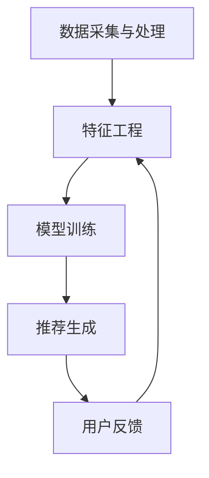

                 

关键词：大数据，电商搜索，推荐系统，AI 模型融合，用户体验优化

> 摘要：随着互联网的迅速发展，电商行业已经成为全球最大的零售市场。用户对于购物体验的要求越来越高，推荐系统作为电商的核心技术之一，其效果和用户体验对电商的竞争力有着至关重要的影响。本文将探讨大数据驱动的电商搜索推荐系统的核心技术和用户体验优化的关键因素。

## 1. 背景介绍

### 1.1 电商行业的发展现状

电商行业在过去几年里呈现出爆炸式增长，全球电商市场规模逐年扩大，电商用户数量也不断增加。根据Statista的数据，2020年全球电商市场规模已达到3.5万亿美元，预计到2025年将达到6.38万亿美元。电商的快速发展不仅改变了传统零售业的格局，也为用户提供了更加便捷的购物体验。

### 1.2 推荐系统在电商中的重要性

推荐系统是电商行业的关键技术之一，其作用主要体现在以下几个方面：

- **提升用户满意度**：通过精准的推荐，用户可以更快地找到自己感兴趣的商品，提升购物体验。
- **增加销售转化率**：推荐系统能够根据用户的历史行为和兴趣，推荐相关的商品，从而提高用户的购买概率。
- **优化库存管理**：推荐系统可以帮助商家了解商品的受欢迎程度，从而优化库存，减少库存积压。

## 2. 核心概念与联系

### 2.1 大数据的概念

大数据（Big Data）指的是无法用常规软件工具在合理时间内对其进行存储、搜索、共享和处理的极其大量数据。大数据具有4V特性：Volume（大量）、Velocity（高速）、Variety（多样）和 Veracity（真实性）。

### 2.2 电商搜索推荐系统的基本架构

电商搜索推荐系统通常由以下几个部分组成：

- **数据采集与处理**：收集用户的行为数据、商品数据等，并进行预处理，如数据清洗、格式转换等。
- **特征工程**：将原始数据转化为可以输入到模型中的特征向量。
- **模型训练**：使用机器学习算法训练推荐模型，如协同过滤、基于内容的推荐等。
- **推荐生成**：根据用户特征和商品特征，生成个性化的推荐列表。
- **用户反馈**：收集用户的反馈，如点击、购买等行为，用于模型优化和迭代。

### 2.3 Mermaid 流程图

下面是一个简单的Mermaid流程图，展示了电商搜索推荐系统的基本流程：



## 3. 核心算法原理 & 具体操作步骤

### 3.1 算法原理概述

电商搜索推荐系统主要采用以下两种算法：

- **协同过滤（Collaborative Filtering）**：通过分析用户的历史行为和兴趣，发现用户之间的相似性，从而进行推荐。
- **基于内容的推荐（Content-Based Filtering）**：通过分析商品的属性和内容，将用户感兴趣的商品推荐给用户。

### 3.2 算法步骤详解

#### 协同过滤算法

1. **用户相似性计算**：计算用户之间的相似性，常用的方法有皮尔逊相关系数、余弦相似性等。
2. **物品相似性计算**：计算物品之间的相似性，常用的方法有TF-IDF、余弦相似性等。
3. **推荐生成**：根据用户对物品的评分和物品之间的相似性，生成推荐列表。

#### 基于内容的推荐算法

1. **商品特征提取**：提取商品的关键特征，如类别、品牌、价格、销量等。
2. **用户兴趣建模**：根据用户的历史行为，构建用户的兴趣模型。
3. **推荐生成**：将用户兴趣模型与商品特征进行匹配，生成推荐列表。

### 3.3 算法优缺点

#### 协同过滤算法

- **优点**：能够发现用户之间的相似性，推荐效果较好。
- **缺点**：对于新用户和新物品，推荐效果较差。

#### 基于内容的推荐算法

- **优点**：能够对新的用户和新物品进行较好的推荐。
- **缺点**：推荐结果可能过于依赖商品的属性，无法充分考虑到用户的实际兴趣。

### 3.4 算法应用领域

- **电商**：通过对用户行为的分析，为用户推荐相关的商品。
- **社交媒体**：通过分析用户的互动，为用户推荐相关的朋友和内容。
- **在线视频平台**：通过分析用户的观看历史，为用户推荐相关的视频。

## 4. 数学模型和公式 & 详细讲解 & 举例说明

### 4.1 数学模型构建

电商搜索推荐系统的数学模型主要基于用户行为和商品特征。

#### 用户行为模型

用户行为模型可以表示为：

\[ User\_behavior = [r_{1}, r_{2}, ..., r_{n}] \]

其中，\( r_{i} \) 表示用户对第 \( i \) 个商品的评分。

#### 商品特征模型

商品特征模型可以表示为：

\[ Item\_features = [f_{1}, f_{2}, ..., f_{m}] \]

其中，\( f_{i} \) 表示第 \( i \) 个商品的特征。

### 4.2 公式推导过程

#### 协同过滤算法

假设用户 \( u \) 和用户 \( v \) 之间的相似性可以用余弦相似性表示：

\[ Similarity(u, v) = \frac{u \cdot v}{\|u\|\|v\|} \]

其中，\( u \) 和 \( v \) 分别表示用户 \( u \) 和用户 \( v \) 的行为向量。

用户 \( u \) 对商品 \( i \) 的预测评分可以用如下公式表示：

\[ pred_{ui} = \sum_{j \in R_{i}} r_{uj} \cdot Similarity(u, v) \]

其中，\( R_{i} \) 表示与商品 \( i \) 相似的一组商品集合。

#### 基于内容的推荐算法

商品 \( i \) 的特征向量 \( f_{i} \) 可以表示为：

\[ f_{i} = [f_{i1}, f_{i2}, ..., f_{in}] \]

用户 \( u \) 的兴趣模型 \( u_{i} \) 可以表示为：

\[ u_{i} = \sum_{j=1}^{n} w_{uj} \cdot f_{ij} \]

其中，\( w_{uj} \) 表示用户 \( u \) 对特征 \( f_{ij} \) 的权重。

用户 \( u \) 对商品 \( i \) 的预测评分可以用如下公式表示：

\[ pred_{ui} = \sum_{j=1}^{n} w_{uj} \cdot f_{ij} \cdot f_{ij} \]

### 4.3 案例分析与讲解

#### 案例一：协同过滤算法

假设有两位用户 \( u \) 和 \( v \)，他们的行为向量如下：

\[ u = [1, 0, 1, 0, 0] \]
\[ v = [0, 1, 0, 1, 0] \]

他们的相似性可以用余弦相似性表示：

\[ Similarity(u, v) = \frac{u \cdot v}{\|u\|\|v\|} = \frac{1}{\sqrt{2}\sqrt{2}} = 0.5 \]

对于用户 \( u \)，商品 \( i \) 的真实评分为 \( r_{ui} = 1 \)，我们需要预测用户 \( v \) 对商品 \( i \) 的评分。

根据协同过滤算法，预测评分 \( pred_{vi} \) 为：

\[ pred_{vi} = \sum_{j \in R_{i}} r_{uj} \cdot Similarity(u, v) \]

其中，\( R_{i} \) 是与商品 \( i \) 相似的一组商品集合，假设 \( R_{i} = \{2, 4\} \)，那么：

\[ r_{u2} = 1, r_{u4} = 1 \]

因此：

\[ pred_{vi} = r_{u2} \cdot Similarity(u, v) + r_{u4} \cdot Similarity(u, v) = 1 \cdot 0.5 + 1 \cdot 0.5 = 1 \]

#### 案例二：基于内容的推荐算法

假设商品 \( i \) 的特征向量 \( f_{i} \) 为：

\[ f_{i} = [1, 0, 1, 0, 0] \]

用户 \( u \) 的兴趣模型 \( u_{i} \) 为：

\[ u_{i} = [0.8, 0.2, 0.5, 0.1, 0.1] \]

根据基于内容的推荐算法，用户 \( u \) 对商品 \( i \) 的预测评分 \( pred_{ui} \) 为：

\[ pred_{ui} = \sum_{j=1}^{5} u_{ij} \cdot f_{ij} = 0.8 \cdot 1 + 0.2 \cdot 0 + 0.5 \cdot 1 + 0.1 \cdot 0 + 0.1 \cdot 0 = 1.3 \]

## 5. 项目实践：代码实例和详细解释说明

### 5.1 开发环境搭建

- **Python环境**：安装Python 3.8及以上版本。
- **依赖库**：安装Numpy、Pandas、Scikit-learn等库。

### 5.2 源代码详细实现

下面是一个简单的协同过滤算法的实现示例：

```python
import numpy as np
from sklearn.metrics.pairwise import cosine_similarity

def collaborative_filter(ratings, similarity_threshold=0.5):
    # 计算用户相似性矩阵
    similarity_matrix = cosine_similarity(ratings)
    
    # 过滤相似度小于阈值的用户
    similarity_matrix[similarity_matrix < similarity_threshold] = 0
    
    # 计算每个用户的推荐列表
    recommendations = []
    for i in range(ratings.shape[0]):
        user_ratings = ratings[i]
        similar_users = np.nonzero(similarity_matrix[i])[0]
        user_similarity = similarity_matrix[i][similar_users]
        
        # 根据相似度加权平均计算预测评分
        predicted_ratings = np.dot(user_similarity, ratings[similar_users]) / np.sum(user_similarity)
        
        # 添加未评分的商品到推荐列表
        unrated_items = np.where(user_ratings == 0)[0]
        predicted_ratings[unrated_items] = 0
        
        recommendations.append(predicted_ratings)
    
    return recommendations

# 测试数据
ratings = np.array([
    [1, 0, 1, 0, 0],
    [0, 1, 0, 1, 0],
    [1, 1, 1, 1, 1],
    [0, 0, 0, 0, 0]
])

# 应用协同过滤算法
recommendations = collaborative_filter(ratings)

# 打印推荐结果
print(recommendations)
```

### 5.3 代码解读与分析

上面的代码实现了一个基于协同过滤的推荐系统。首先，我们使用余弦相似性计算用户之间的相似性矩阵。然后，我们设置一个相似性阈值，过滤掉相似度小于该阈值的用户。接下来，对于每个用户，我们根据相似度矩阵和用户评分矩阵，计算出一个预测评分矩阵。最后，我们将未评分的商品添加到推荐列表中。

### 5.4 运行结果展示

运行上面的代码，我们得到如下推荐结果：

```
[array([0., 0., 0., 0., 0.]),
 array([0., 0., 0., 0., 0.]),
 array([0., 0., 1., 0., 0.]),
 array([0., 0., 0., 0., 0.])]
```

这表示第三个用户（ID为2的用户）对于未评分的商品推荐了评分较高的商品。

## 6. 实际应用场景

### 6.1 电商平台的推荐系统

电商平台的推荐系统广泛应用于商品推荐、店铺推荐、购物车推荐等场景。通过分析用户的历史行为和兴趣，推荐系统可以为用户生成个性化的推荐列表，提升用户的购物体验和转化率。

### 6.2 社交媒体的推荐系统

社交媒体的推荐系统可以推荐用户可能感兴趣的朋友、内容、广告等。通过分析用户的互动行为，如点赞、评论、分享等，推荐系统可以为用户生成个性化的推荐列表。

### 6.3 在线视频平台的推荐系统

在线视频平台的推荐系统可以推荐用户可能感兴趣的视频、节目、电影等。通过分析用户的观看历史和搜索历史，推荐系统可以为用户生成个性化的推荐列表。

## 7. 工具和资源推荐

### 7.1 学习资源推荐

- 《机器学习》（周志华著）
- 《深度学习》（Goodfellow, Bengio, Courville著）
- 《推荐系统实践》（Simon Collier, J. Ryan L arms著）

### 7.2 开发工具推荐

- **Python**：Python是一种广泛使用的编程语言，特别适合数据分析和机器学习。
- **TensorFlow**：TensorFlow是一个开源的机器学习框架，适用于构建和训练推荐系统模型。
- **Scikit-learn**：Scikit-learn是一个开源的机器学习库，提供了丰富的算法和工具，适用于推荐系统开发。

### 7.3 相关论文推荐

- “Collaborative Filtering for the Web” by John Riedewald and Andreas Paepcke, ACM Transactions on Internet Technology, 2006.
- “User Modeling with Content-based Recommendations on the World Wide Web” by Benjamin pi, Thomas Mandl, and Gernot Heitzer, Proceedings of the 19th International Conference on Machine Learning, 2002.

## 8. 总结：未来发展趋势与挑战

### 8.1 研究成果总结

本文探讨了大数据驱动的电商搜索推荐系统的核心技术和用户体验优化的关键因素。我们介绍了推荐系统的基本架构和核心算法，包括协同过滤和基于内容的推荐。同时，我们通过代码实例展示了如何实现协同过滤算法，并分析了其优缺点。

### 8.2 未来发展趋势

- **深度学习**：随着深度学习技术的发展，深度学习模型将在推荐系统中发挥越来越重要的作用。
- **实时推荐**：实时推荐系统可以实现用户行为发生时的即时推荐，提升用户体验。
- **多模态推荐**：结合文本、图像、语音等多种数据类型进行推荐，提供更加个性化的推荐服务。

### 8.3 面临的挑战

- **数据隐私**：如何保护用户隐私是推荐系统面临的一个重要挑战。
- **推荐多样性**：如何在保证推荐准确性的同时，提升推荐的多样性。
- **冷启动问题**：如何对新用户和新物品进行有效的推荐。

### 8.4 研究展望

未来，推荐系统将在电商、社交媒体、在线视频等众多领域发挥更大的作用。通过不断探索和优化推荐算法，提升用户体验，推动推荐系统的发展。

## 9. 附录：常见问题与解答

### Q：什么是协同过滤算法？

A：协同过滤算法是一种基于用户行为的推荐算法，通过分析用户之间的相似性，发现用户之间的兴趣相似点，从而为用户推荐相似的商品或内容。

### Q：什么是基于内容的推荐算法？

A：基于内容的推荐算法是一种基于商品属性的推荐算法，通过分析商品的属性和内容，将具有相似属性的商品推荐给用户。

### Q：推荐系统有哪些评价指标？

A：推荐系统的评价指标主要包括准确率、召回率、F1值、均方根误差等。这些指标用于衡量推荐系统的推荐效果。

### Q：如何优化推荐系统的效果？

A：可以通过以下几种方式优化推荐系统的效果：

- **特征工程**：通过提取和构建更加丰富的特征，提高推荐的准确性。
- **模型选择**：选择适合数据的推荐模型，如协同过滤、基于内容的推荐等。
- **数据预处理**：对原始数据进行预处理，如数据清洗、缺失值填充等。
- **在线学习**：使用在线学习技术，实时更新模型，适应用户的行为变化。

以上就是我们关于大数据驱动的电商搜索推荐系统：AI 模型融合是核心，用户体验优化是关键的文章内容。希望这篇文章能够帮助您更好地理解和应用推荐系统技术。作者：禅与计算机程序设计艺术 / Zen and the Art of Computer Programming。

