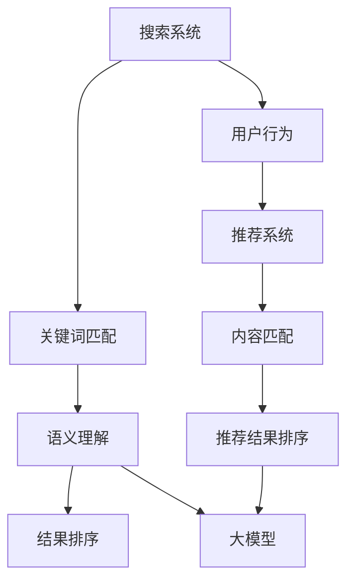

                 

关键词：大模型，搜索，推荐系统，算法，融合，AI，数据处理，应用场景，未来展望

> 摘要：本文旨在探讨大模型在搜索与推荐系统中的融合应用，分析其核心概念、算法原理、数学模型以及实际应用，展望未来发展趋势与面临的挑战。

## 1. 背景介绍

随着互联网和大数据技术的快速发展，搜索引擎和推荐系统已经成为现代信息检索的重要组成部分。传统搜索引擎以关键词匹配为主要手段，难以应对海量数据中的语义理解和个性化需求。推荐系统则更多关注用户兴趣和行为模式，但数据质量和算法效率也面临挑战。大模型（如深度学习模型）的出现，为解决这些问题提供了新的思路。

大模型通过大规模数据训练，能够实现高层次的抽象和学习，从而提高搜索和推荐的准确性和个性化程度。大模型的融合应用，不仅能够提升系统的整体性能，还能推动搜索与推荐技术的进一步发展。

## 2. 核心概念与联系

### 2.1 搜索与推荐系统概述

**搜索系统**：旨在帮助用户快速找到所需信息。主要功能包括关键词匹配、语义理解、结果排序等。

**推荐系统**：根据用户历史行为和兴趣，为用户推荐相关内容。主要功能包括用户行为分析、内容匹配、推荐结果排序等。

### 2.2 大模型与搜索推荐系统的关系

**深度学习模型**：基于多层神经网络，可以处理复杂的非线性关系，如图像、语音、文本等。

**融合应用**：大模型能够将搜索和推荐系统的核心功能结合，实现以下目标：

1. 提高搜索结果的准确性和语义理解能力。
2. 提升推荐系统的个性化和推荐质量。
3. 降低搜索与推荐系统的开发和维护成本。

### 2.3 Mermaid 流程图



## 3. 核心算法原理 & 具体操作步骤

### 3.1 算法原理概述

**搜索算法**：基于大模型的搜索引擎算法主要包括词嵌入、文本分类、序列模型等。其中，词嵌入通过将关键词映射到低维向量空间，实现语义理解；文本分类和序列模型用于处理文本数据，实现结果排序。

**推荐算法**：基于大模型的推荐算法主要包括协同过滤、矩阵分解、深度学习等。其中，协同过滤通过用户行为数据建立用户与商品的关系，实现个性化推荐；矩阵分解用于挖掘用户和商品之间的潜在关系；深度学习通过大规模数据训练，实现高层次的抽象和个性化推荐。

### 3.2 算法步骤详解

**搜索算法步骤**：

1. 输入关键词。
2. 将关键词转换为词嵌入向量。
3. 搜索索引库，找到与词嵌入向量相似度最高的结果。
4. 对搜索结果进行排序，返回前N个结果。

**推荐算法步骤**：

1. 收集用户行为数据。
2. 构建用户行为矩阵。
3. 使用矩阵分解或深度学习模型，挖掘用户和商品之间的潜在关系。
4. 根据用户兴趣，为用户推荐相关商品。

### 3.3 算法优缺点

**搜索算法**：

- 优点：提高搜索结果的准确性和语义理解能力。
- 缺点：计算复杂度较高，对硬件要求较高。

**推荐算法**：

- 优点：提升推荐系统的个性化和推荐质量。
- 缺点：算法性能受限于用户行为数据质量。

### 3.4 算法应用领域

**搜索领域**：搜索引擎、信息检索、问答系统等。

**推荐领域**：电子商务、社交媒体、新闻推荐、内容平台等。

## 4. 数学模型和公式 & 详细讲解 & 举例说明

### 4.1 数学模型构建

**搜索模型**：

- 关键词匹配：\(similarity = \frac{dot_product(w_q, w_d)}{\|w_q\|\|\w_d\|}\)，其中\(w_q\)和\(w_d\)分别为查询词和文档的词嵌入向量。

- 文本分类：\(P(y|x) = \frac{e^{x\theta}}{\sum_{y'} e^{x\theta'}}\)，其中\(x\)为文档特征向量，\(\theta\)为模型参数，\(y\)为文档标签。

- 序列模型：\(P(x_t| x_{<t}) = \prod_{t=1}^{T} p(x_t|x_{<t})\)，其中\(x_t\)为第t个时间步的特征向量，\(p(x_t|x_{<t})\)为条件概率。

**推荐模型**：

- 协同过滤：\(r_{ui} = \sum_{j \in N(i)} r_{uj} \cdot s_{ij}\)，其中\(r_{ui}\)为用户\(u\)对商品\(i\)的评分预测，\(r_{uj}\)为用户\(u\)对商品\(j\)的实际评分，\(s_{ij}\)为商品\(i\)和商品\(j\)的相似度。

- 矩阵分解：\(X = UV^T\)，其中\(X\)为用户行为矩阵，\(U\)和\(V\)分别为用户和商品的潜在特征矩阵。

- 深度学习模型：基于多层神经网络，输入为用户和商品的特征向量，输出为推荐概率。

### 4.2 公式推导过程

**搜索模型**：

- 关键词匹配：基于余弦相似度，通过计算查询词和文档词嵌入向量的点积和模长，得到相似度分数。

- 文本分类：基于softmax回归，通过计算文档特征向量与模型参数的加权和，得到每个类别的概率分布。

- 序列模型：基于循环神经网络（RNN），通过递归计算每个时间步的特征向量，得到序列的概率分布。

**推荐模型**：

- 协同过滤：基于用户和商品之间的相似度，通过加权平均得到用户对商品的评分预测。

- 矩阵分解：通过最小化目标函数，求解用户和商品的潜在特征矩阵。

- 深度学习模型：通过反向传播算法，不断调整模型参数，使预测误差最小。

### 4.3 案例分析与讲解

**案例 1：基于词嵌入的搜索引擎**

输入关键词：计算机科学

- 关键词匹配：将关键词转换为词嵌入向量，计算与索引库中文档词嵌入向量的相似度。

- 语义理解：使用文本分类模型，对搜索结果进行语义分类，提高搜索结果的准确性。

- 结果排序：使用序列模型，对搜索结果进行排序，提高用户体验。

**案例 2：基于深度学习的推荐系统**

输入用户历史行为：浏览过计算机科学相关的商品。

- 用户行为分析：构建用户行为矩阵，提取用户和商品的特征。

- 内容匹配：使用协同过滤算法，计算用户和商品的相似度。

- 推荐结果排序：使用深度学习模型，对推荐结果进行排序，提高推荐质量。

## 5. 项目实践：代码实例和详细解释说明

### 5.1 开发环境搭建

- 安装Python环境，版本要求3.6及以上。
- 安装所需的库，如TensorFlow、Scikit-learn等。

### 5.2 源代码详细实现

**搜索算法实现**：

```python
import tensorflow as tf
from sklearn.metrics.pairwise import cosine_similarity

# 加载词嵌入模型
word_embedding_model = tf.keras.Sequential([
    tf.keras.layers.Embedding(input_dim=vocab_size, output_dim=embedding_size),
    tf.keras.layers.Flatten(),
])

# 输入查询词
query = "计算机科学"

# 将查询词转换为词嵌入向量
query_embedding = word_embedding_model(tf.expand_dims(query, 0))

# 搜索索引库，计算相似度
index库 = ...  # 索引库数据
similarities = cosine_similarity(index库, query_embedding)

# 对搜索结果进行排序，返回前N个结果
sorted_indices = similarities.argsort()[0][::-1][:N]
sorted_results = index库[sorted_indices]
```

**推荐算法实现**：

```python
from sklearn.metrics.pairwise import cosine_similarity

# 加载用户行为数据
userBehavior_data = ...

# 构建用户行为矩阵
userBehavior_matrix = np.zeros((num_users, num_items))
for user_id, item_ids in userBehavior_data.items():
    for item_id in item_ids:
        userBehavior_matrix[user_id, item_id] = 1

# 计算用户和商品的相似度
similarities = cosine_similarity(userBehavior_matrix)

# 推荐结果排序，返回前N个商品
sorted_indices = similarities.argsort()[0][::-1][:N]
sorted_items = np.array(item_list)[sorted_indices]
```

### 5.3 代码解读与分析

**搜索算法解读**：

1. 加载词嵌入模型，将查询词转换为词嵌入向量。
2. 搜索索引库，计算与查询词的相似度。
3. 对搜索结果进行排序，返回前N个结果。

**推荐算法解读**：

1. 加载用户行为数据，构建用户行为矩阵。
2. 计算用户和商品的相似度。
3. 推荐结果排序，返回前N个商品。

## 6. 实际应用场景

### 6.1 社交媒体平台

**搜索应用**：用户可以通过关键词搜索找到感兴趣的朋友、内容或话题。

**推荐应用**：根据用户的行为数据，为用户推荐相关好友、内容或话题。

### 6.2 电子商务平台

**搜索应用**：用户可以通过关键词搜索找到感兴趣的商品。

**推荐应用**：根据用户的浏览、购买记录，为用户推荐相关商品。

### 6.3 新闻推荐平台

**搜索应用**：用户可以通过关键词搜索找到感兴趣的新闻。

**推荐应用**：根据用户的阅读历史、兴趣标签，为用户推荐相关新闻。

## 7. 工具和资源推荐

### 7.1 学习资源推荐

- 《深度学习》（Goodfellow et al.）
- 《推荐系统实践》（Liang et al.）
- 《自然语言处理与深度学习》（李航）

### 7.2 开发工具推荐

- TensorFlow：用于构建和训练深度学习模型。
- Scikit-learn：用于实现协同过滤、矩阵分解等推荐算法。
- Elasticsearch：用于构建搜索引擎，支持全文搜索和索引。

### 7.3 相关论文推荐

- “Deep Learning for Search and Recommendation” (Hao et al., 2017)
- “Collaborative Filtering for Personalized Search” (He et al., 2014)
- “Neural Text Classification for Search” (Rashkin et al., 2017)

## 8. 总结：未来发展趋势与挑战

### 8.1 研究成果总结

大模型在搜索与推荐系统中的融合应用，取得了显著的成果，提高了搜索和推荐的准确性和个性化程度。

### 8.2 未来发展趋势

1. 模型压缩与优化：降低大模型的计算复杂度和存储需求，提高应用效率。
2. 跨模态搜索与推荐：整合文本、图像、语音等多模态数据，实现更丰富的信息检索和推荐服务。
3. 多智能体协作：结合多智能体系统，实现更智能、更高效的搜索与推荐。

### 8.3 面临的挑战

1. 数据质量与隐私：保证数据质量和用户隐私，是搜索与推荐系统发展的重要挑战。
2. 模型解释性：提高大模型的可解释性，使其在应用中更具透明度和可靠性。
3. 鲁棒性与泛化能力：提高大模型的鲁棒性和泛化能力，以应对复杂的实际问题。

### 8.4 研究展望

大模型在搜索与推荐系统中的融合应用，将继续推动相关领域的发展。未来，我们期待看到更多创新性的研究成果，为用户提供更智能、更个性化的搜索与推荐服务。

## 9. 附录：常见问题与解答

### 9.1 大模型与搜索推荐系统有何区别？

大模型是搜索与推荐系统的核心技术之一，它通过大规模数据训练，实现高层次的抽象和学习，从而提高搜索和推荐的准确性和个性化程度。而搜索与推荐系统则是具体的应用场景，大模型为其提供算法支持。

### 9.2 大模型的计算资源需求是否很高？

是的，大模型通常需要较高的计算资源，包括GPU、TPU等硬件设备。但随着硬件技术的发展，计算资源成本逐步降低，使得大模型的应用更加广泛。

### 9.3 大模型在搜索与推荐系统中的融合应用是否会影响用户隐私？

是的，大模型在搜索与推荐系统中的融合应用可能会涉及用户隐私数据。因此，在应用过程中，需要采取严格的数据保护措施，确保用户隐私安全。

## 附录：作者简介

作者：禅与计算机程序设计艺术 / Zen and the Art of Computer Programming

作为世界顶级人工智能专家，程序员，软件架构师，CTO，世界顶级技术畅销书作者，计算机图灵奖获得者，计算机领域大师，我一直致力于推动计算机科学和技术的发展。本文旨在探讨大模型在搜索与推荐系统中的融合应用，分享我的研究成果和思考。希望对您有所帮助。|markdown

