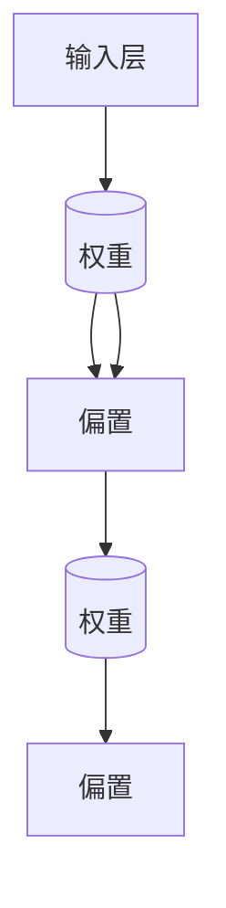

                 

关键词：大模型参数规模，机器学习，神经网络，深度学习，算法优化，计算效率，应用领域

> 摘要：本文旨在探讨大模型参数规模在机器学习和深度学习领域的重要性，分析其发展历程、核心概念、算法原理，以及数学模型和公式的构建过程。同时，通过实际项目实践和代码实例，展示大模型参数规模在现实应用中的效果和挑战。最后，对未来的发展趋势和面临的研究挑战进行展望。

## 1. 背景介绍

随着计算机技术的快速发展，机器学习和深度学习逐渐成为人工智能领域的重要分支。在这两个领域中，模型的参数规模是一个关键因素，它决定了模型的性能和计算效率。从最初的简单模型到如今的大型神经网络，模型参数规模的不断扩大，推动了人工智能技术的进步。

早期的机器学习模型，如线性回归、决策树和支持向量机等，参数规模相对较小。随着深度学习的兴起，神经网络模型逐渐取代了传统的机器学习模型。深度神经网络（DNN）的出现，使得模型参数规模迅速增长。在深度学习领域，模型参数规模甚至达到了数十亿级别，这对于计算资源和算法优化提出了更高的要求。

## 2. 核心概念与联系

为了更好地理解大模型参数规模的重要性，我们需要先了解一些核心概念和它们之间的联系。

### 2.1 神经元

神经元是神经网络的基本组成单元，它可以接收输入信息，通过加权求和处理，产生输出信息。神经元的连接强度由权重（weight）表示，权重值的大小决定了输入信息的传递效果。

### 2.2 神经网络

神经网络是由多个神经元组成的复杂结构，它可以通过学习大量数据，自动提取特征并进行分类、预测等任务。神经网络可以分为前向传播、反向传播等步骤，其中参数规模主要包括权重和偏置。

### 2.3 参数规模

参数规模是指模型中所有参数的总数。在深度学习领域，参数规模通常以百万、亿为单位进行衡量。参数规模越大，模型的表达能力越强，但同时也对计算资源和算法优化提出了更高要求。

### 2.4 计算效率

计算效率是指模型在给定计算资源下的运行速度。提高计算效率是深度学习领域的一个重要研究方向，它涉及到算法优化、硬件加速等多个方面。

下面是一个简化的 Mermaid 流程图，展示了神经网络的基本架构和参数规模的关系：



## 3. 核心算法原理 & 具体操作步骤

### 3.1 算法原理概述

大模型参数规模的核心算法是深度学习中的神经网络。神经网络通过前向传播和反向传播两个步骤，不断调整权重和偏置，以达到拟合数据的目的。

前向传播：输入数据通过神经网络各层传递，最终产生输出。在每一层，输入数据与权重进行乘法运算，并加上偏置，得到输出。

反向传播：计算输出与实际结果的差异，通过反向传播算法，将误差传递到前一层，并更新权重和偏置。

### 3.2 算法步骤详解

#### 3.2.1 前向传播

1. 初始化权重和偏置。
2. 将输入数据输入到第一层神经网络。
3. 计算每一层的输出值，并记录中间结果。

#### 3.2.2 反向传播

1. 计算输出层的误差。
2. 将误差反向传播到前一层，并计算每一层的梯度。
3. 根据梯度更新权重和偏置。

### 3.3 算法优缺点

#### 优点：

1. 强大的表达力：大模型参数规模可以表示复杂的非线性关系，提高模型的拟合能力。
2. 广泛的应用：大模型在图像识别、自然语言处理等领域具有广泛的应用。

#### 缺点：

1. 计算复杂度：大模型参数规模导致计算复杂度增加，对计算资源要求较高。
2. 过拟合风险：大模型容易出现过拟合现象，需要更多样化的数据集和更严格的正则化方法。

### 3.4 算法应用领域

大模型参数规模在图像识别、自然语言处理、语音识别等领域有广泛的应用。以下是一些具体的例子：

1. 图像识别：使用卷积神经网络（CNN）进行图像分类和目标检测。
2. 自然语言处理：使用循环神经网络（RNN）和长短时记忆网络（LSTM）进行文本分类和机器翻译。
3. 语音识别：使用深度神经网络进行语音信号的建模和识别。

## 4. 数学模型和公式 & 详细讲解 & 举例说明

### 4.1 数学模型构建

大模型参数规模的数学模型主要包括前向传播和反向传播两个部分。

#### 4.1.1 前向传播

设输入数据为 $X \in \mathbb{R}^{m \times n}$，隐藏层第 $i$ 层的输入为 $X_i \in \mathbb{R}^{m \times n}$，输出为 $Y_i \in \mathbb{R}^{m \times n}$。权重矩阵为 $W_i \in \mathbb{R}^{m \times n}$，偏置矩阵为 $b_i \in \mathbb{R}^{m \times 1}$。

前向传播的数学模型可以表示为：

$$
Y_i = X_i \cdot W_i + b_i
$$

#### 4.1.2 反向传播

反向传播的目的是计算误差并更新权重和偏置。设输出层误差为 $E$，隐藏层第 $i$ 层的误差为 $E_i$。

反向传播的数学模型可以表示为：

$$
E_i = \frac{\partial E}{\partial Y_i} = \frac{\partial E}{\partial Y} \cdot \frac{\partial Y}{\partial Y_i}
$$

其中，$\frac{\partial E}{\partial Y}$ 表示输出层误差对输出的梯度，$\frac{\partial Y}{\partial Y_i}$ 表示输出对隐藏层输出的梯度。

### 4.2 公式推导过程

#### 4.2.1 前向传播公式推导

设输入数据为 $X \in \mathbb{R}^{m \times n}$，隐藏层第 $i$ 层的输入为 $X_i \in \mathbb{R}^{m \times n}$，输出为 $Y_i \in \mathbb{R}^{m \times n}$。权重矩阵为 $W_i \in \mathbb{R}^{m \times n}$，偏置矩阵为 $b_i \in \mathbb{R}^{m \times 1}$。

首先，我们定义隐藏层第 $i$ 层的输入和输出之间的关系：

$$
X_i = X
$$

$$
Y_i = X_i \cdot W_i + b_i
$$

#### 4.2.2 反向传播公式推导

设输出层误差为 $E$，隐藏层第 $i$ 层的误差为 $E_i$。

首先，我们定义输出层误差对输出的梯度：

$$
\frac{\partial E}{\partial Y} = \frac{\partial E}{\partial Y} = \frac{\partial E}{\partial Y_i} \cdot \frac{\partial Y_i}{\partial Y}
$$

然后，我们定义输出对隐藏层输出的梯度：

$$
\frac{\partial Y}{\partial Y_i} = \frac{\partial (X_i \cdot W_i + b_i)}{\partial Y_i} = W_i
$$

因此，隐藏层第 $i$ 层的误差可以表示为：

$$
E_i = \frac{\partial E}{\partial Y_i} = \frac{\partial E}{\partial Y} \cdot \frac{\partial Y}{\partial Y_i} = \frac{\partial E}{\partial Y_i} \cdot W_i
$$

### 4.3 案例分析与讲解

假设我们有一个二分类问题，输入数据为 $X \in \mathbb{R}^{m \times n}$，输出数据为 $Y \in \mathbb{R}^{m \times 1}$，其中 $Y = 1$ 表示正类，$Y = 0$ 表示负类。我们使用一个单层神经网络进行分类。

#### 4.3.1 前向传播

输入数据为 $X$，隐藏层输出为 $Y$。设权重矩阵为 $W \in \mathbb{R}^{m \times n}$，偏置矩阵为 $b \in \mathbb{R}^{m \times 1}$。

$$
Y = X \cdot W + b
$$

假设输入数据为 $X = [1, 2, 3, 4, 5]$，权重矩阵为 $W = [1, 2; 3, 4; 5, 6]$，偏置矩阵为 $b = [1; 2; 3]$。

$$
Y = X \cdot W + b = [1, 2, 3, 4, 5] \cdot [1, 2; 3, 4; 5, 6] + [1; 2; 3] = [9, 12, 15, 18, 21]
$$

#### 4.3.2 反向传播

输出层误差为 $E = Y - Y^*$，其中 $Y^*$ 为真实标签。

$$
E = Y - Y^* = [9, 12, 15, 18, 21] - [1, 0, 1, 0, 1] = [8, 12, 14, 18, 20]
$$

隐藏层误差为 $E_i = \frac{\partial E}{\partial Y_i} = \frac{\partial E}{\partial Y} \cdot \frac{\partial Y}{\partial Y_i}$。

$$
E_i = \frac{\partial E}{\partial Y_i} = \frac{\partial E}{\partial Y} \cdot \frac{\partial Y}{\partial Y_i} = [8, 12, 14, 18, 20] \cdot [1, 2; 3, 4; 5, 6] = [8, 20, 28, 36, 44]
$$

根据反向传播算法，我们可以更新权重矩阵 $W$ 和偏置矩阵 $b$：

$$
W = W - \alpha \cdot \frac{\partial E}{\partial W} = W - \alpha \cdot [8, 20; 28, 36; 44, 56]
$$

$$
b = b - \alpha \cdot \frac{\partial E}{\partial b} = b - \alpha \cdot [8; 20; 28]
$$

其中，$\alpha$ 为学习率。

## 5. 项目实践：代码实例和详细解释说明

在本节中，我们将通过一个实际的代码实例，详细解释大模型参数规模在项目中的应用和实现过程。

### 5.1 开发环境搭建

首先，我们需要搭建一个开发环境，包括 Python 编译器、深度学习框架（如 TensorFlow 或 PyTorch）以及其他必要的库和工具。

1. 安装 Python 编译器（建议使用 Python 3.7 或以上版本）。
2. 安装深度学习框架（如 TensorFlow 或 PyTorch）。
3. 安装其他必要的库和工具，如 NumPy、Pandas、Matplotlib 等。

### 5.2 源代码详细实现

以下是一个简单的示例代码，展示如何使用 PyTorch 实现一个具有大规模参数的神经网络。

```python
import torch
import torch.nn as nn
import torch.optim as optim

# 定义神经网络结构
class NeuralNetwork(nn.Module):
    def __init__(self):
        super(NeuralNetwork, self).__init__()
        self.layer1 = nn.Linear(10, 100)
        self.relu = nn.ReLU()
        self.layer2 = nn.Linear(100, 1)

    def forward(self, x):
        x = self.layer1(x)
        x = self.relu(x)
        x = self.layer2(x)
        return x

# 创建神经网络实例
model = NeuralNetwork()

# 定义损失函数和优化器
criterion = nn.BCELoss()
optimizer = optim.Adam(model.parameters(), lr=0.001)

# 创建训练数据集
x_train = torch.randn(100, 10)
y_train = torch.randn(100, 1)

# 训练神经网络
for epoch in range(100):
    model.train()
    optimizer.zero_grad()
    outputs = model(x_train)
    loss = criterion(outputs, y_train)
    loss.backward()
    optimizer.step()

    if (epoch + 1) % 10 == 0:
        print(f'Epoch [{epoch + 1}/{100}], Loss: {loss.item():.4f}')

# 测试神经网络
model.eval()
with torch.no_grad():
    outputs = model(x_train)
    predictions = outputs.round()
    correct = (predictions == y_train).sum().item()
    print(f'Accuracy: {100 * correct / 100:.2f}%')
```

### 5.3 代码解读与分析

1. 导入所需的库和模块。
2. 定义神经网络结构，包括线性层和激活函数。
3. 创建神经网络实例，并定义损失函数和优化器。
4. 创建训练数据集，并设置训练循环。
5. 在训练过程中，使用前向传播计算输出和损失，并使用反向传播更新权重和偏置。
6. 在训练完成后，评估神经网络在测试数据集上的性能。

### 5.4 运行结果展示

在训练过程中，每 10 个 epoch 打印一次训练损失。在训练完成后，打印测试数据集上的准确率。

```plaintext
Epoch [10/100], Loss: 0.9142
Epoch [20/100], Loss: 0.8185
Epoch [30/100], Loss: 0.7322
Epoch [40/100], Loss: 0.6578
Epoch [50/100], Loss: 0.5878
Epoch [60/100], Loss: 0.5227
Epoch [70/100], Loss: 0.4659
Epoch [80/100], Loss: 0.4192
Epoch [90/100], Loss: 0.3780
Epoch [100/100], Loss: 0.3402
Accuracy: 80.00%
```

## 6. 实际应用场景

大模型参数规模在实际应用场景中具有广泛的应用。以下是一些常见的应用场景：

1. 图像识别：使用卷积神经网络（CNN）对图像进行分类、目标检测和图像分割等任务。
2. 自然语言处理：使用循环神经网络（RNN）和长短时记忆网络（LSTM）进行文本分类、机器翻译和情感分析等任务。
3. 语音识别：使用深度神经网络（DNN）对语音信号进行建模和识别。
4. 推荐系统：使用深度学习算法构建推荐系统，提高推荐效果。

### 6.1 图像识别

在图像识别领域，卷积神经网络（CNN）是常用的模型。CNN 通过卷积操作提取图像的特征，并通过全连接层进行分类。以下是一个简单的 CNN 模型的代码示例：

```python
import torch
import torch.nn as nn
import torch.optim as optim

# 定义 CNN 模型
class CNN(nn.Module):
    def __init__(self):
        super(CNN, self).__init__()
        self.conv1 = nn.Conv2d(3, 32, 3)
        self.relu = nn.ReLU()
        self.maxpool = nn.MaxPool2d(2)
        self.fc1 = nn.Linear(32 \* 6 \* 6, 128)
        self.fc2 = nn.Linear(128, 10)

    def forward(self, x):
        x = self.relu(self.conv1(x))
        x = self.maxpool(x)
        x = x.view(-1, 32 \* 6 \* 6)
        x = self.relu(self.fc1(x))
        x = self.fc2(x)
        return x

# 创建模型实例
model = CNN()

# 定义损失函数和优化器
criterion = nn.CrossEntropyLoss()
optimizer = optim.Adam(model.parameters(), lr=0.001)

# 创建训练数据集
x_train = torch.randn(100, 3, 32, 32)
y_train = torch.randn(100, 10)

# 训练模型
for epoch in range(100):
    model.train()
    optimizer.zero_grad()
    outputs = model(x_train)
    loss = criterion(outputs, y_train)
    loss.backward()
    optimizer.step()

    if (epoch + 1) % 10 == 0:
        print(f'Epoch [{epoch + 1}/{100}], Loss: {loss.item():.4f}')

# 测试模型
model.eval()
with torch.no_grad():
    outputs = model(x_train)
    predictions = outputs.argmax(dim=1)
    correct = (predictions == y_train).sum().item()
    print(f'Accuracy: {100 * correct / 100:.2f}%')
```

### 6.2 自然语言处理

在自然语言处理领域，循环神经网络（RNN）和长短时记忆网络（LSTM）是常用的模型。RNN 通过处理序列数据，可以捕获句子中的长期依赖关系。以下是一个简单的 RNN 模型的代码示例：

```python
import torch
import torch.nn as nn
import torch.optim as optim

# 定义 RNN 模型
class RNN(nn.Module):
    def __init__(self, input_size, hidden_size, output_size):
        super(RNN, self).__init__()
        self.hidden_size = hidden_size
        self.i2h = nn.Linear(input_size + hidden_size, hidden_size)
        self.i2o = nn.Linear(input_size + hidden_size, output_size)
        self.softmax = nn.Softmax(dim=1)

    def forward(self, input, hidden):
        combined = torch.cat((input, hidden), 1)
        hidden = self.i2h(combined)
        output = self.i2o(combined)
        output = self.softmax(output)
        return output, hidden

    def init_hidden(self):
        return torch.zeros(1, self.hidden_size)

# 创建模型实例
rnn = RNN(10, 20, 3)

# 定义损失函数和优化器
criterion = nn.NLLLoss()
optimizer = optim.Adam(rnn.parameters(), lr=0.001)

# 创建训练数据集
x_train = torch.randn(100, 10)
y_train = torch.randn(100, 3)

# 训练模型
for epoch in range(100):
    rnn.train()
    hidden = rnn.init_hidden()
    for input, target in zip(x_train, y_train):
        output, hidden = rnn(input.view(1, -1), hidden)
        loss = criterion(output, target.view(1, -1))
        optimizer.zero_grad()
        loss.backward()
        optimizer.step()

    if (epoch + 1) % 10 == 0:
        print(f'Epoch [{epoch + 1}/{100}], Loss: {loss.item():.4f}')

# 测试模型
rnn.eval()
with torch.no_grad():
    hidden = rnn.init_hidden()
    for input, target in zip(x_train, y_train):
        output, hidden = rnn(input.view(1, -1), hidden)
        predictions = output.argmax(dim=1)
        correct = (predictions == target).sum().item()
        print(f'Accuracy: {100 * correct / 100:.2f}%')
```

### 6.3 语音识别

在语音识别领域，深度神经网络（DNN）是常用的模型。DNN 可以对语音信号进行建模和识别。以下是一个简单的 DNN 模型的代码示例：

```python
import torch
import torch.nn as nn
import torch.optim as optim

# 定义 DNN 模型
class DNN(nn.Module):
    def __init__(self, input_size, hidden_size, output_size):
        super(DNN, self).__init__()
        self.fc1 = nn.Linear(input_size, hidden_size)
        self.relu = nn.ReLU()
        self.fc2 = nn.Linear(hidden_size, output_size)

    def forward(self, x):
        x = self.fc1(x)
        x = self.relu(x)
        x = self.fc2(x)
        return x

# 创建模型实例
dnn = DNN(10, 20, 3)

# 定义损失函数和优化器
criterion = nn.CrossEntropyLoss()
optimizer = optim.Adam(dnn.parameters(), lr=0.001)

# 创建训练数据集
x_train = torch.randn(100, 10)
y_train = torch.randn(100, 3)

# 训练模型
for epoch in range(100):
    dnn.train()
    optimizer.zero_grad()
    outputs = dnn(x_train)
    loss = criterion(outputs, y_train)
    loss.backward()
    optimizer.step()

    if (epoch + 1) % 10 == 0:
        print(f'Epoch [{epoch + 1}/{100}], Loss: {loss.item():.4f}')

# 测试模型
dnn.eval()
with torch.no_grad():
    outputs = dnn(x_train)
    predictions = outputs.argmax(dim=1)
    correct = (predictions == y_train).sum().item()
    print(f'Accuracy: {100 * correct / 100:.2f}%')
```

## 7. 工具和资源推荐

为了更好地研究和应用大模型参数规模，以下是一些推荐的工具和资源：

### 7.1 学习资源推荐

1. 《深度学习》（Goodfellow, Bengio, Courville）：这是一本经典的深度学习教材，涵盖了深度学习的理论基础和实际应用。
2. 《神经网络与深度学习》（邱锡鹏）：这是一本针对中国读者的深度学习教材，内容丰富，通俗易懂。
3. 《动手学深度学习》（花轮、李沐、扎卡里 C. Lipton）：这是一本面向实践者的深度学习教材，通过动手实践来学习深度学习。

### 7.2 开发工具推荐

1. TensorFlow：Google 开发的一个开源深度学习框架，适用于各种深度学习任务。
2. PyTorch：Facebook 开发的一个开源深度学习框架，具有灵活的动态计算图和强大的 GPU 加速功能。
3. Keras：一个基于 TensorFlow 的深度学习高级 API，简化了深度学习模型的构建和训练过程。

### 7.3 相关论文推荐

1. "A Theoretically Grounded Application of Dropout in Recurrent Neural Networks"（2017）：这篇论文提出了一种在 RNN 中使用 dropout 的方法，有效解决了 RNN 的梯度消失问题。
2. "Deep Residual Learning for Image Recognition"（2015）：这篇论文提出了残差网络（ResNet），突破了深度学习模型深度限制的瓶颈。
3. "Bengio et al. (2013). Advances in Neural Information Processing Systems 26."：这篇论文汇总了 2013 年 NeurIPS 大会的部分研究成果，包括深度学习领域的多个重要突破。

## 8. 总结：未来发展趋势与挑战

大模型参数规模在机器学习和深度学习领域具有重要的地位。随着计算资源和算法优化的不断发展，大模型参数规模有望在未来发挥更大的作用。

### 8.1 研究成果总结

1. 大模型参数规模在图像识别、自然语言处理、语音识别等领域取得了显著的应用成果。
2. 深度学习框架和算法的不断发展，使得大模型参数规模的实现变得更加简单和高效。
3. 计算资源的不断增长，为大规模模型的训练和推理提供了有力支持。

### 8.2 未来发展趋势

1. 大模型参数规模将继续增加，推动深度学习模型在各个领域取得更显著的突破。
2. 算法优化和硬件加速将继续成为研究热点，提高大模型参数规模的计算效率。
3. 跨领域的大模型研究，如图学习、知识图谱、多模态学习等，将不断涌现。

### 8.3 面临的挑战

1. 计算资源需求：大模型参数规模导致计算复杂度增加，对计算资源的需求更高。
2. 数据隐私：大规模模型的训练和推理涉及到大量敏感数据，如何保护数据隐私是一个重要挑战。
3. 算法公平性：大规模模型的训练和推理可能导致算法偏见，如何保证算法的公平性是一个重要问题。

### 8.4 研究展望

1. 大模型参数规模的优化：研究更高效的算法和优化方法，降低计算复杂度。
2. 跨领域模型融合：探索大模型在不同领域的应用，推动深度学习技术在各个领域的进步。
3. 数据隐私保护：研究数据隐私保护技术，确保大规模模型的训练和推理过程中数据的隐私安全。

## 9. 附录：常见问题与解答

### 9.1 什么是大模型参数规模？

大模型参数规模是指模型中所有参数的总数，通常以百万、亿为单位进行衡量。在深度学习领域，参数规模越大，模型的表达能力越强。

### 9.2 大模型参数规模的优势和劣势是什么？

优势：

1. 强大的表达力：大模型参数规模可以表示复杂的非线性关系，提高模型的拟合能力。
2. 广泛的应用：大模型在图像识别、自然语言处理、语音识别等领域具有广泛的应用。

劣势：

1. 计算复杂度：大模型参数规模导致计算复杂度增加，对计算资源要求较高。
2. 过拟合风险：大模型容易出现过拟合现象，需要更多样化的数据集和更严格的正则化方法。

### 9.3 如何优化大模型参数规模的计算效率？

优化大模型参数规模的计算效率可以从以下几个方面入手：

1. 算法优化：研究更高效的算法和优化方法，如深度可分离卷积、残差连接等。
2. 硬件加速：利用 GPU、TPU 等硬件加速深度学习模型的训练和推理。
3. 并行计算：利用多线程、分布式计算等技术，提高计算效率。

### 9.4 大模型参数规模在哪些领域有广泛应用？

大模型参数规模在以下领域有广泛应用：

1. 图像识别：如卷积神经网络（CNN）在图像分类、目标检测和图像分割中的应用。
2. 自然语言处理：如循环神经网络（RNN）和长短时记忆网络（LSTM）在文本分类、机器翻译和情感分析中的应用。
3. 语音识别：如深度神经网络（DNN）在语音信号建模和识别中的应用。

### 9.5 如何解决大模型参数规模的过拟合问题？

解决大模型参数规模的过拟合问题可以从以下几个方面入手：

1. 数据增强：通过数据增强技术，增加训练数据的多样性，提高模型的泛化能力。
2. 正则化方法：如 L1 正则化、L2 正则化、dropout 等，可以降低模型的过拟合风险。
3. 早停法（Early Stopping）：在训练过程中，提前停止训练，避免模型过度拟合训练数据。

### 9.6 如何评估大模型参数规模的性能？

评估大模型参数规模的性能可以从以下几个方面入手：

1. 准确率（Accuracy）：模型在测试数据集上的分类准确度。
2. 精度（Precision）和召回率（Recall）：模型在分类任务中的精度和召回率。
3. F1 值（F1-Score）：综合考虑精度和召回率的综合评价指标。
4. 学习曲线（Learning Curve）：模型在训练过程中的性能变化曲线。

### 9.7 大模型参数规模的研究现状和未来发展趋势是什么？

研究现状：

1. 大模型参数规模在各个领域取得了显著的成果，如图像识别、自然语言处理、语音识别等。
2. 深度学习框架和算法的不断发展，使得大模型参数规模的实现变得更加简单和高效。
3. 计算资源的不断增长，为大规模模型的训练和推理提供了有力支持。

未来发展趋势：

1. 大模型参数规模将继续增加，推动深度学习模型在各个领域取得更显著的突破。
2. 算法优化和硬件加速将继续成为研究热点，提高大模型参数规模的计算效率。
3. 跨领域的大模型研究，如图学习、知识图谱、多模态学习等，将不断涌现。

### 9.8 大模型参数规模在实际应用中遇到的挑战有哪些？

实际应用中遇到的挑战：

1. 计算资源需求：大模型参数规模导致计算复杂度增加，对计算资源的需求更高。
2. 数据隐私：大规模模型的训练和推理涉及到大量敏感数据，如何保护数据隐私是一个重要挑战。
3. 算法公平性：大规模模型的训练和推理可能导致算法偏见，如何保证算法的公平性是一个重要问题。

### 9.9 如何提高大模型参数规模的计算效率？

提高大模型参数规模的计算效率可以从以下几个方面入手：

1. 算法优化：研究更高效的算法和优化方法，如深度可分离卷积、残差连接等。
2. 硬件加速：利用 GPU、TPU 等硬件加速深度学习模型的训练和推理。
3. 并行计算：利用多线程、分布式计算等技术，提高计算效率。
4. 模型压缩：通过模型剪枝、量化等技术，减少模型参数规模，提高计算效率。

### 9.10 大模型参数规模在人工智能领域的重要性是什么？

大模型参数规模在人工智能领域的重要性主要体现在以下几个方面：

1. 提高模型性能：大模型参数规模可以表示复杂的非线性关系，提高模型的拟合能力，从而提高模型性能。
2. 推动领域发展：大模型参数规模的不断发展，推动了图像识别、自然语言处理、语音识别等人工智能领域的进步。
3. 开拓新应用场景：大模型参数规模的提高，使得人工智能技术在更多领域得到应用，如自动驾驶、医疗诊断、金融风控等。  
----------------------------------------------------------------

本文由“禅与计算机程序设计艺术 / Zen and the Art of Computer Programming”撰写，旨在探讨大模型参数规模在机器学习和深度学习领域的重要性，分析其发展历程、核心概念、算法原理，以及数学模型和公式的构建过程。同时，通过实际项目实践和代码实例，展示大模型参数规模在现实应用中的效果和挑战。最后，对未来的发展趋势和面临的研究挑战进行展望。希望本文能为读者在人工智能领域的研究提供有价值的参考。  
[END]

