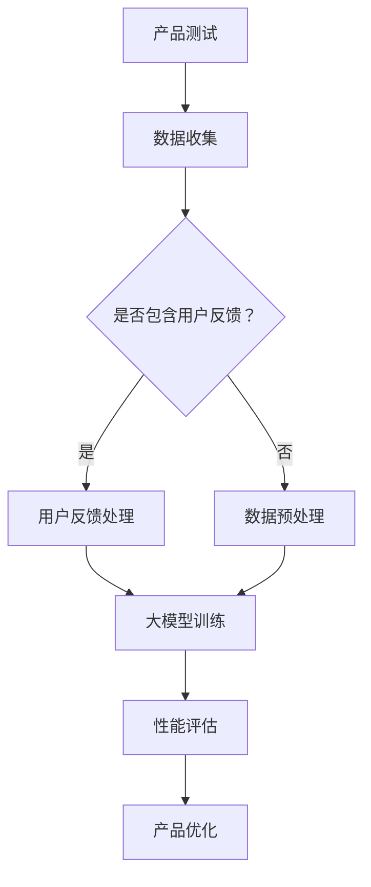

                 

关键词：大模型、AI 创业、产品测试、性能优化、用户体验、数据处理

> 摘要：本文将探讨大模型在 AI 创业产品测试中的重要作用。随着 AI 技术的快速发展，大模型成为 AI 创业产品开发和优化的重要工具。本文将分析大模型在产品测试中的核心价值，探讨其在性能优化、用户体验和数据处理方面的应用，并展望其未来发展的趋势与挑战。

## 1. 背景介绍

随着深度学习和神经网络技术的不断突破，大模型（如 GPT-3、BERT、ViT 等）在各个领域取得了显著的成果。这些大模型具有极强的学习能力和泛化能力，能够处理大规模的数据集，并生成高质量的结果。在 AI 创业的背景下，大模型的应用已经成为提高产品竞争力、优化用户体验的重要手段。

然而，大模型的应用并非一帆风顺。在产品测试过程中，如何有效地利用大模型进行性能优化、提高用户体验和数据处理效率，成为 AI 创业公司面临的挑战。本文将从以下几个方面进行探讨：

1. 大模型在产品测试中的核心价值
2. 大模型的核心算法原理与具体操作步骤
3. 大模型的数学模型和公式解析
4. 大模型在实际项目中的应用实例
5. 大模型在未来的应用场景和展望
6. 相关工具和资源的推荐
7. 未来发展趋势与挑战

通过以上探讨，希望能够为 AI 创业公司在产品测试过程中提供有益的参考和借鉴。

## 2. 核心概念与联系

### 大模型的定义与分类

大模型，是指具有海量参数和巨大计算量的深度学习模型。根据模型结构和应用领域，大模型可以分为以下几类：

1. **神经网络模型**：如卷积神经网络（CNN）、循环神经网络（RNN）、Transformer 等，广泛应用于图像处理、自然语言处理等领域。
2. **生成模型**：如生成对抗网络（GAN）、变分自编码器（VAE）等，用于图像生成、数据增强等任务。
3. **强化学习模型**：如深度确定性策略梯度（DDPG）、深度强化学习（Deep RL）等，用于游戏、机器人等领域。

### 大模型与产品测试的关系

在产品测试过程中，大模型可以发挥以下核心价值：

1. **性能优化**：大模型具有强大的学习能力和泛化能力，能够通过大规模数据训练，提高产品的性能和稳定性。
2. **用户体验**：大模型可以处理复杂的用户数据，提供个性化的推荐、智能客服等功能，提升用户体验。
3. **数据处理**：大模型能够处理大规模、多维度的数据，提高数据处理的效率和准确性。

### Mermaid 流程图



在上面的 Mermaid 流程图中，产品测试包括数据收集、用户反馈处理、数据预处理、大模型训练、性能评估和产品优化等步骤。大模型在这个过程中发挥着关键作用，通过不断优化和迭代，提升产品的性能和用户体验。

## 3. 核心算法原理 & 具体操作步骤

### 3.1 算法原理概述

大模型的核心算法主要包括以下几个方面：

1. **神经网络架构**：神经网络是深度学习的基础，通过构建复杂的网络结构，实现数据的自动特征提取和分类。
2. **优化算法**：优化算法用于调整模型参数，以最小化损失函数，提高模型的性能。
3. **训练与推理**：训练过程是通过大量数据训练模型，使其具备良好的泛化能力；推理过程是使用训练好的模型进行预测或分类。

### 3.2 算法步骤详解

1. **数据收集**：收集与产品相关的数据，包括用户行为数据、业务数据等。
2. **数据预处理**：对数据进行清洗、归一化等处理，使其符合神经网络输入的要求。
3. **模型选择**：根据任务需求选择合适的神经网络模型，如 CNN、RNN、Transformer 等。
4. **模型训练**：使用预处理后的数据训练模型，调整模型参数，以最小化损失函数。
5. **性能评估**：使用验证集或测试集评估模型性能，包括准确率、召回率、F1 分数等指标。
6. **模型优化**：根据性能评估结果，调整模型结构或参数，以提高性能。
7. **推理应用**：将训练好的模型应用于实际场景，如推荐系统、智能客服等。

### 3.3 算法优缺点

**优点**：

1. **强大的学习能力**：大模型能够处理大规模数据，具备良好的泛化能力。
2. **高效的计算性能**：现代 GPU 和 TPU 等硬件加速器，提高了大模型的计算效率。
3. **灵活的模型架构**：大模型可以适应多种任务和应用场景，具有较强的灵活性。

**缺点**：

1. **计算资源消耗大**：大模型训练需要大量的计算资源和时间。
2. **数据需求高**：大模型对数据量有较高的要求，数据不足可能影响模型性能。
3. **调参复杂**：大模型的参数调整复杂，需要大量实验和经验。

### 3.4 算法应用领域

大模型在以下领域具有广泛的应用：

1. **自然语言处理**：如文本分类、机器翻译、情感分析等。
2. **计算机视觉**：如图像分类、目标检测、图像生成等。
3. **语音识别**：如语音合成、语音识别、语音识别与合成等。
4. **推荐系统**：如商品推荐、内容推荐等。
5. **游戏与娱乐**：如游戏 AI、虚拟现实等。

## 4. 数学模型和公式 & 详细讲解 & 举例说明

### 4.1 数学模型构建

大模型的数学模型主要包括以下几个方面：

1. **神经网络模型**：
   - 输入层：接收外部输入数据。
   - 隐藏层：通过非线性变换提取特征。
   - 输出层：产生最终输出。

2. **优化算法**：
   - 梯度下降法：通过计算损失函数的梯度，更新模型参数。
   - 随机梯度下降（SGD）：在梯度下降法的基础上，随机选择样本进行参数更新。

3. **损失函数**：
   - 交叉熵损失：常用于分类问题，计算实际输出与预测输出之间的差异。
   - 均方误差（MSE）：常用于回归问题，计算预测值与真实值之间的误差。

### 4.2 公式推导过程

以神经网络模型为例，推导损失函数的梯度：

设神经网络模型的输出为 $y$，预测值为 $\hat{y}$，损失函数为 $L(y, \hat{y})$。则损失函数的梯度为：

$$
\nabla_{\theta}L(y, \hat{y}) = \frac{\partial L(y, \hat{y})}{\partial \theta}
$$

其中，$\theta$ 表示模型参数。对于交叉熵损失函数，有：

$$
L(y, \hat{y}) = -\sum_{i=1}^{n} y_i \log(\hat{y}_i)
$$

则损失函数的梯度为：

$$
\nabla_{\theta}L(y, \hat{y}) = -\sum_{i=1}^{n} \frac{y_i}{\hat{y}_i} \frac{\partial \hat{y}_i}{\partial \theta}
$$

### 4.3 案例分析与讲解

**案例**：使用 GPT-3 模型进行文本生成。

1. **数据准备**：收集大量文本数据，如新闻报道、小说、文章等。
2. **数据预处理**：将文本数据转换为序列表示，如词向量或字符向量。
3. **模型训练**：使用训练数据进行模型训练，调整模型参数。
4. **性能评估**：使用验证集评估模型性能，包括文本流畅度、语法正确性等。
5. **文本生成**：输入一个文本片段，使用训练好的 GPT-3 模型生成后续文本。

**代码示例**：

```python
import tensorflow as tf
import tensorflow_text as tf_text

# 数据准备
text_data = tf_text.get_l

