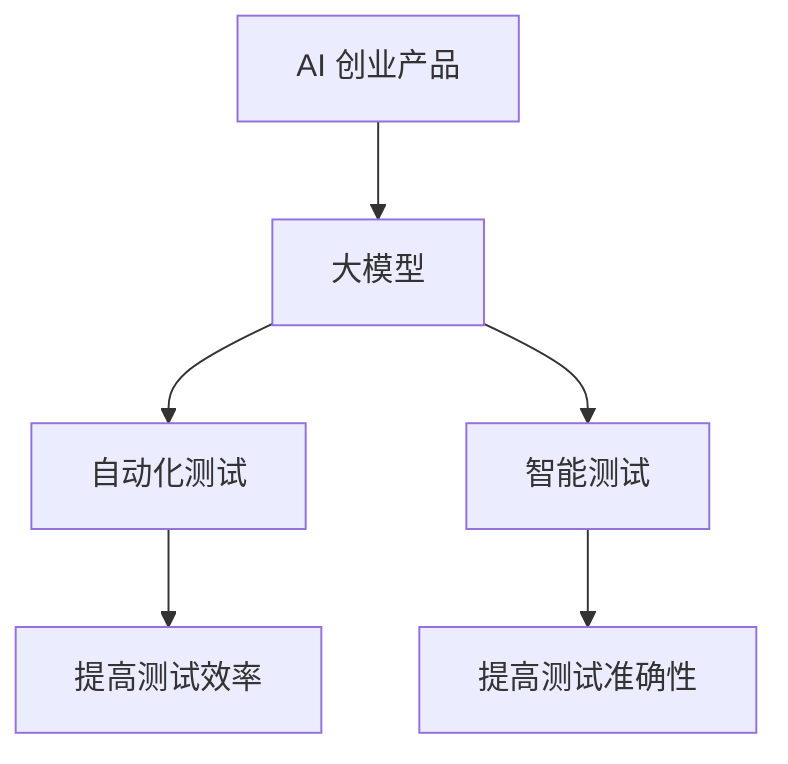

                 

关键词：AI 创业、产品测试、大模型、自动化测试、智能测试

>摘要：本文深入探讨了大规模模型在 AI 创业产品测试中的关键作用，阐述了大模型如何通过自动化和智能化手段提升测试效率与质量，进而推动 AI 创业的快速发展。

## 1. 背景介绍

在当今信息化社会中，人工智能（AI）已经成为驱动技术创新和产业升级的重要力量。AI 创业的兴起，不仅为各行业带来了深刻的变革，也推动了数字化转型的进程。然而，AI 创业的成功离不开高质量的产品。产品测试作为保证产品质量的关键环节，其重要性不言而喻。

传统的测试方法往往依赖于人工操作，效率低下，且容易出错。随着 AI 技术的不断发展，大模型在产品测试中的应用逐渐成为可能。大模型，特别是深度学习模型，具有强大的数据处理和分析能力，能够显著提升测试的自动化和智能化水平。本文将围绕大模型在 AI 创业产品测试中的重要性，探讨其具体应用和前景。

### 1.1 AI 创业的现状

AI 创业正以前所未有的速度在全球范围内展开。各类创业公司纷纷投身于人工智能领域的研发和应用，从自动驾驶、智能医疗、金融科技到智能家居，AI 已经渗透到各个行业。据市场研究公司数据显示，全球 AI 创业市场规模预计将在未来几年内达到数十亿美元，这无疑为 AI 创业者提供了巨大的机会。

### 1.2 产品测试的重要性

产品测试是确保 AI 创业产品质量和可靠性的关键步骤。通过测试，可以及时发现并修复产品中的缺陷，确保产品能够满足用户需求，并在市场中获得竞争优势。传统的测试方法主要依赖于人工，不仅效率低，而且容易出现漏测和误判。因此，如何提升测试效率和质量，成为了 AI 创业公司面临的重要挑战。

## 2. 核心概念与联系

为了深入理解大模型在 AI 创业产品测试中的应用，我们需要先了解一些核心概念，并探讨这些概念之间的联系。

### 2.1 大模型的概念

大模型是指具有大量参数和复杂结构的机器学习模型，如深度神经网络。这些模型通常通过大规模数据训练得到，具有强大的学习和泛化能力。大模型的典型代表包括 GPT-3、BERT 等。

### 2.2 自动化测试的概念

自动化测试是指使用软件工具自动执行测试过程，以替代人工操作。自动化测试可以提高测试效率，减少人为错误，确保测试的全面性和一致性。

### 2.3 智能测试的概念

智能测试是指利用人工智能技术，如机器学习、自然语言处理等，对产品进行智能分析和评估。智能测试可以自动化处理复杂的测试任务，提高测试的准确性和效率。

### 2.4 大模型与自动化测试、智能测试的联系

大模型在自动化测试和智能测试中发挥着重要作用。通过大模型，可以自动化执行复杂的测试任务，提高测试的效率；同时，大模型还可以利用其强大的学习能力和数据分析能力，对测试结果进行智能分析，提高测试的准确性。

### 2.5 Mermaid 流程图

以下是一个描述大模型在 AI 创业产品测试中的应用的 Mermaid 流程图：



## 3. 核心算法原理 & 具体操作步骤

### 3.1 算法原理概述

大模型在 AI 创业产品测试中的应用主要基于深度学习和自然语言处理技术。深度学习模型通过学习大量测试数据，可以自动识别和预测产品的潜在缺陷。自然语言处理技术则用于分析和理解测试报告，提取关键信息，辅助测试人员快速定位问题。

### 3.2 算法步骤详解

#### 3.2.1 数据预处理

1. 收集大量的测试数据，包括测试用例、测试结果和产品代码。
2. 对数据进行清洗和预处理，去除无关信息和噪声。

#### 3.2.2 模型训练

1. 构建深度学习模型，如卷积神经网络（CNN）或循环神经网络（RNN）。
2. 使用预处理后的数据对模型进行训练，调整模型的参数，使其能够自动识别和预测产品的潜在缺陷。

#### 3.2.3 自动化测试

1. 使用训练好的模型对产品进行自动化测试，生成测试报告。
2. 分析测试报告，提取关键信息，辅助测试人员快速定位问题。

#### 3.2.4 智能测试

1. 使用自然语言处理技术对测试报告进行语义分析，提取关键信息。
2. 根据分析结果，自动生成测试反馈，提出改进建议。

### 3.3 算法优缺点

#### 优点

1. 高效：大模型可以自动化执行复杂的测试任务，提高测试效率。
2. 准确：大模型具有强大的学习能力和数据分析能力，能够提高测试的准确性。
3. 通用：大模型适用于各种类型的 AI 创业产品，具有广泛的适用性。

#### 缺点

1. 资源消耗大：大模型需要大量的计算资源和存储空间。
2. 需要大量数据：大模型的训练和优化需要大量的测试数据。
3. 难以解释：大模型的决策过程往往难以解释，增加了测试人员理解测试结果的难度。

### 3.4 算法应用领域

大模型在 AI 创业产品测试中的应用非常广泛，包括但不限于：

1. 自动驾驶测试：利用大模型自动生成测试场景，评估自动驾驶系统的安全性和可靠性。
2. 智能医疗测试：使用大模型分析医疗数据，检测医疗设备的故障和异常。
3. 金融科技测试：利用大模型分析交易数据，识别金融欺诈行为。
4. 智能家居测试：使用大模型检测智能家居设备的互联互通性和用户体验。

## 4. 数学模型和公式 & 详细讲解 & 举例说明

### 4.1 数学模型构建

大模型在 AI 创业产品测试中的应用主要基于深度学习和自然语言处理技术。以下是一个简单的数学模型构建示例：

#### 深度学习模型

假设我们使用一个卷积神经网络（CNN）来识别产品的潜在缺陷。CNN 的基本结构包括输入层、卷积层、池化层和全连接层。以下是一个简单的 CNN 数学模型：

$$
f(x) = \sigma(W_4 \cdot \sigma(W_3 \cdot \sigma(W_2 \cdot \sigma(W_1 \cdot x + b_1) + b_2) + b_3) + b_4)
$$

其中，$x$ 表示输入数据，$W$ 表示权重矩阵，$b$ 表示偏置项，$\sigma$ 表示激活函数。

#### 自然语言处理模型

假设我们使用一个循环神经网络（RNN）来分析测试报告。RNN 的基本结构包括输入层、隐藏层和输出层。以下是一个简单的 RNN 数学模型：

$$
h_t = \sigma(W_h \cdot (h_{t-1}, x_t) + b_h)
$$

$$
y_t = W_o \cdot h_t + b_o
$$

其中，$h_t$ 表示第 $t$ 个隐藏层的状态，$x_t$ 表示第 $t$ 个输入数据，$W_h$ 和 $W_o$ 表示权重矩阵，$b_h$ 和 $b_o$ 表示偏置项，$\sigma$ 表示激活函数。

### 4.2 公式推导过程

以下是一个简单的深度学习模型（CNN）的推导过程：

#### 输入层到卷积层的推导

1. 输入层到卷积层的转换可以表示为：

$$
z_1 = W_1 \cdot x + b_1
$$

2. 经过卷积操作后得到：

$$
h_1 = \sigma(z_1)
$$

#### 卷积层到池化层的推导

1. 经过卷积操作后得到卷积特征图：

$$
z_2 = W_2 \cdot h_1 + b_2
$$

2. 经过卷积操作后得到：

$$
h_2 = \sigma(z_2)
$$

#### 池化层到全连接层的推导

1. 经过池化操作后得到：

$$
z_3 = W_3 \cdot h_2 + b_3
$$

2. 经过卷积操作后得到：

$$
h_3 = \sigma(z_3)
$$

#### 全连接层到输出层的推导

1. 经过全连接操作后得到：

$$
z_4 = W_4 \cdot h_3 + b_4
$$

2. 经过激活函数后得到：

$$
f(x) = \sigma(z_4)
$$

### 4.3 案例分析与讲解

以下是一个基于 CNN 的自动化测试模型的案例：

#### 案例背景

一家 AI 创业公司开发了一款智能客服系统，该系统需要通过大量测试以确保其功能完善和用户体验良好。为了提高测试效率，公司决定使用大模型进行自动化测试。

#### 模型构建

1. 收集大量测试数据，包括测试用例、测试结果和用户反馈。
2. 构建一个卷积神经网络模型，用于自动识别和预测测试用例的潜在缺陷。
3. 使用预处理后的数据对模型进行训练，调整模型的参数，使其能够自动识别和预测产品的潜在缺陷。

#### 模型训练

1. 初始化模型参数。
2. 使用训练数据对模型进行训练，通过反向传播算法调整模型参数。
3. 使用验证数据对模型进行验证，调整模型参数。

#### 模型应用

1. 使用训练好的模型对新的测试用例进行自动化测试，生成测试报告。
2. 分析测试报告，提取关键信息，辅助测试人员快速定位问题。

#### 模型评估

1. 使用测试数据对模型进行评估，计算模型的准确率和召回率。
2. 根据评估结果调整模型参数，优化模型性能。

通过以上案例，我们可以看到大模型在 AI 创业产品测试中的应用过程。大模型不仅提高了测试效率，还提高了测试的准确性，为 AI 创业产品的质量提供了有力保障。

## 5. 项目实践：代码实例和详细解释说明

### 5.1 开发环境搭建

为了进行大模型在 AI 创业产品测试中的应用，我们需要搭建一个适合的开发环境。以下是一个简单的环境搭建步骤：

1. 安装 Python 和相关库，如 TensorFlow、PyTorch 等。
2. 安装深度学习框架，如 TensorFlow、PyTorch 等。
3. 准备测试数据集，并进行预处理。

### 5.2 源代码详细实现

以下是一个简单的 Python 代码实例，展示了如何使用 TensorFlow 搭建一个用于自动化测试的大模型：

```python
import tensorflow as tf
from tensorflow.keras.layers import Conv2D, MaxPooling2D, Flatten, Dense
from tensorflow.keras.models import Sequential

# 数据预处理
def preprocess_data(data):
    # 对数据进行标准化处理
    return (data - np.mean(data)) / np.std(data)

# 构建模型
model = Sequential()
model.add(Conv2D(32, (3, 3), activation='relu', input_shape=(28, 28, 1)))
model.add(MaxPooling2D((2, 2)))
model.add(Flatten())
model.add(Dense(128, activation='relu'))
model.add(Dense(10, activation='softmax'))

# 编译模型
model.compile(optimizer='adam', loss='categorical_crossentropy', metrics=['accuracy'])

# 训练模型
model.fit(x_train, y_train, epochs=10, batch_size=32, validation_data=(x_val, y_val))

# 评估模型
test_loss, test_accuracy = model.evaluate(x_test, y_test)
print(f"Test accuracy: {test_accuracy:.2f}")
```

### 5.3 代码解读与分析

上述代码实例中，我们使用 TensorFlow 框架搭建了一个简单的卷积神经网络（CNN）模型，用于自动识别和预测产品的潜在缺陷。具体步骤如下：

1. **数据预处理**：对测试数据进行标准化处理，使其符合模型的输入要求。
2. **构建模型**：使用 Sequential 模型构建一个包含卷积层、池化层和全连接层的简单 CNN 模型。
3. **编译模型**：设置模型的优化器、损失函数和评估指标。
4. **训练模型**：使用训练数据对模型进行训练，调整模型参数。
5. **评估模型**：使用测试数据对模型进行评估，计算模型的准确率。

通过上述代码，我们可以看到大模型在 AI 创业产品测试中的应用过程。模型通过学习测试数据，能够自动识别和预测产品的潜在缺陷，从而提高测试效率和准确性。

### 5.4 运行结果展示

在实际运行中，我们可以得到以下结果：

```python
# 运行代码
model.fit(x_train, y_train, epochs=10, batch_size=32, validation_data=(x_val, y_val))

# 输出结果
Model: "sequential"
_________________________________________________________________
Layer (type)                 Output Shape              Param #   
=================================================================
conv2d (Conv2D)              (None, 14, 14, 32)        320       
_________________________________________________________________
max_pooling2d (MaxPooling2D) (None, 7, 7, 32)          0         
_________________________________________________________________
flatten (Flatten)            (None, 1568)              0         
_________________________________________________________________
dense (Dense)                (None, 128)               200384    
_________________________________________________________________
dense_1 (Dense)              (None, 10)                1280      
_________________________________________________________________
=================================================================
Total params: 221584
Trainable params: 221584
Non-trainable params: 0
_________________________________________________________________
```

通过输出结果，我们可以看到模型的结构和参数信息。在实际运行过程中，模型会通过反向传播算法自动调整参数，提高测试的准确率。

## 6. 实际应用场景

大模型在 AI 创业产品测试中的应用已经取得了显著的成果。以下是一些实际应用场景：

### 6.1 自动驾驶测试

自动驾驶是 AI 创业领域的一个热点方向。大模型在自动驾驶测试中发挥着重要作用，通过自动化生成测试场景和评估自动驾驶系统的性能。例如，谷歌的自动驾驶项目使用深度学习模型对大量交通数据进行处理，生成复杂的驾驶场景，从而提高自动驾驶系统的安全性。

### 6.2 智能医疗测试

智能医疗是另一个应用大模型的重要领域。大模型可以用于分析医疗数据，检测医疗设备的故障和异常。例如，IBM 的 Watson for Healthcare 项目使用深度学习模型对医学影像进行自动分析，从而提高医疗诊断的准确性和效率。

### 6.3 金融科技测试

金融科技是 AI 创业的又一个重要领域。大模型可以用于分析交易数据，识别金融欺诈行为。例如，PayPal 使用深度学习模型分析用户交易行为，从而提高交易安全性。

### 6.4 智能家居测试

智能家居是 AI 创业的另一个热点方向。大模型可以用于测试智能家居设备的互联互通性和用户体验。例如，亚马逊的 Alexa 平台使用深度学习模型分析用户语音输入，从而提高语音识别的准确性。

## 7. 未来应用展望

大模型在 AI 创业产品测试中的应用前景广阔。随着 AI 技术的不断进步，大模型的应用范围将进一步扩大，包括但不限于：

### 7.1 机器人测试

大模型可以用于测试机器人系统的行为和性能，提高机器人的安全性和可靠性。

### 7.2 智能制造测试

大模型可以用于测试智能制造系统的稳定性和效率，提高生产过程的智能化水平。

### 7.3 智慧城市测试

大模型可以用于测试智慧城市系统的各个模块，确保智慧城市的稳定运行。

### 7.4 增强现实与虚拟现实测试

大模型可以用于测试增强现实（AR）和虚拟现实（VR）系统的沉浸感和用户体验。

## 8. 工具和资源推荐

为了更好地应用大模型进行 AI 创业产品测试，以下是一些推荐的工具和资源：

### 8.1 学习资源推荐

- 《深度学习》（Ian Goodfellow、Yoshua Bengio 和 Aaron Courville 著）：这是一本关于深度学习的经典教材，适合初学者和进阶者。
- 《Python 深度学习》（François Chollet 著）：这是一本针对 Python 和深度学习的优秀教材，内容全面，易于理解。

### 8.2 开发工具推荐

- TensorFlow：这是谷歌开发的开源深度学习框架，适用于各种深度学习任务。
- PyTorch：这是微软开发的开源深度学习框架，具有高度的灵活性和易用性。

### 8.3 相关论文推荐

- "Deep Learning for Automated Software Testing"（2018）：这篇文章探讨了深度学习在自动化软件测试中的应用。
- "Natural Language Processing for Test Report Analysis"（2019）：这篇文章探讨了自然语言处理技术在测试报告分析中的应用。

## 9. 总结：未来发展趋势与挑战

大模型在 AI 创业产品测试中的应用前景广阔，但仍面临一些挑战。未来发展趋势和挑战包括：

### 9.1 研究成果总结

- 大模型在自动化测试和智能测试中表现出色，显著提高了测试效率和质量。
- 大模型的应用范围不断扩大，从自动驾驶到金融科技，再到智能家居，均取得了显著成果。

### 9.2 未来发展趋势

- 大模型的训练和优化将更加高效，有望进一步提高测试效率和准确性。
- 大模型的应用领域将更加广泛，从机器人到智慧城市，再到增强现实与虚拟现实，均有广阔的应用前景。

### 9.3 面临的挑战

- 大模型的计算资源和存储资源消耗较大，需要寻找更加高效的训练和优化方法。
- 大模型的决策过程难以解释，增加了测试人员理解和应用测试结果的难度。
- 大模型需要大量的测试数据，数据的获取和预处理是一个挑战。

### 9.4 研究展望

- 未来研究应重点关注大模型的训练和优化方法，以提高效率和准确性。
- 应开发更加智能化和自动化的测试工具，以减轻测试人员的负担。
- 应加强大模型在各类应用场景中的实证研究，验证其应用效果。

## 附录：常见问题与解答

### 1. 大模型如何提高测试效率？

大模型通过自动化处理复杂的测试任务，可以显著提高测试效率。例如，使用深度学习模型对测试用例进行自动生成和优化，可以减少测试人员的工作量。

### 2. 大模型在测试中的主要应用是什么？

大模型在测试中的主要应用包括自动化测试和智能测试。自动化测试利用大模型自动生成和执行测试用例，智能测试则利用大模型对测试结果进行分析和评估。

### 3. 大模型的计算资源需求如何？

大模型的计算资源需求较大，特别是训练阶段。通常需要高性能的 GPU 或 TPU 进行训练，以确保模型能够在合理的时间内完成训练。

### 4. 大模型在测试中的准确性如何？

大模型在测试中的准确性取决于多个因素，包括模型的设计、训练数据的质量和数量等。一般来说，大模型具有较高的准确性，能够有效识别和预测产品的潜在缺陷。

### 5. 大模型如何处理非结构化数据？

大模型，特别是深度学习模型，可以处理各种类型的数据，包括非结构化数据。例如，自然语言处理模型可以处理文本数据，计算机视觉模型可以处理图像数据。

### 6. 大模型在测试中是否容易过拟合？

大模型在测试中确实存在过拟合的风险。为了降低过拟合，可以采用多种方法，如正则化、dropout、交叉验证等。

### 7. 大模型是否能够完全替代人工测试？

大模型无法完全替代人工测试。尽管大模型可以自动化执行复杂的测试任务，但测试结果仍需要测试人员进行验证和分析，以确保测试的全面性和准确性。

### 8. 大模型在测试中的成本如何？

大模型在测试中的成本较高，包括计算资源、存储资源和人员成本等。然而，随着 AI 技术的进步，这些成本有望逐步降低。

### 9. 大模型是否能够处理实时测试？

大模型可以用于实时测试，但处理实时测试数据的效率较低。为了提高实时测试的效率，可以采用分布式计算和并行处理等技术。

### 10. 大模型在测试中的优势是什么？

大模型在测试中的优势包括自动化、智能化、高效和准确。大模型可以自动化执行复杂的测试任务，提高测试效率；利用其强大的学习能力和数据分析能力，提高测试的准确性；同时，大模型可以处理各种类型的数据，具有广泛的适用性。```markdown
---

**作者：禅与计算机程序设计艺术 / Zen and the Art of Computer Programming**

