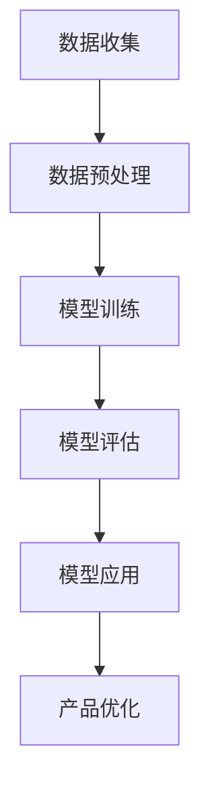

                 

关键词：AI 大模型、创业产品规划、路线图、技术语言、深度思考

> 摘要：本文旨在探讨大模型在 AI 创业产品路线图规划中的应用，通过对大模型的算法原理、数学模型和项目实践的详细解析，分析其在创业领域中的实际应用场景，以及未来的发展趋势与挑战。

## 1. 背景介绍

随着人工智能技术的飞速发展，大模型（Large Models）在计算机视觉、自然语言处理、推荐系统等领域取得了显著的成果。大模型通过海量数据训练，拥有极高的表示能力和泛化能力，能够处理复杂任务，为 AI 创业的创新提供了强大支持。创业产品规划作为企业发展的关键环节，需要准确把握市场需求、技术趋势和团队资源，而大模型的应用为这一过程提供了新的思路和方法。

本文将从以下四个方面探讨大模型在 AI 创业产品路线图规划中的应用：

1. 核心概念与联系
2. 核心算法原理 & 具体操作步骤
3. 数学模型和公式 & 详细讲解 & 举例说明
4. 项目实践：代码实例和详细解释说明

## 2. 核心概念与联系

### 2.1 大模型的概念

大模型（Large Models）是指参数量达到千亿级别以上的神经网络模型，如 GPT-3、BERT 等。这些模型通过海量数据训练，能够捕捉到数据中的复杂模式和规律，从而实现高精度的预测和生成。

### 2.2 大模型与创业产品规划的联系

大模型在 AI 创业产品规划中的应用主要体现在以下几个方面：

1. **需求分析**：通过分析用户数据，大模型可以挖掘出用户需求，为产品定位提供依据。
2. **功能实现**：大模型可以用于实现产品的核心功能，如自然语言处理、计算机视觉等。
3. **数据分析**：大模型能够处理海量数据，为创业公司提供数据洞察，帮助产品优化。

### 2.3 大模型架构的 Mermaid 流程图



## 3. 核心算法原理 & 具体操作步骤

### 3.1 算法原理概述

大模型的算法原理主要基于深度学习（Deep Learning）和神经网络（Neural Networks）。深度学习通过多层神经网络模型对数据进行建模，能够自动提取数据中的特征。神经网络由大量神经元组成，每个神经元都与其它神经元相连，并通过权重进行信息传递。

### 3.2 算法步骤详解

1. **数据收集**：收集大量相关数据，如用户数据、市场数据、竞品数据等。
2. **数据预处理**：对数据进行清洗、归一化等处理，使其适合输入到神经网络中。
3. **模型训练**：使用预处理后的数据训练神经网络模型，优化模型的参数。
4. **模型评估**：使用验证集或测试集对模型进行评估，确保模型达到预期效果。
5. **模型应用**：将训练好的模型应用于创业产品的实际场景中。
6. **产品优化**：根据模型应用的效果，对产品进行持续优化。

### 3.3 算法优缺点

**优点**：

1. **高精度预测**：大模型通过海量数据训练，能够实现高精度的预测和生成。
2. **自动特征提取**：大模型能够自动提取数据中的特征，减轻了人工特征提取的负担。
3. **泛化能力强**：大模型能够处理不同领域的数据，具有较强的泛化能力。

**缺点**：

1. **计算资源需求大**：大模型训练过程需要大量计算资源，对硬件设备要求较高。
2. **数据隐私问题**：大模型在训练过程中需要大量用户数据，可能涉及数据隐私问题。

### 3.4 算法应用领域

大模型在以下领域有广泛的应用：

1. **自然语言处理**：如文本分类、机器翻译、问答系统等。
2. **计算机视觉**：如图像识别、目标检测、图像生成等。
3. **推荐系统**：如商品推荐、新闻推荐、音乐推荐等。
4. **语音识别**：如语音识别、语音合成等。

## 4. 数学模型和公式 & 详细讲解 & 举例说明

### 4.1 数学模型构建

大模型的数学模型主要基于深度学习中的多层感知机（MLP）和卷积神经网络（CNN）。

### 4.2 公式推导过程

1. **MLP 模型**：

   输入数据 $X$ 通过多层神经元传递，得到输出 $Y$：

   $$ Y = f(W_{L} \cdot a_{L-1} + b_{L}) $$

   其中，$f$ 为激活函数，$W_{L}$ 和 $b_{L}$ 分别为权重和偏置。

2. **CNN 模型**：

   输入数据 $X$ 通过卷积层、池化层等处理，得到输出 $Y$：

   $$ Y = f(s(W \cdot X + b)) $$

   其中，$s$ 为卷积操作，$f$ 为激活函数，$W$ 和 $b$ 分别为权重和偏置。

### 4.3 案例分析与讲解

以自然语言处理中的文本分类任务为例，使用 BERT 模型进行建模。

1. **数据预处理**：

   $$ X = [w_1, w_2, \ldots, w_n] $$

   其中，$w_i$ 为单词 $i$ 的词向量。

2. **模型训练**：

   使用训练数据集对 BERT 模型进行训练，优化模型参数。

3. **模型评估**：

   使用验证集或测试集对模型进行评估，计算准确率、召回率等指标。

4. **模型应用**：

   将训练好的 BERT 模型应用于实际文本分类任务中，如新闻分类、情感分析等。

## 5. 项目实践：代码实例和详细解释说明

### 5.1 开发环境搭建

1. 安装 Python 环境（如 Python 3.8）。
2. 安装深度学习框架（如 PyTorch、TensorFlow）。
3. 安装文本处理库（如 NLTK、spaCy）。

### 5.2 源代码详细实现

1. **数据预处理**：

   ```python
   import torch
   from torchtext.data import Field, TabularDataset

   TEXT = Field(tokenize='spacy', lower=True)
   LABEL = Field(sequential=False)

   train_data, test_data = TabularDataset.splits(
       path='data',
       train='train.txt',
       test='test.txt',
       format='csv',
       fields=[('text', TEXT), ('label', LABEL)]
   )

   TEXT.build_vocab(train_data, min_freq=2)
   LABEL.build_vocab(train_data)
   ```

2. **模型训练**：

   ```python
   import torch.optim as optim
   from transformers import BertModel
   from torch.utils.data import DataLoader

   model = BertModel.from_pretrained('bert-base-uncased')
   optimizer = optim.Adam(model.parameters(), lr=1e-5)

   train_loader = DataLoader(train_data, batch_size=32, shuffle=True)
   for epoch in range(3):
       for batch in train_loader:
           optimizer.zero_grad()
           inputs = {'input_ids': batch.text, 'attention_mask': batch.text_mask}
           outputs = model(**inputs)
           loss = outputs.loss
           loss.backward()
           optimizer.step()
   ```

3. **模型评估**：

   ```python
   from sklearn.metrics import accuracy_score, recall_score

   test_loader = DataLoader(test_data, batch_size=32)
   with torch.no_grad():
       for batch in test_loader:
           inputs = {'input_ids': batch.text, 'attention_mask': batch.text_mask}
           outputs = model(**inputs)
           predictions = outputs.logits.argmax(dim=1)
           true_labels = batch.label
   accuracy = accuracy_score(true_labels, predictions)
   recall = recall_score(true_labels, predictions, average='weighted')
   print('Accuracy:', accuracy)
   print('Recall:', recall)
   ```

4. **模型应用**：

   ```python
   new_text = 'This is a new text for classification.'
   new_text_encoded = TEXT.encode(new_text)
   new_text_mask = TEXT.encode(new_text).mask
   inputs = {'input_ids': new_text_encoded, 'attention_mask': new_text_mask}
   with torch.no_grad():
       outputs = model(**inputs)
       predictions = outputs.logits.argmax(dim=1)
   print('Predicted label:', LABEL.vocab.itos[predictions.item()])
   ```

## 6. 实际应用场景

大模型在 AI 创业产品路线图规划中的应用场景广泛，以下为几个实际案例：

1. **金融风控**：利用大模型进行用户行为分析，预测用户的风险等级，为金融机构提供风控建议。
2. **医疗健康**：利用大模型进行医疗图像识别，辅助医生进行疾病诊断，提高诊断准确率。
3. **智能客服**：利用大模型进行自然语言处理，构建智能客服系统，提高客户服务效率。
4. **智能制造**：利用大模型进行设备故障预测，降低设备故障率，提高生产效率。

## 7. 工具和资源推荐

### 7.1 学习资源推荐

1. 《深度学习》（Goodfellow et al.）
2. 《Python 深度学习》（Raschka and Lutz）
3. 《自然语言处理与深度学习》（李航）

### 7.2 开发工具推荐

1. PyTorch
2. TensorFlow
3. JAX

### 7.3 相关论文推荐

1. “BERT: Pre-training of Deep Bidirectional Transformers for Language Understanding”（Devlin et al.）
2. “GPT-3: Language Models are Few-Shot Learners”（Brown et al.）
3. “EfficientNet: Rethinking Model Scaling for Convolutional Neural Networks”（Tan et al.）

## 8. 总结：未来发展趋势与挑战

大模型在 AI 创业产品路线图规划中的应用前景广阔，但仍面临以下挑战：

1. **计算资源需求**：大模型训练过程需要大量计算资源，对硬件设备要求较高。
2. **数据隐私问题**：大模型在训练过程中需要大量用户数据，可能涉及数据隐私问题。
3. **模型解释性**：大模型模型解释性较差，难以理解其内部工作机制。

未来，随着计算资源的提升、数据隐私保护技术的进步以及模型解释性研究的深入，大模型在 AI 创业产品路线图规划中的应用将更加广泛和深入。

## 9. 附录：常见问题与解答

### 9.1 大模型与深度学习的关系是什么？

大模型是深度学习的一种实现形式，通过训练大规模神经网络模型，能够捕捉到数据中的复杂模式和规律，实现高精度的预测和生成。

### 9.2 大模型如何解决计算资源问题？

可以通过分布式训练、模型压缩等技术降低大模型的计算资源需求。此外，随着硬件设备的升级，计算资源将逐渐得到满足。

### 9.3 大模型如何处理数据隐私问题？

可以通过数据加密、差分隐私等技术保护用户数据隐私。在模型训练过程中，应遵循隐私保护原则，确保用户数据的匿名性和安全性。

### 9.4 大模型在创业产品路线图规划中的应用有哪些优势？

大模型在创业产品路线图规划中具有以下优势：

1. **高精度预测**：能够准确预测用户需求，为产品定位提供依据。
2. **自动特征提取**：能够自动提取数据中的特征，减轻人工特征提取的负担。
3. **泛化能力强**：能够处理不同领域的数据，具有较强的泛化能力。
4. **数据驱动**：能够基于海量数据驱动产品优化，提高产品竞争力。

### 9.5 大模型在创业产品路线图规划中的应用有哪些挑战？

大模型在创业产品路线图规划中面临以下挑战：

1. **计算资源需求**：大模型训练过程需要大量计算资源，对硬件设备要求较高。
2. **数据隐私问题**：大模型在训练过程中需要大量用户数据，可能涉及数据隐私问题。
3. **模型解释性**：大模型模型解释性较差，难以理解其内部工作机制。
4. **持续优化**：大模型需要不断更新和优化，以适应市场需求和竞争环境。```markdown


