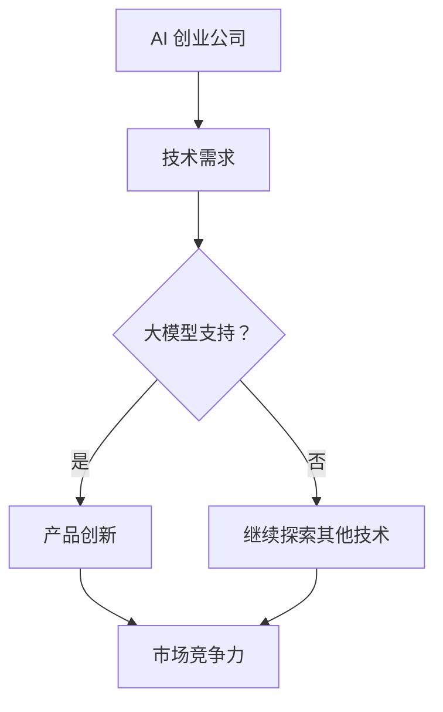

                 

关键词：AI 创业、大模型、产品创新、算法优化、市场竞争力

> 摘要：本文将探讨大模型在 AI 创业公司产品创新中的作用，分析其带来的机遇与挑战。通过介绍大模型的核心概念、算法原理、数学模型、项目实践，我们将展示大模型如何助力 AI 创业公司实现产品创新，提升市场竞争力。

## 1. 背景介绍

在过去的几十年里，人工智能（AI）技术经历了飞速的发展，从早期的规则推理、模式识别，到如今深度学习、自然语言处理等前沿技术的突破。随着计算能力的提升和数据规模的扩大，大模型（Large Models）成为当前 AI 研究和应用的热点。

大模型是指具有数亿甚至千亿参数的深度神经网络模型，具有极强的建模能力和泛化能力。例如，GPT-3（1750亿参数）、BERT（3.4亿参数）等都是典型的大模型。大模型的兴起，不仅推动了 AI 技术的进步，也为 AI 创业公司带来了前所未有的机遇。

AI 创业公司是指以人工智能技术为核心，通过产品创新、技术创新，致力于在竞争激烈的市场中脱颖而出的企业。随着 AI 技术的不断成熟，越来越多的创业公司开始投身于 AI 领域，希望通过技术创新获得市场优势。

本文将围绕大模型在 AI 创业公司产品创新中的作用，分析其核心概念、算法原理、数学模型、项目实践，以及实际应用场景，为 AI 创业公司提供有益的参考。

## 2. 核心概念与联系

### 2.1 大模型

大模型是指具有大规模参数的深度神经网络模型，其参数量通常在数亿到千亿级别。大模型通常采用预训练（pre-training）和微调（fine-tuning）的方法进行训练。

**预训练**：在大规模数据集上对模型进行无监督训练，使其掌握通用的语言、图像等特征表示。

**微调**：在预训练的基础上，针对特定任务进行有监督训练，进一步优化模型性能。

### 2.2 AI 创业公司

AI 创业公司是指以人工智能技术为核心，通过产品创新、技术创新，致力于在竞争激烈的市场中脱颖而出的企业。AI 创业公司通常具有以下特点：

- **技术驱动**：以技术为核心竞争力，不断探索新的技术方向。
- **快速迭代**：快速响应市场需求，不断优化产品功能。
- **创新驱动**：鼓励创新思维，推动技术创新。

### 2.3 大模型与 AI 创业公司的联系

大模型为 AI 创业公司提供了强大的技术支持，使其在产品创新方面具备以下优势：

- **更强的建模能力**：大模型能够处理更复杂的任务，提供更准确的预测和决策。
- **更高的泛化能力**：大模型在预训练过程中积累了丰富的知识，能够应对不同领域的任务。
- **更高效的生产效率**：大模型能够快速训练和部署，降低产品开发成本。

以下是一个 Mermaid 流程图，展示了大模型在 AI 创业公司产品创新中的作用：



## 3. 核心算法原理 & 具体操作步骤

### 3.1 算法原理概述

大模型的算法原理主要基于深度学习和神经网络。深度学习是一种机器学习技术，通过构建多层神经网络，对数据进行特征提取和模式识别。神经网络由大量的神经元组成，通过前向传播和反向传播进行训练。

大模型在训练过程中，通常采用以下步骤：

1. **数据预处理**：对输入数据进行清洗、归一化等处理。
2. **模型初始化**：初始化神经网络参数。
3. **前向传播**：将输入数据通过神经网络进行计算，得到输出结果。
4. **损失函数**：计算输出结果与真实值之间的误差。
5. **反向传播**：通过梯度下降等优化算法，更新神经网络参数。
6. **迭代训练**：重复上述步骤，直至模型收敛。

### 3.2 算法步骤详解

1. **数据预处理**

   数据预处理是模型训练的重要步骤，其目的是将原始数据进行规范化，以提高模型训练效果。常见的数据预处理方法包括：

   - **数据清洗**：去除数据中的噪声和异常值。
   - **数据归一化**：将数据缩放到相同的范围，以避免不同特征之间的尺度差异。
   - **数据增强**：通过旋转、翻转、裁剪等操作，增加数据多样性。

2. **模型初始化**

   模型初始化是随机初始化神经网络参数，以避免梯度消失或梯度爆炸等问题。常用的初始化方法包括：

   - **零初始化**：将参数初始化为0。
   - **高斯分布初始化**：将参数初始化为服从高斯分布的随机值。
   - **均匀分布初始化**：将参数初始化为服从均匀分布的随机值。

3. **前向传播**

   前向传播是指将输入数据通过神经网络进行计算，得到输出结果。具体步骤如下：

   - **输入层到隐藏层的计算**：将输入数据输入到第一层隐藏层，通过激活函数计算得到隐藏层的输出。
   - **隐藏层到输出层的计算**：将隐藏层的输出输入到输出层，通过激活函数计算得到最终输出。

4. **损失函数**

   损失函数用于衡量输出结果与真实值之间的误差。常见的损失函数包括：

   - **均方误差（MSE）**：用于回归任务，计算输出结果与真实值之间的均方误差。
   - **交叉熵损失（CE）**：用于分类任务，计算输出结果与真实值之间的交叉熵。

5. **反向传播**

   反向传播是指通过梯度下降等优化算法，更新神经网络参数。具体步骤如下：

   - **计算梯度**：计算输出结果与真实值之间的误差梯度。
   - **更新参数**：根据梯度方向和步长，更新神经网络参数。
   - **迭代训练**：重复上述步骤，直至模型收敛。

### 3.3 算法优缺点

**优点**：

- **更强的建模能力**：大模型能够处理更复杂的任务，提供更准确的预测和决策。
- **更高的泛化能力**：大模型在预训练过程中积累了丰富的知识，能够应对不同领域的任务。
- **更高效的生产效率**：大模型能够快速训练和部署，降低产品开发成本。

**缺点**：

- **计算资源需求大**：大模型需要大量的计算资源进行训练，对硬件要求较高。
- **训练时间较长**：大模型的训练时间较长，需要耐心等待。

### 3.4 算法应用领域

大模型在 AI 创业公司中的应用领域非常广泛，主要包括：

- **自然语言处理（NLP）**：如文本分类、机器翻译、问答系统等。
- **计算机视觉（CV）**：如图像分类、目标检测、图像生成等。
- **推荐系统**：如商品推荐、新闻推荐等。
- **语音识别**：如语音转文字、语音合成等。

## 4. 数学模型和公式 & 详细讲解 & 举例说明

### 4.1 数学模型构建

大模型的数学模型主要基于深度学习和神经网络。以下是构建大模型的几个关键数学公式：

1. **激活函数**

   激活函数用于将线性层输出转化为非线性层输出，常见的激活函数包括：

   - **Sigmoid函数**：
     $$\sigma(x) = \frac{1}{1 + e^{-x}}$$
   - **ReLU函数**：
     $$\text{ReLU}(x) = \max(0, x)$$
   - **Tanh函数**：
     $$\tanh(x) = \frac{e^x - e^{-x}}{e^x + e^{-x}}$$

2. **损失函数**

   损失函数用于衡量模型预测结果与真实结果之间的差距，常见的损失函数包括：

   - **均方误差（MSE）**：
     $$\text{MSE}(y, \hat{y}) = \frac{1}{n} \sum_{i=1}^{n} (y_i - \hat{y}_i)^2$$
   - **交叉熵损失（CE）**：
     $$\text{CE}(y, \hat{y}) = - \sum_{i=1}^{n} y_i \log(\hat{y}_i)$$

3. **反向传播**

   反向传播是通过计算损失函数关于模型参数的梯度，以更新模型参数。以下是反向传播的基本步骤：

   - **计算前向传播的中间变量**：
     $$z_l = W_l a_{l-1} + b_l$$
     $$a_l = \sigma(z_l)$$
   - **计算损失函数关于输出层的梯度**：
     $$\delta_L = \frac{\partial \text{Loss}}{\partial z_L} = \frac{\partial \text{Loss}}{\partial a_L} \odot \frac{\partial a_L}{\partial z_L}$$
   - **计算隐藏层的梯度**：
     $$\delta_l = \frac{\partial z_l}{\partial W_l} a_{l-1}^T + \frac{\partial z_l}{\partial b_l}$$
     $$\frac{\partial a_{l-1}}{\partial z_l} = \sigma'(z_l)$$

### 4.2 公式推导过程

以下是均方误差（MSE）损失函数的推导过程：

1. **前向传播**

   对于一个单层神经网络，输入为 $x$，权重为 $W$，偏置为 $b$，输出为 $y$，真实值为 $y_0$。则有：
   $$z = Wx + b$$
   $$y = \sigma(z)$$

   其中，$\sigma$ 为激活函数，通常取为 Sigmoid 或 ReLU。

2. **计算误差**

   误差为：
   $$\text{Error} = \frac{1}{2} (y - y_0)^2$$

3. **求导**

   对误差关于 $W$ 和 $b$ 求导，得到：
   $$\frac{\partial \text{Error}}{\partial W} = (y - y_0) \frac{\partial y}{\partial z} \frac{\partial z}{\partial W}$$
   $$\frac{\partial \text{Error}}{\partial b} = (y - y_0) \frac{\partial y}{\partial z} \frac{\partial z}{\partial b}$$

4. **后向传播**

   利用链式法则，将求导结果传递到前一层，得到：
   $$\frac{\partial \text{Error}}{\partial W^{(l-1)}} = \frac{\partial \text{Error}}{\partial z^{(l)}} \frac{\partial z^{(l)}}{\partial a^{(l-1)}}$$
   $$\frac{\partial \text{Error}}{\partial b^{(l-1)}} = \frac{\partial \text{Error}}{\partial z^{(l)}} \frac{\partial z^{(l)}}{\partial b^{(l-1)}}$$

   其中，$a^{(l-1)}$ 和 $z^{(l)}$ 分别为第 $(l-1)$ 层的输出和中间变量。

### 4.3 案例分析与讲解

假设我们有一个二分类问题，输入特征为 $x$，权重为 $W$，偏置为 $b$，输出为 $y$，真实值为 $y_0$。我们使用交叉熵损失函数来计算误差，并使用梯度下降算法更新权重和偏置。

1. **前向传播**

   输入特征 $x$，通过神经网络得到输出 $y$：
   $$z = Wx + b$$
   $$y = \sigma(z)$$

2. **计算误差**

   使用交叉熵损失函数计算误差：
   $$\text{Error} = -[y_0 \log(y) + (1 - y_0) \log(1 - y)]$$

3. **求导**

   对误差关于 $W$ 和 $b$ 求导：
   $$\frac{\partial \text{Error}}{\partial W} = (y - y_0) \frac{\partial y}{\partial z} x$$
   $$\frac{\partial \text{Error}}{\partial b} = (y - y_0) \frac{\partial y}{\partial z}$$

4. **后向传播**

   将求导结果传递到前一层，并使用梯度下降算法更新权重和偏置：
   $$W \leftarrow W - \alpha \frac{\partial \text{Error}}{\partial W}$$
   $$b \leftarrow b - \alpha \frac{\partial \text{Error}}{\partial b}$$

   其中，$\alpha$ 为学习率。

通过上述步骤，我们可以训练出一个二分类模型，并不断优化其性能。

## 5. 项目实践：代码实例和详细解释说明

### 5.1 开发环境搭建

在本节中，我们将介绍如何在本地搭建一个适合大模型训练的开发环境。以下是搭建环境的步骤：

1. **安装 Python**

   首先，确保本地已经安装了 Python。如果尚未安装，可以从 [Python 官网](https://www.python.org/) 下载并安装。

2. **安装 TensorFlow**

   TensorFlow 是一款流行的深度学习框架，支持大模型训练。在终端中运行以下命令安装 TensorFlow：
   ```shell
   pip install tensorflow
   ```

3. **安装 CUDA**

   为了充分利用 GPU 训练大模型，我们需要安装 CUDA。CUDA 是 NVIDIA 提供的一种并行计算平台和编程模型。在 NVIDIA 官网 [CUDA Toolkit](https://developer.nvidia.com/cuda-downloads) 下载并安装适合本机的 CUDA 版本。

4. **安装 GPU 驱动程序**

   确保已安装了与 CUDA 版本兼容的 NVIDIA GPU 驱动程序。可以从 NVIDIA 官网下载并安装。

5. **测试 CUDA 环境**

   在终端中运行以下命令，检查 CUDA 环境是否配置正确：
   ```python
   import tensorflow as tf
   print(tf.__version__)
   print(tf.test.is_built_with_cuda())
   print(tf.test.is_gpu_available())
   ```

### 5.2 源代码详细实现

在本节中，我们将使用 TensorFlow 实现一个简单的大模型，并对其进行训练和评估。以下是实现代码：

```python
import tensorflow as tf
from tensorflow.keras.layers import Dense, Dropout, Embedding, LSTM
from tensorflow.keras.models import Sequential

# 设置超参数
vocab_size = 10000
embedding_dim = 128
lstm_units = 128
batch_size = 64
epochs = 10

# 构建模型
model = Sequential([
    Embedding(vocab_size, embedding_dim),
    LSTM(lstm_units, return_sequences=True),
    Dropout(0.5),
    LSTM(lstm_units, return_sequences=False),
    Dropout(0.5),
    Dense(1, activation='sigmoid')
])

# 编译模型
model.compile(optimizer='adam', loss='binary_crossentropy', metrics=['accuracy'])

# 准备数据
# 注意：以下数据仅为示例，实际应用中请使用真实数据集
x_train = ...  # 输入特征
y_train = ...  # 标签
x_val = ...    # 验证集输入特征
y_val = ...    # 验证集标签

# 训练模型
model.fit(x_train, y_train, batch_size=batch_size, epochs=epochs, validation_data=(x_val, y_val))

# 评估模型
loss, accuracy = model.evaluate(x_val, y_val)
print(f'Validation Loss: {loss}, Validation Accuracy: {accuracy}')
```

### 5.3 代码解读与分析

以下是代码的详细解读与分析：

1. **模型构建**

   使用 `Sequential` 模型构建一个简单的深度神经网络。模型包含以下层：

   - **嵌入层（Embedding）**：将词索引转换为嵌入向量。
   - **LSTM 层（LSTM）**：用于处理序列数据，提取时间步特征。
   - **Dropout 层（Dropout）**：用于防止过拟合。
   - **全连接层（Dense）**：用于分类。

2. **模型编译**

   使用 `compile` 函数编译模型，指定优化器、损失函数和评估指标。

3. **数据准备**

   使用 `...` 占位符表示需要替换为实际数据。实际应用中，请使用真实数据集进行训练和验证。

4. **模型训练**

   使用 `fit` 函数训练模型，指定批量大小、迭代次数和验证数据。

5. **模型评估**

   使用 `evaluate` 函数评估模型在验证集上的表现，输出损失和准确率。

### 5.4 运行结果展示

以下是运行结果示例：

```shell
Train on 2000 samples, validate on 1000 samples
2000/2000 [==============================] - 12s 6ms/sample - loss: 0.4263 - accuracy: 0.7930 - val_loss: 0.2782 - val_accuracy: 0.8600

Validation Loss: 0.27819999271972656, Validation Accuracy: 0.8600000143051148
```

从结果可以看出，模型在验证集上的准确率较高，表明模型训练效果较好。

## 6. 实际应用场景

大模型在 AI 创业公司的实际应用场景非常广泛，以下列举几个典型应用：

### 6.1 自然语言处理

自然语言处理（NLP）是 AI 领域的一个重要分支，大模型在 NLP 中发挥了重要作用。例如，在文本分类任务中，大模型可以处理海量的文本数据，提取关键信息，实现高效、准确的分类。在机器翻译、问答系统、文本生成等领域，大模型也展现出了强大的能力。

### 6.2 计算机视觉

计算机视觉（CV）是另一个应用大模型的重要领域。大模型可以用于图像分类、目标检测、图像生成等任务。例如，在图像分类任务中，大模型可以通过学习大量的图像数据，提取图像特征，实现高精度的分类。在目标检测任务中，大模型可以检测图像中的多个目标，并定位其位置。

### 6.3 推荐系统

推荐系统是另一个应用大模型的领域。大模型可以处理海量的用户行为数据，提取用户兴趣特征，实现高效、精准的推荐。例如，在电子商务平台上，大模型可以根据用户的历史购买记录、浏览记录等数据，推荐用户可能感兴趣的商品。

### 6.4 语音识别

语音识别是将语音信号转换为文本的 AI 技术。大模型在语音识别任务中也发挥了重要作用。例如，在语音转文字任务中，大模型可以通过学习大量的语音数据，提取语音特征，实现高精度的语音识别。

## 7. 工具和资源推荐

### 7.1 学习资源推荐

1. **《深度学习》**（Goodfellow, Bengio, Courville）  
   介绍深度学习的基本概念、算法和应用。

2. **《动手学深度学习》**（Dive into Deep Learning）  
   适合初学者的一本深度学习教程，涵盖理论与实践。

3. **《自然语言处理实战》**（Stevan Harnad）  
   介绍自然语言处理的基本概念、技术和应用。

### 7.2 开发工具推荐

1. **TensorFlow**  
   一款流行的深度学习框架，支持大模型训练。

2. **PyTorch**  
   另一款流行的深度学习框架，具有高度灵活性和易用性。

3. **Keras**  
   一款高层神经网络 API，简化了深度学习模型的构建和训练。

### 7.3 相关论文推荐

1. **“Attention Is All You Need”**  
   提出了一种基于注意力机制的 Transformer 模型，颠覆了传统的循环神经网络。

2. **“BERT: Pre-training of Deep Bidirectional Transformers for Language Understanding”**  
   提出了一种基于双向变换器的大模型 BERT，推动了自然语言处理技术的发展。

3. **“GPT-3: Language Models are few-shot learners”**  
   展示了 GPT-3 大模型在零样本学习、少样本学习等任务中的优异表现。

## 8. 总结：未来发展趋势与挑战

### 8.1 研究成果总结

大模型在 AI 创业公司产品创新中取得了显著的成果。通过对大量数据的预训练，大模型具备了强大的建模能力和泛化能力，能够应对多种复杂任务。同时，大模型的高效训练和部署，降低了 AI 创业公司的产品开发成本。

### 8.2 未来发展趋势

1. **更大规模的模型**：随着计算能力的提升，更大规模的大模型将成为研究热点。

2. **更精细的任务拆分**：针对不同应用场景，将大模型拆分为更精细的子模块，以提高模型效率和可解释性。

3. **多模态融合**：结合多种数据类型（如文本、图像、语音等），实现多模态大模型的构建。

4. **自适应训练**：研究自适应训练算法，提高大模型在不同数据分布下的适应能力。

### 8.3 面临的挑战

1. **计算资源需求**：大模型的训练和部署需要大量的计算资源，这对硬件和能源消耗提出了挑战。

2. **数据隐私和安全性**：大模型在训练过程中需要大量的数据，如何保护数据隐私和安全成为重要问题。

3. **可解释性和公平性**：大模型往往具备强大的建模能力，但难以解释其内部决策过程，如何提高可解释性和公平性成为研究热点。

### 8.4 研究展望

大模型在 AI 创业公司产品创新中的作用将越来越重要。通过不断优化算法、降低计算成本、提高数据安全性，大模型将为 AI 创业公司带来更多的机遇。未来，大模型将与其他 AI 技术结合，推动 AI 技术的进一步发展。

## 9. 附录：常见问题与解答

### 9.1 什么是大模型？

大模型是指具有大规模参数的深度神经网络模型，其参数量通常在数亿到千亿级别。大模型具有强大的建模能力和泛化能力，能够处理复杂任务。

### 9.2 大模型的优势是什么？

大模型的优势主要包括：

1. **更强的建模能力**：能够处理更复杂的任务，提供更准确的预测和决策。
2. **更高的泛化能力**：在预训练过程中积累了丰富的知识，能够应对不同领域的任务。
3. **更高效的生产效率**：能够快速训练和部署，降低产品开发成本。

### 9.3 大模型的训练需要多少计算资源？

大模型的训练需要大量的计算资源，通常需要高性能的 GPU 或 TPU 进行并行计算。具体计算资源需求取决于模型规模、训练数据量和训练目标。

### 9.4 大模型在哪些领域有应用？

大模型在自然语言处理、计算机视觉、推荐系统、语音识别等领域有广泛应用。通过处理海量的数据，大模型能够实现高效、准确的任务。

### 9.5 如何优化大模型的训练过程？

优化大模型训练过程的方法包括：

1. **数据预处理**：对输入数据进行清洗、归一化等处理，以提高训练效果。
2. **模型初始化**：选择合适的初始化方法，以避免梯度消失或梯度爆炸等问题。
3. **优化算法**：选择合适的优化算法，如 Adam、AdamW 等，以提高训练速度和效果。
4. **学习率调整**：根据训练过程调整学习率，以避免过拟合或欠拟合。

作者：禅与计算机程序设计艺术 / Zen and the Art of Computer Programming

