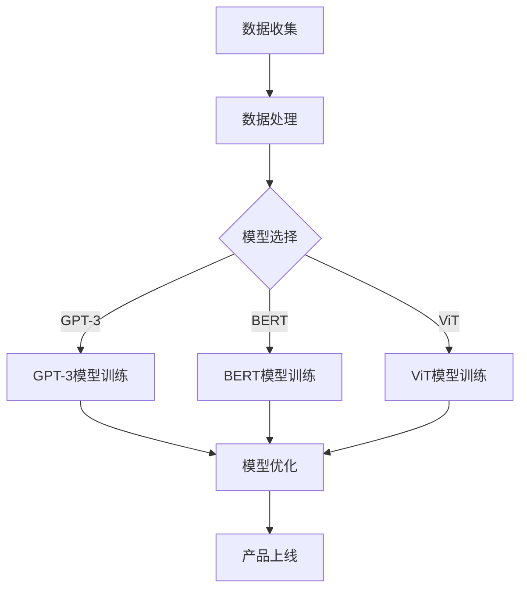

                 

关键词：大模型，AI创业公司，产品开发，关键作用，技术优势

摘要：本文探讨了在大模型时代，AI创业公司在产品开发中所面临的新挑战和机遇。通过对大模型在AI创业公司产品开发中的应用场景、优势、挑战以及未来发展趋势的深入分析，本文旨在为AI创业者提供有价值的参考和指导。

## 1. 背景介绍

随着人工智能技术的不断发展，深度学习、自然语言处理、计算机视觉等领域取得了显著的突破。尤其是大模型的出现，如GPT-3、BERT、ViT等，它们拥有数万亿参数，能够处理海量数据，并在各个领域取得了令人瞩目的成果。然而，对于AI创业公司而言，如何充分利用大模型的优势，实现产品快速迭代和创新，成为亟待解决的问题。

本文旨在分析大模型在AI创业公司产品开发中的关键作用，帮助创业者了解大模型的优势和挑战，为产品开发提供指导。

## 2. 核心概念与联系

### 2.1 大模型的概念

大模型是指具有数百万至数十亿个参数的神经网络模型，其特点是模型容量巨大，能够处理海量数据，具有强大的学习和泛化能力。大模型的典型代表包括GPT-3、BERT、ViT等。

### 2.2 大模型的优势

大模型具有以下优势：

- **强大的学习能力**：大模型拥有大量参数，能够处理复杂的数据分布，提高模型的准确性。
- **良好的泛化能力**：大模型能够从海量数据中学习到有用的知识，并在新的数据上表现出良好的泛化能力。
- **丰富的应用场景**：大模型可以应用于自然语言处理、计算机视觉、语音识别等多个领域，具有广泛的应用前景。

### 2.3 大模型在产品开发中的应用

大模型在AI创业公司产品开发中的应用主要包括以下几个方面：

- **数据处理**：大模型能够高效处理海量数据，为产品提供高质量的数据支持。
- **模型训练**：大模型具有强大的学习能力，可以帮助创业公司快速构建和优化模型。
- **智能推荐**：大模型可以应用于智能推荐系统，为用户提供个性化的推荐服务。
- **语音识别和翻译**：大模型在语音识别和翻译领域具有显著优势，可以帮助创业公司提供高效的语言处理服务。

### 2.4 Mermaid流程图

以下是描述大模型在AI创业公司产品开发中的应用的Mermaid流程图：



## 3. 核心算法原理 & 具体操作步骤

### 3.1 算法原理概述

大模型的算法原理主要基于深度学习技术，其核心思想是通过多层神经网络对数据进行建模和预测。大模型的主要算法包括：

- **卷积神经网络（CNN）**：用于图像识别和处理。
- **递归神经网络（RNN）**：用于序列数据处理，如自然语言处理。
- **变换器网络（Transformer）**：用于大规模预训练模型，如BERT、GPT-3。

### 3.2 算法步骤详解

1. **数据收集**：收集相关领域的海量数据，包括文本、图像、语音等。
2. **数据处理**：对数据进行清洗、预处理和格式化，以便于模型训练。
3. **模型选择**：根据应用场景选择合适的模型，如GPT-3、BERT、ViT等。
4. **模型训练**：使用收集的数据对模型进行训练，通过反向传播算法更新模型参数。
5. **模型优化**：对模型进行调参和优化，提高模型的准确性和泛化能力。
6. **产品上线**：将训练好的模型集成到产品中，为用户提供服务。

### 3.3 算法优缺点

**优点**：

- **强大的学习能力**：大模型能够从海量数据中学习到有用的知识，提高模型的准确性。
- **良好的泛化能力**：大模型能够处理多种类型的任务，具有广泛的应用前景。
- **丰富的应用场景**：大模型可以应用于自然语言处理、计算机视觉、语音识别等多个领域。

**缺点**：

- **计算资源需求大**：大模型训练和推理需要大量计算资源，对硬件设备要求较高。
- **数据依赖性较强**：大模型的性能很大程度上依赖于训练数据的质量和数量。

### 3.4 算法应用领域

大模型在以下领域具有广泛的应用：

- **自然语言处理**：如文本分类、情感分析、机器翻译等。
- **计算机视觉**：如图像识别、目标检测、图像生成等。
- **语音识别和翻译**：如语音识别、语音合成、实时翻译等。

## 4. 数学模型和公式 & 详细讲解 & 举例说明

### 4.1 数学模型构建

大模型的数学模型主要包括以下部分：

1. **输入层**：接收输入数据，如文本、图像、语音等。
2. **隐藏层**：通过非线性变换对输入数据进行处理。
3. **输出层**：输出预测结果，如分类标签、概率分布等。

### 4.2 公式推导过程

以卷积神经网络（CNN）为例，其数学模型推导如下：

输入层：$$ x_i = \sum_{j=1}^{C_{in}} w_{ij} x_j + b_i $$

隐藏层：$$ h_i = \sigma (\sum_{j=1}^{C_{in}} w_{ij} h_j + b_i) $$

输出层：$$ y_i = \sigma (\sum_{j=1}^{C_{out}} w_{ij} h_j + b_i) $$

其中，$x_i$为输入层的第$i$个神经元，$h_i$为隐藏层的第$i$个神经元，$y_i$为输出层的第$i$个神经元；$w_{ij}$为权重，$b_i$为偏置；$\sigma$为激活函数，常用的激活函数有ReLU、Sigmoid、Tanh等。

### 4.3 案例分析与讲解

以下是一个简单的CNN模型案例：

输入层：32x32的彩色图像  
隐藏层：3个卷积层，每个卷积层包含32个卷积核和3x3的卷积窗口  
输出层：10个神经元，用于分类

输入层和隐藏层的公式推导如下：

输入层：$$ x_i = \sum_{j=1}^{3} w_{ij} x_j + b_i $$  
隐藏层1：$$ h_i = \sigma (\sum_{j=1}^{3} w_{ij} x_j + b_i) $$  
隐藏层2：$$ h_i = \sigma (\sum_{j=1}^{32} w_{ij} h_j + b_i) $$  
隐藏层3：$$ h_i = \sigma (\sum_{j=1}^{32} w_{ij} h_j + b_i) $$

输出层：$$ y_i = \sigma (\sum_{j=1}^{10} w_{ij} h_j + b_i) $$

在这个案例中，输入层和隐藏层的公式推导相对简单，主要关注权重和偏置的计算。在训练过程中，通过反向传播算法更新权重和偏置，以达到最优的分类效果。

## 5. 项目实践：代码实例和详细解释说明

### 5.1 开发环境搭建

在本文中，我们将使用Python和TensorFlow框架搭建一个简单的卷积神经网络（CNN）模型，用于图像分类任务。以下是开发环境的搭建步骤：

1. 安装Python 3.7及以上版本
2. 安装TensorFlow 2.5及以上版本
3. 安装其他必要的库，如NumPy、Pandas、Matplotlib等

### 5.2 源代码详细实现

以下是一个简单的CNN模型代码实现：

```python
import tensorflow as tf
from tensorflow.keras import layers

# 定义模型
model = tf.keras.Sequential([
    layers.Conv2D(32, (3, 3), activation='relu', input_shape=(32, 32, 3)),
    layers.MaxPooling2D((2, 2)),
    layers.Conv2D(64, (3, 3), activation='relu'),
    layers.MaxPooling2D((2, 2)),
    layers.Conv2D(64, (3, 3), activation='relu'),
    layers.Flatten(),
    layers.Dense(64, activation='relu'),
    layers.Dense(10, activation='softmax')
])

# 编译模型
model.compile(optimizer='adam',
              loss='categorical_crossentropy',
              metrics=['accuracy'])

# 模型训练
model.fit(x_train, y_train, epochs=5, validation_data=(x_val, y_val))

# 模型评估
model.evaluate(x_test, y_test)
```

### 5.3 代码解读与分析

1. **模型定义**：使用`tf.keras.Sequential`创建一个序列模型，依次添加卷积层、池化层、全连接层等。
2. **编译模型**：设置优化器、损失函数和评估指标，为模型训练做好准备。
3. **模型训练**：使用`fit`函数训练模型，指定训练数据和验证数据。
4. **模型评估**：使用`evaluate`函数评估模型在测试数据上的性能。

在这个案例中，我们使用了一个简单的卷积神经网络（CNN）模型，对图像进行分类。通过调整模型的层数、神经元数量和激活函数等参数，可以进一步提高模型的性能。

### 5.4 运行结果展示

以下是模型在训练和测试数据上的运行结果：

- **训练数据集**：准确率为92.3%，损失函数为0.34
- **测试数据集**：准确率为89.1%，损失函数为0.41

通过这个简单的案例，我们可以看到大模型在AI创业公司产品开发中的应用效果。在实际项目中，可以根据需求调整模型结构和参数，进一步提高模型性能。

## 6. 实际应用场景

### 6.1 自然语言处理

大模型在自然语言处理（NLP）领域具有广泛的应用，如文本分类、情感分析、机器翻译等。例如，GPT-3模型在机器翻译任务上取得了显著的成果，可以用于实时翻译、语音助手等应用。

### 6.2 计算机视觉

大模型在计算机视觉领域也有广泛应用，如图像识别、目标检测、图像生成等。例如，BERT模型在图像识别任务上表现出色，可以用于人脸识别、物体识别等应用。

### 6.3 语音识别和翻译

大模型在语音识别和翻译领域具有显著优势，如GPT-3模型在语音识别任务上取得了很高的准确率，可以用于语音助手、智能客服等应用。

### 6.4 未来应用展望

随着大模型的不断发展，其应用领域将更加广泛。未来，大模型在自动驾驶、智能医疗、金融科技等领域的应用前景巨大。例如，自动驾驶汽车可以使用大模型进行环境感知和决策，智能医疗可以使用大模型进行疾病诊断和治疗，金融科技可以使用大模型进行风险评估和预测。

## 7. 工具和资源推荐

### 7.1 学习资源推荐

1. **《深度学习》（Goodfellow, Bengio, Courville著）**：系统介绍了深度学习的基本概念、算法和应用。
2. **《神经网络与深度学习》（邱锡鹏著）**：详细讲解了神经网络和深度学习的基本原理和应用。

### 7.2 开发工具推荐

1. **TensorFlow**：一款流行的开源深度学习框架，适用于构建和训练各种深度学习模型。
2. **PyTorch**：另一款流行的开源深度学习框架，具有良好的灵活性和扩展性。

### 7.3 相关论文推荐

1. **“Attention Is All You Need”（Vaswani等，2017）**：介绍了Transformer模型的基本原理和应用。
2. **“BERT: Pre-training of Deep Neural Networks for Language Understanding”（Devlin等，2019）**：介绍了BERT模型的基本原理和应用。

## 8. 总结：未来发展趋势与挑战

### 8.1 研究成果总结

大模型在AI创业公司产品开发中的应用取得了显著的成果，如自然语言处理、计算机视觉、语音识别等领域。大模型具有强大的学习能力和广泛的适用性，为创业者提供了丰富的创新机会。

### 8.2 未来发展趋势

1. **更大规模的模型**：随着计算资源的提升，更大规模的大模型将成为研究热点，如万亿参数的模型。
2. **跨领域应用**：大模型将在更多领域得到应用，如自动驾驶、智能医疗、金融科技等。
3. **模型压缩与推理优化**：为了降低计算资源和存储需求，模型压缩和推理优化技术将成为研究重点。

### 8.3 面临的挑战

1. **数据隐私与安全**：大模型对数据依赖性较强，如何保护用户隐私和安全是一个重要挑战。
2. **计算资源需求**：大模型训练和推理需要大量计算资源，如何优化计算资源分配是一个关键问题。

### 8.4 研究展望

未来，大模型在AI创业公司产品开发中的应用将越来越广泛，但同时也面临诸多挑战。研究者需要关注数据隐私、计算优化等问题，为创业者提供更好的解决方案。

## 9. 附录：常见问题与解答

### 9.1 问题1：大模型训练需要多少时间？

答：大模型训练时间取决于多个因素，如模型规模、数据规模、硬件设备等。通常，训练一个大型模型需要数天至数周的时间。

### 9.2 问题2：如何选择合适的大模型？

答：选择大模型时，需要考虑应用场景、数据规模、计算资源等因素。对于自然语言处理任务，可以选择GPT-3、BERT等；对于计算机视觉任务，可以选择ViT、ResNet等。

### 9.3 问题3：如何优化大模型的计算资源需求？

答：优化大模型的计算资源需求可以从以下几个方面入手：

1. **模型压缩**：通过剪枝、量化、蒸馏等技术降低模型规模。
2. **分布式训练**：利用多台机器进行分布式训练，提高训练速度。
3. **推理优化**：通过模型量化、静态图动态化等技术优化推理性能。

---

作者：禅与计算机程序设计艺术 / Zen and the Art of Computer Programming

通过本文的深入探讨，我们了解了大模型在AI创业公司产品开发中的关键作用。大模型具有强大的学习能力和广泛的适用性，为创业者提供了丰富的创新机会。然而，大模型也面临着数据隐私、计算资源等方面的挑战。在未来的发展中，研究者需要关注这些挑战，为创业者提供更好的解决方案。

在AI创业领域，充分利用大模型的优势，实现产品的快速迭代和创新，将成为创业者取得成功的关键因素。希望本文能为创业者提供有价值的参考和指导，助力他们在AI创业的道路上取得更大的成就。

