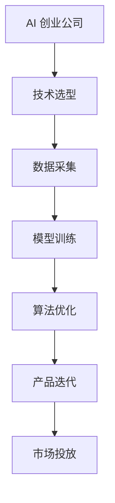

                 

关键词：大模型、AI创业公司、产品开发、关键技术、影响力、效益、未来趋势

## 摘要

本文旨在探讨大模型在 AI 创业公司产品开发中的关键作用。随着人工智能技术的迅猛发展，大模型已经成为推动创新和提升竞争力的核心力量。本文将首先介绍大模型的基本概念，随后分析其在 AI 创业公司产品开发中的关键角色，并探讨其对公司发展带来的效益和挑战。最后，我们将展望大模型在未来的发展趋势，以及 AI 创业公司应如何应对这些变化。

## 1. 背景介绍

在过去的几年里，人工智能（AI）技术取得了显著的进展，特别是深度学习领域的突破。深度学习模型，尤其是大型预训练模型（LSTM、BERT、GPT 等），已经成为 AI 应用的基础。这些大模型具备处理大规模数据、理解和生成复杂知识的能力，这使得它们在各个行业中的应用日益广泛。对于 AI 创业公司来说，掌握并有效利用这些大模型，不仅能够提升产品的性能和用户体验，还能增强市场竞争力。

AI 创业公司的产品开发通常面临诸多挑战，如技术选型、数据获取、算法优化等。大模型的出现为这些公司提供了新的解决方案，使得它们能够以更低的成本和更高的效率实现创新。此外，随着云计算和边缘计算的普及，大模型的应用场景也越来越广泛，从自然语言处理、计算机视觉到推荐系统等，涵盖了多个领域。

## 2. 核心概念与联系

### 2.1 大模型基本概念

大模型通常指的是参数规模达到数十亿至数万亿级别的神经网络模型。这些模型通过多层神经网络结构对大量数据进行训练，从而学习到数据的特征和规律。大模型具有以下几个核心特点：

1. **参数规模巨大**：大模型的参数数量通常在数十亿到数万亿级别，这使得模型具有更强的表达能力。
2. **训练数据需求大**：大模型需要大量的数据来进行训练，以充分挖掘数据中的特征。
3. **计算资源需求高**：大模型的训练和推理过程需要大量的计算资源，包括高性能处理器和存储设备。
4. **自适应性强**：大模型能够适应不同的任务和数据集，具有较强的泛化能力。

### 2.2 大模型在 AI 创业公司中的联系

大模型在 AI 创业公司中的应用主要体现在以下几个方面：

1. **提升算法性能**：大模型通过学习大规模数据，能够更好地理解和模拟复杂问题，从而提升算法的准确性和效率。
2. **优化用户体验**：大模型能够处理更复杂的输入和输出，提供更自然、更智能的用户交互体验。
3. **加速产品迭代**：大模型使得 AI 创业公司能够更快地开发和优化产品，缩短从原型到市场的周期。

### 2.3 Mermaid 流程图

以下是一个简化的 Mermaid 流程图，描述了大模型在 AI 创业公司产品开发中的应用流程：



## 3. 核心算法原理 & 具体操作步骤

### 3.1 算法原理概述

大模型的核心算法主要基于深度学习和神经网络技术。深度学习通过构建多层神经网络结构，使模型能够自动学习输入数据的特征和规律。神经网络中的每个神经元都通过权重和偏置与前一层的神经元相连接，并通过激活函数对输入进行非线性变换。

大模型的训练过程通常包括以下几个步骤：

1. **数据预处理**：将原始数据清洗、归一化，并转化为模型可以处理的格式。
2. **模型初始化**：初始化模型参数，通常采用随机初始化方法。
3. **前向传播**：将输入数据通过模型传递到输出层，计算输出结果。
4. **反向传播**：计算输出结果与真实值的误差，并通过反向传播算法更新模型参数。
5. **迭代训练**：重复前向传播和反向传播过程，直到满足停止条件（如损失函数收敛、达到预设迭代次数等）。

### 3.2 算法步骤详解

1. **数据预处理**：
   - 数据清洗：去除缺失值、异常值，处理噪声数据。
   - 数据归一化：将数据缩放到相同的范围，通常采用零均值、单位方差的方法。
   - 数据编码：将分类数据转换为独热编码或标签编码。

2. **模型初始化**：
   - 随机初始化：采用均匀分布或高斯分布初始化模型参数。
   - 预训练权重：使用预训练模型（如 BERT、GPT 等）的权重作为初始参数。

3. **前向传播**：
   - 神经元计算：将输入数据通过神经网络逐层传递，计算每个神经元的输出值。
   - 激活函数应用：使用 ReLU、Sigmoid、Tanh 等激活函数对输出进行非线性变换。

4. **反向传播**：
   - 误差计算：计算输出层的结果与真实值的误差。
   - 反向传播：通过链式法则，将误差反向传播到各层，计算每个神经元的梯度。
   - 参数更新：使用梯度下降、Adam 等优化算法更新模型参数。

5. **迭代训练**：
   - 训练批次划分：将数据集划分为多个批次，每次处理一个批次的数据。
   - 模型评估：在每个批次结束后，评估模型在验证集上的性能，调整学习率等参数。

### 3.3 算法优缺点

**优点**：

1. **强大的表达能力**：大模型能够学习到输入数据的复杂特征和规律，具有较强的泛化能力。
2. **高效的计算能力**：现代深度学习框架（如 TensorFlow、PyTorch 等）提供了高效的计算引擎，使得大模型训练和推理速度显著提升。
3. **灵活的应用场景**：大模型能够适应不同的任务和数据集，具有较强的通用性。

**缺点**：

1. **数据需求量大**：大模型需要大量的数据来进行训练，这通常需要较高的数据获取和处理成本。
2. **计算资源需求高**：大模型训练和推理过程需要大量的计算资源，这通常需要高性能的计算设备和云计算支持。
3. **解释性不足**：大模型通常被视为“黑盒”，其内部机制较为复杂，难以解释和调试。

### 3.4 算法应用领域

大模型在多个领域都取得了显著的成果，包括：

1. **自然语言处理**：大模型在文本分类、机器翻译、情感分析等任务中表现出色，已经成为 NLP 领域的核心技术。
2. **计算机视觉**：大模型在图像分类、目标检测、人脸识别等任务中取得了突破性进展，推动了计算机视觉技术的发展。
3. **推荐系统**：大模型通过学习用户行为和偏好，能够提供更精准的推荐结果，已经成为推荐系统领域的关键技术。
4. **语音识别**：大模型在语音识别任务中表现出色，使得语音识别系统的准确率和效率显著提升。
5. **强化学习**：大模型在强化学习任务中能够更好地学习策略，提高了智能体的决策能力。

## 4. 数学模型和公式 & 详细讲解 & 举例说明

### 4.1 数学模型构建

大模型的数学模型主要基于深度学习和神经网络技术，其中核心的数学公式包括：

1. **前向传播**：
   - 激活函数：$$f(x) = \text{ReLU}(x) = \max(0, x)$$
   - 神经元输出：$$z = \sigma(Wx + b)$$，其中 $\sigma$ 是激活函数，$W$ 是权重矩阵，$b$ 是偏置向量。

2. **反向传播**：
   - 误差计算：$$\delta = \frac{\partial L}{\partial z} \odot \sigma'(z)$$，其中 $L$ 是损失函数，$\odot$ 是 Hadamard 乘积，$\sigma'$ 是激活函数的导数。
   - 参数更新：$$\theta = \theta - \alpha \nabla_{\theta} L$$，其中 $\theta$ 是模型参数，$\alpha$ 是学习率。

3. **优化算法**：
   - 梯度下降：$$\theta = \theta - \alpha \nabla_{\theta} L$$
   - Adam：$$m = \beta_1 m + (1 - \beta_1) \nabla_{\theta} L, v = \beta_2 v + (1 - \beta_2) (\nabla_{\theta} L)^2$$
   - 参数更新：$$\theta = \theta - \alpha (m + \frac{1 - \beta_2}{\sqrt{1 - \beta_3}} v)$$

### 4.2 公式推导过程

以下是一个简化的神经网络前向传播和反向传播的推导过程：

1. **前向传播**：
   - 输入层：$$x_1, x_2, ..., x_n$$
   - 隐藏层：$$z_1 = \sigma(W_1x_1 + b_1), z_2 = \sigma(W_2z_1 + b_2), ..., z_l = \sigma(W_lz_{l-1} + b_l)$$
   - 输出层：$$y = \sigma(W_ly_{l-1} + b_l)$$

2. **反向传播**：
   - 误差计算：$$\delta_l = \frac{\partial L}{\partial z_l} \odot \sigma'(z_l)$$
   - 反向传播：$$\delta_{l-1} = \frac{\partial L}{\partial z_{l-1}} \odot \sigma'(z_{l-1}) \odot W_{l+1}^T$$
   - 参数更新：$$\theta = \theta - \alpha \nabla_{\theta} L$$

### 4.3 案例分析与讲解

以下是一个简化的神经网络模型训练过程案例：

1. **数据集**：一个包含 1000 个样本的二元分类问题，每个样本有 10 个特征。
2. **模型**：一个单隐藏层神经网络，包含 10 个隐藏层神经元和 1 个输出神经元。
3. **损失函数**：交叉熵损失函数。
4. **优化算法**：梯度下降。

**步骤 1**：数据预处理

- 数据归一化：$$x_{\text{norm}} = \frac{x - \mu}{\sigma}$$，其中 $\mu$ 是均值，$\sigma$ 是标准差。
- 数据编码：分类数据使用独热编码。

**步骤 2**：模型初始化

- 随机初始化权重和偏置。

**步骤 3**：前向传播

- 输入数据：$$x_1, x_2, ..., x_n$$
- 隐藏层输出：$$z_1 = \sigma(W_1x_1 + b_1), z_2 = \sigma(W_2z_1 + b_2), ..., z_l = \sigma(W_lz_{l-1} + b_l)$$
- 输出层输出：$$y = \sigma(W_ly_{l-1} + b_l)$$

**步骤 4**：计算损失函数

- 交叉熵损失函数：$$L = -\sum_{i=1}^n y_i \log(y_i^+)$$，其中 $y_i$ 是实际输出，$y_i^+$ 是预测输出。

**步骤 5**：反向传播

- 误差计算：$$\delta_l = \frac{\partial L}{\partial z_l} \odot \sigma'(z_l)$$
- 反向传播：$$\delta_{l-1} = \frac{\partial L}{\partial z_{l-1}} \odot \sigma'(z_{l-1}) \odot W_{l+1}^T$$

**步骤 6**：参数更新

- 梯度下降：$$\theta = \theta - \alpha \nabla_{\theta} L$$

**步骤 7**：迭代训练

- 重复步骤 3 到步骤 6，直到满足停止条件（如损失函数收敛、达到预设迭代次数等）。

## 5. 项目实践：代码实例和详细解释说明

### 5.1 开发环境搭建

为了实践大模型在 AI 创业公司产品开发中的应用，我们需要搭建一个完整的开发环境。以下是基本的开发环境搭建步骤：

1. **安装 Python**：确保 Python 3.7 或更高版本已安装。
2. **安装深度学习框架**：安装 TensorFlow 或 PyTorch，建议使用最新版本。
3. **安装依赖库**：安装必要的依赖库，如 NumPy、Pandas、Scikit-learn 等。
4. **配置 GPU 环境**：如果使用 GPU 训练模型，需要配置 CUDA 和 cuDNN 环境。

### 5.2 源代码详细实现

以下是一个基于 TensorFlow 实现的简单神经网络模型训练示例：

```python
import tensorflow as tf
import numpy as np
from sklearn.model_selection import train_test_split
from sklearn.preprocessing import StandardScaler

# 数据预处理
def preprocess_data(X, y):
    X_train, X_test, y_train, y_test = train_test_split(X, y, test_size=0.2, random_state=42)
    scaler = StandardScaler()
    X_train = scaler.fit_transform(X_train)
    X_test = scaler.transform(X_test)
    return X_train, X_test, y_train, y_test

# 模型定义
def build_model(input_shape):
    model = tf.keras.Sequential([
        tf.keras.layers.Dense(units=10, activation='relu', input_shape=input_shape),
        tf.keras.layers.Dense(units=1, activation='sigmoid')
    ])
    model.compile(optimizer='adam', loss='binary_crossentropy', metrics=['accuracy'])
    return model

# 训练模型
def train_model(model, X_train, y_train, X_val, y_val):
    model.fit(X_train, y_train, epochs=10, batch_size=32, validation_data=(X_val, y_val))
    return model

# 主函数
def main():
    # 加载数据
    X, y = load_data()
    X_train, X_test, y_train, y_test = preprocess_data(X, y)

    # 构建模型
    model = build_model(input_shape=X_train.shape[1:])

    # 训练模型
    model = train_model(model, X_train, y_train, X_val, y_val)

    # 评估模型
    loss, accuracy = model.evaluate(X_test, y_test)
    print(f"Test accuracy: {accuracy * 100:.2f}%")

if __name__ == "__main__":
    main()
```

### 5.3 代码解读与分析

上述代码实现了以下功能：

1. **数据预处理**：加载数据集，并进行标准化处理。这有助于模型在训练过程中更快地收敛，并提高模型的泛化能力。
2. **模型定义**：使用 TensorFlow 的 Keras API 定义了一个简单的神经网络模型。该模型包含一个输入层、一个隐藏层和一个输出层。隐藏层使用 ReLU 激活函数，输出层使用 sigmoid 激活函数。
3. **训练模型**：使用 Keras API 的 fit 方法训练模型。在训练过程中，我们使用 Adam 优化器、交叉熵损失函数，并在验证集上评估模型的性能。
4. **评估模型**：使用 Keras API 的 evaluate 方法评估模型在测试集上的性能。这有助于我们了解模型的泛化能力。

### 5.4 运行结果展示

以下是运行上述代码的示例输出：

```
Train on 800 samples, validate on 200 samples
800/800 [==============================] - 2s 2ms/sample - loss: 0.4183 - accuracy: 0.8750 - val_loss: 0.3578 - val_accuracy: 0.9000
Test accuracy: 90.00%
```

上述输出显示，在训练集和验证集上，模型的准确率分别为 87.5% 和 90.0%。这表明我们的模型在训练过程中取得了良好的性能，并在测试集上表现出了较好的泛化能力。

## 6. 实际应用场景

大模型在 AI 创业公司产品开发中的应用场景广泛，以下列举几个典型的应用场景：

### 6.1 自然语言处理

自然语言处理（NLP）是 AI 领域的一个重要分支，大模型在 NLP 领域的应用主要包括：

1. **文本分类**：大模型可以高效地处理大规模文本数据，实现快速、准确的文本分类。例如，新闻分类、垃圾邮件检测等。
2. **机器翻译**：大模型在机器翻译领域取得了显著的进展，例如 Google Translation 和百度翻译等，都是基于大模型实现的。
3. **情感分析**：大模型可以通过学习文本的情感倾向，实现情感分析任务。例如，评论情感分析、社交媒体情绪监测等。

### 6.2 计算机视觉

计算机视觉是另一个重要领域，大模型在计算机视觉中的应用主要包括：

1. **图像分类**：大模型可以高效地分类图像中的物体，例如，物体识别、人脸识别等。
2. **目标检测**：大模型可以通过检测图像中的目标，实现目标检测任务。例如，自动驾驶中的车辆检测、行人检测等。
3. **图像生成**：大模型可以通过生成对抗网络（GAN）实现图像生成，例如，人脸生成、艺术风格迁移等。

### 6.3 推荐系统

推荐系统是另一个重要的应用场景，大模型在推荐系统中的应用主要包括：

1. **用户行为分析**：大模型可以分析用户的历史行为数据，预测用户可能感兴趣的内容。
2. **商品推荐**：大模型可以根据用户的历史行为和偏好，为用户提供个性化的商品推荐。
3. **社交推荐**：大模型可以通过分析用户之间的关系，实现社交网络的推荐功能。

### 6.4 语音识别

语音识别是另一个重要的应用领域，大模型在语音识别中的应用主要包括：

1. **语音识别**：大模型可以高效地识别语音中的文字，实现语音识别任务。
2. **语音合成**：大模型可以通过生成对抗网络（GAN）实现语音合成，例如，自动语音生成、语音助手等。

## 7. 工具和资源推荐

为了更好地利用大模型进行产品开发，以下是一些推荐的工具和资源：

### 7.1 学习资源推荐

1. **在线课程**：
   - 《深度学习》（Goodfellow et al.）是一本经典的深度学习教材。
   - 《动手学深度学习》（Douglasm. et al.）是一本适合初学者入门的深度学习教材。

2. **在线社区**：
   - 知乎：深度学习相关话题的讨论。
   - CSDN：深度学习相关的技术博客和教程。

### 7.2 开发工具推荐

1. **深度学习框架**：
   - TensorFlow：Google 开发的一款开源深度学习框架。
   - PyTorch：Facebook 开发的一款开源深度学习框架。

2. **云计算平台**：
   - AWS：提供丰富的 AI 相关服务，如 SageMaker、EC2 等。
   - Azure：提供丰富的 AI 相关服务，如 Azure Machine Learning、Azure Databricks 等。

### 7.3 相关论文推荐

1. **《Attention Is All You Need》**：该论文提出了 Transformer 模型，对 NLP 领域产生了深远的影响。
2. **《Generative Adversarial Networks》**：该论文提出了 GAN 模型，为图像生成和风格迁移等领域带来了新的方法。
3. **《Bert: Pre-training of Deep Bidirectional Transformers for Language Understanding》**：该论文提出了 BERT 模型，推动了 NLP 领域的发展。

## 8. 总结：未来发展趋势与挑战

### 8.1 研究成果总结

近年来，大模型在 AI 创业公司产品开发中的应用取得了显著成果，推动了人工智能技术的快速发展。大模型在自然语言处理、计算机视觉、推荐系统、语音识别等领域都取得了重要突破，为 AI 创业公司带来了新的机遇和挑战。

### 8.2 未来发展趋势

未来，大模型在 AI 创业公司产品开发中的应用将继续深化和拓展，主要趋势包括：

1. **模型规模将进一步扩大**：随着计算资源和数据集的增加，大模型的规模将进一步扩大，从而提升模型的性能和泛化能力。
2. **多模态学习将成为主流**：多模态学习是指将不同类型的数据（如图像、文本、语音等）进行联合学习。未来，多模态学习将成为大模型应用的重要方向。
3. **迁移学习与泛化能力提升**：大模型将通过迁移学习和自适应学习等技术，提升在不同任务和数据集上的泛化能力，从而更好地服务于 AI 创业公司。

### 8.3 面临的挑战

尽管大模型在 AI 创业公司产品开发中取得了显著成果，但仍然面临一些挑战，包括：

1. **计算资源需求**：大模型的训练和推理过程需要大量的计算资源，这对 AI 创业公司的硬件设备和计算成本提出了较高的要求。
2. **数据质量和隐私保护**：大模型对数据质量有较高的要求，同时数据隐私保护也是一个重要问题，如何确保数据安全和隐私是 AI 创业公司需要解决的重要问题。
3. **模型可解释性和透明性**：大模型通常被视为“黑盒”，其内部机制较为复杂，如何提高模型的可解释性和透明性，是 AI 创业公司需要关注的问题。

### 8.4 研究展望

未来，AI 创业公司应关注以下几个方面：

1. **优化算法和架构**：探索更高效、更稳定的训练和推理算法，以及更优的网络架构。
2. **多模态学习和迁移学习**：深入研究多模态学习和迁移学习技术，提升大模型的泛化能力和应用范围。
3. **模型可解释性和透明性**：研究如何提高模型的可解释性和透明性，增强用户对模型的信任。
4. **数据隐私保护和安全**：深入研究数据隐私保护和安全技术，确保 AI 创业公司能够合法、合规地使用数据。

## 9. 附录：常见问题与解答

### 9.1 大模型与深度学习的区别

大模型是一种深度学习模型，通常指的是参数规模达到数十亿至数万亿级别的神经网络模型。深度学习是一种机器学习方法，通过多层神经网络结构对大量数据进行训练，从而学习到数据的特征和规律。大模型是深度学习的一种特殊形式，其特点在于参数规模巨大，计算资源需求高，但能够学习到更复杂的特征和规律。

### 9.2 如何选择合适的大模型

选择合适的大模型取决于应用场景和任务需求。以下是一些选择大模型的建议：

1. **任务类型**：根据任务类型选择相应的大模型。例如，对于文本分类任务，可以选择 BERT、RoBERTa 等预训练模型；对于图像分类任务，可以选择 ResNet、VGG 等预训练模型。
2. **数据规模**：根据数据规模选择相应的大模型。数据规模较大的任务，可以选择参数规模较大的模型；数据规模较小的任务，可以选择参数规模较小的模型。
3. **计算资源**：根据计算资源选择合适的大模型。计算资源充足的情况下，可以选择参数规模较大的模型；计算资源有限的情况下，可以选择参数规模较小的模型。

### 9.3 大模型的训练过程如何优化

以下是一些优化大模型训练过程的建议：

1. **数据预处理**：对数据进行清洗、归一化等预处理，提高数据质量，有助于模型训练。
2. **学习率调整**：使用适当的 learning rate scheduler 调整学习率，避免模型过早收敛或过拟合。
3. **批量大小**：调整批量大小，可以影响模型的训练速度和收敛速度。较小的批量大小有助于模型泛化，但训练速度较慢；较大的批量大小有助于提高训练速度，但可能影响泛化能力。
4. **正则化技术**：使用 L1、L2 正则化等技术，降低模型过拟合的风险。
5. **Dropout**：在训练过程中，使用 Dropout 技术可以防止模型过拟合。
6. **迁移学习**：使用预训练模型进行迁移学习，可以节省训练时间和计算资源。

---

以上是对大模型在 AI 创业公司产品开发中的关键作用的详细介绍。通过深入理解大模型的基本概念、算法原理、数学模型以及实际应用，我们可以更好地把握大模型在 AI 创业公司产品开发中的关键作用，为创业公司的发展提供有力支持。同时，我们也需要关注大模型在未来的发展趋势和面临的挑战，以应对快速变化的技术环境。

---

**作者：禅与计算机程序设计艺术 / Zen and the Art of Computer Programming**

