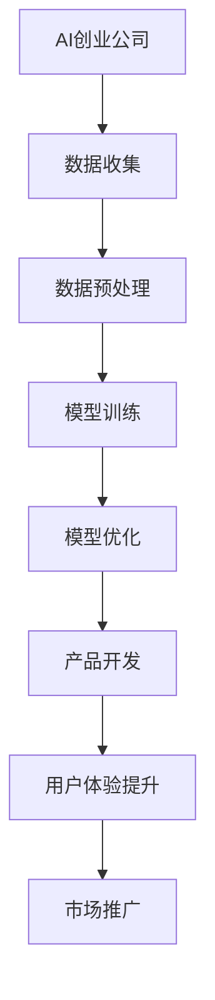

                 

关键词：AI创业公司，大模型，产品策略，深度学习，计算机视觉，自然语言处理，优化，用户体验，商业模式。

摘要：本文深入探讨了人工智能（AI）创业公司如何利用大模型优化产品策略，提高市场竞争力。通过分析大模型在计算机视觉、自然语言处理等领域的应用，本文提出了大模型在创业公司产品开发中的关键作用，并展望了未来的发展趋势与挑战。

## 1. 背景介绍

随着人工智能技术的快速发展，深度学习、计算机视觉、自然语言处理等领域的突破性进展，大模型逐渐成为AI创业公司的核心竞争力。大模型通过学习海量数据，能够自动提取特征，实现复杂的任务，如语音识别、图像分类、机器翻译等。这些模型具有高度的通用性和强大的表现能力，使得AI创业公司能够在短时间内开发出具有高竞争力的产品。

AI创业公司面临着激烈的市场竞争，如何在短时间内实现产品创新和差异化，成为企业成功的关键。大模型的应用，为创业公司提供了强大的工具，使得他们在产品策略上有了更多的选择和灵活性。本文将探讨大模型在AI创业公司产品策略中的关键作用，以及如何利用大模型优化产品开发、提升用户体验和构建可持续的商业模式。

## 2. 核心概念与联系

### 2.1 大模型的基本概念

大模型（Large Model）通常是指具有数十亿至数千亿个参数的深度学习模型。这些模型通过在海量数据上进行训练，能够自动提取特征，学习复杂的模式和关系。大模型的兴起，得益于计算能力的提升和海量数据的获取。

### 2.2 大模型与深度学习的关系

深度学习（Deep Learning）是人工智能的一个重要分支，通过多层神经网络实现数据的自动特征提取和模式识别。大模型是深度学习的一个重要应用，其参数规模远超传统模型，能够处理更为复杂的任务。

### 2.3 大模型在AI创业公司中的应用

大模型在计算机视觉、自然语言处理、语音识别等领域有广泛的应用。例如，在计算机视觉领域，大模型可以用于图像分类、目标检测、图像生成等任务；在自然语言处理领域，大模型可以用于机器翻译、文本生成、情感分析等任务。

### 2.4 Mermaid流程图

以下是一个简单的Mermaid流程图，展示了大模型在AI创业公司中的应用流程：



## 3. 核心算法原理 & 具体操作步骤

### 3.1 算法原理概述

大模型的算法原理基于深度学习，通过多层神经网络实现数据的自动特征提取和模式识别。大模型的核心在于其参数规模，这些参数通过在大量数据上学习，能够捕捉到复杂的数据分布。

### 3.2 算法步骤详解

1. 数据收集：AI创业公司需要收集大量相关的数据，包括图像、文本、语音等。

2. 数据预处理：对收集到的数据进行清洗、标注和转换，使其适合模型训练。

3. 模型训练：使用深度学习框架（如TensorFlow、PyTorch）训练大模型，通过反向传播算法不断优化模型参数。

4. 模型优化：通过调参、迁移学习等方法，进一步提高模型的性能。

5. 产品开发：将训练好的大模型集成到产品中，实现具体的功能，如图像识别、文本生成等。

6. 用户体验提升：通过持续的模型优化和用户反馈，提升产品的用户体验。

7. 市场推广：将产品推向市场，通过营销策略扩大用户基础。

### 3.3 算法优缺点

**优点：**
- 高效性：大模型能够在短时间内处理大量数据，实现高效的特征提取和模式识别。
- 通用性：大模型具有高度的通用性，可以应用于多个领域，如计算机视觉、自然语言处理等。
- 创新性：大模型能够自动提取复杂特征，为创业公司提供创新的解决方案。

**缺点：**
- 计算成本高：大模型需要大量的计算资源和时间进行训练。
- 数据需求大：大模型需要大量的高质量数据才能达到良好的性能。

### 3.4 算法应用领域

大模型在计算机视觉、自然语言处理、语音识别等领域有广泛的应用。例如，在计算机视觉领域，大模型可以用于图像分类、目标检测、图像生成等任务；在自然语言处理领域，大模型可以用于机器翻译、文本生成、情感分析等任务。

## 4. 数学模型和公式 & 详细讲解 & 举例说明

### 4.1 数学模型构建

大模型的数学模型基于深度学习，主要包括神经网络和损失函数。

#### 神经网络

神经网络由多个神经元（或称为节点）组成，每个神经元都是一个简单的函数。神经网络通过层层堆叠，实现数据的自动特征提取和模式识别。

#### 损失函数

损失函数用于衡量模型预测值与真实值之间的差距，常用的损失函数包括均方误差（MSE）、交叉熵（CE）等。

### 4.2 公式推导过程

#### 神经网络

$$
f(x) = \sigma(\theta_0 \cdot x_0 + \theta_1 \cdot x_1 + ... + \theta_n \cdot x_n)
$$

其中，$f(x)$ 是神经网络输出的函数，$\sigma$ 是激活函数，$\theta_0, \theta_1, ..., \theta_n$ 是神经网络的权重。

#### 损失函数

$$
L(y, \hat{y}) = \frac{1}{2} \sum_{i=1}^{n} (y_i - \hat{y}_i)^2
$$

其中，$L(y, \hat{y})$ 是损失函数，$y_i$ 是真实值，$\hat{y}_i$ 是预测值。

### 4.3 案例分析与讲解

#### 案例一：图像分类

使用大模型对图像进行分类，如图像识别应用。

1. 数据收集：收集大量的图像数据，并标注每个图像的类别。
2. 数据预处理：对图像进行缩放、裁剪、增强等预处理操作。
3. 模型训练：使用深度学习框架训练大模型，优化模型参数。
4. 模型评估：使用测试数据集评估模型性能。
5. 模型部署：将训练好的模型部署到产品中，实现图像分类功能。

#### 案例二：机器翻译

使用大模型实现机器翻译，如谷歌翻译。

1. 数据收集：收集大量的双语语料库。
2. 数据预处理：对语料库进行清洗、分词等预处理。
3. 模型训练：使用深度学习框架训练大模型，优化模型参数。
4. 模型评估：使用测试数据集评估模型性能。
5. 模型部署：将训练好的模型部署到产品中，实现机器翻译功能。

## 5. 项目实践：代码实例和详细解释说明

### 5.1 开发环境搭建

1. 安装Python环境，版本建议3.8及以上。
2. 安装深度学习框架，如TensorFlow或PyTorch。
3. 安装必要的库，如NumPy、Pandas、Matplotlib等。

### 5.2 源代码详细实现

以下是一个简单的图像分类项目的代码示例：

```python
import tensorflow as tf
from tensorflow.keras import layers

# 构建模型
model = tf.keras.Sequential([
    layers.Conv2D(32, (3, 3), activation='relu', input_shape=(28, 28, 1)),
    layers.MaxPooling2D((2, 2)),
    layers.Flatten(),
    layers.Dense(128, activation='relu'),
    layers.Dense(10, activation='softmax')
])

# 编译模型
model.compile(optimizer='adam',
              loss='sparse_categorical_crossentropy',
              metrics=['accuracy'])

# 加载数据集
mnist = tf.keras.datasets.mnist
(train_images, train_labels), (test_images, test_labels) = mnist.load_data()

# 预处理数据
train_images = train_images / 255.0
test_images = test_images / 255.0

# 训练模型
model.fit(train_images, train_labels, epochs=5)

# 评估模型
test_loss, test_acc = model.evaluate(test_images,  test_labels, verbose=2)
print('\nTest accuracy:', test_acc)
```

### 5.3 代码解读与分析

- 导入TensorFlow库，构建Sequential模型。
- 添加Conv2D、MaxPooling2D、Flatten和Dense层，构建完整的神经网络模型。
- 编译模型，设置优化器和损失函数。
- 加载MNIST数据集，对数据进行预处理。
- 使用fit方法训练模型，使用evaluate方法评估模型性能。

## 6. 实际应用场景

大模型在AI创业公司的实际应用场景广泛，以下是一些典型的应用：

1. **计算机视觉**：用于图像分类、目标检测、图像生成等任务，如人脸识别、自动驾驶等。
2. **自然语言处理**：用于机器翻译、文本生成、情感分析等任务，如智能客服、内容推荐等。
3. **语音识别**：用于语音识别、语音合成等任务，如智能语音助手、语音翻译等。
4. **推荐系统**：用于商品推荐、广告投放等任务，如电商平台、社交媒体等。

## 7. 工具和资源推荐

### 7.1 学习资源推荐

1. **书籍**：《深度学习》（Ian Goodfellow、Yoshua Bengio、Aaron Courville 著）
2. **在线课程**：斯坦福大学《深度学习》课程（ Andrew Ng 老师讲授）
3. **博客**：阿斯顿张（Aston Zhang）的深度学习博客

### 7.2 开发工具推荐

1. **深度学习框架**：TensorFlow、PyTorch、Keras
2. **数据预处理工具**：Pandas、NumPy、Scikit-learn
3. **可视化工具**：Matplotlib、Seaborn、Plotly

### 7.3 相关论文推荐

1. **《DenseNet: Benchmarking the State-of-the-Art for Neural Network Design》**
2. **《EfficientNet: Rethinking Model Scaling for Convolutional Neural Networks》**
3. **《Transformers: State-of-the-Art Natural Language Processing》**

## 8. 总结：未来发展趋势与挑战

### 8.1 研究成果总结

- 大模型在计算机视觉、自然语言处理、语音识别等领域取得了显著成果，提高了AI创业公司的竞争力。
- 大模型的训练效率和质量不断提升，为创业公司提供了更强大的工具。
- 大模型的应用场景不断拓展，从图像识别、语音识别到推荐系统、无人驾驶等。

### 8.2 未来发展趋势

- 大模型将继续向更高效的模型架构、更精细的任务优化方向发展。
- 大模型的应用领域将更加广泛，从智能客服、智能医疗到智能家居、智能城市等。
- 大模型的训练将更加依赖于分布式计算、云计算等新型计算模式。

### 8.3 面临的挑战

- 计算资源的需求将持续增加，如何优化计算效率和降低成本是一个重要挑战。
- 数据质量和数据隐私问题需要得到有效解决，以确保大模型的安全和可靠性。
- 大模型的透明度和可解释性是一个亟待解决的问题，以增强用户对AI产品的信任。

### 8.4 研究展望

- 未来研究将更加关注大模型的泛化能力、鲁棒性和适应性。
- 大模型的开发将更加注重算法创新、架构优化和可解释性。
- 大模型的应用将更加深入社会生活的各个方面，推动社会的智能化和数字化进程。

## 9. 附录：常见问题与解答

### 9.1 大模型为什么重要？

大模型能够处理大量数据，自动提取复杂特征，实现高精度的任务。在AI创业公司中，大模型可以提高产品的性能和用户体验，增强市场竞争力。

### 9.2 大模型的训练成本很高，如何降低成本？

可以通过以下方式降低大模型的训练成本：
- 使用更高效的算法和优化器。
- 采用分布式训练和云计算资源。
- 利用迁移学习和预训练模型。

### 9.3 大模型的应用场景有哪些？

大模型在计算机视觉、自然语言处理、语音识别等领域有广泛的应用，如图像分类、目标检测、机器翻译、语音识别、推荐系统等。

### 9.4 如何保证大模型的安全性和可靠性？

可以通过以下措施保证大模型的安全性和可靠性：
- 加强数据安全和隐私保护。
- 优化模型训练和部署流程，确保模型的稳定性和准确性。
- 定期进行模型审计和评估，确保模型的合规性和可靠性。

---

作者：禅与计算机程序设计艺术 / Zen and the Art of Computer Programming

以上，便是关于“大模型在 AI 创业公司产品策略中的关键作用”的完整文章内容。希望通过本文，读者能够更好地理解大模型在AI创业公司中的关键作用，以及如何利用大模型优化产品策略，提升市场竞争力。未来，随着人工智能技术的不断发展，大模型的应用将更加广泛，为创业公司带来更多的机遇和挑战。

