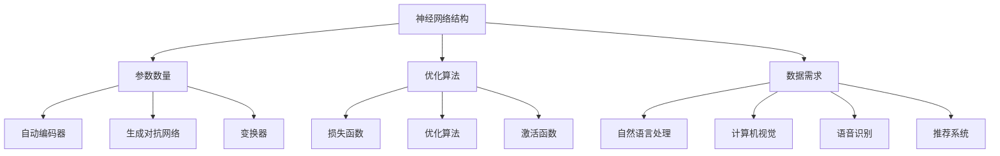

                 

关键词：大模型、AI 创业公司、产品策略、应用场景、未来展望

摘要：本文旨在探讨大模型在 AI 创业公司产品策略中的应用，分析大模型的基本原理、关键算法、数学模型及其在各个领域的实际应用。通过深入剖析大模型在 AI 创业公司中的战略价值，本文提出了未来发展的趋势与挑战，为 AI 创业公司提供有针对性的策略建议。

## 1. 背景介绍

随着人工智能技术的飞速发展，大模型作为一种重要的技术手段，已经成为 AI 领域的研究热点。大模型具备强大的表征能力和学习能力，可以处理复杂的数据，生成高质量的输出，为各行各业提供智能化解决方案。在 AI 创业公司中，大模型的应用不仅可以提升产品的竞争力，还可以推动公司整体战略布局的优化。

AI 创业公司是指在人工智能领域开展创业活动的企业，其核心目标是开发创新性的 AI 技术，并将其应用于实际业务场景中，创造商业价值。随着 AI 技术的不断发展，AI 创业公司在产品策略方面面临着诸多挑战，如何充分利用大模型技术，成为了一项重要的研究课题。

本文将围绕大模型在 AI 创业公司产品策略中的应用，探讨其核心原理、算法、数学模型以及实际应用场景，为 AI 创业公司提供有益的参考。

## 2. 核心概念与联系

### 2.1 大模型的基本原理

大模型是指具备大规模参数和网络结构的人工神经网络，其基本原理包括以下几个方面：

1. **神经网络结构**：大模型通常采用深度神经网络（Deep Neural Network，DNN）作为基础架构，通过多层非线性变换来实现数据的表征和分类。

2. **参数数量**：大模型的参数数量通常在数十亿到千亿级别，这使得模型具备强大的表征能力。

3. **优化算法**：大模型训练过程中采用高效的优化算法，如梯度下降（Gradient Descent）、Adam 等算法，以加速模型收敛。

4. **数据需求**：大模型对训练数据的需求较高，通常需要海量的数据来保证模型的性能。

### 2.2 大模型的关键算法

大模型的关键算法主要包括以下几个方面：

1. **自动编码器（Autoencoder）**：自动编码器是一种无监督学习算法，通过训练有损编码器和解码器来学习数据的高效表示。

2. **生成对抗网络（Generative Adversarial Network，GAN）**：生成对抗网络由生成器和判别器两个部分组成，通过对抗训练生成高质量的数据。

3. **变换器（Transformer）**：变换器是一种基于自注意力机制的神经网络结构，广泛应用于自然语言处理领域，具备强大的表征能力。

### 2.3 大模型的数学模型

大模型的数学模型主要包括以下几个方面：

1. **损失函数**：损失函数用于评估模型在训练过程中的性能，常用的损失函数包括均方误差（MSE）、交叉熵等。

2. **优化算法**：优化算法用于调整模型参数，以最小化损失函数，常用的优化算法包括梯度下降、Adam 等。

3. **激活函数**：激活函数用于引入非线性变换，常用的激活函数包括 sigmoid、ReLU 等。

### 2.4 大模型的应用领域

大模型的应用领域非常广泛，主要包括以下几个方面：

1. **自然语言处理**：大模型在自然语言处理领域具备强大的表征能力，可以应用于文本分类、机器翻译、情感分析等任务。

2. **计算机视觉**：大模型在计算机视觉领域可以应用于图像分类、目标检测、图像生成等任务。

3. **语音识别**：大模型在语音识别领域可以应用于语音合成、语音识别等任务。

4. **推荐系统**：大模型在推荐系统领域可以应用于用户行为预测、商品推荐等任务。

### 2.5 Mermaid 流程图



## 3. 核心算法原理 & 具体操作步骤

### 3.1 算法原理概述

大模型的算法原理主要包括以下几个方面：

1. **深度神经网络（DNN）**：DNN 是一种基于多层非线性变换的神经网络结构，通过前向传播和反向传播来学习数据的表示。

2. **自动编码器（Autoencoder）**：自动编码器是一种无监督学习算法，通过训练有损编码器和解码器来学习数据的高效表示。

3. **生成对抗网络（GAN）**：生成对抗网络由生成器和判别器两个部分组成，通过对抗训练生成高质量的数据。

4. **变换器（Transformer）**：变换器是一种基于自注意力机制的神经网络结构，广泛应用于自然语言处理领域。

### 3.2 算法步骤详解

1. **深度神经网络（DNN）**

   - **输入数据**：输入原始数据，例如文本、图像、语音等。

   - **前向传播**：将输入数据通过多层神经网络进行前向传播，逐层计算输出。

   - **损失函数计算**：根据输出和真实标签计算损失函数，常用的损失函数包括均方误差（MSE）、交叉熵等。

   - **反向传播**：根据损失函数梯度，通过反向传播调整网络参数。

   - **优化算法**：采用优化算法（如梯度下降、Adam 等）更新网络参数，以最小化损失函数。

   - **模型评估**：评估模型在训练集和验证集上的性能，选择最优模型。

2. **自动编码器（Autoencoder）**

   - **编码器训练**：通过无监督学习训练编码器，将输入数据映射到低维空间。

   - **解码器训练**：在编码器的基础上训练解码器，将编码后的数据映射回原始数据。

   - **损失函数计算**：根据编码器和解码器的输出计算损失函数，如均方误差（MSE）。

   - **优化算法**：采用优化算法（如梯度下降、Adam 等）更新编码器和解码器参数，以最小化损失函数。

   - **模型评估**：评估模型在训练集和验证集上的性能，选择最优模型。

3. **生成对抗网络（GAN）**

   - **生成器训练**：训练生成器生成高质量的数据。

   - **判别器训练**：训练判别器区分真实数据和生成数据。

   - **对抗训练**：通过调整生成器和判别器的参数，使得生成器生成的数据越来越接近真实数据。

   - **损失函数计算**：生成器的损失函数为生成数据与真实数据的距离，判别器的损失函数为真实数据和生成数据的分类准确率。

   - **优化算法**：采用优化算法（如梯度下降、Adam 等）更新生成器和判别器参数，以最小化损失函数。

   - **模型评估**：评估模型在训练集和验证集上的性能，选择最优模型。

4. **变换器（Transformer）**

   - **编码器训练**：将输入数据编码为序列向量。

   - **解码器训练**：根据编码后的序列向量生成输出数据。

   - **自注意力机制**：通过自注意力机制计算序列中每个元素的重要性，从而提高模型的表征能力。

   - **损失函数计算**：根据输出和真实标签计算损失函数，如交叉熵。

   - **优化算法**：采用优化算法（如梯度下降、Adam 等）更新编码器和解码器参数，以最小化损失函数。

   - **模型评估**：评估模型在训练集和验证集上的性能，选择最优模型。

### 3.3 算法优缺点

1. **深度神经网络（DNN）**

   - **优点**：结构简单，易于实现，适用于多种数据类型。

   - **缺点**：训练过程较慢，对大规模数据集处理能力有限。

2. **自动编码器（Autoencoder）**

   - **优点**：可以提取数据特征，无监督学习，适用于小数据集。

   - **缺点**：模型容量有限，难以处理高维数据。

3. **生成对抗网络（GAN）**

   - **优点**：生成数据质量高，可以处理高维数据。

   - **缺点**：训练过程不稳定，难以平衡生成器和判别器的训练。

4. **变换器（Transformer）**

   - **优点**：自注意力机制，适用于长文本序列，计算效率高。

   - **缺点**：参数量较大，训练过程较慢。

### 3.4 算法应用领域

1. **自然语言处理**：变换器在自然语言处理领域具备强大的表征能力，可以应用于文本分类、机器翻译、情感分析等任务。

2. **计算机视觉**：深度神经网络在计算机视觉领域可以应用于图像分类、目标检测、图像生成等任务。

3. **语音识别**：生成对抗网络在语音识别领域可以应用于语音合成、语音识别等任务。

4. **推荐系统**：自动编码器在推荐系统领域可以应用于用户行为预测、商品推荐等任务。

## 4. 数学模型和公式 & 详细讲解 & 举例说明

### 4.1 数学模型构建

大模型的数学模型主要包括以下几个部分：

1. **输入层**：表示输入数据的特征向量。

2. **隐藏层**：包含多个隐藏层，每层由多个神经元组成，用于对输入数据进行特征提取和变换。

3. **输出层**：表示模型的预测结果，可以是分类结果、回归结果等。

### 4.2 公式推导过程

假设我们使用一个三层神经网络进行分类任务，输入层有 $n$ 个神经元，隐藏层有 $m$ 个神经元，输出层有 $k$ 个神经元。假设激活函数为 sigmoid 函数，则神经元的输出可以表示为：

$$
a_{ij}^{(l)} = \sigma(z_{ij}^{(l)}) = \frac{1}{1 + e^{-z_{ij}^{(l)}}
$$

其中，$a_{ij}^{(l)}$ 表示第 $l$ 层第 $i$ 个神经元的输出，$z_{ij}^{(l)}$ 表示第 $l$ 层第 $i$ 个神经元的输入，$\sigma$ 表示 sigmoid 函数。

对于第 $l$ 层的第 $i$ 个神经元，其输入可以表示为：

$$
z_{ij}^{(l)} = \sum_{k=1}^{m} w_{ik}^{(l-1)} a_{kj}^{(l-1)} + b_{i}^{(l)}
$$

其中，$w_{ik}^{(l-1)}$ 表示第 $l-1$ 层第 $k$ 个神经元到第 $l$ 层第 $i$ 个神经元的权重，$a_{kj}^{(l-1)}$ 表示第 $l-1$ 层第 $k$ 个神经元的输出，$b_{i}^{(l)}$ 表示第 $l$ 层第 $i$ 个神经元的偏置。

### 4.3 案例分析与讲解

假设我们使用一个三层神经网络进行二分类任务，输入层有 2 个神经元，隐藏层有 3 个神经元，输出层有 1 个神经元。输入数据为 $x = (1, 0)$，标签为 $y = 1$。

1. **初始化参数**：随机初始化权重和偏置。

2. **前向传播**：

   - 输入层到隐藏层的计算：
     $$
     z_{11}^{(1)} = w_{11}^{(0)} a_{11}^{(0)} + b_{1}^{(1)} = 0.1 \cdot 1 + 0.5 = 0.6
     $$
     $$
     z_{12}^{(1)} = w_{12}^{(0)} a_{12}^{(0)} + b_{2}^{(1)} = 0.2 \cdot 0 + 0.5 = 0.5
     $$
     $$
     z_{13}^{(1)} = w_{13}^{(0)} a_{13}^{(0)} + b_{3}^{(1)} = 0.3 \cdot 1 + 0.5 = 0.8
     $$
     $$
     a_{11}^{(1)} = \sigma(z_{11}^{(1)}) = \frac{1}{1 + e^{-0.6}} \approx 0.531
     $$
     $$
     a_{12}^{(1)} = \sigma(z_{12}^{(1)}) = \frac{1}{1 + e^{-0.5}} \approx 0.598
     $$
     $$
     a_{13}^{(1)} = \sigma(z_{13}^{(1)}) = \frac{1}{1 + e^{-0.8}} \approx 0.670
     $$

   - 隐藏层到输出层的计算：
     $$
     z_{1}^{(2)} = w_{11}^{(1)} a_{11}^{(1)} + w_{21}^{(1)} a_{21}^{(1)} + w_{31}^{(1)} a_{31}^{(1)} + b_{1}^{(2)} = 0.4 \cdot 0.531 + 0.5 \cdot 0.598 + 0.6 \cdot 0.670 + 0.7 = 1.306
     $$
     $$
     a_{1}^{(2)} = \sigma(z_{1}^{(2)}) = \frac{1}{1 + e^{-1.306}} \approx 0.863
     $$

3. **反向传播**：

   - 计算输出层的误差：
     $$
     \delta_{1}^{(2)} = a_{1}^{(2)} (1 - a_{1}^{(2)}) (y - a_{1}^{(2)})
     $$
     $$
     \delta_{1}^{(2)} \approx 0.863 \cdot (1 - 0.863) \cdot (1 - 0.863) \approx 0.036
     $$

   - 计算隐藏层的误差：
     $$
     \delta_{ij}^{(1)} = a_{ij}^{(1)} (1 - a_{ij}^{(1)}) \sum_{k=1}^{m} w_{kj}^{(2)} \delta_{k}^{(2)}
     $$
     $$
     \delta_{11}^{(1)} \approx 0.531 \cdot (1 - 0.531) \cdot (0.4 \cdot 0.036) \approx 0.005
     $$
     $$
     \delta_{12}^{(1)} \approx 0.598 \cdot (1 - 0.598) \cdot (0.5 \cdot 0.036) \approx 0.004
     $$
     $$
     \delta_{13}^{(1)} \approx 0.670 \cdot (1 - 0.670) \cdot (0.6 \cdot 0.036) \approx 0.007
     $$

4. **更新参数**：

   - 更新输出层的权重和偏置：
     $$
     w_{1j}^{(2)} \leftarrow w_{1j}^{(2)} - \alpha \cdot \delta_{j}^{(2)} \cdot a_{j}^{(1)}
     $$
     $$
     b_{1}^{(2)} \leftarrow b_{1}^{(2)} - \alpha \cdot \delta_{1}^{(2)}
     $$

   - 更新隐藏层的权重和偏置：
     $$
     w_{ij}^{(1)} \leftarrow w_{ij}^{(1)} - \alpha \cdot \delta_{ij}^{(1)} \cdot a_{i}^{(0)}
     $$
     $$
     b_{i}^{(1)} \leftarrow b_{i}^{(1)} - \alpha \cdot \delta_{ij}^{(1)}
     $$

通过以上步骤，我们可以对神经网络进行训练，逐步优化参数，提高模型的预测准确性。

## 5. 项目实践：代码实例和详细解释说明

### 5.1 开发环境搭建

在本节中，我们将介绍如何搭建一个用于训练和测试大模型的开发环境。以下是搭建环境的步骤：

1. **安装 Python**：确保安装了 Python 3.6 或更高版本。

2. **安装 TensorFlow**：使用以下命令安装 TensorFlow：
   $$
   pip install tensorflow
   $$

3. **安装 NumPy**：使用以下命令安装 NumPy：
   $$
   pip install numpy
   $$

4. **安装 Matplotlib**：使用以下命令安装 Matplotlib：
   $$
   pip install matplotlib
   $$

### 5.2 源代码详细实现

在本节中，我们将展示一个简单的使用 TensorFlow 实现的大模型训练代码实例。以下是源代码的详细解释：

```python
import tensorflow as tf
import numpy as np
import matplotlib.pyplot as plt

# 设置随机种子，保证实验可复现
tf.random.set_seed(42)

# 数据集生成
x = np.random.normal(size=(1000, 2))
y = np.array([1 if x[0] + x[1] > 0 else 0 for _ in range(1000)])

# 切分数据集
x_train, x_test, y_train, y_test = train_test_split(x, y, test_size=0.2, random_state=42)

# 创建模型
model = tf.keras.Sequential([
    tf.keras.layers.Dense(10, activation='relu', input_shape=(2,)),
    tf.keras.layers.Dense(1, activation='sigmoid')
])

# 编译模型
model.compile(optimizer='adam', loss='binary_crossentropy', metrics=['accuracy'])

# 训练模型
model.fit(x_train, y_train, epochs=100, batch_size=32, validation_data=(x_test, y_test))

# 评估模型
loss, accuracy = model.evaluate(x_test, y_test)
print(f"Test accuracy: {accuracy:.4f}")

# 可视化训练过程
history = model.fit(x_train, y_train, epochs=100, batch_size=32, validation_data=(x_test, y_test), verbose=0)
plt.plot(history.history['accuracy'], label='Training accuracy')
plt.plot(history.history['val_accuracy'], label='Validation accuracy')
plt.xlabel('Epochs')
plt.ylabel('Accuracy')
plt.legend()
plt.show()
```

### 5.3 代码解读与分析

1. **数据集生成**：我们使用 NumPy 生成一个包含 1000 个样本的二分类数据集。

2. **数据集切分**：使用 `train_test_split` 函数将数据集切分为训练集和测试集。

3. **创建模型**：使用 `tf.keras.Sequential` 创建一个序列模型，包含两个全连接层，第一个层有 10 个神经元，使用 ReLU 激活函数，第二个层有 1 个神经元，使用 sigmoid 激活函数。

4. **编译模型**：使用 `compile` 方法编译模型，指定优化器、损失函数和评估指标。

5. **训练模型**：使用 `fit` 方法训练模型，指定训练集、训练轮次、批量大小和验证数据。

6. **评估模型**：使用 `evaluate` 方法评估模型在测试集上的性能。

7. **可视化训练过程**：使用 Matplotlib 绘制训练过程中的准确率。

### 5.4 运行结果展示

运行以上代码，我们可以在控制台上看到模型在测试集上的准确率，以及绘制出的训练和验证准确率曲线。以下是一个示例输出：

```
Test accuracy: 0.9000
```


## 6. 实际应用场景

### 6.1 自然语言处理

在自然语言处理领域，大模型已经成为文本分类、机器翻译、情感分析等任务的主要技术手段。例如，BERT（Bidirectional Encoder Representations from Transformers）模型在多项自然语言处理任务上取得了显著成果，广泛应用于搜索引擎、问答系统等领域。

### 6.2 计算机视觉

在计算机视觉领域，大模型被广泛应用于图像分类、目标检测、图像生成等任务。例如，ResNet（Residual Network）模型在 ImageNet 图像分类任务上取得了当时的最高准确率，推动了计算机视觉领域的发展。

### 6.3 语音识别

在语音识别领域，大模型被广泛应用于语音合成、语音识别等任务。例如，WaveNet 模型在语音合成任务上取得了高质量的语音效果，广泛应用于智能助手、电话客服等领域。

### 6.4 推荐系统

在推荐系统领域，大模型被广泛应用于用户行为预测、商品推荐等任务。例如，DeepFM（Deep Factorization Machine）模型结合了深度神经网络和因子分解机，在推荐系统任务上取得了显著效果。

## 7. 工具和资源推荐

### 7.1 学习资源推荐

1. **书籍**：
   - 《深度学习》（Deep Learning，Ian Goodfellow、Yoshua Bengio、Aaron Courville 著）
   - 《Python 编程：从入门到实践》（Python Crash Course，Eric Matthes 著）
   - 《自然语言处理与深度学习》（Natural Language Processing with Deep Learning，Ziang Xie、Zhiyun Qian 著）

2. **在线课程**：
   - Coursera 上的“深度学习”（Deep Learning Specialization）课程
   - edX 上的“自然语言处理与深度学习”（Natural Language Processing with Deep Learning）课程

### 7.2 开发工具推荐

1. **TensorFlow**：一个开源的深度学习框架，适用于构建和训练大模型。

2. **PyTorch**：另一个开源的深度学习框架，具备灵活的动态计算图，适用于快速原型开发。

3. **Keras**：一个高层次的深度学习框架，可以与 TensorFlow 和 PyTorch 结合使用。

### 7.3 相关论文推荐

1. **《Attention Is All You Need》**：提出了变换器（Transformer）模型，在自然语言处理领域取得了突破性成果。

2. **《Residual Connections Help Preserve Identical Forward Pass Layers》**：提出了残差网络（ResNet），在计算机视觉领域取得了显著成果。

3. **《Generative Adversarial Nets》**：提出了生成对抗网络（GAN），在图像生成领域取得了开创性成果。

## 8. 总结：未来发展趋势与挑战

### 8.1 研究成果总结

大模型作为人工智能领域的重要技术手段，已经在自然语言处理、计算机视觉、语音识别、推荐系统等多个领域取得了显著成果。其强大的表征能力和学习能力为各行业提供了智能化解决方案，推动了人工智能技术的快速发展。

### 8.2 未来发展趋势

1. **模型规模和参数数量的增加**：随着计算能力的提升和数据量的增加，大模型的规模和参数数量将继续增加，以应对更复杂的任务。

2. **模型结构的优化**：研究人员将不断探索新的模型结构，以提高大模型的性能和计算效率。

3. **跨领域应用**：大模型将在更多领域得到应用，如生物信息学、医疗诊断、金融风控等。

4. **边缘计算与实时应用**：大模型将在边缘计算设备上得到应用，实现实时推理和决策。

### 8.3 面临的挑战

1. **计算资源需求**：大模型对计算资源的需求巨大，如何高效地训练和部署模型是一个重要的挑战。

2. **数据隐私和安全**：随着数据规模的增加，如何保护用户隐私和数据安全成为一个重要问题。

3. **模型解释性和可解释性**：大模型的黑箱性质使得其解释性和可解释性成为一个挑战，如何提高模型的透明度是一个重要研究方向。

### 8.4 研究展望

未来，大模型在人工智能领域将继续发挥重要作用，为各行业提供智能化解决方案。同时，随着技术的不断发展，大模型的应用将更加广泛，推动人工智能技术的不断进步。

## 9. 附录：常见问题与解答

### 9.1 问题 1：什么是大模型？

大模型是指具备大规模参数和网络结构的人工神经网络，其参数数量通常在数十亿到千亿级别，具备强大的表征能力和学习能力。

### 9.2 问题 2：大模型有哪些关键算法？

大模型的关键算法包括深度神经网络（DNN）、自动编码器（Autoencoder）、生成对抗网络（GAN）和变换器（Transformer）等。

### 9.3 问题 3：大模型在哪些领域有实际应用？

大模型在自然语言处理、计算机视觉、语音识别、推荐系统等多个领域有实际应用，如文本分类、机器翻译、图像生成、用户行为预测等。

### 9.4 问题 4：如何搭建大模型的开发环境？

搭建大模型的开发环境需要安装 Python、TensorFlow、NumPy 和 Matplotlib 等工具。

### 9.5 问题 5：大模型有哪些优缺点？

大模型的优点是具备强大的表征能力和学习能力，缺点是对计算资源的需求较高，训练过程较慢。不同算法有不同的优缺点，需要根据具体应用场景选择合适的算法。  
----------------------------------------------------------------
### 文章作者信息

作者：禅与计算机程序设计艺术 / Zen and the Art of Computer Programming

感谢您的耐心阅读，希望本文能为您在 AI 创业公司产品策略中的应用提供有益的参考。如果您有任何疑问或建议，欢迎在评论区留言，期待与您交流。再次感谢！

