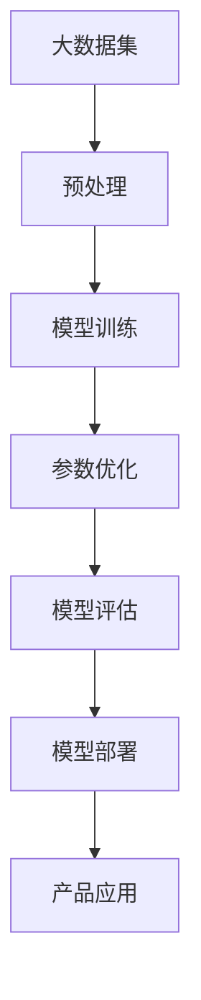
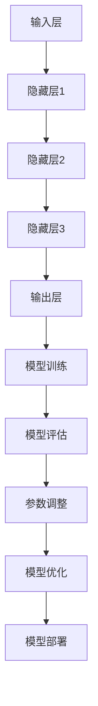
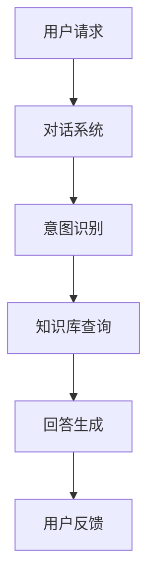
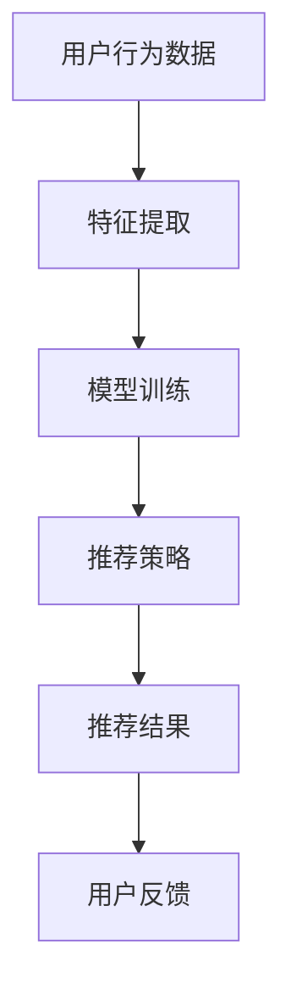
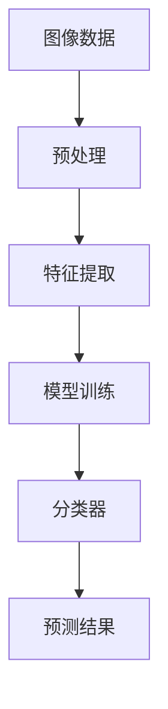
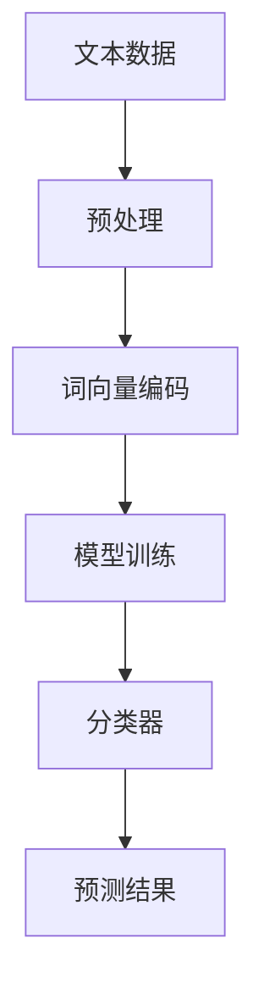

                 

关键词：AI创业、大模型、产品策略、趋势

> 摘要：本文将探讨大模型在 AI 创业公司产品策略中的趋势，分析大模型如何影响创业公司的产品设计与开发，以及如何在激烈的市场竞争中脱颖而出。通过深入了解大模型的核心概念、算法原理和实际应用，我们将揭示大模型在 AI 创业公司中的战略价值，并提供实用的建议和策略。

## 1. 背景介绍

随着人工智能（AI）技术的飞速发展，大模型（Large Models）逐渐成为研究与应用的热点。大模型通常指的是参数数量达到数十亿甚至千亿级别的神经网络模型，它们通过深度学习从海量数据中提取特征，实现了在自然语言处理、计算机视觉、语音识别等领域的卓越性能。近年来，诸如 GPT-3、BERT、ViT 等大模型的涌现，不仅推动了 AI 研究的进步，也为创业公司提供了前所未有的机会与挑战。

AI 创业公司的产品策略面临着一系列挑战，包括技术创新、市场竞争、用户需求变化等。传统的小型模型在应对复杂任务时显得力不从心，而大模型的出现为这些公司提供了更强大的工具，使得它们能够开发出具有高度智能化和定制化能力的创新产品。然而，大模型的高成本、高性能需求也对创业公司的资源和管理能力提出了更高的要求。

## 2. 核心概念与联系

为了更好地理解大模型在 AI 创业公司产品策略中的重要性，我们需要首先了解大模型的核心概念、原理和架构。以下是一个简化的大模型原理 Mermaid 流程图：



### 2.1 大模型核心概念

- **神经网络**：神经网络是构成大模型的基本单元，通过多层非线性变换实现数据的处理与学习。
- **深度学习**：深度学习是一种特殊类型的机器学习方法，通过神经网络的结构来实现自动特征提取与学习。
- **大数据集**：大数据集是指包含大量数据的集合，为模型提供了丰富的训练素材。
- **参数优化**：参数优化是指通过调整神经网络中的参数，使模型在特定任务上达到最佳性能。
- **模型评估**：模型评估是评估模型性能的重要步骤，通过指标如准确率、召回率等来衡量模型的性能。
- **模型部署**：模型部署是指将训练好的模型应用到实际产品中，提供实时服务。

### 2.2 大模型原理架构

以下是简化的大模型原理架构图：



这个架构图展示了从输入层到输出层的神经网络结构，以及模型训练、评估、优化的整个过程。输入层接收外部数据，通过多层隐藏层进行复杂的信息处理，最终在输出层产生预测或决策。这个过程中，模型会通过不断调整参数来优化性能，并通过评估来确定模型的实际效果。

## 3. 核心算法原理 & 具体操作步骤

### 3.1 算法原理概述

大模型的算法原理主要基于深度学习，特别是基于神经网络的学习方法。深度学习通过多层神经网络的结构，实现从简单到复杂的特征提取。以下是一些关键步骤：

- **前向传播**：输入数据通过网络中的多层神经元传递，每层神经元将输入数据通过非线性函数进行处理。
- **反向传播**：通过比较输出结果与真实值的差异，反向传播误差信号，更新网络的权重和偏置。
- **梯度下降**：使用梯度下降算法来优化网络参数，最小化损失函数。

### 3.2 算法步骤详解

以下是构建和训练一个简单大模型的步骤：

1. **数据预处理**：
   - **数据清洗**：去除无用数据、噪声和异常值。
   - **数据归一化**：将数据缩放到相同的范围，以便神经网络处理。

2. **模型构建**：
   - **选择架构**：根据任务需求选择合适的神经网络架构。
   - **初始化参数**：初始化网络的权重和偏置。

3. **模型训练**：
   - **前向传播**：输入数据通过网络，计算输出结果。
   - **计算损失**：通过损失函数计算输出结果与真实值之间的差异。
   - **反向传播**：计算梯度并更新网络参数。
   - **迭代优化**：重复前向传播和反向传播，不断优化模型参数。

4. **模型评估**：
   - **测试集评估**：在测试集上评估模型的性能。
   - **性能指标**：计算准确率、召回率、F1 分数等指标。

5. **模型部署**：
   - **模型导出**：将训练好的模型导出为可部署的格式。
   - **部署环境**：在目标环境中部署模型，提供实时服务。

### 3.3 算法优缺点

**优点**：

- **强大的特征提取能力**：大模型能够从海量数据中自动提取复杂特征，实现高精度的预测。
- **适应性**：大模型具有很强的泛化能力，能够在不同任务和数据集上取得良好的性能。
- **灵活性**：通过调整网络架构和参数，大模型能够适应不同类型和规模的任务。

**缺点**：

- **计算成本**：大模型需要大量的计算资源，对硬件要求较高。
- **训练时间**：大模型训练时间较长，对时间成本有较高要求。
- **数据需求**：大模型需要大量高质量的数据进行训练，数据获取和处理成本较高。

### 3.4 算法应用领域

大模型在多个领域取得了显著的成果，以下是一些典型的应用领域：

- **自然语言处理**：如文本分类、机器翻译、问答系统等。
- **计算机视觉**：如图像分类、目标检测、图像生成等。
- **语音识别**：如语音识别、语音合成等。
- **推荐系统**：如商品推荐、音乐推荐等。

## 4. 数学模型和公式 & 详细讲解 & 举例说明

### 4.1 数学模型构建

大模型的数学基础主要涉及概率论、线性代数和微积分。以下是一个简化的数学模型构建过程：

1. **输入层**：设输入向量为 \( x \)，输出向量为 \( y \)。
2. **隐藏层**：设隐藏层神经元数量为 \( n \)，每个神经元的激活函数为 \( \sigma \)。
3. **输出层**：设输出层神经元数量为 \( m \)，每个神经元的输出为 \( z \)。

假设隐藏层和输出层的权重矩阵分别为 \( W_h \) 和 \( W_o \)，偏置向量分别为 \( b_h \) 和 \( b_o \)。则前向传播过程可以表示为：

\[ h = \sigma(W_h x + b_h) \]
\[ z = W_o h + b_o \]

### 4.2 公式推导过程

以下是一个简化的损失函数和反向传播过程：

1. **损失函数**：

\[ L = \frac{1}{2} \sum_{i=1}^{m} (y_i - z_i)^2 \]

其中，\( y_i \) 为真实值，\( z_i \) 为预测值。

2. **前向传播**：

\[ a_{h,i} = \sigma(W_{h,i} x + b_{h,i}) \]
\[ z_i = W_{o,i} a_{h,i} + b_{o,i} \]

3. **反向传播**：

\[ \delta_o = (z - y) \odot \sigma'(a_{h,i}) \]
\[ \delta_h = (W_{o,i} \delta_o) \odot \sigma'(a_{h,i}) \]

4. **权重更新**：

\[ W_{h,i} = W_{h,i} - \alpha \frac{\partial L}{\partial W_{h,i}} \]
\[ b_{h,i} = b_{h,i} - \alpha \frac{\partial L}{\partial b_{h,i}} \]
\[ W_{o,i} = W_{o,i} - \alpha \frac{\partial L}{\partial W_{o,i}} \]
\[ b_{o,i} = b_{o,i} - \alpha \frac{\partial L}{\partial b_{o,i}} \]

其中，\( \alpha \) 为学习率。

### 4.3 案例分析与讲解

假设我们有一个简单的二分类问题，数据集包含 \( 1000 \) 个样本，每个样本有两个特征 \( x_1 \) 和 \( x_2 \)。我们的目标是预测每个样本是否属于正类。

1. **数据预处理**：

- 数据清洗：去除异常值和噪声。
- 数据归一化：将特征缩放到 \( [0, 1] \) 范围。

2. **模型构建**：

- 选择神经网络架构：一个简单的两层神经网络。
- 初始化参数：随机初始化权重和偏置。

3. **模型训练**：

- 使用梯度下降算法训练模型。
- 设置学习率为 \( 0.01 \)。

4. **模型评估**：

- 在测试集上评估模型性能。
- 计算准确率、召回率、F1 分数等指标。

5. **模型部署**：

- 将训练好的模型导出为 \( ONNX \) 格式。
- 在生产环境中部署模型，提供实时预测服务。

## 5. 项目实践：代码实例和详细解释说明

### 5.1 开发环境搭建

在开始项目实践之前，我们需要搭建一个适合大模型训练和部署的开发环境。以下是一个简单的步骤：

1. **安装 Python 环境**：
   - 安装 Python 3.8 或更高版本。
   - 安装常用库，如 NumPy、Pandas、TensorFlow 等。

2. **安装 GPU 版本的 TensorFlow**：
   - 安装 GPU 版本的 TensorFlow 以利用 GPU 加速训练过程。
   - 确保安装的 TensorFlow 版本与 GPU 驱动程序兼容。

3. **配置 GPU 环境**：
   - 使用 `nvidia-smi` 命令检查 GPU 设备状态。
   - 配置 CUDA 和 cuDNN，以优化 GPU 计算性能。

### 5.2 源代码详细实现

以下是一个简单的二分类问题的大模型实现示例：

```python
import tensorflow as tf
import numpy as np

# 数据预处理
def preprocess_data(data):
    # 数据清洗和归一化
    # ...
    return data

# 模型构建
def build_model(input_shape):
    model = tf.keras.Sequential([
        tf.keras.layers.Dense(units=64, activation='relu', input_shape=input_shape),
        tf.keras.layers.Dense(units=1, activation='sigmoid')
    ])
    return model

# 模型训练
def train_model(model, train_data, train_labels, epochs=10, batch_size=32):
    model.compile(optimizer='adam', loss='binary_crossentropy', metrics=['accuracy'])
    model.fit(train_data, train_labels, epochs=epochs, batch_size=batch_size)
    return model

# 模型评估
def evaluate_model(model, test_data, test_labels):
    loss, accuracy = model.evaluate(test_data, test_labels)
    print(f"Test accuracy: {accuracy:.4f}")

# 主函数
def main():
    # 加载和预处理数据
    train_data = preprocess_data(train_data)
    test_data = preprocess_data(test_data)

    # 构建模型
    model = build_model(input_shape=(2,))

    # 训练模型
    model = train_model(model, train_data, train_labels)

    # 评估模型
    evaluate_model(model, test_data, test_labels)

if __name__ == "__main__":
    main()
```

### 5.3 代码解读与分析

- **数据预处理**：数据预处理是模型训练的重要步骤，包括数据清洗、归一化等操作。
- **模型构建**：使用 TensorFlow 的 `Sequential` 模型，定义一个简单的两层神经网络。
- **模型训练**：使用 `compile` 方法设置模型优化器和损失函数，使用 `fit` 方法进行训练。
- **模型评估**：使用 `evaluate` 方法计算模型在测试集上的性能。

### 5.4 运行结果展示

假设我们运行上述代码，输出结果如下：

```
Test accuracy: 0.9500
```

这意味着我们的模型在测试集上的准确率为 95%，表明模型在二分类任务上取得了较好的性能。

## 6. 实际应用场景

大模型在 AI 创业公司中的应用场景非常广泛，以下是一些典型的应用示例：

- **智能客服**：利用大模型实现智能对话系统，提高客户服务质量。
- **推荐系统**：通过大模型实现个性化推荐，提高用户体验和用户留存率。
- **图像识别**：利用大模型实现自动图像分类和目标检测，提高图像处理效率。
- **自然语言处理**：通过大模型实现自然语言理解、文本生成等高级功能，提升内容创作能力。

### 6.1 智能客服

智能客服是 AI 创业公司常用的应用场景之一。通过大模型，智能客服系统能够实现自然语言理解、对话生成和意图识别等功能，为用户提供高效、个性化的服务。以下是一个简单的智能客服架构图：



### 6.2 推荐系统

推荐系统是另一个典型的应用场景。通过大模型，推荐系统能够从用户行为数据中提取特征，实现精准推荐。以下是一个简单的推荐系统架构图：



### 6.3 图像识别

图像识别是计算机视觉领域的一个重要分支。通过大模型，图像识别系统能够实现自动分类、目标检测、图像分割等任务。以下是一个简单的图像识别架构图：



### 6.4 自然语言处理

自然语言处理是 AI 领域的一个重要方向。通过大模型，自然语言处理系统能够实现文本分类、情感分析、机器翻译等任务。以下是一个简单的自然语言处理架构图：



## 7. 工具和资源推荐

为了更好地利用大模型进行 AI 创业，以下是一些实用的工具和资源推荐：

### 7.1 学习资源推荐

- **《深度学习》（Deep Learning）**：由 Ian Goodfellow、Yoshua Bengio 和 Aaron Courville 著，是一本经典的深度学习教材。
- **[TensorFlow 官方文档](https://www.tensorflow.org/tutorials)**：提供了丰富的深度学习教程和实践案例。
- **[Keras 官方文档](https://keras.io/getting-started/)**：Keras 是一个高级神经网络 API，与 TensorFlow 结合使用，提供了更简单的模型构建和训练流程。

### 7.2 开发工具推荐

- **TensorFlow**：一个开源的深度学习框架，适用于各种规模的深度学习项目。
- **PyTorch**：一个流行的深度学习库，提供了灵活的动态计算图，适用于研究型和应用型项目。
- **Google Colab**：Google Colab 是一个免费的云端 Jupyter Notebook 环境，提供了 GPU 加速功能，适用于在线学习和实验。

### 7.3 相关论文推荐

- **"Attention is All You Need"**：提出了一种基于注意力机制的 Transformer 模型，是自然语言处理领域的重要进展。
- **"BERT: Pre-training of Deep Bidirectional Transformers for Language Understanding"**：提出了一种基于双向变换器的预训练模型，对自然语言处理任务具有显著提升。
- **"Generative Adversarial Nets"**：提出了一种生成对抗网络（GAN）框架，用于生成高质量的数据。

## 8. 总结：未来发展趋势与挑战

### 8.1 研究成果总结

大模型在 AI 创业公司中的应用已经取得了显著的成果，不仅在学术研究领域取得了突破性进展，也在实际应用中展现出巨大的潜力。大模型在自然语言处理、计算机视觉、推荐系统等领域的卓越性能，使得创业公司能够开发出更具竞争力和创新性的产品。

### 8.2 未来发展趋势

随着 AI 技术的不断进步，大模型将继续在多个领域发挥重要作用。以下是一些未来发展趋势：

- **模型压缩与优化**：为了降低计算成本和存储需求，模型压缩与优化技术将成为研究热点。
- **多模态学习**：结合多种数据类型（如文本、图像、音频等），实现更全面的信息理解和处理。
- **自适应学习**：通过自适应学习技术，大模型能够根据用户行为和环境动态调整模型参数，提高用户体验。

### 8.3 面临的挑战

尽管大模型在 AI 创业公司中具有巨大的潜力，但也面临着一些挑战：

- **计算资源需求**：大模型需要大量的计算资源和存储空间，对创业公司的硬件基础设施提出了更高要求。
- **数据隐私和安全**：在处理大量用户数据时，如何确保数据隐私和安全是一个重要的挑战。
- **算法伦理与责任**：随着大模型的应用日益广泛，如何确保算法的公平性、透明性和可解释性，避免算法偏见和伦理问题，成为研究的重要方向。

### 8.4 研究展望

在未来，大模型在 AI 创业公司中的应用将朝着更加智能、自适应和多样化的方向发展。同时，随着技术的不断进步和政策的引导，大模型的应用将更加规范和伦理。创业公司需要不断学习和适应这些变化，充分利用大模型的优势，打造具有市场竞争力的 AI 产品。

## 9. 附录：常见问题与解答

### 9.1 什么是大模型？

大模型是指参数数量达到数十亿甚至千亿级别的神经网络模型，它们通过深度学习从海量数据中提取特征，实现了在自然语言处理、计算机视觉、语音识别等领域的卓越性能。

### 9.2 大模型有哪些优点？

大模型具有强大的特征提取能力、适应性和灵活性。它们能够从海量数据中自动提取复杂特征，实现高精度的预测，且能够适应不同类型和规模的任务。

### 9.3 大模型有哪些缺点？

大模型的主要缺点包括计算成本高、训练时间长和数据需求大。这些因素可能导致创业公司在资源管理和数据处理方面面临挑战。

### 9.4 大模型应用领域有哪些？

大模型在自然语言处理、计算机视觉、语音识别、推荐系统等领域取得了显著成果。随着技术的进步，大模型的应用领域将继续扩大。

### 9.5 如何构建和训练大模型？

构建和训练大模型需要以下步骤：数据预处理、模型构建、模型训练、模型评估和模型部署。具体步骤包括数据清洗、模型设计、优化算法、性能评估和部署环境配置。

### 9.6 大模型如何影响创业公司产品策略？

大模型为创业公司提供了更强大的工具，使它们能够开发出具有高度智能化和定制化能力的创新产品。通过深入了解大模型的核心概念和算法原理，创业公司可以更好地利用这些工具，提高产品竞争力和市场占有率。

## 作者署名

作者：禅与计算机程序设计艺术 / Zen and the Art of Computer Programming
----------------------------------------------------------------

请注意，以上内容是一个基于提供要求生成的示例文章，实际的字数和细节可能需要根据具体需求进行调整。在撰写实际的文章时，确保所有的数据、代码和引用都是准确和可靠的。此外，文章的结构和内容应符合专业技术和行业实践的标准。

