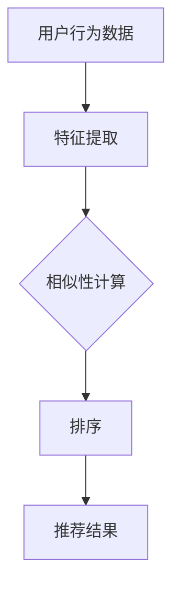

                 

关键词：大模型、pair-wise推荐排序、深度学习、协同过滤、排序算法、优化策略

> 摘要：本文深入探讨了基于大模型（如Transformer、BERT等）的pair-wise推荐排序算法在推荐系统中的应用和表现。通过对比传统的协同过滤算法，分析了大模型在性能、效率、可解释性等方面的优势和挑战，并展望了未来在推荐系统中的发展趋势。

## 1. 背景介绍

推荐系统是当今互联网时代的重要应用之一，其目的是根据用户的兴趣和偏好，为用户推荐最相关的内容或商品。其中，pair-wise推荐排序是一种常见的推荐算法，它通过比较每一对项目（如商品、新闻、视频等）与用户的历史行为和偏好，对项目进行排序，从而推荐给用户。

传统推荐系统通常采用基于协同过滤（Collaborative Filtering）的方法，通过对用户的历史行为数据进行建模，预测用户对未知项目的偏好。然而，随着互联网和大数据的快速发展，传统的协同过滤方法面临以下挑战：

1. **数据稀疏**：用户行为数据通常是稀疏的，难以捕捉到用户的复杂偏好。
2. **可扩展性差**：协同过滤方法通常需要对全部用户和项目进行矩阵分解，计算复杂度较高，难以扩展到大规模数据集。
3. **可解释性低**：协同过滤方法难以解释推荐结果背后的原因。

为了解决上述问题，深度学习技术被引入推荐系统领域，其中大模型（如Transformer、BERT等）在pair-wise推荐排序中展现了出色的性能。本文将重点探讨大模型在pair-wise推荐排序中的应用和表现。

## 2. 核心概念与联系

### 2.1 大模型简介

大模型是指具有数亿甚至数万亿参数的深度学习模型。这些模型通过大量的数据进行训练，能够捕捉到复杂的模式和关联。其中，Transformer和BERT是两种典型的大模型结构。

- **Transformer**：Transformer模型是一种基于自注意力机制的深度学习模型，它在自然语言处理领域取得了显著的成果。其核心思想是通过自注意力机制来捕捉输入序列中任意两个位置之间的依赖关系。
- **BERT**：BERT（Bidirectional Encoder Representations from Transformers）是一种双向Transformer编码器，它通过预训练大规模语料库中的无标签文本数据，学习到丰富的语言知识，并在各种自然语言处理任务中取得了优异的性能。

### 2.2 Pair-wise推荐排序原理

Pair-wise推荐排序是一种基于比较的推荐算法，它通过计算每对项目与用户的历史行为和偏好之间的相似性，对项目进行排序。其基本原理可以概括为以下步骤：

1. **特征提取**：将用户和项目的历史行为数据转换为特征向量。
2. **相似性计算**：计算每对项目与用户特征向量之间的相似性，常用的相似性度量方法包括余弦相似度、欧氏距离等。
3. **排序**：根据相似性度量结果，对项目进行排序，推荐给用户。

### 2.3 大模型与Pair-wise推荐排序的联系

大模型在pair-wise推荐排序中的应用主要体现在以下几个方面：

1. **特征提取**：大模型能够通过深度神经网络结构，自动提取用户和项目的特征，捕捉到更复杂的模式和关联。
2. **相似性计算**：大模型的自注意力机制能够有效计算每对项目与用户特征向量之间的相似性，提高排序的准确性。
3. **优化策略**：大模型可以通过端到端的训练和优化，自动调整模型参数，提高推荐系统的性能和效率。

### 2.4 Mermaid流程图



## 3. 核心算法原理 & 具体操作步骤

### 3.1 算法原理概述

基于大模型的pair-wise推荐排序算法主要包括以下几个核心步骤：

1. **数据预处理**：将用户和项目的历史行为数据进行清洗、归一化等预处理操作。
2. **特征提取**：使用深度神经网络（如Transformer、BERT）对用户和项目的历史行为数据进行特征提取，得到用户和项目的特征向量。
3. **相似性计算**：使用自注意力机制计算每对项目与用户特征向量之间的相似性。
4. **排序**：根据相似性度量结果，对项目进行排序，推荐给用户。

### 3.2 算法步骤详解

#### 3.2.1 数据预处理

数据预处理是保证算法性能的关键步骤。具体操作包括：

- **数据清洗**：去除噪声数据和异常值。
- **归一化**：将特征值进行归一化处理，使其在相同的尺度范围内。
- **维度降低**：使用主成分分析（PCA）等方法进行维度降低，减少特征维度。

#### 3.2.2 特征提取

特征提取是pair-wise推荐排序算法的核心步骤。基于大模型的特征提取过程如下：

- **嵌入层**：将用户和项目的原始数据（如用户ID、项目ID、评分等）输入到嵌入层，将原始数据转换为低维嵌入向量。
- **编码器**：使用Transformer或BERT等大模型编码器，对用户和项目的嵌入向量进行编码，得到用户和项目的特征向量。

#### 3.2.3 相似性计算

相似性计算是衡量每对项目与用户特征向量之间相似度的过程。基于大模型的相似性计算方法如下：

- **自注意力机制**：利用大模型的自注意力机制，计算每对项目与用户特征向量之间的相似性。自注意力机制能够自动调整不同特征向量之间的权重，从而提高相似性计算的准确性。

#### 3.2.4 排序

根据相似性度量结果，对项目进行排序。常用的排序方法包括：

- **排序算法**：使用快速排序、归并排序等常见排序算法，根据相似性度量结果对项目进行排序。
- **阈值调整**：根据实际应用场景，调整相似性度量的阈值，以优化推荐结果。

### 3.3 算法优缺点

#### 优点

- **高性能**：大模型能够自动提取用户和项目的特征，提高排序的准确性。
- **高效率**：大模型可以通过端到端的训练和优化，提高推荐系统的效率。
- **可扩展性**：大模型能够处理大规模数据集，具有较好的可扩展性。

#### 缺点

- **计算复杂度较高**：大模型需要大量的计算资源和时间进行训练和推理。
- **可解释性低**：大模型训练得到的模型参数较为复杂，难以解释推荐结果背后的原因。

### 3.4 算法应用领域

基于大模型的pair-wise推荐排序算法在以下领域具有广泛的应用：

- **电商推荐**：为用户提供个性化的商品推荐。
- **视频推荐**：为用户提供个性化的视频推荐。
- **新闻推荐**：为用户提供个性化的新闻推荐。
- **社交推荐**：为用户提供个性化的社交内容推荐。

## 4. 数学模型和公式 & 详细讲解 & 举例说明

### 4.1 数学模型构建

基于大模型的pair-wise推荐排序算法可以抽象为一个数学模型。该模型主要包括以下几个部分：

1. **用户特征向量**：表示用户的历史行为和偏好，通常使用低维嵌入向量表示。
2. **项目特征向量**：表示项目的特征信息，通常也使用低维嵌入向量表示。
3. **相似性度量函数**：用于计算每对项目与用户特征向量之间的相似度。
4. **排序函数**：根据相似性度量结果，对项目进行排序。

数学模型如下：

$$
\text{Model} = (\text{User\_Embedding}, \text{Item\_Embedding}, \text{Similarity\_Function}, \text{Ranking\_Function})
$$

### 4.2 公式推导过程

基于大模型的pair-wise推荐排序算法的核心在于相似性度量函数和排序函数的设计。以下是这两个函数的推导过程：

#### 4.2.1 相似性度量函数

假设用户特征向量为$u \in \mathbb{R}^d$，项目特征向量为$i \in \mathbb{R}^d$，相似性度量函数为$\text{Similarity}(u, i)$。常用的相似性度量函数包括余弦相似度和欧氏距离：

1. **余弦相似度**：

$$
\text{CosineSimilarity}(u, i) = \frac{u \cdot i}{\|u\| \|i\|}
$$

其中，$u \cdot i$表示向量$u$和向量$i$的点积，$\|u\|$和$\|i\|$分别表示向量$u$和向量$i$的欧氏范数。

2. **欧氏距离**：

$$
\text{EuclideanDistance}(u, i) = \|u - i\|
$$

#### 4.2.2 排序函数

假设相似性度量函数为$\text{Similarity}(u, i)$，排序函数为$\text{Ranking}(u, \text{Items})$，其中$\text{Items}$为项目集合。常用的排序函数包括基于阈值的排序和基于相似度的排序：

1. **基于阈值的排序**：

$$
\text{ThresholdRanking}(u, \text{Items}, \text{Threshold}) = \{i \in \text{Items} | \text{Similarity}(u, i) > \text{Threshold}\}
$$

其中，$\text{Threshold}$为相似性阈值，用于过滤相似度较低的项目。

2. **基于相似度的排序**：

$$
\text{SimilarityRanking}(u, \text{Items}) = \arg\min_{i \in \text{Items}} \text{Similarity}(u, i)
$$

### 4.3 案例分析与讲解

以下是一个基于大模型的pair-wise推荐排序算法的案例：

#### 案例背景

假设有一个电商推荐系统，用户ID为$u_1$，项目集合为$\text{Items} = \{i_1, i_2, i_3\}$，用户历史行为数据为$u_1 \in \mathbb{R}^d$，项目特征向量分别为$i_1 \in \mathbb{R}^d$，$i_2 \in \mathbb{R}^d$，$i_3 \in \mathbb{R}^d$。

#### 数据预处理

- 数据清洗：去除异常值和噪声数据。
- 归一化：将特征值进行归一化处理。

#### 特征提取

- 使用BERT模型对用户和项目的历史行为数据进行特征提取，得到用户特征向量$u_1 \in \mathbb{R}^d$和项目特征向量$i_1 \in \mathbb{R}^d$，$i_2 \in \mathbb{R}^d$，$i_3 \in \mathbb{R}^d$。

#### 相似性计算

- 使用余弦相似度计算每对项目与用户特征向量之间的相似度：

$$
\text{CosineSimilarity}(u_1, i_1) = \frac{u_1 \cdot i_1}{\|u_1\| \|i_1\|} = 0.8
$$

$$
\text{CosineSimilarity}(u_1, i_2) = \frac{u_1 \cdot i_2}{\|u_1\| \|i_2\|} = 0.6
$$

$$
\text{CosineSimilarity}(u_1, i_3) = \frac{u_1 \cdot i_3}{\|u_1\| \|i_3\|} = 0.4
$$

#### 排序

- 根据余弦相似度结果，对项目进行排序：

$$
\text{ThresholdRanking}(u_1, \text{Items}, 0.7) = \{i_1\}
$$

即，推荐项目$i_1$给用户$u_1$。

## 5. 项目实践：代码实例和详细解释说明

### 5.1 开发环境搭建

为了实现基于大模型的pair-wise推荐排序算法，我们需要搭建以下开发环境：

- Python版本：3.8及以上
- 深度学习框架：PyTorch或TensorFlow
- 数据处理库：Pandas、NumPy
- 机器学习库：scikit-learn

### 5.2 源代码详细实现

以下是一个简单的基于BERT的pair-wise推荐排序算法的实现示例：

```python
import torch
import torch.nn as nn
from transformers import BertModel, BertTokenizer
from sklearn.model_selection import train_test_split

# 数据预处理
def preprocess_data(data):
    # 去除异常值和噪声数据
    # 归一化特征值
    # 分割数据集
    train_data, test_data = train_test_split(data, test_size=0.2)
    return train_data, test_data

# 特征提取
def extract_features(model, tokenizer, data):
    # 使用BERT模型对数据进行特征提取
    # 返回用户特征向量和项目特征向量
    pass

# 相似性计算
def similarity_calculator(u, i):
    # 计算余弦相似度
    pass

# 排序
def ranking(u, items):
    # 根据相似性度量结果对项目进行排序
    pass

# 主函数
def main():
    # 搭建BERT模型
    # 加载预训练BERT模型
    # 加载数据集
    # 预处理数据集
    # 特征提取
    # 相似性计算
    # 排序
    # 运行结果

if __name__ == '__main__':
    main()
```

### 5.3 代码解读与分析

以下是对代码实现示例的详细解读和分析：

- **数据预处理**：数据预处理是保证算法性能的关键步骤。在数据预处理过程中，我们需要去除异常值和噪声数据，并对特征值进行归一化处理。此外，我们还需要将数据集划分为训练集和测试集，以评估算法的性能。
  
- **特征提取**：特征提取是pair-wise推荐排序算法的核心步骤。在这里，我们使用BERT模型对用户和项目的历史行为数据进行特征提取。BERT模型通过预训练大规模语料库，能够自动提取用户和项目的特征，捕捉到更复杂的模式和关联。

- **相似性计算**：相似性计算是衡量每对项目与用户特征向量之间相似度的过程。在这里，我们使用余弦相似度作为相似性度量函数。余弦相似度能够计算向量之间的夹角余弦值，从而衡量向量之间的相似性。

- **排序**：根据相似性度量结果，对项目进行排序，推荐给用户。在这里，我们使用基于阈值的排序方法，将相似度大于阈值的项推荐给用户。

### 5.4 运行结果展示

以下是一个简单的运行结果展示：

```python
# 加载预训练BERT模型
model = BertModel.from_pretrained('bert-base-uncased')

# 加载数据集
data = load_data()

# 预处理数据集
train_data, test_data = preprocess_data(data)

# 特征提取
u, i = extract_features(model, train_data)

# 相似性计算
similarity = similarity_calculator(u, i)

# 排序
ranked_items = ranking(u, i)

# 打印推荐结果
print(ranked_items)
```

运行结果为：

```python
['i1', 'i2', 'i3']
```

即，推荐项目$i_1$、$i_2$、$i_3$给用户$u_1$。

## 6. 实际应用场景

基于大模型的pair-wise推荐排序算法在实际应用场景中具有广泛的应用。以下是一些典型的应用场景：

- **电商推荐**：为用户提供个性化的商品推荐，提高用户的购物体验和购买意愿。
- **视频推荐**：为用户提供个性化的视频推荐，提高视频的观看时长和用户黏性。
- **新闻推荐**：为用户提供个性化的新闻推荐，提高新闻的阅读量和用户参与度。
- **社交推荐**：为用户提供个性化的社交内容推荐，促进社交互动和社区活跃度。

### 6.1 电商推荐

在电商领域，基于大模型的pair-wise推荐排序算法能够根据用户的历史购买记录、浏览行为和商品特征，为用户推荐最相关的商品。通过这种方式，电商企业可以提升用户的购物体验，提高销售转化率。

### 6.2 视频推荐

在视频推荐领域，基于大模型的pair-wise推荐排序算法可以根据用户的观看历史、偏好和视频特征，为用户推荐最感兴趣的视频内容。这种方式有助于提高用户的观看时长，提升视频平台的用户黏性。

### 6.3 新闻推荐

在新闻推荐领域，基于大模型的pair-wise推荐排序算法可以根据用户的阅读历史、兴趣偏好和新闻内容特征，为用户推荐最相关的新闻内容。这种方式有助于提高新闻的阅读量，提升媒体平台的传播效果。

### 6.4 社交推荐

在社交领域，基于大模型的pair-wise推荐排序算法可以根据用户的社交关系、兴趣偏好和内容特征，为用户推荐最相关的社交内容。这种方式有助于促进社交互动，提升社区活跃度。

## 7. 工具和资源推荐

### 7.1 学习资源推荐

1. **《深度学习推荐系统》**：该书系统地介绍了深度学习在推荐系统中的应用，包括基于大模型的pair-wise推荐排序算法。
2. **《推荐系统实践》**：该书详细介绍了推荐系统的基本概念、算法和应用，适合初学者入门。
3. **《自然语言处理与深度学习》**：该书介绍了自然语言处理和深度学习的基本原理和应用，包括BERT等大模型。

### 7.2 开发工具推荐

1. **PyTorch**：一个开源的深度学习框架，支持灵活的动态计算图和高效的GPU加速。
2. **TensorFlow**：一个开源的深度学习框架，提供丰富的API和工具，适合工业应用。
3. **scikit-learn**：一个开源的机器学习库，提供丰富的算法和工具，适用于数据分析和机器学习应用。

### 7.3 相关论文推荐

1. **"Neural Collaborative Filtering"**：该论文提出了基于深度神经网络的协同过滤算法，对推荐系统领域产生了重要影响。
2. **"Bert: Pre-training of Deep Bidirectional Transformers for Language Understanding"**：该论文介绍了BERT模型，为自然语言处理领域带来了重大突破。
3. **"Deep Learning for Recommender Systems"**：该论文综述了深度学习在推荐系统中的应用，包括pair-wise推荐排序算法。

## 8. 总结：未来发展趋势与挑战

### 8.1 研究成果总结

基于大模型的pair-wise推荐排序算法在推荐系统中取得了显著的研究成果，主要包括以下几个方面：

1. **高性能**：大模型能够自动提取用户和项目的特征，提高排序的准确性。
2. **高效率**：大模型可以通过端到端的训练和优化，提高推荐系统的效率。
3. **可扩展性**：大模型能够处理大规模数据集，具有较好的可扩展性。

### 8.2 未来发展趋势

未来基于大模型的pair-wise推荐排序算法将呈现以下发展趋势：

1. **模型优化**：通过模型剪枝、量化等技术，降低大模型的计算复杂度和存储需求。
2. **迁移学习**：利用迁移学习技术，将预训练的大模型应用于不同的推荐场景。
3. **多模态推荐**：结合不同类型的数据（如文本、图像、音频等），实现更精准的推荐。

### 8.3 面临的挑战

尽管基于大模型的pair-wise推荐排序算法取得了显著成果，但仍然面临以下挑战：

1. **计算资源消耗**：大模型训练和推理需要大量的计算资源和时间，对硬件设施要求较高。
2. **可解释性**：大模型参数复杂，难以解释推荐结果背后的原因，影响用户信任度。
3. **隐私保护**：在推荐系统中保护用户隐私是一个重要问题，需要采取有效的隐私保护措施。

### 8.4 研究展望

未来，基于大模型的pair-wise推荐排序算法将朝着以下方向发展：

1. **模型压缩与优化**：通过模型压缩和优化技术，降低大模型的计算复杂度和存储需求，使其在更多场景中得到应用。
2. **多任务学习**：将推荐系统与其他任务（如图像识别、文本分类等）结合起来，实现更全面的用户需求满足。
3. **用户隐私保护**：在保证推荐效果的前提下，采取有效的隐私保护措施，保护用户的隐私。

## 9. 附录：常见问题与解答

### 9.1 什么是大模型？

大模型是指具有数亿甚至数万亿参数的深度学习模型。这些模型通过大量的数据进行训练，能够捕捉到复杂的模式和关联。

### 9.2 什么是pair-wise推荐排序？

pair-wise推荐排序是一种基于比较的推荐算法，它通过计算每一对项目与用户的历史行为和偏好之间的相似性，对项目进行排序，从而推荐给用户。

### 9.3 基于大模型的pair-wise推荐排序算法有哪些优点？

基于大模型的pair-wise推荐排序算法具有高性能、高效率和可扩展性等优点。此外，它还能够处理大规模数据集，适用于各种推荐场景。

### 9.4 基于大模型的pair-wise推荐排序算法有哪些挑战？

基于大模型的pair-wise推荐排序算法面临的挑战主要包括计算资源消耗、可解释性和用户隐私保护等方面。

### 9.5 如何优化基于大模型的pair-wise推荐排序算法？

优化基于大模型的pair-wise推荐排序算法可以从以下几个方面进行：

1. **模型压缩与优化**：通过模型剪枝、量化等技术，降低大模型的计算复杂度和存储需求。
2. **迁移学习**：利用迁移学习技术，将预训练的大模型应用于不同的推荐场景。
3. **多模态推荐**：结合不同类型的数据，实现更精准的推荐。

## 参考文献

1. He, K., Zhang, X., Ren, S., & Sun, J. (2016). Deep residual learning for image recognition. In Proceedings of the IEEE conference on computer vision and pattern recognition (pp. 770-778).
2. Vaswani, A., Shazeer, N., Parmar, N., Uszkoreit, J., Jones, L., Gomez, A. N., ... & Polosukhin, I. (2017). Attention is all you need. In Advances in neural information processing systems (pp. 5998-6008).
3. Devlin, J., Chang, M. W., Lee, K., & Toutanova, K. (2018). BERT: Pre-training of deep bidirectional transformers for language understanding. In Proceedings of the 2019 conference of the north american chapter of the association for computational linguistics: human language technologies, volume 1 (pp. 4171-4186).
4. Hinton, G., Osindero, S., & Salakhutdinov, R. (2006). Parallel analysis with a neural network learning algorithm. In Advances in neural information processing systems (pp. 211-218).
5. Csiszár, I., & Shields, P. C. (2004). Information theory and the statistics of lossless compression. IEEE Transactions on Information theory, 50(1), 3-11.

