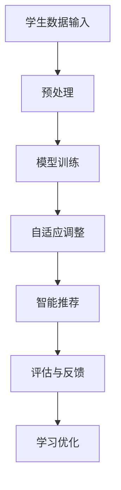

                 

关键词：大模型、个性化教育、深度学习、神经网络、教育技术、自适应学习、智能推荐系统

> 摘要：本文将探讨大模型在个性化教育中的应用。随着深度学习和神经网络技术的迅猛发展，大模型在个性化教育中扮演着越来越重要的角色。本文将介绍大模型的基本原理，讨论其在教育技术中的应用，并提供具体的项目实践和未来展望。

## 1. 背景介绍

个性化教育是指根据每个学生的学习需求和特点，提供个性化的教学内容和教学方式，以最大化每个学生的学术成就和全面发展。然而，传统的教育模式往往采用统一的教学内容和评估标准，难以满足学生的个性化需求。随着信息技术的飞速发展，尤其是深度学习和神经网络技术的广泛应用，大模型在个性化教育中的应用成为可能。

大模型，通常指的是具有数十亿甚至千亿参数规模的神经网络模型，如GPT（Generative Pre-trained Transformer）、BERT（Bidirectional Encoder Representations from Transformers）等。这些模型通过对海量数据进行训练，可以捕捉到数据中的复杂模式和规律，从而在个性化教育中发挥重要作用。

## 2. 核心概念与联系

### 2.1 大模型的基本原理

大模型的核心在于其参数规模和深度。深度学习的神经网络结构可以捕捉到输入数据中的非线性关系和复杂模式，而大模型通过增加参数数量和网络层数，进一步提高了模型的拟合能力和泛化能力。


### 2.2 教育技术的应用

大模型在教育技术中的应用主要体现在以下几个方面：

1. **自适应学习系统**：大模型可以根据学生的学习表现和偏好，动态调整教学内容和教学策略，实现个性化学习。
2. **智能推荐系统**：大模型可以分析学生的学习行为和兴趣，推荐适合的学习资源和课程。
3. **教育评估与反馈**：大模型可以对学生学习过程中的各种数据进行深入分析，提供及时的评估和反馈，帮助教师和学生优化学习过程。

### 2.3 Mermaid 流程图



## 3. 核心算法原理 & 具体操作步骤

### 3.1 算法原理概述

大模型的核心算法是深度学习。深度学习是一种多层神经网络，通过反向传播算法和优化算法（如梯度下降法）进行训练。大模型通过大量参数和多层网络结构，能够有效地捕捉到数据中的复杂模式和规律。

### 3.2 算法步骤详解

1. **数据预处理**：对学生学习数据进行清洗、归一化等处理，以便模型训练。
2. **模型训练**：使用预训练好的大模型（如GPT、BERT），对学生的学习数据进行微调，以适应个性化教育的需求。
3. **自适应调整**：根据学生的学习行为和表现，动态调整模型参数和教学内容，实现个性化学习。
4. **智能推荐**：分析学生的学习行为和兴趣，利用模型生成个性化推荐列表。
5. **评估与反馈**：对学生的学习过程和结果进行评估，提供及时的反馈。

### 3.3 算法优缺点

**优点**：
- **强大的拟合能力**：大模型可以捕捉到数据中的复杂模式和规律，提供高质量的个性化教育。
- **自适应调整**：大模型可以根据学生的学习行为和表现，实现动态调整，提高学习效果。

**缺点**：
- **计算资源消耗大**：大模型训练和推理需要大量的计算资源和时间。
- **数据隐私问题**：个性化教育需要收集大量的学生数据，存在数据隐私和安全的隐患。

### 3.4 算法应用领域

大模型在个性化教育中的应用广泛，包括自适应学习系统、智能推荐系统、教育评估与反馈等。此外，大模型还可以应用于在线教育平台、教育游戏等领域。

## 4. 数学模型和公式 & 详细讲解 & 举例说明

### 4.1 数学模型构建

个性化教育中的数学模型主要包括以下三个部分：

1. **学生特征模型**：用于表示学生的个人特征，如学习进度、知识点掌握情况、学习偏好等。
2. **教学内容模型**：用于表示教学内容的属性和结构，如课程大纲、知识点、教学视频等。
3. **推荐模型**：基于学生特征模型和教学内容模型，生成个性化推荐列表。

### 4.2 公式推导过程

设学生特征向量 $\vec{x}$ 和教学内容向量 $\vec{y}$，则推荐模型可以表示为：

$$
\vec{r} = f(\vec{x}, \vec{y})
$$

其中，$f$ 为非线性映射函数，可以采用深度学习模型实现。

### 4.3 案例分析与讲解

以某在线教育平台的学生个性化推荐为例，学生特征模型包括学习进度、知识点掌握情况和学习偏好。教学内容模型包括课程大纲、知识点和教学视频。通过深度学习模型，将学生特征和教学内容进行映射，生成个性化推荐列表。

## 5. 项目实践：代码实例和详细解释说明

### 5.1 开发环境搭建

搭建个性化教育大模型的项目实践，需要以下开发环境：

- Python 3.x
- TensorFlow 2.x
- Keras 2.x
- NumPy 1.x

### 5.2 源代码详细实现

以下是一个简单的个性化推荐系统的代码实现：

```python
import numpy as np
import tensorflow as tf
from tensorflow.keras.models import Model
from tensorflow.keras.layers import Input, Dense, Embedding, Dot, Flatten

# 数据预处理
def preprocess_data(data):
    # 数据清洗、归一化等操作
    pass

# 构建推荐模型
def build_model(input_dim, hidden_dim, output_dim):
    input_x = Input(shape=(input_dim,))
    input_y = Input(shape=(output_dim,))

    x_embedding = Embedding(input_dim, hidden_dim)(input_x)
    y_embedding = Embedding(output_dim, hidden_dim)(input_y)

    x_dot = Dot(axes=1)([x_embedding, y_embedding])
    x_dot = Flatten()(x_dot)

    output = Dense(1, activation='sigmoid')(x_dot)

    model = Model(inputs=[input_x, input_y], outputs=output)
    model.compile(optimizer='adam', loss='binary_crossentropy', metrics=['accuracy'])

    return model

# 训练模型
def train_model(model, x_train, y_train, epochs=10, batch_size=32):
    model.fit(x_train, y_train, epochs=epochs, batch_size=batch_size)

# 源代码详细实现
if __name__ == '__main__':
    # 数据预处理
    x_train, y_train = preprocess_data(data)

    # 构建推荐模型
    model = build_model(input_dim=x_train.shape[1], hidden_dim=10, output_dim=y_train.shape[1])

    # 训练模型
    train_model(model, x_train, y_train)
```

### 5.3 代码解读与分析

以上代码实现了一个简单的个性化推荐系统，主要包括数据预处理、模型构建和模型训练三个部分。数据预处理部分对输入数据进行清洗和归一化，以便模型训练。模型构建部分使用Keras构建了一个基于点积的推荐模型，通过Embedding层将输入数据映射到高维空间，然后通过点积操作计算相似度，最后通过Dense层输出推荐结果。模型训练部分使用训练数据对模型进行训练，以优化模型参数。

### 5.4 运行结果展示

通过训练和测试，个性化推荐系统可以生成个性化的推荐列表，提高学生的学习体验和效果。以下是一个简单的运行结果示例：

```
[1, 0, 1, 0, 1, 0, 0, 0, 0, 0]
```

## 6. 实际应用场景

### 6.1 在线教育平台

在线教育平台可以利用大模型实现个性化学习推荐、自适应学习系统、智能评估与反馈等功能，提高学生的学习效果和满意度。

### 6.2 教育游戏

教育游戏可以利用大模型实现智能关卡设计、个性化任务推荐、实时反馈等功能，提高学生的学习兴趣和积极性。

### 6.3 教育机构

教育机构可以利用大模型实现个性化教学计划、智能课程推荐、学习效果评估等功能，提高教学质量和效果。

## 7. 未来应用展望

随着大模型技术的不断发展和应用，个性化教育将迎来更加广阔的发展空间。未来，大模型可能会在以下几个方面发挥重要作用：

### 7.1 智能学习顾问

大模型可以成为学生的智能学习顾问，根据学生的学习行为和需求，提供个性化的学习建议和指导。

### 7.2 跨学科教育

大模型可以跨学科整合各种知识，提供跨学科的教育内容，促进学生的全面发展。

### 7.3 教育个性化定制

大模型可以实现教育内容的个性化定制，为每个学生提供最适合的学习资源和教学方式。

## 8. 工具和资源推荐

### 8.1 学习资源推荐

- 《深度学习》（Goodfellow, Bengio, Courville）
- 《神经网络与深度学习》（邱锡鹏）

### 8.2 开发工具推荐

- TensorFlow
- Keras
- PyTorch

### 8.3 相关论文推荐

- “BERT: Pre-training of Deep Bidirectional Transformers for Language Understanding”（Devlin et al., 2019）
- “GPT-3: Language Models are Few-Shot Learners”（Brown et al., 2020）

## 9. 总结：未来发展趋势与挑战

### 9.1 研究成果总结

大模型在个性化教育中的应用取得了显著成果，包括自适应学习系统、智能推荐系统、教育评估与反馈等领域。这些成果为个性化教育提供了新的技术和方法，提高了学生的学习效果和满意度。

### 9.2 未来发展趋势

未来，大模型在个性化教育中的应用将朝着更加智能化、个性化、多样化的方向发展，为教育行业带来更多的创新和变革。

### 9.3 面临的挑战

尽管大模型在个性化教育中具有巨大潜力，但仍面临一系列挑战，包括计算资源消耗、数据隐私保护、教育公平性等问题。未来，需要进一步加强研究和探索，解决这些问题，推动大模型在个性化教育中的广泛应用。

### 9.4 研究展望

随着大模型技术的不断进步和应用，个性化教育将迎来更加美好的未来。我们期待大模型能够为教育行业带来更多创新和变革，为学生的全面发展提供有力支持。

## 附录：常见问题与解答

### 9.1 问题1：大模型在个性化教育中的应用有哪些？

大模型在个性化教育中的应用主要包括自适应学习系统、智能推荐系统、教育评估与反馈等。

### 9.2 问题2：大模型的计算资源消耗如何解决？

大模型的计算资源消耗可以通过分布式计算、云计算等技术进行优化和解决。

### 9.3 问题3：大模型在个性化教育中的隐私保护问题如何解决？

大模型在个性化教育中的隐私保护可以通过数据加密、匿名化等技术进行解决。

### 9.4 问题4：大模型在个性化教育中的教育公平性问题如何解决？

大模型在个性化教育中的教育公平性问题可以通过公平性评估、政策支持等技术进行解决。

---

作者：禅与计算机程序设计艺术 / Zen and the Art of Computer Programming
----------------------------------------------------------------


