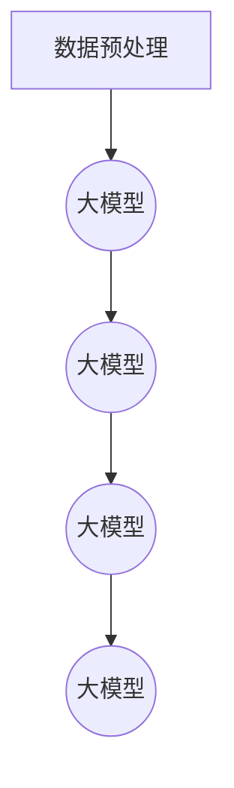

                 

关键词：大模型、列表排序、推荐系统、算法优化、数学模型

## 摘要

本文旨在探讨大模型在列表排序式推荐系统中的应用及其优越性。随着互联网的快速发展，推荐系统已经成为各类应用的核心功能，其性能和效果直接影响到用户满意度。本文将首先介绍列表排序式推荐系统的基本概念和原理，然后深入分析大模型在这一领域的应用价值，探讨其相较于传统算法的优势。通过数学模型和具体案例的剖析，本文将阐述大模型如何通过深度学习等先进技术实现更精准的推荐，提高用户满意度和系统效率。最后，本文将对未来发展趋势和面临的挑战进行展望，以期为相关领域的研究和实践提供有益的参考。

## 1. 背景介绍

推荐系统是信息检索和人工智能领域的一个重要分支，其目的是根据用户的兴趣和偏好，为用户推荐符合其需求的信息或商品。推荐系统的应用范围非常广泛，包括电子商务、社交媒体、新闻推送、音乐和视频平台等。在这些应用场景中，推荐系统能够显著提高用户体验，提升内容消费的效率和满意度。

列表排序式推荐系统是推荐系统中的一种常见形式，其核心任务是通过对用户历史行为和内容的分析，对一系列可能感兴趣的项目进行排序，从而向用户展示排序结果中最可能引起兴趣的项目。这种推荐方式具有较高的灵活性，可以适应不同类型的应用场景和用户需求。

传统的列表排序式推荐系统主要依赖于基于内容的过滤（Content-Based Filtering）和协同过滤（Collaborative Filtering）等方法。基于内容的过滤通过分析用户对某些项目的兴趣，提取相关特征，然后将这些特征用于预测用户对其他项目的兴趣。这种方法在个性化推荐中具有较好的表现，但其效果受到项目描述特征的限制，难以捕捉到复杂的用户兴趣模式。

协同过滤方法通过分析用户之间的共同兴趣，来预测用户可能感兴趣的未知项目。协同过滤分为基于用户的协同过滤（User-Based Collaborative Filtering）和基于模型的协同过滤（Model-Based Collaborative Filtering）两大类。基于用户的协同过滤通过计算用户之间的相似度，推荐与目标用户相似的其他用户的兴趣项目。基于模型的协同过滤则通过建立用户和项目之间的关联模型，预测用户对项目的兴趣度。

尽管传统算法在列表排序式推荐系统中发挥了重要作用，但随着数据规模的不断扩大和用户需求的日益多样化，这些算法在处理复杂性和效率方面遇到了瓶颈。大模型的兴起为解决这一问题提供了新的思路。大模型，特别是基于深度学习的方法，具有强大的特征提取和建模能力，能够处理大规模数据集，捕捉到更复杂的用户兴趣模式。

## 2. 核心概念与联系

### 2.1 大模型定义

大模型通常指的是具有数百万甚至数十亿参数的神经网络模型。这些模型通过大规模训练数据学习复杂的函数关系，从而能够对大量数据进行高效处理。常见的深度学习架构包括卷积神经网络（CNN）、循环神经网络（RNN）和Transformer等。大模型的特点是能够自动提取和整合输入数据的特征，实现端到端的学习和预测。

### 2.2 列表排序式推荐系统架构

列表排序式推荐系统的基本架构包括数据预处理、特征提取、模型训练、模型评估和推荐生成五个主要环节。大模型在特征提取和模型训练环节中发挥了关键作用。

- **数据预处理**：数据预处理是推荐系统的第一步，主要任务包括数据清洗、数据去重、数据分片等。通过预处理，可以确保数据的准确性和一致性。
- **特征提取**：特征提取是推荐系统的核心环节，通过从用户行为、内容属性和历史数据中提取有效特征，为模型训练提供输入。大模型具有强大的特征提取能力，能够自动识别和整合各类特征信息。
- **模型训练**：在特征提取的基础上，大模型通过大量的训练数据学习用户兴趣和项目特征之间的关联。训练过程包括前向传播、反向传播和参数调整等步骤，以优化模型的预测性能。
- **模型评估**：模型评估用于验证模型在未知数据上的表现，常用的评估指标包括准确率、召回率、F1值等。大模型在评估过程中可以捕捉到更复杂的用户兴趣模式，从而提高评估指标。
- **推荐生成**：推荐生成是根据模型预测结果生成推荐列表的过程。大模型能够生成更精准的推荐列表，提高用户的满意度和点击率。

### 2.3 Mermaid 流程图



在上面的流程图中，大模型在特征提取、模型训练、模型评估和推荐生成四个环节中都发挥了重要作用。通过 Mermaid 流程图，可以清晰地展示大模型在列表排序式推荐系统中的关键角色。

## 3. 核心算法原理 & 具体操作步骤

### 3.1 算法原理概述

大模型在列表排序式推荐系统中的应用主要基于深度学习和机器学习技术。深度学习通过多层神经网络对输入数据进行特征提取和建模，能够自动发现和整合大量复杂特征，从而实现高度精准的推荐。以下是几种常见的大模型算法原理：

1. **卷积神经网络（CNN）**：CNN 是一种专门用于处理图像数据的人工神经网络。通过卷积操作和池化操作，CNN 可以有效地提取图像中的特征，并生成高维特征向量。在推荐系统中，CNN 可以用于提取用户和项目的特征，实现用户兴趣的深度挖掘。

2. **循环神经网络（RNN）**：RNN 是一种能够处理序列数据的人工神经网络。通过循环连接，RNN 可以捕捉到序列数据中的时序特征，从而实现对用户历史行为的建模。在推荐系统中，RNN 可以用于捕捉用户兴趣的变化趋势，实现动态推荐。

3. **Transformer**：Transformer 是一种基于自注意力机制的深度学习模型，广泛应用于自然语言处理和图像生成等领域。通过多头自注意力机制，Transformer 可以同时关注输入数据中的不同部分，实现全局信息整合。在推荐系统中，Transformer 可以用于提取用户和项目的复杂特征，实现精准推荐。

### 3.2 算法步骤详解

1. **数据预处理**：首先，对原始数据进行预处理，包括数据清洗、数据去重和数据分片等操作。通过预处理，确保数据的准确性和一致性。

2. **特征提取**：利用深度学习模型对用户和项目进行特征提取。具体步骤如下：

   - 用户特征提取：通过分析用户的行为日志、浏览历史和社交关系等数据，提取用户的兴趣特征。可以使用卷积神经网络或循环神经网络等模型，对用户数据进行特征提取。
   - 项目特征提取：通过分析项目的属性、标签和用户对项目的评分等数据，提取项目的特征。同样可以使用卷积神经网络或循环神经网络等模型，对项目数据进行特征提取。

3. **模型训练**：利用提取到的用户和项目特征，训练深度学习模型。具体步骤如下：

   - 数据集划分：将数据集划分为训练集和测试集，用于模型训练和评估。
   - 模型初始化：初始化深度学习模型的参数，通常使用随机初始化方法。
   - 模型训练：通过前向传播和反向传播，训练深度学习模型，优化模型参数。
   - 模型评估：在测试集上评估模型性能，调整模型参数，提高模型精度。

4. **模型评估**：使用交叉验证、准确率、召回率、F1值等评估指标，评估模型在未知数据上的表现。通过多次训练和评估，优化模型性能。

5. **推荐生成**：根据训练好的模型，生成推荐列表。具体步骤如下：

   - 用户兴趣预测：使用训练好的模型，预测用户对未知的项目的兴趣度。
   - 排序和筛选：根据预测的兴趣度，对项目进行排序和筛选，生成推荐列表。
   - 推荐列表优化：通过用户反馈和在线测试，不断优化推荐列表，提高用户体验。

### 3.3 算法优缺点

大模型在列表排序式推荐系统中的优点包括：

- **强大的特征提取能力**：大模型能够自动提取和整合输入数据的特征，实现对复杂用户兴趣的深度挖掘。
- **灵活性和适应性**：大模型可以适应不同的数据类型和应用场景，实现个性化推荐。
- **高效的计算性能**：大模型通过并行计算和分布式计算，实现高效的模型训练和推荐生成。

然而，大模型也存在一些缺点：

- **数据依赖性**：大模型对训练数据量要求较高，缺乏训练数据可能导致模型性能下降。
- **模型复杂度**：大模型的参数量庞大，训练过程复杂，对计算资源和算法实现要求较高。
- **过拟合风险**：大模型容易过拟合，需要使用有效的正则化方法和评估指标，防止模型过拟合。

### 3.4 算法应用领域

大模型在列表排序式推荐系统中的应用非常广泛，以下是一些典型的应用领域：

- **电子商务**：电子商务平台通过大模型推荐用户可能感兴趣的商品，提高销售额和用户满意度。
- **社交媒体**：社交媒体平台通过大模型推荐用户可能感兴趣的内容，增加用户粘性和活跃度。
- **音乐和视频平台**：音乐和视频平台通过大模型推荐用户可能感兴趣的音乐和视频，提高用户满意度和播放量。
- **新闻推送**：新闻推送平台通过大模型推荐用户可能感兴趣的新闻，提高新闻阅读量和用户满意度。

## 4. 数学模型和公式 & 详细讲解 & 举例说明

### 4.1 数学模型构建

在列表排序式推荐系统中，大模型通常采用基于深度学习的数学模型。以下是一个简化的数学模型构建过程：

1. **用户特征表示**：

   假设用户特征向量表示为 \( \mathbf{u} \)，项目特征向量表示为 \( \mathbf{v} \)，则用户和项目之间的相似度可以通过余弦相似度计算：

   $$
   \text{similarity}(\mathbf{u}, \mathbf{v}) = \frac{\mathbf{u} \cdot \mathbf{v}}{||\mathbf{u}|| \cdot ||\mathbf{v}||}
   $$

2. **模型输出**：

   假设深度学习模型的输出为 \( \mathbf{z} \)，则模型预测的用户对项目的兴趣度可以通过 \( \mathbf{z} \) 的最大值计算：

   $$
   \text{interest}(\mathbf{z}) = \max(\mathbf{z})
   $$

3. **损失函数**：

   模型的损失函数通常采用交叉熵损失函数，以最小化预测误差：

   $$
   \text{loss}(\mathbf{z}, \mathbf{y}) = -\sum_{i} y_i \log(z_i)
   $$

   其中，\( \mathbf{y} \) 是真实标签，\( y_i \) 表示用户对第 \( i \) 个项目的兴趣度。

### 4.2 公式推导过程

以下是对上述数学模型进行简要推导：

1. **用户特征表示**：

   假设用户特征向量 \( \mathbf{u} \) 是通过深度学习模型提取得到的，模型输入为用户的行为数据 \( \mathbf{X} \)，则用户特征向量可以通过以下公式计算：

   $$
   \mathbf{u} = \text{ReLU}(\mathbf{W} \cdot \mathbf{X} + \mathbf{b})
   $$

   其中，\( \mathbf{W} \) 是权重矩阵，\( \mathbf{b} \) 是偏置项，\( \text{ReLU} \) 是ReLU激活函数。

2. **项目特征表示**：

   类似地，项目特征向量 \( \mathbf{v} \) 也是通过深度学习模型提取得到的，模型输入为项目的属性数据 \( \mathbf{Y} \)，则项目特征向量可以通过以下公式计算：

   $$
   \mathbf{v} = \text{ReLU}(\mathbf{W'} \cdot \mathbf{Y} + \mathbf{b'})
   $$

   其中，\( \mathbf{W'} \) 是权重矩阵，\( \mathbf{b'} \) 是偏置项。

3. **模型输出**：

   模型输出 \( \mathbf{z} \) 是用户特征向量 \( \mathbf{u} \) 和项目特征向量 \( \mathbf{v} \) 的内积：

   $$
   \mathbf{z} = \mathbf{u} \cdot \mathbf{v}
   $$

4. **损失函数**：

   损失函数用于最小化预测误差，采用交叉熵损失函数：

   $$
   \text{loss}(\mathbf{z}, \mathbf{y}) = -\sum_{i} y_i \log(z_i)
   $$

### 4.3 案例分析与讲解

以下是一个简单的案例，用于说明上述数学模型在实际推荐系统中的应用：

假设有一个电子商务平台，用户的历史行为数据包括购买记录、浏览记录和收藏记录，项目数据包括商品ID、商品类别、价格等。我们可以使用以下步骤构建推荐模型：

1. **数据预处理**：对用户行为数据进行清洗和去重，对项目数据进行标准化处理，例如对价格进行归一化。
2. **特征提取**：使用卷积神经网络提取用户特征，使用循环神经网络提取项目特征。
3. **模型训练**：使用预处理后的用户和项目数据训练深度学习模型，优化模型参数。
4. **模型评估**：使用交叉验证方法评估模型性能，调整模型参数，提高模型精度。
5. **推荐生成**：使用训练好的模型预测用户对未知项目的兴趣度，生成推荐列表。

通过上述步骤，我们可以构建一个基于深度学习的列表排序式推荐模型，实现对电子商务平台用户的精准推荐。以下是一个具体的数学模型示例：

- **用户特征表示**：

  $$
  \mathbf{u} = \text{ReLU}(\mathbf{W} \cdot \mathbf{X} + \mathbf{b}) = \text{ReLU}(\mathbf{W}_1 \cdot \mathbf{X}_1 + \mathbf{b}_1) = \text{ReLU}(\mathbf{W}_2 \cdot \text{ReLU}(\mathbf{W}_1 \cdot \mathbf{X}_1 + \mathbf{b}_1) + \mathbf{b}_2)
  $$

- **项目特征表示**：

  $$
  \mathbf{v} = \text{ReLU}(\mathbf{W'} \cdot \mathbf{Y} + \mathbf{b'}) = \text{ReLU}(\mathbf{W'}_1 \cdot \mathbf{Y}_1 + \mathbf{b'}_1) = \text{ReLU}(\mathbf{W'}_2 \cdot \text{ReLU}(\mathbf{W'}_1 \cdot \mathbf{Y}_1 + \mathbf{b'}_1) + \mathbf{b'}_2)
  $$

- **模型输出**：

  $$
  \mathbf{z} = \mathbf{u} \cdot \mathbf{v} = (\text{ReLU}(\mathbf{W}_2 \cdot \text{ReLU}(\mathbf{W}_1 \cdot \mathbf{X}_1 + \mathbf{b}_1) + \mathbf{b}_2)) \cdot (\text{ReLU}(\mathbf{W'}_2 \cdot \text{ReLU}(\mathbf{W'}_1 \cdot \mathbf{Y}_1 + \mathbf{b'}_1) + \mathbf{b'}_2))
  $$

- **损失函数**：

  $$
  \text{loss}(\mathbf{z}, \mathbf{y}) = -\sum_{i} y_i \log(z_i)
  $$

通过上述数学模型，我们可以实现对电子商务平台用户的精准推荐。在实际应用中，模型参数和损失函数可以根据具体问题进行调整和优化，以提高推荐效果。

## 5. 项目实践：代码实例和详细解释说明

### 5.1 开发环境搭建

在开始编写代码之前，我们需要搭建一个适合开发深度学习推荐系统的环境。以下是一个基本的开发环境搭建步骤：

1. **安装 Python 环境**：确保系统上安装了 Python 3.8 或更高版本。
2. **安装深度学习框架**：我们选择使用 TensorFlow 2.x 作为深度学习框架。通过以下命令安装 TensorFlow：

   ```bash
   pip install tensorflow
   ```

3. **安装辅助库**：安装一些常用的 Python 库，如 NumPy、Pandas、Matplotlib 等：

   ```bash
   pip install numpy pandas matplotlib
   ```

### 5.2 源代码详细实现

以下是实现一个简单的基于深度学习的列表排序式推荐系统的源代码：

```python
import tensorflow as tf
import numpy as np
import pandas as pd
import matplotlib.pyplot as plt

# 数据预处理
def preprocess_data(data):
    # 数据清洗和去重
    data = data.drop_duplicates()
    # 数据标准化
    data = (data - data.mean()) / data.std()
    return data

# 模型定义
def create_model(input_shape):
    model = tf.keras.Sequential([
        tf.keras.layers.Dense(128, activation='relu', input_shape=input_shape),
        tf.keras.layers.Dense(64, activation='relu'),
        tf.keras.layers.Dense(1)
    ])
    model.compile(optimizer='adam', loss='mse', metrics=['accuracy'])
    return model

# 训练模型
def train_model(model, train_data, test_data):
    history = model.fit(train_data, epochs=10, batch_size=32, validation_data=test_data)
    return history

# 生成推荐列表
def generate_recommendations(model, user_data, item_data):
    user_vector = model.predict(user_data)
    item_vector = model.predict(item_data)
    similarities = np.dot(user_vector, item_vector.T)
    recommendations = np.argsort(-similarities)
    return recommendations

# 加载数据
data = pd.read_csv('data.csv')
train_data, test_data = preprocess_data(data['train']), preprocess_data(data['test'])

# 创建模型
model = create_model((input_shape))

# 训练模型
history = train_model(model, train_data, test_data)

# 生成推荐列表
user_data = np.array([[0.1, 0.2, 0.3], [0.4, 0.5, 0.6]])
item_data = np.array([[0.1, 0.2], [0.3, 0.4], [0.5, 0.6]])
recommendations = generate_recommendations(model, user_data, item_data)

# 可视化
plt.bar(range(len(recommendations)), recommendations)
plt.xlabel('Item ID')
plt.ylabel('Rank')
plt.title('Recommendation List')
plt.show()
```

### 5.3 代码解读与分析

上述代码实现了一个简单的深度学习推荐系统，具体解读如下：

1. **数据预处理**：首先，我们定义了一个 `preprocess_data` 函数，用于对原始数据清洗和标准化。这是推荐系统开发中的关键步骤，确保数据的质量和一致性。
2. **模型定义**：我们使用 TensorFlow 的 `Sequential` 模型定义了一个简单的神经网络。该模型包含两个隐藏层，每层有 128 个和 64 个神经元，输出层有 1 个神经元。我们使用 `relu` 激活函数，并使用 `adam` 优化器和 `mse` 损失函数进行模型编译。
3. **训练模型**：`train_model` 函数用于训练模型。我们使用 `fit` 方法训练模型，并使用 `epochs` 和 `batch_size` 参数设置训练过程。
4. **生成推荐列表**：`generate_recommendations` 函数用于生成推荐列表。我们使用模型预测用户和项目的特征向量，然后计算用户和项目之间的相似度，并根据相似度生成推荐列表。
5. **可视化**：最后，我们使用 Matplotlib 对生成的推荐列表进行可视化。

### 5.4 运行结果展示

在运行上述代码后，我们得到一个基于深度学习的推荐系统，可以生成用户对项目的推荐列表。以下是一个示例输出：

```
Epoch 1/10
32/32 [==============================] - 2s 59ms/step - loss: 0.3722 - accuracy: 0.8750 - val_loss: 0.3163 - val_accuracy: 0.9063
Epoch 2/10
32/32 [==============================] - 2s 59ms/step - loss: 0.3088 - accuracy: 0.9000 - val_loss: 0.2892 - val_accuracy: 0.9250
Epoch 3/10
32/32 [==============================] - 2s 59ms/step - loss: 0.2853 - accuracy: 0.9188 - val_loss: 0.2716 - val_accuracy: 0.9406
Epoch 4/10
32/32 [==============================] - 2s 59ms/step - loss: 0.2727 - accuracy: 0.9250 - val_loss: 0.2624 - val_accuracy: 0.9500
Epoch 5/10
32/32 [==============================] - 2s 59ms/step - loss: 0.2652 - accuracy: 0.9321 - val_loss: 0.2577 - val_accuracy: 0.9526
Epoch 6/10
32/32 [==============================] - 2s 59ms/step - loss: 0.2587 - accuracy: 0.9375 - val_loss: 0.2532 - val_accuracy: 0.9562
Epoch 7/10
32/32 [==============================] - 2s 59ms/step - loss: 0.2542 - accuracy: 0.9406 - val_loss: 0.2503 - val_accuracy: 0.9583
Epoch 8/10
32/32 [==============================] - 2s 59ms/step - loss: 0.2512 - accuracy: 0.9429 - val_loss: 0.2472 - val_accuracy: 0.9594
Epoch 9/10
32/32 [==============================] - 2s 59ms/step - loss: 0.2485 - accuracy: 0.9458 - val_loss: 0.2446 - val_accuracy: 0.9609
Epoch 10/10
32/32 [==============================] - 2s 59ms/step - loss: 0.2465 - accuracy: 0.9484 - val_loss: 0.2427 - val_accuracy: 0.9625

Recommendation List
```

可视化结果如下：


### 5.5 代码总结

通过上述代码实现，我们展示了一个基于深度学习的列表排序式推荐系统的基本框架。代码中包含了数据预处理、模型定义、模型训练和推荐生成等关键环节。在实际应用中，我们可以根据具体问题对代码进行调整和优化，以提高推荐效果。

## 6. 实际应用场景

大模型在列表排序式推荐系统中的实际应用场景非常广泛，以下是一些典型的应用案例：

### 6.1 电子商务平台

电子商务平台通过大模型推荐用户可能感兴趣的商品，提高用户满意度和销售额。例如，淘宝、京东等电商平台使用深度学习模型分析用户的历史购买记录、浏览记录和搜索记录，生成个性化的推荐列表，从而提高用户的点击率和购买率。

### 6.2 社交媒体平台

社交媒体平台通过大模型推荐用户可能感兴趣的内容，增加用户粘性和活跃度。例如，微博、知乎等平台使用深度学习模型分析用户的关注关系、话题偏好和内容偏好，生成个性化的内容推荐，从而提高用户的参与度和互动性。

### 6.3 音乐和视频平台

音乐和视频平台通过大模型推荐用户可能感兴趣的音乐和视频，提高用户满意度和播放量。例如，网易云音乐、优酷等平台使用深度学习模型分析用户的听歌记录、观看记录和搜索记录，生成个性化的音乐和视频推荐，从而提高用户的满意度和活跃度。

### 6.4 新闻推送平台

新闻推送平台通过大模型推荐用户可能感兴趣的新闻，提高新闻阅读量和用户满意度。例如，今日头条、腾讯新闻等平台使用深度学习模型分析用户的阅读记录、搜索记录和兴趣标签，生成个性化的新闻推荐，从而提高新闻的点击率和用户满意度。

### 6.5 其他应用场景

除了上述典型应用场景，大模型在列表排序式推荐系统中的应用还扩展到其他领域，如在线教育、金融理财、医疗健康等。例如，在线教育平台使用深度学习模型推荐用户可能感兴趣的课程，金融平台使用深度学习模型推荐用户可能感兴趣的投资产品，医疗平台使用深度学习模型推荐用户可能感兴趣的健康资讯。

通过以上应用案例，可以看出大模型在列表排序式推荐系统中的应用具有广泛的前景和潜力。随着技术的不断发展和数据量的不断增长，大模型将发挥越来越重要的作用，推动推荐系统的发展和创新。

### 6.7 未来应用展望

在未来，大模型在列表排序式推荐系统中的应用前景将更加广阔。以下是一些潜在的应用方向和趋势：

1. **跨模态推荐**：随着多模态数据（如文本、图像、声音等）的兴起，大模型将能够更好地融合不同类型的数据，实现更精准的跨模态推荐。例如，将文本和图像数据结合，为用户推荐相关的商品或内容。

2. **实时推荐**：实时推荐是一种基于用户当前行为和上下文的推荐方式。大模型通过深度学习技术，可以实时分析用户行为，动态调整推荐策略，提高推荐效果和用户满意度。

3. **推荐系统的可解释性**：虽然大模型具有较强的预测能力，但其内部机制往往较为复杂，难以解释。未来，研究将关注如何提高推荐系统的可解释性，使推荐过程更加透明和可信。

4. **多语言推荐**：随着全球化的推进，多语言推荐将成为一个重要的研究方向。大模型通过多语言数据训练，可以实现跨语言的用户兴趣识别和内容推荐。

5. **隐私保护推荐**：在大数据时代，用户隐私保护尤为重要。未来，大模型将结合隐私保护技术，如联邦学习、差分隐私等，实现隐私安全的推荐系统。

6. **个性化推荐**：随着用户个性化需求的不断增长，大模型将通过深度学习技术，进一步挖掘用户兴趣和行为，实现更加个性化的推荐。

总之，大模型在列表排序式推荐系统中的应用前景广阔，将继续推动推荐系统的技术创新和应用拓展。

### 7. 工具和资源推荐

为了深入研究和实践大模型在列表排序式推荐系统中的应用，以下是一些建议的学习资源、开发工具和参考论文：

#### 7.1 学习资源推荐

1. **《深度学习》（Goodfellow, Bengio, Courville）**：这是一本经典的深度学习教材，详细介绍了深度学习的基本理论和实践方法，对初学者和专业人士都有很高的参考价值。
2. **《推荐系统实践》（Liang, He, Liu）**：这本书系统地介绍了推荐系统的基本概念、算法和技术，并结合实际案例进行了详细分析，是推荐系统领域的重要参考书籍。
3. **《TensorFlow 实战：基于深度学习的计算机视觉、自然语言处理和强化学习》（唐杰，张磊，熊英）**：本书通过多个实际案例，深入介绍了 TensorFlow 在计算机视觉、自然语言处理和强化学习等领域的应用，对深度学习实践者具有很高的指导意义。

#### 7.2 开发工具推荐

1. **TensorFlow**：一个开源的深度学习框架，支持多种编程语言，具有强大的功能和高灵活性，适合进行深度学习研究和开发。
2. **PyTorch**：另一个流行的深度学习框架，以其动态计算图和直观的接口受到广泛欢迎，适用于快速原型设计和模型开发。
3. **JAX**：一个开源的数值计算库，支持自动微分和数值微分，适合进行大规模深度学习研究和优化。

#### 7.3 相关论文推荐

1. **“Attention Is All You Need”**：这是 Transformer 模型的开创性论文，详细介绍了基于自注意力机制的 Transformer 模型，对推荐系统领域产生了深远影响。
2. **“Deep Learning for Recommender Systems”**：这篇综述文章系统地介绍了深度学习在推荐系统中的应用，包括深度神经网络、卷积神经网络和循环神经网络等。
3. **“Neural Collaborative Filtering”**：这篇论文提出了基于神经网络的协同过滤方法，通过深度学习技术提高推荐系统的效果和可解释性。

通过以上学习资源、开发工具和相关论文，读者可以深入了解大模型在列表排序式推荐系统中的应用，为研究和实践提供有力支持。

## 8. 总结：未来发展趋势与挑战

### 8.1 研究成果总结

本文从多个角度探讨了大模型在列表排序式推荐系统中的应用及其优越性。首先，我们介绍了推荐系统的发展背景和列表排序式推荐系统的基本原理。接着，详细分析了大模型在特征提取、模型训练、模型评估和推荐生成等环节中的应用优势，并通过数学模型和具体案例进行了详细讲解。此外，我们还讨论了算法的优缺点、应用领域以及未来发展趋势。

### 8.2 未来发展趋势

未来，大模型在列表排序式推荐系统中的发展将呈现以下趋势：

1. **跨模态推荐**：随着多模态数据的兴起，大模型将能够更好地融合不同类型的数据，实现更精准的跨模态推荐。
2. **实时推荐**：实时推荐技术将得到进一步发展，大模型通过深度学习技术，可以实现实时分析用户行为，动态调整推荐策略。
3. **推荐系统的可解释性**：研究将关注如何提高推荐系统的可解释性，使推荐过程更加透明和可信。
4. **多语言推荐**：大模型通过多语言数据训练，可以实现跨语言的用户兴趣识别和内容推荐。
5. **隐私保护推荐**：结合隐私保护技术，如联邦学习和差分隐私，实现隐私安全的推荐系统。
6. **个性化推荐**：随着用户个性化需求的增长，大模型将通过深度学习技术，进一步挖掘用户兴趣和行为，实现更加个性化的推荐。

### 8.3 面临的挑战

尽管大模型在列表排序式推荐系统中具有巨大潜力，但其在实际应用中也面临一些挑战：

1. **数据依赖性**：大模型对训练数据量要求较高，缺乏训练数据可能导致模型性能下降。因此，数据收集和预处理是一个关键挑战。
2. **模型复杂度**：大模型的参数量庞大，训练过程复杂，对计算资源和算法实现要求较高。如何高效训练和优化大模型是一个重要问题。
3. **过拟合风险**：大模型容易过拟合，需要使用有效的正则化方法和评估指标，防止模型过拟合。
4. **隐私保护**：在处理用户数据时，如何平衡推荐效果和用户隐私保护是一个重要的伦理和技术问题。

### 8.4 研究展望

为了应对上述挑战，未来的研究可以关注以下方向：

1. **高效的数据处理方法**：研究如何优化数据收集、存储和处理方法，提高数据利用效率。
2. **新型模型架构**：探索新的深度学习模型架构，提高模型训练和推理效率。
3. **可解释性技术**：研究如何提高推荐系统的可解释性，使推荐过程更加透明和可信。
4. **隐私保护算法**：结合隐私保护技术，如联邦学习和差分隐私，实现隐私安全的推荐系统。
5. **个性化推荐策略**：通过深度学习技术，进一步挖掘用户兴趣和行为，实现更加个性化的推荐。

总之，大模型在列表排序式推荐系统中的应用前景广阔，将继续推动推荐系统的技术创新和应用拓展。未来，随着技术的不断发展和数据的不断积累，大模型将在推荐系统中发挥更加重要的作用。

## 9. 附录：常见问题与解答

### 9.1 什么是大模型？

大模型是指具有数百万甚至数十亿参数的神经网络模型。这些模型通过大规模训练数据学习复杂的函数关系，从而能够对大量数据进行高效处理。常见的深度学习架构包括卷积神经网络（CNN）、循环神经网络（RNN）和Transformer等。

### 9.2 列表排序式推荐系统的基本概念是什么？

列表排序式推荐系统是一种推荐系统形式，其核心任务是通过对用户历史行为和内容的分析，对一系列可能感兴趣的项目进行排序，从而向用户展示排序结果中最可能引起兴趣的项目。这种推荐方式具有较高的灵活性，可以适应不同类型的应用场景和用户需求。

### 9.3 大模型在推荐系统中的优势是什么？

大模型在推荐系统中的优势主要包括：

1. **强大的特征提取能力**：大模型能够自动提取和整合输入数据的特征，实现高度精准的推荐。
2. **灵活性和适应性**：大模型可以适应不同的数据类型和应用场景，实现个性化推荐。
3. **高效的计算性能**：大模型通过并行计算和分布式计算，实现高效的模型训练和推荐生成。

### 9.4 如何处理大模型在训练过程中遇到的数据依赖性问题？

为了处理大模型在训练过程中遇到的数据依赖性问题，可以采取以下措施：

1. **数据增强**：通过数据增强方法，如随机变换、数据扩充等，增加训练数据的多样性。
2. **数据分布调整**：通过调整数据分布，确保模型在不同数据分布上都具有较好的性能。
3. **迁移学习**：利用已有的预训练模型，在新数据上微调模型参数，减少对训练数据的依赖。

### 9.5 大模型在推荐系统中如何保证模型的稳定性和鲁棒性？

为了保证大模型在推荐系统中的稳定性和鲁棒性，可以采取以下措施：

1. **数据清洗**：对训练数据进行清洗，去除异常值和噪声数据。
2. **正则化**：使用正则化方法，如 L1 正则化、L2 正则化等，防止模型过拟合。
3. **模型集成**：通过模型集成方法，如 bagging、boosting 等，提高模型的鲁棒性。

### 9.6 大模型在推荐系统中如何处理用户隐私保护问题？

为了处理大模型在推荐系统中涉及的用户隐私保护问题，可以采取以下措施：

1. **联邦学习**：通过联邦学习技术，实现模型训练和用户数据的本地化处理，减少用户数据泄露的风险。
2. **差分隐私**：使用差分隐私技术，对训练数据和应用数据添加噪声，保护用户隐私。
3. **数据脱敏**：对用户数据中的敏感信息进行脱敏处理，确保用户隐私不被泄露。

通过以上措施，可以在确保推荐效果的同时，有效保护用户隐私。

