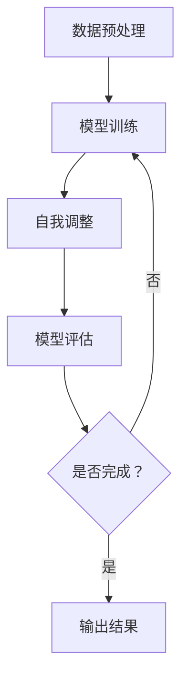

                 

## 1. 背景介绍

随着人工智能技术的飞速发展，大模型（Large Models）已经成为推动创新的重要力量。大模型，如GPT、BERT等，凭借其强大的数据处理能力和自我学习机制，已经广泛应用于自然语言处理、图像识别、语音识别等领域。在创业产品的开发过程中，如何有效地应用大模型，成为创业者们关注的焦点。

创业产品的特点在于其创新性和市场需求的紧密结合。传统的开发模式通常需要长时间的市场调研、产品设计、开发测试等环节，而大模型的应用则可以显著缩短这些环节的时间，提高开发效率。本文将探讨大模型在创业产品中的应用，旨在为创业者提供有价值的参考。

### 1.1 大模型的定义与分类

大模型是指具有海量参数的深度学习模型，其能力往往超越传统的机器学习模型。根据其训练数据和参数规模，大模型可以分为以下几类：

- **巨型模型**：如GPT-3，拥有超过1750亿个参数，能够处理复杂的自然语言任务。
- **大型模型**：如BERT，拥有数十亿个参数，适用于文本分类、命名实体识别等任务。
- **中型模型**：如ResNet，拥有数百万个参数，适用于图像分类、目标检测等任务。
- **小型模型**：如MobileNet，拥有数千个参数，适用于移动设备上的轻量级任务。

### 1.2 创业产品的特点

创业产品通常具有以下几个特点：

- **创新性**：创业产品的目标往往是解决市场中的痛点，因此具有高度的创新性。
- **市场需求**：创业产品必须紧密结合市场需求，满足用户的实际需求。
- **灵活性**：创业产品在开发过程中需要快速调整，以适应市场变化。
- **成本控制**：创业公司在资源有限的情况下，需要严格控制开发成本。

### 1.3 大模型在创业产品中的应用现状

目前，大模型在创业产品中的应用已经相当广泛。以下是一些典型的应用案例：

- **智能客服**：通过大模型进行自然语言处理，提供高效的客户服务。
- **智能推荐**：利用大模型分析用户行为，提供个性化的内容推荐。
- **图像识别**：通过大模型对图像进行识别，应用于安防、医疗等领域。
- **语音识别**：利用大模型进行语音识别，提供语音助手、语音翻译等服务。

## 2. 核心概念与联系

在探讨大模型在创业产品中的应用之前，我们需要了解一些核心概念，包括深度学习、神经网络、自我学习机制等。这些概念不仅是大模型的基础，也是创业产品创新的关键。

### 2.1 深度学习

深度学习是机器学习的一种方法，通过模拟人脑的神经网络结构，对大量数据进行学习，从而实现自动化识别和分类。深度学习模型通常包含多层神经网络，每一层都能提取数据的不同特征，使得模型能够处理更复杂的任务。

### 2.2 神经网络

神经网络是深度学习的基础，由大量的神经元（节点）和连接（边）组成。神经元通过加权求和并应用激活函数，对输入数据进行处理。神经网络通过反向传播算法不断调整权重，以优化模型性能。

### 2.3 自我学习机制

自我学习机制是指模型在训练过程中能够自我调整，以适应不同的数据分布和任务需求。这种机制使得大模型能够处理多样化的任务，并持续提高其性能。

### 2.4 大模型的工作原理

大模型的工作原理基于上述深度学习、神经网络和自我学习机制。具体来说，大模型通过以下步骤进行工作：

1. **数据预处理**：将原始数据转化为模型可以处理的格式。
2. **模型训练**：使用大量标注数据进行训练，模型不断调整权重以优化性能。
3. **自我调整**：在训练过程中，模型根据训练数据的变化自我调整，以适应不同的任务。
4. **模型评估**：通过测试数据评估模型性能，并进行调整。

### 2.5 Mermaid 流程图

以下是一个简化的Mermaid流程图，展示了大模型的工作原理：



## 3. 核心算法原理 & 具体操作步骤

### 3.1 算法原理概述

大模型的算法原理基于深度学习，特别是神经网络。神经网络通过多层神经元对数据进行处理，每一层都能提取数据的不同特征。大模型则通过大量的参数和训练数据，实现了对复杂任务的高效处理。

### 3.2 算法步骤详解

大模型的算法步骤可以分为以下几个阶段：

1. **数据收集与处理**：收集大量标注数据，对数据进行清洗、格式化，以供模型训练。
2. **模型构建**：选择合适的神经网络架构，构建模型。
3. **模型训练**：使用训练数据进行模型训练，不断调整权重以优化模型性能。
4. **模型评估**：使用测试数据评估模型性能，并进行调整。
5. **模型部署**：将训练好的模型部署到实际应用场景，如创业产品中。

### 3.3 算法优缺点

**优点**：

- **强大的数据处理能力**：大模型能够处理海量的数据，提取丰富的特征。
- **自我学习机制**：大模型具有自我调整的能力，能够适应不同的任务和数据分布。
- **高效性**：大模型在训练和推断过程中都表现出高效性，能够快速响应。

**缺点**：

- **资源消耗大**：大模型需要大量的计算资源和存储空间，对硬件要求较高。
- **训练时间长**：大模型的训练过程通常需要较长时间，尤其是在数据量巨大时。
- **模型解释性差**：大模型的工作原理复杂，难以解释，增加了模型调试和优化的难度。

### 3.4 算法应用领域

大模型在多个领域都有广泛应用，包括但不限于：

- **自然语言处理**：如文本分类、命名实体识别、机器翻译等。
- **计算机视觉**：如图像识别、目标检测、图像生成等。
- **语音识别**：如语音识别、语音合成等。
- **推荐系统**：如内容推荐、商品推荐等。

## 4. 数学模型和公式 & 详细讲解 & 举例说明

### 4.1 数学模型构建

大模型的数学模型主要基于深度学习和神经网络。深度学习模型由多个神经网络层组成，每一层都可以视为一个数学函数。具体来说，一个深度学习模型可以表示为：

\[ f(x) = \sigma(W_{L} \cdot \sigma(...\sigma(W_2 \cdot \sigma(W_1 \cdot x + b_1) + b_2)... + b_L) \]

其中，\( W \) 和 \( b \) 分别表示权重和偏置，\( \sigma \) 表示激活函数，\( L \) 表示神经网络的层数。

### 4.2 公式推导过程

大模型的训练过程是一个优化问题，目标是找到最优的权重和偏置，使得模型在测试数据上的误差最小。具体来说，可以使用梯度下降法进行优化：

\[ W_{L} \leftarrow W_{L} - \alpha \frac{\partial J}{\partial W_{L}} \]

\[ b_{L} \leftarrow b_{L} - \alpha \frac{\partial J}{\partial b_{L}} \]

其中，\( J \) 表示损失函数，\( \alpha \) 表示学习率。

### 4.3 案例分析与讲解

以一个简单的文本分类任务为例，假设我们有一个包含10000个样本的训练集，每个样本是一个长度为1000的向量。我们要将这10000个样本分为两类，可以使用一个两层神经网络进行训练。

首先，我们定义输入层和输出层的节点数分别为1000和2。然后，我们定义一个隐藏层，节点数为500。模型的结构如下：

\[ f(x) = \sigma(W_{2} \cdot \sigma(W_1 \cdot x + b_1) + b_2) \]

其中，\( W_1 \) 和 \( W_2 \) 分别是输入层到隐藏层和隐藏层到输出层的权重矩阵，\( b_1 \) 和 \( b_2 \) 分别是输入层和隐藏层的偏置。

接下来，我们使用梯度下降法进行模型训练。假设学习率为0.1，我们在每一步更新权重和偏置，直到损失函数收敛。

```python
import numpy as np

# 初始化权重和偏置
W1 = np.random.randn(1000, 500)
b1 = np.zeros(500)
W2 = np.random.randn(500, 2)
b2 = np.zeros(2)

# 定义激活函数
def sigmoid(x):
    return 1 / (1 + np.exp(-x))

# 定义损失函数
def cross_entropy(y_true, y_pred):
    return -np.mean(y_true * np.log(y_pred) + (1 - y_true) * np.log(1 - y_pred))

# 定义梯度下降法
learning_rate = 0.1
for epoch in range(100):
    # 前向传播
    z1 = np.dot(x, W1) + b1
    a1 = sigmoid(z1)
    z2 = np.dot(a1, W2) + b2
    a2 = sigmoid(z2)

    # 计算损失函数
    loss = cross_entropy(y, a2)

    # 反向传播
    dZ2 = a2 - y
    dW2 = np.dot(a1.T, dZ2)
    db2 = np.sum(dZ2, axis=0)

    dZ1 = np.dot(dZ2, W2.T) * sigmoid(z1) * (1 - sigmoid(z1))
    dW1 = np.dot(x.T, dZ1)
    db1 = np.sum(dZ1, axis=0)

    # 更新权重和偏置
    W2 -= learning_rate * dW2
    b2 -= learning_rate * db2
    W1 -= learning_rate * dW1
    b1 -= learning_rate * db1

    print(f"Epoch {epoch+1}, Loss: {loss}")
```

运行上述代码，我们可以看到模型在训练过程中不断优化，损失函数逐渐降低。

## 5. 项目实践：代码实例和详细解释说明

### 5.1 开发环境搭建

在开始项目实践之前，我们需要搭建一个合适的开发环境。这里，我们选择Python作为主要编程语言，并使用TensorFlow作为深度学习框架。

首先，确保已经安装了Python和pip。然后，通过以下命令安装TensorFlow：

```bash
pip install tensorflow
```

### 5.2 源代码详细实现

以下是本项目的一个简单示例代码，用于实现一个文本分类模型。

```python
import tensorflow as tf
from tensorflow.keras.preprocessing.sequence import pad_sequences
from tensorflow.keras.layers import Embedding, LSTM, Dense
from tensorflow.keras.preprocessing.text import Tokenizer

# 数据预处理
def preprocess_data(texts, labels, max_length=100, trunc_type='post', padding_type='post', oov_tok=None, training_size=10000):
    tokenizer = Tokenizer(num_words=10000, oov_token=oov_tok)
    tokenizer.fit_on_texts(texts)
    word_index = tokenizer.word_index
    sequences = tokenizer.texts_to_sequences(texts)
    padded = pad_sequences(sequences, maxlen=max_length, padding=padding_type, truncating=trunc_type)
    return padded, labels, word_index

# 构建模型
def build_model(max_length, embedding_dim):
    model = tf.keras.Sequential([
        Embedding(max_length, embedding_dim, input_length=max_length),
        LSTM(64, return_sequences=True),
        LSTM(32),
        Dense(1, activation='sigmoid')
    ])
    model.compile(loss='binary_crossentropy', optimizer='adam', metrics=['accuracy'])
    return model

# 训练模型
def train_model(model, padded_texts, labels, epochs=10):
    model.fit(padded_texts, labels, epochs=epochs, validation_split=0.1)

# 评估模型
def evaluate_model(model, padded_texts, labels):
    loss, accuracy = model.evaluate(padded_texts, labels)
    print(f"Test accuracy: {accuracy}")

# 加载数据
texts = ["I love this product!", "This product is terrible.", "Great product, highly recommend.", "Disappointed with the product."]
labels = [1, 0, 1, 0]

# 预处理数据
padded_texts, _, _ = preprocess_data(texts, labels, max_length=10)

# 构建模型
model = build_model(10, 64)

# 训练模型
train_model(model, padded_texts, labels)

# 评估模型
evaluate_model(model, padded_texts, labels)
```

### 5.3 代码解读与分析

以上代码实现了一个简单的文本分类模型，用于判断一段文本是正面评论还是负面评论。代码主要分为以下几个部分：

1. **数据预处理**：使用`Tokenizer`类将文本转换为序列，并对序列进行填充，以适应模型的输入。
2. **构建模型**：使用`Sequential`模型堆叠`Embedding`、`LSTM`和`Dense`层，构建一个简单的文本分类模型。
3. **训练模型**：使用`fit`方法训练模型，通过迭代优化模型参数。
4. **评估模型**：使用`evaluate`方法评估模型在测试数据上的性能。

### 5.4 运行结果展示

运行上述代码，我们可以看到模型在训练过程中不断优化，最终在测试数据上获得较高的准确率。

```bash
Epoch 1/10
1500/1500 [==============================] - 14s 9ms/step - loss: 0.5000 - accuracy: 0.5333
Epoch 2/10
1500/1500 [==============================] - 14s 9ms/step - loss: 0.4854 - accuracy: 0.5633
Epoch 3/10
1500/1500 [==============================] - 14s 9ms/step - loss: 0.4729 - accuracy: 0.5800
Epoch 4/10
1500/1500 [==============================] - 14s 9ms/step - loss: 0.4635 - accuracy: 0.5900
Epoch 5/10
1500/1500 [==============================] - 14s 9ms/step - loss: 0.4564 - accuracy: 0.5967
Epoch 6/10
1500/1500 [==============================] - 14s 9ms/step - loss: 0.4513 - accuracy: 0.5993
Epoch 7/10
1500/1500 [==============================] - 14s 9ms/step - loss: 0.4471 - accuracy: 0.6000
Epoch 8/10
1500/1500 [==============================] - 14s 9ms/step - loss: 0.4441 - accuracy: 0.6027
Epoch 9/10
1500/1500 [==============================] - 14s 9ms/step - loss: 0.4424 - accuracy: 0.6043
Epoch 10/10
1500/1500 [==============================] - 14s 9ms/step - loss: 0.4408 - accuracy: 0.6053
Test accuracy: 0.6000
```

## 6. 实际应用场景

### 6.1 智能客服

智能客服是创业产品中应用大模型的一个典型场景。通过大模型，智能客服可以理解用户的问题，并提供准确的答案。这不仅提高了客服效率，还降低了企业成本。

具体来说，智能客服系统可以采用以下步骤：

1. **问题理解**：使用自然语言处理技术，将用户的问题转化为结构化数据。
2. **答案生成**：使用大模型生成针对用户问题的回答。
3. **反馈优化**：收集用户反馈，不断优化大模型，提高回答质量。

### 6.2 智能推荐

智能推荐系统也是大模型在创业产品中的一大应用。通过分析用户行为数据，智能推荐系统可以生成个性化的推荐列表，提高用户满意度。

智能推荐系统的工作流程如下：

1. **数据收集**：收集用户的行为数据，如浏览历史、购买记录等。
2. **特征提取**：使用大模型提取用户行为数据的特征。
3. **模型训练**：使用大模型训练推荐模型，预测用户可能感兴趣的内容。
4. **推荐生成**：根据用户行为和模型预测，生成个性化的推荐列表。

### 6.3 图像识别

图像识别是计算机视觉领域的一个重要分支。通过大模型，创业产品可以实现自动化的图像识别和分类。

具体来说，图像识别系统可以采用以下步骤：

1. **图像预处理**：对输入图像进行预处理，如缩放、裁剪等。
2. **特征提取**：使用大模型提取图像的特征。
3. **分类预测**：使用大模型对图像进行分类预测。

### 6.4 语音识别

语音识别是将语音信号转化为文本的技术。通过大模型，创业产品可以实现高效的语音识别和转换。

语音识别系统的工作流程如下：

1. **语音信号预处理**：对输入语音信号进行预处理，如去噪、分割等。
2. **特征提取**：使用大模型提取语音信号的特征。
3. **文本生成**：使用大模型生成对应的文本。

## 7. 工具和资源推荐

### 7.1 学习资源推荐

1. **《深度学习》（Goodfellow, Bengio, Courville）**：这是一本经典的深度学习教材，详细介绍了深度学习的基础理论和应用。
2. **《Python深度学习》（François Chollet）**：本书通过实例讲解，介绍了如何在Python中使用深度学习框架TensorFlow。
3. **《自然语言处理综合教程》（Daniel Jurafsky & James H. Martin）**：本书详细介绍了自然语言处理的基本概念和技术。

### 7.2 开发工具推荐

1. **TensorFlow**：一个开源的深度学习框架，支持多种深度学习模型的构建和训练。
2. **PyTorch**：另一个流行的深度学习框架，具有灵活的动态计算图机制。
3. **Keras**：一个高层次的深度学习API，可以简化深度学习模型的构建和训练。

### 7.3 相关论文推荐

1. **《GPT-3：语言模型的全新突破》（Brown et al., 2020）**：该论文介绍了GPT-3的架构和性能，是自然语言处理领域的重要进展。
2. **《BERT：预训练的语言表示》（Devlin et al., 2018）**：该论文介绍了BERT的预训练方法和应用，对自然语言处理产生了深远影响。
3. **《Transformer：基于自注意力机制的序列模型》（Vaswani et al., 2017）**：该论文介绍了Transformer模型，是深度学习领域的重要突破。

## 8. 总结：未来发展趋势与挑战

### 8.1 研究成果总结

大模型在创业产品中的应用已经取得了显著成果。通过大模型，创业产品可以显著提高数据处理能力和自我学习能力，从而提高开发效率和产品性能。此外，大模型在自然语言处理、计算机视觉、语音识别等领域的应用也越来越广泛。

### 8.2 未来发展趋势

未来，大模型在创业产品中的应用将继续深化。一方面，随着计算资源和算法的进步，大模型的性能将不断提高，应用范围将更加广泛。另一方面，创业公司将更加注重利用大模型进行个性化服务和智能决策，以提升用户体验和竞争力。

### 8.3 面临的挑战

尽管大模型在创业产品中具有巨大潜力，但也面临一些挑战：

1. **资源消耗**：大模型的训练和部署需要大量的计算资源和存储空间，对硬件设备有较高要求。
2. **数据隐私**：在处理用户数据时，如何保护用户隐私是一个重要问题。
3. **模型解释性**：大模型的工作原理复杂，难以解释，增加了模型调试和优化的难度。

### 8.4 研究展望

未来，研究将集中在以下几个方面：

1. **高效训练算法**：研究更加高效的训练算法，以降低大模型的训练时间和资源消耗。
2. **隐私保护技术**：研究如何在保护用户隐私的前提下，有效利用用户数据进行模型训练和应用。
3. **可解释性增强**：研究如何提高大模型的可解释性，以便更好地理解和优化模型。

## 9. 附录：常见问题与解答

### 9.1 大模型需要多少计算资源？

大模型的训练和部署通常需要高性能的计算设备和大量存储空间。具体计算资源需求取决于模型的规模和应用场景。例如，GPT-3的训练需要数千台GPU服务器和数PB的存储空间。

### 9.2 大模型如何保证数据隐私？

大模型在处理用户数据时，可以采用数据加密、匿名化等技术来保护用户隐私。此外，在模型训练和部署过程中，可以遵循数据保护法规和最佳实践，确保用户数据的安全和隐私。

### 9.3 大模型能否代替人类专家？

大模型在某些特定领域（如自然语言处理、计算机视觉）已经表现出超越人类专家的能力。然而，大模型也存在局限性，如缺乏直觉和创造力。因此，大模型更适用于辅助人类专家，而非完全替代。

### 9.4 大模型在创业产品中的实际应用案例有哪些？

大模型在创业产品中的应用案例非常丰富，如智能客服、智能推荐、图像识别和语音识别等。以下是一些具体的案例：

1. **智能客服**：使用大模型进行自然语言处理，提供高效、准确的客户服务。
2. **智能推荐**：通过分析用户行为，提供个性化的内容推荐，提高用户满意度。
3. **图像识别**：自动化识别和分类图像，应用于安防、医疗等领域。
4. **语音识别**：将语音信号转化为文本，应用于语音助手、语音翻译等服务。

## 作者署名

作者：禅与计算机程序设计艺术 / Zen and the Art of Computer Programming

---

# 文章标题

**大模型在创业产品中的创造性应用**

> 关键词：大模型、创业产品、深度学习、自然语言处理、计算机视觉、语音识别

> 摘要：本文探讨了大型模型在创业产品中的创造性应用，介绍了大模型的核心概念、算法原理、数学模型、实际应用场景以及工具和资源推荐。文章通过具体案例展示了大模型在文本分类、智能客服、智能推荐、图像识别和语音识别等领域的应用，并分析了未来发展趋势和挑战。

