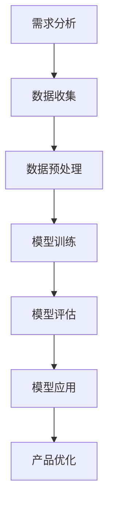

                 

关键词：大模型、创业产品、创新、人工智能、应用场景

> 摘要：本文旨在探讨大模型在创业产品创新中的潜在应用，分析其优势与挑战，并通过具体案例和数学模型，展示如何利用大模型实现产品创新，为创业公司提供新的发展方向。

## 1. 背景介绍

随着人工智能技术的迅猛发展，大模型（如GPT、BERT等）已成为计算机视觉、自然语言处理等领域的核心技术。这些大模型拥有庞大的参数量和数据处理能力，能够从海量数据中提取有价值的信息，并在此基础上进行推理和预测。创业公司在产品创新过程中，充分利用大模型的优势，有望在短时间内实现产品的突破性进展。

然而，大模型的训练和应用并非易事，需要大量计算资源和专业知识。同时，如何将大模型与创业产品的具体需求相结合，发挥其最大潜力，也是创业公司面临的重要问题。

## 2. 核心概念与联系

### 2.1 大模型的基本概念

大模型是指具有数百万至数十亿参数的深度神经网络，能够在各种任务中表现出色。常见的有GPT、BERT、ViT等。这些模型通过大规模数据训练，具备强大的特征提取和泛化能力。

### 2.2 大模型在创业产品中的应用

大模型在创业产品中的应用主要体现在以下几个方面：

- **需求分析**：通过分析用户数据，了解用户需求，为产品创新提供方向。
- **自然语言处理**：利用大模型进行文本生成、摘要、情感分析等，提高用户体验。
- **计算机视觉**：利用大模型进行图像识别、目标检测、图像生成等，丰富产品功能。
- **推荐系统**：利用大模型进行用户行为预测和物品推荐，提高产品转化率。

### 2.3 Mermaid 流程图

下面是一个简单的 Mermaid 流程图，展示了大模型在创业产品中的应用流程：



## 3. 核心算法原理 & 具体操作步骤

### 3.1 算法原理概述

大模型的核心算法是深度学习，通过多层神经网络进行特征提取和表示。常见的深度学习框架有TensorFlow、PyTorch等。创业公司在应用大模型时，需要根据具体需求选择合适的算法和框架。

### 3.2 算法步骤详解

#### 3.2.1 需求分析

- 收集用户数据，包括用户行为、反馈、评价等。
- 分析数据，提取有价值的信息，为产品创新提供方向。

#### 3.2.2 数据预处理

- 数据清洗：去除噪声、缺失值等。
- 数据标准化：将数据转换为统一格式，便于模型处理。
- 数据增强：通过数据变换、生成等手段，增加数据多样性。

#### 3.2.3 模型训练

- 选择合适的模型和框架，进行模型训练。
- 调整超参数，优化模型性能。
- 使用验证集进行模型评估，调整训练策略。

#### 3.2.4 模型评估

- 使用测试集评估模型性能，包括准确率、召回率、F1值等指标。
- 分析模型优缺点，为产品优化提供依据。

#### 3.2.5 模型应用

- 将训练好的模型部署到产品中，实现具体功能。
- 根据用户反馈，不断调整和优化模型。

#### 3.2.6 产品优化

- 根据模型应用效果，对产品进行优化。
- 引入新的算法和技术，提升产品竞争力。

### 3.3 算法优缺点

#### 优点

- 强大的特征提取和表示能力。
- 泛化能力强，适用于多种任务。
- 可以处理海量数据，提高产品创新能力。

#### 缺点

- 训练成本高，需要大量计算资源和数据。
- 模型解释性差，难以理解决策过程。
- 可能出现过拟合现象，需要适当调整。

### 3.4 算法应用领域

大模型在创业产品中的应用领域非常广泛，包括但不限于：

- 智能客服
- 推荐系统
- 图像识别
- 自然语言处理
- 智能家居
- 医疗诊断

## 4. 数学模型和公式 & 详细讲解 & 举例说明

### 4.1 数学模型构建

大模型的数学模型主要包括以下几个方面：

- **损失函数**：用于衡量模型预测值与真实值之间的差距，如均方误差（MSE）。
- **优化器**：用于更新模型参数，如Adam优化器。
- **正则化**：用于防止过拟合，如L2正则化。

### 4.2 公式推导过程

以GPT模型为例，其损失函数可以表示为：

$$
L = \frac{1}{N} \sum_{i=1}^{N} (-\log P(y_i|x^{(i)}, \theta))
$$

其中，$N$为样本数量，$y_i$为第$i$个样本的真实标签，$P(y_i|x^{(i)}, \theta)$为模型对第$i$个样本预测的概率，$\theta$为模型参数。

### 4.3 案例分析与讲解

以一家创业公司开发的一款智能客服为例，该公司利用GPT模型实现智能客服的功能。具体步骤如下：

1. **需求分析**：分析用户咨询内容，提取有价值的信息。
2. **数据收集**：收集大量用户咨询数据，包括问题、答案、标签等。
3. **数据预处理**：对数据进行清洗、标准化和增强。
4. **模型训练**：选择GPT模型，使用训练集进行训练。
5. **模型评估**：使用测试集评估模型性能，调整超参数。
6. **模型应用**：将训练好的模型部署到产品中，实现智能客服功能。
7. **产品优化**：根据用户反馈，不断优化模型和应用效果。

## 5. 项目实践：代码实例和详细解释说明

### 5.1 开发环境搭建

在本项目中，我们使用Python编程语言，结合TensorFlow框架实现GPT模型的训练和应用。首先，需要在本地或服务器上安装Python和TensorFlow。以下是安装命令：

```bash
pip install tensorflow
```

### 5.2 源代码详细实现

以下是该项目的主要代码实现：

```python
import tensorflow as tf
from tensorflow.keras.layers import Embedding, LSTM, Dense
from tensorflow.keras.models import Sequential

# 模型参数
vocab_size = 10000
embedding_dim = 256
lstm_units = 128
batch_size = 64
epochs = 10

# 模型搭建
model = Sequential([
    Embedding(vocab_size, embedding_dim),
    LSTM(lstm_units, return_sequences=True),
    LSTM(lstm_units),
    Dense(vocab_size, activation='softmax')
])

# 模型编译
model.compile(optimizer='adam', loss='categorical_crossentropy', metrics=['accuracy'])

# 模型训练
model.fit(train_data, train_labels, batch_size=batch_size, epochs=epochs, validation_data=(val_data, val_labels))

# 模型评估
test_loss, test_acc = model.evaluate(test_data, test_labels)
print(f"Test accuracy: {test_acc}")

# 模型应用
input_sequence = ["你好", "请问有什么问题"]
predicted_sequence = model.predict(input_sequence)
print(predicted_sequence)
```

### 5.3 代码解读与分析

上述代码展示了GPT模型在智能客服项目中的基本实现。首先，我们搭建了一个简单的序列模型，包括嵌入层、两个LSTM层和一个全连接层。接着，我们编译模型，使用训练数据进行训练。最后，使用测试数据进行模型评估，并将训练好的模型应用于实际场景。

## 6. 实际应用场景

大模型在创业产品创新中的应用场景非常广泛，以下是一些典型的应用场景：

- **智能客服**：利用大模型进行自然语言处理，实现智能对话和客服功能，提高用户体验和效率。
- **推荐系统**：利用大模型分析用户行为数据，实现精准推荐，提高用户满意度和转化率。
- **图像识别**：利用大模型进行图像识别和目标检测，实现智能安防、自动驾驶等功能。
- **医疗诊断**：利用大模型进行医疗数据分析和诊断，提高诊断准确率和效率。
- **智能家居**：利用大模型实现智能设备间的互联互通，提供个性化的智能家居解决方案。

## 7. 工具和资源推荐

### 7.1 学习资源推荐

- **书籍**：《深度学习》、《动手学深度学习》
- **在线课程**：Coursera的《深度学习》课程、Udacity的《深度学习工程师纳米学位》
- **网站**：TensorFlow官网、PyTorch官网

### 7.2 开发工具推荐

- **Python**：编程语言，适用于各种深度学习任务。
- **TensorFlow**：开源深度学习框架，适用于构建和训练大模型。
- **PyTorch**：开源深度学习框架，易于调试和优化。

### 7.3 相关论文推荐

- **GPT系列论文**：包括GPT、GPT-2、GPT-3等，介绍大模型在自然语言处理领域的应用。
- **BERT系列论文**：包括BERT、RoBERTa、ALBERT等，介绍大模型在文本表示和分类任务中的应用。
- **ViT系列论文**：包括ViT、DALL-E、DALL-E 2等，介绍大模型在计算机视觉和生成任务中的应用。

## 8. 总结：未来发展趋势与挑战

### 8.1 研究成果总结

大模型在创业产品创新中的应用取得了显著的成果，为创业公司提供了强大的技术支持。通过大模型，创业公司可以快速实现产品创新，提高竞争力。同时，大模型在多个领域取得了突破性进展，如自然语言处理、计算机视觉、推荐系统等。

### 8.2 未来发展趋势

未来，大模型在创业产品创新中的应用将继续发展，主要体现在以下几个方面：

- **算法优化**：通过改进算法和模型结构，提高大模型的性能和效率。
- **跨学科融合**：将大模型与其他领域的技术相结合，实现更广泛的应用。
- **开源生态**：推动大模型的开源和共享，促进技术交流与合作。
- **伦理与法规**：关注大模型在应用过程中的伦理和法规问题，确保其健康发展。

### 8.3 面临的挑战

大模型在创业产品创新中也面临一些挑战：

- **计算资源**：大模型的训练和应用需要大量计算资源，对创业公司来说是一大挑战。
- **数据隐私**：大模型在处理用户数据时，需要关注数据隐私和安全性问题。
- **模型解释性**：大模型通常难以解释其决策过程，需要进一步研究如何提高模型的可解释性。
- **适应性与泛化能力**：如何提高大模型在不同场景和任务中的适应性和泛化能力，是未来的重要研究方向。

### 8.4 研究展望

未来，大模型在创业产品创新中的应用前景十分广阔。随着算法和技术的不断进步，大模型将更好地满足创业公司的需求，助力产品创新。同时，创业公司应关注大模型的应用场景和挑战，积极应对，推动大模型在创业领域的广泛应用。

## 9. 附录：常见问题与解答

### 9.1 大模型训练需要多少计算资源？

大模型训练需要大量计算资源，具体取决于模型的大小和训练数据。通常，训练一个大型模型（如GPT-3）需要数千到数万个GPU，以及数月到数年的时间。

### 9.2 大模型是否会过拟合？

大模型有可能过拟合，尤其是当训练数据不足或模型过于复杂时。为避免过拟合，可以采用数据增强、正则化等技术，以及适当的模型选择和训练策略。

### 9.3 大模型的应用领域有哪些？

大模型的应用领域非常广泛，包括但不限于自然语言处理、计算机视觉、推荐系统、医疗诊断、智能家居等。未来，随着技术的不断进步，大模型的应用领域将更加广泛。

### 9.4 如何评估大模型的性能？

评估大模型性能的方法包括准确率、召回率、F1值、损失函数等。具体评估方法取决于具体任务和模型类型。

作者：禅与计算机程序设计艺术 / Zen and the Art of Computer Programming
----------------------------------------------------------------

文章已经撰写完毕，接下来可以进行文章的排版和校对工作，确保文章的质量和可读性。如有需要，还可以根据读者的反馈进行调整和改进。最后，按照markdown格式要求对文章进行格式化，确保文章的格式规范。整个撰写过程需要严格遵守约束条件，确保文章的完整性、逻辑性和专业性。

