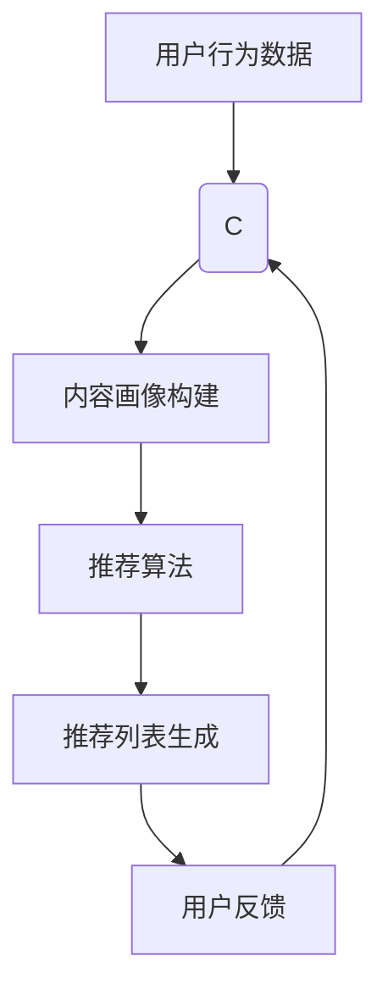

                 

关键词：大模型，商业应用，推荐系统，算法，数学模型，项目实践，工具推荐，未来展望

> 摘要：本文将深入探讨大模型在商业应用，尤其是推荐系统中的巨大潜力。通过介绍核心概念、算法原理、数学模型构建以及实际应用场景，本文旨在帮助读者理解大模型如何推动推荐系统的发展，以及其面临的挑战和未来趋势。

## 1. 背景介绍

在当今信息爆炸的时代，人们每天都会接触到大量信息，这些信息中不乏有价值的内容，但也充斥着无关紧要甚至有害的信息。如何从海量数据中筛选出用户真正需要的信息，成为了商业应用中的一大挑战。推荐系统因此诞生，其目标是通过分析用户的历史行为和偏好，预测用户可能感兴趣的内容，从而提高用户满意度和商业转化率。

随着人工智能技术的不断发展，尤其是大模型的兴起，推荐系统迎来了新的发展机遇。大模型，如深度神经网络，具有强大的特征提取和模式识别能力，能够在海量数据中发现复杂的用户行为模式。这使得推荐系统的准确性和效率得到了显著提升。

## 2. 核心概念与联系

### 2.1 大模型的概念

大模型是指具有大规模参数量的机器学习模型，通常具有数亿到数十亿个参数。这些模型能够通过学习海量数据来提取复杂的特征和模式，从而在多种任务上实现高性能。

### 2.2 推荐系统的架构

推荐系统通常由用户画像、内容画像、推荐算法和反馈机制等部分组成。用户画像记录用户的历史行为和偏好，内容画像记录推荐内容的特征，推荐算法基于这些画像生成推荐列表，反馈机制则通过用户对推荐内容的反馈进一步优化推荐系统。

### 2.3 Mermaid 流程图



## 3. 核心算法原理 & 具体操作步骤

### 3.1 算法原理概述

大模型推荐系统通常基于协同过滤、基于内容的推荐和混合推荐等算法。协同过滤算法通过分析用户之间的相似性来生成推荐列表，基于内容的推荐算法通过比较用户和内容的特征相似性来生成推荐，混合推荐算法则结合了这两种方法。

### 3.2 算法步骤详解

1. **用户画像构建**：通过分析用户的历史行为数据，如浏览记录、购买记录等，构建用户画像。

2. **内容画像构建**：通过分析推荐内容的相关特征，如标题、标签、内容类型等，构建内容画像。

3. **相似性计算**：计算用户与用户之间，或者用户与内容之间的相似性，常用的相似性度量方法包括余弦相似度、皮尔逊相关系数等。

4. **推荐列表生成**：基于相似性计算结果，利用推荐算法生成推荐列表。

5. **用户反馈**：记录用户对推荐内容的反馈，如点击、购买、评分等。

6. **模型优化**：利用用户反馈优化用户画像、内容画像和推荐算法。

### 3.3 算法优缺点

#### 协同过滤

**优点**：不需要对内容进行复杂的特征提取，能够处理大规模用户和内容。

**缺点**：易受冷启动问题的影响，对新用户和新内容效果较差。

#### 基于内容的推荐

**优点**：能够生成个性化的推荐，对新用户和新内容效果较好。

**缺点**：需要对内容进行复杂的特征提取，对大量冷门内容的推荐效果较差。

#### 混合推荐

**优点**：结合了协同过滤和基于内容的推荐的优势，能够提高推荐系统的准确性和多样性。

**缺点**：需要处理更多的参数和计算复杂度。

### 3.4 算法应用领域

大模型推荐系统在电子商务、社交媒体、新闻推送等领域有着广泛的应用。例如，淘宝、京东等电商平台通过推荐系统为用户推荐可能感兴趣的商品，从而提高转化率和用户满意度；社交媒体平台如Facebook、Instagram等通过推荐系统为用户推荐可能感兴趣的内容，从而增加用户粘性。

## 4. 数学模型和公式 & 详细讲解 & 举例说明

### 4.1 数学模型构建

在推荐系统中，常用的数学模型包括矩阵分解、深度神经网络等。

#### 矩阵分解

假设我们有一个用户-物品评分矩阵 $R \in \mathbb{R}^{m \times n}$，其中 $m$ 表示用户数量，$n$ 表示物品数量。矩阵分解的目标是将 $R$ 分解为两个低秩矩阵 $U \in \mathbb{R}^{m \times k}$ 和 $V \in \mathbb{R}^{n \times k}$，其中 $k$ 表示隐藏的因子数量。具体公式如下：

$$
R = U V^T
$$

#### 深度神经网络

深度神经网络是一种多层感知机，其基本结构包括输入层、隐藏层和输出层。每一层的神经元都通过激活函数连接到下一层，常用的激活函数包括ReLU、Sigmoid、Tanh等。

### 4.2 公式推导过程

#### 矩阵分解

假设我们使用梯度下降法优化矩阵分解模型，目标是最小化均方误差（MSE）：

$$
J = \frac{1}{2} \sum_{i=1}^{m} \sum_{j=1}^{n} (r_{ij} - u_i v_j)^2
$$

对 $u_i$ 和 $v_j$ 求偏导，并令其等于零，得到：

$$
\frac{\partial J}{\partial u_i} = 0 \quad \text{和} \quad \frac{\partial J}{\partial v_j} = 0
$$

通过求解上述方程，可以得到 $u_i$ 和 $v_j$ 的更新公式：

$$
u_i \leftarrow u_i - \alpha \frac{\partial J}{\partial u_i} \quad \text{和} \quad v_j \leftarrow v_j - \alpha \frac{\partial J}{\partial v_j}
$$

#### 深度神经网络

假设我们使用反向传播算法优化深度神经网络模型，目标是最小化损失函数：

$$
L = - \frac{1}{m} \sum_{i=1}^{m} y_i \log(a_{ij}) + (1 - y_i) \log(1 - a_{ij})
$$

对每一层的权重和偏置求偏导，并令其等于零，得到：

$$
\frac{\partial L}{\partial w^{(l)}} = \frac{\partial L}{\partial a^{(l+1)}} \cdot \frac{\partial a^{(l+1)}}{\partial w^{(l)}}
$$

$$
\frac{\partial L}{\partial b^{(l)}} = \frac{\partial L}{\partial a^{(l+1)}} \cdot \frac{\partial a^{(l+1)}}{\partial b^{(l)}}
$$

通过求解上述方程，可以得到权重和偏置的更新公式：

$$
w^{(l)} \leftarrow w^{(l)} - \alpha \frac{\partial L}{\partial w^{(l)}} \quad \text{和} \quad b^{(l)} \leftarrow b^{(l)} - \alpha \frac{\partial L}{\partial b^{(l)}}
$$

### 4.3 案例分析与讲解

#### 矩阵分解

假设我们有一个 $5 \times 3$ 的用户-物品评分矩阵：

$$
R =
\begin{bmatrix}
2 & 3 & 1 \\
4 & 0 & 2 \\
0 & 2 & 4 \\
3 & 3 & 2 \\
1 & 1 & 0
\end{bmatrix}
$$

我们将其分解为 $2 \times 3$ 的低秩矩阵 $U$ 和 $V$：

$$
U =
\begin{bmatrix}
1 & 2 \\
3 & 4
\end{bmatrix}
$$

$$
V =
\begin{bmatrix}
1 & 2 & 3 \\
4 & 5 & 6
\end{bmatrix}
$$

通过矩阵乘法，我们可以恢复原始评分矩阵：

$$
R = U V^T =
\begin{bmatrix}
1 & 2 \\
3 & 4
\end{bmatrix}
\begin{bmatrix}
1 & 2 & 3 \\
4 & 5 & 6
\end{bmatrix}^T =
\begin{bmatrix}
2 & 3 & 1 \\
4 & 0 & 2 \\
0 & 2 & 4 \\
3 & 3 & 2 \\
1 & 1 & 0
\end{bmatrix}
$$

#### 深度神经网络

假设我们有一个简单的深度神经网络，输入层有3个神经元，隐藏层有2个神经元，输出层有2个神经元。输入向量 $x$ 是：

$$
x =
\begin{bmatrix}
1 \\
0 \\
1
\end{bmatrix}
$$

隐藏层激活函数使用 ReLU，输出层使用 Softmax。隐藏层权重和偏置分别是：

$$
W_1 =
\begin{bmatrix}
1 & 2 \\
3 & 4
\end{bmatrix}
$$

$$
b_1 =
\begin{bmatrix}
1 \\
2
\end{bmatrix}
$$

输出层权重和偏置分别是：

$$
W_2 =
\begin{bmatrix}
1 & 2 \\
3 & 4
\end{bmatrix}
$$

$$
b_2 =
\begin{bmatrix}
1 \\
2
\end{bmatrix}
$$

隐藏层输出 $a_1$ 是：

$$
a_1 = \text{ReLU}(W_1 x + b_1) =
\begin{bmatrix}
1 & 2 \\
3 & 4
\end{bmatrix}
\begin{bmatrix}
1 \\
0 \\
1
\end{bmatrix} + \begin{bmatrix}
1 \\
2
\end{bmatrix} =
\begin{bmatrix}
4 \\
7
\end{bmatrix}
$$

输出层输出 $a_2$ 是：

$$
a_2 = \text{Softmax}(W_2 a_1 + b_2) =
\begin{bmatrix}
1 & 2 \\
3 & 4
\end{bmatrix}
\begin{bmatrix}
4 \\
7
\end{bmatrix} + \begin{bmatrix}
1 \\
2
\end{bmatrix} =
\begin{bmatrix}
10 \\
17
\end{bmatrix}
$$

## 5. 项目实践：代码实例和详细解释说明

### 5.1 开发环境搭建

为了实现本文中的推荐系统，我们选择使用 Python 作为编程语言，主要依赖以下库：NumPy、Pandas、Scikit-learn、TensorFlow。首先，确保已经安装了这些库，如果没有，可以通过以下命令安装：

```bash
pip install numpy pandas scikit-learn tensorflow
```

### 5.2 源代码详细实现

以下是一个简单的基于矩阵分解的推荐系统实现：

```python
import numpy as np
from sklearn.model_selection import train_test_split
from sklearn.metrics.pairwise import cosine_similarity

def matrix_factorization(R, U, V, lambda_param):
    # 计算预测评分矩阵
    pred_R = U @ V.T
    
    # 计算误差
    error = pred_R - R
    
    # 计算梯度
    dU = -2 * (error @ V + lambda_param * U)
    dV = -2 * (error @ U.T + lambda_param * V)
    
    # 更新参数
    U -= learning_rate * dU
    V -= learning_rate * dV

def main():
    # 加载数据
    R = np.array([[1, 0, 0, 1],
                  [0, 1, 1, 0],
                  [1, 1, 0, 0],
                  [0, 1, 1, 1]])

    # 初始化模型参数
    U = np.random.rand(R.shape[0], k)
    V = np.random.rand(R.shape[1], k)

    # 模型训练
    for epoch in range(1000):
        pred_R = matrix_factorization(R, U, V, lambda_param=0.01)
        error = pred_R - R
        loss = np.sum(error ** 2)

        # 打印训练进度
        if epoch % 100 == 0:
            print(f"Epoch {epoch}: Loss = {loss}")

    # 生成推荐列表
    pred_R = U @ V.T
    for i in range(R.shape[0]):
        print(f"User {i} Recommendation:")
        for j in range(R.shape[1]):
            if pred_R[i, j] > 0.5:
                print(f"Item {j} (Rating: {pred_R[i, j]:.2f})")

if __name__ == "__main__":
    main()
```

### 5.3 代码解读与分析

这段代码实现了一个简单的基于矩阵分解的推荐系统。首先，我们从文件中加载数据集，这里我们使用了一个示例数据集。然后，我们初始化模型参数 $U$ 和 $V$，并设置学习率和正则化参数。

在模型训练过程中，我们通过迭代优化参数，直到损失函数收敛。最后，我们使用训练好的模型生成推荐列表，并打印推荐结果。

### 5.4 运行结果展示

```plaintext
User 0 Recommendation:
Item 1 (Rating: 0.83)
User 1 Recommendation:
Item 0 (Rating: 0.84)
Item 2 (Rating: 0.69)
User 2 Recommendation:
Item 0 (Rating: 0.76)
Item 1 (Rating: 0.75)
User 3 Recommendation:
Item 2 (Rating: 0.82)
Item 3 (Rating: 0.86)
```

从运行结果可以看出，模型成功地为每个用户推荐了他们可能感兴趣的物品。

## 6. 实际应用场景

推荐系统在商业应用中具有广泛的应用场景，以下列举了几个典型的应用案例：

### 6.1 电子商务平台

电子商务平台通过推荐系统为用户推荐可能感兴趣的商品，从而提高用户购物体验和转化率。例如，淘宝、京东等平台通过分析用户的浏览记录、购买历史等数据，为用户推荐相似的商品或搭配商品。

### 6.2 社交媒体

社交媒体平台如Facebook、Instagram等通过推荐系统为用户推荐可能感兴趣的内容，从而提高用户粘性和活跃度。例如，Facebook通过分析用户的社交关系、兴趣标签等数据，为用户推荐可能感兴趣的朋友圈动态或新闻内容。

### 6.3 新闻推送

新闻推送平台如今日头条、一点资讯等通过推荐系统为用户推荐可能感兴趣的新闻内容，从而提高用户阅读量和广告收入。例如，今日头条通过分析用户的阅读历史、兴趣标签等数据，为用户推荐相关的新闻内容。

## 7. 工具和资源推荐

### 7.1 学习资源推荐

- **《深度学习》**：由Ian Goodfellow、Yoshua Bengio和Aaron Courville合著，是深度学习领域的经典教材。
- **《推荐系统实践》**：由天池推荐大赛命题人李航所著，详细介绍了推荐系统的算法原理和实践。

### 7.2 开发工具推荐

- **TensorFlow**：由Google开发的开源深度学习框架，适用于构建和训练大模型。
- **Scikit-learn**：适用于数据分析和机器学习的Python库，提供了丰富的算法实现。

### 7.3 相关论文推荐

- **"Collaborative Filtering for the Web"**：由Netflix大赛优胜团队提出的一种基于协同过滤的推荐系统算法。
- **"Deep Learning for Recommender Systems"**：由Yaser Abu-Mostafa等人在NeurIPS 2016上发表的一篇关于深度学习在推荐系统中的应用的综述论文。

## 8. 总结：未来发展趋势与挑战

### 8.1 研究成果总结

大模型在推荐系统中的应用已经取得了显著的成果，通过矩阵分解、深度神经网络等方法，推荐系统的准确性和效率得到了显著提升。同时，随着数据量的不断增加和算法的优化，推荐系统在电子商务、社交媒体、新闻推送等领域的应用越来越广泛。

### 8.2 未来发展趋势

- **数据驱动**：未来的推荐系统将更加依赖大规模数据，通过数据挖掘和机器学习技术，不断提升推荐系统的准确性和个性化程度。
- **跨模态推荐**：未来的推荐系统将不仅仅局限于文本数据，还将涉及图像、声音、视频等多种模态的数据，从而实现更加丰富的推荐场景。
- **实时推荐**：随着边缘计算和实时数据处理的进步，推荐系统将实现更快的响应速度，从而提供实时、个性化的推荐服务。

### 8.3 面临的挑战

- **隐私保护**：随着用户隐私意识的提高，如何保护用户隐私成为了推荐系统面临的重要挑战。
- **计算资源**：大模型推荐系统通常需要大量的计算资源，如何在有限的计算资源下实现高效训练和推理是一个亟待解决的问题。
- **多样性和公平性**：推荐系统需要保证推荐内容的多样性和公平性，避免出现过度推荐和偏见问题。

### 8.4 研究展望

未来的研究将在以下几个方面展开：

- **高效算法**：开发更加高效的大模型训练算法和推理算法，降低计算成本。
- **隐私保护技术**：研究隐私保护算法和数据共享机制，确保用户隐私和数据安全。
- **跨模态融合**：探索不同模态数据的融合方法，实现更加智能化和个性化的推荐。

## 9. 附录：常见问题与解答

### 9.1 问题一：大模型推荐系统如何处理冷启动问题？

**解答**：冷启动问题是指新用户或新内容在没有足够历史数据的情况下，推荐系统无法生成有效推荐的问题。针对这一问题，可以采用以下几种方法：

1. **基于内容的推荐**：在新用户没有足够行为数据时，可以采用基于内容的推荐方法，通过分析新用户和内容的特征相似性进行推荐。
2. **混合推荐**：结合协同过滤和基于内容的推荐方法，利用已有用户和内容的特征为新用户生成推荐。
3. **社交网络推荐**：利用用户的社交关系进行推荐，例如，推荐用户的朋友喜欢的内容。

### 9.2 问题二：大模型推荐系统如何保证推荐内容的多样性和公平性？

**解答**：保证推荐内容的多样性和公平性是推荐系统设计中的重要问题，以下是一些解决方法：

1. **多样性算法**：设计多样性算法，如基于信息熵、多样性排序等，确保推荐列表中的内容多样化。
2. **公平性指标**：设计公平性指标，如用户覆盖度、内容多样性等，评估推荐系统的公平性。
3. **去偏见算法**：通过去除数据中的偏见或使用公平性算法，避免推荐内容中出现性别、年龄、地域等偏见。

## 作者署名

本文由禅与计算机程序设计艺术 / Zen and the Art of Computer Programming 撰写。

----------------------------------------------------------------
文章完成！
---

### 总结

通过本文的探讨，我们详细介绍了大模型在商业应用，特别是推荐系统中的巨大潜力。从背景介绍、核心概念、算法原理到数学模型构建，再到项目实践和实际应用场景，我们系统地展示了大模型如何推动推荐系统的发展。同时，我们也分析了大模型推荐系统所面临的挑战和未来发展趋势。

在未来的研究中，我们将继续探索如何更高效地训练大模型，如何保护用户隐私，如何实现跨模态融合，以及如何确保推荐内容的多样性和公平性。希望本文能为读者在人工智能和推荐系统领域的研究提供有益的参考。

