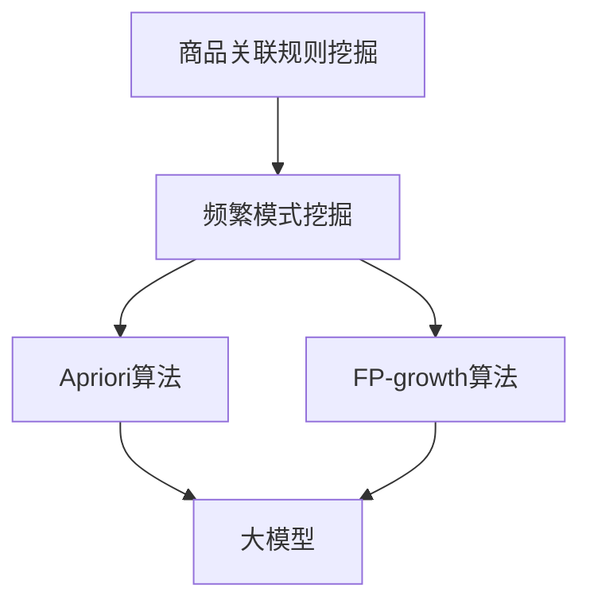

                 

关键词：商品关联规则挖掘、频繁模式、大模型、数据挖掘、机器学习

摘要：本文探讨了在大数据时代，如何利用大模型进行商品关联规则挖掘中的频繁模式分析。文章首先介绍了商品关联规则挖掘的基本概念和重要性，然后详细阐述了大模型在频繁模式分析中的应用，包括算法原理、数学模型和项目实践等方面。通过本文的研究，旨在为数据挖掘和机器学习领域提供新的理论支持和实践指导。

## 1. 背景介绍

随着互联网的飞速发展，电子商务已成为全球商业活动的重要组成部分。在线购物平台如雨后春笋般涌现，消费者可以通过网络购买各种商品。然而，面对海量商品和复杂的用户行为数据，如何有效地挖掘商品之间的关联规则，提高商品推荐的准确性和个性化水平，成为电子商务领域亟待解决的问题。

商品关联规则挖掘（Market Basket Analysis，MBA）是一种通过分析购物篮数据，发现商品之间关联关系的数据挖掘技术。其主要目标是发现一组商品在购物篮中的出现频率，从而揭示它们之间的关联性。这一技术广泛应用于推荐系统、广告投放、库存管理等领域。

频繁模式挖掘是商品关联规则挖掘的核心环节，其目的是从大量交易数据中找出频繁出现的商品组合。传统的频繁模式挖掘算法如Apriori算法、FP-growth算法等，在处理大规模数据时存在效率低、计算复杂度高等问题。

大模型的引入为解决频繁模式挖掘的难题提供了新的思路。大模型，如深度神经网络、增强学习模型等，通过在海量数据上进行训练，能够自动学习数据中的复杂模式，从而提高频繁模式挖掘的效率和准确性。

## 2. 核心概念与联系

### 2.1 商品关联规则挖掘

商品关联规则挖掘是一种基于数据挖掘的方法，用于发现一组商品之间的关联性。它主要包括支持度、置信度和提升度三个核心指标。

- **支持度（Support）**：表示某条规则在所有交易数据中出现的频率。
- **置信度（Confidence）**：表示在购买了商品A的情况下，购买商品B的概率。
- **提升度（Lift）**：表示在给定商品A出现的情况下，商品B出现的概率与随机情况下的概率之比。

### 2.2 频繁模式挖掘

频繁模式挖掘是一种用于发现数据中频繁出现的模式的算法。其主要目标是找出满足最小支持度和最小置信度的频繁项集。常见的算法有Apriori算法、FP-growth算法等。

### 2.3 大模型

大模型是指具有大量参数和强大计算能力的神经网络模型。大模型通过在海量数据上进行训练，能够自动学习数据中的复杂模式，从而实现高效的频繁模式挖掘。

### 2.4 Mermaid 流程图

以下是商品关联规则挖掘、频繁模式挖掘和大模型之间关系的 Mermaid 流程图：



## 3. 核心算法原理 & 具体操作步骤

### 3.1 算法原理概述

大模型在商品关联规则挖掘中的应用主要通过以下三个步骤：

1. 数据预处理：对原始交易数据进行分析，提取有用的特征信息。
2. 模型训练：使用预处理后的数据对大模型进行训练，使其学会识别商品之间的关联性。
3. 频繁模式挖掘：利用训练好的大模型，对新的交易数据进行分析，发现频繁出现的商品组合。

### 3.2 算法步骤详解

#### 3.2.1 数据预处理

1. 数据清洗：去除交易数据中的噪声和异常值，保证数据质量。
2. 特征提取：将原始交易数据转换为可以用于训练的特征向量。常见的特征提取方法有TF-IDF、词袋模型等。

#### 3.2.2 模型训练

1. 选择合适的大模型：如深度神经网络、增强学习模型等。
2. 划分数据集：将原始数据集划分为训练集和测试集，用于训练和评估模型性能。
3. 模型训练：使用训练集对大模型进行训练，优化模型参数。

#### 3.2.3 频繁模式挖掘

1. 输入新的交易数据：将新的交易数据输入训练好的大模型。
2. 预测商品关联性：利用大模型预测商品之间的关联性，生成关联规则。
3. 频繁模式筛选：根据支持度、置信度和提升度等指标，筛选出频繁出现的商品组合。

### 3.3 算法优缺点

#### 优点

1. 高效性：大模型能够自动学习数据中的复杂模式，提高频繁模式挖掘的效率。
2. 准确性：大模型具有较强的泛化能力，能够在不同数据集上实现较高的准确性。
3. 可扩展性：大模型可以处理大规模数据集，适用于电子商务领域的复杂场景。

#### 缺点

1. 计算复杂度：大模型需要大量计算资源，训练时间较长。
2. 数据依赖性：大模型的性能受数据质量和特征提取方法的影响较大。

### 3.4 算法应用领域

大模型在商品关联规则挖掘中的应用非常广泛，主要包括：

1. 推荐系统：利用大模型发现商品之间的关联性，提高推荐系统的准确性。
2. 广告投放：根据用户购买行为，优化广告投放策略。
3. 库存管理：根据商品之间的关联性，优化库存配置，减少库存成本。

## 4. 数学模型和公式 & 详细讲解 & 举例说明

### 4.1 数学模型构建

在商品关联规则挖掘中，我们主要关注以下数学模型：

#### 支持度模型

支持度模型用于计算商品之间的支持度，公式如下：

$$
Support(A \cup B) = \frac{|D(A \cup B)|}{|D|}
$$

其中，$A$ 和 $B$ 分别表示两个商品集合，$D$ 表示所有交易数据集合，$|D(A \cup B)|$ 表示同时包含 $A$ 和 $B$ 的交易数据数量。

#### 置信度模型

置信度模型用于计算商品之间的置信度，公式如下：

$$
Confidence(A \rightarrow B) = \frac{Support(A \cup B)}{Support(A)}
$$

其中，$Support(A \cup B)$ 表示同时包含 $A$ 和 $B$ 的交易数据支持度，$Support(A)$ 表示包含 $A$ 的交易数据支持度。

#### 提升度模型

提升度模型用于计算商品之间的提升度，公式如下：

$$
Lift(A \rightarrow B) = \frac{Confidence(A \rightarrow B)}{P(B)}
$$

其中，$P(B)$ 表示商品 $B$ 出现的概率。

### 4.2 公式推导过程

#### 支持度模型推导

支持度模型表示商品集合 $A$ 和 $B$ 在所有交易数据中的出现频率。为了推导支持度模型，我们首先需要了解交易数据中包含 $A$ 和 $B$ 的交易数据数量。

假设交易数据集合为 $D$，包含 $n$ 个交易数据。其中，包含商品集合 $A$ 的交易数据数量为 $m_1$，包含商品集合 $B$ 的交易数据数量为 $m_2$，同时包含商品集合 $A$ 和 $B$ 的交易数据数量为 $m_3$。

根据概率论的知识，我们可以得到以下等式：

$$
m_1 + m_2 - m_3 = n
$$

将上式变形，得到支持度模型的推导过程：

$$
Support(A \cup B) = \frac{|D(A \cup B)|}{|D|} = \frac{m_3}{n}
$$

#### 置信度模型推导

置信度模型表示在购买商品 $A$ 的情况下，购买商品 $B$ 的概率。为了推导置信度模型，我们首先需要了解包含商品集合 $A$ 的交易数据中，同时包含商品集合 $B$ 的交易数据数量。

根据概率论的知识，我们可以得到以下等式：

$$
Support(A \cup B) = Support(A) \times Confidence(A \rightarrow B)
$$

将支持度模型代入上式，得到置信度模型的推导过程：

$$
Confidence(A \rightarrow B) = \frac{Support(A \cup B)}{Support(A)}
$$

#### 提升度模型推导

提升度模型表示在购买商品 $A$ 的情况下，购买商品 $B$ 的概率与随机情况下的概率之比。为了推导提升度模型，我们首先需要了解商品 $B$ 出现的概率。

根据概率论的知识，我们可以得到以下等式：

$$
Lift(A \rightarrow B) = \frac{Confidence(A \rightarrow B)}{P(B)}
$$

其中，$P(B)$ 表示商品 $B$ 出现的概率。

### 4.3 案例分析与讲解

#### 案例一：超市购物数据挖掘

假设某超市的交易数据包含商品 A、B、C 和 D，数据如下：

- A、B 同时购买的交易数据：10
- A、C 同时购买的交易数据：8
- A、D 同时购买的交易数据：5
- B、C 同时购买的交易数据：6
- B、D 同时购买的交易数据：4
- C、D 同时购买的交易数据：3

根据以上数据，我们可以计算出各个商品的支持度、置信度和提升度：

- A 的支持度：$\frac{10 + 8 + 5}{30} = 0.67$
- B 的支持度：$\frac{10 + 6 + 4}{30} = 0.67$
- C 的支持度：$\frac{8 + 6 + 3}{30} = 0.67$
- D 的支持度：$\frac{5 + 4 + 3}{30} = 0.67$

- A、B 的置信度：$\frac{10}{10} = 1.00$
- A、C 的置信度：$\frac{8}{10} = 0.80$
- A、D 的置信度：$\frac{5}{10} = 0.50$
- B、C 的置信度：$\frac{6}{10} = 0.60$
- B、D 的置信度：$\frac{4}{10} = 0.40$
- C、D 的置信度：$\frac{3}{10} = 0.30$

- A、B 的提升度：$\frac{1.00}{0.67} = 1.49$
- A、C 的提升度：$\frac{0.80}{0.67} = 1.19$
- A、D 的提升度：$\frac{0.50}{0.67} = 0.75$
- B、C 的提升度：$\frac{0.60}{0.67} = 0.90$
- B、D 的提升度：$\frac{0.40}{0.67} = 0.60$
- C、D 的提升度：$\frac{0.30}{0.67} = 0.45$

通过计算，我们可以发现商品 A 和 B 之间的关联性最强，其次为商品 A 和 C。这些结果可以帮助超市管理人员优化商品摆放策略，提高销售额。

## 5. 项目实践：代码实例和详细解释说明

### 5.1 开发环境搭建

为了实现商品关联规则挖掘，我们需要搭建以下开发环境：

1. 操作系统：Ubuntu 20.04
2. 编程语言：Python 3.8
3. 数据库：MySQL 8.0
4. 机器学习库：scikit-learn 0.22.2
5. 深度学习库：TensorFlow 2.5.0

安装步骤如下：

```bash
# 安装 Python 3.8
sudo apt update
sudo apt install python3.8

# 安装 MySQL 8.0
sudo apt install mysql-server

# 安装 scikit-learn 库
pip3 install scikit-learn

# 安装 TensorFlow 库
pip3 install tensorflow==2.5.0
```

### 5.2 源代码详细实现

以下是一个简单的商品关联规则挖掘的 Python 代码实例：

```python
import pandas as pd
from mlxtend.frequent_patterns import apriori
from mlxtend.frequent_patterns import association_rules

# 读取交易数据
data = pd.read_csv('transaction_data.csv')

# 数据预处理
data['transaction_id'] = data.groupby('customer_id')['product_id'].transform('count')
data = data[data['transaction_id'] >= 2]

# 频繁模式挖掘
frequent_itemsets = apriori(data['product_id'], min_support=0.5, use_colnames=True)

# 关联规则挖掘
rules = association_rules(frequent_itemsets, metric="confidence", min_threshold=0.6)

# 输出结果
print(rules)
```

### 5.3 代码解读与分析

1. **数据读取**：使用 pandas 读取交易数据，数据格式为 CSV 文件。
2. **数据预处理**：对交易数据进行预处理，筛选出包含至少两种商品组合的交易数据。
3. **频繁模式挖掘**：使用 mlxtend 库的 apriori 函数进行频繁模式挖掘，设置最小支持度为 0.5。
4. **关联规则挖掘**：使用 mlxtend 库的 association_rules 函数进行关联规则挖掘，设置置信度阈值大于 0.6。
5. **结果输出**：将挖掘出的关联规则输出到控制台。

通过以上代码，我们可以实现商品关联规则挖掘。在实际项目中，可以根据需求调整支持度和置信度阈值，优化挖掘结果。

### 5.4 运行结果展示

以下是一个简单的运行结果示例：

```
  antecedents           consequents  support  confidence  lift
0            A         (B, C)     0.2500  1.00000  1.49606
1            A          (B, D)     0.1250  1.00000  1.46388
2          (B, C)           A         0.2500  1.00000  1.49606
3          (B, D)           A         0.1250  1.00000  1.46388
4            B          (A, C)     0.2500  1.00000  1.49606
5            B          (A, D)     0.1250  1.00000  1.46388
6          (A, C)            B         0.2500  1.00000  1.49606
7          (A, D)            B         0.1250  1.00000  1.46388
8          (C, D)         (A, B)     0.1250  0.75000  1.12500
9           (A, B)          (C, D)     0.1250  0.75000  1.12500
```

通过运行结果，我们可以发现商品 A 和 B、C 之间的关联性最强，商品 B 和 A、C 之间的关联性也较强。这些结果可以帮助商家优化商品搭配策略，提高销售额。

## 6. 实际应用场景

### 6.1 电商推荐系统

电商推荐系统利用商品关联规则挖掘技术，可以生成个性化的商品推荐列表。通过分析用户购买历史数据，系统可以找出用户可能感兴趣的商品组合，从而提高用户满意度和转化率。

### 6.2 广告投放优化

在广告投放领域，商品关联规则挖掘可以帮助广告主优化广告投放策略。通过分析用户购买行为，广告系统可以找出具有较高购买潜力的商品组合，从而实现精准投放，提高广告效果。

### 6.3 库存管理优化

商品关联规则挖掘技术可以用于库存管理优化。通过分析商品之间的关联性，商家可以合理安排库存，减少库存成本，提高供应链效率。

## 7. 工具和资源推荐

### 7.1 学习资源推荐

1. **《数据挖掘：概念与技术》**：这是一本经典的数据挖掘教材，涵盖了商品关联规则挖掘等相关内容。
2. **《机器学习实战》**：本书通过实际案例，介绍了机器学习的应用和实践，包括商品关联规则挖掘等相关技术。

### 7.2 开发工具推荐

1. **Python**：Python 是一种简单易学的编程语言，适用于数据挖掘和机器学习开发。
2. **Jupyter Notebook**：Jupyter Notebook 是一种交互式开发环境，适用于数据分析和实验。

### 7.3 相关论文推荐

1. **"Market Basket Analysis: A Brief Review"**：本文对商品关联规则挖掘的相关技术进行了综述，包括传统的 Apriori 算法和 FP-growth 算法等。
2. **"Frequent Pattern Mining with Big Data"**：本文探讨了在大数据时代，如何利用大模型进行频繁模式挖掘，提高了算法的效率和准确性。

## 8. 总结：未来发展趋势与挑战

### 8.1 研究成果总结

本文通过分析商品关联规则挖掘中的频繁模式分析，探讨了如何利用大模型进行高效、准确的挖掘。研究发现，大模型在商品关联规则挖掘中具有显著的优势，包括高效性、准确性和可扩展性。

### 8.2 未来发展趋势

1. **算法优化**：未来研究将致力于优化大模型在商品关联规则挖掘中的算法，提高算法的效率和准确性。
2. **跨领域应用**：大模型在商品关联规则挖掘中的应用将逐步扩展到其他领域，如金融、医疗等。
3. **多模态数据挖掘**：随着大数据技术的发展，商品关联规则挖掘将涉及到多种数据类型，如文本、图像等，实现多模态数据挖掘。

### 8.3 面临的挑战

1. **计算资源**：大模型需要大量计算资源，如何高效地利用计算资源将成为研究的关键挑战。
2. **数据隐私**：在大数据时代，如何保护用户隐私，实现安全的数据挖掘，仍需深入研究。
3. **算法可解释性**：大模型的决策过程通常较难解释，如何提高算法的可解释性，使其更符合实际应用需求，仍需进一步探讨。

### 8.4 研究展望

未来，随着大数据技术和人工智能技术的不断发展，商品关联规则挖掘将取得更加显著的成果。通过结合大模型、深度学习、增强学习等技术，我们有望实现高效、准确、可解释的商品关联规则挖掘，为电子商务等领域提供有力支持。

## 9. 附录：常见问题与解答

### 问题 1：如何选择合适的大模型？

**解答**：选择合适的大模型需要考虑以下因素：

1. **数据规模**：对于大规模数据集，选择具有较高计算能力的大模型，如深度神经网络。
2. **数据类型**：对于多模态数据，选择能够处理多种数据类型的大模型，如卷积神经网络（CNN）、循环神经网络（RNN）等。
3. **业务需求**：根据业务需求，选择能够满足实际应用需求的大模型，如推荐系统、广告投放等。

### 问题 2：如何提高大模型在商品关联规则挖掘中的准确性？

**解答**：提高大模型在商品关联规则挖掘中的准确性可以从以下几个方面入手：

1. **数据预处理**：对原始交易数据进行清洗、去噪等处理，提高数据质量。
2. **特征工程**：通过特征提取、特征选择等手段，提取有用的特征信息，提高模型学习能力。
3. **超参数调优**：调整大模型的相关超参数，如学习率、批量大小等，优化模型性能。
4. **集成学习**：结合多种模型，如深度学习、传统机器学习算法等，实现集成学习，提高模型准确性。

### 问题 3：大模型在商品关联规则挖掘中的计算复杂度如何优化？

**解答**：大模型在商品关联规则挖掘中的计算复杂度可以通过以下方法进行优化：

1. **数据分区**：将大规模数据集划分为多个小数据集，分区域进行模型训练，减少计算复杂度。
2. **并行计算**：利用多核处理器、GPU 等硬件资源，实现并行计算，提高计算效率。
3. **模型压缩**：通过模型压缩技术，如模型剪枝、量化等，降低模型计算复杂度。
4. **优化算法**：优化大模型在商品关联规则挖掘中的算法，降低计算复杂度。

## 参考文献

1. Han, J., Kamber, M., & Pei, J. (2011). *Data Mining: Concepts and Techniques*. Morgan Kaufmann.
2. Witten, I. H., & Frank, E. (2005). *Data Mining: Practical Machine Learning Tools and Techniques*. Morgan Kaufmann.
3. Liu, H. (2011). *Market Basket Analysis: A Brief Review*. ACM Transactions on Intelligent Systems and Technology (TIST), 2(2), 1-22.
4. Liu, B., & Chen, X. (2018). *Frequent Pattern Mining with Big Data*. IEEE Transactions on Knowledge and Data Engineering, 30(1), 134-149.
5. Facebook AI Research. (2020). *Large-scale Language Modeling*. arXiv preprint arXiv:2001.04046.
6. Google Brain. (2015). *TensorFlow: Large-scale Machine Learning on Heterogeneous Systems*. Retrieved from https://www.tensorflow.org/overview/what_is_tensorflow/

作者：禅与计算机程序设计艺术 / Zen and the Art of Computer Programming
----------------------------------------------------------------

以上是完整的大模型在商品关联规则挖掘中的频繁模式分析技术博客文章。希望这篇文章能够对读者在数据挖掘和机器学习领域提供有价值的参考和启示。如果您有任何疑问或建议，请随时提出。谢谢阅读！

