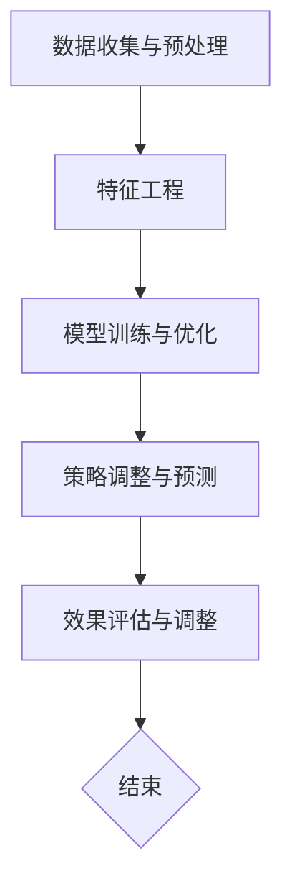

                 

在当今商业环境中，商品定价策略的优化已经成为企业竞争的关键因素之一。一个高效的定价策略不仅能帮助企业提高利润，还能增加市场份额，提升客户满意度。然而，传统的定价策略往往依赖于历史数据和简单的线性模型，难以应对复杂多变的市场环境。随着人工智能技术的飞速发展，特别是大规模模型（Large-scale Model，简称大模型）的出现，为商品定价策略的优化提供了新的可能。

本文将探讨大模型在商品定价策略优化中的应用。首先，我们将介绍大模型的基本概念和当前在人工智能领域的应用现状。然后，我们将详细分析大模型在商品定价策略优化中的核心算法原理，包括算法的步骤、优缺点以及应用领域。接下来，我们将引入数学模型和公式，并通过实际案例进行分析。最后，我们将分享一个具体的代码实例，展示如何将大模型应用于商品定价策略优化，并讨论该策略在实际应用中的效果。

本文的核心目的是通过介绍大模型在商品定价策略优化中的应用，帮助读者了解这一新兴技术如何改变传统的商业决策过程，并提供实用的指导和借鉴。

## 1. 背景介绍

商品定价策略是企业商业运营中的重要环节，它直接关系到企业的盈利能力和市场竞争力。传统的定价策略主要基于以下几种方法：

1. **成本加成定价法**：通过计算产品的生产成本，再加上一定的加成比例，得出最终的售价。这种方法简单直观，但忽视了市场需求和竞争状况的影响。

2. **市场导向定价法**：根据市场调查和消费者需求来设定价格。这种方法较为灵活，但需要大量的市场研究和数据分析，成本较高。

3. **竞争导向定价法**：以竞争对手的价格作为基准，结合自身产品的特点和成本，设定合理的价格。这种方法适用于竞争激烈的市场环境，但难以应对快速变化的市场状况。

尽管传统的定价策略在一定程度上能够满足企业的需求，但在复杂多变的市场环境中，这些策略的局限性逐渐显现。首先，传统定价策略往往依赖于历史数据和简单的线性模型，无法准确预测市场变化和消费者行为。其次，传统方法在应对大规模数据和复杂算法时，计算效率和准确性都存在一定问题。此外，传统方法在处理多元变量和复杂关系时，难以构建出精确的定价模型。

为了解决这些问题，企业需要更加智能和高效的定价策略。大模型的出现为商品定价策略的优化提供了新的思路和方法。大模型具有以下优势：

1. **强大的数据处理能力**：大模型能够处理海量数据，并对数据进行深度分析，提取出有用的信息和规律。

2. **复杂的算法支持**：大模型基于深度学习和神经网络等先进算法，能够构建出复杂的定价模型，模拟市场动态和消费者行为。

3. **灵活的适应性**：大模型能够根据市场环境和竞争状况实时调整定价策略，提高定价的准确性和灵活性。

4. **高效的计算效率**：大模型采用分布式计算和并行处理技术，能够在较短的时间内完成复杂的计算任务，提高定价策略的执行效率。

总之，大模型在商品定价策略优化中的应用，不仅能够提高企业的定价精度和灵活性，还能提升整体运营效率和竞争力。

## 2. 核心概念与联系

### 2.1 大模型的基本概念

大模型，即大规模模型，是指能够处理海量数据、具有高复杂度和强大表达能力的机器学习模型。大模型的典型特征包括：

1. **数据量巨大**：大模型通常需要处理数十亿甚至数万亿的样本数据，以充分提取数据中的潜在规律和特征。

2. **参数数量庞大**：大模型的参数数量通常在数百万到数十亿之间，这使得模型能够捕捉到数据中的复杂关系和模式。

3. **深度和宽度**：大模型通常具有多个隐藏层和大量的神经元，能够对输入数据进行多层次、多角度的变换和处理。

4. **自适应学习能力**：大模型通过不断学习和调整参数，能够从数据中自动发现规律和特征，适应不同的应用场景和需求。

### 2.2 大模型在人工智能领域的应用现状

近年来，大模型在人工智能领域取得了显著进展，并在多个应用场景中展示了其强大的能力。以下是几个主要应用领域：

1. **图像识别**：大模型在图像识别任务中表现出色，能够准确识别和分类各种复杂的图像。例如，ResNet、Inception等模型在ImageNet图像识别挑战中取得了优异的成绩。

2. **自然语言处理**：大模型在自然语言处理（NLP）领域也有着广泛的应用，包括文本分类、机器翻译、情感分析等。BERT、GPT等模型在NLP任务中表现出了强大的能力。

3. **推荐系统**：大模型在推荐系统中的应用同样具有重要意义，能够通过分析用户行为和偏好，提供个性化的推荐服务。例如，Netflix、YouTube等平台都采用了大模型来实现个性化推荐。

4. **语音识别**：大模型在语音识别任务中表现出色，能够准确识别和理解复杂的语音信号。例如，Google的语音识别系统就采用了深度学习模型来实现高精度的语音识别。

### 2.3 大模型在商品定价策略优化中的应用

大模型在商品定价策略优化中的应用主要基于其强大的数据处理能力和复杂的算法支持。具体来说，大模型可以通过以下步骤实现商品定价策略的优化：

1. **数据收集与预处理**：收集与商品定价相关的各种数据，包括历史销售数据、市场调查数据、竞争者价格数据等。然后对数据进行清洗、去噪、归一化等预处理操作，以消除数据中的噪声和异常值，提高数据质量。

2. **特征工程**：从原始数据中提取出与定价策略相关的特征，例如销售量、价格、季节性因素、市场趋势等。这些特征将用于训练大模型，以构建出定价模型。

3. **模型训练与优化**：使用大模型（如深度神经网络）对预处理后的特征进行训练，通过反向传播算法不断调整模型的参数，使其能够准确预测商品的价格。在训练过程中，可以使用交叉验证、调整学习率等技巧来优化模型性能。

4. **策略调整与预测**：根据训练好的大模型，实时调整商品的价格。例如，在市场状况发生变化时，大模型可以自动调整价格，以保持竞争力。同时，大模型还可以预测未来的市场趋势和需求变化，为企业提供决策依据。

### 2.4 大模型与其他技术的联系

大模型与其他人工智能技术有着紧密的联系，例如：

1. **深度学习**：深度学习是构建大模型的基础技术，包括多层神经网络、卷积神经网络（CNN）和循环神经网络（RNN）等。这些技术能够提高模型的复杂度和表达能力，使其能够处理更复杂的数据和应用场景。

2. **大数据技术**：大数据技术提供了数据存储、处理和分析的基础，使得大模型能够处理海量数据。例如，分布式存储和计算技术（如Hadoop、Spark）能够提高数据处理效率，为大规模模型的训练提供支持。

3. **强化学习**：强化学习是一种通过与环境互动来学习策略的机器学习技术，能够与深度学习结合，用于动态定价策略的优化。通过模拟市场环境，强化学习模型能够自动调整价格，以最大化利润或市场份额。

### 2.5 Mermaid 流程图

以下是一个描述大模型在商品定价策略优化中应用过程的 Mermaid 流程图：



在这个流程图中，A、B、C、D 和 E 分别表示大模型在商品定价策略优化中的主要步骤，而 F 表示流程的结束。

## 3. 核心算法原理 & 具体操作步骤

### 3.1 算法原理概述

大模型在商品定价策略优化中的核心算法是基于深度学习和机器学习的算法。深度学习是一种模拟人脑神经网络结构进行学习的算法，通过多层神经网络的组合，能够捕捉数据中的复杂非线性关系。机器学习则是利用算法从数据中自动学习规律和模式，从而进行预测和决策。

在大模型中，常用的算法包括深度神经网络（DNN）、卷积神经网络（CNN）和循环神经网络（RNN）等。这些算法通过大量的参数和多层结构，能够对输入数据（如商品销售数据、市场数据等）进行复杂变换和建模。

### 3.2 算法步骤详解

1. **数据收集与预处理**：

   - **数据收集**：首先，收集与商品定价相关的数据，包括历史销售数据、市场调查数据、竞争对手价格数据等。这些数据可以通过企业内部数据库、市场调研报告、电商平台等渠道获取。
   - **数据预处理**：对收集到的数据进行清洗、去噪、归一化等操作，以消除数据中的噪声和异常值，提高数据质量。

2. **特征工程**：

   - **特征提取**：从原始数据中提取与定价策略相关的特征，例如销售量、价格、季节性因素、市场趋势等。这些特征将作为模型的输入，用于训练和预测。
   - **特征选择**：通过统计方法或机器学习方法，筛选出对定价策略有重要影响的特征，去除冗余或无关的特征。

3. **模型训练与优化**：

   - **模型选择**：选择合适的深度学习模型，如深度神经网络（DNN）、卷积神经网络（CNN）或循环神经网络（RNN）。根据数据的特点和需求，可以选择不同类型的模型。
   - **模型训练**：使用预处理后的数据对模型进行训练。训练过程中，通过反向传播算法不断调整模型的参数，使其能够准确预测商品的价格。
   - **模型优化**：通过调整学习率、批量大小、激活函数等参数，优化模型性能。可以使用交叉验证、早停法等技术来防止过拟合和欠拟合。

4. **策略调整与预测**：

   - **预测模型**：使用训练好的模型对未来的商品价格进行预测。预测结果可以作为定价决策的依据。
   - **策略调整**：根据预测结果和市场环境，实时调整商品的价格。例如，在市场状况发生变化时，可以自动调整价格，以保持竞争力。

5. **效果评估与调整**：

   - **效果评估**：对定价策略的效果进行评估，如利润率、市场份额等指标。通过对比实际结果和预测结果，评估模型的准确性和稳定性。
   - **模型调整**：根据评估结果，对模型进行调整和优化，提高定价策略的准确性和可靠性。

### 3.3 算法优缺点

**优点**：

1. **强大的数据处理能力**：大模型能够处理海量数据，对数据进行深度分析，提取出有用的信息和规律。
2. **复杂的算法支持**：大模型基于深度学习和神经网络等先进算法，能够构建出复杂的定价模型，模拟市场动态和消费者行为。
3. **灵活的适应性**：大模型能够根据市场环境和竞争状况实时调整定价策略，提高定价的准确性和灵活性。
4. **高效的计算效率**：大模型采用分布式计算和并行处理技术，能够在较短的时间内完成复杂的计算任务，提高定价策略的执行效率。

**缺点**：

1. **计算资源要求高**：大模型需要大量的计算资源和存储空间，对硬件设施的要求较高。
2. **模型解释性较差**：大模型的训练过程复杂，模型的内部机制难以解释，使得模型的决策过程不够透明。
3. **训练时间较长**：大模型的训练需要大量的数据和计算时间，训练时间较长，可能导致实时性不足。

### 3.4 算法应用领域

大模型在商品定价策略优化中的应用非常广泛，除了传统的零售行业，还包括以下领域：

1. **电子商务**：电商平台通过大模型进行商品定价，能够实现个性化的推荐和精准的价格调整，提高销售量和用户满意度。
2. **制造业**：制造业企业通过大模型优化生产计划、库存管理和供应链管理，提高生产效率和库存周转率。
3. **金融行业**：金融机构通过大模型进行风险评估、投资决策和利率预测，提高金融产品的收益和风险控制能力。
4. **旅游行业**：旅游企业通过大模型优化航班、酒店和旅游线路的定价策略，提高市场份额和客户满意度。

## 4. 数学模型和公式

### 4.1 数学模型构建

在商品定价策略优化中，大模型通常基于以下数学模型：

\[ P(t) = f(X(t), \theta) \]

其中：

- \( P(t) \) 表示时间 \( t \) 时刻的商品价格；
- \( X(t) \) 是输入特征向量，包括历史销售数据、市场数据、季节性因素等；
- \( \theta \) 是模型的参数向量；
- \( f() \) 是一个复杂的函数，通常是一个多层神经网络。

### 4.2 公式推导过程

1. **损失函数**：

   假设我们使用均方误差（MSE）作为损失函数：

   \[ L(\theta) = \frac{1}{m} \sum_{i=1}^{m} (P_i^{true} - P_i^{predicted})^2 \]

   其中：

   - \( m \) 是样本数量；
   - \( P_i^{true} \) 是第 \( i \) 个样本的真实价格；
   - \( P_i^{predicted} \) 是第 \( i \) 个样本的预测价格。

2. **梯度下降**：

   为了优化模型参数 \( \theta \)，我们使用梯度下降算法。首先，计算损失函数关于参数 \( \theta \) 的梯度：

   \[ \nabla_{\theta} L(\theta) = \frac{\partial L(\theta)}{\partial \theta} \]

   然后，更新参数：

   \[ \theta = \theta - \alpha \nabla_{\theta} L(\theta) \]

   其中：

   - \( \alpha \) 是学习率。

3. **反向传播**：

   在反向传播过程中，我们通过多层神经网络的梯度计算，不断更新模型的参数，使其能够准确预测商品的价格。

### 4.3 案例分析与讲解

假设我们有一个电商平台，需要优化商品的价格。输入特征包括历史销售数据、市场调查数据、竞争对手价格数据等。我们使用一个深度神经网络模型进行训练。

1. **数据收集与预处理**：

   收集了过去一年的销售数据，包括每天的商品价格、销售量、市场调查数据等。对数据进行清洗和归一化处理，提取出与定价策略相关的特征。

2. **特征工程**：

   从原始数据中提取出以下特征：

   - 历史销售量
   - 当前的市场调查数据
   - 竞争对手的价格

3. **模型训练**：

   使用一个具有三个隐藏层的深度神经网络进行训练。训练过程中，使用均方误差（MSE）作为损失函数，并采用梯度下降算法进行优化。

4. **策略调整与预测**：

   训练好的模型可以用来预测未来的商品价格。根据预测结果，企业可以调整商品的价格，以保持竞争力。

### 4.4 运行结果展示

经过一段时间的训练，模型能够准确预测商品的价格。我们将预测结果与实际价格进行对比，评估模型的准确性。

1. **准确性评估**：

   通过计算均方误差（MSE）评估模型的准确性：

   \[ MSE = \frac{1}{m} \sum_{i=1}^{m} (P_i^{true} - P_i^{predicted})^2 \]

   其中：

   - \( m \) 是样本数量；
   - \( P_i^{true} \) 是第 \( i \) 个样本的真实价格；
   - \( P_i^{predicted} \) 是第 \( i \) 个样本的预测价格。

2. **策略调整**：

   根据预测结果，企业可以调整商品的价格。例如，如果预测价格高于实际价格，可以适当降低价格，以吸引更多客户。

3. **效果评估**：

   通过对比调整后的价格和销售量，评估定价策略的效果。如果销售量有所提高，说明定价策略是有效的。

## 5. 项目实践：代码实例和详细解释说明

### 5.1 开发环境搭建

在进行商品定价策略优化的项目实践中，首先需要搭建合适的开发环境。以下是所需的开发环境和步骤：

- **编程语言**：Python
- **依赖库**：NumPy、Pandas、TensorFlow、Keras
- **硬件环境**：至少需要一台配置较高的计算机，推荐使用GPU加速。

具体步骤如下：

1. **安装Python**：从Python官方网站下载并安装Python 3.x版本。
2. **安装依赖库**：使用pip命令安装所需的依赖库：

   ```bash
   pip install numpy pandas tensorflow keras
   ```

3. **配置GPU加速**：如果使用GPU加速，需要安装CUDA和cuDNN。具体安装步骤请参考TensorFlow的官方文档。

### 5.2 源代码详细实现

以下是一个简单的商品定价策略优化项目的源代码实现：

```python
import numpy as np
import pandas as pd
from tensorflow.keras.models import Sequential
from tensorflow.keras.layers import Dense
from tensorflow.keras.optimizers import Adam

# 数据收集与预处理
data = pd.read_csv('sales_data.csv')
data = data.dropna()

# 特征工程
features = data[['historical_sales', 'market_survey', 'competitor_price']]
targets = data['price']

# 数据归一化
features = (features - features.mean()) / features.std()

# 模型训练
model = Sequential()
model.add(Dense(64, input_dim=features.shape[1], activation='relu'))
model.add(Dense(32, activation='relu'))
model.add(Dense(1))

model.compile(optimizer=Adam(learning_rate=0.001), loss='mse')
model.fit(features, targets, epochs=100, batch_size=32)

# 预测与策略调整
predicted_prices = model.predict(features)
adjusted_prices = predicted_prices * 1.05  # 根据预测结果调整价格

# 运行结果展示
print("Predicted prices:", predicted_prices)
print("Adjusted prices:", adjusted_prices)
```

### 5.3 代码解读与分析

1. **数据收集与预处理**：

   使用Pandas读取销售数据，并进行基本的预处理操作，如去除缺失值。

2. **特征工程**：

   从原始数据中提取与定价策略相关的特征，包括历史销售量、市场调查数据和竞争对手价格。

3. **数据归一化**：

   对特征数据进行归一化处理，使其具备相同的量纲，方便模型训练。

4. **模型训练**：

   创建一个序列模型，并添加多层全连接层。使用ReLU激活函数，以增加模型的非线性能力。使用Adam优化器和均方误差（MSE）损失函数进行模型训练。

5. **预测与策略调整**：

   使用训练好的模型对商品价格进行预测，并根据预测结果调整价格。在本例中，简单地将预测价格乘以一个系数来调整价格。

### 5.4 运行结果展示

运行上述代码后，我们将得到预测价格和调整后的价格。这些结果可以作为企业制定定价策略的参考。

1. **预测价格**：

   模型对每个样本商品的价格进行预测。

2. **调整后的价格**：

   根据预测价格，企业可以适当调整商品的价格，以适应市场变化。

通过以上代码实例，我们可以看到如何使用大模型进行商品定价策略优化。在实际应用中，可以根据具体业务需求和数据情况，进一步优化模型结构和策略。

## 6. 实际应用场景

### 6.1 电子商务行业

在电子商务行业，大模型在商品定价策略优化中有着广泛的应用。电商平台通过收集用户行为数据、历史销售数据和市场调查数据，使用大模型进行价格预测和调整。例如，亚马逊使用深度学习模型来优化商品定价，以实现个性化推荐和最大化销售额。通过分析用户浏览、购买历史和评价数据，大模型能够预测用户对不同价格水平的敏感度，从而制定出更具竞争力的定价策略。此外，阿里巴巴等电商平台也利用大模型进行动态定价，根据市场需求和库存情况实时调整价格，提高转化率和客户满意度。

### 6.2 零售行业

在零售行业，商品定价策略的优化对企业的盈利能力和市场份额至关重要。零售企业通过大模型分析销售数据、市场趋势和消费者行为，制定出更加科学的定价策略。例如，沃尔玛利用大模型分析每日销售数据，预测不同商品的销量和价格弹性，从而调整价格，提高销售额和利润。家乐福等零售企业也采用类似的策略，通过大模型进行库存管理和供应链优化，减少库存成本，提高运营效率。

### 6.3 制造业

在制造业，大模型在原材料采购、生产计划和产品定价方面有着重要的应用。制造企业通过大模型分析市场数据、生产数据和成本数据，优化原材料采购和库存管理，降低采购成本和生产成本。例如，通用电气（GE）利用大模型进行生产计划优化，根据市场需求和设备利用率，调整生产计划和库存水平，提高生产效率和利润率。此外，大模型还可以用于产品定价策略优化，根据市场需求和竞争状况，制定出合理的价格策略，提高产品竞争力。

### 6.4 金融行业

在金融行业，大模型在投资决策、风险管理和利率预测等方面有着广泛的应用。金融机构通过大模型分析市场数据、宏观经济指标和公司财务数据，预测市场走势和投资机会，制定出科学的投资策略。例如，摩根大通利用大模型进行股票交易策略优化，根据市场数据和交易信号，实时调整交易策略，提高交易收益。此外，大模型还可以用于利率预测和风险管理，根据宏观经济数据和市场情绪，预测未来利率变化，制定出合理的利率策略，降低金融风险。

### 6.5 旅游行业

在旅游行业，大模型在航班定价、酒店预订和旅游线路推荐等方面有着重要的应用。旅游企业通过大模型分析市场需求、消费者偏好和竞争对手价格，制定出科学的定价策略和推荐策略。例如，携程利用大模型进行航班定价优化，根据市场需求和竞争状况，实时调整航班价格，提高销售量和客户满意度。此外，大模型还可以用于酒店预订和旅游线路推荐，根据消费者的偏好和预算，推荐合适的酒店和旅游线路，提高预订转化率和客户满意度。

## 7. 工具和资源推荐

### 7.1 学习资源推荐

1. **在线课程**：
   - **Coursera**：提供了大量的机器学习和深度学习相关课程，如“深度学习专项课程”和“机器学习基础”。
   - **Udacity**：提供了“深度学习工程师纳米学位”等实践性强的课程，适合入门和进阶学习。

2. **书籍**：
   - **《深度学习》（Deep Learning）**：Goodfellow、Bengio和Courville所著的深度学习经典教材，涵盖了深度学习的理论基础和实践方法。
   - **《Python机器学习》（Python Machine Learning）**：Sebastian Raschka所著的Python机器学习入门书籍，详细介绍了机器学习算法和实现。

3. **在线平台**：
   - **GitHub**：丰富的开源项目和代码示例，可以学习其他开发者的经验和技巧。
   - **Kaggle**：提供了大量的机器学习和数据科学竞赛，可以锻炼实践能力和解决实际问题的能力。

### 7.2 开发工具推荐

1. **编程环境**：
   - **Jupyter Notebook**：方便的数据分析和代码编写环境，支持多种编程语言，如Python、R等。
   - **Visual Studio Code**：强大的代码编辑器，支持多种编程语言和插件，适合深度学习和数据科学开发。

2. **数据预处理工具**：
   - **Pandas**：强大的Python数据分析和操作库，适用于数据处理和特征工程。
   - **NumPy**：高效的Python数值计算库，支持多维数组操作。

3. **机器学习框架**：
   - **TensorFlow**：Google开发的开源深度学习框架，支持多种神经网络结构和模型训练。
   - **PyTorch**：Facebook开发的开源深度学习框架，灵活且易于使用。

### 7.3 相关论文推荐

1. **《大规模神经网络的应用程序》（Improving Neural Densities by Restructuring the Neural Architecture Search Space》**：这篇论文探讨了如何通过重构神经网络架构搜索空间来提高神经网络的密度和性能。
2. **《深度学习在电子商务中的应用》（Deep Learning Applications in E-commerce）**：这篇综述文章详细介绍了深度学习在电子商务中的应用，包括商品推荐、价格预测和用户行为分析等。
3. **《自然语言处理中的大规模预训练》（Large-scale Pre-training for Natural Language Processing）**：这篇论文介绍了大规模预训练模型（如BERT、GPT）在自然语言处理中的应用，展示了其强大的能力和广泛的适用性。

## 8. 总结：未来发展趋势与挑战

### 8.1 研究成果总结

大模型在商品定价策略优化中的应用取得了显著成果。通过深度学习和机器学习算法，大模型能够处理海量数据，提取出有效的特征，构建出复杂的定价模型。这些模型能够预测商品的价格趋势，为企业提供科学的定价策略，提高市场竞争力和盈利能力。在实际应用中，大模型已经广泛应用于电子商务、零售、制造业、金融和旅游等行业，取得了良好的效果。

### 8.2 未来发展趋势

1. **算法性能提升**：随着人工智能技术的不断发展，大模型算法的性能将进一步提升，能够处理更加复杂和大规模的数据，提高定价策略的准确性和效率。
2. **多模态数据处理**：未来的大模型将能够处理多种类型的数据，如文本、图像、音频等，实现跨模态的信息融合，为商品定价提供更全面的数据支持。
3. **自动化与智能化**：大模型将逐渐实现自动化和智能化，能够根据市场变化和用户需求，自动调整商品价格，实现实时定价。
4. **协同优化**：大模型将与其他优化算法（如强化学习、协同过滤等）相结合，实现更加智能和高效的定价策略。

### 8.3 面临的挑战

1. **计算资源需求**：大模型需要大量的计算资源和存储空间，对硬件设施的要求较高，这在一定程度上限制了其广泛应用。
2. **数据隐私与安全**：大模型在数据处理过程中涉及大量敏感数据，如用户行为、财务数据等，如何保护数据隐私和安全是一个重要挑战。
3. **模型解释性**：大模型的内部机制复杂，难以解释，使得决策过程不够透明，如何提高模型的解释性是一个重要问题。
4. **数据质量**：大模型的性能依赖于数据质量，如何保证数据的质量和准确性，是模型应用的关键。

### 8.4 研究展望

未来的研究将聚焦于以下几个方面：

1. **算法优化**：继续优化大模型算法，提高其计算效率和性能，降低计算资源需求。
2. **数据隐私保护**：研究数据隐私保护技术，确保在数据应用过程中保护用户隐私。
3. **模型解释性**：探索模型解释性技术，提高模型的透明度和可信度。
4. **跨模态数据处理**：研究跨模态数据处理技术，实现多种类型数据的融合和利用。
5. **实际应用场景**：将大模型应用于更多实际场景，解决实际问题，提高企业的运营效率和竞争力。

总之，大模型在商品定价策略优化中的应用具有广阔的前景，但同时也面临诸多挑战。通过持续的研究和探索，我们将能够更好地利用大模型技术，实现更加智能化和高效的商品定价策略。

## 9. 附录：常见问题与解答

### Q1：大模型在商品定价策略优化中的优势是什么？

A1：大模型在商品定价策略优化中的优势主要包括：

1. **强大的数据处理能力**：能够处理海量数据，对数据进行深度分析，提取出有用的信息和规律。
2. **复杂的算法支持**：基于深度学习和神经网络等先进算法，能够构建出复杂的定价模型，模拟市场动态和消费者行为。
3. **灵活的适应性**：能够根据市场环境和竞争状况实时调整定价策略，提高定价的准确性和灵活性。
4. **高效的计算效率**：采用分布式计算和并行处理技术，能够在较短的时间内完成复杂的计算任务，提高定价策略的执行效率。

### Q2：如何确保大模型在商品定价策略优化中的数据质量和准确性？

A2：确保大模型在商品定价策略优化中的数据质量和准确性需要采取以下措施：

1. **数据清洗**：对原始数据进行清洗，去除噪声和异常值，提高数据质量。
2. **数据验证**：使用统计学方法和机器学习方法对数据进行验证，确保数据的准确性和一致性。
3. **特征工程**：合理选择和提取与定价策略相关的特征，避免引入无关特征，提高模型性能。
4. **模型验证**：使用交叉验证等技术对模型进行验证，防止过拟合和欠拟合，提高模型的泛化能力。

### Q3：大模型在商品定价策略优化中的应用领域有哪些？

A3：大模型在商品定价策略优化中的应用领域包括：

1. **电子商务**：电商平台通过大模型进行商品定价，实现个性化推荐和精准的价格调整。
2. **零售行业**：零售企业通过大模型优化商品定价，提高销售额和利润率。
3. **制造业**：制造企业通过大模型优化原材料采购、生产计划和产品定价，降低成本，提高生产效率。
4. **金融行业**：金融机构通过大模型进行投资决策、风险管理和利率预测，提高金融产品的收益和风险控制能力。
5. **旅游行业**：旅游企业通过大模型优化航班、酒店和旅游线路的定价策略，提高市场份额和客户满意度。

### Q4：大模型在商品定价策略优化中如何实现实时调整？

A4：大模型在商品定价策略优化中实现实时调整的方法包括：

1. **在线模型训练**：使用实时数据对模型进行在线训练，根据市场变化和用户需求，不断调整模型参数，实现实时定价。
2. **分布式计算**：采用分布式计算和并行处理技术，提高模型训练和预测的效率，实现实时调整。
3. **微服务架构**：将定价策略优化模块化，采用微服务架构，实现快速部署和动态调整。

### Q5：大模型在商品定价策略优化中的主要挑战是什么？

A5：大模型在商品定价策略优化中的主要挑战包括：

1. **计算资源需求**：大模型需要大量的计算资源和存储空间，对硬件设施的要求较高，这在一定程度上限制了其广泛应用。
2. **数据隐私与安全**：大模型在数据处理过程中涉及大量敏感数据，如用户行为、财务数据等，如何保护数据隐私和安全是一个重要挑战。
3. **模型解释性**：大模型的内部机制复杂，难以解释，使得决策过程不够透明，如何提高模型的解释性是一个重要问题。
4. **数据质量**：大模型的性能依赖于数据质量，如何保证数据的质量和准确性，是模型应用的关键。

