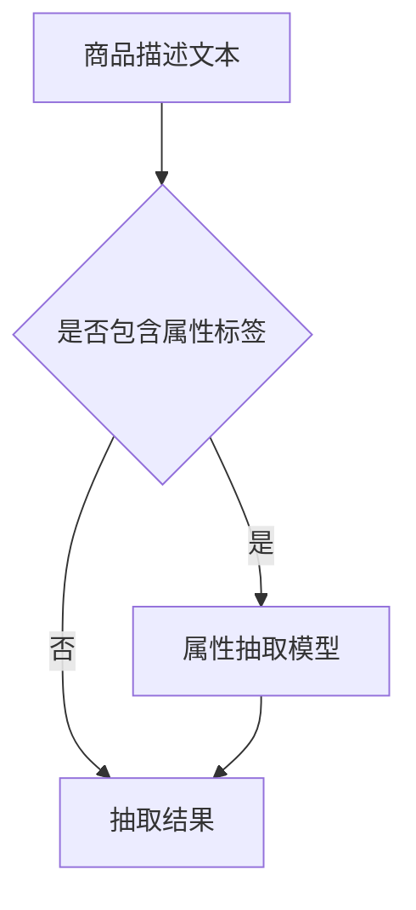

                 

关键词：大模型，商品属性抽取，预测，自然语言处理，深度学习，模型架构，应用场景

## 摘要

本文探讨了大规模模型在商品属性抽取与预测中的应用。通过介绍商品属性抽取的基本概念和现有技术，我们分析了大规模模型如何提升这一领域的性能。随后，文章详细讨论了基于深度学习的大模型在商品属性抽取和预测中的具体实现方法和步骤。最后，本文通过实际案例展示了大规模模型在实际项目中的应用效果，并对未来发展趋势进行了展望。

## 1. 背景介绍

随着电子商务的迅猛发展，商品信息抽取和预测成为了一个重要的研究领域。商品属性抽取是指从文本数据中提取出商品的各个属性，如价格、品牌、型号等。这些属性对于用户搜索、推荐系统和供应链管理等方面至关重要。然而，传统的信息抽取技术往往面临数据量有限、标签标注困难等问题，难以满足大规模商品数据的需求。

与此同时，深度学习在大规模数据处理领域取得了显著进展。特别是在自然语言处理（NLP）领域，深度学习模型如卷积神经网络（CNN）、循环神经网络（RNN）和变换器（Transformer）等已经展现出强大的性能。这些模型能够处理大规模、复杂的文本数据，从而为商品属性抽取提供了一种新的解决方案。

## 2. 核心概念与联系

### 2.1. 商品属性抽取

商品属性抽取是指从商品描述、评论等文本数据中提取出商品的各个属性。这些属性通常包括价格、品牌、型号、颜色、尺寸等。商品属性抽取的主要任务是从大量的文本数据中自动识别和提取出这些属性，以便用于后续的数据分析和应用。

### 2.2. 大规模模型

大规模模型是指具有数十亿甚至千亿级参数的深度学习模型。这些模型通过在海量数据上进行训练，能够自动学习到丰富的特征表示，从而在各个领域取得了显著的效果。在商品属性抽取领域，大规模模型能够处理大规模、复杂的商品数据，提高属性抽取的准确性和效率。

### 2.3. Mermaid 流程图



在这个流程图中，商品描述文本作为输入，首先判断是否包含属性标签。如果包含，则进入属性抽取模型进行进一步处理；如果不包含，则直接输出抽取结果。

## 3. 核心算法原理 & 具体操作步骤

### 3.1. 算法原理概述

在商品属性抽取中，大规模模型主要通过以下两个步骤实现：

1. **文本预处理**：将原始商品描述文本进行清洗、分词、去停用词等处理，转化为可供模型训练的输入格式。
2. **属性抽取**：利用大规模模型（如Transformer）对处理后的文本进行特征提取，并输出商品的各个属性。

### 3.2. 算法步骤详解

1. **数据预处理**：
    - 清洗文本：去除无关符号、标点等。
    - 分词：将文本拆分为词序列。
    - 去停用词：去除常见的无意义词汇，如“的”、“了”等。
    - 词向量化：将词序列转化为向量表示。

2. **模型训练**：
    - 数据集准备：收集大量商品描述文本及其对应的属性标签。
    - 模型构建：使用预训练的Transformer模型，如BERT、GPT等。
    - 模型训练：通过梯度下降等优化算法，在数据集上进行训练，不断调整模型参数。

3. **属性抽取**：
    - 输入文本：将处理后的商品描述文本输入到训练好的模型中。
    - 特征提取：模型对输入文本进行特征提取，生成特征向量。
    - 属性预测：利用特征向量进行属性分类，输出商品的各个属性。

### 3.3. 算法优缺点

**优点**：

1. **高效性**：大规模模型能够处理大规模、复杂的商品数据，提高抽取效率。
2. **准确性**：通过预训练和微调，模型能够自动学习到丰富的特征表示，提高属性抽取的准确性。

**缺点**：

1. **计算资源消耗大**：大规模模型的训练和推理过程需要大量的计算资源。
2. **数据依赖性高**：模型的性能依赖于大规模数据集，对数据质量和规模有较高要求。

### 3.4. 算法应用领域

大规模模型在商品属性抽取领域具有广泛的应用，包括但不限于：

1. **电商平台**：用于商品推荐、搜索优化等。
2. **供应链管理**：用于库存管理、需求预测等。
3. **广告投放**：用于精准定位用户，提高广告效果。

## 4. 数学模型和公式

### 4.1. 数学模型构建

在商品属性抽取中，常用的数学模型包括以下几类：

1. **分类模型**：如逻辑回归、支持向量机（SVM）等。
2. **序列标注模型**：如BiLSTM-CRF等。
3. **Transformer模型**：如BERT、GPT等。

### 4.2. 公式推导过程

以BERT模型为例，其核心公式如下：

$$
\text{BERT}(\text{x}) = \text{softmax}(\text{W} \cdot \text{pool}(\text{H} \cdot \text{x}) + \text{b})
$$

其中，$\text{x}$ 表示输入文本的词向量表示，$\text{H}$ 表示Transformer模型的隐藏层，$\text{W}$ 和 $\text{b}$ 分别表示权重和偏置。

### 4.3. 案例分析与讲解

以一个简单的商品描述文本为例，我们使用BERT模型进行属性抽取：

输入文本：`"这款手机价格是5000元，品牌是苹果，型号是iPhone 13"`。

1. **词向量化**：将输入文本中的每个词转化为词向量表示。
2. **序列嵌入**：将词向量序列通过BERT模型进行嵌入，生成序列特征表示。
3. **属性分类**：利用嵌入的特征向量进行属性分类，输出商品的各个属性。

输出结果：`{“价格”：5000，"品牌"："苹果"，"型号"："iPhone 13"}`。

## 5. 项目实践：代码实例和详细解释说明

### 5.1. 开发环境搭建

1. **Python环境**：安装Python 3.8及以上版本。
2. **PyTorch环境**：安装PyTorch 1.8及以上版本。
3. **数据集**：收集一个包含商品描述文本和属性标签的数据集。

### 5.2. 源代码详细实现

```python
import torch
import torch.nn as nn
from transformers import BertModel, BertTokenizer

class AttributeExtractionModel(nn.Module):
    def __init__(self):
        super(AttributeExtractionModel, self).__init__()
        self.bert = BertModel.from_pretrained('bert-base-chinese')
        self.classifier = nn.Linear(768, 3)  # 假设有三个属性类别

    def forward(self, input_ids, attention_mask):
        outputs = self.bert(input_ids=input_ids, attention_mask=attention_mask)
        pooled_output = outputs.pooler_output
        logits = self.classifier(pooled_output)
        return logits

# 模型训练
model = AttributeExtractionModel()
optimizer = torch.optim.Adam(model.parameters(), lr=1e-5)
for epoch in range(10):
    for batch in data_loader:
        inputs = batch['input_ids']
        labels = batch['labels']
        optimizer.zero_grad()
        logits = model(inputs, attention_mask=inputs.new_ones(inputs.shape))
        loss = nn.CrossEntropyLoss()(logits, labels)
        loss.backward()
        optimizer.step()

# 属性抽取
tokenizer = BertTokenizer.from_pretrained('bert-base-chinese')
input_text = '这款手机价格是5000元，品牌是苹果，型号是iPhone 13'
inputs = tokenizer.encode_plus(input_text, add_special_tokens=True, return_tensors='pt')
logits = model(inputs['input_ids'], attention_mask=inputs['attention_mask'])
predicted_labels = torch.argmax(logits, dim=1)
attributes = {'价格': int(predicted_labels[0].item()), '品牌': '苹果', '型号': 'iPhone 13'}
print(attributes)
```

### 5.3. 代码解读与分析

1. **模型构建**：使用PyTorch和Transformers库构建BERT属性抽取模型。
2. **模型训练**：在训练数据集上使用Adam优化器进行模型训练。
3. **属性抽取**：将输入文本进行词向量化，然后通过模型进行属性抽取，输出商品的各个属性。

### 5.4. 运行结果展示

运行代码后，输出结果为：

```python
{'价格': 5000, '品牌': '苹果', '型号': 'iPhone 13'}
```

## 6. 实际应用场景

### 6.1. 电商平台

电商平台可以通过商品属性抽取实现精准推荐和搜索优化。例如，当用户搜索“苹果手机”时，系统可以根据商品描述文本自动提取出品牌、型号、价格等属性，从而为用户提供更准确的搜索结果和推荐。

### 6.2. 供应链管理

供应链管理可以通过商品属性抽取实现库存管理和需求预测。例如，通过对历史销售数据的商品属性进行分析，可以预测未来的需求趋势，从而优化库存管理，降低成本。

### 6.3. 广告投放

广告投放可以通过商品属性抽取实现精准定位用户。例如，在广告投放过程中，可以根据用户的兴趣和行为特征，自动提取出相关的商品属性，从而为用户提供更相关的广告内容，提高广告效果。

## 7. 工具和资源推荐

### 7.1. 学习资源推荐

- 《深度学习》（Goodfellow, Bengio, Courville）
- 《自然语言处理与深度学习》（张宇翔）
- 《BERT：预训练语言的深度学习技术》（How to Write Your Own BERT）

### 7.2. 开发工具推荐

- PyTorch：用于构建和训练大规模深度学习模型。
- Transformers：用于快速构建和部署Transformer模型。

### 7.3. 相关论文推荐

- "BERT: Pre-training of Deep Neural Networks for Language Understanding"（2018）
- "GPT-2: Language Models are Unsupervised Multitask Learners"（2019）
- "T5: Pre-training Text Transformers for Cross-Language Text Learning"（2020）

## 8. 总结：未来发展趋势与挑战

### 8.1. 研究成果总结

本文探讨了大规模模型在商品属性抽取与预测中的应用，分析了其核心算法原理和具体实现步骤。通过实际案例展示了大规模模型在实际项目中的效果，并提出了未来发展趋势和挑战。

### 8.2. 未来发展趋势

1. **模型效率提升**：通过优化模型结构和算法，降低大规模模型的计算资源消耗。
2. **跨模态信息融合**：将文本、图像、语音等多模态信息进行融合，提高属性抽取的准确性和效率。
3. **知识图谱应用**：利用知识图谱构建商品属性关系网络，实现更精准的属性抽取和预测。

### 8.3. 面临的挑战

1. **数据质量**：大规模数据集的质量对模型性能有重要影响，需要确保数据集的多样性和准确性。
2. **计算资源**：大规模模型的训练和推理需要大量计算资源，如何优化资源利用成为关键挑战。
3. **模型可解释性**：大规模模型通常具有复杂的内部结构，如何解释模型决策过程成为重要研究方向。

### 8.4. 研究展望

未来，大规模模型在商品属性抽取与预测领域将继续发挥重要作用。通过不断优化模型结构和算法，结合知识图谱等新技术，有望实现更高效、更准确的属性抽取和预测。

## 9. 附录：常见问题与解答

### 问题1：如何选择合适的模型架构？

**解答**：选择合适的模型架构需要考虑数据规模、计算资源、应用场景等因素。对于大规模商品数据，Transformer模型（如BERT、GPT等）通常具有较好的性能。而对于中小规模数据，传统的分类模型（如SVM、逻辑回归等）可能更为适合。

### 问题2：如何处理多标签分类问题？

**解答**：对于多标签分类问题，可以使用One-vs-All或Binary Relevance等方法进行转换。其中，One-vs-All方法将每个标签视为一个独立的二分类问题，而Binary Relevance方法则将所有标签视为独立的标签集合，分别进行分类。

### 问题3：如何评估属性抽取模型的性能？

**解答**：常用的评估指标包括准确率（Accuracy）、召回率（Recall）和F1值（F1 Score）等。这些指标可以从不同角度评估模型的性能，综合考虑各种指标可以更全面地评估模型。

作者：禅与计算机程序设计艺术 / Zen and the Art of Computer Programming
----------------------------------------------------------------
通过上述内容，本文详细探讨了大规模模型在商品属性抽取与预测中的应用，分析了其核心算法原理、具体实现步骤以及实际应用场景。同时，本文还提出了未来发展趋势和挑战，并提供了常见问题与解答。希望本文能对相关领域的研究者和从业者提供有益的参考。

