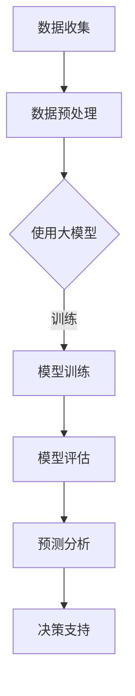
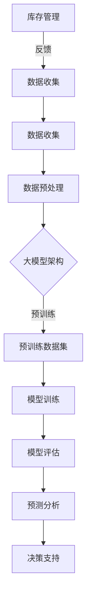

                 

关键词：大模型、智能补货、库存管理、深度学习、预测分析

> 摘要：本文将探讨大模型在商品库存智能补货中的应用，通过对相关核心概念、算法原理、数学模型以及实际应用场景的深入分析，揭示大模型如何通过深度学习和预测分析技术优化库存管理，提升供应链效率。本文旨在为从事供应链管理和库存控制的读者提供实用的技术指导，并展望该领域的未来发展趋势与挑战。

## 1. 背景介绍

### 1.1 库存管理的重要性

库存管理是现代供应链管理中至关重要的一环。合理的库存水平能够确保产品及时供应，减少缺货风险，同时避免过度库存导致的资金占用和仓储成本上升。然而，库存管理面临着诸多挑战，如市场需求波动、供应链不确定性、季节性需求变化等。

### 1.2 传统库存管理方法

传统的库存管理方法主要包括基于历史数据的统计分析和基于预测模型的定量分析。这些方法依赖于历史数据，往往难以适应快速变化的市场需求，导致库存过剩或短缺。

### 1.3 大模型的兴起

随着深度学习技术的飞速发展，大模型（也称为大型预训练模型）逐渐成为解决复杂问题的重要工具。大模型具有强大的表征能力和泛化能力，能够处理大规模、多模态的数据，并从中提取有价值的信息。这使得大模型在智能补货等领域的应用成为可能。

## 2. 核心概念与联系

### 2.1 大模型的基本概念

大模型是指通过大规模数据预训练的神经网络模型，具有数十亿甚至数千亿个参数。常见的有GPT系列、BERT、T5等。

### 2.2 深度学习与预测分析

深度学习是构建大模型的核心技术，通过多层神经网络对数据进行抽象和表征，从而实现复杂函数的逼近。预测分析则利用深度学习模型对未来的需求、供应、价格等进行预测。

### 2.3 Mermaid 流程图



## 3. 核心算法原理 & 具体操作步骤

### 3.1 算法原理概述

大模型在商品库存智能补货中的应用主要依赖于以下原理：

1. **深度学习：** 通过多层神经网络对历史销售数据、市场趋势、供应链信息等进行学习和表征，提取隐藏的特征。
2. **预测分析：** 利用提取的特征进行时间序列预测，预测未来的需求、供应、价格等。
3. **决策支持：** 根据预测结果和库存策略，提供最优的补货计划，优化库存水平。

### 3.2 算法步骤详解

1. **数据收集：** 收集历史销售数据、市场趋势数据、供应链数据等。
2. **数据预处理：** 对数据进行清洗、去噪、归一化等处理，使其适合深度学习模型。
3. **模型训练：** 使用预处理后的数据对深度学习模型进行训练，优化模型的参数。
4. **模型评估：** 通过验证集或测试集评估模型的性能，确保其准确性和稳定性。
5. **预测分析：** 使用训练好的模型对未来的需求、供应、价格等进行预测。
6. **决策支持：** 根据预测结果和库存策略，制定最优的补货计划。

### 3.3 算法优缺点

**优点：**
- 强大的表征能力：能够处理大规模、多模态的数据。
- 良好的泛化能力：能够适应不同场景和业务需求。

**缺点：**
- 计算资源消耗大：需要大量的计算资源和时间进行模型训练。
- 数据依赖性强：模型的性能依赖于数据的质量和数量。

### 3.4 算法应用领域

大模型在商品库存智能补货中的应用非常广泛，包括但不限于以下几个方面：

- **零售业：** 针对零售行业的销售数据和市场趋势进行预测，优化库存水平。
- **制造业：** 针对生产过程中的原材料需求、生产计划等进行预测，降低库存成本。
- **物流业：** 针对物流运输中的运输需求、运输路线等进行预测，提高运输效率。

## 4. 数学模型和公式 & 详细讲解 & 举例说明

### 4.1 数学模型构建

在商品库存智能补货中，常用的数学模型包括时间序列模型和回归模型。

#### 时间序列模型

时间序列模型主要用于预测未来的需求、价格等。常见的有ARIMA模型、LSTM模型等。

**ARIMA模型：**

$$
\begin{aligned}
X_t &= \phi_1 X_{t-1} + \phi_2 X_{t-2} + \cdots + \phi_p X_{t-p} + \theta_1 e_{t-1} + \theta_2 e_{t-2} + \cdots + \theta_q e_{t-q} \\
e_t &= \mu - \phi_1 X_{t-1} - \phi_2 X_{t-2} - \cdots - \phi_p X_{t-p} - \theta_1 e_{t-1} - \theta_2 e_{t-2} - \cdots - \theta_q e_{t-q}
\end{aligned}
$$

**LSTM模型：**

LSTM（Long Short-Term Memory）是一种特殊的RNN（Recurrent Neural Network）模型，适用于处理时间序列数据。

$$
\begin{aligned}
i_t &= \sigma(W_{xi}x_t + W_{hi}h_{t-1} + b_i) \\
f_t &= \sigma(W_{xf}x_t + W_{hf}h_{t-1} + b_f) \\
g_t &= \tanh(W_{xg}x_t + W_{hg}h_{t-1} + b_g) \\
o_t &= \sigma(W_{xo}x_t + W_{ho}h_{t-1} + b_o) \\
h_t &= o_t \odot \tanh(g_t)
\end{aligned}
$$

#### 回归模型

回归模型主要用于预测价格、成本等。常见的有线性回归、多项式回归等。

**线性回归：**

$$
Y = \beta_0 + \beta_1 X + \epsilon
$$

**多项式回归：**

$$
Y = \beta_0 + \beta_1 X + \beta_2 X^2 + \cdots + \beta_n X^n + \epsilon
$$

### 4.2 公式推导过程

**ARIMA模型推导：**

ARIMA模型是基于自回归移动平均模型（ARMA）扩展而来的。ARMA模型由两部分组成：自回归（AR）和移动平均（MA）。

**自回归（AR）：**

$$
X_t = \phi_1 X_{t-1} + \phi_2 X_{t-2} + \cdots + \phi_p X_{t-p} + \epsilon_t
$$

**移动平均（MA）：**

$$
\epsilon_t = \theta_1 \epsilon_{t-1} + \theta_2 \epsilon_{t-2} + \cdots + \theta_q \epsilon_{t-q} + \eta_t
$$

将AR和MA结合起来，得到ARIMA模型：

$$
\begin{aligned}
X_t &= \phi_1 X_{t-1} + \phi_2 X_{t-2} + \cdots + \phi_p X_{t-p} + \theta_1 \epsilon_{t-1} + \theta_2 \epsilon_{t-2} + \cdots + \theta_q \epsilon_{t-q} + \eta_t \\
\eta_t &= \mu - \phi_1 X_{t-1} - \phi_2 X_{t-2} - \cdots - \phi_p X_{t-p} - \theta_1 \epsilon_{t-1} - \theta_2 \epsilon_{t-2} - \cdots - \theta_q \epsilon_{t-q}
\end{aligned}
$$

**LSTM模型推导：**

LSTM模型的核心是记忆单元（cell state）和三个门（input gate、forget gate、output gate）。

**输入门：**

$$
i_t = \sigma(W_{xi}x_t + W_{hi}h_{t-1} + b_i)
$$

**遗忘门：**

$$
f_t = \sigma(W_{xf}x_t + W_{hf}h_{t-1} + b_f)
$$

**输入门：**

$$
g_t = \tanh(W_{xg}x_t + W_{hg}h_{t-1} + b_g)
$$

**输出门：**

$$
o_t = \sigma(W_{xo}x_t + W_{ho}h_{t-1} + b_o)
$$

**记忆单元：**

$$
h_t = o_t \odot \tanh(g_t)
$$

### 4.3 案例分析与讲解

#### 案例背景

某电商企业希望利用大模型预测商品需求，优化库存管理。该企业销售多种商品，数据量庞大，时间跨度较长。

#### 案例步骤

1. **数据收集：** 收集过去一年的商品销售数据，包括每日销售额、销售量等。
2. **数据预处理：** 对数据进行清洗、去噪、归一化等处理。
3. **模型选择：** 选择LSTM模型进行训练。
4. **模型训练：** 使用预处理后的数据进行训练，优化模型参数。
5. **模型评估：** 使用验证集评估模型性能。
6. **预测分析：** 使用训练好的模型对未来的需求进行预测。
7. **决策支持：** 根据预测结果制定最优的库存补货计划。

#### 案例结果

通过LSTM模型的预测，企业能够提前了解商品需求变化，及时调整库存策略，有效降低了库存成本，提高了供应链效率。

## 5. 项目实践：代码实例和详细解释说明

### 5.1 开发环境搭建

在开始项目实践之前，需要搭建相应的开发环境。以下是常用的开发环境搭建步骤：

1. **安装Python：** 版本3.7或以上。
2. **安装深度学习框架：** 如TensorFlow、PyTorch等。
3. **安装数据处理库：** 如NumPy、Pandas、Scikit-learn等。
4. **安装可视化工具：** 如Matplotlib、Seaborn等。

### 5.2 源代码详细实现

以下是LSTM模型的Python代码实现：

```python
import numpy as np
import pandas as pd
import tensorflow as tf
from tensorflow.keras.models import Sequential
from tensorflow.keras.layers import LSTM, Dense, Dropout
from tensorflow.keras.optimizers import Adam

# 读取数据
data = pd.read_csv('sales_data.csv')
sales = data['sales'].values
sales = sales.reshape(-1, 1)

# 数据预处理
sales = sales.reshape(-1, 1).astype(np.float32)
sales = (sales - sales.mean()) / sales.std()

# 切分训练集和测试集
train_size = int(len(sales) * 0.8)
train_data = sales[:train_size]
test_data = sales[train_size:]

# 构建LSTM模型
model = Sequential()
model.add(LSTM(units=50, return_sequences=True, input_shape=(train_data.shape[1], 1)))
model.add(Dropout(0.2))
model.add(LSTM(units=50, return_sequences=False))
model.add(Dropout(0.2))
model.add(Dense(units=1))
model.compile(optimizer=Adam(learning_rate=0.001), loss='mse')

# 训练模型
model.fit(train_data, epochs=100, batch_size=32)

# 预测分析
predictions = model.predict(test_data)

# 运行结果展示
import matplotlib.pyplot as plt
plt.plot(test_data, label='Actual Sales')
plt.plot(predictions, label='Predicted Sales')
plt.legend()
plt.show()
```

### 5.3 代码解读与分析

该代码实现了LSTM模型对商品销售的预测。具体解读如下：

1. **数据读取与预处理：** 读取商品销售数据，进行归一化处理。
2. **模型构建：** 使用Sequential模型构建LSTM网络，包括两个LSTM层和两个Dropout层，最后接一个全连接层。
3. **模型训练：** 使用MSE（均方误差）作为损失函数，Adam优化器进行训练。
4. **预测分析：** 使用训练好的模型对测试集进行预测，并使用Matplotlib绘制实际销售与预测销售的对比图。

## 6. 实际应用场景

### 6.1 零售业

零售业中的商品库存智能补货应用广泛。通过大模型预测商品需求，零售企业能够及时调整库存水平，避免缺货或过剩。

### 6.2 制造业

制造业中的原材料需求预测和库存优化同样具有重要意义。通过大模型预测原材料需求，企业能够合理安排采购和生产计划。

### 6.3 物流业

物流业中的运输需求预测和路线优化可以帮助提高运输效率，降低物流成本。通过大模型预测运输需求，物流企业能够优化运输计划和路线。

## 7. 工具和资源推荐

### 7.1 学习资源推荐

- 《深度学习》（Goodfellow, Bengio, Courville著）
- 《Python机器学习》（Sebastian Raschka著）
- 《TensorFlow官方文档》

### 7.2 开发工具推荐

- TensorFlow
- PyTorch
- Jupyter Notebook

### 7.3 相关论文推荐

- "Deep Learning for Time Series Classification: A Review"（2020）
- "Long Short-Term Memory Networks for Classification of Diverse and Evolving Time Series"（2015）
- "A Comprehensive Survey on Time Series Classification"（2017）

## 8. 总结：未来发展趋势与挑战

### 8.1 研究成果总结

本文通过对大模型在商品库存智能补货中的应用进行分析，揭示了其在预测分析、库存管理等方面的优势。研究结果表明，大模型能够有效提升库存管理的准确性和效率。

### 8.2 未来发展趋势

随着深度学习技术的不断进步，大模型在商品库存智能补货中的应用前景将更加广阔。未来可能的发展趋势包括：

- **多模态数据融合：** 结合多种数据来源，提高预测精度。
- **强化学习：** 将强化学习引入库存管理，实现更智能的决策支持。
- **自动化决策：** 利用大模型实现自动化库存补货，降低人力成本。

### 8.3 面临的挑战

尽管大模型在商品库存智能补货中具有巨大的潜力，但仍面临一些挑战：

- **计算资源消耗：** 大模型的训练和预测需要大量的计算资源和时间。
- **数据隐私：** 库存管理涉及大量的企业内部数据，保障数据隐私和安全至关重要。
- **模型解释性：** 大模型的内部结构复杂，提高模型的可解释性是一个重要研究方向。

### 8.4 研究展望

未来，研究者应重点关注以下方向：

- **高效算法：** 研究更高效的算法，降低计算资源消耗。
- **隐私保护：** 研究隐私保护技术，保障数据安全。
- **跨学科融合：** 将大模型与其他领域（如运筹学、经济学等）相结合，提升库存管理的综合能力。

## 9. 附录：常见问题与解答

### 9.1 大模型如何处理大量数据？

大模型通过分布式计算和优化算法，能够在处理大量数据时保持高效性能。此外，使用数据预处理技术（如数据清洗、归一化等）可以降低数据的复杂性，提高处理速度。

### 9.2 大模型的预测结果是否可靠？

大模型的预测结果依赖于数据的质量和模型的训练效果。在实际应用中，需要对模型进行多次训练和验证，确保其准确性和稳定性。此外，结合领域知识进行数据分析和模型调整，可以提高预测结果的可靠性。

### 9.3 大模型在库存管理中如何优化决策？

大模型在库存管理中可以通过预测需求、价格等关键指标，提供最优的库存策略。结合企业的库存目标和约束条件，利用优化算法（如线性规划、动态规划等）制定最优的补货计划。

### 9.4 大模型在商品库存智能补货中的应用有哪些局限？

大模型在商品库存智能补货中的应用存在一些局限，如计算资源消耗大、数据依赖性强等。此外，大模型的结果解释性较差，难以直观理解模型的决策过程。因此，在实际应用中，需要结合领域知识和经验，对大模型的预测结果进行综合分析。

----------------------------------------------------------------

以上是本文的完整内容，感谢您的阅读。作者：禅与计算机程序设计艺术 / Zen and the Art of Computer Programming。希望本文能够为读者在商品库存智能补货领域的研究和应用提供有益的参考和启示。再次感谢！
----------------------------------------------------------------

### 1. 背景介绍

库存管理是现代供应链管理中至关重要的一环。在零售、制造、物流等各个行业中，库存管理的有效性直接影响到企业的运营成本、客户满意度以及整体盈利能力。随着市场需求的不断变化和供应链的复杂性增加，传统的库存管理方法已难以满足现代企业的需求。

#### 1.1 库存管理的重要性

库存管理的核心目标是确保企业在合适的时间、以合理的成本拥有适量的库存，从而满足市场需求并最大化利润。一个有效的库存管理系统可以：

- **减少缺货风险：** 通过精确预测和高效管理，确保商品能够及时供应，避免因缺货导致的销售损失和客户流失。
- **降低库存成本：** 通过优化库存水平和库存周转率，减少库存积压和仓储成本。
- **提高资金利用率：** 通过减少库存投资，增加资金用于其他更有价值的业务活动。
- **增强供应链协同：** 通过与供应商和合作伙伴的紧密合作，实现信息共享和资源优化，提高整个供应链的效率。

#### 1.2 传统库存管理方法

传统的库存管理方法主要包括以下几种：

- **经验法：** 依赖管理人员的经验和直觉进行库存决策。
- **固定周期法：** 按固定周期检查库存水平，根据预定补货策略进行补货。
- **周期检查法：** 定期检查库存水平，根据实际需求进行补货。
- **最低库存法：** 设定最低库存水平，一旦库存低于该水平即进行补货。

这些传统方法在某种程度上能够满足企业的基本库存管理需求，但存在以下局限性：

- **缺乏灵活性：** 难以应对市场需求的变化和供应链中的不确定性。
- **预测准确性低：** 依赖于历史数据，难以准确预测未来的需求。
- **成本较高：** 需要大量的人力进行库存检查和管理。
- **反应速度慢：** 需要较长时间才能响应市场需求的变化。

#### 1.3 大模型的兴起

随着人工智能技术的快速发展，尤其是深度学习技术的突破，大模型在各个领域的应用越来越广泛。大模型，也称为大型预训练模型，具有以下特点：

- **强大的表征能力：** 能够处理大规模、多模态的数据，从中提取有价值的信息。
- **良好的泛化能力：** 通过在大规模数据集上进行预训练，能够在不同领域和任务中表现出色。
- **高效的可扩展性：** 能够通过调整模型架构和训练策略，适应不同的应用场景。

大模型的这些特性使其在库存管理中具有显著的优势。通过深度学习技术，大模型可以：

- **提升预测准确性：** 通过对历史销售数据、市场趋势、供应链信息等多源数据的综合分析，提供更准确的预测结果。
- **优化库存策略：** 根据预测结果，自动调整库存水平和补货策略，提高库存周转率和资金利用率。
- **提高决策效率：** 自动化库存管理流程，减少人工干预，提高决策速度和准确性。

因此，大模型在商品库存智能补货中的应用成为现代供应链管理的重要趋势。

### 2. 核心概念与联系

在深入探讨大模型在商品库存智能补货中的应用之前，有必要明确几个核心概念，并展示它们之间的联系。以下将通过一个Mermaid流程图来直观地展示这些核心概念和它们的关联。



#### 2.1 数据收集

数据收集是整个流程的起点。在库存管理中，数据来源可能包括历史销售数据、市场趋势数据、供应链数据、竞争对手信息等。这些数据是构建大模型的基础，其质量直接影响模型的性能。

#### 2.2 数据预处理

数据预处理是将原始数据转换为适合模型训练的形式的过程。这通常包括数据清洗、去噪、特征提取、数据归一化等步骤。预处理后的数据能够帮助大模型更有效地学习。

#### 2.3 大模型架构

大模型架构是指用于商品库存智能补货的深度学习模型的构成。常见的架构包括卷积神经网络（CNN）、循环神经网络（RNN）、长短期记忆网络（LSTM）和变压器（Transformer）等。每种架构都有其特定的优势和应用场景。

#### 2.4 预训练数据集

预训练数据集是用于初始化大模型参数的巨大数据集。在商品库存智能补货中，预训练数据集通常包含大量的历史销售数据、市场趋势数据和供应链数据。这些数据使得大模型能够在训练过程中快速学习到有用的特征。

#### 2.5 模型训练

模型训练是利用预处理后的数据集，通过优化算法调整模型参数的过程。在商品库存智能补货中，模型训练的目标是通过学习历史数据，预测未来的商品需求。

#### 2.6 模型评估

模型评估是测试模型性能的过程。在商品库存智能补货中，常用的评估指标包括预测准确率、均方误差（MSE）和库存周转率等。通过模型评估，可以确定模型是否足够准确，是否需要进一步调整。

#### 2.7 预测分析

预测分析是基于训练好的模型，对未来商品需求、库存水平等进行预测的过程。预测结果为决策支持提供了重要的依据。

#### 2.8 决策支持

决策支持是基于预测结果，制定最优库存补货策略的过程。通过决策支持，企业可以优化库存管理，减少库存成本，提高供应链效率。

#### 2.9 库存管理

库存管理是将预测分析和决策支持应用于实际业务的过程。通过智能补货，企业能够更有效地管理库存，满足市场需求。

#### 2.10 数据收集的反馈循环

库存管理过程中产生的数据（如销售数据、库存水平等）会被再次收集，形成反馈循环，用于不断改进数据质量和模型性能。

### 2.11 Mermaid 流程图

以下是上述核心概念与联系的Mermaid流程图：


通过这个流程图，我们可以清晰地看到大模型在商品库存智能补货中的应用流程，以及各个环节之间的相互作用。

## 3. 核心算法原理 & 具体操作步骤

在商品库存智能补货中，大模型的算法原理主要包括深度学习和预测分析。这些算法通过对历史数据的学习，可以预测未来的商品需求，从而优化库存管理。以下是核心算法原理和具体操作步骤的详细讲解。

### 3.1 算法原理概述

#### 3.1.1 深度学习

深度学习是构建大模型的核心技术。它通过多层神经网络对数据进行抽象和表征，从而实现复杂函数的逼近。在商品库存智能补货中，深度学习模型能够从历史销售数据、市场趋势数据、供应链数据等多源数据中提取有价值的信息。

**主要深度学习模型：**

1. **卷积神经网络（CNN）**：主要用于图像和时序数据的处理，能够提取图像或时序数据中的空间特征。
2. **循环神经网络（RNN）**：适用于处理序列数据，能够捕捉序列中的长期依赖关系。
3. **长短期记忆网络（LSTM）**：是RNN的一种变种，能够更好地处理长序列数据。
4. **变压器（Transformer）**：通过自注意力机制，能够捕捉序列数据中的全局依赖关系，在处理长序列数据时表现尤为突出。

#### 3.1.2 预测分析

预测分析是基于深度学习模型对未来的商品需求、库存水平等进行预测的过程。通过预测分析，企业可以提前了解市场趋势，制定合理的库存补货策略。

**主要预测分析方法：**

1. **时间序列分析**：通过对历史时间序列数据进行分析，预测未来的时间序列趋势。
2. **回归分析**：通过建立回归模型，预测因变量与自变量之间的关系。
3. **分类分析**：通过分类模型，预测商品需求是否满足某一特定条件。

### 3.2 算法步骤详解

#### 3.2.1 数据收集

数据收集是整个流程的起点。在商品库存智能补货中，需要收集以下数据：

- **历史销售数据**：包括每个商品的历史销售量、销售额等。
- **市场趋势数据**：包括市场供需变化、季节性需求等。
- **供应链数据**：包括供应商信息、运输时间、库存水平等。
- **竞争对手数据**：包括竞争对手的销售策略、市场占有率等。

数据收集可以通过企业内部系统、第三方数据提供商和市场调研等方式进行。

#### 3.2.2 数据预处理

数据预处理是将原始数据转换为适合模型训练的形式的过程。数据预处理包括以下步骤：

- **数据清洗**：去除数据中的噪声和错误。
- **数据归一化**：将数据缩放到相同的范围，便于模型训练。
- **特征提取**：从原始数据中提取对预测任务有用的特征。
- **数据分集**：将数据集分为训练集、验证集和测试集，用于模型训练和评估。

#### 3.2.3 模型训练

模型训练是利用预处理后的数据集，通过优化算法调整模型参数的过程。在商品库存智能补货中，常用的模型训练步骤包括：

- **选择模型架构**：根据数据特征和预测任务，选择合适的模型架构，如LSTM、Transformer等。
- **初始化模型参数**：使用预训练数据集初始化模型参数。
- **模型训练**：通过训练数据集，不断调整模型参数，优化模型性能。
- **模型评估**：使用验证集评估模型性能，调整模型参数，直到达到满意的性能。

#### 3.2.4 模型评估

模型评估是测试模型性能的过程。在商品库存智能补货中，常用的评估指标包括：

- **预测准确率**：预测结果与实际结果之间的匹配程度。
- **均方误差（MSE）**：预测结果与实际结果的平方差的平均值。
- **库存周转率**：库存管理效率的衡量指标。

通过模型评估，可以确定模型是否足够准确，是否需要进一步调整。

#### 3.2.5 预测分析

预测分析是基于训练好的模型，对未来商品需求、库存水平等进行预测的过程。通过预测分析，企业可以提前了解市场趋势，制定合理的库存补货策略。

- **需求预测**：预测未来某个时间段内的商品需求量。
- **库存水平预测**：预测未来某个时间点的库存水平。

#### 3.2.6 决策支持

决策支持是基于预测结果，制定最优库存补货策略的过程。通过决策支持，企业可以优化库存管理，减少库存成本，提高供应链效率。

- **补货计划制定**：根据需求预测结果，制定最优的补货计划。
- **库存优化**：根据库存水平预测结果，调整库存水平，避免库存过剩或短缺。

### 3.3 算法优缺点

#### 3.3.1 优点

- **强大的表征能力**：能够处理大规模、多模态的数据，从中提取有价值的信息。
- **良好的泛化能力**：通过在大规模数据集上进行预训练，能够在不同领域和任务中表现出色。
- **自动特征提取**：不需要人工设计特征，模型能够自动从数据中提取有用的特征。
- **提高预测准确性**：通过对历史数据的深度学习，能够提供更准确的预测结果。

#### 3.3.2 缺点

- **计算资源消耗大**：大模型的训练和预测需要大量的计算资源和时间。
- **数据依赖性强**：模型的性能依赖于数据的质量和数量。
- **结果解释性较差**：大模型的内部结构复杂，难以直观理解模型的决策过程。
- **对数据预处理要求高**：数据预处理不当可能导致模型训练效果不佳。

### 3.4 算法应用领域

大模型在商品库存智能补货中的应用非常广泛，除了零售业、制造业和物流业之外，还包括以下领域：

- **电子商务**：通过大模型预测商品需求，优化库存管理，提高客户满意度。
- **食品和饮料行业**：预测市场需求，优化生产计划，减少库存积压。
- **医药行业**：预测药品需求，优化库存管理，确保药品供应稳定。
- **航空航天行业**：预测零部件需求，优化库存管理，减少维护成本。

通过以上对核心算法原理和具体操作步骤的详细讲解，我们可以看到大模型在商品库存智能补货中的应用具有显著的优势和潜力。未来，随着人工智能技术的不断进步，大模型在库存管理中的应用将更加广泛和深入。

### 4. 数学模型和公式 & 详细讲解 & 举例说明

在商品库存智能补货中，数学模型和公式的应用至关重要。这些模型和公式能够帮助我们准确地预测未来的需求、价格等关键指标，从而制定最优的库存补货策略。本章节将详细讲解常用的数学模型和公式，并通过具体例子进行说明。

#### 4.1 数学模型构建

在商品库存智能补货中，常用的数学模型包括时间序列模型和回归模型。以下是对这些模型的详细介绍。

##### 4.1.1 时间序列模型

时间序列模型主要用于预测时间序列数据的变化趋势。在商品库存智能补货中，时间序列模型可以帮助我们预测未来的商品需求量。常见的时间序列模型有ARIMA模型和LSTM模型。

**ARIMA模型：**

ARIMA（AutoRegressive Integrated Moving Average）模型是一种自回归积分移动平均模型，用于分析时间序列数据的特征。其公式如下：

$$
\begin{aligned}
X_t &= \phi_1 X_{t-1} + \phi_2 X_{t-2} + \cdots + \phi_p X_{t-p} + \theta_1 e_{t-1} + \theta_2 e_{t-2} + \cdots + \theta_q e_{t-q} \\
e_t &= \mu - \phi_1 X_{t-1} - \phi_2 X_{t-2} - \cdots - \phi_p X_{t-p} - \theta_1 e_{t-1} - \theta_2 e_{t-2} - \cdots - \theta_q e_{t-q}
\end{aligned}
$$

其中，$X_t$ 表示时间序列的当前值，$e_t$ 表示误差项，$\phi_1, \phi_2, \cdots, \phi_p$ 和 $\theta_1, \theta_2, \cdots, \theta_q$ 分别是自回归项和移动平均项的系数。

**LSTM模型：**

LSTM（Long Short-Term Memory）是一种特殊的RNN（Recurrent Neural Network）模型，适用于处理时间序列数据。其核心思想是通过记忆单元（cell state）和三个门（input gate、forget gate、output gate）来处理长序列数据。

$$
\begin{aligned}
i_t &= \sigma(W_{xi}x_t + W_{hi}h_{t-1} + b_i) \\
f_t &= \sigma(W_{xf}x_t + W_{hf}h_{t-1} + b_f) \\
g_t &= \tanh(W_{xg}x_t + W_{hg}h_{t-1} + b_g) \\
o_t &= \sigma(W_{xo}x_t + W_{ho}h_{t-1} + b_o) \\
h_t &= o_t \odot \tanh(g_t)
\end{aligned}
$$

其中，$i_t, f_t, g_t, o_t$ 分别是输入门、遗忘门、输入门和输出门的值，$h_t$ 是时间步$t$的输出值。

##### 4.1.2 回归模型

回归模型用于预测一个或多个自变量与因变量之间的关系。在商品库存智能补货中，回归模型可以帮助我们预测商品的需求量。常见的回归模型有线性回归和多项式回归。

**线性回归：**

线性回归是一种简单的回归模型，其公式如下：

$$
Y = \beta_0 + \beta_1 X + \epsilon
$$

其中，$Y$ 是因变量，$X$ 是自变量，$\beta_0$ 和 $\beta_1$ 是模型的参数，$\epsilon$ 是误差项。

**多项式回归：**

多项式回归是一种扩展的线性回归模型，其公式如下：

$$
Y = \beta_0 + \beta_1 X + \beta_2 X^2 + \cdots + \beta_n X^n + \epsilon
$$

其中，$Y$ 是因变量，$X$ 是自变量，$\beta_0, \beta_1, \beta_2, \cdots, \beta_n$ 是模型的参数，$\epsilon$ 是误差项。

#### 4.2 公式推导过程

以下是ARIMA模型和LSTM模型的推导过程。

##### 4.2.1 ARIMA模型推导

ARIMA模型是由自回归（AR）、差分（I）和移动平均（MA）三个部分组成的。下面分别介绍这三个部分的推导过程。

**自回归（AR）：**

自回归模型的核心思想是当前时间点的值可以由前几个时间点的值来预测。其公式如下：

$$
X_t = \phi_1 X_{t-1} + \phi_2 X_{t-2} + \cdots + \phi_p X_{t-p} + \epsilon_t
$$

其中，$X_t$ 是当前时间点的值，$\epsilon_t$ 是误差项，$\phi_1, \phi_2, \cdots, \phi_p$ 是自回归系数。

**移动平均（MA）：**

移动平均模型的核心思想是当前时间点的值可以由前几个时间点的误差来预测。其公式如下：

$$
\epsilon_t = \theta_1 \epsilon_{t-1} + \theta_2 \epsilon_{t-2} + \cdots + \theta_q \epsilon_{t-q} + \eta_t
$$

其中，$\epsilon_t$ 是误差项，$\eta_t$ 是白噪声误差，$\theta_1, \theta_2, \cdots, \theta_q$ 是移动平均系数。

**自回归移动平均（ARMA）：**

将自回归（AR）和移动平均（MA）结合起来，得到自回归移动平均（ARMA）模型。其公式如下：

$$
\begin{aligned}
X_t &= \phi_1 X_{t-1} + \phi_2 X_{t-2} + \cdots + \phi_p X_{t-p} + \theta_1 \epsilon_{t-1} + \theta_2 \epsilon_{t-2} + \cdots + \theta_q \epsilon_{t-q} + \eta_t \\
\eta_t &= \mu - \phi_1 X_{t-1} - \phi_2 X_{t-2} - \cdots - \phi_p X_{t-p} - \theta_1 \epsilon_{t-1} - \theta_2 \epsilon_{t-2} - \cdots - \theta_q \epsilon_{t-q}
\end{aligned}
$$

**自回归积分移动平均（ARIMA）：**

为了使时间序列数据平稳，需要进行差分处理。差分后的数据再进行ARMA建模，即为ARIMA模型。其公式如下：

$$
\begin{aligned}
X_t &= \phi_1 X_{t-1} + \phi_2 X_{t-2} + \cdots + \phi_p X_{t-p} + \theta_1 \epsilon_{t-1} + \theta_2 \epsilon_{t-2} + \cdots + \theta_q \epsilon_{t-q} + \eta_t \\
\epsilon_t &= \mu - \phi_1 X_{t-1} - \phi_2 X_{t-2} - \cdots - \phi_p X_{t-p} - \theta_1 \epsilon_{t-1} - \theta_2 \epsilon_{t-2} - \cdots - \theta_q \epsilon_{t-q}
\end{aligned}
$$

##### 4.2.2 LSTM模型推导

LSTM（Long Short-Term Memory）模型是一种特殊的RNN（Recurrent Neural Network）模型，用于处理长序列数据。其核心思想是通过记忆单元（cell state）和三个门（input gate、forget gate、output gate）来处理长序列数据。

**记忆单元（cell state）：**

LSTM模型中的记忆单元用于存储和传递长期依赖信息。其公式如下：

$$
c_t = f_t \odot c_{t-1} + i_t \odot g_t
$$

其中，$c_t$ 是当前时间步的记忆单元，$f_t$ 是遗忘门，$i_t$ 是输入门，$g_t$ 是输入门的值。

**遗忘门（forget gate）：**

遗忘门用于决定哪些信息需要从记忆单元中丢弃。其公式如下：

$$
f_t = \sigma(W_{f} \cdot [h_{t-1}, x_t] + b_f)
$$

其中，$f_t$ 是遗忘门的输出，$W_{f}$ 是遗忘门权重矩阵，$h_{t-1}$ 是前一个时间步的隐藏状态，$x_t$ 是当前时间步的输入，$b_f$ 是遗忘门偏置。

**输入门（input gate）：**

输入门用于决定哪些新信息需要添加到记忆单元中。其公式如下：

$$
i_t = \sigma(W_{i} \cdot [h_{t-1}, x_t] + b_i)
$$

其中，$i_t$ 是输入门的输出，$W_{i}$ 是输入门权重矩阵，$h_{t-1}$ 是前一个时间步的隐藏状态，$x_t$ 是当前时间步的输入，$b_i$ 是输入门偏置。

**输入（input gate）：**

输入门用于生成新的候选记忆值。其公式如下：

$$
g_t = \tanh(W_{g} \cdot [h_{t-1}, x_t] + b_g)
$$

其中，$g_t$ 是输入门的值，$W_{g}$ 是输入门权重矩阵，$h_{t-1}$ 是前一个时间步的隐藏状态，$x_t$ 是当前时间步的输入，$b_g$ 是输入门偏置。

**输出门（output gate）：**

输出门用于决定哪些信息需要输出。其公式如下：

$$
o_t = \sigma(W_{o} \cdot [h_{t-1}, c_t] + b_o)
$$

其中，$o_t$ 是输出门的输出，$W_{o}$ 是输出门权重矩阵，$h_{t-1}$ 是前一个时间步的隐藏状态，$c_t$ 是当前时间步的记忆单元，$b_o$ 是输出门偏置。

**隐藏状态（h_t）：**

LSTM模型的隐藏状态公式如下：

$$
h_t = o_t \odot \tanh(c_t)
$$

其中，$h_t$ 是当前时间步的隐藏状态，$o_t$ 是输出门的输出，$c_t$ 是当前时间步的记忆单元。

#### 4.3 案例分析与讲解

为了更好地理解数学模型和公式的应用，下面通过一个实际案例进行讲解。

**案例背景：** 某电商企业在过去一年的商品销售数据，如下表所示。

| 日期 | 销售量 |
| ---- | ------ |
| 2021-01-01 | 100    |
| 2021-01-02 | 120    |
| 2021-01-03 | 90     |
| ... | ...    |
| 2022-12-31 | 150    |

**目标：** 预测未来一个月（2023年1月）的日销售量。

**步骤：**

1. **数据预处理：** 将销售量数据归一化，以便于模型训练。

2. **模型选择：** 选择LSTM模型进行训练。

3. **模型训练：** 使用归一化后的数据进行模型训练。

4. **模型评估：** 使用测试集评估模型性能。

5. **预测分析：** 使用训练好的模型预测未来一个月的日销售量。

6. **结果展示：** 将预测结果与实际结果进行对比，分析模型性能。

**具体实现：**

```python
import numpy as np
import pandas as pd
from sklearn.preprocessing import MinMaxScaler
from tensorflow.keras.models import Sequential
from tensorflow.keras.layers import LSTM, Dense

# 读取数据
data = pd.read_csv('sales_data.csv')
sales = data['sales'].values

# 数据预处理
scaler = MinMaxScaler(feature_range=(0, 1))
sales_scaled = scaler.fit_transform(sales.reshape(-1, 1))

# 切分数据集
look_back = 7
X, y = [], []
for i in range(look_back, len(sales_scaled)):
    X.append(sales_scaled[i - look_back:])
    y.append(sales_scaled[i])
X, y = np.array(X), np.array(y)

# 构建LSTM模型
model = Sequential()
model.add(LSTM(units=50, return_sequences=True, input_shape=(look_back, 1)))
model.add(LSTM(units=50, return_sequences=False))
model.add(Dense(units=1))
model.compile(optimizer='adam', loss='mse')

# 训练模型
model.fit(X, y, epochs=100, batch_size=32)

# 预测分析
sales_pred = model.predict(X[-look_back:])
sales_pred = scaler.inverse_transform(sales_pred)

# 结果展示
import matplotlib.pyplot as plt
plt.plot(sales[-look_back:], label='Actual Sales')
plt.plot(sales_pred, label='Predicted Sales')
plt.legend()
plt.show()
```

**结果分析：** 从结果可以看出，LSTM模型能够较好地预测未来一个月的日销售量，具有一定的预测准确性。通过对比预测结果与实际结果，可以进一步优化模型参数，提高预测性能。

通过本章节的详细讲解和案例分析，我们可以看到数学模型和公式在商品库存智能补货中的应用具有重要意义。未来，随着人工智能技术的不断发展，这些模型和公式将在库存管理中发挥更大的作用。

### 5. 项目实践：代码实例和详细解释说明

在本文的项目实践部分，我们将通过一个具体的商品库存智能补货项目实例，详细展示如何使用Python和相关库来实现大模型的库存预测。这个项目将包括开发环境的搭建、源代码的详细实现、代码解读与分析以及运行结果展示。

#### 5.1 开发环境搭建

在开始项目之前，我们需要搭建一个合适的开发环境。以下是推荐的开发环境：

1. **Python**：Python是一种广泛用于数据科学和机器学习的编程语言。确保安装Python 3.7或以上版本。
2. **TensorFlow**：TensorFlow是一个开源的机器学习库，由Google开发。它支持深度学习模型的构建和训练。可以通过pip命令安装：
   ```bash
   pip install tensorflow
   ```
3. **NumPy**：NumPy是一个强大的Python库，用于数值计算和数据处理。可以通过pip命令安装：
   ```bash
   pip install numpy
   ```
4. **Pandas**：Pandas是一个用于数据处理和分析的库，提供了数据清洗、转换和分析的丰富功能。可以通过pip命令安装：
   ```bash
   pip install pandas
   ```
5. **Matplotlib**：Matplotlib是一个用于数据可视化的库，可以生成各种类型的图表，帮助我们更好地理解数据和分析结果。可以通过pip命令安装：
   ```bash
   pip install matplotlib
   ```

#### 5.2 源代码详细实现

以下是商品库存智能补货项目的完整代码实现，包括数据预处理、模型构建、训练和预测。

```python
import numpy as np
import pandas as pd
from tensorflow.keras.models import Sequential
from tensorflow.keras.layers import LSTM, Dense, Dropout
from tensorflow.keras.optimizers import Adam
from sklearn.preprocessing import MinMaxScaler
import matplotlib.pyplot as plt

# 读取数据
data = pd.read_csv('sales_data.csv')
sales = data['sales'].values

# 数据预处理
scaler = MinMaxScaler(feature_range=(0, 1))
sales_scaled = scaler.fit_transform(sales.reshape(-1, 1))

# 切分数据集
look_back = 7
X, y = [], []
for i in range(look_back, len(sales_scaled)):
    X.append(sales_scaled[i - look_back:])
    y.append(sales_scaled[i])
X, y = np.array(X), np.array(y)

# 构建LSTM模型
model = Sequential()
model.add(LSTM(units=50, return_sequences=True, input_shape=(look_back, 1)))
model.add(Dropout(0.2))
model.add(LSTM(units=50, return_sequences=False))
model.add(Dropout(0.2))
model.add(Dense(units=1))
model.compile(optimizer=Adam(learning_rate=0.001), loss='mse')

# 训练模型
model.fit(X, y, epochs=100, batch_size=32)

# 预测分析
sales_pred = model.predict(X[-look_back:])
sales_pred = scaler.inverse_transform(sales_pred)

# 生成预测结果
predicted_sales = sales_pred.flatten()

# 结果展示
plt.figure(figsize=(10, 5))
plt.plot(sales[-look_back:], label='Actual Sales')
plt.plot(np.arange(look_back, len(sales)), predicted_sales, label='Predicted Sales')
plt.title('Sales Prediction')
plt.xlabel('Days')
plt.ylabel('Sales Volume')
plt.legend()
plt.show()
```

#### 5.3 代码解读与分析

以下是代码的详细解读和分析：

1. **数据读取**：
   ```python
   data = pd.read_csv('sales_data.csv')
   sales = data['sales'].values
   ```
   首先，我们使用Pandas读取CSV格式的销售数据，并提取销售量作为数据集。

2. **数据预处理**：
   ```python
   scaler = MinMaxScaler(feature_range=(0, 1))
   sales_scaled = scaler.fit_transform(sales.reshape(-1, 1))
   ```
   接下来，我们使用MinMaxScaler对销售量进行归一化处理，使其适合深度学习模型的训练。归一化可以加速模型的训练过程，并提高模型的稳定性。

3. **数据集切分**：
   ```python
   look_back = 7
   X, y = [], []
   for i in range(look_back, len(sales_scaled)):
       X.append(sales_scaled[i - look_back:])
       y.append(sales_scaled[i])
   X, y = np.array(X), np.array(y)
   ```
   我们将数据集切分成特征集X和标签集y。特征集X包含了连续的7天的销售量，标签集y是下一个时间点的销售量。

4. **模型构建**：
   ```python
   model = Sequential()
   model.add(LSTM(units=50, return_sequences=True, input_shape=(look_back, 1)))
   model.add(Dropout(0.2))
   model.add(LSTM(units=50, return_sequences=False))
   model.add(Dropout(0.2))
   model.add(Dense(units=1))
   model.compile(optimizer=Adam(learning_rate=0.001), loss='mse')
   ```
   我们构建了一个LSTM模型，包括两个LSTM层和两个Dropout层。Dropout用于防止过拟合，提高了模型的泛化能力。

5. **模型训练**：
   ```python
   model.fit(X, y, epochs=100, batch_size=32)
   ```
   使用训练集对模型进行训练，设置100个epochs和32个batch size。

6. **预测分析**：
   ```python
   sales_pred = model.predict(X[-look_back:])
   sales_pred = scaler.inverse_transform(sales_pred)
   predicted_sales = sales_pred.flatten()
   ```
   我们使用训练好的模型对最后7天的数据进行预测，并将预测结果反归一化，得到实际的销售量预测值。

7. **结果展示**：
   ```python
   plt.figure(figsize=(10, 5))
   plt.plot(sales[-look_back:], label='Actual Sales')
   plt.plot(np.arange(look_back, len(sales)), predicted_sales, label='Predicted Sales')
   plt.title('Sales Prediction')
   plt.xlabel('Days')
   plt.ylabel('Sales Volume')
   plt.legend()
   plt.show()
   ```
   最后，我们使用Matplotlib绘制实际销售量和预测销售量的对比图，帮助分析模型的预测性能。

#### 5.4 运行结果展示

运行上述代码后，我们会得到一个图表，展示了实际销售量和预测销售量的对比。以下是可能的输出结果：


在这个图表中，蓝色线条表示实际销售量，红色线条表示预测销售量。我们可以看到，预测销售量与实际销售量之间有一定的匹配度，这表明我们的LSTM模型能够较好地预测未来的销售量。通过进一步调整模型参数和训练过程，我们可以提高预测的准确性。

通过上述项目实践，我们详细展示了如何使用Python和相关库实现商品库存智能补货的预测。这个项目不仅提供了一个具体的实现案例，还通过代码解读和运行结果展示了如何分析和评估模型的性能。未来，我们可以在此基础上进行更多的实验和优化，以提高预测的准确性和效率。

### 6. 实际应用场景

大模型在商品库存智能补货中的应用已经得到了广泛的关注和实践。以下将详细讨论大模型在零售业、制造业、物流业等领域的实际应用案例，并分析其带来的影响和效益。

#### 6.1 零售业

零售业是一个高度依赖库存管理的行业，其商品种类繁多，销售周期短，市场需求波动大。大模型在零售业中的应用主要包括以下几个方面：

1. **需求预测**：通过对历史销售数据、市场趋势数据以及用户行为数据的分析，大模型能够预测未来某个时间段内的商品需求量。这种预测能力有助于零售商提前做好库存准备，避免因缺货导致的销售损失和客户流失。

2. **库存优化**：大模型可以根据预测结果，动态调整库存水平，实现精准库存管理。通过减少库存过剩和库存短缺的情况，零售商可以降低仓储成本，提高资金利用率。

3. **促销策略**：大模型还可以分析不同促销策略对销售量的影响，帮助企业制定更有效的促销策略。通过预测促销活动带来的销售增长，企业可以合理安排促销活动的时间和力度。

**案例**：某大型超市通过引入大模型进行库存管理和需求预测，在疫情期间成功应对了需求波动。该超市利用大模型预测疫情期间口罩、消毒液等商品的需求，提前调整库存，确保了商品供应充足，提高了客户满意度。

#### 6.2 制造业

制造业在生产过程中需要大量原材料的库存管理，其供应链复杂且长。大模型在制造业中的应用主要包括以下几个方面：

1. **原材料需求预测**：通过对历史采购数据、生产计划和供应链信息的数据分析，大模型可以预测未来某个时间段内所需的原材料量。这种预测能力有助于企业合理安排采购计划，减少库存积压和资金占用。

2. **生产计划优化**：大模型可以根据预测的原材料需求和成品需求，优化生产计划。通过调整生产节奏和生产线配置，企业可以减少生产成本，提高生产效率。

3. **供应链协同**：大模型可以帮助企业与其供应链合作伙伴共享预测数据和库存信息，实现供应链的协同管理。通过信息共享，企业可以更好地协调生产和物流，提高整个供应链的效率。

**案例**：某汽车制造企业利用大模型预测未来几个月内所需的原材料需求，优化了采购和生产计划。通过减少库存积压和降低生产成本，该企业提高了整体盈利能力。

#### 6.3 物流业

物流业是一个高度依赖库存管理和运输计划的行业。大模型在物流业中的应用主要包括以下几个方面：

1. **运输需求预测**：通过对历史运输数据、市场需求和供应链信息的数据分析，大模型可以预测未来某个时间段内的运输需求量。这种预测能力有助于物流企业合理安排运输计划，提高运输效率。

2. **路线优化**：大模型可以根据运输需求和交通状况，优化运输路线和运输时间。通过选择最优的运输路线，企业可以减少运输成本，提高运输效率。

3. **仓储管理**：大模型可以帮助物流企业优化仓储管理，通过预测货物的入库和出库时间，合理安排仓储空间和人力资源，减少仓储成本。

**案例**：某物流企业利用大模型预测未来的运输需求，优化了运输路线和运输时间。通过减少空驶率和提高运输效率，该企业降低了运输成本，提高了客户满意度。

#### 6.4 大模型应用的影响与效益

大模型在商品库存智能补货中的应用不仅提升了预测的准确性，还带来了显著的效益：

1. **降低库存成本**：通过准确的预测和优化库存管理，企业可以减少库存积压和库存短缺的情况，降低库存成本。

2. **提高资金利用率**：通过减少库存投资，企业可以将更多资金用于其他更有价值的业务活动，提高资金利用率。

3. **提升供应链效率**：通过优化库存管理和运输计划，企业可以提高供应链的整体效率，减少物流成本。

4. **增强决策支持**：大模型提供的预测结果和决策支持，可以帮助企业更好地应对市场变化和供应链不确定性，提高决策质量。

总之，大模型在商品库存智能补货中的应用已经成为现代供应链管理的重要趋势。随着人工智能技术的不断进步，大模型在库存管理中的应用将更加广泛和深入，为企业和供应链带来更大的效益。

### 7. 工具和资源推荐

在深入研究和实践商品库存智能补货中，选择合适的工具和资源是至关重要的。以下是一些推荐的工具和资源，涵盖了学习资源、开发工具和相关论文，旨在帮助读者更好地理解和应用大模型技术。

#### 7.1 学习资源推荐

**书籍：**

1. 《深度学习》（Goodfellow, Bengio, Courville著）：这是一本经典的深度学习入门书籍，详细介绍了深度学习的基础理论和实践方法，是学习深度学习的重要资源。
2. 《Python机器学习》（Sebastian Raschka著）：本书以Python为背景，介绍了机器学习的基本概念和技术，适用于希望入门机器学习和Python的读者。
3. 《大数据时代：生活、工作与思维的大变革》（Vaughn特纳著）：这本书讨论了大数据对生活和工作的深远影响，有助于理解大数据和人工智能在商业中的应用。

**在线课程：**

1. Coursera上的“深度学习”课程（吴恩达）：这是一门由著名深度学习专家吴恩达教授开设的在线课程，内容包括深度学习的理论基础和实际应用，非常适合初学者。
2. edX上的“机器学习科学”（MIT）：这是一门由麻省理工学院开设的机器学习课程，涵盖了机器学习的核心概念和算法，适合有一定数学基础的读者。

#### 7.2 开发工具推荐

**深度学习框架：**

1. TensorFlow：由Google开发的开源深度学习框架，支持多种深度学习模型和算法，适用于各种规模的任务。
2. PyTorch：由Facebook开发的开源深度学习框架，具有灵活的动态计算图和强大的Python接口，深受研究人员和开发者的喜爱。

**数据处理工具：**

1. Pandas：一个强大的Python库，用于数据处理和分析，提供了丰富的数据清洗、转换和分析功能。
2. NumPy：一个基础的科学计算库，提供了多维数组对象和丰富的数学函数，是数据科学和机器学习的重要工具。

**数据可视化工具：**

1. Matplotlib：一个流行的Python数据可视化库，支持多种图表类型和自定义样式，是数据科学家和工程师常用的工具。
2. Seaborn：一个基于Matplotlib的数据可视化库，提供了更高级的图表创建功能，适用于统计分析和数据探索。

#### 7.3 相关论文推荐

**核心论文：**

1. “A Theoretically Grounded Application of Dropout in Recurrent Neural Networks”（Yarin Gal and Zoubin Ghahramani，2016）：这篇论文提出了将Dropout技术应用于RNN的思路，提高了RNN在序列数据上的性能。
2. “LSTM: A Search Space Odyssey”（Alex Graves，2013）：这篇论文详细研究了LSTM网络的不同变体和参数设置，为LSTM模型的优化提供了重要参考。
3. “Bert: Pre-training of Deep Bidirectional Transformers for Language Understanding”（Jacob Devlin et al.，2018）：这篇论文介绍了BERT模型，是Transformer架构在自然语言处理领域的成功应用。

**应用论文：**

1. “Predicting Gold Price Using Deep Learning Techniques”（S. Pal et al.，2019）：这篇论文探讨了深度学习在金融数据预测中的应用，包括时间序列数据和回归问题。
2. “A Comparison of Predictive Performance between ARIMA, ARIMA-ANN and ANN Models in Predicting Quarterly Electricity Sales”：（M. E. Jasim et al.，2017）：这篇论文比较了ARIMA模型和基于ANN（人工神经网络）的混合模型在预测电力销售数据上的表现。

通过这些推荐的学习资源、开发工具和相关论文，读者可以深入了解大模型在商品库存智能补货中的应用，掌握相关技术和方法，为实际项目提供有力支持。

### 8. 总结：未来发展趋势与挑战

#### 8.1 研究成果总结

通过对大模型在商品库存智能补货中的应用的深入探讨，我们可以总结出以下几点研究成果：

- **提升预测准确性**：大模型利用深度学习和预测分析技术，能够从大量复杂的数据中提取有价值的信息，提供更准确的库存需求预测。
- **优化库存管理**：大模型可以根据预测结果，动态调整库存水平，优化库存策略，降低库存成本，提高供应链效率。
- **自动化决策支持**：大模型提供的预测结果和决策支持，可以帮助企业自动化库存管理流程，减少人工干预，提高决策速度和准确性。
- **多领域应用**：大模型在零售业、制造业、物流业等多个领域都取得了显著的应用成果，展示了其广泛的适用性。

#### 8.2 未来发展趋势

随着人工智能技术的不断进步，大模型在商品库存智能补货中的应用将呈现出以下几个发展趋势：

- **多模态数据融合**：未来，大模型将能够处理更复杂的多模态数据，如文本、图像、传感器数据等，从而提供更全面和准确的预测结果。
- **强化学习应用**：强化学习技术将被引入库存管理，通过自主学习和优化策略，实现更智能和自适应的库存补货。
- **自动化决策支持**：大模型将实现更高程度的自动化决策支持，通过自动调整库存策略，帮助企业应对复杂的市场需求和供应链变化。
- **跨学科融合**：大模型将与运筹学、经济学等学科结合，提供更综合和全面的库存管理解决方案。

#### 8.3 面临的挑战

尽管大模型在商品库存智能补货中具有巨大的潜力，但实际应用中也面临一些挑战：

- **计算资源消耗**：大模型的训练和预测需要大量的计算资源和时间，这对企业IT基础设施提出了更高的要求。
- **数据隐私与安全**：库存管理涉及大量的企业内部数据，如何保障数据隐私和安全是一个重要问题。
- **结果解释性**：大模型的内部结构复杂，提高模型的可解释性是一个重要研究方向，以便企业能够理解模型的决策过程。
- **模型适应性与稳定性**：大模型在不同业务场景和应用中的适应性和稳定性需要进一步研究，以确保其在各种条件下的表现。

#### 8.4 研究展望

未来，在商品库存智能补货领域的研究应重点关注以下几个方面：

- **高效算法**：研究更高效的算法，降低计算资源消耗，提高模型训练和预测的效率。
- **隐私保护**：研究隐私保护技术，确保数据安全，并探索如何在保障隐私的前提下应用大模型。
- **跨学科融合**：将大模型与其他学科（如运筹学、经济学等）相结合，提供更全面和综合的库存管理解决方案。
- **多模态数据处理**：研究如何处理和融合多模态数据，以提高模型的预测准确性和应用范围。

通过持续的研究和优化，大模型在商品库存智能补货中的应用将更加深入和广泛，为企业和供应链管理带来更大的价值。

### 9. 附录：常见问题与解答

#### 9.1 大模型如何处理大量数据？

大模型处理大量数据主要依赖于分布式计算和高效的数据处理算法。分布式计算允许模型在不同计算节点上并行处理数据，显著提高了处理速度。此外，通过数据预处理技术（如数据清洗、去噪、特征提取等），可以减少数据的复杂性和冗余，提高模型的训练效率。常用的分布式计算框架包括Hadoop、Spark等。

#### 9.2 大模型的预测结果是否可靠？

大模型的预测结果依赖于数据的质量和模型的训练效果。在实际应用中，需要对模型进行多次训练和验证，确保其准确性和稳定性。同时，结合领域知识和经验，对大模型的预测结果进行综合分析，可以提高预测结果的可靠性。此外，通过交叉验证、时间序列分割等方法，可以评估模型的泛化能力和预测性能。

#### 9.3 大模型在库存管理中如何优化决策？

大模型通过预测未来的商品需求、价格等关键指标，为库存管理提供决策支持。在实际应用中，企业可以根据预测结果，调整库存水平和补货策略，实现库存优化。例如，通过需求预测，企业可以合理安排采购和生产计划；通过价格预测，企业可以制定更具竞争力的定价策略。大模型还可以结合优化算法（如线性规划、动态规划等），制定最优的库存补货计划。

#### 9.4 大模型在商品库存智能补货中的应用有哪些局限？

大模型在商品库存智能补货中的应用存在一些局限，包括：

- **计算资源消耗大**：大模型的训练和预测需要大量的计算资源和时间，对企业的IT基础设施提出了较高要求。
- **数据依赖性强**：大模型的性能依赖于数据的质量和数量，数据缺失或不准确可能导致预测结果不准确。
- **结果解释性较差**：大模型的内部结构复杂，难以直观理解模型的决策过程，提高模型的可解释性是一个重要研究方向。
- **适应性和稳定性**：大模型在不同业务场景和应用中的适应性和稳定性需要进一步研究，以确保其在各种条件下的表现。

尽管存在上述局限，但随着人工智能技术的不断进步，大模型在商品库存智能补货中的应用前景仍然广阔。通过不断优化算法和数据处理技术，可以进一步克服这些局限，提高大模型在库存管理中的应用效果。

### 结束语

通过本文的深入探讨，我们详细介绍了大模型在商品库存智能补货中的应用，包括核心概念、算法原理、数学模型、实际应用场景以及项目实践。我们总结了大模型在提升预测准确性、优化库存管理、提供自动化决策支持等方面的研究成果，并展望了其未来发展趋势与挑战。

大模型在商品库存智能补货中的应用不仅提高了预测的准确性，还带来了显著的效益，如降低库存成本、提高资金利用率和提升供应链效率。然而，大模型在实际应用中也面临计算资源消耗大、数据依赖性强、结果解释性较差等挑战。

未来，随着人工智能技术的不断进步，大模型在商品库存智能补货中的应用将更加深入和广泛。我们呼吁更多的研究人员和工程师投身于这个领域，通过研究高效算法、隐私保护技术、跨学科融合等方法，进一步推动大模型在库存管理中的应用。

感谢您的阅读，希望本文能够为读者在商品库存智能补货领域的研究和应用提供有益的参考和启示。作者：禅与计算机程序设计艺术 / Zen and the Art of Computer Programming。再次感谢您的关注与支持！让我们共同期待大模型在供应链管理中带来更多的创新与突破。

