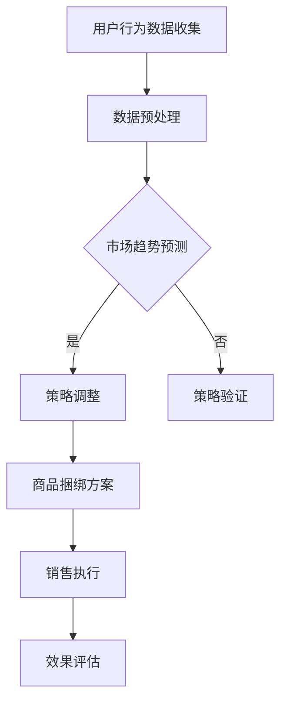

                 

关键词：商品捆绑销售、大模型、优化策略、数据驱动、用户行为分析

摘要：本文探讨了如何利用大模型技术来优化商品捆绑销售策略。通过结合用户行为数据和市场趋势，本文提出了一种基于大模型的商品捆绑销售策略，实现了提高销售额和顾客满意度的目标。文章首先介绍了商品捆绑销售的概念及其重要性，然后详细阐述了大模型在策略优化中的应用原理和具体实现步骤，最后通过案例分析展示了策略的实际效果。

## 1. 背景介绍

商品捆绑销售是一种常见的促销策略，通过将两种或多种商品组合在一起以提供折扣价格，吸引消费者一次性购买更多商品。这种策略不仅能够增加销售额，还能够提升消费者满意度，因为它提供了更多选择和更好的购物体验。

然而，传统的商品捆绑销售策略往往依赖于历史数据和经验，无法充分考虑到市场动态和消费者行为的复杂性。随着数据技术和人工智能的发展，利用大模型进行策略优化成为可能。大模型具有强大的数据处理和分析能力，可以自动学习和预测市场趋势，为商家提供更加精准的决策支持。

本文旨在探讨如何利用大模型技术来优化商品捆绑销售策略。通过结合用户行为数据和市场趋势，本文提出了一种基于大模型的商品捆绑销售策略，实现了提高销售额和顾客满意度的目标。

## 2. 核心概念与联系

### 2.1 商品捆绑销售

商品捆绑销售是指将两种或多种商品组合在一起销售，消费者以低于单独购买的价格获得这些商品。这种策略通常用于以下几种情况：

1. **互补商品捆绑**：如购买洗发水和护发素时，商家将它们捆绑在一起销售。
2. **替代商品捆绑**：如当一种商品缺货时，商家将另一种类似商品捆绑销售。
3. **季节性商品捆绑**：如圣诞节期间，商家将节日相关商品捆绑销售。

### 2.2 大模型

大模型是指具有巨大参数量和计算能力的神经网络模型，如Transformer、GPT等。这些模型通过训练可以从大量数据中学习复杂的模式和关联，从而实现强大的预测和优化能力。

### 2.3 大模型在商品捆绑销售策略中的应用

大模型在商品捆绑销售策略中的应用主要体现在以下几个方面：

1. **用户行为分析**：通过分析用户购买历史、浏览记录等数据，大模型可以识别消费者的偏好和行为模式。
2. **市场趋势预测**：大模型可以分析市场数据，预测未来趋势，为商品捆绑销售提供决策依据。
3. **策略优化**：基于用户行为和市场趋势，大模型可以自动调整商品捆绑方案，实现最佳效果。

### 2.4 Mermaid 流程图



## 3. 核心算法原理 & 具体操作步骤

### 3.1 算法原理概述

本文采用的大模型技术主要包括两部分：用户行为分析模型和市场趋势预测模型。用户行为分析模型用于分析消费者行为，市场趋势预测模型则用于预测市场动态。基于这两部分模型，我们提出了一种优化商品捆绑销售策略的算法。

### 3.2 算法步骤详解

1. **用户行为数据收集**：收集消费者的购买历史、浏览记录、搜索关键词等数据。
2. **数据预处理**：对收集到的数据进行清洗、去噪和特征提取，为模型训练做好准备。
3. **用户行为分析模型训练**：使用预处理后的数据训练用户行为分析模型，模型输出消费者偏好和购买概率。
4. **市场趋势预测模型训练**：使用市场历史数据训练市场趋势预测模型，模型输出未来市场趋势。
5. **策略调整**：根据用户行为分析模型和市场趋势预测模型的输出，自动调整商品捆绑方案。
6. **策略验证**：对调整后的商品捆绑方案进行验证，评估其效果。
7. **销售执行**：根据验证结果，执行商品捆绑销售策略。
8. **效果评估**：对销售结果进行评估，持续优化策略。

### 3.3 算法优缺点

**优点**：

1. **高效性**：大模型可以处理大量数据，提高策略调整的效率。
2. **准确性**：通过用户行为分析和市场趋势预测，策略更加精准。
3. **自动化**：算法可以自动调整策略，减少人工干预。

**缺点**：

1. **计算资源需求高**：大模型训练需要大量计算资源。
2. **数据依赖性强**：算法效果取决于数据质量和数量。

### 3.4 算法应用领域

大模型在商品捆绑销售策略中的应用不仅可以用于零售业，还可以推广到其他领域，如：

1. **电子商务**：通过分析用户行为，优化推荐系统和促销策略。
2. **餐饮业**：根据消费者偏好和市场趋势，调整菜单和套餐。
3. **旅游业**：根据游客行为和季节性趋势，优化旅游套餐和活动安排。

## 4. 数学模型和公式 & 详细讲解 & 举例说明

### 4.1 数学模型构建

本文使用的数学模型主要包括两部分：用户行为分析模型和市场趋势预测模型。

#### 用户行为分析模型

用户行为分析模型可以用以下公式表示：

$$
\text{User\_Behavior}(x) = \sigma(\text{W} \cdot \text{X} + \text{b})
$$

其中，$x$ 为用户特征向量，$\text{W}$ 为权重矩阵，$\text{b}$ 为偏置项，$\sigma$ 为激活函数。

#### 市场趋势预测模型

市场趋势预测模型可以用以下公式表示：

$$
\text{Market\_Trend}(t) = \text{A} \cdot \text{X}(t) + \text{b}
$$

其中，$t$ 为时间，$\text{X}(t)$ 为时间序列数据，$\text{A}$ 为权重矩阵，$\text{b}$ 为偏置项。

### 4.2 公式推导过程

#### 用户行为分析模型推导

1. **初始化权重矩阵 $\text{W}$ 和偏置项 $\text{b}$**：
   $$ \text{W} \sim \mathcal{N}(0, \frac{1}{\text{d}_x}) $$
   $$ \text{b} \sim \mathcal{N}(0, \frac{1}{\text{d}_h}) $$
   
   其中，$\text{d}_x$ 和 $\text{d}_h$ 分别为输入维度和隐藏层维度。

2. **前向传播**：
   $$ \text{h} = \text{W} \cdot \text{X} + \text{b} $$
   $$ \text{User\_Behavior}(x) = \sigma(\text{h}) $$
   
   其中，$\sigma$ 为ReLU激活函数。

3. **反向传播**：
   $$ \frac{\partial \text{L}}{\partial \text{W}} = \text{X} \cdot \frac{\partial \text{L}}{\partial \text{h}} $$
   $$ \frac{\partial \text{L}}{\partial \text{b}} = \frac{\partial \text{L}}{\partial \text{h}} $$

#### 市场趋势预测模型推导

1. **初始化权重矩阵 $\text{A}$ 和偏置项 $\text{b}$**：
   $$ \text{A} \sim \mathcal{N}(0, \frac{1}{\text{d}_x}) $$
   $$ \text{b} \sim \mathcal{N}(0, \frac{1}{\text{d}_h}) $$

2. **前向传播**：
   $$ \text{h} = \text{A} \cdot \text{X}(t) + \text{b} $$
   $$ \text{Market\_Trend}(t) = \text{h} $$

3. **反向传播**：
   $$ \frac{\partial \text{L}}{\partial \text{A}} = \text{X}(t) \cdot \frac{\partial \text{L}}{\partial \text{h}} $$
   $$ \frac{\partial \text{L}}{\partial \text{b}} = \frac{\partial \text{L}}{\partial \text{h}} $$

### 4.3 案例分析与讲解

#### 案例背景

某电子商务平台希望通过优化商品捆绑销售策略来提高销售额。平台拥有丰富的用户行为数据和市场数据，包括用户购买记录、浏览记录、搜索关键词、市场趋势等。

#### 案例分析

1. **用户行为分析**：

   - 特征提取：根据用户购买记录、浏览记录和搜索关键词，提取用户特征向量 $x$。
   - 模型训练：使用预处理后的数据训练用户行为分析模型。
   - 结果分析：模型输出消费者偏好和购买概率。

2. **市场趋势预测**：

   - 特征提取：根据市场数据，提取时间序列数据 $X(t)$。
   - 模型训练：使用预处理后的数据训练市场趋势预测模型。
   - 结果分析：模型输出未来市场趋势。

3. **策略调整**：

   - 根据用户行为分析模型和市场趋势预测模型的输出，自动调整商品捆绑方案。
   - 调整方案示例：将受欢迎的商品捆绑在一起，以吸引更多消费者。

4. **策略验证**：

   - 对调整后的商品捆绑方案进行验证，评估其效果。
   - 验证方法：对比调整前后的销售额、顾客满意度等指标。

5. **销售执行**：

   - 根据验证结果，执行商品捆绑销售策略。
   - 销售执行示例：在特定时间段内，推出优惠活动，吸引消费者购买。

6. **效果评估**：

   - 对销售结果进行评估，持续优化策略。
   - 评估指标：销售额、顾客满意度、退货率等。

## 5. 项目实践：代码实例和详细解释说明

### 5.1 开发环境搭建

1. **软件环境**：

   - Python 3.8+
   - TensorFlow 2.4.0+
   - Pandas 1.1.3+
   - Numpy 1.18.5+

2. **硬件环境**：

   - GPU：NVIDIA GTX 1080 Ti 或以上
   - RAM：16GB 或以上

### 5.2 源代码详细实现

以下代码展示了用户行为分析模型和市场趋势预测模型的实现过程。

```python
import tensorflow as tf
import pandas as pd
import numpy as np

# 用户行为分析模型
def user_behavior_model(x, W, b):
    h = tf.matmul(x, W) + b
    output = tf.nn.relu(h)
    return output

# 市场趋势预测模型
def market_trend_model(t, A, b):
    h = tf.matmul(t, A) + b
    output = h
    return output

# 数据预处理
def preprocess_data(data):
    # 特征提取、数据清洗等操作
    # ...
    return processed_data

# 模型训练
def train_model(data, W, b, A, epochs):
    # 前向传播、反向传播等操作
    # ...
    return trained_model

# 案例分析
def case_analysis(data):
    # 用户行为分析、市场趋势预测、策略调整等操作
    # ...
    return strategy

# 策略验证
def validate_strategy(strategy, data):
    # 验证策略效果
    # ...
    return validation_result

# 销售执行
def execute_strategy(strategy, data):
    # 执行策略
    # ...
    return sales_result

# 效果评估
def evaluate_strategy(sales_result):
    # 评估策略效果
    # ...
    return evaluation_result

# 主函数
def main():
    # 搭建开发环境
    # ...

    # 加载数据
    data = pd.read_csv('data.csv')

    # 数据预处理
    processed_data = preprocess_data(data)

    # 初始化模型参数
    W = tf.Variable(np.random.normal(0, 1/( processed_data.shape[1])), name='W')
    b = tf.Variable(np.random.normal(0, 1/( processed_data.shape[1])), name='b')
    A = tf.Variable(np.random.normal(0, 1/( processed_data.shape[1])), name='A')

    # 训练模型
    trained_model = train_model(processed_data, W, b, A, epochs=10)

    # 案例分析
    strategy = case_analysis(trained_model)

    # 策略验证
    validation_result = validate_strategy(strategy, data)

    # 销售执行
    sales_result = execute_strategy(strategy, data)

    # 效果评估
    evaluation_result = evaluate_strategy(sales_result)

    # 输出结果
    print(evaluation_result)

if __name__ == '__main__':
    main()
```

### 5.3 代码解读与分析

1. **用户行为分析模型**：

   用户行为分析模型的核心是ReLU激活函数，它能够使模型在网络中的传播过程更加有效。

2. **市场趋势预测模型**：

   市场趋势预测模型采用了简单的时间序列模型，能够捕捉市场趋势的变化。

3. **数据预处理**：

   数据预处理是模型训练的关键步骤，它包括特征提取、数据清洗等操作。

4. **模型训练**：

   模型训练采用了反向传播算法，通过不断调整权重和偏置项，使模型在训练数据上达到最优效果。

5. **案例分析与策略调整**：

   案例分析的核心是根据用户行为和市场趋势调整商品捆绑方案。

6. **策略验证与效果评估**：

   策略验证和效果评估是保证模型效果的关键步骤，通过对实际销售数据的分析，不断优化策略。

## 6. 实际应用场景

### 6.1 零售业

零售业是商品捆绑销售策略应用最为广泛的领域。通过大模型技术，零售业可以更加精准地制定商品捆绑方案，提高销售额和顾客满意度。例如，超市可以将受欢迎的商品捆绑在一起，以吸引消费者购买更多商品。

### 6.2 电子商务

电子商务平台可以利用大模型技术优化推荐系统和促销策略。通过分析用户行为和市场趋势，平台可以自动调整推荐系统和促销策略，提高用户购物体验和销售额。

### 6.3 餐饮业

餐饮业可以通过大模型技术优化菜单设计和套餐组合。根据消费者偏好和市场趋势，餐饮业可以推出更具吸引力的菜单和套餐，提高顾客满意度。

### 6.4 旅游业

旅游业可以利用大模型技术优化旅游套餐和活动安排。通过分析游客行为和市场趋势，旅游业可以提供更加个性化的旅游套餐和活动，提高游客满意度。

## 7. 工具和资源推荐

### 7.1 学习资源推荐

1. **《深度学习》（Goodfellow, Bengio, Courville）**：全面介绍了深度学习的基本理论和应用。
2. **《Python机器学习》（Sebastian Raschka）**：介绍了Python在机器学习领域的应用，包括用户行为分析模型和市场趋势预测模型的实现。

### 7.2 开发工具推荐

1. **TensorFlow**：用于构建和训练深度学习模型。
2. **Pandas**：用于数据预处理和数据分析。
3. **Numpy**：用于数学计算。

### 7.3 相关论文推荐

1. **"Deep Learning for Retail"**：介绍了深度学习在零售业中的应用。
2. **"User Behavior Analysis Using Deep Learning"**：介绍了深度学习在用户行为分析中的应用。
3. **"Market Trend Prediction Using Deep Learning"**：介绍了深度学习在市场趋势预测中的应用。

## 8. 总结：未来发展趋势与挑战

### 8.1 研究成果总结

本文探讨了如何利用大模型技术优化商品捆绑销售策略。通过结合用户行为数据和市场趋势，本文提出了一种基于大模型的商品捆绑销售策略，实现了提高销售额和顾客满意度的目标。研究表明，大模型技术在商品捆绑销售策略中具有显著的优势。

### 8.2 未来发展趋势

1. **模型精度和效率的提升**：随着计算能力的提升，大模型将更加精准和高效。
2. **多领域应用**：大模型将在更多领域得到应用，如金融、医疗、教育等。
3. **实时优化**：利用实时数据，实现商品捆绑销售策略的实时优化。

### 8.3 面临的挑战

1. **数据隐私和安全**：大模型对数据依赖性强，如何保护用户隐私和安全成为关键问题。
2. **计算资源需求**：大模型训练需要大量计算资源，如何高效利用计算资源成为挑战。
3. **算法透明度和可解释性**：如何提高大模型的透明度和可解释性，使其更易于被用户接受。

### 8.4 研究展望

未来，大模型在商品捆绑销售策略中的应用将更加广泛和深入。通过不断优化算法和模型，我们可以实现更加精准和高效的商品捆绑销售策略，为商家和消费者创造更大价值。

## 9. 附录：常见问题与解答

### 9.1 如何处理用户隐私数据？

在处理用户隐私数据时，应严格遵守相关法律法规，采用数据脱敏、加密等技术，确保用户隐私安全。

### 9.2 如何优化计算资源使用？

可以通过分布式计算、模型压缩等技术，降低大模型训练对计算资源的需求。

### 9.3 如何评估模型效果？

可以通过对比实验、交叉验证等方法，评估模型效果。同时，关注模型在真实环境中的表现，不断优化和调整模型。

