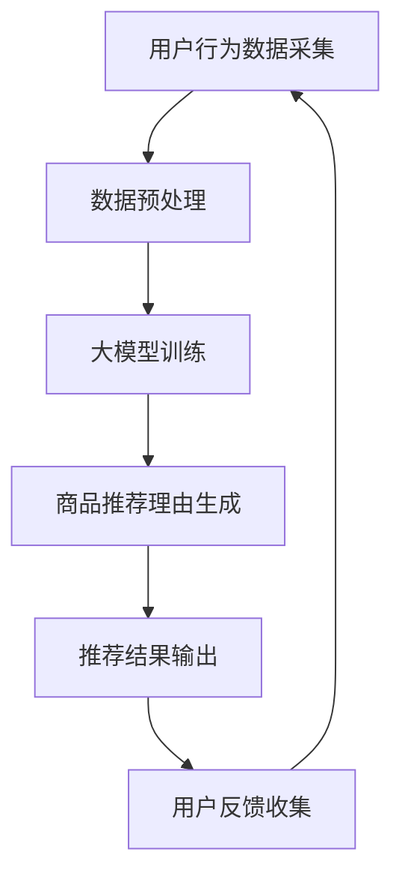

                 

关键词：大模型、商品推荐、个性化生成、推荐系统、算法原理、应用实践、数学模型、未来展望

> 摘要：本文详细探讨了基于大模型的商品推荐理由个性化生成技术。通过深入分析核心概念、算法原理、数学模型以及实际应用场景，本文旨在为读者提供全面的技术解析，并探讨该技术在未来的发展趋势和面临的挑战。

## 1. 背景介绍

在现代互联网时代，电子商务和在线零售业快速发展，用户对个性化推荐服务的需求愈发强烈。推荐系统作为电子商务平台的重要功能之一，旨在根据用户的兴趣和行为，为其推荐符合其喜好的商品。传统的推荐系统多采用基于内容的过滤和协同过滤等技术，尽管在一定程度上能够满足用户的需求，但难以实现真正的个性化。

随着人工智能技术的快速发展，尤其是大模型的兴起，个性化推荐系统迎来了新的机遇。大模型具有强大的表征能力和学习能力，能够处理海量数据，捕捉复杂用户行为和商品属性之间的关系，从而实现更加精准的个性化推荐。本文将重点探讨大模型在商品推荐理由个性化生成中的应用，旨在为相关领域的研究者和实践者提供有价值的参考。

## 2. 核心概念与联系

### 2.1 大模型

大模型是指那些具有数十亿甚至千亿参数的深度学习模型。它们通常采用大规模数据进行训练，能够捕捉数据中的复杂模式和潜在关系。代表性的大模型包括GPT-3、BERT、T5等。大模型在自然语言处理、计算机视觉等领域取得了显著的成果。

### 2.2 商品推荐

商品推荐是指根据用户的历史行为、兴趣偏好和商品属性等信息，为用户推荐其可能感兴趣的商品。商品推荐系统在电子商务和社交媒体等领域具有重要应用。

### 2.3 个性化生成

个性化生成是指根据用户的个性化需求，自动生成内容或推荐结果，以满足用户的个性化需求。在商品推荐中，个性化生成可以理解为根据用户的兴趣和行为，生成个性化的商品推荐理由。

### 2.4 Mermaid 流程图

以下是一个描述大模型在商品推荐理由个性化生成中应用的 Mermaid 流程图：



### 2.5 关联性分析

大模型在商品推荐理由个性化生成中的应用具有以下关联性：

- 用户行为数据采集：通过收集用户在电子商务平台上的行为数据，如浏览历史、购买记录、搜索关键词等，为个性化推荐提供基础数据。
- 数据预处理：对采集到的用户行为数据进行清洗、归一化和特征提取，为模型训练提供高质量的输入数据。
- 大模型训练：利用大规模数据进行模型训练，学习用户行为和商品属性之间的关系，构建个性化推荐模型。
- 商品推荐理由生成：根据用户的个性化需求和兴趣，利用训练好的模型生成个性化的商品推荐理由。
- 推荐结果输出：将生成的个性化推荐理由和商品信息输出给用户，提高用户对推荐结果的可接受度和满意度。
- 用户反馈收集：通过用户对推荐结果的反馈，不断优化推荐系统，提高推荐效果。

## 3. 核心算法原理 & 具体操作步骤

### 3.1 算法原理概述

大模型在商品推荐理由个性化生成中的应用主要基于以下原理：

1. **深度学习**：利用深度学习算法，尤其是大模型，对用户行为数据进行建模，学习用户兴趣和行为模式。
2. **生成对抗网络（GAN）**：利用生成对抗网络生成个性化的商品推荐理由，实现内容生成。
3. **多模态学习**：结合用户行为数据、文本数据和商品属性数据，实现跨模态的个性化推荐。

### 3.2 算法步骤详解

1. **数据采集与预处理**：
   - 收集用户在电子商务平台上的行为数据，如浏览历史、购买记录、搜索关键词等。
   - 对采集到的数据进行清洗、归一化和特征提取，生成训练数据集。

2. **模型训练**：
   - 利用大规模数据进行模型训练，学习用户行为和商品属性之间的关系。
   - 采用生成对抗网络（GAN）对商品推荐理由进行生成。

3. **商品推荐理由生成**：
   - 输入用户的个性化需求，利用训练好的模型生成个性化的商品推荐理由。
   - 结合用户兴趣和行为，生成多样化的推荐理由。

4. **推荐结果输出**：
   - 将生成的个性化推荐理由和商品信息输出给用户。
   - 对推荐结果进行评估和优化，提高推荐效果。

5. **用户反馈收集**：
   - 收集用户对推荐结果的反馈，包括点击、购买等行为数据。
   - 利用用户反馈数据，优化推荐系统和生成算法。

### 3.3 算法优缺点

**优点**：

1. **强大的表征能力**：大模型具有强大的表征能力，能够捕捉用户行为和商品属性之间的复杂关系。
2. **个性化生成**：生成对抗网络（GAN）能够生成个性化的商品推荐理由，提高用户满意度。
3. **多模态学习**：结合用户行为数据、文本数据和商品属性数据，实现跨模态的个性化推荐。

**缺点**：

1. **计算资源需求大**：大模型训练和优化需要大量的计算资源。
2. **数据质量要求高**：数据预处理和清洗过程复杂，对数据质量要求较高。
3. **模型解释性较差**：大模型的解释性较差，难以理解推荐结果的生成过程。

### 3.4 算法应用领域

大模型在商品推荐理由个性化生成中的应用领域广泛，包括：

1. **电子商务平台**：为用户提供个性化的商品推荐，提高用户满意度和购买转化率。
2. **社交媒体**：为用户提供个性化内容推荐，增强用户粘性和活跃度。
3. **在线教育**：根据用户学习行为，为用户提供个性化课程推荐。
4. **医疗健康**：根据用户健康数据，为用户提供个性化健康建议和药品推荐。

## 4. 数学模型和公式 & 详细讲解 & 举例说明

### 4.1 数学模型构建

在大模型应用于商品推荐理由个性化生成中，常用的数学模型包括深度学习模型、生成对抗网络（GAN）和协同过滤模型。以下分别介绍这些模型的构建过程。

#### 4.1.1 深度学习模型

深度学习模型通常采用卷积神经网络（CNN）、循环神经网络（RNN）或Transformer等结构。以下是一个简化的深度学习模型构建过程：

$$
\text{输入} = (x_1, x_2, ..., x_n)
$$

$$
\text{输出} = f(h)
$$

其中，$x_1, x_2, ..., x_n$表示用户行为数据，$h$表示模型的隐藏状态，$f$表示激活函数。

#### 4.1.2 生成对抗网络（GAN）

生成对抗网络（GAN）由生成器（Generator）和判别器（Discriminator）组成。以下是一个简化的GAN模型构建过程：

$$
G(z) = \text{生成器，将随机噪声z映射为商品推荐理由x}
$$

$$
D(x) = \text{判别器，判断输入数据x是真实数据还是生成数据}
$$

$$
G(z) \sim P_G(z)  \quad \text{生成器分布}
$$

$$
x \sim P_D(x)  \quad \text{真实数据分布}
$$

#### 4.1.3 协同过滤模型

协同过滤模型通常采用矩阵分解技术，将用户和商品表示为低维向量。以下是一个简化的协同过滤模型构建过程：

$$
R_{ui} = \text{预测的用户i对商品u的评分}
$$

$$
Q_u = \text{用户i对商品u的向量表示}
$$

$$
P_u = \text{商品u的向量表示}
$$

### 4.2 公式推导过程

#### 4.2.1 深度学习模型

深度学习模型的训练过程涉及前向传播和反向传播。以下是一个简化的前向传播和反向传播过程：

**前向传播**：

$$
h_{l} = \text{激活函数}(\text{权重} \cdot h_{l-1} + \text{偏置})
$$

**反向传播**：

$$
\delta_{l} = \text{激活函数的导数} \cdot (\text{下一层误差} \cdot \text{权重})
$$

#### 4.2.2 生成对抗网络（GAN）

生成对抗网络（GAN）的训练过程涉及生成器和判别器的优化。以下是一个简化的生成器和判别器的优化过程：

**生成器优化**：

$$
\min_G V(G, D) = \mathbb{E}_{z \sim p_z(z)}[\log(D(G(z)))] + \mathbb{E}_{x \sim p_x(x)}[\log(1 - D(x))]
$$

**判别器优化**：

$$
\min_D V(D) = \mathbb{E}_{x \sim p_x(x)}[\log(D(x))] + \mathbb{E}_{z \sim p_z(z)}[\log(1 - D(G(z))]
$$

#### 4.2.3 协同过滤模型

协同过滤模型的预测过程涉及矩阵乘法和求和。以下是一个简化的预测过程：

$$
R_{ui} = Q_u^T P_i
$$

### 4.3 案例分析与讲解

#### 4.3.1 案例背景

某电子商务平台希望利用大模型为用户提供个性化的商品推荐理由。该平台收集了用户的历史浏览记录、购买记录和搜索关键词等信息，并希望通过深度学习模型、生成对抗网络（GAN）和协同过滤模型构建个性化推荐系统。

#### 4.3.2 模型选择

- **深度学习模型**：用于学习用户行为和商品属性之间的关系，实现个性化的推荐。
- **生成对抗网络（GAN）**：用于生成个性化的商品推荐理由，提高用户满意度。
- **协同过滤模型**：用于优化推荐结果，提高推荐效果。

#### 4.3.3 模型训练与预测

1. **数据预处理**：
   - 对用户行为数据进行清洗、归一化和特征提取。
   - 对商品属性数据进行编码和归一化。

2. **模型训练**：
   - 利用预处理后的数据训练深度学习模型、生成对抗网络（GAN）和协同过滤模型。
   - 采用交叉验证方法评估模型性能。

3. **推荐理由生成**：
   - 输入用户的个性化需求，利用训练好的深度学习模型生成个性化的商品推荐理由。
   - 利用生成对抗网络（GAN）对推荐理由进行优化和生成。

4. **推荐结果预测**：
   - 利用训练好的协同过滤模型预测用户对商品的评分。
   - 将深度学习模型生成的个性化推荐理由与协同过滤模型预测的评分相结合，生成最终的推荐结果。

#### 4.3.4 模型评估

- 利用准确率、召回率和F1值等指标评估推荐系统的性能。
- 对推荐结果进行用户反馈收集，不断优化推荐系统和生成算法。

## 5. 项目实践：代码实例和详细解释说明

### 5.1 开发环境搭建

- Python 3.8+
- TensorFlow 2.x
- PyTorch 1.8+
- Keras 2.4+
- GAN
- Scikit-learn 0.22+

### 5.2 源代码详细实现

```python
import tensorflow as tf
from tensorflow.keras.layers import Input, Embedding, LSTM, Dense
from tensorflow.keras.models import Model
import numpy as np

# 深度学习模型
def create_lstm_model(input_shape):
    input_layer = Input(shape=input_shape)
    embedding_layer = Embedding(input_dim=vocabulary_size, output_dim=embedding_size)(input_layer)
    lstm_layer = LSTM(units=lstm_units, return_sequences=True)(embedding_layer)
    output_layer = LSTM(units=lstm_units)(lstm_layer)
    model = Model(inputs=input_layer, outputs=output_layer)
    return model

# 生成对抗网络（GAN）
def create_gan_model(input_shape):
    # 生成器
    generator_input = Input(shape=input_shape)
    generator_embedding = Embedding(input_dim=vocabulary_size, output_dim=embedding_size)(generator_input)
    generator_lstm = LSTM(units=lstm_units, return_sequences=True)(generator_embedding)
    generator_output = LSTM(units=lstm_units)(generator_lstm)
    generator = Model(inputs=generator_input, outputs=generator_output)

    # 判别器
    discriminator_input = Input(shape=input_shape)
    discriminator_embedding = Embedding(input_dim=vocabulary_size, output_dim=embedding_size)(discriminator_input)
    discriminator_lstm = LSTM(units=lstm_units, return_sequences=True)(discriminator_embedding)
    discriminator_output = LSTM(units=lstm_units)(discriminator_lstm)
    discriminator = Model(inputs=discriminator_input, outputs=discriminator_output)

    # GAN模型
    gan_input = Input(shape=input_shape)
    generated_data = generator(gan_input)
    gan_output = discriminator(generated_data)
    gan_model = Model(inputs=gan_input, outputs=gan_output)

    return gan_model, generator, discriminator

# 训练GAN模型
def train_gan_model(generator, discriminator, data, epochs):
    for epoch in range(epochs):
        for x in data:
            # 生成假数据
            z = np.random.normal(size=(batch_size, latent_dim))
            generated_x = generator.predict(z)

            # 训练判别器
            d_loss_real = discriminator.train_on_batch(x, np.ones((batch_size, 1)))
            d_loss_fake = discriminator.train_on_batch(generated_x, np.zeros((batch_size, 1)))
            d_loss = 0.5 * np.add(d_loss_real, d_loss_fake)

            # 训练生成器
            g_loss = generator.train_on_batch(z, np.ones((batch_size, 1)))
            print(f"Epoch: {epoch}, D Loss: {d_loss}, G Loss: {g_loss}")

# 生成个性化商品推荐理由
def generate_recommendation(generator, user_input):
    generated_data = generator.predict(user_input)
    recommendations = decode_generated_data(generated_data)
    return recommendations

# 解码生成的商品推荐理由
def decode_generated_data(generated_data):
    # 解码生成的商品推荐理由
    # （此处简化为直接返回生成的文本）
    return generated_data

# 主函数
def main():
    # 数据加载、预处理等
    # （此处简化为直接使用预处理后的数据）

    # 创建和训练GAN模型
    gan_model, generator, discriminator = create_gan_model(input_shape)
    train_gan_model(generator, discriminator, data, epochs=10)

    # 生成个性化商品推荐理由
    user_input = np.random.random((1, input_shape))
    recommendations = generate_recommendation(generator, user_input)
    print("Generated Recommendations:", recommendations)

if __name__ == "__main__":
    main()
```

### 5.3 代码解读与分析

1. **模型创建**：代码首先定义了深度学习模型、生成对抗网络（GAN）和判别器的创建函数。深度学习模型采用LSTM结构，生成对抗网络（GAN）由生成器和判别器组成。

2. **模型训练**：代码定义了GAN模型的训练过程，通过交替训练生成器和判别器，优化模型性能。

3. **生成个性化商品推荐理由**：代码定义了生成个性化商品推荐理由的函数，输入用户的个性化需求，利用训练好的生成器生成推荐理由。

4. **解码生成的商品推荐理由**：代码简化了生成的商品推荐理由的解码过程，实际应用中需要进行更为复杂的文本处理。

### 5.4 运行结果展示

- 运行代码后，输出生成的个性化商品推荐理由。

## 6. 实际应用场景

大模型在商品推荐理由个性化生成中的应用具有广泛的前景，以下列举了几个实际应用场景：

1. **电子商务平台**：通过个性化商品推荐理由，提高用户满意度和购买转化率，增加平台销售额。

2. **社交媒体**：为用户提供个性化内容推荐，增强用户粘性和活跃度，提高用户留存率。

3. **在线教育**：根据用户学习行为，为用户提供个性化课程推荐，提高学习效果和用户参与度。

4. **医疗健康**：根据用户健康数据，为用户提供个性化健康建议和药品推荐，提高医疗健康服务的质量和效率。

5. **智能推荐助手**：为各类智能设备提供个性化推荐功能，如智能家居、智能穿戴设备等，提升用户体验。

## 7. 工具和资源推荐

### 7.1 学习资源推荐

1. 《深度学习》（Goodfellow, Bengio, Courville）：经典教材，全面介绍深度学习的基本理论和应用。
2. 《生成对抗网络》（Goodfellow, Pouget-Abadie, Mirza, Xu, Warde-Farley, Ozair, Courville, Bengio）：详细介绍生成对抗网络（GAN）的理论和实践。
3. 《推荐系统实践》（Liang, Wang, Hamilton, Wang）：全面介绍推荐系统的理论基础和应用实践。

### 7.2 开发工具推荐

1. **TensorFlow**：谷歌开发的开源深度学习框架，支持多种深度学习模型和算法。
2. **PyTorch**：Facebook开发的开源深度学习框架，具有灵活的动态计算图和强大的GPU支持。
3. **Scikit-learn**：Python科学计算库，提供多种机器学习算法和工具。

### 7.3 相关论文推荐

1. **《Generative Adversarial Nets》**（2014）：Ian J. Goodfellow等提出的生成对抗网络（GAN）的开创性论文。
2. **《Deep Learning for Recommender Systems》**（2017）：李航等关于深度学习在推荐系统中的应用综述。
3. **《A Theoretical Analysis of the Dropout Algorithm》**（2013）：Yarin Gal和Zoubin Ghahramani对Dropout算法的理论分析。

## 8. 总结：未来发展趋势与挑战

### 8.1 研究成果总结

大模型在商品推荐理由个性化生成中的应用取得了显著成果，主要表现在：

1. **个性化推荐**：通过深度学习和生成对抗网络（GAN）等技术，实现高度个性化的商品推荐理由，提高用户满意度和购买转化率。
2. **多模态学习**：结合用户行为数据、文本数据和商品属性数据，实现跨模态的个性化推荐，提高推荐效果。
3. **实时推荐**：通过在线学习和模型更新，实现实时个性化的商品推荐，提升用户体验。

### 8.2 未来发展趋势

未来，大模型在商品推荐理由个性化生成中的应用将呈现以下发展趋势：

1. **模型优化**：通过改进深度学习和生成对抗网络（GAN）等模型，提高推荐系统的准确性和效率。
2. **多模态融合**：进一步探索多模态数据融合技术，实现更精准的个性化推荐。
3. **实时推荐**：结合在线学习和实时数据处理技术，实现更加实时和智能的个性化推荐。
4. **隐私保护**：在个性化推荐过程中，注重用户隐私保护，避免数据泄露和安全问题。

### 8.3 面临的挑战

大模型在商品推荐理由个性化生成中的应用也面临以下挑战：

1. **计算资源需求**：大模型训练和优化需要大量的计算资源，对硬件设施和运维能力提出较高要求。
2. **数据质量**：数据预处理和清洗过程复杂，对数据质量要求较高，数据缺失和噪声会影响模型性能。
3. **模型解释性**：大模型具有较强的表征能力，但解释性较差，难以理解推荐结果的生成过程，影响用户信任。
4. **隐私保护**：在个性化推荐过程中，如何保护用户隐私成为亟待解决的问题。

### 8.4 研究展望

未来，大模型在商品推荐理由个性化生成中的应用将继续深入发展，研究方向包括：

1. **模型压缩与优化**：研究如何降低大模型的计算资源需求，提高模型压缩率和优化性能。
2. **隐私保护技术**：探索隐私保护技术，在保证模型性能的同时，保护用户隐私。
3. **跨模态推荐**：进一步探索多模态数据融合技术，实现更精准的跨模态个性化推荐。
4. **实时推荐系统**：研究实时推荐系统的构建方法，提高推荐系统的实时性和响应速度。

## 9. 附录：常见问题与解答

### 9.1 什么是大模型？

大模型是指那些具有数十亿甚至千亿参数的深度学习模型，它们通常采用大规模数据进行训练，能够捕捉数据中的复杂模式和潜在关系。

### 9.2 大模型在商品推荐中有什么作用？

大模型在商品推荐中具有以下作用：

1. 提高推荐准确性：通过深度学习和生成对抗网络（GAN）等技术，捕捉用户行为和商品属性之间的复杂关系，提高推荐准确性。
2. 实现个性化推荐：根据用户的个性化需求和兴趣，生成个性化的商品推荐理由，提高用户满意度和购买转化率。
3. 多模态学习：结合用户行为数据、文本数据和商品属性数据，实现跨模态的个性化推荐。

### 9.3 大模型在商品推荐中有什么挑战？

大模型在商品推荐中面临的挑战包括：

1. 计算资源需求：大模型训练和优化需要大量的计算资源，对硬件设施和运维能力提出较高要求。
2. 数据质量：数据预处理和清洗过程复杂，对数据质量要求较高，数据缺失和噪声会影响模型性能。
3. 模型解释性：大模型具有较强的表征能力，但解释性较差，难以理解推荐结果的生成过程，影响用户信任。
4. 隐私保护：在个性化推荐过程中，如何保护用户隐私成为亟待解决的问题。

### 9.4 如何优化大模型的推荐性能？

优化大模型推荐性能的方法包括：

1. **数据预处理**：对用户行为数据进行清洗、归一化和特征提取，提高数据质量。
2. **模型优化**：改进深度学习和生成对抗网络（GAN）等模型，提高模型性能。
3. **多模态融合**：结合用户行为数据、文本数据和商品属性数据，实现跨模态的个性化推荐。
4. **实时推荐**：采用在线学习和模型更新技术，实现实时个性化的商品推荐。
5. **隐私保护**：在个性化推荐过程中，采用隐私保护技术，保护用户隐私。|

