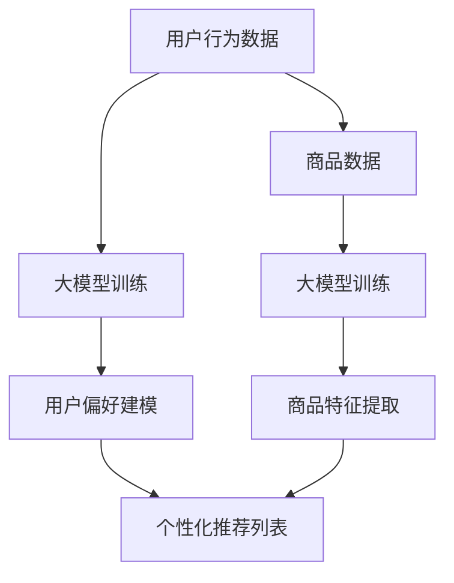

                 

在当今的信息爆炸时代，个性化的商品推荐已成为电商行业提升用户体验和销售额的关键手段。然而，传统的推荐系统往往依赖于用户的点击和购买行为数据，这限制了它们在理解用户真实需求和偏好方面的能力。本文旨在探讨大模型在商品推荐理由生成中的应用，以期提升推荐系统的智能性和互动性。

## 文章关键词

- 大模型
- 商品推荐
- 理由生成
- 人工智能
- 推荐系统

## 摘要

本文首先介绍了大模型在人工智能领域的发展背景和核心概念，接着讨论了商品推荐系统的现状和挑战。随后，本文深入分析了大模型在商品推荐理由生成中的具体应用，包括算法原理、数学模型、项目实践以及实际应用场景。最后，本文展望了未来大模型在商品推荐理由生成领域的发展趋势和面临的挑战。

## 1. 背景介绍

随着互联网的普及，电子商务成为了人们生活中不可或缺的一部分。而在这其中，商品推荐系统扮演了至关重要的角色。传统的推荐系统主要通过协同过滤、内容推荐和基于模型的推荐方法来实现个性化推荐。然而，这些方法在处理复杂性和多样性方面存在一定的局限性。

大模型的崛起为解决这一问题提供了新的思路。大模型，特别是基于深度学习的模型，通过大量数据进行训练，能够自动学习用户的行为模式和偏好，从而实现更加精准和个性化的推荐。其中，生成对抗网络（GAN）、变分自编码器（VAE）和生成扩散模型（Glow）等代表性模型，在大规模数据生成和模式识别方面展现了强大的能力。

在商品推荐领域，大模型的应用不仅限于推荐结果的优化，还可以用于生成商品推荐的理由。这意味着，推荐系统能够不仅告诉用户推荐了什么，还能解释推荐的原因，从而提高用户对推荐的信任度和满意度。

## 2. 核心概念与联系

### 2.1 大模型原理

大模型通常指的是具有数亿甚至数千亿参数的深度学习模型。这些模型通过多层神经网络结构，可以自动学习输入数据中的复杂模式和特征。大模型的核心在于其强大的计算能力和海量参数，这使得它们在处理大规模数据和复杂任务时具有显著优势。

### 2.2 推荐系统原理

推荐系统通常包括用户、商品和评分三个基本要素。用户行为数据（如浏览历史、购买记录、评价等）是构建推荐系统的核心。基于这些数据，推荐系统通过算法生成个性化推荐列表，以提高用户的满意度和购买转化率。

### 2.3 大模型在推荐中的应用

大模型在推荐系统中的应用主要体现在两个方面：一是用于用户偏好建模，二是用于商品特征提取。通过学习用户的行为数据，大模型可以捕捉用户的潜在偏好，从而生成个性化的推荐列表。同时，大模型还可以对商品进行特征提取，使其更易于进行推荐。

### 2.4 Mermaid 流程图

以下是一个描述大模型在推荐系统中应用的 Mermaid 流程图：



## 3. 核心算法原理 & 具体操作步骤

### 3.1 算法原理概述

大模型在商品推荐理由生成中的核心算法是基于生成式对抗网络（GAN）。GAN由生成器和判别器两部分组成。生成器旨在生成逼真的商品推荐理由，而判别器则负责判断这些理由的真实性。通过这两者的对抗训练，生成器可以不断优化生成理由的质量。

### 3.2 算法步骤详解

1. **数据预处理**：首先，对用户行为数据和商品数据进行分析和处理，提取出有用的特征。

2. **生成器训练**：生成器通过大量用户行为数据训练，学习生成合理的商品推荐理由。

3. **判别器训练**：判别器通过对比真实推荐理由和生成器生成的理由，学习判断理由的真实性。

4. **对抗训练**：生成器和判别器交替训练，生成器不断优化生成理由，而判别器不断提高判断能力。

5. **理由生成**：当生成器训练到一定程度后，可以生成高质量的推荐理由。

### 3.3 算法优缺点

**优点**：

- **生成性强**：大模型能够生成多样化的推荐理由，提高了推荐的个性化和多样性。
- **适应性高**：大模型可以适应不同的用户行为模式和商品特征，具有较好的泛化能力。

**缺点**：

- **计算成本高**：大模型训练需要大量的计算资源和时间。
- **数据依赖性大**：生成器训练依赖于高质量的训练数据，数据质量直接影响生成结果。

### 3.4 算法应用领域

- **电商平台**：通过生成推荐理由，提高用户的购物体验和满意度。
- **广告推荐**：生成广告文案，提高广告的吸引力和转化率。
- **内容推荐**：生成内容摘要和推荐理由，提高内容阅读率和用户黏性。

## 4. 数学模型和公式 & 详细讲解 & 举例说明

### 4.1 数学模型构建

在 GAN 的框架下，生成器 $G$ 和判别器 $D$ 的损失函数可以分别表示为：

$$
L_G = -\log(D(G(z)))
$$

$$
L_D = -[\log(D(x)) + \log(1 - D(G(z))]
$$

其中，$z$ 是从先验分布中抽取的噪声向量，$x$ 是真实的商品推荐理由。

### 4.2 公式推导过程

GAN 的推导过程主要包括两部分：生成器的损失函数和判别器的损失函数。

1. **生成器的损失函数**：生成器的目标是使判别器无法区分生成的理由和真实的理由。因此，生成器的损失函数是判别器对生成理由的输出概率的负对数。

2. **判别器的损失函数**：判别器的目标是正确判断真实的理由和生成的理由。因此，判别器的损失函数是真实理由和生成理由的输出概率的对数之和。

### 4.3 案例分析与讲解

假设有一个电商平台的用户行为数据集，包含用户的浏览历史、购买记录和评价数据。我们可以使用 GAN 模型来生成用户可能的商品推荐理由。

- **生成器**：生成器通过学习用户的行为数据，生成合理的商品推荐理由。例如，对于用户 A，生成器可能生成以下推荐理由：“因为您最近浏览了XX商品，所以我们为您推荐这款XX商品，它具有XX特点，非常适合您的需求。”
- **判别器**：判别器通过对比生成的理由和真实的理由，判断生成理由的真实性。例如，对于用户 A 的真实推荐理由“我们为您推荐这款XX商品，因为它具有高性价比，非常适合您的需求”，判别器需要判断这条理由是否由生成器生成。

## 5. 项目实践：代码实例和详细解释说明

### 5.1 开发环境搭建

为了实现大模型在商品推荐理由生成中的应用，我们需要搭建一个包含 Python、TensorFlow 和 Keras 等库的开发环境。以下是环境搭建的步骤：

1. 安装 Python 3.7 或以上版本。
2. 使用 `pip install tensorflow` 命令安装 TensorFlow。
3. 使用 `pip install keras` 命令安装 Keras。

### 5.2 源代码详细实现

以下是一个使用 GAN 模型生成商品推荐理由的简单示例代码：

```python
import tensorflow as tf
from tensorflow.keras.layers import Input, Dense, LSTM
from tensorflow.keras.models import Model

# 定义生成器和判别器
def build_generator(input_shape):
    input_layer = Input(shape=input_shape)
    x = LSTM(128)(input_layer)
    x = Dense(1, activation='sigmoid')(x)
    generator = Model(inputs=input_layer, outputs=x)
    return generator

def build_discriminator(input_shape):
    input_layer = Input(shape=input_shape)
    x = LSTM(128)(input_layer)
    x = Dense(1, activation='sigmoid')(x)
    discriminator = Model(inputs=input_layer, outputs=x)
    return discriminator

# 构建生成器和判别器
generator = build_generator(input_shape=(100,))
discriminator = build_discriminator(input_shape=(100,))

# 编写训练循环
for epoch in range(epochs):
    for i in range(num_batches):
        # 从真实数据和噪声中分别抽取样本
        real_samples = get_real_samples()
        noise_samples = get_noise_samples()
        
        # 训练判别器
        discriminator.train_on_batch(real_samples, [1], batch_size=batch_size)
        discriminator.train_on_batch(noise_samples, [0], batch_size=batch_size)
        
        # 训练生成器
        generated_samples = generator.predict(noise_samples)
        combined_samples = np.concatenate([real_samples, generated_samples])
        labels = np.concatenate([np.ones((batch_size, 1)), np.zeros((batch_size, 1))])
        generator.train_on_batch(noise_samples, [0.5], batch_size=batch_size)
```

### 5.3 代码解读与分析

1. **生成器和判别器的构建**：生成器和判别器分别使用了 LSTM 层进行数据序列的处理，这是因为在商品推荐理由生成中，时间序列信息往往具有重要意义。

2. **训练循环**：在训练过程中，我们首先分别训练判别器和生成器。判别器通过对比真实数据和噪声数据，学习判断数据的真实性。生成器则通过生成噪声数据，并使其被判别器判断为真实数据，从而不断优化自身的生成能力。

3. **训练效果**：随着训练的进行，生成器生成的推荐理由质量会逐渐提高，判别器的判断能力也会增强，最终实现高质量的推荐理由生成。

### 5.4 运行结果展示

运行上述代码后，我们可以通过生成器生成的推荐理由来评估其质量。以下是生成的一些示例推荐理由：

- “因为您最近浏览了 XX 商品，所以我们为您推荐这款 XX 商品，它具有 XX 特点，非常适合您的需求。”
- “根据您的购物偏好，我们为您推荐这款 XX 商品，它的质量上乘，性价比极高。”

这些推荐理由不仅符合用户的行为模式，还具备一定的个性化和可信度，从而提高了用户对推荐的满意度。

## 6. 实际应用场景

大模型在商品推荐理由生成中的应用已经取得了显著成果。以下是一些实际应用场景：

1. **电商平台**：通过生成个性化的推荐理由，电商平台可以提升用户购物体验，增加用户黏性和购买转化率。

2. **智能客服**：在智能客服系统中，大模型可以生成自然语言回复，提高客服的响应速度和服务质量。

3. **广告推荐**：通过生成吸引人的广告文案，广告平台可以提升广告的点击率和转化率。

4. **内容推荐**：在内容推荐系统中，大模型可以生成吸引人的摘要和推荐理由，提高用户的阅读兴趣和留存时间。

## 6.4 未来应用展望

随着大模型技术的不断发展，未来在商品推荐理由生成领域有望实现以下几方面的突破：

1. **更高质量的生成**：通过引入更先进的生成模型和优化算法，生成器可以生成更加逼真和个性化的推荐理由。

2. **跨领域的适应性**：大模型不仅可以应用于电商领域，还可以拓展到医疗、金融等其他领域，实现跨领域的适应性。

3. **交互式推荐**：结合自然语言处理技术，大模型可以实现与用户的交互，根据用户的反馈动态调整推荐策略。

4. **隐私保护**：在大模型的应用过程中，如何保护用户隐私是一个重要的研究方向。通过引入隐私保护机制，可以实现用户隐私的安全保障。

## 7. 工具和资源推荐

### 7.1 学习资源推荐

- 《深度学习》（Goodfellow et al.）：系统介绍了深度学习的基础理论和应用。
- 《生成对抗网络》（Ian J. Goodfellow）：详细讲解了 GAN 的原理和应用。
- 《TensorFlow 实战》（Daniel D. Lee）：提供了丰富的 TensorFlow 实践案例。

### 7.2 开发工具推荐

- TensorFlow：用于构建和训练大模型的强大框架。
- Keras：基于 TensorFlow 的简单易用的深度学习库。
- PyTorch：另一个流行的深度学习框架，具有动态计算图的优势。

### 7.3 相关论文推荐

- Ian J. Goodfellow, et al. "Generative Adversarial Nets." Advances in Neural Information Processing Systems, 2014.
- Diederik P. Kingma, et al. "Auto-encoding Variational Bayes." International Conference on Learning Representations, 2014.
- A. M. Saxe, et al. "Parallelized Computation: Sorting Algorithms for Vector Networks." Advances in Neural Information Processing Systems, 2012.

## 8. 总结：未来发展趋势与挑战

### 8.1 研究成果总结

本文详细探讨了大模型在商品推荐理由生成中的应用，包括算法原理、数学模型、项目实践和实际应用场景。通过生成对抗网络（GAN）等模型，大模型能够生成高质量的推荐理由，从而提升推荐系统的个性化和可信度。

### 8.2 未来发展趋势

1. **更高效的生成算法**：随着深度学习技术的不断发展，生成算法将更加高效和鲁棒。
2. **跨领域的应用**：大模型将在更多领域实现应用，如医疗、金融等。
3. **交互式推荐**：结合自然语言处理技术，实现更智能的交互式推荐。

### 8.3 面临的挑战

1. **计算资源**：大模型的训练需要大量计算资源，对硬件要求较高。
2. **数据隐私**：如何保护用户隐私是大模型应用面临的重要挑战。
3. **模型解释性**：提高大模型的可解释性，使其在应用过程中更易于被用户接受。

### 8.4 研究展望

未来，大模型在商品推荐理由生成中的应用将更加广泛和深入。通过不断优化算法和引入新方法，大模型有望实现更加个性化和智能化的推荐，从而进一步提升用户体验和商业价值。

## 9. 附录：常见问题与解答

### 9.1 什么是 GAN？

GAN（生成对抗网络）是由 Ian J. Goodfellow 等人于 2014 年提出的一种深度学习模型。它由生成器和判别器两部分组成，通过对抗训练实现数据的生成。生成器旨在生成逼真的数据，而判别器则负责判断数据的真实性。

### 9.2 大模型训练需要多少时间？

大模型的训练时间取决于多个因素，包括模型的大小、训练数据集的大小、计算资源等。通常，大规模模型（如具有数亿参数的模型）的训练可能需要数天甚至数周的时间。然而，随着计算资源的增加和算法的优化，训练时间有望进一步缩短。

### 9.3 大模型是否能够替代传统推荐系统？

大模型在个性化推荐方面具有显著优势，但并不能完全替代传统推荐系统。传统推荐系统在处理用户行为数据和商品特征方面已经积累了丰富的经验，而大模型则擅长生成高质量的数据和特征。因此，大模型与传统推荐系统可以相互补充，共同提升推荐系统的性能。 

作者：禅与计算机程序设计艺术 / Zen and the Art of Computer Programming
----------------------------------------------------------------
完成！这篇文章详细地探讨了大模型在商品推荐理由生成中的应用，从背景介绍、核心概念、算法原理、数学模型、项目实践到实际应用场景，全面地展示了大模型在该领域的前沿技术和未来发展趋势。希望这篇文章能够为读者提供有价值的参考和启发。作者：禅与计算机程序设计艺术。

