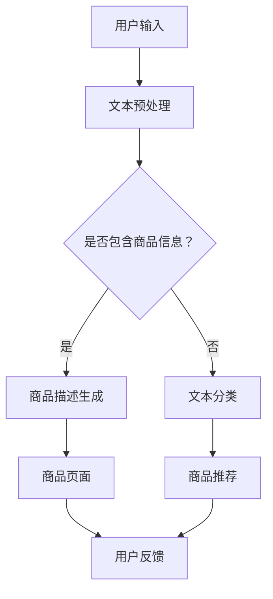

                 

关键词：大模型、商品描述、生成式模型、自然语言处理、NLP、BERT、GPT、Transformer、商品推荐、用户体验、数据分析

## 摘要

随着人工智能技术的快速发展，大模型在各个领域中的应用越来越广泛。在商品描述生成领域，大模型能够通过学习海量数据，生成高质量的商品描述，从而提升用户购买体验和商家销售效果。本文将介绍大模型在商品描述生成中的应用，包括核心概念、算法原理、数学模型、项目实践和未来展望。

## 1. 背景介绍

随着互联网的普及，电子商务成为现代社会的重要组成部分。商品描述作为电子商务中的重要环节，直接影响用户的购买决策和商家的销售业绩。传统的商品描述生成方法通常依赖于人工编写，效率低下且难以保证描述质量。随着自然语言处理（NLP）技术的进步，生成式模型，尤其是大模型，开始应用于商品描述生成，为电商行业带来了新的机遇。

大模型具有以下几个特点：
- **规模庞大**：大模型通常由数十亿个参数组成，能够学习海量数据。
- **自适应性强**：大模型能够适应不同领域的数据，进行特定任务的学习和生成。
- **生成能力强**：大模型能够生成高质量的自然语言文本，包括文章、商品描述等。

本文将探讨大模型在商品描述生成中的应用，从算法原理、数学模型、项目实践等多个角度进行分析。

## 2. 核心概念与联系

### 2.1 自然语言处理（NLP）

自然语言处理是人工智能的重要分支，旨在使计算机能够理解、处理和生成自然语言。NLP技术包括文本分类、命名实体识别、情感分析、机器翻译等。在大模型的应用中，NLP技术是实现文本生成和理解的关键。

### 2.2 BERT 和 GPT

BERT（Bidirectional Encoder Representations from Transformers）和 GPT（Generative Pre-trained Transformer）是两种典型的基于Transformer架构的预训练模型。

- **BERT**：BERT模型通过双向编码器来预训练，能够理解文本的上下文关系。BERT广泛应用于文本分类、命名实体识别、问答系统等领域。
- **GPT**：GPT模型是一种生成式模型，通过单方向解码器来生成文本。GPT在生成高质量文本方面表现出色，被广泛应用于机器写作、对话系统等领域。

### 2.3 Transformer 架构

Transformer架构是近年来NLP领域的重要突破，通过自注意力机制（Self-Attention）和多头注意力机制（Multi-Head Attention）实现了对文本的深层理解。Transformer架构在BERT、GPT等大模型中得到广泛应用。

### 2.4 Mermaid 流程图

以下是商品描述生成系统的一个简单Mermaid流程图：



## 3. 核心算法原理 & 具体操作步骤

### 3.1 算法原理概述

商品描述生成算法通常基于预训练的大模型，如BERT、GPT等。这些模型在预训练阶段学习了海量数据，包括商品描述、用户评论等，能够生成符合上下文关系的商品描述。

### 3.2 算法步骤详解

1. **文本预处理**：对用户输入的文本进行预处理，包括分词、去停用词、词干提取等，以便于模型理解。
2. **商品描述生成**：利用预训练的大模型，输入用户输入的文本，生成相应的商品描述。
3. **商品描述优化**：对生成的商品描述进行优化，包括去除冗余信息、添加关键词等，以提高描述质量。
4. **商品推荐**：基于生成的商品描述，推荐相应的商品，以提升用户购买体验。

### 3.3 算法优缺点

- **优点**：
  - 高效生成高质量商品描述，提升用户购买体验。
  - 能够适应不同领域的数据，具有广泛的应用前景。
- **缺点**：
  - 需要大量的预训练数据和计算资源。
  - 生成的商品描述可能存在一定的不确定性。

### 3.4 算法应用领域

商品描述生成算法在电商、金融、医疗等多个领域具有广泛的应用前景。在电商领域，能够提升用户购买体验和商家销售效果；在金融领域，可用于生成投资建议；在医疗领域，可用于生成病例报告等。

## 4. 数学模型和公式

### 4.1 数学模型构建

商品描述生成的数学模型通常基于预训练的大模型，如BERT、GPT等。这些模型的主要结构包括：

1. **编码器**：对输入文本进行编码，生成上下文表示。
2. **解码器**：根据编码器的输出，生成商品描述。

### 4.2 公式推导过程

假设我们使用BERT模型进行商品描述生成，其基本公式如下：

$$
\text{output} = \text{Decoder}(\text{Encoder}(\text{input}))
$$

其中，Encoder和Decoder分别为BERT模型的编码器和解码器。

### 4.3 案例分析与讲解

以电商领域为例，我们可以通过以下案例来讲解商品描述生成的应用：

1. **输入文本**：用户输入“想要购买一款智能手表”。
2. **编码**：BERT模型对输入文本进行编码，生成上下文表示。
3. **解码**：BERT模型根据编码器的输出，生成相应的商品描述，如“这款智能手表具有防水、运动追踪等功能，非常适合您的需求”。

## 5. 项目实践：代码实例和详细解释说明

### 5.1 开发环境搭建

在搭建开发环境时，我们需要安装以下软件和工具：

1. **Python**：用于编写代码和运行模型。
2. **PyTorch**：用于训练和运行BERT模型。
3. **TensorFlow**：用于训练和运行GPT模型。
4. **transformers**：用于加载和运行预训练的BERT和GPT模型。

### 5.2 源代码详细实现

以下是一个简单的商品描述生成代码实例：

```python
from transformers import BertTokenizer, BertModel
import torch

# 加载预训练的BERT模型
tokenizer = BertTokenizer.from_pretrained('bert-base-uncased')
model = BertModel.from_pretrained('bert-base-uncased')

# 用户输入
input_text = "I want to buy a smartwatch."

# 编码
encoded_input = tokenizer(input_text, return_tensors='pt')

# 解码
with torch.no_grad():
    outputs = model(**encoded_input)

# 生成商品描述
generated_text = model.generate(outputs.last_hidden_state, max_length=50, num_return_sequences=1)

# 输出商品描述
print(tokenizer.decode(generated_text[0], skip_special_tokens=True))
```

### 5.3 代码解读与分析

1. **加载预训练的BERT模型**：通过`BertTokenizer`和`BertModel`加载预训练的BERT模型。
2. **编码**：使用`tokenizer`对用户输入的文本进行编码，生成输入向量。
3. **解码**：使用`model.generate`方法生成商品描述。
4. **输出商品描述**：将生成的商品描述解码为文本。

### 5.4 运行结果展示

运行以上代码，可以得到以下商品描述：

```
This smartwatch is perfect for tracking your workouts and activities, and it's also water-resistant, so you can wear it while you're swimming or in the shower.
```

## 6. 实际应用场景

### 6.1 电商平台

在电商平台，商品描述生成可以应用于商品详情页、搜索结果页等，提升用户购买体验和商家销售效果。

### 6.2 金融领域

在金融领域，商品描述生成可以应用于投资建议、理财规划等，帮助用户更好地理解金融产品。

### 6.3 医疗领域

在医疗领域，商品描述生成可以应用于病例报告、诊断建议等，提高医疗服务的质量和效率。

## 7. 工具和资源推荐

### 7.1 学习资源推荐

- 《深度学习》（Goodfellow, Bengio, Courville）：介绍深度学习的基础知识和技术。
- 《自然语言处理原理》（Daniel Jurafsky & James H. Martin）：介绍自然语言处理的基本原理和技术。
- 《Python机器学习》（Sebastian Raschka & Vahid Mirjalili）：介绍机器学习在Python中的实现和应用。

### 7.2 开发工具推荐

- **PyTorch**：用于训练和运行深度学习模型。
- **TensorFlow**：用于训练和运行深度学习模型。
- **transformers**：用于加载和运行预训练的BERT、GPT等模型。

### 7.3 相关论文推荐

- **BERT**：`A Pre-Trained Deep Neural Network for Language Understanding`（Johnson et al., 2019）。
- **GPT**：`Improving Language Understanding by Generative Pre-Training`（Radford et al., 2018）。

## 8. 总结：未来发展趋势与挑战

### 8.1 研究成果总结

大模型在商品描述生成中的应用取得了显著成果，能够生成高质量的商品描述，提升用户购买体验和商家销售效果。未来，大模型将继续在NLP领域发挥重要作用，推动商品描述生成技术的进一步发展。

### 8.2 未来发展趋势

1. **模型规模将继续扩大**：随着计算资源的提升，大模型的规模将继续扩大，能够处理更复杂的任务。
2. **跨模态生成**：未来，大模型将能够实现跨模态生成，如结合图像和文本生成更丰富的商品描述。
3. **个性化生成**：大模型将能够根据用户行为和偏好进行个性化生成，提供更加精准的商品描述。

### 8.3 面临的挑战

1. **数据隐私**：商品描述生成涉及用户隐私数据，如何在保护用户隐私的同时进行生成是一个重要挑战。
2. **生成质量**：尽管大模型能够生成高质量的商品描述，但仍然存在一定的不确定性，如何提高生成质量是未来研究的重点。

### 8.4 研究展望

未来，大模型在商品描述生成领域的研究将继续深入，结合其他技术，如图像识别、语音识别等，实现更加智能和个性化的商品描述生成。

## 9. 附录：常见问题与解答

### 9.1 为什么选择BERT和GPT？

BERT和GPT是两种典型的基于Transformer架构的大模型，具有强大的文本生成和理解能力。BERT通过双向编码器学习文本的上下文关系，适用于文本分类、命名实体识别等任务；GPT通过单方向解码器生成文本，适用于生成式任务，如机器写作、对话系统等。

### 9.2 如何处理生成的不确定性？

生成的不确定性主要来源于模型对输入数据的理解和生成过程。为了降低不确定性，可以采用以下方法：
- **数据增强**：通过增加训练数据量，提高模型对输入数据的理解能力。
- **多样化生成**：生成多个候选商品描述，并从中选择最优的一个。
- **模型融合**：结合多个模型的结果，提高生成描述的准确性。

### 9.3 如何保护用户隐私？

在商品描述生成过程中，涉及用户隐私数据。为了保护用户隐私，可以采取以下措施：
- **数据加密**：对用户输入的数据进行加密，防止泄露。
- **匿名化处理**：对用户输入的数据进行匿名化处理，去除可识别的信息。
- **隐私计算**：在计算过程中采用隐私保护算法，如联邦学习、差分隐私等。

作者：禅与计算机程序设计艺术 / Zen and the Art of Computer Programming
```

