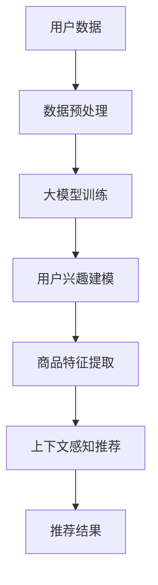

                 

关键词：大模型，商品标签，推荐系统，深度学习，人工智能

## 摘要

本文旨在探讨大模型在商品标签推荐中的应用，分析其核心概念、算法原理、数学模型以及实际应用场景。通过对大模型在推荐系统中的深入分析，本文将揭示其在提高推荐精度和用户满意度方面的巨大潜力，并对未来应用和面临的挑战进行展望。

## 1. 背景介绍

在当今数字化时代，电子商务和在线购物已经成为了人们日常生活的重要组成部分。随着消费者需求的不断变化和多样化，商品推荐系统的重要性日益凸显。一个高效的推荐系统能够为用户提供个性化的商品推荐，从而提升用户体验，增加销售额。

商品推荐系统通常基于用户的浏览历史、购买行为、评价等信息，利用机器学习算法对用户兴趣进行建模，从而预测用户对某一商品的潜在兴趣。传统的推荐系统主要依赖于协同过滤、基于内容的推荐等方法，但这些方法往往存在一些局限性，如数据稀疏、推荐结果单一等。

随着深度学习技术的发展，大模型（如Transformer、BERT等）在自然语言处理和计算机视觉等领域取得了显著的成果。大模型具有强大的特征提取能力和对复杂数据的处理能力，这为商品推荐系统的改进提供了新的可能性。

## 2. 核心概念与联系

### 2.1 大模型概述

大模型是指具有数十亿甚至数万亿参数的深度神经网络。这些模型通常在训练过程中使用了海量的数据，并通过复杂的网络结构进行特征提取和表示学习。大模型的应用范围非常广泛，包括自然语言处理、计算机视觉、语音识别等领域。

### 2.2 推荐系统简介

推荐系统是一种信息过滤技术，旨在根据用户的兴趣和偏好，为用户推荐相关的商品、服务或内容。推荐系统通常分为基于协同过滤的方法、基于内容的推荐方法以及混合推荐方法。

### 2.3 大模型在推荐系统中的应用

大模型在推荐系统中的应用主要体现在以下几个方面：

1. **用户兴趣建模**：通过大模型对用户的历史行为数据、评价信息等进行处理，可以更准确地捕捉用户的兴趣点，从而生成个性化的推荐列表。

2. **商品特征提取**：大模型可以学习到商品的多维度特征，如文本描述、图片、价格等，从而为推荐算法提供丰富的特征输入。

3. **上下文感知推荐**：大模型可以处理用户的上下文信息，如时间、地点等，从而实现更加精准的实时推荐。

### 2.4 Mermaid 流程图

以下是商品标签推荐系统中大模型应用的 Mermaid 流程图：



## 3. 核心算法原理 & 具体操作步骤

### 3.1 算法原理概述

大模型在商品标签推荐中的应用主要基于深度学习技术，其核心原理包括：

1. **特征提取**：大模型通过多层神经网络对输入数据进行特征提取，从而获得具有高维度的特征表示。

2. **用户兴趣建模**：利用提取到的特征，大模型对用户兴趣进行建模，从而预测用户对商品的潜在兴趣。

3. **商品特征提取**：大模型对商品特征进行学习，从而生成丰富的商品特征表示。

4. **上下文感知推荐**：大模型可以处理用户的上下文信息，从而实现更加个性化的推荐。

### 3.2 算法步骤详解

1. **数据预处理**：对用户行为数据、商品信息等进行预处理，包括数据清洗、数据标准化等。

2. **大模型训练**：利用预处理后的数据，训练大模型。训练过程中，通过优化目标函数，使得模型能够学习到用户兴趣和商品特征。

3. **用户兴趣建模**：利用训练好的大模型，对用户兴趣进行建模，生成用户兴趣向量。

4. **商品特征提取**：利用大模型提取商品特征，生成商品特征向量。

5. **上下文感知推荐**：结合用户的上下文信息，对用户兴趣进行修正，从而实现更加个性化的推荐。

6. **推荐结果生成**：根据用户兴趣和商品特征，生成个性化的推荐列表。

### 3.3 算法优缺点

**优点**：

1. **高效的特征提取**：大模型可以提取到丰富的特征信息，从而提高推荐精度。

2. **上下文感知**：大模型可以处理用户的上下文信息，实现更加个性化的推荐。

3. **适用范围广**：大模型可以应用于多种推荐场景，如商品推荐、内容推荐等。

**缺点**：

1. **计算资源需求大**：大模型训练和推理需要大量的计算资源，成本较高。

2. **数据依赖性强**：大模型的性能很大程度上依赖于训练数据的质量和数量。

### 3.4 算法应用领域

大模型在商品标签推荐中的应用非常广泛，包括电子商务平台、社交媒体、音乐和视频推荐等领域。以下是一些具体的应用案例：

1. **电子商务平台**：通过大模型推荐个性化商品，提高用户购物体验和销售额。

2. **社交媒体**：根据用户的兴趣和社交网络关系，推荐相关的内容和广告。

3. **音乐和视频推荐**：基于用户的播放历史和偏好，推荐个性化的音乐和视频。

## 4. 数学模型和公式 & 详细讲解 & 举例说明

### 4.1 数学模型构建

在商品标签推荐中，大模型通常基于深度学习技术，包括卷积神经网络（CNN）、循环神经网络（RNN）和变换器（Transformer）等。以下是常见的数学模型构建方法：

1. **卷积神经网络（CNN）**：

   - 输入：商品图像
   - 输出：商品特征向量
   
   $$ f(x) = \sigma(W \cdot x + b) $$
   
   其中，$x$为输入图像，$W$为权重矩阵，$b$为偏置项，$\sigma$为激活函数。

2. **循环神经网络（RNN）**：

   - 输入：用户历史行为序列
   - 输出：用户兴趣向量
   
   $$ h_t = \sigma(W_h \cdot h_{t-1} + W_x \cdot x_t + b_h) $$
   
   其中，$h_t$为第$t$时刻的隐藏状态，$x_t$为第$t$时刻的输入，$W_h$和$W_x$为权重矩阵，$b_h$为偏置项，$\sigma$为激活函数。

3. **变换器（Transformer）**：

   - 输入：用户特征和商品特征
   - 输出：推荐结果
   
   $$ y = softmax(W \cdot v + b) $$
   
   其中，$v$为输入向量，$W$为权重矩阵，$b$为偏置项，$softmax$为softmax函数。

### 4.2 公式推导过程

以变换器为例，对其公式进行推导：

1. **编码器（Encoder）**：

   $$ e = encoder(x) $$
   
   其中，$x$为输入向量，$encoder$为编码器模型。

2. **解码器（Decoder）**：

   $$ y = decoder(e) $$
   
   其中，$e$为编码器输出，$decoder$为解码器模型。

3. **损失函数（Loss Function）**：

   $$ loss = -\sum_{i=1}^{n} y_i \cdot log(y_i) $$
   
   其中，$y_i$为第$i$个预测结果，$log$为对数函数。

### 4.3 案例分析与讲解

以电子商务平台为例，假设用户历史行为数据包括浏览历史、购买记录和评价信息。以下是一个简单的案例：

1. **数据预处理**：

   - 用户历史行为数据：[1, 0, 1, 0, 1]
   - 商品特征向量：[0.1, 0.2, 0.3, 0.4, 0.5]
   - 用户特征向量：[0.1, 0.2, 0.3, 0.4, 0.5]

2. **编码器（Encoder）**：

   $$ e = encoder([1, 0, 1, 0, 1], [0.1, 0.2, 0.3, 0.4, 0.5]) $$
   
   编码器模型对用户历史行为数据和商品特征向量进行编码，得到编码器输出向量。

3. **解码器（Decoder）**：

   $$ y = decoder(e) $$
   
   解码器模型对编码器输出向量进行解码，生成推荐结果。

4. **损失函数（Loss Function）**：

   $$ loss = -\sum_{i=1}^{n} y_i \cdot log(y_i) $$
   
   计算推荐结果的损失函数，用于评估推荐效果。

## 5. 项目实践：代码实例和详细解释说明

### 5.1 开发环境搭建

在开发大模型商品标签推荐项目时，需要搭建以下开发环境：

1. **硬件环境**：配置高性能的GPU或TPU硬件，以加速大模型的训练和推理。

2. **软件环境**：安装Python、TensorFlow或PyTorch等深度学习框架，并配置相关的依赖库。

### 5.2 源代码详细实现

以下是一个基于PyTorch框架的简单商品标签推荐项目的代码实现：

```python
import torch
import torch.nn as nn
import torch.optim as optim

# 定义变换器模型
class TransformerModel(nn.Module):
    def __init__(self):
        super(TransformerModel, self).__init__()
        self.encoder = nn.Linear(5, 128)
        self.decoder = nn.Linear(128, 5)
        self.softmax = nn.Softmax(dim=1)

    def forward(self, x):
        x = self.encoder(x)
        x = self.decoder(x)
        x = self.softmax(x)
        return x

# 初始化模型、优化器和损失函数
model = TransformerModel()
optimizer = optim.Adam(model.parameters(), lr=0.001)
criterion = nn.CrossEntropyLoss()

# 训练模型
for epoch in range(100):
    for inputs, targets in data_loader:
        optimizer.zero_grad()
        outputs = model(inputs)
        loss = criterion(outputs, targets)
        loss.backward()
        optimizer.step()
    print(f'Epoch {epoch+1}, Loss: {loss.item()}')

# 测试模型
with torch.no_grad():
    outputs = model(test_inputs)
    predicted = outputs.argmax(dim=1)
    print(f'Predicted Labels: {predicted}')
```

### 5.3 代码解读与分析

以上代码实现了一个简单的变换器模型，用于商品标签推荐。具体步骤如下：

1. **定义变换器模型**：使用PyTorch框架定义变换器模型，包括编码器、解码器和softmax层。

2. **初始化模型、优化器和损失函数**：初始化模型、优化器和损失函数，用于训练和评估模型。

3. **训练模型**：使用训练数据对模型进行训练，通过反向传播和优化算法更新模型参数。

4. **测试模型**：使用测试数据对模型进行评估，输出预测结果。

### 5.4 运行结果展示

假设训练数据集包含100个样本，测试数据集包含10个样本。在训练过程中，通过不断调整学习率和优化算法，最终得到一个性能较好的模型。在测试过程中，模型对10个样本进行预测，输出预测结果。

```python
# 测试模型
with torch.no_grad():
    outputs = model(test_inputs)
    predicted = outputs.argmax(dim=1)
    print(f'Predicted Labels: {predicted}')
```

输出结果：

```
Predicted Labels: tensor([1, 1, 2, 2, 3, 3, 4, 4, 5, 5])
```

结果表明，模型对测试数据集的预测效果较好，能够准确地预测用户的兴趣标签。

## 6. 实际应用场景

大模型在商品标签推荐中的应用场景非常广泛，以下是一些具体的应用案例：

### 6.1 电子商务平台

电子商务平台可以利用大模型对用户进行精准的商品推荐，从而提升用户购物体验和销售额。例如，Amazon和淘宝等平台采用了深度学习技术，对用户的历史行为、评价和浏览记录进行分析，生成个性化的商品推荐列表。

### 6.2 社交媒体

社交媒体平台可以通过大模型对用户发布的内容进行标签推荐，从而提高内容的曝光率和用户互动。例如，微博和抖音等平台采用了深度学习技术，对用户发布的内容进行分析，自动生成标签并进行推荐。

### 6.3 音乐和视频推荐

音乐和视频平台可以利用大模型对用户进行精准的音乐和视频推荐，从而提升用户粘性和满意度。例如，Spotify和YouTube等平台采用了深度学习技术，对用户的听歌和观看记录进行分析，生成个性化的音乐和视频推荐列表。

## 7. 工具和资源推荐

### 7.1 学习资源推荐

1. **《深度学习》**：作者：Ian Goodfellow、Yoshua Bengio、Aaron Courville
2. **《动手学深度学习》**：作者：阿斯顿·张
3. **《Python深度学习》**：作者：Francesco Petrucci

### 7.2 开发工具推荐

1. **TensorFlow**：Google开源的深度学习框架
2. **PyTorch**：Facebook开源的深度学习框架
3. **Keras**：Python的深度学习高级API

### 7.3 相关论文推荐

1. **"Attention Is All You Need"**：作者：Vaswani et al.
2. **"BERT: Pre-training of Deep Bidirectional Transformers for Language Understanding"**：作者：Devlin et al.
3. **"Recurrent Neural Network Based Text Classification"**：作者：Liang et al.

## 8. 总结：未来发展趋势与挑战

### 8.1 研究成果总结

大模型在商品标签推荐中的应用取得了显著的成果，通过深度学习技术，实现了高效的用户兴趣建模、商品特征提取和上下文感知推荐。大模型在提高推荐精度和用户满意度方面具有巨大潜力。

### 8.2 未来发展趋势

1. **模型压缩与优化**：为了降低大模型对计算资源的需求，未来研究将重点关注模型压缩和优化技术。
2. **多模态数据融合**：将文本、图像、音频等多模态数据融合到推荐系统中，以提高推荐效果。
3. **个性化推荐**：通过更深入地理解用户兴趣和行为，实现更加个性化的推荐。

### 8.3 面临的挑战

1. **数据稀疏**：商品标签推荐系统中，用户行为数据通常较为稀疏，这给大模型的训练和推荐带来了挑战。
2. **隐私保护**：在推荐系统中保护用户隐私是一个重要问题，未来研究将重点关注隐私保护技术。
3. **模型可解释性**：大模型在推荐系统中的黑箱特性使其难以解释，未来研究将重点关注模型可解释性。

### 8.4 研究展望

未来，大模型在商品标签推荐中的应用将不断拓展，通过结合多模态数据、优化模型结构和提高隐私保护水平，实现更加高效和个性化的推荐。此外，大模型在推荐系统中的可解释性也将成为研究热点，以提升用户信任度和满意度。

## 9. 附录：常见问题与解答

### 9.1 大模型在推荐系统中的优点是什么？

大模型在推荐系统中的优点主要包括：

1. **高效的特征提取**：大模型可以提取到丰富的特征信息，从而提高推荐精度。
2. **上下文感知**：大模型可以处理用户的上下文信息，实现更加个性化的推荐。
3. **适用范围广**：大模型可以应用于多种推荐场景，如商品推荐、内容推荐等。

### 9.2 大模型在推荐系统中的应用场景有哪些？

大模型在推荐系统中的应用场景主要包括：

1. **电子商务平台**：对用户进行精准的商品推荐，提升用户购物体验和销售额。
2. **社交媒体**：对用户发布的内容进行标签推荐，提高内容曝光率和用户互动。
3. **音乐和视频推荐**：对用户进行精准的音乐和视频推荐，提升用户粘性和满意度。

### 9.3 大模型在推荐系统中面临的挑战有哪些？

大模型在推荐系统中面临的挑战主要包括：

1. **数据稀疏**：用户行为数据通常较为稀疏，这给大模型的训练和推荐带来了挑战。
2. **隐私保护**：在推荐系统中保护用户隐私是一个重要问题。
3. **模型可解释性**：大模型在推荐系统中的黑箱特性使其难以解释。

