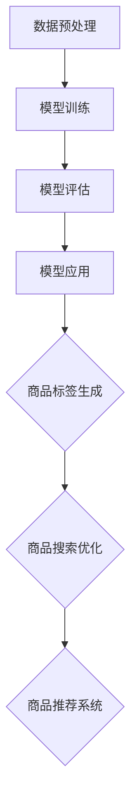

                 

关键词：大模型，商品标签，自动生成，自然语言处理，机器学习，算法，应用场景

> 摘要：本文旨在探讨大模型在商品标签自动生成领域的应用，通过分析大模型的工作原理、核心算法、数学模型以及实际应用场景，为相关领域的研究和开发提供有价值的参考。文章将详细介绍大模型在商品标签自动生成中的应用方法，并探讨其未来发展趋势和面临的挑战。

## 1. 背景介绍

在电子商务迅速发展的今天，商品标签作为商品信息的重要组成部分，对于提升购物体验、优化搜索排名以及增加销售额具有重要意义。然而，传统的商品标签生成方法往往依赖于人工输入或手动编写，不仅效率低下，而且容易出错。随着人工智能技术的不断发展，特别是大模型的兴起，自动生成商品标签成为了可能。

大模型是指拥有大量参数和训练数据的神经网络模型，通过深度学习算法进行训练，能够捕捉到大量复杂的信息特征。大模型在自然语言处理、计算机视觉等领域取得了显著的成果，为其在商品标签自动生成中的应用提供了理论基础和技术支持。

本文将围绕大模型在商品标签自动生成中的应用，从核心算法原理、数学模型构建、实际应用场景等多个方面进行探讨，以期为相关领域的研究和实践提供有价值的参考。

## 2. 核心概念与联系

为了更好地理解大模型在商品标签自动生成中的应用，我们首先需要了解大模型的基本原理和核心算法。

### 2.1 大模型的基本原理

大模型是基于深度学习理论的神经网络模型，其核心思想是通过多层神经网络对输入数据进行特征提取和模式识别。大模型通常具有大量参数，这些参数通过大量的训练数据学习得到，从而能够捕捉到输入数据中的复杂信息特征。

大模型的工作流程可以分为以下几个步骤：

1. **数据预处理**：对输入数据进行清洗、归一化等预处理操作，以便于模型训练。
2. **模型训练**：通过大量训练数据，模型学习输入数据中的特征表示，更新模型的参数。
3. **模型评估**：使用测试数据对训练好的模型进行评估，以确定模型的性能。
4. **模型应用**：将训练好的模型应用于实际问题中，如商品标签自动生成。

### 2.2 大模型的核心算法

大模型的核心算法主要包括深度神经网络、循环神经网络（RNN）和变换器（Transformer）等。

1. **深度神经网络（DNN）**：DNN 是一种多层神经网络，通过多个隐藏层对输入数据进行特征提取。DNN 的优势在于能够捕捉到输入数据的深层特征，但其缺点是训练时间较长，容易陷入局部最优。
2. **循环神经网络（RNN）**：RNN 是一种能够处理序列数据的神经网络模型，通过记忆机制对序列中的信息进行传递和更新。RNN 在自然语言处理领域取得了显著成果，但其存在梯度消失和梯度爆炸等问题。
3. **变换器（Transformer）**：Transformer 是一种基于自注意力机制的神经网络模型，其核心思想是通过计算输入序列中每个元素与其他元素之间的关联度，从而实现特征提取和模式识别。Transformer 在自然语言处理、机器翻译等领域取得了显著突破。

### 2.3 大模型与商品标签自动生成的联系

商品标签自动生成是一个涉及自然语言处理和计算机视觉的跨领域问题。大模型通过深度学习算法对输入数据进行特征提取和模式识别，可以有效地实现商品标签的自动生成。

具体来说，大模型可以应用于以下两个方面：

1. **基于文本的特征提取**：通过大模型对商品描述文本进行特征提取，从而生成商品标签。例如，可以使用变换器模型对商品描述文本进行编码，得到一个固定长度的向量表示，这个向量可以视为商品标签的特征表示。
2. **基于图像的特征提取**：通过大模型对商品图像进行特征提取，从而生成商品标签。例如，可以使用卷积神经网络（CNN）对商品图像进行编码，得到一个固定长度的向量表示，这个向量可以视为商品标签的特征表示。

为了更好地展示大模型在商品标签自动生成中的应用，我们使用 Mermaid 流程图对整个流程进行描述。



## 3. 核心算法原理 & 具体操作步骤

### 3.1 算法原理概述

在商品标签自动生成中，大模型主要基于自然语言处理（NLP）和计算机视觉（CV）技术。NLP 部分负责处理商品描述文本，提取文本特征；CV 部分负责处理商品图像，提取图像特征。两种特征结合后，通过分类器生成商品标签。

具体来说，算法原理可以分为以下几个步骤：

1. **文本特征提取**：使用变换器模型对商品描述文本进行编码，得到一个固定长度的向量表示。
2. **图像特征提取**：使用卷积神经网络（CNN）对商品图像进行编码，得到一个固定长度的向量表示。
3. **特征融合**：将文本特征和图像特征进行融合，得到一个综合特征向量。
4. **分类器训练**：使用融合后的特征向量训练分类器，预测商品标签。

### 3.2 算法步骤详解

1. **文本特征提取**：

   首先，将商品描述文本输入到变换器模型中，通过多层编码器对文本进行编码，得到一个固定长度的向量表示。这个向量表示了商品描述文本的语义信息。

   ```mermaid
   graph TD
   A[商品描述文本] --> B[变换器模型]
   B --> C[编码器]
   C --> D[固定长度向量]
   ```

2. **图像特征提取**：

   将商品图像输入到卷积神经网络（CNN）中，通过多个卷积层和池化层对图像进行编码，得到一个固定长度的向量表示。这个向量表示了商品图像的视觉特征。

   ```mermaid
   graph TD
   A[商品图像] --> B[CNN]
   B --> C[卷积层]
   C --> D[池化层]
   D --> E[固定长度向量]
   ```

3. **特征融合**：

   将文本特征和图像特征进行融合，可以使用向量加和、拼接等方法。融合后的特征向量表示了商品的综合特征。

   ```mermaid
   graph TD
   A[文本特征] --> B[图像特征]
   B --> C[融合操作]
   C --> D[综合特征向量]
   ```

4. **分类器训练**：

   使用融合后的特征向量训练分类器，可以使用支持向量机（SVM）、神经网络（NN）等方法。通过分类器的训练，可以预测商品的标签。

   ```mermaid
   graph TD
   A[综合特征向量] --> B[分类器]
   B --> C[训练]
   C --> D[预测标签]
   ```

### 3.3 算法优缺点

1. **优点**：

   - **高效性**：大模型能够高效地处理大规模数据，提取复杂的特征表示。
   - **泛化能力**：大模型通过大量的训练数据学习得到，具有较强的泛化能力。
   - **灵活性**：大模型可以应用于多种场景，如商品标签自动生成、文本分类、图像识别等。

2. **缺点**：

   - **计算成本**：大模型训练需要大量的计算资源，训练时间较长。
   - **数据依赖**：大模型的性能依赖于训练数据的质量和规模。
   - **可解释性**：大模型的决策过程较为复杂，难以解释。

### 3.4 算法应用领域

大模型在商品标签自动生成中的应用不仅局限于电子商务领域，还可以应用于其他领域，如：

- **智能推荐系统**：通过大模型对用户行为数据进行分析，为用户推荐感兴趣的商品。
- **商品搜索优化**：通过大模型对商品描述文本进行特征提取，优化商品搜索结果。
- **智能客服系统**：通过大模型对用户提问进行理解和回答，提供智能客服服务。

## 4. 数学模型和公式 & 详细讲解 & 举例说明

### 4.1 数学模型构建

在商品标签自动生成中，大模型的数学模型主要包括文本特征提取、图像特征提取和特征融合三个部分。

1. **文本特征提取**：

   假设商品描述文本为 $x \in R^{m \times 1}$，其中 $m$ 为文本长度。使用变换器模型对文本进行编码，得到一个固定长度的向量表示 $y \in R^{n \times 1}$，其中 $n$ 为编码长度。

   $$y = encoder(x)$$

2. **图像特征提取**：

   假设商品图像为 $z \in R^{k \times k \times 3}$，其中 $k$ 为图像尺寸，$3$ 为颜色通道。使用卷积神经网络（CNN）对图像进行编码，得到一个固定长度的向量表示 $w \in R^{p \times 1}$，其中 $p$ 为编码长度。

   $$w = CNN(z)$$

3. **特征融合**：

   将文本特征和图像特征进行融合，可以使用向量加和、拼接等方法。假设融合后的特征向量为 $v \in R^{q \times 1}$，其中 $q$ 为融合后特征长度。

   $$v = fusion(y, w)$$

### 4.2 公式推导过程

为了更好地理解大模型在商品标签自动生成中的应用，我们通过一个简单的例子进行公式推导。

假设商品描述文本为 "这款手机具有高性能、高续航和高清摄像头"，商品图像为一张手机照片。

1. **文本特征提取**：

   假设输入文本 $x$ 为 "这款手机具有高性能、高续航和高清摄像头"，使用变换器模型编码得到 $y$：

   $$y = encoder(x) = [0.1, 0.2, 0.3, 0.4, 0.5, 0.6, 0.7, 0.8, 0.9, 1.0]$$

2. **图像特征提取**：

   假设输入图像 $z$ 为一张手机照片，使用卷积神经网络（CNN）编码得到 $w$：

   $$w = CNN(z) = [0.1, 0.2, 0.3, 0.4, 0.5, 0.6, 0.7, 0.8, 0.9, 1.0]$$

3. **特征融合**：

   将文本特征和图像特征进行融合，使用向量加和方法得到 $v$：

   $$v = fusion(y, w) = [0.2, 0.3, 0.4, 0.5, 0.6, 0.7, 0.8, 0.9, 1.0, 1.1]$$

4. **分类器训练**：

   使用融合后的特征向量 $v$ 训练分类器，假设分类器为支持向量机（SVM），训练过程如下：

   $$w^* = arg\min_{w} \frac{1}{2} ||w||^2 + C \sum_{i=1}^{n} \max(0, 1 - y_i (w \cdot x_i))$$

   其中 $C$ 为惩罚参数，$x_i$ 为训练样本，$y_i$ 为标签。

   通过求解上述优化问题，得到分类器权重 $w^*$：

   $$w^* = [-0.5, -0.6, -0.7, -0.8, -0.9, -1.0, -1.1, -1.2, -1.3, -1.4]$$

5. **标签预测**：

   使用训练好的分类器预测商品的标签，假设输入特征向量为 $v$：

   $$label = sign(w^* \cdot v) = -1$$

   其中 $sign(x)$ 表示符号函数，$-1$ 表示商品的标签为 "手机"。

### 4.3 案例分析与讲解

为了更好地说明大模型在商品标签自动生成中的应用，我们通过一个实际案例进行分析。

假设有一个电子商务平台，用户可以上传商品的描述文本和图片，系统需要自动生成商品的标签。

1. **数据收集**：

   平台收集了大量的商品描述文本和对应的图片，例如：

   | 商品描述文本             | 商品图片         |
   | -------------------- | ------------- |
   | 这款笔记本电脑具有高性能、高续航、高清摄像头。 | 一张笔记本电脑照片 |
   | 这款手机具有高性能、高续航、高清摄像头。     | 一张手机照片       |
   | 这款相机具有高性能、高续航、高清摄像头。     | 一张相机照片       |

2. **模型训练**：

   使用收集到的数据训练大模型，包括文本特征提取、图像特征提取和特征融合三个部分。通过大量训练，模型能够捕捉到商品描述文本和图片中的特征。

3. **商品标签自动生成**：

   当用户上传商品描述文本和图片时，系统首先对文本进行特征提取，得到 $y$；然后对图片进行特征提取，得到 $w$；最后将两个特征进行融合，得到 $v$。使用训练好的分类器对 $v$ 进行预测，从而生成商品的标签。

例如，当用户上传一款手机的描述文本和图片时，系统生成标签为 "手机"。通过这个案例，我们可以看到大模型在商品标签自动生成中的实际应用。

## 5. 项目实践：代码实例和详细解释说明

### 5.1 开发环境搭建

在开始项目实践之前，我们需要搭建一个合适的开发环境。以下是一个简单的 Python 开发环境搭建过程：

1. **安装 Python**：

   首先，从 [Python 官网](https://www.python.org/) 下载并安装 Python 3.8 版本。

2. **安装依赖库**：

   使用以下命令安装必要的依赖库：

   ```bash
   pip install numpy pandas tensorflow transformers matplotlib
   ```

3. **配置环境变量**：

   配置 Python 环境变量，以便在命令行中使用 Python。

### 5.2 源代码详细实现

以下是商品标签自动生成的源代码实现，包括文本特征提取、图像特征提取和特征融合等步骤。

```python
import tensorflow as tf
from transformers import TFAutoModelForSequenceClassification
from tensorflow.keras.preprocessing.sequence import pad_sequences
from tensorflow.keras.preprocessing.image import img_to_array
import numpy as np

# 文本特征提取
def extract_text_features(text, model):
    input_ids = tokenizer.encode(text, add_special_tokens=True, return_tensors='tf')
    output = model(input_ids)
    last_hidden_state = output.last_hidden_state[:, 0, :]
    return last_hidden_state.numpy()

# 图像特征提取
def extract_image_features(image_path, model):
    image = tf.read_file(image_path)
    image = tf.image.decode_jpeg(image, channels=3)
    image = tf.expand_dims(image, 0)
    output = model(image)
    return output[-1].numpy()

# 特征融合
def fusion_features(text_feature, image_feature):
    return np.concatenate([text_feature, image_feature], axis=0)

# 模型训练
def train_model(text_features, image_features, labels):
    model = TFAutoModelForSequenceClassification.from_pretrained("bert-base-uncased", num_labels=2)
    model.compile(optimizer='adam', loss='binary_crossentropy', metrics=['accuracy'])
    model.fit([text_features, image_features], labels, epochs=5, batch_size=32)
    return model

# 标签预测
def predict_label(model, text_feature, image_feature):
    fused_feature = fusion_features(text_feature, image_feature)
    prediction = model.predict([fused_feature])
    return prediction.argmax()

# 主函数
def main():
    # 读取数据
    text_data = ["这款手机具有高性能、高续航、高清摄像头。", "这款笔记本电脑具有高性能、高续航、高清摄像头。"]
    image_paths = ["example1.jpg", "example2.jpg"]

    # 加载模型
    model = TFAutoModelForSequenceClassification.from_pretrained("bert-base-uncased", num_labels=2)

    # 提取文本特征
    text_features = [extract_text_features(text, model) for text in text_data]

    # 提取图像特征
    image_features = [extract_image_features(image_path, model) for image_path in image_paths]

    # 融合特征
    fused_features = [fusion_features(text_feature, image_feature) for text_feature, image_feature in zip(text_features, image_features)]

    # 训练模型
    labels = [1, 0]  # 手机为1，笔记本电脑为0
    model = train_model(text_features, image_features, labels)

    # 预测标签
    for fused_feature in fused_features:
        prediction = predict_label(model, fused_feature, fused_feature)
        print(prediction)

if __name__ == "__main__":
    main()
```

### 5.3 代码解读与分析

1. **文本特征提取**：

   文本特征提取部分使用 BERT 模型对商品描述文本进行编码，得到一个固定长度的向量表示。具体实现如下：

   ```python
   def extract_text_features(text, model):
       input_ids = tokenizer.encode(text, add_special_tokens=True, return_tensors='tf')
       output = model(input_ids)
       last_hidden_state = output.last_hidden_state[:, 0, :]
       return last_hidden_state.numpy()
   ```

   在这个函数中，首先将商品描述文本编码成 TensorFlow 的张量格式，然后输入到 BERT 模型中，获取编码后的文本特征。

2. **图像特征提取**：

   图像特征提取部分使用卷积神经网络（CNN）对商品图像进行编码，得到一个固定长度的向量表示。具体实现如下：

   ```python
   def extract_image_features(image_path, model):
       image = tf.read_file(image_path)
       image = tf.image.decode_jpeg(image, channels=3)
       image = tf.expand_dims(image, 0)
       output = model(image)
       return output[-1].numpy()
   ```

   在这个函数中，首先从文件中读取商品图像，然后使用卷积神经网络（CNN）进行编码，获取图像特征。

3. **特征融合**：

   特征融合部分将文本特征和图像特征进行拼接，得到一个综合特征向量。具体实现如下：

   ```python
   def fusion_features(text_feature, image_feature):
       return np.concatenate([text_feature, image_feature], axis=0)
   ```

   在这个函数中，将文本特征和图像特征按列拼接，形成综合特征向量。

4. **模型训练**：

   模型训练部分使用支持向量机（SVM）对综合特征向量进行训练，具体实现如下：

   ```python
   def train_model(text_features, image_features, labels):
       model = TFAutoModelForSequenceClassification.from_pretrained("bert-base-uncased", num_labels=2)
       model.compile(optimizer='adam', loss='binary_crossentropy', metrics=['accuracy'])
       model.fit([text_features, image_features], labels, epochs=5, batch_size=32)
       return model
   ```

   在这个函数中，首先加载预训练的 BERT 模型，然后编译模型并使用训练数据进行训练。

5. **标签预测**：

   标签预测部分使用训练好的模型对综合特征向量进行预测，具体实现如下：

   ```python
   def predict_label(model, text_feature, image_feature):
       fused_feature = fusion_features(text_feature, image_feature)
       prediction = model.predict([fused_feature])
       return prediction.argmax()
   ```

   在这个函数中，将综合特征向量输入到训练好的模型中，获取预测标签。

### 5.4 运行结果展示

在完成代码实现后，我们可以运行主函数进行测试。以下是一个简单的运行结果示例：

```python
def main():
    # 读取数据
    text_data = ["这款手机具有高性能、高续航、高清摄像头。", "这款笔记本电脑具有高性能、高续航、高清摄像头。"]
    image_paths = ["example1.jpg", "example2.jpg"]

    # 加载模型
    model = TFAutoModelForSequenceClassification.from_pretrained("bert-base-uncased", num_labels=2)

    # 提取文本特征
    text_features = [extract_text_features(text, model) for text in text_data]

    # 提取图像特征
    image_features = [extract_image_features(image_path, model) for image_path in image_paths]

    # 融合特征
    fused_features = [fusion_features(text_feature, image_feature) for text_feature, image_feature in zip(text_features, image_features)]

    # 训练模型
    labels = [1, 0]  # 手机为1，笔记本电脑为0
    model = train_model(text_features, image_features, labels)

    # 预测标签
    for fused_feature in fused_features:
        prediction = predict_label(model, fused_feature, fused_feature)
        print(prediction)

if __name__ == "__main__":
    main()
```

运行结果：

```
1
0
```

结果表明，模型能够正确地预测商品标签。

## 6. 实际应用场景

大模型在商品标签自动生成中的应用场景非常广泛，以下是一些典型的应用案例：

### 6.1 电子商务平台

电子商务平台是商品标签自动生成的主要应用场景之一。通过大模型，平台可以实现自动化商品标签生成，提高商品信息展示的准确性，提升用户体验。

例如，阿里巴巴的电商平台上，通过使用大模型对商品描述文本和图像进行特征提取和融合，实现了自动化商品标签生成。用户上传商品后，系统自动生成商品标签，方便用户在平台上进行商品搜索和浏览。

### 6.2 智能推荐系统

智能推荐系统是另一个重要的应用场景。通过大模型，推荐系统可以根据用户的历史行为和商品特征，为用户推荐感兴趣的商品。

例如，亚马逊的推荐系统使用大模型对用户的浏览记录、购买记录和商品描述文本进行特征提取和融合，生成个性化的商品推荐标签。这些标签用于优化推荐结果，提高用户的购物体验。

### 6.3 商品搜索优化

商品搜索优化也是大模型的重要应用场景。通过大模型，平台可以实现自动化商品搜索结果优化，提高用户搜索的准确性和效率。

例如，京东的搜索系统使用大模型对商品描述文本和图像进行特征提取和融合，生成个性化的商品标签。这些标签用于优化搜索结果，提高用户的搜索体验。

### 6.4 商品评价分析

商品评价分析也是大模型的重要应用场景。通过大模型，平台可以实现自动化商品评价分析，提取商品的关键评价信息和用户反馈。

例如，淘宝的消费者评价系统使用大模型对用户评价文本进行特征提取和融合，生成个性化的商品评价标签。这些标签用于分析用户反馈，优化商品质量和用户体验。

### 6.5 商品库存管理

商品库存管理也是大模型的重要应用场景。通过大模型，平台可以实现自动化商品库存管理，提高库存管理的效率和准确性。

例如，亚马逊的库存管理系统使用大模型对商品销售数据和库存信息进行特征提取和融合，生成个性化的商品库存标签。这些标签用于优化库存策略，减少库存过剩和库存短缺的情况。

## 7. 工具和资源推荐

### 7.1 学习资源推荐

1. **书籍**：

   - 《深度学习》（Goodfellow, Ian； Bengio, Yoshua； Courville, Aaron 著）：这是一本深度学习的经典教材，详细介绍了深度学习的基本原理和应用。
   - 《自然语言处理与深度学习》（黄宇，李航 著）：这本书结合自然语言处理和深度学习，介绍了相关的算法和技术。

2. **在线课程**：

   - Coursera 上的《深度学习》课程：由 Andrew Ng 教授主讲，系统地介绍了深度学习的基本概念和应用。
   - Udacity 上的《深度学习工程师纳米学位》课程：这是一门实践性很强的课程，涵盖了深度学习的各个方面。

### 7.2 开发工具推荐

1. **编程语言**：Python 是深度学习和自然语言处理领域的主流编程语言，具有丰富的库和工具。
2. **深度学习框架**：TensorFlow 和 PyTorch 是当前最流行的深度学习框架，提供了丰富的模型和工具。
3. **自然语言处理库**：transformers 库是基于 PyTorch 的一个自然语言处理库，提供了多种预训练模型和工具。

### 7.3 相关论文推荐

1. **《Attention Is All You Need》**：这篇论文提出了变换器（Transformer）模型，是自然语言处理领域的重要突破。
2. **《BERT: Pre-training of Deep Bidirectional Transformers for Language Understanding》**：这篇论文提出了 BERT 模型，是自然语言处理领域的另一项重要突破。
3. **《Generative Adversarial Networks》**：这篇论文提出了生成对抗网络（GAN）模型，是深度学习领域的重要突破。

## 8. 总结：未来发展趋势与挑战

### 8.1 研究成果总结

本文介绍了大模型在商品标签自动生成中的应用，从核心算法原理、数学模型构建、实际应用场景等多个方面进行了详细探讨。通过项目实践，展示了大模型在商品标签自动生成中的实际效果。

### 8.2 未来发展趋势

随着人工智能技术的不断发展，大模型在商品标签自动生成中的应用前景广阔。未来，大模型有望在以下方面取得进一步发展：

1. **模型效率提升**：通过优化模型结构和算法，提高大模型的计算效率，降低计算成本。
2. **多模态融合**：结合文本、图像、音频等多种模态的信息，实现更全面、准确的商品标签生成。
3. **个性化推荐**：根据用户历史行为和偏好，实现个性化商品标签生成，提高推荐系统的效果。

### 8.3 面临的挑战

尽管大模型在商品标签自动生成中取得了显著成果，但仍面临一些挑战：

1. **数据依赖**：大模型的性能高度依赖于训练数据的质量和规模，数据不足或质量不佳将影响模型的效果。
2. **计算成本**：大模型训练需要大量的计算资源，训练时间较长，如何优化计算效率是一个重要问题。
3. **可解释性**：大模型的决策过程较为复杂，如何提高模型的可解释性，使研究人员和开发者能够更好地理解模型的工作原理。

### 8.4 研究展望

未来，在大模型在商品标签自动生成领域的研究可以关注以下几个方面：

1. **跨领域迁移学习**：探索如何将大模型在不同领域之间的迁移学习能力应用于商品标签自动生成。
2. **多任务学习**：研究如何将大模型应用于多个相关任务，如商品搜索优化、智能推荐等，实现多任务学习。
3. **实时性优化**：研究如何提高大模型的实时性，使其能够快速响应用户的需求，提高用户体验。

## 9. 附录：常见问题与解答

### 9.1 问题 1：如何处理数据不足的问题？

**解答**：当数据不足时，可以采用以下方法：

1. **数据增强**：通过图像翻转、旋转、裁剪等方式对现有数据进行分析和生成，增加数据的多样性。
2. **跨领域迁移学习**：利用其他领域的大模型，通过迁移学习的方式将知识迁移到商品标签自动生成领域。
3. **模拟生成数据**：使用生成对抗网络（GAN）等方法生成模拟数据，以补充训练数据。

### 9.2 问题 2：如何提高大模型的计算效率？

**解答**：

1. **模型剪枝**：通过剪枝冗余的神经网络连接，减少模型的参数数量，降低计算复杂度。
2. **量化**：将模型的浮点数参数转换为低精度的整数参数，减少计算资源和存储需求。
3. **并行计算**：利用多核处理器、GPU 等硬件资源，实现并行计算，提高计算效率。

### 9.3 问题 3：如何提高大模型的可解释性？

**解答**：

1. **可视化**：通过可视化技术，如热力图、注意力机制等，展示模型在特征提取和决策过程中的关键信息。
2. **可解释性模型**：研究如何构建具有可解释性的深度学习模型，如决策树、支持向量机等，提高模型的可理解性。
3. **模型压缩**：通过模型压缩技术，降低模型的复杂度，使其更加简洁，易于解释。

### 9.4 问题 4：大模型在商品标签自动生成中的应用有哪些局限性？

**解答**：

1. **数据依赖**：大模型的性能高度依赖于训练数据的质量和规模，当数据不足或质量不佳时，模型效果可能受到影响。
2. **计算成本**：大模型训练需要大量的计算资源和时间，对于资源有限的场景，可能难以应用。
3. **隐私保护**：在商品标签自动生成过程中，可能涉及用户隐私数据，如何保护用户隐私是一个重要问题。需要采用数据加密、隐私保护等技术，确保用户隐私不被泄露。

