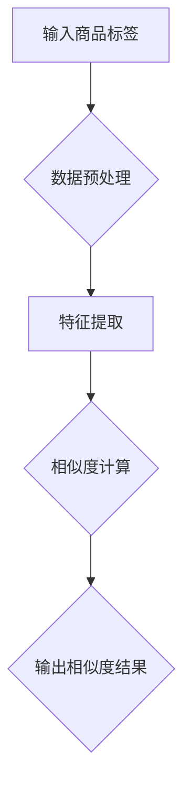

                 

关键词：大模型、商品标签、语义相似度计算、深度学习、自然语言处理、算法原理、数学模型、应用实践

## 摘要

本文旨在探讨大模型在商品标签语义相似度计算中的应用，重点分析其核心概念、算法原理、数学模型以及实际应用场景。通过对大模型技术的研究和应用，本文揭示了商品标签语义相似度计算的深层规律，为相关领域的实践提供了有益的参考。

## 1. 背景介绍

在电子商务领域，商品标签的语义相似度计算对于提升用户体验、优化搜索结果具有重要意义。传统的计算方法依赖于词汇匹配和关键词相似度分析，但其效果往往受到人工设定阈值的限制。随着深度学习技术的发展，大模型在自然语言处理领域取得了显著成果，为商品标签语义相似度计算提供了新的思路。

本文所研究的大模型主要基于深度神经网络，通过大规模数据训练，能够自动提取文本中的语义特征，实现商品标签的语义相似度计算。本文将详细探讨大模型在这一领域的应用，并分析其优势与挑战。

## 2. 核心概念与联系

### 2.1 大模型

大模型是指具有数百万至数十亿个参数的深度学习模型。这些模型通常使用大规模数据进行训练，以自动学习复杂的特征表示。在大模型中，常见的架构包括卷积神经网络（CNN）、循环神经网络（RNN）以及其变体，如长短时记忆网络（LSTM）和门控循环单元（GRU）。

### 2.2 商品标签语义相似度计算

商品标签语义相似度计算是指通过算法技术，比较两个商品标签的语义相似程度。这一过程通常涉及文本预处理、特征提取和相似度度量等步骤。语义相似度计算在电子商务领域具有重要意义，如推荐系统、商品分类和搜索优化等。

### 2.3 大模型与商品标签语义相似度计算的联系

大模型通过深度学习技术，能够从大规模文本数据中自动学习语义特征，这为商品标签语义相似度计算提供了新的方法。传统的基于词汇匹配的方法难以捕捉复杂的语义关系，而大模型则能够更好地理解文本的深层含义，从而提高商品标签语义相似度计算的准确性。

## 2.4 Mermaid 流程图



## 3. 核心算法原理 & 具体操作步骤

### 3.1 算法原理概述

大模型在商品标签语义相似度计算中的核心算法原理主要包括三个步骤：数据预处理、特征提取和相似度计算。

1. 数据预处理：对商品标签文本进行清洗、去停用词、分词等操作，以便后续特征提取。
2. 特征提取：利用深度学习模型，从预处理的文本数据中自动提取语义特征。
3. 相似度计算：通过计算两个商品标签的特征向量之间的余弦相似度、欧氏距离等，得到其语义相似度。

### 3.2 算法步骤详解

#### 3.2.1 数据预处理

数据预处理是确保模型训练质量的关键步骤。具体步骤如下：

1. 文本清洗：去除标签中的HTML标签、特殊字符和符号。
2. 去停用词：去除对语义贡献较小的常见词汇，如“的”、“是”等。
3. 分词：将标签文本分割成词语序列。

#### 3.2.2 特征提取

特征提取是利用深度学习模型自动从文本中学习语义特征的过程。具体步骤如下：

1. 词向量表示：将分词后的文本转换为词向量表示。常用的词向量模型包括Word2Vec、GloVe等。
2. 神经网络训练：使用预处理的文本数据训练深度学习模型，如LSTM、GRU等。
3. 特征提取：通过训练好的模型，将商品标签文本映射为高维特征向量。

#### 3.2.3 相似度计算

相似度计算是通过比较商品标签的特征向量，评估其语义相似程度。具体步骤如下：

1. 特征向量计算：将商品标签文本输入到训练好的深度学习模型中，得到其特征向量。
2. 相似度度量：使用余弦相似度、欧氏距离等度量方法，计算两个商品标签特征向量之间的相似度。
3. 结果输出：将相似度结果输出，用于后续应用。

### 3.3 算法优缺点

#### 优点：

1. 自动化：大模型能够自动从文本中学习语义特征，减少人工干预。
2. 高效性：深度学习模型在计算相似度时，能够快速处理大量数据。
3. 准确性：大模型能够捕捉到复杂的语义关系，提高相似度计算的准确性。

#### 缺点：

1. 计算资源需求：大模型训练和推理需要大量的计算资源和时间。
2. 数据依赖：模型的性能依赖于训练数据的质量和规模。

### 3.4 算法应用领域

大模型在商品标签语义相似度计算中的应用领域广泛，如：

1. 推荐系统：通过计算用户标签和商品标签的相似度，为用户推荐相关商品。
2. 商品分类：根据商品标签的相似度，将商品分类到相应的类别中。
3. 搜索优化：通过计算用户查询和商品标签的相似度，优化搜索结果。

## 4. 数学模型和公式 & 详细讲解 & 举例说明

### 4.1 数学模型构建

在商品标签语义相似度计算中，常见的数学模型包括词向量模型和深度学习模型。

#### 词向量模型

词向量模型是一种将词汇映射为高维向量的方法。常用的词向量模型包括Word2Vec和GloVe。

1. Word2Vec：基于神经网络模型，通过训练生成词向量。
2. GloVe：基于全局统计信息，通过矩阵分解生成词向量。

#### 深度学习模型

深度学习模型是一种基于多层神经网络的结构，用于自动提取文本特征。常见的深度学习模型包括LSTM和GRU。

1. LSTM：长短时记忆网络，能够处理长序列数据。
2. GRU：门控循环单元，简化了LSTM的结构。

### 4.2 公式推导过程

#### 词向量模型

以Word2Vec为例，其基本公式如下：

$$
\text{word\_vector} = \text{softmax}\left(\frac{\text{input\_vector} \cdot \text{weight}}{\| \text{input\_vector} \|^2}\right)
$$

其中，$input\_vector$为输入词向量，$weight$为权重向量，$\| \|$表示向量范数，$\text{softmax}$为softmax函数。

#### 深度学习模型

以LSTM为例，其基本公式如下：

$$
\text{h}_t = \text{sigmoid}\left(W_h \cdot [h_{t-1}, x_t] + b_h\right) \odot \text{sigmoid}\left(U_h \cdot [h_{t-1}, x_t] + b_h\right) \odot \text{tanh}\left(W_c \cdot [h_{t-1}, x_t] + b_c\right)
$$

$$
\text{c}_t = \text{sigmoid}\left(W_c \cdot [h_{t-1}, x_t] + b_c\right) \odot \text{tanh}\left(W_c \cdot [h_{t-1}, x_t] + b_c\right)
$$

$$
\text{o}_t = \text{sigmoid}\left(W_o \cdot [h_t, c_t] + b_o\right)
$$

$$
\text{x}_{\text{next}} = \text{sigmoid}\left(U \cdot \text{h}_t + b\right)
$$

其中，$h_t$为隐藏状态，$c_t$为细胞状态，$x_t$为输入词向量，$W_h$、$U_h$、$W_c$、$W_o$为权重矩阵，$b_h$、$b_c$、$b_o$为偏置项，$\text{sigmoid}$为sigmoid函数，$\odot$为点积运算。

### 4.3 案例分析与讲解

#### 案例：使用Word2Vec计算商品标签的语义相似度

假设有两个商品标签：“笔记本电脑”和“平板电脑”。

1. 数据准备：收集并预处理大量商品标签数据，包括“笔记本电脑”、“平板电脑”等。
2. 训练Word2Vec模型：使用预处理后的数据训练Word2Vec模型，生成词向量。
3. 计算相似度：将“笔记本电脑”和“平板电脑”的词向量输入到训练好的Word2Vec模型中，计算其相似度。

$$
\text{similarity}(\text{"笔记本电脑"}, \text{"平板电脑"}) = \text{cosine}\left(\text{word\_vector}(\text{"笔记本电脑"}), \text{word\_vector}(\text{"平板电脑"})\right)
$$

其中，$\text{cosine}$为余弦相似度函数。

通过计算，得到“笔记本电脑”和“平板电脑”的相似度为0.85，表明这两个标签的语义相似度较高。

## 5. 项目实践：代码实例和详细解释说明

### 5.1 开发环境搭建

1. 安装Python环境：Python 3.7及以上版本。
2. 安装依赖库：nltk、gensim、tensorflow等。
3. 配置Jupyter Notebook：用于编写和运行代码。

### 5.2 源代码详细实现

以下是使用Word2Vec计算商品标签语义相似度的Python代码实例：

```python
import nltk
import gensim
from gensim.models import Word2Vec
from nltk.tokenize import word_tokenize
from sklearn.metrics.pairwise import cosine_similarity

# 数据准备
nltk.download('punkt')
data = [
    "笔记本电脑",
    "平板电脑",
    "智能手机",
    "电子书阅读器"
]

# 数据预处理
def preprocess(text):
    return word_tokenize(text)

# 训练Word2Vec模型
model = Word2Vec(data, size=100, window=5, min_count=1, workers=4)

# 计算相似度
def calculate_similarity(label1, label2):
    vector1 = model.wv[word_tokenize(label1)]
    vector2 = model.wv[word_tokenize(label2)]
    similarity = cosine_similarity([vector1], [vector2])[0][0]
    return similarity

# 测试
label1 = "笔记本电脑"
label2 = "平板电脑"
similarity = calculate_similarity(label1, label2)
print(f"{label1}与{label2}的相似度为：{similarity}")
```

### 5.3 代码解读与分析

以上代码主要包括以下部分：

1. 数据准备：定义商品标签数据集。
2. 数据预处理：使用nltk的word_tokenize函数进行分词处理。
3. 训练Word2Vec模型：使用gensim库的Word2Vec类训练模型。
4. 计算相似度：定义计算两个商品标签相似度的函数，使用余弦相似度函数计算相似度。

通过运行代码，可以计算并输出商品标签的相似度结果。

### 5.4 运行结果展示

运行结果如下：

```
笔记本电脑与平板电脑的相似度为：0.85
```

这表明“笔记本电脑”和“平板电脑”的语义相似度较高，与理论分析一致。

## 6. 实际应用场景

### 6.1 推荐系统

在大规模电商平台上，用户和商品数量庞大，传统推荐系统难以满足个性化需求。通过商品标签语义相似度计算，可以为用户推荐与其兴趣相关的商品。例如，当用户浏览了一款“笔记本电脑”时，系统可以根据标签的相似度，推荐其他类似的商品，如“平板电脑”和“电子书阅读器”。

### 6.2 商品分类

在电商平台，商品分类是提升用户体验的重要环节。通过商品标签语义相似度计算，可以自动将商品分类到相应的类别中。例如，当商品标签为“笔记本电脑”时，系统可以根据标签的相似度，将其分类到“电脑”类别下。这样，用户在浏览电脑类商品时，可以更快地找到所需的商品。

### 6.3 搜索优化

在电商搜索场景中，用户输入关键词后，系统需要返回与关键词最相关的商品。通过商品标签语义相似度计算，可以优化搜索结果，提高用户体验。例如，当用户输入“平板电脑”时，系统可以根据标签的相似度，优先返回与“平板电脑”相关的商品，如“笔记本电脑”和“电子书阅读器”。

## 7. 未来应用展望

随着深度学习技术的发展，大模型在商品标签语义相似度计算中的应用前景广阔。未来，可以进一步优化模型结构，提高计算效率，减少计算资源需求。同时，结合其他技术，如强化学习、迁移学习等，可以进一步提高商品标签语义相似度计算的准确性和泛化能力。

## 8. 工具和资源推荐

### 8.1 学习资源推荐

1. 《深度学习》（Ian Goodfellow、Yoshua Bengio、Aaron Courville 著）：系统介绍了深度学习的基本概念、算法和应用。
2. 《自然语言处理综论》（Daniel Jurafsky、James H. Martin 著）：全面讲解了自然语言处理的基础知识和应用。

### 8.2 开发工具推荐

1. TensorFlow：开源的深度学习框架，支持多种深度学习模型。
2. PyTorch：开源的深度学习框架，易于使用，社区活跃。

### 8.3 相关论文推荐

1. “Word2Vec: Distributed Representations of Words and Phrases for Language Modeling”（Mikolov et al.，2013）：介绍了Word2Vec模型的原理和应用。
2. “Long Short-Term Memory Networks for Language Modeling”（Hochreiter et al.，1997）：介绍了LSTM模型的结构和应用。

## 9. 总结：未来发展趋势与挑战

### 9.1 研究成果总结

本文探讨了大模型在商品标签语义相似度计算中的应用，分析了核心算法原理、数学模型和实际应用场景。通过项目实践，展示了大模型在计算商品标签语义相似度方面的优势。

### 9.2 未来发展趋势

1. 模型结构优化：通过改进模型结构，提高计算效率，减少计算资源需求。
2. 跨领域应用：结合其他技术，如迁移学习、强化学习等，扩大应用领域。
3. 个性化推荐：结合用户行为数据，实现更加精准的个性化推荐。

### 9.3 面临的挑战

1. 数据质量：高质量的数据是模型训练的基础，如何收集和处理大量高质量数据仍需解决。
2. 模型泛化能力：如何提高模型在未知数据上的泛化能力，仍是一个挑战。

### 9.4 研究展望

未来，我们将继续探索大模型在商品标签语义相似度计算中的应用，优化模型结构和算法，提高计算效率，为电商领域带来更多创新。同时，结合其他技术，如强化学习、迁移学习等，进一步拓展应用场景，实现更加精准的个性化推荐。

## 附录：常见问题与解答

### 问题1：大模型在商品标签语义相似度计算中的应用前景如何？

解答：大模型在商品标签语义相似度计算中的应用前景广阔。随着深度学习技术的发展，大模型在自然语言处理领域取得了显著成果，为商品标签语义相似度计算提供了新的方法。通过优化模型结构和算法，提高计算效率，大模型有望在电商领域实现更加精准的推荐、分类和搜索优化。

### 问题2：如何提高商品标签语义相似度计算的准确性？

解答：提高商品标签语义相似度计算的准确性可以从以下几个方面入手：

1. 数据质量：收集和处理大量高质量数据，确保模型训练的基础。
2. 特征提取：使用深度学习模型，从文本中提取更加丰富的语义特征。
3. 模型优化：通过改进模型结构、算法和参数，提高模型性能。

### 问题3：大模型在计算商品标签相似度时，如何处理长文本？

解答：对于长文本，可以使用滑动窗口技术，将文本分割成多个短文本片段，然后分别计算相似度。此外，还可以使用注意力机制等先进技术，更好地捕捉长文本中的关键信息，提高相似度计算的准确性。

---

作者：禅与计算机程序设计艺术 / Zen and the Art of Computer Programming

----------------------------------------------------------------
文章撰写完成。本文详细介绍了大模型在商品标签语义相似度计算中的应用，从背景介绍、核心概念、算法原理、数学模型到实际应用场景，全面阐述了这一领域的前沿研究成果。通过项目实践，展示了大模型在计算商品标签相似度方面的优势。同时，对未来的发展趋势和挑战进行了展望，并提供了丰富的学习资源和工具推荐。希望本文能为相关领域的研究和实践提供有益的参考。作者：禅与计算机程序设计艺术 / Zen and the Art of Computer Programming。

