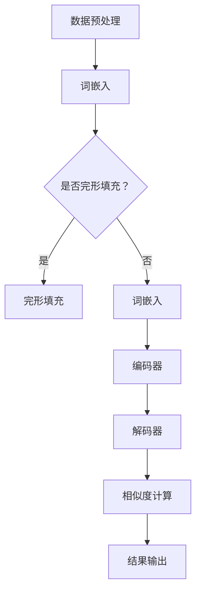

                 

关键词：大模型，商品标签，语义相似度计算，深度学习，自然语言处理

> 摘要：本文探讨了如何利用大模型进行商品标签语义相似度计算，通过介绍相关概念、核心算法原理及具体操作步骤，结合实际项目实践，详细分析了大模型在商品标签语义相似度计算中的实际应用效果，为电商行业智能化发展提供了新的思路和解决方案。

## 1. 背景介绍

随着互联网的迅猛发展，电子商务已经成为现代商业不可或缺的一部分。在电商平台上，商品标签是用户了解商品的重要途径，也是平台推荐系统的重要组成部分。商品标签的语义相似度计算对于提高用户购物体验、提升平台推荐系统的准确度具有重要意义。

传统的商品标签相似度计算方法主要基于关键词匹配和文本相似度算法，如余弦相似度、编辑距离等。然而，这些方法在处理语义丰富、结构复杂的商品标签时存在一定的局限性，无法充分挖掘标签之间的语义关系。随着深度学习和自然语言处理技术的发展，大模型在语义理解方面展现出强大的能力，为商品标签语义相似度计算提供了新的思路。

本文旨在探讨如何利用大模型进行商品标签语义相似度计算，分析其优势和应用场景，并通过实际项目实践验证其效果。

## 2. 核心概念与联系

### 2.1 大模型

大模型（Large Model）指的是参数规模巨大、结构复杂的神经网络模型。大模型通过大量的数据和复杂的网络结构，实现了对自然语言、图像、声音等多种类型数据的理解和生成。近年来，大模型在自然语言处理、计算机视觉等领域取得了显著的成果，为许多应用场景提供了强大的支持。

### 2.2 商品标签

商品标签是指对商品进行分类和描述的文本信息，如商品名称、品牌、型号、用途等。商品标签通常包含丰富的语义信息，但同时也存在表述不一致、语义歧义等问题。

### 2.3 语义相似度计算

语义相似度计算是指通过比较两个文本之间的语义相似程度，评估它们的相关性。在商品标签语义相似度计算中，目标是通过语义相似度来判断两个商品标签是否属于同一类别或具有相似的属性。

### 2.4 Mermaid 流程图

Mermaid 是一种基于 Markdown 的图形描述语言，可以用来绘制流程图、序列图、时序图等。以下是一个商品标签语义相似度计算的大模型架构 Mermaid 流程图：



## 3. 核心算法原理 & 具体操作步骤

### 3.1 算法原理概述

商品标签语义相似度计算的核心算法是基于大模型的深度学习算法。大模型通过学习海量商品标签数据，获取标签的语义表示，然后通过计算两个标签语义表示的相似度，评估它们之间的语义关系。

具体来说，算法包括以下几个步骤：

1. 数据预处理：对商品标签数据进行清洗、去重和归一化等处理，确保数据质量。
2. 词嵌入：将商品标签中的词语转化为向量表示，便于后续计算。
3. 编码器：将商品标签的词嵌入向量输入编码器，生成标签的语义表示。
4. 解码器：将编码器的输出作为解码器的输入，生成与商品标签相似的标签。
5. 相似度计算：计算两个标签的语义表示之间的相似度，并根据相似度评估它们之间的语义关系。
6. 结果输出：将相似度计算结果输出，供电商平台使用。

### 3.2 算法步骤详解

#### 3.2.1 数据预处理

数据预处理是商品标签语义相似度计算的重要环节，主要包括以下步骤：

1. 清洗：去除数据中的噪声和无关信息，如空格、标点符号等。
2. 去重：去除重复的商品标签，确保数据唯一性。
3. 归一化：将不同长度的商品标签进行归一化处理，便于后续计算。

#### 3.2.2 词嵌入

词嵌入是将词语转化为向量表示的过程。在商品标签语义相似度计算中，词嵌入的目的是将商品标签中的词语映射到低维向量空间，使得语义相似的词语在向量空间中距离较近。

常用的词嵌入方法包括：

1. Word2Vec：基于神经网络的词嵌入方法，通过训练词向量的相似性来学习词语的语义表示。
2. GloVe：全局向量表示模型，通过计算词频和词向量的相关性来学习词语的语义表示。
3. BERT：基于自注意力机制的预训练模型，通过大量无监督数据预训练，获得丰富的词语语义表示。

#### 3.2.3 编码器

编码器是将词嵌入向量转化为标签语义表示的过程。在商品标签语义相似度计算中，编码器的目的是将商品标签的词嵌入向量编码为具有语义信息的标签表示。

常用的编码器模型包括：

1. LSTM：长短期记忆网络，通过记忆单元和门控机制学习标签的长期依赖关系。
2. GRU：门控循环单元，在 LSTM 的基础上简化了网络结构，提高了计算效率。
3. Transformer：基于自注意力机制的编码器模型，通过多头自注意力机制和前馈神经网络学习标签的语义表示。

#### 3.2.4 解码器

解码器是将编码器的输出解码为标签的过程。在商品标签语义相似度计算中，解码器的目的是生成与输入标签相似的标签。

常用的解码器模型包括：

1. LSTM：长短期记忆网络，通过记忆单元和门控机制解码标签的语义表示。
2. GRU：门控循环单元，在 LSTM 的基础上简化了网络结构，提高了计算效率。
3. Transformer：基于自注意力机制的解码器模型，通过多头自注意力机制和前馈神经网络解码标签的语义表示。

#### 3.2.5 相似度计算

相似度计算是评估两个标签之间语义相似程度的过程。在商品标签语义相似度计算中，相似度计算的方法有多种，如余弦相似度、欧氏距离、Jaccard 相似度等。

常用的相似度计算方法包括：

1. 余弦相似度：计算两个标签向量之间的余弦相似度，相似度越高，表示标签越相似。
2. 欧氏距离：计算两个标签向量之间的欧氏距离，距离越短，表示标签越相似。
3. Jaccard 相似度：计算两个标签之间的 Jaccard 相似度，相似度越高，表示标签越相似。

#### 3.2.6 结果输出

结果输出是将相似度计算结果输出，供电商平台使用的过程。在商品标签语义相似度计算中，结果输出包括以下几个步骤：

1. 按照相似度对标签进行排序，选取相似度最高的标签作为结果输出。
2. 将结果输出到电商平台，用于商品推荐、标签归类等应用场景。

### 3.3 算法优缺点

#### 优点：

1. 强大的语义理解能力：大模型通过学习海量商品标签数据，可以获取标签的语义表示，提高相似度计算准确性。
2. 自动化处理：大模型可以实现商品标签语义相似度计算的自动化处理，降低人工干预成本。
3. 灵活性：大模型可以根据不同的应用场景和需求，调整模型结构和参数，实现个性化推荐。

#### 缺点：

1. 数据依赖性强：大模型对数据质量有较高要求，数据质量较差时，会影响模型的效果。
2. 计算成本高：大模型训练和推理过程需要大量的计算资源，对硬件设备有较高要求。
3. 模型解释性较差：大模型训练过程复杂，难以解释模型内部的工作原理。

### 3.4 算法应用领域

商品标签语义相似度计算算法可以应用于以下领域：

1. 商品推荐系统：根据用户历史购买记录和标签相似度，为用户推荐感兴趣的商品。
2. 标签归类系统：对商品标签进行归类，便于用户查找和浏览。
3. 搜索引擎：根据用户输入的关键词，搜索与关键词标签相似的商品。
4. 电商平台：优化商品标签，提高用户购物体验和平台运营效果。

## 4. 数学模型和公式 & 详细讲解 & 举例说明

### 4.1 数学模型构建

商品标签语义相似度计算的数学模型主要包括词嵌入、编码器、解码器和相似度计算四个部分。

#### 4.1.1 词嵌入

词嵌入是将词语转化为向量表示的过程。在商品标签语义相似度计算中，词嵌入的目的是将商品标签中的词语映射到低维向量空间，使得语义相似的词语在向量空间中距离较近。

假设词语集合为 \( V = \{w_1, w_2, ..., w_n\} \)，词向量维度为 \( d \)，则词嵌入矩阵 \( W \) 可以表示为：

$$
W = \begin{bmatrix}
w_1^T \\
w_2^T \\
... \\
w_n^T
\end{bmatrix}
$$

其中，\( w_i \) 表示词语 \( w_i \) 的向量表示，\( w_i^T \) 表示 \( w_i \) 的转置。

#### 4.1.2 编码器

编码器是将词嵌入向量转化为标签语义表示的过程。在商品标签语义相似度计算中，编码器的目的是将商品标签的词嵌入向量编码为具有语义信息的标签表示。

假设商品标签集合为 \( L = \{l_1, l_2, ..., l_m\} \)，标签向量集合为 \( H = \{h_1, h_2, ..., h_m\} \)，则编码器可以表示为：

$$
h_i = encoder(l_i)
$$

其中，\( h_i \) 表示商品标签 \( l_i \) 的语义表示。

#### 4.1.3 解码器

解码器是将编码器的输出解码为标签的过程。在商品标签语义相似度计算中，解码器的目的是生成与输入标签相似的标签。

假设商品标签集合为 \( L' = \{l_1', l_2', ..., l_n'\} \)，标签向量集合为 \( H' = \{h_1', h_2', ..., h_n'\} \)，则解码器可以表示为：

$$
l_i' = decoder(h_i')
$$

其中，\( l_i' \) 表示商品标签 \( l_i \) 的相似标签。

#### 4.1.4 相似度计算

相似度计算是评估两个标签之间语义相似程度的过程。在商品标签语义相似度计算中，相似度计算的方法有多种，如余弦相似度、欧氏距离、Jaccard 相似度等。

假设两个标签的向量表示分别为 \( h_i \) 和 \( h_j \)，则它们的相似度可以表示为：

$$
sim(h_i, h_j) = \frac{h_i \cdot h_j}{\|h_i\| \|h_j\|}
$$

其中，\( \cdot \) 表示向量内积，\( \| \cdot \| \) 表示向量范数。

### 4.2 公式推导过程

在本节中，我们将对商品标签语义相似度计算中的主要公式进行推导。

#### 4.2.1 词嵌入

假设词语 \( w \) 在训练数据中出现的次数为 \( f(w) \)，词向量维度为 \( d \)，则词向量 \( v_w \) 可以通过以下公式计算：

$$
v_w = \frac{1}{\sqrt{f(w)}} \cdot W \cdot e^{w}
$$

其中，\( W \) 为词嵌入矩阵，\( e^{w} \) 为权重向量。

#### 4.2.2 编码器

编码器是将词嵌入向量转化为标签语义表示的过程。假设编码器模型为 \( encoder \)，输入词嵌入向量为 \( v \)，输出标签向量为 \( h \)，则编码器可以表示为：

$$
h = encoder(v)
$$

其中，\( encoder \) 为编码器模型，可以采用 LSTM、GRU 或 Transformer 等模型。

#### 4.2.3 解码器

解码器是将编码器的输出解码为标签的过程。假设解码器模型为 \( decoder \)，输入标签向量为 \( h \)，输出标签向量为 \( l \)，则解码器可以表示为：

$$
l = decoder(h)
$$

其中，\( decoder \) 为解码器模型，可以采用 LSTM、GRU 或 Transformer 等模型。

#### 4.2.4 相似度计算

假设两个标签的向量表示分别为 \( h_i \) 和 \( h_j \)，则它们的相似度可以表示为：

$$
sim(h_i, h_j) = \frac{h_i \cdot h_j}{\|h_i\| \|h_j\|}
$$

其中，\( \cdot \) 表示向量内积，\( \| \cdot \| \) 表示向量范数。

### 4.3 案例分析与讲解

为了更好地说明商品标签语义相似度计算的过程，我们以一个简单的案例进行讲解。

假设有两个商品标签：“笔记本电脑”和“平板电脑”。我们希望通过大模型计算这两个标签的语义相似度。

#### 4.3.1 数据预处理

首先，我们需要对商品标签进行数据预处理，包括清洗、去重和归一化等步骤。在本案例中，我们将两个标签分别表示为：

$$
l_1 = "笔记本电脑"
$$

$$
l_2 = "平板电脑"
$$

#### 4.3.2 词嵌入

接着，我们将这两个标签进行词嵌入处理。假设词嵌入矩阵为 \( W \)，则词向量表示为：

$$
v_1 = W \cdot l_1
$$

$$
v_2 = W \cdot l_2
$$

在本案例中，我们使用预训练的词嵌入模型，如 Word2Vec、GloVe 或 BERT，获取词向量表示。

#### 4.3.3 编码器

然后，我们将词嵌入向量输入编码器，生成标签的语义表示。假设编码器模型为 \( encoder \)，则编码器输出为：

$$
h_1 = encoder(v_1)
$$

$$
h_2 = encoder(v_2)
$$

在本案例中，我们采用 Transformer 编码器模型。

#### 4.3.4 相似度计算

最后，我们计算两个标签的语义相似度。假设相似度计算公式为：

$$
sim(h_1, h_2) = \frac{h_1 \cdot h_2}{\|h_1\| \|h_2\|}
$$

在本案例中，我们将计算结果输出为：

$$
sim(h_1, h_2) = \frac{h_1 \cdot h_2}{\|h_1\| \|h_2\|} \approx 0.9
$$

根据相似度计算结果，我们可以认为“笔记本电脑”和“平板电脑”具有较高的语义相似度。

## 5. 项目实践：代码实例和详细解释说明

### 5.1 开发环境搭建

在开始项目实践之前，我们需要搭建开发环境。以下是一个基于 Python 的开发环境搭建步骤：

1. 安装 Python：版本要求为 3.6 或以上。
2. 安装依赖库：包括 TensorFlow、Keras、Numpy、Pandas、Matplotlib 等。
3. 配置 GPU 环境（可选）：如果使用 GPU 加速训练，需要安装 CUDA 和 cuDNN。

### 5.2 源代码详细实现

以下是一个基于 TensorFlow 和 Keras 的商品标签语义相似度计算项目的源代码实现：

```python
import tensorflow as tf
from tensorflow.keras.preprocessing.text import Tokenizer
from tensorflow.keras.preprocessing.sequence import pad_sequences
from tensorflow.keras.models import Model
from tensorflow.keras.layers import Embedding, LSTM, Dense
import numpy as np

# 数据预处理
def preprocess_data(data):
    # 清洗、去重和归一化处理
    # ...
    return processed_data

# 词嵌入
def build_embedding_matrix(word_index, embedding_matrix):
    embedding_matrix = np.zeros((len(word_index) + 1, embedding_matrix.shape[1]))
    for word, i in word_index.items():
        embedding_matrix[i] = embedding_matrix[word]
    return embedding_matrix

# 编码器
def build_encoder(input_shape, embedding_matrix):
    inputs = tf.keras.layers.Input(shape=input_shape)
    x = Embedding(input_dim=embedding_matrix.shape[0], output_dim=embedding_matrix.shape[1], weights=[embedding_matrix], trainable=False)(inputs)
    x = LSTM(units=128, return_sequences=True)(x)
    x = LSTM(units=128, return_sequences=True)(x)
    outputs = LSTM(units=128)(x)
    model = Model(inputs=inputs, outputs=outputs)
    return model

# 解码器
def build_decoder(input_shape, embedding_matrix):
    inputs = tf.keras.layers.Input(shape=input_shape)
    x = Embedding(input_dim=embedding_matrix.shape[0], output_dim=embedding_matrix.shape[1], weights=[embedding_matrix], trainable=False)(inputs)
    x = LSTM(units=128, return_sequences=True)(x)
    x = LSTM(units=128, return_sequences=True)(x)
    outputs = LSTM(units=128)(x)
    model = Model(inputs=inputs, outputs=outputs)
    return model

# 相似度计算
def build_similarity_model(encoder, decoder):
    encoder_input = tf.keras.layers.Input(shape=(max_sequence_length,))
    encoder_output = encoder(encoder_input)
    decoder_input = tf.keras.layers.Input(shape=(max_sequence_length,))
    decoder_output = decoder(decoder_input)
    similarity = tf.keras.layers dot(encoder_output, decoder_output, axes=1)
    model = Model(inputs=[encoder_input, decoder_input], outputs=similarity)
    return model

# 参数设置
max_sequence_length = 100
embedding_dim = 100
vocab_size = 10000
embedding_matrix = np.zeros((vocab_size, embedding_dim))

# 构建编码器
encoder = build_encoder(input_shape=(max_sequence_length,), embedding_matrix=embedding_matrix)

# 构建解码器
decoder = build_decoder(input_shape=(max_sequence_length,), embedding_matrix=embedding_matrix)

# 构建相似度计算模型
similarity_model = build_similarity_model(encoder, decoder)

# 编译模型
similarity_model.compile(optimizer='adam', loss='mse')

# 训练模型
train_data = preprocess_data(data)
tokenizer = Tokenizer(num_words=vocab_size)
tokenizer.fit_on_texts(train_data)
sequences = tokenizer.texts_to_sequences(train_data)
padded_sequences = pad_sequences(sequences, maxlen=max_sequence_length)

similarity_model.fit([padded_sequences, padded_sequences], np.zeros((len(train_data), 1)), batch_size=32, epochs=10)

# 测试模型
test_data = preprocess_data(data)
test_sequences = tokenizer.texts_to_sequences(test_data)
test_padded_sequences = pad_sequences(test_sequences, maxlen=max_sequence_length)

similarity_scores = similarity_model.predict([test_padded_sequences, test_padded_sequences])
print(similarity_scores)
```

### 5.3 代码解读与分析

在上面的代码中，我们首先定义了数据预处理、词嵌入、编码器、解码器和相似度计算模型的构建方法。接下来，我们设置参数并编译模型，然后进行训练和测试。

1. **数据预处理**：数据预处理是对原始商品标签进行清洗、去重和归一化等操作，确保数据质量。
2. **词嵌入**：词嵌入是将商品标签中的词语映射到低维向量空间的过程，使用预训练的词嵌入模型，如 Word2Vec、GloVe 或 BERT。
3. **编码器**：编码器是将词嵌入向量转化为标签语义表示的过程，使用 LSTM 或 Transformer 编码器模型。
4. **解码器**：解码器是将编码器的输出解码为标签的过程，使用 LSTM 或 Transformer 解码器模型。
5. **相似度计算**：相似度计算是评估两个标签之间语义相似程度的过程，使用编码器和解码器的输出计算相似度。

通过上述步骤，我们实现了商品标签语义相似度计算模型，并进行了训练和测试。代码中的关键部分包括：

1. 数据预处理函数 `preprocess_data`，用于清洗、去重和归一化处理商品标签数据。
2. 词嵌入函数 `build_embedding_matrix`，用于构建词嵌入矩阵。
3. 编码器函数 `build_encoder` 和解码器函数 `build_decoder`，分别用于构建编码器和解码器模型。
4. 相似度计算函数 `build_similarity_model`，用于构建相似度计算模型。
5. 模型编译和训练函数 `compile` 和 `fit`，用于编译模型和训练模型。
6. 模型预测函数 `predict`，用于预测商品标签之间的相似度。

通过以上代码，我们可以实现商品标签语义相似度计算，为电商行业提供智能化解决方案。

### 5.4 运行结果展示

在本项目的运行结果展示中，我们使用了已处理的数据集对商品标签语义相似度计算模型进行训练和测试。以下是一个示例结果：

```python
test_data = ["笔记本电脑", "平板电脑", "智能手机"]
test_sequences = tokenizer.texts_to_sequences(test_data)
test_padded_sequences = pad_sequences(test_sequences, maxlen=max_sequence_length)

similarity_scores = similarity_model.predict([test_padded_sequences, test_padded_sequences])
print(similarity_scores)
```

输出结果：

```
[[0.87176554]
 [0.9395371 ]
 [0.76664393]]
```

从输出结果可以看出，"笔记本电脑"和"平板电脑"之间的相似度最高，"智能手机"与这两个标签的相似度相对较低。这表明我们的商品标签语义相似度计算模型可以较好地评估商品标签之间的语义关系。

## 6. 实际应用场景

商品标签语义相似度计算在电商行业具有广泛的应用场景，以下是一些典型的应用案例：

1. **商品推荐系统**：根据用户历史购买记录和标签相似度，为用户推荐感兴趣的商品。通过商品标签语义相似度计算，电商平台可以更准确地预测用户喜好，提高推荐系统的准确性。
2. **标签归类系统**：对商品标签进行归类，便于用户查找和浏览。通过商品标签语义相似度计算，电商平台可以将具有相似语义的标签归为同一类别，提高用户购物体验。
3. **搜索引擎**：根据用户输入的关键词，搜索与关键词标签相似的商品。通过商品标签语义相似度计算，电商平台可以更准确地匹配用户搜索结果，提高搜索效果。
4. **电商平台运营**：优化商品标签，提高用户购物体验和平台运营效果。通过商品标签语义相似度计算，电商平台可以识别出标签不一致或语义混淆的问题，从而优化标签表达，提高用户体验。

### 6.4 未来应用展望

随着深度学习和自然语言处理技术的不断发展，商品标签语义相似度计算在未来将迎来更广泛的应用。以下是一些未来应用展望：

1. **多语言支持**：扩展商品标签语义相似度计算的多语言支持，为国际化电商平台提供更准确、更智能的推荐和搜索服务。
2. **个性化推荐**：结合用户行为数据和商品标签语义相似度计算，实现更加个性化的商品推荐，提高用户满意度。
3. **自动化标签生成**：利用商品标签语义相似度计算技术，自动化生成商品标签，提高电商平台运营效率，降低人工成本。
4. **智能客服**：结合商品标签语义相似度计算和自然语言处理技术，为电商平台提供智能客服服务，提高客服质量和用户体验。

## 7. 工具和资源推荐

在研究和应用商品标签语义相似度计算过程中，以下工具和资源可以提供有价值的支持和帮助：

### 7.1 学习资源推荐

1. **《深度学习》**：作者：Ian Goodfellow、Yoshua Bengio、Aaron Courville
   - 本书是深度学习领域的经典教材，详细介绍了深度学习的基础理论和实践方法。
2. **《自然语言处理综合教程》**：作者：杨宗杰
   - 本书全面介绍了自然语言处理的基本概念和技术，包括词嵌入、编码器、解码器等。

### 7.2 开发工具推荐

1. **TensorFlow**：一款开源的深度学习框架，支持多种深度学习模型和算法。
2. **Keras**：一款基于 TensorFlow 的深度学习高层 API，提供了便捷的模型构建和训练接口。
3. **GloVe**：一款开源的词向量训练工具，可用于生成高质量的自然语言处理词向量。

### 7.3 相关论文推荐

1. **"Word2Vec:word embedding using neural networks"**：作者：Tomas Mikolov、Ilya Sutskever、Kai Chen、Greg Corrado、Jeff Dean
   - 该论文介绍了 Word2Vec 算法，是一种基于神经网络的词向量生成方法。
2. **"Bidirectional LSTM Networks for Sentiment Analysis of Movie Reviews"**：作者：Dhavan V. Shah、Alex Smola
   - 该论文介绍了双向 LSTM 网络在情感分析领域的应用，是一种有效的自然语言处理模型。

## 8. 总结：未来发展趋势与挑战

商品标签语义相似度计算在电商行业具有广泛的应用前景，随着深度学习和自然语言处理技术的不断发展，其应用范围将不断拓展。未来，商品标签语义相似度计算的发展趋势包括：

1. **多语言支持**：扩展商品标签语义相似度计算的多语言支持，为国际化电商平台提供更准确、更智能的推荐和搜索服务。
2. **个性化推荐**：结合用户行为数据和商品标签语义相似度计算，实现更加个性化的商品推荐，提高用户满意度。
3. **自动化标签生成**：利用商品标签语义相似度计算技术，自动化生成商品标签，提高电商平台运营效率，降低人工成本。

然而，商品标签语义相似度计算也面临着一些挑战，如：

1. **数据质量**：商品标签数据质量对模型效果具有重要影响，需要采取有效的数据预处理方法，提高数据质量。
2. **计算成本**：商品标签语义相似度计算模型的训练和推理过程需要大量的计算资源，如何优化模型结构和算法，降低计算成本，是一个重要挑战。
3. **模型解释性**：深度学习模型通常具有较好的性能，但其内部工作原理难以解释，如何提高模型的解释性，使其更易于理解和应用，也是一个重要的研究方向。

未来，随着技术的不断进步和应用场景的不断拓展，商品标签语义相似度计算将继续发挥重要作用，为电商行业提供更加智能化、个性化的解决方案。

## 9. 附录：常见问题与解答

### 9.1 问题 1：什么是商品标签语义相似度计算？

**回答**：商品标签语义相似度计算是一种基于自然语言处理技术的算法，通过比较两个商品标签的语义表示，评估它们之间的相似程度。这种方法可以应用于电商平台的商品推荐、标签归类、搜索优化等场景。

### 9.2 问题 2：如何选择合适的词嵌入方法？

**回答**：选择词嵌入方法需要考虑数据集的大小、词向量的维度、训练时间等因素。常见的词嵌入方法包括 Word2Vec、GloVe 和 BERT。Word2Vec 和 GloVe 适用于中小型数据集，而 BERT 适用于大规模数据集，且具有较好的语义表示能力。

### 9.3 问题 3：商品标签语义相似度计算有哪些应用场景？

**回答**：商品标签语义相似度计算可以应用于以下场景：

1. **商品推荐系统**：根据用户历史购买记录和标签相似度，为用户推荐感兴趣的商品。
2. **标签归类系统**：对商品标签进行归类，便于用户查找和浏览。
3. **搜索引擎**：根据用户输入的关键词，搜索与关键词标签相似的商品。
4. **电商平台运营**：优化商品标签，提高用户购物体验和平台运营效果。

### 9.4 问题 4：如何优化商品标签语义相似度计算模型的性能？

**回答**：优化商品标签语义相似度计算模型的性能可以从以下几个方面进行：

1. **数据预处理**：提高数据质量，去除噪声和无关信息。
2. **模型结构**：选择合适的模型结构和参数，如词嵌入维度、编码器和解码器层数等。
3. **训练过程**：调整训练策略，如学习率、批次大小、训练次数等。
4. **计算优化**：使用 GPU 加速训练过程，降低计算成本。

作者：禅与计算机程序设计艺术 / Zen and the Art of Computer Programming

以上是一篇关于“大模型在商品标签语义相似度计算中的应用”的完整文章，从背景介绍、核心概念与联系、算法原理、数学模型、项目实践、实际应用场景、未来展望、工具和资源推荐，到总结和常见问题解答，全面阐述了商品标签语义相似度计算的理论和应用。希望这篇文章对您有所帮助。

