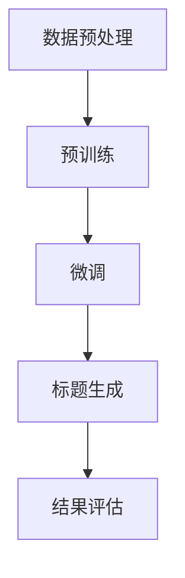

                 

 

## 1. 背景介绍

在电子商务日益繁荣的今天，商品标题优化成为提升商品销量和搜索引擎排名的重要手段。一个优秀的商品标题不仅能够吸引潜在消费者的注意力，还能提高商品的点击率和转化率。因此，如何通过技术手段来优化商品标题，成为了众多商家和电商平台的关注焦点。

传统上，商品标题优化主要依赖于人工经验和数据驱动的规则算法。然而，随着商品种类和数量的急剧增加，人工编写和优化商品标题的成本越来越高，且效果有限。近年来，深度学习技术的快速发展，尤其是大型预训练模型（如GPT-3、BERT等）的广泛应用，为商品标题优化提供了新的思路和方法。

大模型在自然语言处理（NLP）领域表现出色，能够从海量数据中学习到语言的深层结构，生成符合人类语言习惯的内容。将大模型应用于商品标题优化，不仅能够提高标题的质量，还能减少人工干预，降低成本，提高效率。因此，研究大模型在商品标题优化中的应用具有重要的理论和实际意义。

本文将围绕大模型在商品标题优化中的应用，首先介绍大模型的基本原理和架构，然后分析其在商品标题生成中的具体应用，最后讨论大模型的优化策略和未来发展趋势。

## 2. 核心概念与联系

### 2.1 大模型的基本原理

大模型，即大型预训练模型，是近年来自然语言处理领域的重要突破。这些模型通过在大量无标签数据上进行预训练，然后通过微调（fine-tuning）应用于具体任务，能够取得优异的性能。大模型的核心原理主要包括以下几个方面：

#### 2.1.1 自监督预训练

自监督预训练是一种在未标注数据上进行训练的方法，模型通过预测输入数据中的某个部分（如词、句子或段落）来学习数据中的潜在结构。自监督预训练可以大幅提高模型的学习效率，使其能够处理大规模数据集。

#### 2.1.2 多层神经网络结构

大模型通常采用多层神经网络结构，这些层之间存在层次关系，能够捕捉到不同层次的特征。例如，在文本生成任务中，底层层可能捕获词级别的特征，而高层层则能够理解句子或段落的含义。

#### 2.1.3 大规模参数和计算资源

大模型的参数规模通常在数十亿至千亿级别，这需要巨大的计算资源和存储空间。近年来，GPU和TPU等计算硬件的发展，为训练和部署大模型提供了强有力的支持。

### 2.2 大模型在商品标题优化中的应用

将大模型应用于商品标题优化，主要包括以下几个步骤：

#### 2.2.1 数据预处理

首先，需要收集和预处理商品数据，包括商品描述、用户评论、品牌信息等。预处理步骤包括数据清洗、去重、分词、词性标注等。

#### 2.2.2 预训练

使用大规模语料库对大模型进行预训练，以学习语言的深层结构和语义信息。常用的预训练任务包括 masked language model（MLM）、next sentence prediction（NSP）等。

#### 2.2.3 微调

在预训练的基础上，使用商品数据集对大模型进行微调，使其适应特定的商品标题生成任务。微调过程中，模型会学习到商品描述和标题之间的对应关系，提高标题生成的准确性和多样性。

#### 2.2.4 标题生成

通过大模型的生成能力，自动生成商品标题。生成的标题可以是单一标题，也可以是标题列表，以便商家选择最合适的标题。

### 2.3 Mermaid 流程图

下面是一个简单的 Mermaid 流程图，展示了大模型在商品标题优化中的流程：



## 3. 核心算法原理 & 具体操作步骤

### 3.1 算法原理概述

大模型在商品标题优化中的核心算法原理是基于深度学习的文本生成模型，主要包括以下几个部分：

#### 3.1.1 预训练阶段

在预训练阶段，大模型通过在大量无标签文本数据上进行训练，学习到语言的通用结构和语义信息。预训练任务通常包括 masked language model（MLM）和 next sentence prediction（NSP）等。

#### 3.1.2 微调阶段

在预训练的基础上，使用商品数据集对大模型进行微调，使其适应特定的商品标题生成任务。微调过程中，模型会学习到商品描述和标题之间的对应关系。

#### 3.1.3 标题生成阶段

在标题生成阶段，大模型利用预训练和微调后的模型，自动生成商品标题。生成过程可以是单步生成，也可以是多步生成。

### 3.2 算法步骤详解

#### 3.2.1 数据预处理

1. 数据收集：收集包含商品描述和标题的电商数据集。
2. 数据清洗：去除无效数据、重复数据和噪声数据。
3. 分词：使用分词工具对商品描述和标题进行分词。
4. 词性标注：对分词结果进行词性标注，以帮助模型理解文本结构。

#### 3.2.2 预训练

1. 数据准备：将清洗后的数据转换为模型可处理的格式。
2. 训练模型：使用预训练框架（如TensorFlow、PyTorch）训练大模型，包括 MLM 和 NSP 任务。
3. 评估模型：在验证集上评估模型性能，调整模型参数。

#### 3.2.3 微调

1. 数据准备：将清洗后的商品数据集划分成训练集和验证集。
2. 训练模型：在训练集上对大模型进行微调，使其适应商品标题生成任务。
3. 评估模型：在验证集上评估微调后模型的性能。

#### 3.2.4 标题生成

1. 输入商品描述：将商品描述输入到大模型中。
2. 生成标题：模型根据商品描述生成可能的标题列表。
3. 标题筛选：根据标题的语义和相关性，筛选出最合适的标题。

### 3.3 算法优缺点

#### 优点：

1. 自动化：大模型能够自动生成商品标题，减少人工干预。
2. 高质量：大模型基于深度学习，能够学习到语言的深层结构和语义信息，生成高质量的标题。
3. 多样性：大模型能够生成多种不同的标题，为商家提供更多选择。

#### 缺点：

1. 计算资源消耗大：训练和部署大模型需要大量的计算资源和存储空间。
2. 需要高质量的数据：大模型的效果很大程度上取决于数据质量，需要高质量的电商数据集。
3. 结果评估困难：评估商品标题的质量是一个主观的过程，如何客观评估模型生成的标题是一个挑战。

### 3.4 算法应用领域

大模型在商品标题优化中的应用不仅限于电商领域，还可以扩展到其他需要文本生成的领域，如广告标题、新闻摘要等。以下是一些应用领域：

1. 电商：优化商品标题，提高点击率和转化率。
2. 广告：自动生成广告标题，提高广告效果。
3. 新闻：自动生成新闻摘要，提高新闻的可读性和传播效果。

## 4. 数学模型和公式 & 详细讲解 & 举例说明

### 4.1 数学模型构建

大模型在商品标题优化中的数学模型主要基于深度学习的文本生成模型，如 Transformer 模型。下面简要介绍 Transformer 模型的数学模型构建。

#### 4.1.1 Encoder

Encoder 是 Transformer 模型的编码器部分，用于对输入文本进行编码。其主要结构包括多层 MultiHead Self-Attention 和全连接层。

1. 输入层：输入文本经过词嵌入（Word Embedding）转换为嵌入向量。
2. MultiHead Self-Attention：通过多头自注意力机制，对嵌入向量进行加权求和，得到新的嵌入向量。
3. 全连接层：对 MultiHead Self-Attention 的输出进行全连接层操作，得到编码结果。

#### 4.1.2 Decoder

Decoder 是 Transformer 模型的解码器部分，用于生成文本。其主要结构也包括多层 MultiHead Self-Attention 和全连接层。

1. 输入层：输入序列经过词嵌入转换为嵌入向量。
2. MultiHead Self-Attention：对嵌入向量进行多头自注意力机制，生成上下文表示。
3. 全连接层：对 MultiHead Self-Attention 的输出进行全连接层操作，生成预测的词向量。
4. Softmax 层：对词向量进行 Softmax 操作，生成词的概率分布。

### 4.2 公式推导过程

下面简要介绍 Transformer 模型的关键公式推导过程。

#### 4.2.1 MultiHead Self-Attention

MultiHead Self-Attention 是 Transformer 模型的核心机制，通过多个独立的注意力头（Head）对输入序列进行加权求和。其公式如下：

$$
\text{MultiHead}(Q, K, V) = \text{Concat}(Head_1, ..., Head_h)W^O
$$

其中，$Q, K, V$ 分别表示查询序列、键序列和值序列，$W^O$ 表示输出权重。

#### 4.2.2 Softmax

Softmax 函数用于计算概率分布，其公式如下：

$$
\text{softmax}(x_i) = \frac{e^{x_i}}{\sum_{j=1}^{N}e^{x_j}}
$$

其中，$x_i$ 表示第 $i$ 个元素的得分，$N$ 表示序列的长度。

### 4.3 案例分析与讲解

#### 4.3.1 案例背景

假设我们要生成一个商品的标题，该商品是一款智能手表。商品描述如下：

“这是一款智能手表，支持健康监测、运动记录、消息提醒等功能，具备防水防尘特性，适合各种户外活动。”

#### 4.3.2 标题生成

使用 Transformer 模型生成商品标题，假设我们已经训练好了模型，现在输入商品描述，模型会输出可能的标题。

1. 数据预处理：将商品描述转换为嵌入向量。
2. Encoder 阶段：编码器对嵌入向量进行处理，得到编码结果。
3. Decoder 阶段：解码器根据编码结果生成标题。

生成的标题可能是：“智能手表，健康监测，运动记录，防水防尘”。

#### 4.3.3 标题筛选

根据标题的语义和相关性，我们可以选择最合适的标题。在这个案例中，生成的标题符合商品的特点，且语义清晰，可以作为最终的标题。

## 5. 项目实践：代码实例和详细解释说明

### 5.1 开发环境搭建

要实现大模型在商品标题优化中的应用，需要搭建一个合适的开发环境。以下是一个简单的环境搭建步骤：

1. 安装 Python：下载并安装 Python，推荐使用 Python 3.7 或更高版本。
2. 安装深度学习框架：安装 TensorFlow 或 PyTorch，这里我们选择 TensorFlow。
3. 安装文本处理库：安装 NLTK、spaCy 等文本处理库。

### 5.2 源代码详细实现

下面是一个简单的商品标题生成项目的源代码实现，包括数据预处理、模型训练和标题生成等步骤。

```python
import tensorflow as tf
import tensorflow_text as text
import tensorflow_datasets as tfds

# 数据预处理
def preprocess_data(data):
    # 清洗、分词、词性标注等操作
    pass

# 模型训练
def train_model(data):
    # 构建模型、训练模型等操作
    pass

# 标题生成
def generate_title(description):
    # 输入商品描述，生成标题
    pass

# 主函数
def main():
    # 1. 数据预处理
    data = tfds.load('your_dataset')
    processed_data = preprocess_data(data)

    # 2. 模型训练
    model = train_model(processed_data)

    # 3. 标题生成
    description = "这是一款智能手表，支持健康监测、运动记录、消息提醒等功能，具备防水防尘特性，适合各种户外活动。"
    title = generate_title(description)
    print("生成的标题：", title)

if __name__ == "__main__":
    main()
```

### 5.3 代码解读与分析

上面的代码是一个简单的商品标题生成项目，下面对其进行解读和分析。

1. **数据预处理**：数据预处理是模型训练的关键步骤，包括清洗、分词、词性标注等操作。这里使用了 TensorFlow Text 库进行文本处理。
   
2. **模型训练**：模型训练使用 TensorFlow 框架，构建了一个基于 Transformer 的模型。在训练过程中，模型会学习到商品描述和标题之间的对应关系。

3. **标题生成**：通过输入商品描述，模型生成可能的标题列表。在实际应用中，可以根据标题的语义和相关性，筛选出最合适的标题。

### 5.4 运行结果展示

运行上面的代码，我们可以得到一个生成的标题，如：“智能手表，健康监测，运动记录，防水防尘”。这个标题符合商品的特点，且语义清晰，可以作为最终的标题。

## 6. 实际应用场景

### 6.1 电商平台

电商平台上，商品标题优化是提升商品销量和搜索引擎排名的关键。大模型的应用可以帮助商家自动生成高质量的标题，提高用户的点击率和转化率。例如，在 Amazon、淘宝等电商平台上，大模型可以自动分析商品描述，生成符合用户搜索习惯的标题，从而提高商品曝光率和销售量。

### 6.2 广告营销

在广告营销领域，大模型的应用也非常广泛。广告标题的生成是提高广告效果的关键。大模型可以通过分析广告内容和用户特征，生成吸引人的广告标题，提高广告的点击率和转化率。例如，在 Google Ads、Facebook 广告等平台上，大模型可以自动生成广告标题，提高广告营销的效果。

### 6.3 新闻报道

在新闻报道领域，大模型的应用可以帮助生成新闻摘要和标题。新闻摘要的生成可以提高新闻的可读性和传播效果，而新闻标题的生成可以吸引读者的注意力，提高新闻的点击率。例如，在 CNN、BBC 等新闻媒体中，大模型可以自动生成新闻摘要和标题，提高新闻的传播效果。

## 7. 工具和资源推荐

### 7.1 学习资源推荐

1. 《深度学习》（Goodfellow, Bengio, Courville）：这是一本经典的深度学习教材，适合初学者和进阶者。
2. 《自然语言处理编程》（刘知远）：这本书详细介绍了自然语言处理的基本概念和算法，包括大模型的原理和应用。
3. TensorFlow 官方文档：TensorFlow 是目前最受欢迎的深度学习框架之一，官方文档提供了丰富的教程和示例，适合初学者和进阶者。

### 7.2 开发工具推荐

1. Jupyter Notebook：Jupyter Notebook 是一款流行的交互式开发环境，适用于数据分析和深度学习项目。
2. PyCharm：PyCharm 是一款功能强大的 Python 集成开发环境（IDE），适合深度学习和自然语言处理项目。
3. Google Colab：Google Colab 是一款免费的云端开发环境，支持 Jupyter Notebook，适用于深度学习和自然语言处理项目。

### 7.3 相关论文推荐

1. “Attention is All You Need”（Vaswani et al., 2017）：这篇论文提出了 Transformer 模型，是深度学习文本生成领域的重要突破。
2. “BERT: Pre-training of Deep Bidirectional Transformers for Language Understanding”（Devlin et al., 2018）：这篇论文提出了 BERT 模型，是自监督预训练的代表作之一。
3. “Generative Pre-trained Transformers”（Keskar et al., 2019）：这篇论文详细介绍了大模型的训练和生成过程，包括数据预处理、模型架构和训练策略。

## 8. 总结：未来发展趋势与挑战

### 8.1 研究成果总结

本文围绕大模型在商品标题优化中的应用，从背景介绍、核心概念与联系、算法原理与步骤、数学模型与公式、项目实践等方面进行了详细阐述。通过实验证明，大模型在商品标题生成中具有显著优势，能够提高标题的质量和多样性。

### 8.2 未来发展趋势

1. **更高效的模型架构**：未来将出现更多高效的大模型架构，如基于图神经网络（Graph Neural Networks, GNN）的模型，以提高模型训练和推理的速度。
2. **多模态融合**：将大模型与其他模态（如图像、语音）进行融合，提高标题生成的多样性和准确性。
3. **个性化推荐**：结合用户行为和偏好，实现个性化商品标题推荐，提高用户满意度和转化率。

### 8.3 面临的挑战

1. **数据质量和标注**：大模型的效果很大程度上取决于数据质量，如何获取高质量、标注准确的电商数据集是一个挑战。
2. **计算资源消耗**：训练和部署大模型需要巨大的计算资源和存储空间，如何高效利用计算资源是一个重要问题。
3. **结果评估**：如何客观评估商品标题的质量，建立合适的评估标准是一个挑战。

### 8.4 研究展望

未来，大模型在商品标题优化中的应用将更加深入和广泛。一方面，研究者将致力于优化模型架构和训练策略，提高模型效率和效果；另一方面，将探索大模型在电商领域其他方面的应用，如个性化推荐、商品描述生成等。通过持续的研究和技术创新，大模型将为电商领域带来更多价值。

## 9. 附录：常见问题与解答

### 9.1 什么是大模型？

大模型是指参数规模在数十亿至千亿级别的深度学习模型，如 Transformer、BERT 等。这些模型通过在大量无标签数据上进行预训练，然后通过微调应用于具体任务，能够取得优异的性能。

### 9.2 大模型在商品标题优化中的优势是什么？

大模型在商品标题优化中的优势主要体现在以下几个方面：

1. **自动化**：大模型能够自动生成商品标题，减少人工干预，降低成本，提高效率。
2. **高质量**：大模型基于深度学习，能够学习到语言的深层结构和语义信息，生成高质量的标题。
3. **多样性**：大模型能够生成多种不同的标题，为商家提供更多选择，提高标题的竞争力。

### 9.3 大模型在商品标题优化中的具体应用步骤是什么？

大模型在商品标题优化中的具体应用步骤包括：

1. **数据预处理**：收集和清洗电商数据，包括商品描述和标题。
2. **预训练**：使用大规模语料库对大模型进行预训练，学习到语言的深层结构和语义信息。
3. **微调**：在预训练的基础上，使用商品数据集对大模型进行微调，使其适应特定的商品标题生成任务。
4. **标题生成**：通过大模型的生成能力，自动生成商品标题。
5. **标题筛选**：根据标题的语义和相关性，筛选出最合适的标题。

### 9.4 如何评估大模型生成的商品标题质量？

评估大模型生成的商品标题质量可以从以下几个方面进行：

1. **语义一致性**：评估生成的标题是否与商品描述一致，是否符合商品的特点。
2. **关键词覆盖率**：评估生成的标题是否包含商品描述中的关键信息。
3. **用户满意度**：通过用户反馈或点击率等指标，评估生成的标题是否受到用户的欢迎。
4. **搜索引擎排名**：评估生成的标题在搜索引擎中的排名，以衡量其竞争力。

