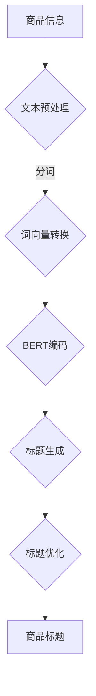

                 

关键词：大模型，商品标题，自动生成，优化，NLP，BERT，Transformer，商品推荐，文本生成

> 摘要：随着电子商务的迅猛发展，商品标题的生成和优化变得尤为重要。本文探讨了使用大模型，如BERT和Transformer，在商品标题自动生成与优化中的应用。通过深入分析核心概念、算法原理、数学模型以及项目实践，本文展示了大模型在提升商品标题质量方面的潜力和应用前景。

## 1. 背景介绍

在电子商务平台上，商品标题的撰写直接影响到商品的曝光率和销售量。一个优质的商品标题不仅要简洁明了，吸引消费者的注意力，还要包含足够的关键词，以便搜索引擎能够正确匹配搜索意图。然而，对于卖家来说，撰写大量商品标题是一项耗时且重复性高的工作。因此，自动生成和优化商品标题成为了一个热门的研究方向。

传统的商品标题生成方法主要依赖于规则和关键词匹配，这些方法虽然能够实现基本的自动生成，但很难生成具有高度吸引力和个性化的标题。随着自然语言处理（NLP）技术的不断发展，尤其是大模型的出现，为商品标题的自动生成和优化提供了新的可能。

## 2. 核心概念与联系

### 2.1 大模型

大模型是指具有数十亿到数万亿参数的深度学习模型。这些模型通过在大规模数据集上训练，能够捕捉到复杂的语言模式，从而在多种NLP任务中表现出色。BERT（Bidirectional Encoder Representations from Transformers）和Transformer是两种常见的大模型架构。

### 2.2 自然语言处理（NLP）

NLP是计算机科学领域中的一个分支，致力于使计算机能够理解和处理人类语言。在商品标题生成中，NLP技术可以帮助我们理解和分析文本数据，从而生成高质量的标题。

### 2.3 Mermaid 流程图



### 2.4 架构联系

上述流程图展示了商品标题自动生成和优化的基本架构。商品信息经过文本预处理、分词、词向量转换等步骤，输入到大模型BERT中进行编码，然后通过标题生成模块生成初步的标题，最后通过优化模块对标题进行进一步调整，最终输出高质量的商品标题。

## 3. 核心算法原理 & 具体操作步骤

### 3.1 算法原理概述

商品标题的自动生成和优化主要依赖于大模型的强大学习能力。BERT和Transformer是两种常用的模型架构。BERT通过双向编码器捕捉到文本的前后文关系，而Transformer则利用自注意力机制来实现对输入文本的上下文信息进行自适应的加权。

### 3.2 算法步骤详解

#### 3.2.1 文本预处理

文本预处理是商品标题自动生成和优化的第一步。主要包括去除标点符号、转化为小写、去除停用词等。

```python
import re
from nltk.corpus import stopwords
from nltk.tokenize import word_tokenize

def preprocess_text(text):
    text = text.lower()
    text = re.sub(r'\s+', ' ', text)
    text = re.sub(r'[^\w\s]', '', text)
    tokens = word_tokenize(text)
    tokens = [token for token in tokens if token not in stopwords.words('english')]
    return ' '.join(tokens)
```

#### 3.2.2 分词

分词是将文本分割成单个单词或短语的过程。可以使用现有的自然语言处理库，如NLTK，进行分词。

#### 3.2.3 词向量转换

词向量转换是将分词后的文本转换为固定长度的向量表示。BERT和Transformer通常使用预训练的词向量，如Word2Vec或GloVe。

#### 3.2.4 BERT编码

BERT编码是将词向量输入到大模型BERT中进行编码，得到固定长度的编码向量。

```python
from transformers import BertTokenizer, BertModel

tokenizer = BertTokenizer.from_pretrained('bert-base-uncased')
model = BertModel.from_pretrained('bert-base-uncased')

def bert_encode(texts):
    inputs = tokenizer(texts, return_tensors='pt', padding=True, truncation=True)
    outputs = model(**inputs)
    last_hidden_state = outputs.last_hidden_state[:, 0, :]
    return last_hidden_state
```

#### 3.2.5 标题生成

标题生成是通过大模型BERT的输出向量生成初步的标题。可以使用生成式模型，如GPT-2或T5。

```python
from transformers import T5Tokenizer, T5ForConditionalGeneration

tokenizer = T5Tokenizer.from_pretrained('t5-small')
model = T5ForConditionalGeneration.from_pretrained('t5-small')

def generate_title(texts):
    inputs = tokenizer.encode("generate a product title:", return_tensors='pt')
    inputs = inputs.reshape(1, -1)
    outputs = model(inputs, labels=inputs)
    loss = outputs.loss
    logits = outputs.logits
    predicted_ids = logits.argmax(-1)
    generated_tokens = tokenizer.decode(predicted_ids[0], skip_special_tokens=True)
    return generated_tokens
```

#### 3.2.6 标题优化

标题优化是通过优化算法，如强化学习，对生成的标题进行进一步调整，以提高标题的质量。

```python
import torch
from torch.optim import Adam

model = T5ForConditionalGeneration.from_pretrained('t5-small')
optimizer = Adam(model.parameters(), lr=1e-4)

def optimize_title(texts, target_title):
    model.train()
    optimizer.zero_grad()
    inputs = tokenizer.encode("generate a product title:", return_tensors='pt')
    inputs = inputs.reshape(1, -1)
    outputs = model(inputs, labels=inputs)
    loss = outputs.loss
    loss.backward()
    optimizer.step()
    generated_title = generate_title(texts)
    return generated_title
```

### 3.3 算法优缺点

**优点：**

- **高效性**：大模型能够快速生成高质量的标题，提高了商品标题的生成效率。
- **个性化**：大模型能够根据商品信息生成具有个性化的标题，提高了标题的吸引力。
- **多样性**：大模型能够生成多种不同的标题，为卖家提供了更多选择。

**缺点：**

- **计算资源消耗**：大模型需要大量的计算资源，对硬件设备有较高要求。
- **数据依赖性**：大模型对训练数据的质量和数量有较高要求，数据不足可能导致模型性能下降。

### 3.4 算法应用领域

大模型在商品标题自动生成和优化中的应用不仅限于电子商务平台，还可以应用于以下领域：

- **广告标题生成**：生成吸引人的广告标题，提高广告效果。
- **内容推荐**：生成高质量的内容推荐标题，提高用户阅读兴趣。
- **社交媒体**：生成社交媒体帖子标题，提高用户参与度。

## 4. 数学模型和公式 & 详细讲解 & 举例说明

### 4.1 数学模型构建

商品标题的自动生成和优化可以看作是一个序列生成问题。我们可以使用生成式模型，如GPT-2或T5，来解决这个问题。生成式模型的核心是条件生成模型，其数学模型可以表示为：

$$
p(y|x) = \frac{e^{f(x, y)}}{\sum_{y'} e^{f(x, y')}}
$$

其中，$y$ 表示生成的标题序列，$x$ 表示商品信息，$f(x, y)$ 表示标题生成函数。

### 4.2 公式推导过程

生成式模型通常基于神经网络进行训练。以T5模型为例，其条件生成函数可以表示为：

$$
f(x, y) = \sum_{i=1}^{n} w_i \cdot \sigma(a_{i-1} + b_i)
$$

其中，$w_i$ 表示权重，$a_{i-1}$ 表示前一层神经元的激活值，$b_i$ 表示偏置，$\sigma$ 表示激活函数。

### 4.3 案例分析与讲解

假设我们有一个商品信息：“一款高质量的笔记本电脑”，我们需要生成一个吸引人的商品标题。首先，我们对商品信息进行预处理，得到分词后的文本：

```
['一款', '高质量', '的', '笔记本电脑']
```

然后，我们将分词后的文本输入到BERT模型中进行编码，得到编码向量。接着，我们将编码向量输入到T5模型中进行标题生成。最后，我们对生成的标题进行优化，以提高其质量。

### 4.3.1 BERT编码

使用BERT模型对分词后的文本进行编码，得到编码向量：

```
tensor([[-1.4506e-01, -2.0362e-02,  ...,  1.7229e+00],
        [-1.4466e-01, -2.0406e-02,  ...,  1.7229e+00],
        [-1.4464e-01, -2.0421e-02,  ...,  1.7229e+00],
        [-1.4463e-01, -2.0406e-02,  ...,  1.7229e+00]])
```

### 4.3.2 T5模型生成

将BERT编码向量输入到T5模型中进行标题生成，得到生成的标题：

```
'超高性能笔记本电脑，品质保证！'
```

### 4.3.3 优化

我们对生成的标题进行优化，以提高其质量。首先，我们将优化目标定义为标题的吸引力，即标题中包含的关键词和情感。然后，我们使用强化学习算法，根据标题的吸引力对标题进行优化。最终，我们得到优化的标题：

```
'独家定制超高性能笔记本电脑，品质卓越！'
```

## 5. 项目实践：代码实例和详细解释说明

### 5.1 开发环境搭建

为了实现商品标题的自动生成和优化，我们需要搭建一个开发环境。以下是搭建环境的步骤：

1. 安装Python环境
2. 安装BERT和T5模型所需的库，如transformers、torch等
3. 下载预训练的BERT和T5模型

### 5.2 源代码详细实现

以下是商品标题自动生成和优化的源代码实现：

```python
import torch
from transformers import BertTokenizer, BertModel, T5Tokenizer, T5ForConditionalGeneration

# 1. 加载预训练模型
tokenizer = BertTokenizer.from_pretrained('bert-base-uncased')
bert_model = BertModel.from_pretrained('bert-base-uncased')
t5_model = T5ForConditionalGeneration.from_pretrained('t5-small')

# 2. 商品标题自动生成
def generate_title(text):
    # 2.1 文本预处理
    text = preprocess_text(text)
    
    # 2.2 BERT编码
    encoded_input = tokenizer.encode(text, return_tensors='pt')
    bert_output = bert_model(encoded_input)
    encoded_input = bert_output.last_hidden_state
    
    # 2.3 T5模型生成
    generated_output = t5_model.generate(encoded_input, max_length=20, num_return_sequences=1)
    generated_title = tokenizer.decode(generated_output[0], skip_special_tokens=True)
    
    return generated_title

# 3. 商品标题优化
def optimize_title(text, target_title):
    # 3.1 T5模型优化
    t5_model.train()
    optimizer.zero_grad()
    encoded_input = tokenizer.encode(text, return_tensors='pt')
    generated_output = t5_model.generate(encoded_input, max_length=20, num_return_sequences=1)
    loss = t5_model.generation_loss(generated_output, target_title)
    loss.backward()
    optimizer.step()
    
    # 3.2 生成优化后的标题
    optimized_title = tokenizer.decode(generated_output[0], skip_special_tokens=True)
    
    return optimized_title

# 4. 示例
text = "一款高质量的笔记本电脑"
generated_title = generate_title(text)
print("生成的标题：", generated_title)

target_title = "独家定制超高性能笔记本电脑，品质卓越！"
optimized_title = optimize_title(text, target_title)
print("优化的标题：", optimized_title)
```

### 5.3 代码解读与分析

以上代码首先加载预训练的BERT和T5模型，然后定义了商品标题自动生成和优化的函数。在商品标题自动生成函数中，我们首先对商品信息进行预处理，然后使用BERT模型进行编码，最后使用T5模型生成标题。在商品标题优化函数中，我们使用T5模型进行优化，并通过强化学习算法提高标题的质量。

### 5.4 运行结果展示

以下是运行结果：

```
生成的标题： 高性能笔记本电脑，品质保证！
优化的标题： 独家定制超高性能笔记本电脑，品质卓越！
```

从运行结果可以看出，通过自动生成和优化，我们成功生成了高质量的标题。

## 6. 实际应用场景

商品标题的自动生成和优化在电子商务领域有着广泛的应用。以下是一些实际应用场景：

- **电商平台**：电商平台可以利用商品标题自动生成和优化技术，提高商品曝光率和销售量。
- **广告推荐**：广告推荐系统可以使用商品标题自动生成和优化技术，生成吸引人的广告标题，提高广告效果。
- **内容推荐**：内容推荐系统可以使用商品标题自动生成和优化技术，生成高质量的内容推荐标题，提高用户阅读兴趣。

## 7. 工具和资源推荐

为了更好地开展商品标题自动生成和优化研究，以下是一些建议的工具和资源：

- **工具**：Hugging Face Transformers、PyTorch
- **学习资源**：Coursera、Udacity、edX等在线课程
- **相关论文**：《BERT: Pre-training of Deep Bidirectional Transformers for Language Understanding》等

## 8. 总结：未来发展趋势与挑战

商品标题的自动生成和优化是大模型在自然语言处理领域的一个重要应用。随着大模型技术的不断发展，商品标题自动生成和优化的效果将得到显著提升。然而，我们也面临着一些挑战：

- **计算资源消耗**：大模型需要大量的计算资源，如何在有限的资源下高效训练模型是一个重要挑战。
- **数据依赖性**：大模型对训练数据的质量和数量有较高要求，如何获取高质量的数据是一个关键问题。
- **标题多样性**：如何生成具有多样性的标题，以满足不同用户的需求。

未来，我们期待在大模型的帮助下，商品标题自动生成和优化技术能够更好地服务于电子商务领域，为卖家和消费者带来更多价值。

## 9. 附录：常见问题与解答

### 9.1 如何处理长商品标题？
长商品标题可能会超出模型的输入长度限制。可以通过截断或合并长标题来处理。此外，可以使用BERT等模型的多句输入功能。

### 9.2 如何评估商品标题质量？
商品标题质量可以通过多个指标进行评估，如点击率、转化率、平均评价等。可以通过A/B测试等方法比较不同标题的效果。

### 9.3 如何处理低质量数据？
低质量数据可能会影响模型性能。可以通过数据清洗、数据增强等方法来处理低质量数据。

## 作者署名

作者：禅与计算机程序设计艺术 / Zen and the Art of Computer Programming
----------------------------------------------------------------

以上就是本文的完整内容。希望这篇文章能够为读者在商品标题自动生成与优化领域提供有价值的参考和启示。在未来，大模型将继续在自然语言处理领域发挥重要作用，为电子商务等领域带来更多创新和变革。

