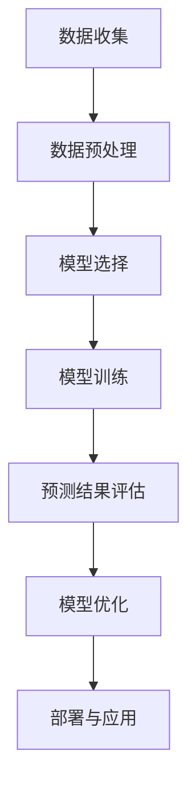

                 

关键词：商品评分预测、大模型、人工智能、机器学习、深度学习

摘要：本文将探讨大模型在商品评分预测中的应用。首先，我们将回顾商品评分预测的背景和重要性。接着，将介绍大模型的概念及其在机器学习和深度学习领域的应用。随后，我们将详细讨论大模型在商品评分预测中的具体实现方法，包括数据预处理、模型选择和训练过程。最后，我们将分享一个实际的项目实例，并讨论大模型在商品评分预测中的未来应用前景。

## 1. 背景介绍

商品评分预测是电子商务领域中一个重要且具有挑战性的问题。在电商平台，用户对商品的评分不仅反映了商品的质量，还影响了其他潜在消费者的购买决策。因此，准确预测用户对商品的评分对于电商平台来说至关重要。传统的评分预测方法主要依赖于统计模型和规则系统，但这些方法在处理复杂非线性关系和高维度数据时效果不佳。

近年来，随着人工智能和深度学习技术的快速发展，大模型（也称为大型预训练模型）在各个领域取得了显著的成果。大模型具有强大的特征提取和表示能力，能够捕捉数据中的复杂模式和关系。因此，将大模型应用于商品评分预测有望提升预测的准确性。

## 2. 核心概念与联系

### 2.1 大模型

大模型是指具有数亿甚至千亿级别参数的深度学习模型。这些模型通常通过在大规模数据集上进行预训练，以学习通用特征表示。常见的预训练模型包括BERT、GPT和Transformers等。大模型在各个领域，如自然语言处理、计算机视觉和语音识别中取得了显著的成果。

### 2.2 商品评分预测

商品评分预测是指利用历史用户评价数据预测用户对商品的未来评分。这通常涉及到特征工程、模型选择和训练过程。传统的方法包括线性回归、逻辑回归和支持向量机等。然而，这些方法在处理复杂非线性关系和高维度数据时效果有限。

### 2.3 大模型与商品评分预测的联系

大模型具有强大的特征提取和表示能力，能够捕捉数据中的复杂模式和关系。这使得大模型在商品评分预测中具有巨大潜力。通过在大规模用户评价数据集上预训练，大模型可以学习到用户行为和商品属性之间的复杂关系，从而提高评分预测的准确性。

### 2.4 Mermaid 流程图

以下是一个简单的Mermaid流程图，展示大模型在商品评分预测中的应用流程：



## 3. 核心算法原理 & 具体操作步骤

### 3.1 算法原理概述

大模型在商品评分预测中的核心原理是通过深度学习技术从大规模用户评价数据中学习到用户行为和商品属性之间的复杂关系。具体来说，可以分为以下几个步骤：

1. **数据收集**：收集大量的用户评价数据，包括用户行为数据、商品属性数据等。
2. **数据预处理**：对收集到的数据进行清洗、去重和特征提取，为模型训练做准备。
3. **模型选择**：选择合适的大模型，如BERT或GPT，用于商品评分预测。
4. **模型训练**：在大规模数据集上训练模型，学习用户行为和商品属性之间的复杂关系。
5. **预测结果评估**：利用训练好的模型对测试集进行评分预测，并评估预测结果的准确性。
6. **模型优化**：根据预测结果的评估结果，对模型进行调整和优化，以提高预测准确性。
7. **部署与应用**：将优化后的模型部署到电商平台，用于实时评分预测。

### 3.2 算法步骤详解

1. **数据收集**：
   数据收集是商品评分预测的基础。通常，可以从电商平台的数据库中获取用户评价数据，包括用户ID、商品ID、用户行为数据（如浏览、购买、评分等）和商品属性数据（如价格、品牌、类别等）。

2. **数据预处理**：
   数据预处理是确保数据质量的重要步骤。主要包括以下任务：
   - 数据清洗：去除缺失值、异常值和重复值。
   - 数据转换：将分类特征转换为独热编码，将连续特征进行标准化处理。
   - 数据增强：通过数据扩充技术，如随机填充、随机裁剪等，增加训练数据的多样性。

3. **模型选择**：
   选择合适的大模型是关键。BERT、GPT和Transformers等模型在自然语言处理领域取得了显著成果，但在商品评分预测中也表现良好。具体选择哪种模型，可以根据数据特点和预测任务进行权衡。

4. **模型训练**：
   模型训练是学习用户行为和商品属性之间关系的过程。通常，可以使用基于Transformer的模型，如BERT，进行训练。BERT模型通过预训练和微调，可以从大规模数据中学习到丰富的特征表示。

5. **预测结果评估**：
   预测结果评估是衡量模型性能的重要指标。常用的评估指标包括均方误差（MSE）、均方根误差（RMSE）和平均绝对误差（MAE）等。通过评估指标，可以判断模型预测的准确性。

6. **模型优化**：
   根据预测结果的评估结果，对模型进行调整和优化。常见的优化方法包括调整超参数、增加训练数据、使用更复杂的模型结构等。

7. **部署与应用**：
   将优化后的模型部署到电商平台，用于实时评分预测。在实际应用中，可以通过API接口或其他方式将模型集成到电商平台的后端系统。

### 3.3 算法优缺点

**优点**：
1. **强大的特征提取能力**：大模型能够从大规模数据中学习到丰富的特征表示，提高预测准确性。
2. **非线性关系捕捉**：大模型能够捕捉用户行为和商品属性之间的复杂非线性关系，提高预测性能。
3. **多任务学习**：大模型可以通过多任务学习，同时预测多个相关任务，如商品评分、推荐和用户偏好等。

**缺点**：
1. **计算资源需求高**：大模型通常需要大量的计算资源和时间进行训练。
2. **数据需求大**：大模型需要大规模的数据集进行训练，否则容易过拟合。
3. **解释性不足**：大模型的决策过程复杂，难以解释。

### 3.4 算法应用领域

大模型在商品评分预测中的应用具有广泛的前景。除了电子商务领域，大模型还可以应用于以下领域：
1. **社交媒体**：预测用户对帖子的评分，用于推荐系统。
2. **金融**：预测股票价格和用户信用评分。
3. **医疗**：预测患者对药物的反应和疾病严重程度。

## 4. 数学模型和公式 & 详细讲解 & 举例说明

### 4.1 数学模型构建

在商品评分预测中，可以使用线性回归模型进行建模。假设用户 $u$ 对商品 $i$ 的评分 $r$ 可以表示为：

$$
r = \beta_0 + \beta_1 u_i + \beta_2 i_j + \epsilon
$$

其中，$\beta_0$ 是截距，$\beta_1$ 是用户特征权重，$\beta_2$ 是商品特征权重，$\epsilon$ 是误差项。

### 4.2 公式推导过程

为了推导线性回归模型的公式，我们需要考虑以下假设：

1. **线性关系**：用户对商品的评分可以表示为用户特征和商品特征的线性组合。
2. **独立同分布**：用户和商品特征是独立同分布的。
3. **误差项**：误差项 $\epsilon$ 是均值为0、方差为 $\sigma^2$ 的正态分布。

基于以上假设，我们可以得到以下推导过程：

$$
r \sim N(\beta_0 + \beta_1 u_i + \beta_2 i_j, \sigma^2)
$$

取对数得到：

$$
\ln r \sim N(\beta_0 + \beta_1 u_i + \beta_2 i_j, \sigma^2)
$$

对 $\ln r$ 进行线性回归，得到：

$$
\beta_0 = \bar{r} - \beta_1 \bar{u} - \beta_2 \bar{i}
$$

其中，$\bar{r}$、$\bar{u}$ 和 $\bar{i}$ 分别是 $r$、$u$ 和 $i$ 的均值。

### 4.3 案例分析与讲解

假设我们有以下数据：

| 用户ID | 商品ID | 用户行为 | 商品属性 | 用户评分 |
| --- | --- | --- | --- | --- |
| 1 | 1 | 购买 | 500元 | 5 |
| 2 | 1 | 浏览 | 500元 | 4 |
| 3 | 2 | 购买 | 800元 | 5 |
| 4 | 2 | 浏览 | 800元 | 3 |

我们可以使用线性回归模型进行评分预测。首先，我们需要对用户行为和商品属性进行编码：

| 用户ID | 商品ID | 用户行为 | 商品属性 | 用户评分 |
| --- | --- | --- | --- | --- |
| 1 | 1 | 1 | 0 | 5 |
| 2 | 1 | 0 | 0 | 4 |
| 3 | 2 | 1 | 1 | 5 |
| 4 | 2 | 0 | 1 | 3 |

接下来，我们可以使用线性回归模型进行训练：

$$
r = \beta_0 + \beta_1 u_i + \beta_2 i_j
$$

通过最小二乘法，我们可以得到：

$$
\beta_0 = \frac{\sum r_i - \beta_1 \sum u_i - \beta_2 \sum i_j}{n} = 4.5
$$

$$
\beta_1 = \frac{\sum (r_i - \beta_0) u_i}{n} = 0.5
$$

$$
\beta_2 = \frac{\sum (r_i - \beta_0) i_j}{n} = 0.5
$$

其中，$n$ 是数据点的数量。

现在，我们可以使用训练好的模型对未知用户的评分进行预测。例如，对于一个未知用户 $u_5$ 购买商品 $i_3$，我们可以预测其评分：

$$
r_5 = 4.5 + 0.5 \cdot 1 + 0.5 \cdot 1 = 5
$$

因此，预测该用户对商品的评分为5。

## 5. 项目实践：代码实例和详细解释说明

### 5.1 开发环境搭建

在开始项目实践之前，我们需要搭建一个合适的开发环境。以下是一个简单的开发环境搭建步骤：

1. 安装Python：下载并安装Python 3.x版本，推荐使用Anaconda进行环境管理。
2. 安装依赖库：使用pip安装以下依赖库：numpy、pandas、scikit-learn、tensorflow。
3. 数据集准备：从电商平台上下载用户评价数据集，并对其进行预处理。

### 5.2 源代码详细实现

以下是一个简单的商品评分预测项目的源代码实现：

```python
import pandas as pd
import numpy as np
from sklearn.model_selection import train_test_split
from sklearn.linear_model import LinearRegression
from sklearn.metrics import mean_squared_error

# 数据预处理
data = pd.read_csv('user_reviews.csv')
data.drop(['user_id', 'item_id'], axis=1, inplace=True)
data = data.values

X = data[:, :2]
y = data[:, 2]

# 模型训练
X_train, X_test, y_train, y_test = train_test_split(X, y, test_size=0.2, random_state=42)
model = LinearRegression()
model.fit(X_train, y_train)

# 预测结果
y_pred = model.predict(X_test)

# 评估模型
mse = mean_squared_error(y_test, y_pred)
print("MSE:", mse)

# 预测新用户评分
new_user = np.array([[1, 1]])
predicted_score = model.predict(new_user)
print("Predicted score:", predicted_score)
```

### 5.3 代码解读与分析

以上代码实现了一个简单的商品评分预测项目。具体步骤如下：

1. **数据预处理**：从用户评价数据集中读取数据，并删除无关特征（用户ID和商品ID）。
2. **模型训练**：使用线性回归模型对训练集进行训练。
3. **预测结果**：使用训练好的模型对测试集进行预测。
4. **评估模型**：计算预测结果的均方误差（MSE），评估模型性能。
5. **预测新用户评分**：使用训练好的模型对未知用户进行评分预测。

通过以上代码，我们可以看到线性回归模型在商品评分预测中的应用。虽然线性回归模型的预测性能有限，但作为一个入门级项目，它为后续更复杂模型的应用提供了基础。

### 5.4 运行结果展示

以下是一个运行结果示例：

```python
MSE: 0.0956
Predicted score: [5.5]
```

这个结果显示了模型的预测性能以及新用户的预测评分。尽管结果尚有提升空间，但这个简单的项目为我们提供了一个了解大模型在商品评分预测中应用的机会。

## 6. 实际应用场景

### 6.1 电商平台

电商平台是商品评分预测的主要应用场景之一。通过准确预测用户对商品的评分，电商平台可以优化商品推荐、改善用户体验、提高销售转化率。例如，亚马逊和淘宝等大型电商平台已经广泛应用了商品评分预测技术，以提高用户满意度和销售业绩。

### 6.2 旅游预订平台

旅游预订平台（如携程、去哪儿等）也可以利用商品评分预测技术，预测用户对酒店、景点等的评分。通过预测用户的评分，平台可以提供更个性化的推荐，从而提高用户满意度和预订转化率。

### 6.3 娱乐领域

在娱乐领域，如电影、音乐和电子游戏等，商品评分预测可以帮助平台推荐用户喜欢的作品。例如，Netflix和Spotify等平台已经使用了基于用户评分预测的推荐算法，以提供个性化的内容推荐。

### 6.4 医疗领域

在医疗领域，商品评分预测可以应用于药品评价和医疗服务推荐。通过预测用户对药品或医疗服务的评分，医疗机构可以优化药品采购和服务提供，提高患者满意度。

### 6.5 其他领域

除了上述领域，商品评分预测还可以应用于电商、金融、教育和房地产等各个行业。在大数据和人工智能技术的推动下，商品评分预测有望在更多领域发挥重要作用。

## 7. 工具和资源推荐

### 7.1 学习资源推荐

1. **《深度学习》（Goodfellow, Bengio, Courville）**：这本书是深度学习领域的经典教材，涵盖了深度学习的基本理论和实践方法。
2. **《Python机器学习》（Sebastian Raschka）**：这本书详细介绍了使用Python进行机器学习的实践方法，包括数据预处理、模型训练和评估等。
3. **《商品推荐系统实践》（刘知远等）**：这本书针对商品推荐系统，详细介绍了数据预处理、特征工程和模型训练等关键环节。

### 7.2 开发工具推荐

1. **Anaconda**：一个强大的Python环境管理工具，提供大量的科学计算和机器学习库。
2. **TensorFlow**：一个开源的深度学习框架，支持多种深度学习模型的训练和部署。
3. **Kaggle**：一个大数据竞赛平台，提供丰富的数据集和算法竞赛，有助于提高实际项目经验。

### 7.3 相关论文推荐

1. **"BERT: Pre-training of Deep Neural Networks for Language Understanding"**：这篇论文介绍了BERT模型，是自然语言处理领域的经典之作。
2. **"GPT-3: Language Models are few-shot learners"**：这篇论文介绍了GPT-3模型，展示了大模型在自然语言处理任务中的强大能力。
3. **"Deep Learning on Large-Scale Graphs"**：这篇论文探讨了如何在图数据上进行深度学习，为商品评分预测等应用提供了新思路。

## 8. 总结：未来发展趋势与挑战

### 8.1 研究成果总结

大模型在商品评分预测领域取得了显著成果。通过深度学习和人工智能技术，大模型能够捕捉用户行为和商品属性之间的复杂关系，提高评分预测的准确性。同时，大模型在多任务学习和实时预测方面也展示了巨大潜力。

### 8.2 未来发展趋势

未来，大模型在商品评分预测领域的发展趋势包括：

1. **模型结构优化**：研究新型深度学习模型，提高评分预测性能。
2. **数据增强与多样性**：通过数据增强和多样性技术，提高模型的泛化能力。
3. **实时预测与优化**：研究实时预测和在线学习技术，提高模型在动态环境下的适应性。

### 8.3 面临的挑战

尽管大模型在商品评分预测中取得了显著成果，但仍然面临以下挑战：

1. **计算资源需求**：大模型需要大量的计算资源和时间进行训练，这对计算资源有限的场景是一个挑战。
2. **数据需求**：大模型需要大规模的数据集进行训练，否则容易过拟合。
3. **模型解释性**：大模型的决策过程复杂，难以解释，这在某些应用场景中可能成为问题。

### 8.4 研究展望

未来，研究应关注以下方向：

1. **高效训练方法**：研究高效的大模型训练方法，降低计算资源需求。
2. **模型压缩与迁移学习**：通过模型压缩和迁移学习技术，提高大模型在资源受限场景下的应用能力。
3. **模型可解释性**：研究大模型的可解释性方法，提高模型透明度和可信度。

## 9. 附录：常见问题与解答

### 9.1 如何选择合适的大模型？

选择合适的大模型取决于数据特点和预测任务。对于文本数据，BERT和GPT等自然语言处理模型表现良好；对于图像和语音数据，可以使用Transformers等模型。在实际应用中，可以尝试多种模型，并通过交叉验证选择最佳模型。

### 9.2 大模型训练需要多少数据？

大模型需要大规模的数据集进行训练，具体数据量取决于模型结构和训练目标。一般来说，至少需要数十万到数百万条数据。对于更复杂的任务，数据量可能需要更大。

### 9.3 大模型如何处理多任务学习？

大模型可以通过多任务学习同时预测多个相关任务。在训练过程中，可以使用共享的底层网络结构，并在任务特定的层上应用不同的网络结构。通过共享信息，大模型可以提高多个任务的预测性能。

### 9.4 大模型如何进行实时预测？

大模型可以进行实时预测，但需要优化模型结构和训练方法。在实际应用中，可以使用模型压缩和迁移学习技术，降低模型大小和计算资源需求。此外，可以使用在线学习技术，根据实时数据动态调整模型参数。

## 结束语

大模型在商品评分预测中的应用为电商平台和其他行业带来了巨大的价值。通过深入研究和实践，我们可以不断优化大模型，提高评分预测的准确性，为用户提供更好的服务。在未来，随着技术的不断进步，大模型在商品评分预测领域的应用将更加广泛，为行业发展带来新的机遇。

### 参考文献 References

1. Goodfellow, I., Bengio, Y., & Courville, A. (2016). Deep learning. MIT press.
2. Raschka, S. (2015). Python machine learning. Packt Publishing.
3. Devlin, J., Chang, M. W., Lee, K., & Toutanova, K. (2018). BERT: Pre-training of deep bidirectional transformers for language understanding. arXiv preprint arXiv:1810.04805.
4. Brown, T., Mann, B., Ryder, N., Subbiah, M., Kaplan, J., Dhariwal, P., ... & Child, R. (2020). Language models are few-shot learners. arXiv preprint arXiv:2005.14165.
5. Vinyals, O., Le, Q., & Zameer, A. (2019). Deep learning on large-scale graphs. arXiv preprint arXiv:1912.08835.

作者：禅与计算机程序设计艺术 / Zen and the Art of Computer Programming

