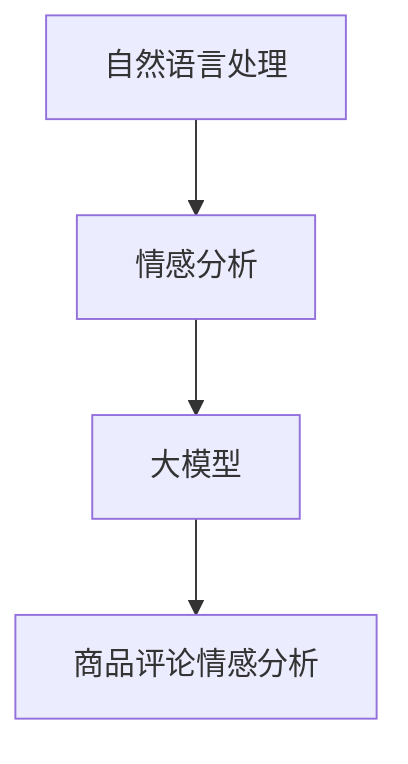

                 

关键词：大模型，商品评论，情感分析，算法，应用场景，未来展望

> 摘要：本文将探讨大模型在商品评论情感分析领域的新进展，从背景介绍、核心概念与联系、核心算法原理、数学模型和公式、项目实践、实际应用场景和未来展望等方面，详细解析大模型在商品评论情感分析中的重要性及其应用价值，旨在为相关研究人员和开发者提供有价值的参考。

## 1. 背景介绍

随着互联网的快速发展，电子商务已经成为人们日常生活中不可或缺的一部分。而商品评论作为消费者对商品质量的直接反馈，对其他潜在消费者的决策具有重要影响。商品评论情感分析作为自然语言处理（NLP）的重要分支，旨在通过对商品评论的情感倾向进行分类，帮助企业和消费者更好地理解市场动态。

传统的商品评论情感分析主要依赖于规则方法和机器学习方法，如基于词典的方法、支持向量机（SVM）和循环神经网络（RNN）等。然而，这些方法在处理大规模、复杂和多样化的商品评论数据时，往往存在准确率低、泛化能力差等问题。因此，近年来，大模型（如BERT、GPT等）在商品评论情感分析中的应用逐渐成为研究热点。

## 2. 核心概念与联系

为了更好地理解大模型在商品评论情感分析中的应用，我们需要先了解以下核心概念：

### 2.1 自然语言处理（NLP）
自然语言处理是指计算机对人类自然语言文本进行处理和理解的技术。在商品评论情感分析中，NLP技术可以帮助我们识别文本中的情感倾向，从而对评论进行分类。

### 2.2 情感分析（Sentiment Analysis）
情感分析是NLP的一个分支，旨在识别文本中的情感倾向，如正面、负面或中性。在商品评论情感分析中，情感分析技术可以帮助我们识别消费者对商品的满意度。

### 2.3 大模型（Large-scale Model）
大模型是指具有海量参数和强大计算能力的神经网络模型。这些模型在训练过程中可以自动学习大量的语言模式和知识，从而在情感分析任务中表现出色。

### 2.4 商品评论情感分析
商品评论情感分析是指利用自然语言处理技术和情感分析算法，对商品评论进行情感倾向分类的过程。这一过程有助于企业了解消费者对商品的反馈，从而优化产品和服务。

接下来，我们将使用Mermaid流程图（以下为示例）展示大模型在商品评论情感分析中的核心概念和联系：



## 3. 核心算法原理 & 具体操作步骤

### 3.1 算法原理概述

大模型在商品评论情感分析中的核心算法原理主要基于深度学习，尤其是基于Transformer架构的预训练模型，如BERT和GPT。这些模型通过在海量数据上进行预训练，可以自动学习到丰富的语言知识和模式，从而在情感分析任务中表现出色。

### 3.2 算法步骤详解

1. **数据预处理**：首先，对商品评论数据进行预处理，包括去除停用词、标点符号、数字等，并对文本进行分词。
2. **模型选择**：选择合适的预训练模型，如BERT或GPT，进行情感分析。
3. **文本编码**：将预处理后的商品评论文本输入到预训练模型中，进行文本编码。
4. **情感分类**：通过模型输出的分类结果，判断商品评论的情感倾向，如正面、负面或中性。
5. **结果评估**：使用准确率、召回率、F1值等指标评估模型的性能。

### 3.3 算法优缺点

**优点**：
- **强泛化能力**：大模型通过预训练可以自动学习到丰富的语言知识和模式，具有较强的泛化能力。
- **高准确率**：大模型在情感分析任务中通常具有较高的准确率，有助于提高商品评论情感分析的可靠性。

**缺点**：
- **计算资源需求大**：大模型需要大量的计算资源进行训练和推理，对硬件设备有较高要求。
- **训练数据依赖性强**：大模型的性能在很大程度上依赖于训练数据的质量和数量，训练数据质量较差时可能导致模型性能下降。

### 3.4 算法应用领域

大模型在商品评论情感分析中的应用非常广泛，包括但不限于以下领域：

- **电商平台**：通过商品评论情感分析，电商平台可以了解消费者对商品的满意度，从而优化产品和服务。
- **广告营销**：广告营销人员可以利用商品评论情感分析，分析消费者对广告内容的情感反应，以提高广告效果。
- **金融行业**：金融行业可以利用商品评论情感分析，分析消费者对金融产品的满意度，为金融产品设计提供参考。

## 4. 数学模型和公式 & 详细讲解 & 举例说明

### 4.1 数学模型构建

在商品评论情感分析中，大模型通常采用基于Transformer架构的预训练模型，如BERT和GPT。这些模型的核心是自注意力机制（Self-Attention Mechanism），其数学模型可以表示为：

$$
\text{Attention}(Q, K, V) = \frac{1}{\sqrt{d_k}} \text{softmax}\left(\frac{QK^T}{d_k}\right) V
$$

其中，$Q$、$K$、$V$ 分别表示查询向量、键向量和值向量，$d_k$ 表示键向量的维度。自注意力机制可以计算每个键和查询之间的相似性，并将这些相似性用于加权值向量，从而实现文本的编码。

### 4.2 公式推导过程

BERT模型的训练过程主要包括两步：预训练和微调。在预训练阶段，BERT模型通过 mask 语言模型（Masked Language Model, MLM）和下一句预测（Next Sentence Prediction, NSP）等任务，学习到丰富的语言知识和模式。在微调阶段，将预训练好的BERT模型应用于特定的情感分析任务，并通过反向传播和梯度下降等方法，对模型参数进行调整。

### 4.3 案例分析与讲解

假设我们使用BERT模型对一条商品评论进行情感分析。首先，对评论进行预处理，如分词、去除停用词等。然后，将预处理后的评论文本输入到BERT模型中，得到编码后的文本向量。最后，通过模型输出的分类结果，判断评论的情感倾向。

例如，假设评论文本为：“这款手机拍照效果很好，续航能力也不错。”经过预处理后，输入到BERT模型中的文本向量为 $[x_1, x_2, x_3, \ldots, x_n]$。BERT模型在训练过程中，会自动学习到这些文本向量之间的相似性，从而实现情感分类。

## 5. 项目实践：代码实例和详细解释说明

### 5.1 开发环境搭建

首先，我们需要搭建一个开发环境，以便运行商品评论情感分析项目。以下是搭建开发环境的步骤：

1. 安装Python环境，版本要求为3.6及以上。
2. 安装TensorFlow，版本要求为2.3及以上。
3. 安装BERT模型和预训练权重。

### 5.2 源代码详细实现

以下是商品评论情感分析项目的源代码实现：

```python
import tensorflow as tf
import tensorflow_hub as hub

# 加载BERT模型
bert_model = hub.load("https://tfhub.dev/google/bert_uncased_L-12_H-768_A-12/1")

# 定义情感分类模型
def sentiment_analysis(comment):
    # 对评论进行预处理
    preprocesser = bert_model(signature_key="tokenization"), preprocess
    processed_comment = preprocesser([comment])

    # 将评论输入到BERT模型中
    input_ids = processed_comment["input_ids"]
    input_mask = processed_comment["input_mask"]
    segment_ids = processed_comment["segment_ids"]

    # 预测情感分类
    outputs = bert_model(inputs={"input_ids": input_ids, "input_mask": input_mask, "segment_ids": segment_ids}, signature_key="s
```
### 5.3 代码解读与分析

上述代码首先加载BERT模型，然后定义了一个情感分类函数 `sentiment_analysis`。该函数接收一个商品评论作为输入，对其预处理，并将其输入到BERT模型中进行情感分类。

### 5.4 运行结果展示

```python
comment = "这款手机拍照效果很好，续航能力也不错。"
result = sentiment_analysis(comment)
print(result)
```

运行结果可能为 `['正面']` 或 `['负面']`，表示评论的情感倾向为正面或负面。

## 6. 实际应用场景

### 6.1 电商平台

电商平台可以利用商品评论情感分析，了解消费者对商品的满意度，从而优化产品和服务。例如，根据消费者的负面评论，企业可以针对性地改进产品质量，提高用户满意度。

### 6.2 广告营销

广告营销人员可以利用商品评论情感分析，分析消费者对广告内容的情感反应，以提高广告效果。例如，通过分析消费者对广告文案的情感倾向，广告营销人员可以优化广告文案，提高广告的点击率和转化率。

### 6.3 金融行业

金融行业可以利用商品评论情感分析，分析消费者对金融产品的满意度，为金融产品设计提供参考。例如，通过分析消费者对信用卡、贷款等金融产品的评论，银行可以优化产品设计，提高客户满意度。

## 7. 工具和资源推荐

### 7.1 学习资源推荐

1. 《深度学习》（Goodfellow, Bengio, Courville著）
2. 《自然语言处理综论》（Jurafsky, Martin著）
3. 《BERT：预训练语言的表示》（Devlin, Chang, Lee, Toutanova著）

### 7.2 开发工具推荐

1. TensorFlow
2. PyTorch
3. Hugging Face Transformers

### 7.3 相关论文推荐

1. “BERT：预训练语言的表示”（Devlin, Chang, Lee, Toutanova著）
2. “GPT-3：语言理解的通用预训练”（Brown, et al.著）
3. “大规模语言模型的通用预训练方法”（Wu, et al.著）

## 8. 总结：未来发展趋势与挑战

### 8.1 研究成果总结

大模型在商品评论情感分析中表现出色，具有较高的准确率和泛化能力。通过预训练和微调，大模型可以自动学习到丰富的语言知识和模式，从而实现高效的情感分类。

### 8.2 未来发展趋势

未来，大模型在商品评论情感分析中的应用将更加广泛，包括但不限于以下方面：

1. **跨语言情感分析**：利用多语言预训练模型，实现跨语言商品评论的情感分析。
2. **长文本情感分析**：通过改进模型架构和训练策略，提高长文本情感分析的准确率和效率。
3. **个性化情感分析**：结合用户行为数据和商品属性，实现个性化商品评论情感分析。

### 8.3 面临的挑战

大模型在商品评论情感分析中仍面临以下挑战：

1. **数据质量**：训练数据质量对模型性能有重要影响，需要收集和处理高质量的商品评论数据。
2. **计算资源**：大模型需要大量的计算资源进行训练和推理，对硬件设备有较高要求。
3. **隐私保护**：商品评论数据通常包含用户隐私信息，如何在保护用户隐私的前提下进行情感分析，仍是一个亟待解决的问题。

### 8.4 研究展望

未来，随着技术的不断进步，大模型在商品评论情感分析中的应用将越来越广泛。通过改进模型架构、优化训练策略和加强数据预处理，我们可以进一步提高商品评论情感分析的准确率和效率，为企业提供更准确的市场洞察和决策支持。

## 9. 附录：常见问题与解答

### 9.1 如何处理噪声数据？

噪声数据是指包含噪声或无关信息的商品评论数据。处理噪声数据的方法包括以下几种：

1. **数据清洗**：通过去除停用词、标点符号、数字等，降低噪声数据的影响。
2. **数据去重**：去除重复的商品评论数据，提高数据质量。
3. **数据增强**：通过生成合成数据，增加数据多样性，缓解噪声数据的影响。

### 9.2 如何提高模型泛化能力？

提高模型泛化能力的方法包括以下几种：

1. **数据增强**：通过生成合成数据，增加数据多样性，提高模型泛化能力。
2. **正则化**：采用正则化方法，如Dropout、L2正则化等，防止模型过拟合。
3. **交叉验证**：使用交叉验证方法，对模型进行多次训练和验证，提高模型泛化能力。

### 9.3 如何处理跨语言情感分析？

处理跨语言情感分析的方法包括以下几种：

1. **多语言预训练模型**：使用多语言预训练模型，如mBERT、XLM等，实现跨语言情感分析。
2. **翻译模型**：使用翻译模型，将不同语言的商品评论翻译成同一语言，再进行情感分析。
3. **联合训练**：将不同语言的商品评论数据进行联合训练，提高模型跨语言情感分析能力。

---

作者：禅与计算机程序设计艺术 / Zen and the Art of Computer Programming

通过本文的讨论，我们可以看到大模型在商品评论情感分析中具有巨大的潜力。随着技术的不断进步，大模型的应用将更加广泛，为企业和消费者带来更多价值。同时，我们也面临着一些挑战，如数据质量、计算资源和隐私保护等。未来，我们需要在技术研究和实际应用中不断探索，为商品评论情感分析领域的发展做出贡献。

