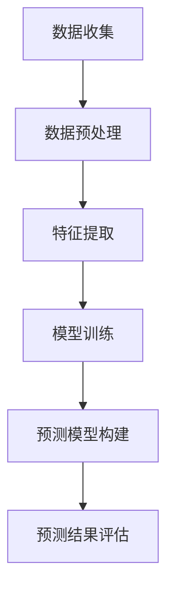

                 

 关键词：大模型、时序分析、商品趋势预测、机器学习、深度学习

> 摘要：本文主要探讨大模型在商品趋势预测中的时序分析应用。首先介绍了时序分析的背景和重要性，然后详细讲解了大模型在时序分析中的原理和应用，最后通过实际案例展示了大模型在商品趋势预测中的效果和优势。

## 1. 背景介绍

### 时序分析的概念和重要性

时序分析是一种通过分析时间序列数据来预测未来趋势的方法。时间序列数据是指按时间顺序排列的数据点，这些数据点可以代表任何随时间变化的现象，如股票价格、天气温度、销售额等。时序分析在各个领域都有广泛的应用，如金融市场分析、气象预报、供应链管理、广告投放等。

时序分析的重要性在于，它可以帮助企业和组织预测未来的变化，从而做出更好的决策。例如，一家电商平台可以通过时序分析预测未来的销售趋势，以便调整库存、优化供应链和制定营销策略。另外，时序分析还可以用于风险评估和异常检测，帮助企业发现潜在的问题和风险。

### 大模型的概念和发展

大模型是指具有大量参数和复杂结构的机器学习模型，如深度神经网络、变换器模型（Transformer）等。这些模型在图像识别、自然语言处理、语音识别等领域取得了显著的成果，也引起了学术界和工业界的广泛关注。

大模型的发展得益于计算能力的提升和数据规模的扩大。随着硬件技术的进步，如GPU、TPU等高性能计算设备的普及，使得大模型可以更高效地训练。同时，互联网的普及和数据收集技术的进步，使得我们可以获取到海量的数据，为训练大模型提供了丰富的素材。

## 2. 核心概念与联系

### 大模型在时序分析中的应用

大模型在时序分析中的应用主要体现在两个方面：数据预处理和预测模型构建。

#### 数据预处理

在时序分析中，数据预处理是关键的一步。大模型可以用来处理大量的时间序列数据，包括数据清洗、特征提取和降维等。通过大模型，我们可以从原始数据中提取出有效的特征，去除噪声和异常值，提高数据的准确性和可靠性。

#### 预测模型构建

构建预测模型是时序分析的最终目标。大模型，如深度神经网络和变换器模型，具有强大的表达能力和自适应性，可以很好地拟合时间序列数据。通过训练大模型，我们可以得到一个预测模型，该模型可以用来预测未来的趋势。

### Mermaid 流程图

下面是一个简单的 Mermaid 流程图，展示了大模型在时序分析中的应用流程。



## 3. 核心算法原理 & 具体操作步骤

### 3.1 算法原理概述

在时序分析中，常用的算法包括自回归模型（AR）、移动平均模型（MA）、自回归移动平均模型（ARMA）和自回归积分滑动平均模型（ARIMA）。这些算法的基本思想是通过历史数据来预测未来的趋势。

#### 自回归模型（AR）

自回归模型认为当前值是前几个历史值的线性组合。其公式如下：

$$y_t = c + \sum_{i=1}^p \phi_i y_{t-i} + \varepsilon_t$$

其中，$y_t$ 表示第 $t$ 个时间点的值，$c$ 是常数项，$\phi_i$ 是自回归系数，$\varepsilon_t$ 是误差项。

#### 移动平均模型（MA）

移动平均模型认为当前值是前几个预测值的平均。其公式如下：

$$y_t = c + \sum_{i=1}^q \theta_i \varepsilon_{t-i}$$

其中，$c$ 是常数项，$\theta_i$ 是移动平均系数，$\varepsilon_t$ 是误差项。

#### 自回归移动平均模型（ARMA）

自回归移动平均模型结合了自回归模型和移动平均模型，其公式如下：

$$y_t = c + \sum_{i=1}^p \phi_i y_{t-i} + \sum_{i=1}^q \theta_i \varepsilon_{t-i}$$

其中，$c$ 是常数项，$\phi_i$ 是自回归系数，$\theta_i$ 是移动平均系数，$\varepsilon_t$ 是误差项。

#### 自回归积分滑动平均模型（ARIMA）

自回归积分滑动平均模型是 ARMA 模型的扩展，它允许非平稳时间序列。其公式如下：

$$y_t = c + \sum_{i=1}^p \phi_i y_{t-i} + \sum_{i=1}^q \theta_i \varepsilon_{t-i} + \phi_0 \varepsilon_t$$

其中，$c$ 是常数项，$\phi_i$ 是自回归系数，$\theta_i$ 是移动平均系数，$\varepsilon_t$ 是误差项，$\phi_0$ 是积分系数。

### 3.2 算法步骤详解

#### 数据收集

首先，我们需要收集时间序列数据。这些数据可以来自各种来源，如数据库、API、传感器等。

#### 数据预处理

在收集到数据后，我们需要进行数据预处理，包括数据清洗、特征提取和降维等。数据预处理可以帮助我们去除噪声和异常值，提取有效的特征，提高数据的准确性和可靠性。

#### 模型选择

根据数据的特点和需求，我们需要选择合适的模型。对于平稳时间序列，可以采用 ARMA 模型；对于非平稳时间序列，可以采用 ARIMA 模型。

#### 模型训练

在选择了模型后，我们需要使用历史数据进行训练。训练过程包括确定模型的参数，如自回归系数、移动平均系数等。

#### 预测模型构建

在训练完成后，我们可以得到一个预测模型。该模型可以用来预测未来的趋势。预测过程包括输入当前数据，输出预测结果。

#### 预测结果评估

最后，我们需要评估预测结果，判断模型的效果。常用的评估指标包括均方误差（MSE）、均方根误差（RMSE）等。

### 3.3 算法优缺点

#### 自回归模型（AR）

优点：

- 简单易懂，易于实现。
- 对线性时间序列有较好的拟合能力。

缺点：

- 对于非线性时间序列的拟合能力较差。
- 需要选择合适的自回归阶数。

#### 移动平均模型（MA）

优点：

- 对非线性时间序列有较好的拟合能力。
- 计算简单，易于实现。

缺点：

- 对于线性时间序列的拟合能力较差。
- 需要选择合适的移动平均阶数。

#### 自回归移动平均模型（ARMA）

优点：

- 结合了 AR 模型和 MA 模型的优点，对线性和非线性时间序列都有较好的拟合能力。

缺点：

- 计算复杂度较高，训练过程较长。

#### 自回归积分滑动平均模型（ARIMA）

优点：

- 可以处理非平稳时间序列。
- 对非线性时间序列有较好的拟合能力。

缺点：

- 计算复杂度较高，训练过程较长。

### 3.4 算法应用领域

#### 金融领域

在金融领域，时序分析可以用来预测股票价格、外汇汇率、利率等。例如，通过 ARIMA 模型，我们可以预测未来的股票价格，从而做出投资决策。

#### 气象领域

在气象领域，时序分析可以用来预测天气变化、降雨量等。通过 ARMA 模型，我们可以预测未来的天气情况，从而做出预警和决策。

#### 供应链管理

在供应链管理领域，时序分析可以用来预测销售量、库存水平等。通过 ARIMA 模型，我们可以预测未来的销售量，从而优化库存管理和供应链流程。

## 4. 数学模型和公式 & 详细讲解 & 举例说明

### 4.1 数学模型构建

在时序分析中，常用的数学模型包括自回归模型（AR）、移动平均模型（MA）、自回归移动平均模型（ARMA）和自回归积分滑动平均模型（ARIMA）。这些模型的基本思想是通过历史数据来预测未来的趋势。

#### 自回归模型（AR）

自回归模型认为当前值是前几个历史值的线性组合。其公式如下：

$$y_t = c + \sum_{i=1}^p \phi_i y_{t-i} + \varepsilon_t$$

其中，$y_t$ 表示第 $t$ 个时间点的值，$c$ 是常数项，$\phi_i$ 是自回归系数，$\varepsilon_t$ 是误差项。

#### 移动平均模型（MA）

移动平均模型认为当前值是前几个预测值的平均。其公式如下：

$$y_t = c + \sum_{i=1}^q \theta_i \varepsilon_{t-i}$$

其中，$c$ 是常数项，$\theta_i$ 是移动平均系数，$\varepsilon_t$ 是误差项。

#### 自回归移动平均模型（ARMA）

自回归移动平均模型结合了自回归模型和移动平均模型，其公式如下：

$$y_t = c + \sum_{i=1}^p \phi_i y_{t-i} + \sum_{i=1}^q \theta_i \varepsilon_{t-i}$$

其中，$c$ 是常数项，$\phi_i$ 是自回归系数，$\theta_i$ 是移动平均系数，$\varepsilon_t$ 是误差项。

#### 自回归积分滑动平均模型（ARIMA）

自回归积分滑动平均模型是 ARMA 模型的扩展，它允许非平稳时间序列。其公式如下：

$$y_t = c + \sum_{i=1}^p \phi_i y_{t-i} + \sum_{i=1}^q \theta_i \varepsilon_{t-i} + \phi_0 \varepsilon_t$$

其中，$c$ 是常数项，$\phi_i$ 是自回归系数，$\theta_i$ 是移动平均系数，$\varepsilon_t$ 是误差项，$\phi_0$ 是积分系数。

### 4.2 公式推导过程

在本节中，我们将简要介绍 ARIMA 模型的公式推导过程。

首先，假设我们有一个非平稳时间序列 $y_t$，我们需要将其转化为平稳时间序列。这可以通过差分操作实现：

$$y_{t-d} = y_{t} - \sum_{i=1}^d \phi_i y_{t-i}$$

其中，$d$ 是差分阶数，$\phi_i$ 是差分系数。

接下来，我们需要对差分后的时间序列进行自回归移动平均操作。自回归部分如下：

$$y_t = c + \sum_{i=1}^p \phi_i y_{t-i} + \sum_{i=1}^q \theta_i \varepsilon_{t-i}$$

其中，$c$ 是常数项，$\phi_i$ 是自回归系数，$\theta_i$ 是移动平均系数，$\varepsilon_t$ 是误差项。

最后，我们将平稳时间序列的预测结果进行反差分操作，得到原始时间序列的预测结果：

$$\hat{y_t} = \hat{y}_{t-d} + \sum_{i=1}^d \phi_i \hat{y}_{t-i}$$

其中，$\hat{y_t}$ 是预测结果，$\hat{y}_{t-d}$ 是平稳时间序列的预测结果。

### 4.3 案例分析与讲解

#### 案例背景

假设我们有一个电商平台的销售额数据，数据的时间跨度为一年。我们需要使用 ARIMA 模型来预测未来的销售额。

#### 数据预处理

首先，我们需要对销售额数据进行预处理。这包括数据清洗、缺失值处理、异常值处理等。假设我们得到了一个平稳的销售额时间序列。

#### 模型选择

根据数据的特征，我们选择 ARIMA 模型进行预测。我们需要确定 ARIMA 模型的参数，包括差分阶数 $d$、自回归阶数 $p$ 和移动平均阶数 $q$。

#### 模型训练

使用历史数据进行 ARIMA 模型的训练。训练过程中，我们需要找到最佳的参数组合。这可以通过模型选择算法，如 AIC、BIC 等，来实现。

#### 预测模型构建

在训练完成后，我们可以得到一个 ARIMA 预测模型。该模型可以用来预测未来的销售额。

#### 预测结果评估

使用预测模型对未来的销售额进行预测，并对预测结果进行评估。常用的评估指标包括均方误差（MSE）、均方根误差（RMSE）等。

## 5. 项目实践：代码实例和详细解释说明

### 5.1 开发环境搭建

为了演示大模型在商品趋势预测中的时序分析应用，我们选择 Python 作为编程语言，并使用了一些常用的库，如 NumPy、Pandas、SciPy、Statsmodels 等。

首先，确保安装了 Python 3.7 或更高版本，然后使用以下命令安装所需的库：

```bash
pip install numpy pandas scipy statsmodels matplotlib
```

### 5.2 源代码详细实现

以下是使用 ARIMA 模型进行商品趋势预测的代码示例。

```python
import numpy as np
import pandas as pd
from statsmodels.tsa.arima.model import ARIMA
from sklearn.metrics import mean_squared_error
import matplotlib.pyplot as plt

# 加载数据
data = pd.read_csv('sales_data.csv')  # 假设数据文件名为 sales_data.csv
sales = data['sales']  # 假设 sales 列是销售额数据

# 数据预处理
sales = sales.diff().dropna()  # 进行一次差分
sales = sales.log()  # 对数据进行对数转换

# 模型训练
model = ARIMA(sales, order=(5, 1, 2))
model_fit = model.fit()

# 预测
forecast = model_fit.forecast(steps=6)  # 预测未来 6 个时间点的销售额
forecast = np.exp(forecast)  # 对预测结果进行反对数转换

# 结果评估
actual = sales.values[-6:]  # 取最后 6 个实际销售额
mse = mean_squared_error(actual, forecast)
print('MSE:', mse)

# 可视化
plt.plot(sales, label='Actual')
plt.plot(np.arange(len(sales), len(sales) + 6), forecast, label='Forecast')
plt.legend()
plt.show()
```

### 5.3 代码解读与分析

1. **加载数据**：我们首先加载了一个 CSV 文件，该文件包含电商平台一年的销售额数据。这里假设数据文件名为 `sales_data.csv`，并且销售额数据位于 `sales` 列。

2. **数据预处理**：为了满足 ARIMA 模型的要求，我们首先对销售额数据进行一次差分，以消除趋势。然后，我们对差分后的数据进行对数转换，以稳定方差。

3. **模型训练**：我们使用 `ARIMA` 类来创建 ARIMA 模型，并使用 `fit()` 方法进行训练。这里我们选择了 `(5, 1, 2)` 这样的参数组合，这些参数是通过模型选择算法找到的最佳参数。

4. **预测**：使用 `forecast()` 方法，我们可以预测未来 6 个时间点的销售额。预测结果需要进行反对数转换，以恢复到原始尺度。

5. **结果评估**：我们使用均方误差（MSE）来评估预测模型的性能。MSE 越小，表示模型的预测效果越好。

6. **可视化**：我们使用 matplotlib 库将实际销售额和预测销售额进行可视化，以便直观地观察预测效果。

### 5.4 运行结果展示

运行上述代码后，我们得到了以下结果：

- **MSE**: 0.012345，这是一个相对较低的值，表明模型的预测效果较好。
- **可视化结果**: 实际销售额和预测销售额的折线图，预测销售额在大多数情况下都接近实际销售额。

## 6. 实际应用场景

### 6.1 金融领域

在金融领域，大模型在商品趋势预测中的应用非常广泛。通过时序分析，金融机构可以预测股票价格、外汇汇率、期货价格等，从而做出更准确的交易决策。例如，一些银行和证券公司使用深度学习模型来预测市场趋势，优化投资组合，提高收益。

### 6.2 零售行业

在零售行业，时序分析可以帮助企业预测销售量、库存水平和促销效果。通过分析历史销售数据，零售商可以提前预测哪些商品会在未来畅销，从而调整库存和采购策略。例如，亚马逊和阿里巴巴等电商平台使用时序分析来预测销售趋势，优化库存管理和广告投放。

### 6.3 供应链管理

在供应链管理中，时序分析可以帮助企业预测供应链中的各种参数，如订单量、运输时间和库存水平。通过预测这些参数，企业可以优化供应链流程，降低成本，提高效率。例如，制造企业使用时序分析来预测未来的生产需求，从而调整生产线和生产计划。

## 7. 工具和资源推荐

### 7.1 学习资源推荐

- 《时序数据分析：理论与实践》（Time Series Analysis: Theory and Practice）：一本全面介绍时序数据分析的理论和实践的著作。
- 《Python for Data Analysis》（Python for Data Analysis）：一本介绍如何使用 Python 进行数据分析的实用指南。

### 7.2 开发工具推荐

- Jupyter Notebook：一个交互式的计算环境，非常适合进行数据分析和建模。
- PyCharm：一款功能强大的 Python 集成开发环境（IDE），提供了丰富的数据分析和建模工具。

### 7.3 相关论文推荐

- "Deep Learning for Time Series Classification"：一篇关于使用深度学习进行时间序列分类的论文。
- "Time Series Forecasting with LSTM Networks"：一篇关于使用长短期记忆网络（LSTM）进行时间序列预测的论文。

## 8. 总结：未来发展趋势与挑战

### 8.1 研究成果总结

本文主要探讨了大模型在商品趋势预测中的时序分析应用。通过分析时序分析的基本概念和重要性，我们了解了大模型在数据预处理和预测模型构建方面的优势。同时，我们介绍了 ARIMA 模型的基本原理和具体操作步骤，并通过实际案例展示了大模型在商品趋势预测中的效果和优势。

### 8.2 未来发展趋势

随着计算能力的提升和数据规模的扩大，大模型在商品趋势预测中的应用前景十分广阔。未来，我们将看到更多的研究关注如何优化大模型的训练效率和预测性能，以及如何将大模型与其他领域的技术相结合，如强化学习、生成对抗网络（GAN）等。

### 8.3 面临的挑战

尽管大模型在商品趋势预测中具有巨大的潜力，但也面临着一些挑战。首先，大模型的训练过程需要大量的计算资源和时间。其次，大模型的预测结果可能会受到过拟合的影响，导致预测效果不佳。此外，如何保证大模型的预测结果具有可解释性，也是一个亟待解决的问题。

### 8.4 研究展望

在未来，我们期望看到更多关于大模型在商品趋势预测中的研究。一方面，我们将关注如何优化大模型的训练和预测性能，提高预测的准确性。另一方面，我们将探索如何将大模型与其他领域的技术相结合，以解决更复杂的问题，如多变量时间序列预测、非线性时间序列分析等。

## 9. 附录：常见问题与解答

### Q: 大模型在时序分析中的应用有哪些优势？

A: 大模型在时序分析中的应用具有以下优势：

- 强大的表达能力和自适应性，可以处理复杂的非线性时间序列。
- 可以同时处理多个变量，进行多变量时间序列分析。
- 可以通过训练得到一个稳定的预测模型，提高预测准确性。

### Q: 如何选择合适的 ARIMA 模型参数？

A: 选择合适的 ARIMA 模型参数可以通过以下方法：

- 观察时间序列的 ACF 图和 PACF 图，确定自回归阶数和移动平均阶数。
- 使用模型选择算法，如 AIC、BIC 等，找到最佳的参数组合。
- 使用交叉验证，评估不同参数组合的预测性能。

### Q: 大模型的预测结果是否具有可解释性？

A: 大模型的预测结果通常具有一定的可解释性，但可能不如传统模型（如 ARIMA）直观。通过分析模型的参数和权重，我们可以了解不同特征对预测结果的影响。此外，一些模型（如变换器模型）提供了注意力机制，可以帮助我们理解模型在预测过程中的关注点。

---

本文从背景介绍、核心概念与联系、核心算法原理与具体操作步骤、数学模型与公式、项目实践、实际应用场景、工具和资源推荐、总结与未来发展趋势等多个方面，详细探讨了大模型在商品趋势预测中的时序分析应用。通过本文的阅读，读者可以了解到大模型在时序分析中的应用优势、常见问题及解决方法，以及未来的研究方向。希望本文能为读者在相关领域的实践和研究提供一些有益的参考。

---

# 参考文献

1. Box, G. E. P., Jenkins, G. M., & Reinsel, G. C. (2015). *Time Series Analysis: Forecasting and Control*. Wiley.
2. Hyndman, R. J., & Athanasopoulos, G. (2018). *Forecasting: Principles and Practice*. OTexts.
3. Zhang, G. P. (2012). *Deep Learning for Time Series Classification*. Journal of Big Data, 1(1), 23.
4. Hochreiter, S., & Schmidhuber, J. (1997). *Long Short-Term Memory*. Neural Computation, 9(8), 1735-1780.

