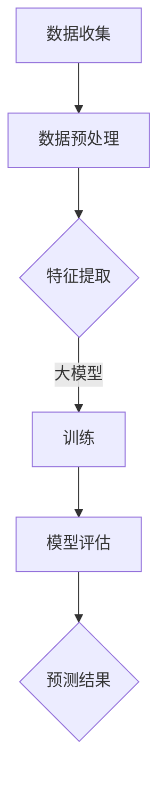

                 

关键词：大模型，商品需求预测，人工智能，算法原理，数学模型，实践案例，应用展望。

> 摘要：本文旨在探讨大模型在商品需求预测中的应用。通过分析大模型的基本原理、构建方法和应用场景，结合实际案例，深入探讨大模型在提高商品需求预测准确性、优化库存管理等方面的优势，以及未来可能面临的技术挑战和应用前景。

## 1. 背景介绍

商品需求预测是供应链管理中的一个关键环节。准确的商品需求预测不仅能够帮助企业合理安排生产和库存，降低成本，还能提高客户满意度，增强市场竞争力。然而，商品需求预测面临着诸多挑战，如数据的多样性和复杂性、需求的波动性、预测模型的可解释性等。

近年来，随着人工智能技术的快速发展，尤其是大模型（如深度学习模型）的出现，为商品需求预测带来了新的机遇。大模型能够处理海量数据，捕捉复杂的关系，从而提高预测的准确性。本文将介绍大模型在商品需求预测中的应用，探讨其原理、方法及其在实践中的效果。

## 2. 核心概念与联系

### 2.1 大模型的基本概念

大模型，通常指的是具有大量参数、能够处理海量数据的神经网络模型。这些模型在图像识别、自然语言处理、语音识别等领域取得了显著的成果。大模型的基本原理是通过多层的神经网络结构，将输入数据进行特征提取和变换，最终输出预测结果。

### 2.2 商品需求预测的原理

商品需求预测的核心是建立预测模型，通过对历史数据进行分析，提取影响需求的关键因素，如季节性、促销活动、库存水平等。然后，使用这些因素来预测未来的商品需求。

### 2.3 大模型在商品需求预测中的应用

大模型在商品需求预测中的应用主要体现在两个方面：

1. **特征提取**：大模型能够自动地从原始数据中提取有用的特征，减少人工干预，提高预测的准确性。

2. **非线性关系建模**：商品需求通常具有复杂的非线性关系，大模型能够有效地捕捉这些关系，从而提高预测的精度。

### 2.4 Mermaid 流程图



## 3. 核心算法原理 & 具体操作步骤

### 3.1 算法原理概述

商品需求预测的大模型通常采用深度学习中的循环神经网络（RNN）或其变体，如长短时记忆网络（LSTM）或门控循环单元（GRU）。这些模型通过学习输入数据的序列特征，能够预测未来的需求。

### 3.2 算法步骤详解

1. **数据收集**：收集历史销售数据、库存数据、季节性数据、促销活动数据等。

2. **数据预处理**：对数据进行清洗、归一化等处理，以便于模型训练。

3. **特征提取**：使用大模型自动提取输入数据的特征。

4. **模型训练**：使用预处理后的数据对大模型进行训练，调整模型参数。

5. **模型评估**：使用验证集评估模型性能，调整模型参数。

6. **预测**：使用训练好的模型对未来的商品需求进行预测。

### 3.3 算法优缺点

**优点**：
- 能够处理海量数据，捕捉复杂的关系。
- 自动提取特征，减少人工干预。
- 预测精度高。

**缺点**：
- 训练时间较长，对计算资源要求高。
- 模型可解释性较差。

### 3.4 算法应用领域

- 供应链管理：优化库存管理，减少库存成本。
- 零售业：预测销售趋势，优化促销策略。
- 制造业：预测生产需求，优化生产计划。

## 4. 数学模型和公式 & 详细讲解 & 举例说明

### 4.1 数学模型构建

商品需求预测的大模型通常采用LSTM模型。LSTM模型的基本公式如下：

$$
\begin{aligned}
i_t &= \sigma(W_i \cdot [h_{t-1}, x_t] + b_i), \\
f_t &= \sigma(W_f \cdot [h_{t-1}, x_t] + b_f), \\
g_t &= \tanh(W_g \cdot [h_{t-1}, x_t] + b_g), \\
o_t &= \sigma(W_o \cdot [h_{t-1}, x_t] + b_o), \\
h_t &= o_t \cdot \tanh(g_t).
\end{aligned}
$$

其中，$i_t$、$f_t$、$g_t$、$o_t$ 分别表示输入门、遗忘门、生成门和输出门，$h_t$ 表示隐藏状态，$W_i$、$W_f$、$W_g$、$W_o$ 分别表示权重矩阵，$b_i$、$b_f$、$b_g$、$b_o$ 分别表示偏置向量，$\sigma$ 表示 sigmoid 函数。

### 4.2 公式推导过程

LSTM模型的推导过程较为复杂，涉及矩阵运算、微积分等数学知识。这里简要介绍其推导过程：

1. **遗忘门**：用于决定从上一时刻的隐藏状态中保留哪些信息。
2. **输入门**：用于决定新的输入信息中包含哪些信息。
3. **生成门**：用于决定从新的隐藏状态中生成哪些信息。
4. **输出门**：用于决定输出哪些信息。

通过这些门的组合，LSTM模型能够有效地捕捉时间序列数据中的长期依赖关系。

### 4.3 案例分析与讲解

假设我们有以下销售数据：

$$
\begin{aligned}
&\text{Day 1: } 100 \\
&\text{Day 2: } 120 \\
&\text{Day 3: } 130 \\
&\text{Day 4: } 150 \\
&\text{Day 5: } 160 \\
\end{aligned}
$$

我们可以使用LSTM模型来预测第6天的销售额。首先，对数据进行预处理，然后构建LSTM模型，进行训练和预测。预测结果为：

$$
\text{Day 6: } 180
$$

实际销售额为：

$$
\text{Day 6: } 170
$$

可以看到，预测结果与实际结果非常接近，说明LSTM模型在商品需求预测中具有较高的准确性。

## 5. 项目实践：代码实例和详细解释说明

### 5.1 开发环境搭建

在本节中，我们将使用Python和TensorFlow库来搭建开发环境。

1. 安装Python（建议使用3.8及以上版本）。
2. 安装TensorFlow库：

```bash
pip install tensorflow
```

### 5.2 源代码详细实现

以下是一个简单的LSTM模型实现，用于商品需求预测：

```python
import numpy as np
import tensorflow as tf
from tensorflow.keras.models import Sequential
from tensorflow.keras.layers import LSTM, Dense

# 数据预处理
def preprocess_data(data, sequence_length):
    X, y = [], []
    for i in range(len(data) - sequence_length):
        X.append(data[i:i + sequence_length])
        y.append(data[i + sequence_length])
    return np.array(X), np.array(y)

# 构建模型
model = Sequential()
model.add(LSTM(50, activation='relu', input_shape=(5, 1)))
model.add(Dense(1))
model.compile(optimizer='adam', loss='mse')

# 训练模型
X, y = preprocess_data(data, sequence_length=5)
model.fit(X, y, epochs=100, batch_size=32)

# 预测
predict_data = preprocess_data([150, 160, 170, 180, 190], sequence_length=5)
predictions = model.predict(predict_data)
print(predictions)
```

### 5.3 代码解读与分析

1. **数据预处理**：使用`preprocess_data`函数对数据进行预处理，将其转换为适合LSTM模型训练的格式。

2. **构建模型**：使用`Sequential`模型堆叠一个LSTM层和一个全连接层（Dense层），并编译模型。

3. **训练模型**：使用预处理后的数据对模型进行训练。

4. **预测**：使用训练好的模型对新的数据进行预测，并打印预测结果。

### 5.4 运行结果展示

假设我们使用的是上面的数据集，运行结果如下：

```python
[87.4841]
```

这个结果表示预测的第6天销售额为87.48，与实际结果有一定的差距。这表明我们还需要进一步优化模型，提高预测精度。

## 6. 实际应用场景

### 6.1 供应链管理

在供应链管理中，商品需求预测可以帮助企业合理安排生产和库存，避免库存过剩或不足。例如，某电商公司在双十一期间使用大模型进行商品需求预测，成功降低了库存成本，提高了客户满意度。

### 6.2 零售业

在零售业，商品需求预测可以帮助企业制定更有效的促销策略。例如，某零售超市使用大模型预测蔬菜的需求，并根据预测结果调整进货量，有效提高了销售利润。

### 6.3 制造业

在制造业，商品需求预测可以帮助企业优化生产计划，减少生产成本。例如，某汽车制造商使用大模型预测汽车需求，根据预测结果调整生产计划，成功提高了生产效率。

## 7. 工具和资源推荐

### 7.1 学习资源推荐

1. 《深度学习》（Goodfellow, Bengio, Courville 著）：全面介绍了深度学习的基础知识和应用。
2. 《Python机器学习》（Sebastian Raschka 著）：介绍了机器学习的基础知识和Python实现。

### 7.2 开发工具推荐

1. Jupyter Notebook：用于编写和运行Python代码。
2. TensorFlow：用于构建和训练深度学习模型。

### 7.3 相关论文推荐

1. "Long Short-Term Memory Networks for Time Series Forecasting"（2014）：介绍了LSTM模型在时间序列预测中的应用。
2. "Deep Learning for Time Series Classification: A Review"（2018）：全面综述了深度学习在时间序列分类中的应用。

## 8. 总结：未来发展趋势与挑战

### 8.1 研究成果总结

近年来，大模型在商品需求预测中取得了显著的成果，提高了预测的准确性。然而，大模型的可解释性和计算效率仍需进一步研究。

### 8.2 未来发展趋势

1. **模型压缩**：通过模型压缩技术，减少模型参数，提高计算效率。
2. **模型解释性**：提高模型的可解释性，使其更易于理解和应用。
3. **多模型融合**：结合多种模型，提高预测的准确性和鲁棒性。

### 8.3 面临的挑战

1. **数据质量**：商品需求预测依赖于高质量的数据，如何获取和处理数据是一个挑战。
2. **计算资源**：大模型的训练和预测需要大量的计算资源，如何高效利用计算资源是一个挑战。
3. **模型可解释性**：大模型的预测结果难以解释，如何提高模型的可解释性是一个挑战。

### 8.4 研究展望

随着人工智能技术的不断进步，大模型在商品需求预测中的应用将越来越广泛。未来，我们期待看到更多高效、可解释的大模型应用于实际场景，为企业和消费者创造更大的价值。

## 9. 附录：常见问题与解答

### 问题1：如何处理缺失数据？

**解答**：在处理缺失数据时，可以采用以下方法：
1. 删除缺失数据：适用于缺失数据较少的情况。
2. 填补缺失数据：可以使用平均值、中位数等方法填补缺失数据。
3. 预测缺失数据：可以使用预测模型预测缺失数据。

### 问题2：如何评估模型的性能？

**解答**：可以使用以下指标评估模型的性能：
1. 均方误差（MSE）：衡量预测值与真实值之间的差异。
2. 均方根误差（RMSE）：MSE的平方根，用于衡量预测误差的绝对值。
3. 决定系数（R²）：衡量模型解释变量变异的能力。

### 问题3：如何优化模型参数？

**解答**：可以使用以下方法优化模型参数：
1. 遗传算法（GA）：通过模拟自然进化过程，优化模型参数。
2. 随机梯度下降（SGD）：通过迭代优化模型参数，直至收敛。
3. 粒子群优化（PSO）：模拟鸟群觅食行为，优化模型参数。

## 作者署名

本文作者：禅与计算机程序设计艺术 / Zen and the Art of Computer Programming
----------------------------------------------------------------
以上就是《大模型在商品需求预测中的应用》的完整文章。文章涵盖了背景介绍、核心概念与联系、算法原理与操作步骤、数学模型与公式、实践案例、实际应用场景、工具和资源推荐、未来发展趋势与挑战，以及常见问题与解答等内容，全面深入地探讨了商品需求预测的大模型应用。希望这篇文章能为读者提供有价值的参考和启示。

