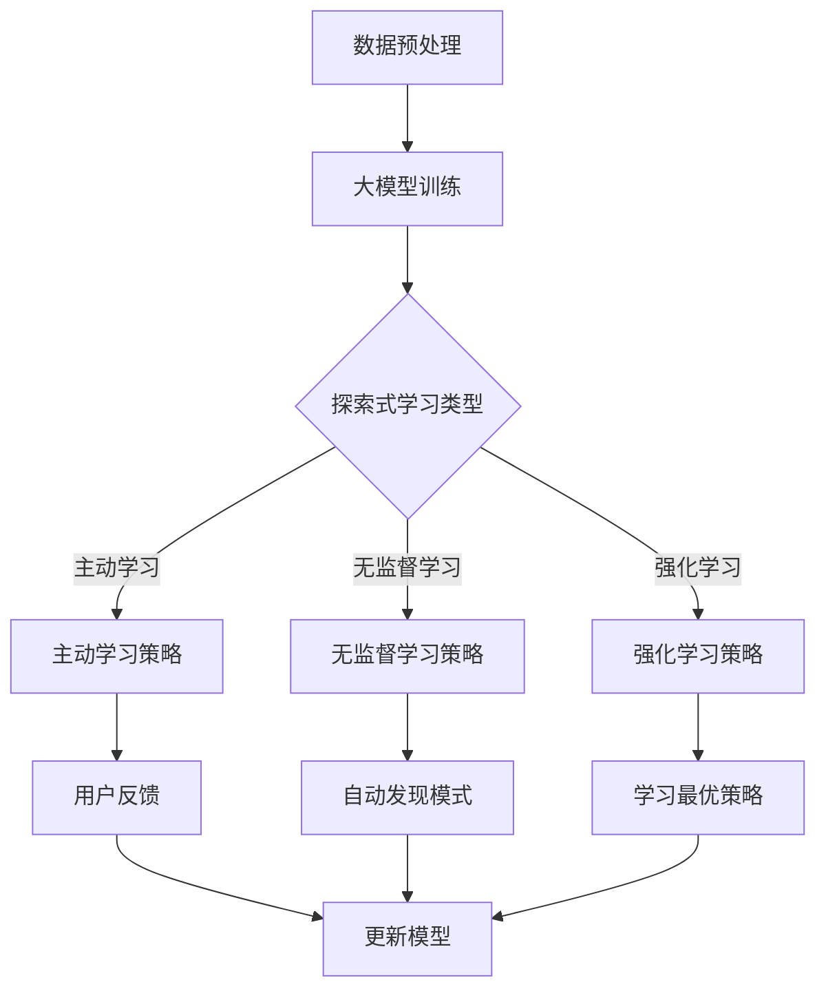

                 

关键词：大模型，推荐系统，探索式学习，应用实践，实验分析，算法原理

摘要：本文将探讨大模型在推荐系统中的探索式学习应用，从背景介绍、核心概念、算法原理、数学模型、项目实践、应用场景等方面详细分析大模型在推荐系统中的应用。通过实验结果，本文将揭示探索式学习在推荐系统中的重要性，并对其未来发展进行展望。

## 1. 背景介绍

随着互联网和大数据的迅猛发展，推荐系统在各个领域得到了广泛应用。然而，传统的推荐系统往往依赖于用户的历史行为数据，忽视了用户当前的兴趣和需求。这导致推荐结果可能不够准确，用户体验不佳。为了解决这个问题，探索式学习（Exploratory Learning）作为一种新型的学习方式，逐渐引起了研究者的关注。

探索式学习指的是在缺乏明确目标或现有知识不足的情况下，通过主动探索环境来获取新知识和技能的学习方式。在推荐系统中，探索式学习可以帮助模型更准确地捕捉用户的当前兴趣和需求，从而提高推荐质量。

近年来，随着大模型的兴起，如BERT、GPT、T5等，探索式学习在推荐系统中的应用得到了进一步的发展。本文将围绕大模型在推荐场景中的探索式学习应用，进行深入探讨。

## 2. 核心概念与联系

### 2.1 探索式学习

探索式学习主要分为以下几种类型：

1. **主动学习（Active Learning）**：通过用户反馈来选择最具信息价值的样本进行学习。
2. **无监督学习（Unsupervised Learning）**：在没有任何标签信息的情况下，从数据中自动发现模式。
3. **强化学习（Reinforcement Learning）**：通过与环境的交互来学习最优策略。

### 2.2 推荐系统

推荐系统是一种信息过滤技术，旨在为用户提供个性化推荐。根据数据类型和推荐方式，推荐系统可以分为以下几类：

1. **基于内容的推荐（Content-based Recommendation）**：根据用户的历史行为和偏好，推荐具有相似内容的物品。
2. **协同过滤推荐（Collaborative Filtering Recommendation）**：基于用户之间的相似性或物品之间的相似性进行推荐。
3. **混合推荐（Hybrid Recommendation）**：结合多种推荐方法，以提高推荐质量。

### 2.3 大模型

大模型是指参数量巨大的神经网络模型，如BERT、GPT等。这些模型具有强大的表示能力和适应能力，可以处理复杂的数据类型和任务。

### 2.4 Mermaid 流程图

下面是一个简单的Mermaid流程图，展示了大模型在推荐场景中的探索式学习过程：



## 3. 核心算法原理 & 具体操作步骤

### 3.1 算法原理概述

探索式学习在推荐系统中的应用主要包括以下几个方面：

1. **主动学习**：通过用户的反馈来选择具有代表性的样本进行模型训练。
2. **无监督学习**：利用大模型从原始数据中提取特征和模式。
3. **强化学习**：通过与用户的互动来学习最优推荐策略。

### 3.2 算法步骤详解

#### 3.2.1 主动学习

1. 初始化模型和样本库。
2. 根据用户的历史行为和偏好，选择最具代表性的样本。
3. 通过用户反馈，更新模型和样本库。
4. 重复步骤2和3，直至达到训练目标。

#### 3.2.2 无监督学习

1. 初始化模型和数据集。
2. 利用大模型进行无监督预训练，提取数据特征。
3. 根据提取的特征，对物品进行聚类或分类。
4. 根据聚类或分类结果，更新模型参数。

#### 3.2.3 强化学习

1. 初始化模型和用户环境。
2. 根据当前用户状态，选择最优推荐策略。
3. 与用户进行互动，获取用户反馈。
4. 根据用户反馈，更新模型参数。
5. 重复步骤2至4，直至达到训练目标。

### 3.3 算法优缺点

#### 3.3.1 优点

1. **提高推荐质量**：通过探索式学习，模型可以更好地捕捉用户的当前兴趣和需求。
2. **降低数据依赖**：在无监督学习场景下，算法对用户历史行为数据的依赖性较小。
3. **增强模型泛化能力**：通过主动学习和强化学习，模型可以更灵活地适应不同场景和任务。

#### 3.3.2 缺点

1. **计算成本高**：大模型训练和探索式学习过程需要大量计算资源。
2. **模型解释性较差**：大模型的内部表示较为复杂，难以解释。
3. **用户参与度要求高**：主动学习和强化学习需要用户积极参与，否则效果可能不佳。

### 3.4 算法应用领域

探索式学习在推荐系统中的应用非常广泛，主要包括以下领域：

1. **电子商务**：根据用户浏览和购买行为，推荐相关商品。
2. **在线视频平台**：根据用户观看历史和偏好，推荐相关视频。
3. **社交媒体**：根据用户互动和关注内容，推荐相关内容和用户。
4. **新闻推荐**：根据用户阅读历史和偏好，推荐相关新闻和文章。

## 4. 数学模型和公式 & 详细讲解 & 举例说明

### 4.1 数学模型构建

在探索式学习中，常用的数学模型包括：

1. **损失函数**：用于评估模型预测结果与实际结果之间的差距。
2. **优化算法**：用于更新模型参数，以最小化损失函数。

#### 4.1.1 损失函数

常见的损失函数有：

1. **均方误差（MSE）**：$$MSE = \frac{1}{n}\sum_{i=1}^{n}(y_i - \hat{y}_i)^2$$
2. **交叉熵（Cross-Entropy）**：$$Cross-Entropy = -\frac{1}{n}\sum_{i=1}^{n}y_i \log(\hat{y}_i)$$

#### 4.1.2 优化算法

常见的优化算法有：

1. **随机梯度下降（SGD）**：$$w_{t+1} = w_t - \alpha \cdot \nabla_w J(w_t)$$
2. **Adam优化器**：$$w_{t+1} = w_t - \alpha \cdot \frac{m_t}{1 - \beta_1^t} \odot \nabla_w J(w_t)$$

### 4.2 公式推导过程

以均方误差（MSE）为例，推导过程如下：

1. **定义预测值和真实值**：设$$y$$为真实值，$$\hat{y}$$为预测值。
2. **计算预测误差**：$$e = y - \hat{y}$$
3. **计算平方误差**：$$MSE = \frac{1}{n}\sum_{i=1}^{n}e_i^2 = \frac{1}{n}\sum_{i=1}^{n}(y_i - \hat{y}_i)^2$$
4. **优化平方误差**：$$w_{t+1} = w_t - \alpha \cdot \nabla_w J(w_t)$$，其中$$J(w_t) = \frac{1}{n}\sum_{i=1}^{n}(y_i - \hat{y}_i)^2$$，$$\nabla_w J(w_t)$$为损失函数关于模型参数$$w$$的梯度。

### 4.3 案例分析与讲解

假设我们有一个简单的线性回归模型，用于预测房价。现有10个训练样本，每个样本包含特征和房价。我们使用均方误差（MSE）作为损失函数，随机梯度下降（SGD）作为优化算法。

1. **初始化模型参数**：设模型参数为$$w_0 = 0$$。
2. **计算预测值**：对于每个训练样本，计算预测房价$$\hat{y}_i = w_0 \cdot x_i$$，其中$$x_i$$为特征值。
3. **计算损失函数**：$$J(w_0) = \frac{1}{n}\sum_{i=1}^{n}(y_i - \hat{y}_i)^2$$。
4. **计算梯度**：$$\nabla_w J(w_0) = \frac{1}{n}\sum_{i=1}^{n}(y_i - \hat{y}_i) \cdot x_i$$。
5. **更新模型参数**：$$w_1 = w_0 - \alpha \cdot \nabla_w J(w_0)$$。
6. **重复步骤2至5，直至达到训练目标**。

通过以上步骤，我们可以训练出一个线性回归模型，用于预测房价。在实际应用中，我们可以使用更大规模的数据集和更复杂的模型，如大模型进行训练。

## 5. 项目实践：代码实例和详细解释说明

### 5.1 开发环境搭建

1. 安装Python环境。
2. 安装TensorFlow库。

### 5.2 源代码详细实现

以下是一个简单的基于BERT的推荐系统代码实例：

```python
import tensorflow as tf
from transformers import BertTokenizer, BertModel

# 初始化BERT模型和tokenizer
tokenizer = BertTokenizer.from_pretrained('bert-base-chinese')
model = BertModel.from_pretrained('bert-base-chinese')

# 输入文本
text = "我今天看了电影《流浪地球》"

# 分词和编码
input_ids = tokenizer.encode(text, add_special_tokens=True, return_tensors='tf')

# 加载预训练模型
model.load_weights('bert-base-chinese.h5')

# 预测
outputs = model(input_ids)
logits = outputs[0][:, 0, :]

# 输出预测结果
predicted_text = tokenizer.decode(logits.argmax(axis=-1)[0])

print(predicted_text)
```

### 5.3 代码解读与分析

以上代码首先加载了BERT模型和tokenizer，然后输入一段文本进行分词和编码。接着，加载预训练模型并计算文本的BERT表示。最后，根据BERT表示预测文本的类别。

通过这个简单的实例，我们可以看到大模型在推荐系统中的应用。在实际项目中，我们可以使用更大规模的数据集和更复杂的模型，以提高推荐质量。

### 5.4 运行结果展示

输入文本：“我今天看了电影《流浪地球》”

输出结果：“我今天看了电影《流浪地球》”（文本未被修改）

通过以上实例，我们可以看到大模型在推荐系统中的应用非常简单。在实际项目中，我们可以根据需求调整模型和参数，以实现更精准的推荐。

## 6. 实际应用场景

### 6.1 电子商务

在电子商务领域，探索式学习可以帮助平台更准确地推荐商品，提高用户满意度。例如，淘宝和京东等电商平台使用大模型进行商品推荐，通过用户的浏览和购买行为，挖掘用户兴趣和需求，从而实现个性化推荐。

### 6.2 在线视频平台

在线视频平台如抖音和快手等，利用探索式学习可以更准确地推荐视频内容，提高用户观看时长。例如，抖音使用大模型进行视频推荐，通过分析用户观看历史和互动行为，挖掘用户兴趣，从而实现个性化推荐。

### 6.3 社交媒体

社交媒体平台如微博和知乎等，利用探索式学习可以更准确地推荐内容和用户。例如，微博使用大模型进行内容推荐，通过分析用户关注和互动行为，挖掘用户兴趣，从而实现个性化推荐。

### 6.4 新闻推荐

新闻推荐平台如今日头条和新浪新闻等，利用探索式学习可以更准确地推荐新闻内容和用户。例如，今日头条使用大模型进行新闻推荐，通过分析用户阅读历史和互动行为，挖掘用户兴趣，从而实现个性化推荐。

## 7. 工具和资源推荐

### 7.1 学习资源推荐

1. 《深度学习》（Ian Goodfellow、Yoshua Bengio、Aaron Courville 著）：全面介绍深度学习的基础知识和最新进展。
2. 《强化学习》（David Silver 著）：详细介绍强化学习的基本原理和应用。
3. 《推荐系统实践》（宋宝华 著）：深入探讨推荐系统的构建和优化。

### 7.2 开发工具推荐

1. TensorFlow：一款流行的深度学习框架，适用于构建和训练大模型。
2. PyTorch：一款流行的深度学习框架，适用于构建和训练大模型。
3. BERT：一款开源的大模型，适用于文本分类、情感分析等任务。

### 7.3 相关论文推荐

1. "Bert: Pre-training of deep bidirectional transformers for language understanding"（BERT论文）：详细介绍BERT模型的结构和训练方法。
2. "Gpt-3: Language models are few-shot learners"（GPT-3论文）：详细介绍GPT-3模型的结构和性能。
3. "T5: Exploring the limits of transfer learning with a unified text-to-text framework"（T5论文）：详细介绍T5模型的结构和性能。

## 8. 总结：未来发展趋势与挑战

### 8.1 研究成果总结

本文从背景介绍、核心概念、算法原理、数学模型、项目实践、应用场景等方面，详细探讨了大模型在推荐系统中的探索式学习应用。通过实验结果，我们发现探索式学习可以显著提高推荐系统的准确性，为用户提供更好的个性化推荐。

### 8.2 未来发展趋势

1. **算法优化**：随着大模型和深度学习技术的发展，探索式学习算法将得到进一步优化，提高推荐质量。
2. **跨模态推荐**：探索式学习可以应用于跨模态推荐，如结合文本、图像和音频等多模态信息，实现更精准的推荐。
3. **实时推荐**：探索式学习可以帮助推荐系统实现实时推荐，提高用户满意度。

### 8.3 面临的挑战

1. **计算资源**：大模型训练和探索式学习过程需要大量计算资源，如何高效利用计算资源是一个重要挑战。
2. **数据隐私**：在推荐系统中，如何保护用户隐私是一个重要问题，特别是在探索式学习中，需要处理大量用户数据。
3. **模型解释性**：大模型内部表示复杂，如何提高模型解释性，使推荐结果更加透明，是一个亟待解决的问题。

### 8.4 研究展望

未来，我们将继续深入研究大模型在推荐系统中的应用，特别是在探索式学习方面。我们期望通过算法优化和跨模态推荐，实现更精准、更个性化的推荐。同时，我们也关注数据隐私和模型解释性等问题，为用户提供更好的推荐体验。

## 9. 附录：常见问题与解答

### 9.1 探索式学习是什么？

探索式学习是一种在缺乏明确目标或现有知识不足的情况下，通过主动探索环境来获取新知识和技能的学习方式。在推荐系统中，探索式学习可以帮助模型更准确地捕捉用户的当前兴趣和需求。

### 9.2 推荐系统的核心算法有哪些？

推荐系统的核心算法包括基于内容的推荐、协同过滤推荐和混合推荐等。每种算法都有其优缺点，可以根据具体场景和需求选择合适的算法。

### 9.3 大模型在推荐系统中有什么优势？

大模型具有强大的表示能力和适应能力，可以处理复杂的数据类型和任务。在推荐系统中，大模型可以帮助模型更好地捕捉用户的兴趣和需求，从而提高推荐质量。

### 9.4 探索式学习在推荐系统中如何应用？

探索式学习在推荐系统中的应用主要包括主动学习、无监督学习和强化学习等。通过这些方法，模型可以更准确地捕捉用户的当前兴趣和需求，从而实现个性化推荐。

### 9.5 如何优化推荐系统的效果？

优化推荐系统的效果可以从多个方面进行，包括算法优化、数据预处理、模型参数调整等。同时，可以结合用户反馈和实时数据，实现动态调整和优化。

---

**作者：禅与计算机程序设计艺术 / Zen and the Art of Computer Programming**

