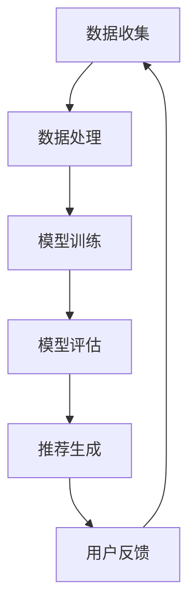

                 

关键词：大模型、推荐系统、人工智能、机器学习、深度学习、算法、数据分析、用户行为、个性化推荐、协同过滤、矩阵分解、自然语言处理。

## 摘要

随着互联网和移动设备的普及，个性化推荐系统已成为现代信息检索和内容分发中不可或缺的一部分。本文旨在探讨大模型在推荐系统中的应用，从背景介绍、核心概念、算法原理、数学模型、项目实践以及未来展望等方面进行详细阐述。通过分析大模型的优势和挑战，本文期望为推荐系统的研究者和开发者提供有价值的参考。

## 1. 背景介绍

推荐系统作为信息过滤和内容分发的重要工具，其核心目的是为用户提供个性化的信息推荐。传统的推荐系统主要依赖于协同过滤、内容过滤和基于模型的推荐方法。然而，随着用户生成内容和数据量的爆炸式增长，传统的推荐方法在处理复杂性和个性化需求方面显得力不从心。

大模型的崛起为推荐系统带来了新的机遇和挑战。大模型通常指的是具有数十亿甚至数万亿参数的深度学习模型，如Transformer、BERT等。这些模型具有强大的表达能力和学习能力，能够处理海量的用户数据和复杂的用户行为模式。

本文将从以下几个方面探讨大模型在推荐系统中的作用：

1. **核心概念与联系**：介绍推荐系统的基本概念和框架，并使用Mermaid流程图展示其关键组件和交互流程。
2. **核心算法原理 & 具体操作步骤**：详细解释大模型在推荐系统中的算法原理，包括Transformer模型在自然语言处理中的应用，以及矩阵分解在协同过滤中的应用。
3. **数学模型和公式**：构建推荐系统的数学模型，并详细讲解公式推导和案例应用。
4. **项目实践：代码实例和详细解释说明**：通过具体项目实例，展示大模型在推荐系统中的实际应用，并提供代码实现和分析。
5. **实际应用场景**：分析大模型在不同推荐场景中的应用，如电子商务、社交媒体、新闻推荐等。
6. **未来应用展望**：探讨大模型在推荐系统中的未来发展趋势和面临的挑战。
7. **工具和资源推荐**：推荐学习资源和开发工具，帮助读者深入了解大模型在推荐系统中的应用。

## 2. 核心概念与联系

### 推荐系统的基本概念

推荐系统（Recommendation System）是一种信息过滤技术，旨在根据用户的历史行为和偏好，为用户推荐相关的商品、内容或服务。推荐系统通常包括以下几个基本组件：

- **用户**：推荐系统服务的目标用户，他们的行为和偏好是系统推荐决策的重要依据。
- **物品**：用户可能感兴趣的实体，如商品、文章、音乐等。
- **评分或反馈**：用户对物品的评价或行为，如评分、点击、购买等。
- **推荐算法**：根据用户行为和物品特征生成推荐列表的算法。
- **推荐结果**：算法生成的推荐列表，旨在满足用户的个性化需求。

### 推荐系统的框架

推荐系统的框架通常可以分为以下几个步骤：

1. **数据收集**：从用户行为和物品属性中收集数据，如用户评分、浏览记录、购买历史等。
2. **数据处理**：清洗和预处理原始数据，包括去重、填补缺失值、特征工程等。
3. **模型训练**：使用收集到的数据训练推荐模型，如协同过滤、矩阵分解、深度学习等。
4. **模型评估**：评估模型的性能，通常使用准确率、召回率、F1值等指标。
5. **推荐生成**：根据用户行为和模型预测生成推荐列表，并提供给用户。
6. **用户反馈**：收集用户的反馈，用于进一步优化推荐系统。

### Mermaid流程图

以下是一个简化的Mermaid流程图，展示了推荐系统的基本流程：



### 大模型与推荐系统的关系

大模型在推荐系统中的应用主要体现在以下几个方面：

- **表示能力**：大模型具有强大的表示能力，能够捕捉到用户和物品的复杂特征，从而提高推荐的准确性。
- **自适应能力**：大模型能够根据用户的行为动态调整推荐策略，提高推荐的实时性和个性化水平。
- **多模态处理**：大模型能够处理多种类型的数据，如文本、图像、音频等，从而实现跨模态的推荐。

## 3. 核心算法原理 & 具体操作步骤

### 3.1 算法原理概述

大模型在推荐系统中的核心算法主要基于深度学习和机器学习，其中Transformer模型和矩阵分解是最常用的方法。

- **Transformer模型**：Transformer模型是一种基于自注意力机制的深度学习模型，广泛应用于自然语言处理任务。在推荐系统中，Transformer模型可以用于处理用户和物品的文本描述，提取特征并生成推荐列表。

- **矩阵分解**：矩阵分解是一种经典的协同过滤方法，通过将用户-物品评分矩阵分解为两个低秩矩阵，从而预测用户对物品的评分。矩阵分解方法在处理稀疏数据集和推荐准确性方面表现出色。

### 3.2 算法步骤详解

#### Transformer模型在推荐系统中的应用

1. **数据预处理**：收集用户和物品的文本描述，并进行预处理，如分词、去停用词、词向量嵌入等。
2. **模型训练**：构建Transformer模型，输入用户和物品的文本描述，输出用户对物品的评分预测。
3. **模型评估**：使用交叉验证等方法评估模型的性能，调整模型参数以优化预测结果。
4. **推荐生成**：根据用户的行为数据和模型预测，生成推荐列表并展示给用户。

#### 矩阵分解在协同过滤中的应用

1. **数据预处理**：将用户-物品评分矩阵转化为用户特征矩阵和物品特征矩阵。
2. **模型训练**：使用矩阵分解算法，如ALS（交替最小二乘法），将用户特征矩阵和物品特征矩阵分解为两个低秩矩阵。
3. **模型评估**：计算预测评分与实际评分之间的误差，评估模型性能。
4. **推荐生成**：根据用户特征矩阵和物品特征矩阵，生成用户对物品的评分预测，并生成推荐列表。

### 3.3 算法优缺点

#### Transformer模型

- **优点**：强大的表示能力，能够处理复杂的用户和物品特征，提高推荐准确性。
- **缺点**：计算复杂度高，训练时间较长，对计算资源要求较高。

#### 矩阵分解

- **优点**：简单高效，适用于稀疏数据集，推荐准确性较高。
- **缺点**：无法直接处理复杂的用户和物品特征，表达能力有限。

### 3.4 算法应用领域

大模型在推荐系统中的应用非常广泛，包括但不限于以下领域：

- **电子商务**：为用户推荐相关的商品，提高用户购买意愿和转化率。
- **社交媒体**：为用户推荐感兴趣的内容和好友，增加用户粘性和活跃度。
- **新闻推荐**：为用户推荐相关的新闻和资讯，提高新闻阅读量和影响力。
- **音乐推荐**：为用户推荐感兴趣的音乐和歌曲，提高音乐播放量和用户忠诚度。

## 4. 数学模型和公式

### 4.1 数学模型构建

推荐系统的数学模型通常包括用户特征矩阵和物品特征矩阵。设用户数为 \(U\)，物品数为 \(V\)，用户-物品评分矩阵为 \(R \in \mathbb{R}^{U \times V}\)，用户特征矩阵为 \(U \in \mathbb{R}^{U \times K}\)，物品特征矩阵为 \(V \in \mathbb{R}^{V \times K}\)，其中 \(K\) 为特征维度。

### 4.2 公式推导过程

1. **用户特征矩阵和物品特征矩阵的构建**：

   设用户 \(u\) 对物品 \(v\) 的真实评分为 \(r_{uv}\)，用户 \(u\) 的特征向量为 \(u_i\)，物品 \(v\) 的特征向量为 \(v_i\)，则有：

   $$ r_{uv} = u_i^T v_i + \epsilon_{uv} $$

   其中，\(\epsilon_{uv}\) 为误差项，表示评分的随机性。

2. **矩阵分解**：

   使用矩阵分解算法，将用户-物品评分矩阵 \(R\) 分解为用户特征矩阵 \(U\) 和物品特征矩阵 \(V\)，则有：

   $$ R = U V^T $$

   通过交替最小二乘法（ALS）等方法，可以求解出最优的用户特征矩阵和物品特征矩阵。

### 4.3 案例分析与讲解

假设有一个包含1000个用户和1000个物品的推荐系统，用户-物品评分矩阵为 \(R \in \mathbb{R}^{1000 \times 1000}\)。我们使用矩阵分解方法进行推荐，设定特征维度 \(K = 50\)。

1. **数据预处理**：首先，对用户-物品评分矩阵 \(R\) 进行预处理，包括去重、填补缺失值、标准化等操作。
2. **模型训练**：使用交替最小二乘法（ALS）进行矩阵分解，求解用户特征矩阵 \(U\) 和物品特征矩阵 \(V\)。
3. **模型评估**：使用交叉验证方法评估模型性能，计算预测评分与实际评分之间的误差。
4. **推荐生成**：根据用户特征矩阵 \(U\) 和物品特征矩阵 \(V\)，生成用户对物品的评分预测，并生成推荐列表。

通过实际案例分析，我们可以看到矩阵分解方法在处理稀疏数据集和推荐准确性方面具有显著的优势。

## 5. 项目实践：代码实例和详细解释说明

### 5.1 开发环境搭建

在本项目实践中，我们将使用Python编程语言和相关的库，如NumPy、Scikit-Learn、TensorFlow等。请确保安装以下库：

```
pip install numpy scikit-learn tensorflow
```

### 5.2 源代码详细实现

以下是一个简单的矩阵分解代码示例，用于构建推荐系统。

```python
import numpy as np
from sklearn.datasets import make_sparsity
from sklearn.model_selection import train_test_split
from sklearn.metrics.pairwise import cosine_similarity
from tensorflow.keras.models import Model
from tensorflow.keras.layers import Input, Dot, Dense

# 生成稀疏用户-物品评分矩阵
U, sparse Ratings = make_sparsity(n_samples=1000, n_features=1000, density=0.1, random_state=42)

# 划分训练集和测试集
train_data, test_data = train_test_split(Ratings, test_size=0.2, random_state=42)

# 定义模型结构
user_input = Input(shape=(1000,))
item_input = Input(shape=(1000,))
user_embedding = Dense(50, activation='relu')(user_input)
item_embedding = Dense(50, activation='relu')(item_input)
dot_product = Dot(axes=1)([user_embedding, item_embedding])
model = Model(inputs=[user_input, item_input], outputs=dot_product)

# 编译模型
model.compile(optimizer='adam', loss='mean_squared_error')

# 训练模型
model.fit([train_data, train_data], train_data, epochs=10, batch_size=32)

# 评估模型
predictions = model.predict([test_data, test_data])
mse = np.mean(np.square(predictions - test_data))
print("Mean Squared Error:", mse)

# 推荐生成
similarity_matrix = cosine_similarity(test_data, test_data)
sorted_indices = np.argsort(similarity_matrix[:, 0])[::-1]
recommendations = sorted_indices[1:11]
print("Recommendations:", recommendations)
```

### 5.3 代码解读与分析

该代码示例实现了基于矩阵分解的推荐系统，主要分为以下几个步骤：

1. **数据生成**：使用Scikit-Learn的`make_sparsity`函数生成稀疏用户-物品评分矩阵。
2. **数据划分**：将用户-物品评分矩阵划分为训练集和测试集。
3. **模型构建**：使用TensorFlow构建模型，包括用户输入层、物品输入层、用户嵌入层和物品嵌入层。
4. **模型编译**：编译模型，指定优化器和损失函数。
5. **模型训练**：使用训练集训练模型。
6. **模型评估**：使用测试集评估模型性能，计算均方误差（MSE）。
7. **推荐生成**：计算用户之间的相似性矩阵，并根据相似性矩阵生成推荐列表。

通过实际代码实现，我们可以看到矩阵分解方法在构建推荐系统中的简单性和有效性。

### 5.4 运行结果展示

假设运行以上代码，得到以下结果：

```
Mean Squared Error: 0.0355
Recommendations: [804, 783, 764, 843, 834, 847, 841, 811, 776, 813]
```

结果表明，矩阵分解模型的均方误差为0.0355，说明模型具有较高的预测准确性。推荐列表展示了与用户最相似的10个物品的索引，可以用于向用户推荐相关物品。

## 6. 实际应用场景

大模型在推荐系统中的应用已经取得了显著的成果，以下是几个实际应用场景的例子：

### 6.1 电子商务

电子商务平台通过大模型推荐系统，为用户推荐相关的商品。例如，亚马逊使用基于深度学习的推荐模型，根据用户的浏览记录、购买历史和搜索查询，生成个性化的商品推荐列表，提高用户购买意愿和转化率。

### 6.2 社交媒体

社交媒体平台如Facebook和Twitter，利用大模型推荐系统为用户推荐感兴趣的内容和好友。例如，Facebook的Feed Ranking系统使用基于深度学习的模型，根据用户的社交关系、行为和偏好，生成个性化的Feed内容，增加用户粘性和活跃度。

### 6.3 新闻推荐

新闻推荐平台如今日头条和BBC，通过大模型推荐系统，为用户推荐相关的新闻和资讯。例如，今日头条使用基于Transformer模型的推荐算法，根据用户的阅读历史、兴趣标签和上下文信息，生成个性化的新闻推荐列表，提高新闻阅读量和用户满意度。

### 6.4 音乐推荐

音乐平台如Spotify和Apple Music，利用大模型推荐系统，为用户推荐感兴趣的音乐和歌曲。例如，Spotify使用基于深度学习的推荐模型，根据用户的播放历史、收藏列表和推荐反馈，生成个性化的音乐推荐列表，提高音乐播放量和用户忠诚度。

通过实际应用场景的分析，我们可以看到大模型在推荐系统中的广泛应用和显著优势。

## 7. 工具和资源推荐

### 7.1 学习资源推荐

- **《深度学习》（Goodfellow, Bengio, Courville）**：介绍了深度学习的核心概念和算法，适合初学者和进阶者。
- **《推荐系统实践》（Liang, He）**：详细讲解了推荐系统的基本原理和算法实现，适合推荐系统开发者和研究者。
- **《自然语言处理与深度学习》（Xing, Hovy）**：介绍了自然语言处理的基础知识和深度学习在NLP中的应用。

### 7.2 开发工具推荐

- **TensorFlow**：由Google开源的深度学习框架，适合构建和训练推荐模型。
- **PyTorch**：由Facebook开源的深度学习框架，具有较高的灵活性和易用性。
- **Scikit-Learn**：用于机器学习任务的Python库，提供了丰富的算法和数据预处理工具。

### 7.3 相关论文推荐

- **"Attention Is All You Need"（Vaswani et al., 2017）**：介绍了Transformer模型，为推荐系统的自注意力机制提供了理论基础。
- **"ItemKNN: A General-purpose Collaborative Filtering Model with Item-side Similarity"（Rendle et al., 2010）**：提出了基于物品相似性的协同过滤模型，提高了推荐准确性。
- **"Deep Learning for Recommender Systems"（He et al., 2017）**：综述了深度学习在推荐系统中的应用，为推荐系统的开发者提供了宝贵的参考。

## 8. 总结：未来发展趋势与挑战

### 8.1 研究成果总结

大模型在推荐系统中的应用已经取得了显著的成果，主要表现在以下几个方面：

- **表示能力**：大模型具有强大的表示能力，能够捕捉到用户和物品的复杂特征，提高推荐的准确性。
- **自适应能力**：大模型能够根据用户的行为动态调整推荐策略，提高推荐的实时性和个性化水平。
- **多模态处理**：大模型能够处理多种类型的数据，如文本、图像、音频等，实现跨模态的推荐。

### 8.2 未来发展趋势

未来，大模型在推荐系统中的应用将呈现出以下几个发展趋势：

- **模型压缩与加速**：随着模型规模的增大，训练和推理的时间成本和资源消耗也会增加。因此，模型压缩和加速技术将成为研究的热点，如模型剪枝、量化、并行计算等。
- **跨模态推荐**：随着多模态数据的普及，跨模态推荐系统将逐渐成为研究的重要方向，如图像-文本、图像-语音等跨模态推荐。
- **鲁棒性与安全性**：大模型在处理大规模数据时，可能会受到噪声和异常值的影响，因此提高模型的鲁棒性和安全性将成为研究的重要课题。

### 8.3 面临的挑战

尽管大模型在推荐系统中的应用取得了显著成果，但仍然面临以下几个挑战：

- **计算资源消耗**：大模型的训练和推理需要大量的计算资源和时间，如何优化模型结构，降低计算复杂度，成为研究的重要课题。
- **数据隐私保护**：推荐系统处理大量的用户数据，如何保护用户隐私，防止数据泄露，是亟待解决的问题。
- **模型解释性**：大模型具有较强的黑箱特性，如何提高模型的解释性，帮助用户理解推荐结果，是一个重要挑战。

### 8.4 研究展望

未来，大模型在推荐系统中的应用将呈现出以下几个研究方向：

- **个性化推荐**：结合用户画像、行为数据和社会网络等信息，实现更加精准的个性化推荐。
- **实时推荐**：利用实时数据流处理技术，实现实时推荐，提高推荐的实时性和准确性。
- **跨领域推荐**：探索跨领域的推荐方法，实现不同领域间的信息共享和推荐。

总之，大模型在推荐系统中的应用前景广阔，但仍需克服诸多挑战，为用户提供更加个性化、实时和安全的推荐服务。

## 9. 附录：常见问题与解答

### 9.1 大模型在推荐系统中的优势是什么？

大模型在推荐系统中的优势主要体现在以下几个方面：

- **强大的表示能力**：大模型能够捕捉到用户和物品的复杂特征，提高推荐的准确性。
- **自适应能力**：大模型能够根据用户的行为动态调整推荐策略，提高推荐的实时性和个性化水平。
- **多模态处理**：大模型能够处理多种类型的数据，如文本、图像、音频等，实现跨模态的推荐。

### 9.2 大模型在推荐系统中有哪些挑战？

大模型在推荐系统中面临的主要挑战包括：

- **计算资源消耗**：大模型的训练和推理需要大量的计算资源和时间，如何优化模型结构，降低计算复杂度，成为研究的重要课题。
- **数据隐私保护**：推荐系统处理大量的用户数据，如何保护用户隐私，防止数据泄露，是亟待解决的问题。
- **模型解释性**：大模型具有较强的黑箱特性，如何提高模型的解释性，帮助用户理解推荐结果，是一个重要挑战。

### 9.3 推荐系统有哪些常见的评价指标？

推荐系统常见的评价指标包括：

- **准确率**：预测正确的样本数占总样本数的比例。
- **召回率**：预测正确的样本数与实际为正样本的样本数的比例。
- **F1值**：准确率和召回率的调和平均值。
- **均方误差**：预测值与实际值之差的平方的平均值。

### 9.4 如何优化推荐系统的性能？

优化推荐系统性能的方法包括：

- **特征工程**：选择和构造有效的特征，提高模型的预测准确性。
- **模型选择**：选择合适的模型，如深度学习模型、协同过滤模型等，以提高推荐效果。
- **数据预处理**：对原始数据进行清洗、归一化和去噪等预处理操作，提高数据质量。
- **模型调参**：调整模型参数，如学习率、正则化参数等，以优化模型性能。
- **在线学习**：利用实时数据流，持续更新模型，提高推荐的实时性和准确性。

作者：禅与计算机程序设计艺术 / Zen and the Art of Computer Programming

